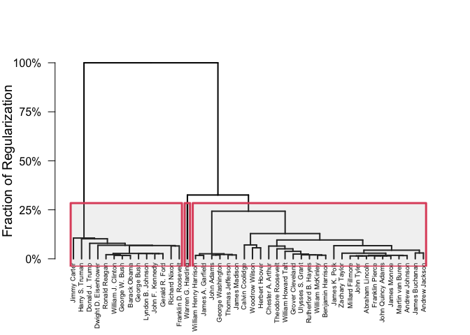
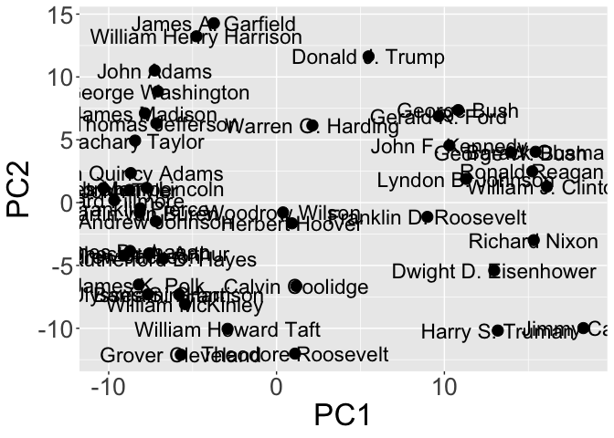
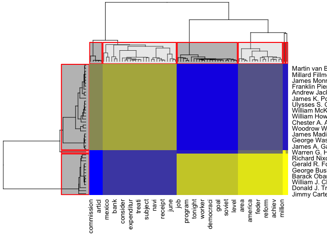

<!-- README.md is generated from README.Rmd. Please edit that file -->

[](https://github.com/DataSlingers/clustRviz/actions?query=workflow%3A%22R-CMD-check+and+Deploy%22)
[](https://codecov.io/gh/DataSlingers/clustRviz/branch/develop)
[](https://www.gnu.org/licenses/gpl-3.0)
[](https://cran.r-project.org/package=clustRviz)
[](http://www.repostatus.org/#active)

# clustRviz

`clustRviz` aims to enable fast computation and easy visualization of
Convex Clustering solution paths.

## Installation

You can install `clustRviz` from github with:

``` r
# install.packages("devtools")
devtools::install_github("DataSlingers/clustRviz")
```

Note that `RcppEigen` (which `clustRviz` internally) triggers many
compiler warnings (which cannot be suppressed per [CRAN
policies](http://cran.r-project.org/web/packages/policies.html#Source-packages)).
Many of these warnings can be locally suppressed by adding the line
`CXX11FLAGS+=-Wno-ignored-attributes` to your `~/.R/Makevars` file.

`clustRviz` also depends on the development version of the `gganimate`
package, which is not yet on CRAN, but may be found
[here](https://github.com/thomasp85/gganimate).

## Quick-Start

There are two main entry points to the `clustRviz` package, the `CARP`
and `CBASS` functions, which perform convex clustering and convex
biclustering respectively. We demonstrate the use of these two functions
on a text minining data set, `presidential_speech`, which measures how
often the 44 U.S. presidents used certain words in their public
addresses.

``` r
library(clustRviz)
#> Registered S3 method overwritten by 'seriation':
#>   method         from 
#>   reorder.hclust gclus
data(presidential_speech)
presidential_speech[1:6, 1:6]
#>                     amount appropri  british     cent commerci commission
#> Abraham Lincoln   3.433987 2.397895 1.791759 2.564949 2.708050   2.079442
#> Andrew Jackson    4.248495 4.663439 2.995732 1.945910 3.828641   3.218876
#> Andrew Johnson    4.025352 3.091042 2.833213 3.332205 2.772589   2.079442
#> Barack Obama      1.386294 0.000000 0.000000 1.386294 0.000000   0.000000
#> Benjamin Harrison 4.060443 4.174387 2.302585 4.304065 3.663562   3.465736
#> Calvin Coolidge   3.713572 4.094345 1.386294 3.555348 2.639057   1.609438
```

### Clustering

We begin by clustering this data set, grouping the rows (presidents)
into clusters:

``` r
carp_fit <- CARP(presidential_speech)
#> Pre-computing weights and edge sets
#> Computing Convex Clustering [CARP] Path
#> Post-processing
print(carp_fit)
#> CARP Fit Summary
#> ====================
#> 
#> Algorithm: CARP (t = 1.05) 
#> Fit Time: 0.129 secs 
#> Total Time: 0.754 secs 
#> 
#> Number of Observations: 44 
#> Number of Variables:    75 
#> 
#> Pre-processing options:
#>  - Columnwise centering: TRUE 
#>  - Columnwise scaling:   FALSE 
#> 
#> Weights:
#>  - Source: Radial Basis Function Kernel Weights
#>  - Distance Metric: Euclidean
#>  - Scale parameter (phi): 0.01 [Data-Driven]
#>  - Sparsified: 4 Nearest Neighbors [Data-Driven]
```

The algorithmic regularization technique employed by `CARP` makes
computation of the whole solution path almost immediate.

We can examine the result of `CARP` graphically. We begin with a
standard dendrogram, with three clusters highlighted:

``` r
plot(carp_fit, type = "dendrogram", k = 3)
```

<!-- -->

Examing the dendrogram, we see two clear clusters, consisting of
pre-WWII and post-WWII presidents and Warren G. Harding as a possible
outlier. Harding is generally considered one of the worst US presidents
of all time, so this is perhaps not too surprising.

A more interesting visualization is the dynamic path visualization,
whereby we can watch the clusters fuse as the regularization level is
increased:

``` r
plot(carp_fit, type = "dynamic_path")
```



`clustRviz` also provides interactive dendrograms using the
[`heatmaply`](https://cran.r-project.org/package=heatmaply) package:

``` r
plot(carp_fit, type = "js")
#> Warning in doTryCatch(return(expr), name, parentenv, handler): unable to load shared object '/Library/Frameworks/R.framework/Resources/modules//R_X11.so':
#>   dlopen(/Library/Frameworks/R.framework/Resources/modules//R_X11.so, 6): Library not loaded: /opt/X11/lib/libSM.6.dylib
#>   Referenced from: /Library/Frameworks/R.framework/Versions/4.0/Resources/modules/R_X11.so
#>   Reason: image not found
#> PhantomJS not found. You can install it with webshot::install_phantomjs(). If it is installed, please make sure the phantomjs executable can be found via the PATH variable.
```

<!--html_preserve-->

<div id="htmlwidget-9256e9000ddfb4d54a64" class="plotly html-widget" style="width:672px;height:480px;">

</div>

<script type="application/json" data-for="htmlwidget-9256e9000ddfb4d54a64">{"x":{"data":[{"x":[1,2,3,4,5,6,7,8,9,10,11,12,13,14,15,16,17,18,19,20,21,22,23,24,25,26,27,28,29,30,31,32,33,34,35,36,37,38,39,40,41,42,43,44,45,46,47,48,49,50,51,52,53,54,55,56,57,58,59,60,61,62,63,64,65,66,67,68,69,70,71,72,73,74,75],"y":[1,2,3,4,5,6,7,8,9,10,11,12,13,14,15,16,17,18,19,20,21,22,23,24,25,26,27,28,29,30,31,32,33,34,35,36,37,38,39,40,41,42,43,44],"z":[[0.635444750598987,0.697507640531607,0.4480697844707,0.291048552229996,0.572647476039401,0.481445224534564,0.70304788014676,0.267992332388204,0.590985027936302,0.164318746286495,0.602069310535123,0.32863749257299,0,0.64172130935952,0.593834054429898,0.383637855732884,0.103673586101709,0.371665918489913,0.487311441834593,0.522970428064263,0.358651681777768,0.164318746286495,0.645763970821059,0.481445224534564,0.358651681777768,0.64774505102223,0.619686044802985,0.707072410889015,0.799049560596581,0.503644310978824,0.690280661440456,0.725715102711963,0.861355301803347,0.599374294045051,0.358651681777768,0.749437556922768,0.240722612267282,0.207347172203418,0.475339504591622,0.531771164497278,0.531771164497278,0.267992332388204,0.103673586101709,0.311020758305127,0,0.207347172203418,0,0.582097104459991,0.498395724433414,0.207347172203418,0.103673586101709,0.103673586101709,0.164318746286495,0.164318746286495,0.103673586101709,0.103673586101709,0,0,0,0,0,0,0,0,0,0,0,0,0,0,0,0,0,0,0],[0.67136250742701,0.614860808012446,0.547956602019379,0.267992332388204,0.492956238859484,0.383637855732884,0.531771164497278,0.207347172203418,0.585118810636273,0.103673586101709,0.522970428064263,0.609874700683635,0.103673586101709,0.481445224534564,0.358651681777768,0.518367930508545,0.631109103013321,0.45536729851649,0.607317897080533,0.487311441834593,0.423761930809903,0.267992332388204,0.582097104459991,0.423761930809903,0.164318746286495,0.518367930508545,0.518367930508545,0.760022442167688,0.637566337497706,0.755303774222797,0.631109103013321,0.709696502204974,0.759090542775827,0.535984664776408,0.423761930809903,0.609874700683635,0,0.32863749257299,0.405041358553777,0.487311441834593,0.540082712044371,0,0.371665918489913,0.267992332388204,0,0.164318746286495,0.207347172203418,0.487311441834593,0.45536729851649,0,0,0.103673586101709,0,0,0,0.103673586101709,0,0.103673586101709,0,0,0,0,0,0.164318746286495,0,0,0,0,0,0,0,0,0,0.240722612267282,0],[0.602069310535123,0.462325267879477,0.423761930809903,0.498395724433414,0.414694344406836,0.311020758305127,0.544071464920521,0.344396198368991,0.585118810636273,0,0.4480697844707,0.535984664776408,0.103673586101709,0.383637855732884,0.371665918489913,0.45536729851649,0.540082712044371,0.423761930809903,0.4480697844707,0.423761930809903,0.4480697844707,0.531771164497278,0.462325267879477,0.468973889937692,0.164318746286495,0.4480697844707,0.551743370572409,0.612388530757195,0.599374294045051,0.440397878818812,0.522970428064263,0.498395724433414,0.708390211207016,0.492956238859484,0.267992332388204,0.468973889937692,0.207347172203418,0.540082712044371,0.207347172203418,0.358651681777768,0.32863749257299,0,0.207347172203418,0.207347172203418,0,0.103673586101709,0,0.344396198368991,0,0.103673586101709,0.103673586101709,0,0,0.164318746286495,0.103673586101709,0.240722612267282,0.103673586101709,0.164318746286495,0.103673586101709,0.103673586101709,0,0,0,0,0,0,0,0,0,0,0,0,0,0,0],[0.540082712044371,0.527435516911612,0.358651681777768,0.164318746286495,0.487311441834593,0.358651681777768,0.572647476039401,0.32863749257299,0.508714944655486,0.164318746286495,0.522970428064263,0.405041358553777,0,0.609874700683635,0.487311441834593,0.291048552229996,0.311020758305127,0.432311078674699,0.423761930809903,0.405041358553777,0.240722612267282,0.103673586101709,0.518367930508545,0.414694344406836,0.311020758305127,0.527435516911612,0.544071464920521,0.503644310978824,0.696089910783772,0.531771164497278,0.619686044802985,0.535984664776408,0.768158129178894,0.462325267879477,0.311020758305127,0.744366923246106,0.207347172203418,0.508714944655486,0.518367930508545,0.240722612267282,0.405041358553777,0.103673586101709,0.103673586101709,0.267992332388204,0,0.240722612267282,0,0.207347172203418,0.164318746286495,0,0,0,0,0,0.103673586101709,0,0,0,0,0,0,0,0,0,0,0,0,0,0,0,0,0,0,0.103673586101709,0],[0.602069310535123,0.531771164497278,0.518367930508545,0,0.468973889937692,0.423761930809903,0.651630188121088,0.207347172203418,0.4480697844707,0,0,0.164318746286495,0,0.522970428064263,0.487311441834593,0.462325267879477,0.207347172203418,0.291048552229996,0.371665918489913,0.475339504591622,0.267992332388204,0.207347172203418,0.535984664776408,0.440397878818812,0,0.522970428064263,0.535984664776408,0.579013090693331,0.62889321998757,0.626644014165972,0.572647476039401,0.669672440082896,0.475339504591622,0.607317897080533,0.344396198368991,0.383637855732884,0,0,0.423761930809903,0.698912058066488,0.596629824961193,0,0,0.207347172203418,0,0.164318746286495,0.207347172203418,0.103673586101709,0.164318746286495,0,0,0,0,0,0,0.164318746286495,0,0,0,0,0,0,0,0,0,0,0,0,0,0,0,0,0,0,0],[0.547956602019379,0.492956238859484,0.481445224534564,0,0.547956602019379,0.440397878818812,0.547956602019379,0.164318746286495,0.492956238859484,0,0.311020758305127,0.103673586101709,0,0.383637855732884,0.535984664776408,0.311020758305127,0,0.371665918489913,0.32863749257299,0.518367930508545,0.291048552229996,0,0.468973889937692,0.508714944655486,0,0.358651681777768,0.575864145573994,0.487311441834593,0.544071464920521,0.468973889937692,0.487311441834593,0.593834054429898,0.759090542775827,0.503644310978824,0.394722138331705,0.103673586101709,0.267992332388204,0,0.164318746286495,0.291048552229996,0.462325267879477,0.103673586101709,0.164318746286495,0.103673586101709,0,0.207347172203418,0.267992332388204,0.103673586101709,0.291048552229996,0,0,0,0,0,0,0.164318746286495,0,0,0,0.103673586101709,0,0,0,0,0.103673586101709,0,0,0,0,0,0,0,0,0,0],[0.604716625105307,0.475339504591622,0.531771164497278,0.103673586101709,0.481445224534564,0.267992332388204,0.64774505102223,0.344396198368991,0.522970428064263,0,0.440397878818812,0.475339504591622,0,0.394722138331705,0.45536729851649,0.383637855732884,0.423761930809903,0.405041358553777,0.468973889937692,0.4480697844707,0.344396198368991,0.103673586101709,0.540082712044371,0.432311078674699,0.267992332388204,0.596629824961193,0.503644310978824,0.535984664776408,0.687289174350758,0.679537731675704,0.522970428064263,0.617292883851372,0.712275348305874,0.423761930809903,0.544071464920521,0,0.240722612267282,0.383637855732884,0.103673586101709,0.4480697844707,0.45536729851649,0.164318746286495,0.240722612267282,0.291048552229996,0,0.267992332388204,0,0.164318746286495,0.207347172203418,0,0,0,0.103673586101709,0,0,0.103673586101709,0.103673586101709,0,0,0.164318746286495,0,0,0,0,0.103673586101709,0,0,0,0,0,0,0,0,0,0],[0.513619297749663,0.358651681777768,0.267992332388204,0.383637855732884,0.405041358553777,0.311020758305127,0.531771164497278,0.311020758305127,0.440397878818812,0.103673586101709,0.240722612267282,0.383637855732884,0.103673586101709,0.492956238859484,0.371665918489913,0.32863749257299,0.394722138331705,0.240722612267282,0.311020758305127,0.518367930508545,0.383637855732884,0.405041358553777,0.432311078674699,0.475339504591622,0.103673586101709,0.423761930809903,0.562560326257277,0.609874700683635,0.544071464920521,0.518367930508545,0.503644310978824,0.475339504591622,0.666233912358986,0.475339504591622,0.267992332388204,0.371665918489913,0.207347172203418,0.267992332388204,0.164318746286495,0.240722612267282,0.358651681777768,0.164318746286495,0.164318746286495,0.291048552229996,0.103673586101709,0.164318746286495,0.164318746286495,0,0,0,0,0,0,0,0,0.103673586101709,0,0,0,0,0,0,0,0,0,0,0,0,0,0,0,0,0,0,0],[0.609874700683635,0.45536729851649,0.432311078674699,0.240722612267282,0.423761930809903,0.32863749257299,0.593834054429898,0.207347172203418,0.440397878818812,0,0.240722612267282,0.311020758305127,0,0.383637855732884,0.371665918489913,0.164318746286495,0.267992332388204,0.32863749257299,0.596629824961193,0.414694344406836,0.207347172203418,0.240722612267282,0.432311078674699,0.311020758305127,0.103673586101709,0.579013090693331,0.522970428064263,0.518367930508545,0.62889321998757,0.522970428064263,0.612388530757195,0.588080677096398,0.704401458330865,0.32863749257299,0,0.518367930508545,0.207347172203418,0.383637855732884,0.291048552229996,0.291048552229996,0.440397878818812,0.103673586101709,0.164318746286495,0.103673586101709,0,0.103673586101709,0.103673586101709,0.405041358553777,0.267992332388204,0,0,0,0,0,0,0.103673586101709,0,0,0,0,0,0,0,0,0,0,0,0,0,0,0,0,0,0.164318746286495,0],[0.513619297749663,0.565998853981186,0.423761930809903,0.32863749257299,0.423761930809903,0.423761930809903,0.522970428064263,0.164318746286495,0.4480697844707,0.164318746286495,0,0.508714944655486,0,0.508714944655486,0.394722138331705,0.468973889937692,0.394722138331705,0.371665918489913,0.551743370572409,0.527435516911612,0.103673586101709,0.267992332388204,0.565998853981186,0.371665918489913,0.164318746286495,0.544071464920521,0.572647476039401,0.614860808012446,0.660923199387536,0.535984664776408,0.531771164497278,0.498395724433414,0.67632106214111,0.394722138331705,0.240722612267282,0.103673586101709,0,0.240722612267282,0.414694344406836,0.267992332388204,0.522970428064263,0,0.103673586101709,0,0,0.103673586101709,0.103673586101709,0.267992332388204,0.358651681777768,0,0,0,0.164318746286495,0.240722612267282,0,0,0,0.103673586101709,0,0,0,0,0,0,0,0,0,0,0,0,0,0,0,0,0],[0.240722612267282,0.405041358553777,0.383637855732884,0.240722612267282,0.164318746286495,0.32863749257299,0.423761930809903,0.164318746286495,0.344396198368991,0,0,0.32863749257299,0,0.291048552229996,0.383637855732884,0.423761930809903,0.32863749257299,0.358651681777768,0.513619297749663,0.423761930809903,0.164318746286495,0,0.45536729851649,0.164318746286495,0,0.32863749257299,0.423761930809903,0.579013090693331,0.513619297749663,0.503644310978824,0.45536729851649,0.572647476039401,0.547956602019379,0.468973889937692,0.291048552229996,0,0.164318746286495,0,0.164318746286495,0.164318746286495,0,0,0,0,0,0.240722612267282,0.103673586101709,0,0.164318746286495,0,0,0,0.164318746286495,0,0,0,0,0,0,0,0,0,0,0,0,0,0,0,0,0,0,0,0,0,0],[0.712275348305874,0.562560326257277,0.527435516911612,0.45536729851649,0.527435516911612,0.522970428064263,0.635444750598987,0.423761930809903,0.579013090693331,0.164318746286495,0.518367930508545,0.522970428064263,0,0.555436629045157,0.468973889937692,0.311020758305127,0.498395724433414,0.535984664776408,0.880795757637624,0.585118810636273,0.371665918489913,0.45536729851649,0.590985027936302,0.432311078674699,0.207347172203418,0.522970428064263,0.579013090693331,0.708390211207016,0.694658614038011,0.765495102715367,0.697507640531607,0.707072410889015,0.829971805998807,0.572647476039401,0.432311078674699,0.633292636224187,0.267992332388204,0.531771164497278,0.602069310535123,0.468973889937692,0.617292883851372,0.207347172203418,0.394722138331705,0.291048552229996,0,0.291048552229996,0.207347172203418,0.544071464920521,0.540082712044371,0,0,0.103673586101709,0,0.291048552229996,0.103673586101709,0.405041358553777,0,0.164318746286495,0,0.103673586101709,0,0,0,0,0,0,0,0,0,0,0,0,0,0.207347172203418,0],[0.607317897080533,0.624360468000166,0.344396198368991,0.64375629814608,0.547956602019379,0.518367930508545,0.639658250878117,0.531771164497278,0.559040884618199,0.440397878818812,0.405041358553777,0.590985027936302,0.32863749257299,0.649700234007764,0.414694344406836,0.462325267879477,0.555436629045157,0.535984664776408,0.371665918489913,0.487311441834593,0.547956602019379,0.655416956674118,0.585118810636273,0.487311441834593,0.414694344406836,0.4480697844707,0.660923199387536,0.626644014165972,0.673033690941981,0.569360104840272,0.590985027936302,0.551743370572409,0.836240392190988,0.599374294045051,0.383637855732884,0.462325267879477,0.267992332388204,0.164318746286495,0.522970428064263,0.383637855732884,0.414694344406836,0,0.4480697844707,0.207347172203418,0.164318746286495,0.468973889937692,0.503644310978824,0.462325267879477,0.572647476039401,0.103673586101709,0.103673586101709,0.267992332388204,0.639658250878117,0.405041358553777,0.164318746286495,0.267992332388204,0,0.311020758305127,0,0.164318746286495,0,0,0.103673586101709,0,0.103673586101709,0,0,0,0.103673586101709,0,0,0,0,0,0],[0.609874700683635,0.619686044802985,0.503644310978824,0.487311441834593,0.599374294045051,0.547956602019379,0.653535556162435,0.569360104840272,0.518367930508545,0.311020758305127,0.544071464920521,0.475339504591622,0.371665918489913,0.492956238859484,0.440397878818812,0.803282938524559,0.565998853981186,0.32863749257299,0.45536729851649,0.588080677096398,0.614860808012446,0.540082712044371,0.633292636224187,0.508714944655486,0.405041358553777,0.602069310535123,0.666233912358986,0.762783801248575,0.67632106214111,0.662714470719908,0.602069310535123,0.688792396737982,0.819735702960613,0.565998853981186,0.423761930809903,0.462325267879477,0.344396198368991,0.394722138331705,0.383637855732884,0.687289174350758,0.522970428064263,0.291048552229996,0.414694344406836,0.267992332388204,0.103673586101709,0.487311441834593,0.344396198368991,0.371665918489913,0.414694344406836,0,0,0.267992332388204,0.468973889937692,0.164318746286495,0.103673586101709,0.405041358553777,0,0.475339504591622,0.164318746286495,0.45536729851649,0,0.164318746286495,0.103673586101709,0,0,0,0.164318746286495,0,0,0,0.103673586101709,0,0,0,0],[0.607317897080533,0.684236632308262,0.32863749257299,0.462325267879477,0.547956602019379,0.562560326257277,0.639658250878117,0.45536729851649,0.596629824961193,0.267992332388204,0.267992332388204,0.588080677096398,0.240722612267282,0.691754263198107,0.358651681777768,0.383637855732884,0.535984664776408,0.423761930809903,0.4480697844707,0.423761930809903,0.513619297749663,0.475339504591622,0.565998853981186,0.498395724433414,0.462325267879477,0.535984664776408,0.688792396737982,0.544071464920521,0.662714470719908,0.590985027936302,0.547956602019379,0.582097104459991,0.758152800716393,0.383637855732884,0.371665918489913,0.103673586101709,0.103673586101709,0.291048552229996,0.240722612267282,0.311020758305127,0.344396198368991,0,0.540082712044371,0.207347172203418,0,0.562560326257277,0.527435516911612,0.358651681777768,0.103673586101709,0,0,0,0.487311441834593,0.164318746286495,0.103673586101709,0.164318746286495,0,0.164318746286495,0,0.291048552229996,0,0,0,0,0.103673586101709,0,0,0,0,0,0,0,0,0,0],[0.690280661440456,0.67632106214111,0.540082712044371,0.498395724433414,0.508714944655486,0.596629824961193,0.64774505102223,0.440397878818812,0.593834054429898,0.240722612267282,0.267992332388204,0.596629824961193,0,0.637566337497706,0.405041358553777,0.540082712044371,0.575864145573994,0.575864145573994,0.487311441834593,0.617292883851372,0.468973889937692,0.575864145573994,0.590985027936302,0.522970428064263,0.513619297749663,0.588080677096398,0.738046150255993,0.602069310535123,0.748437089188881,0.690280661440456,0.569360104840272,0.684236632308262,0.80047404154027,0.596629824961193,0.311020758305127,0.462325267879477,0.207347172203418,0.383637855732884,0.394722138331705,0.590985027936302,0.565998853981186,0.207347172203418,0.207347172203418,0.311020758305127,0.32863749257299,0.569360104840272,0.383637855732884,0.414694344406836,0.394722138331705,0.164318746286495,0.103673586101709,0.207347172203418,0.468973889937692,0.103673586101709,0,0.164318746286495,0,0.32863749257299,0,0.207347172203418,0,0,0,0,0,0,0,0,0,0,0,0,0,0.291048552229996,0],[0.790962760452467,0.684236632308262,0.527435516911612,0.707072410889015,0.588080677096398,0.612388530757195,0.732566806089279,0.531771164497278,0.687289174350758,0.414694344406836,0.579013090693331,0.730317600267681,0.207347172203418,0.739118336700696,0.513619297749663,0.582097104459991,0.694658614038011,0.547956602019379,0.531771164497278,0.624360468000166,0.690280661440456,0.697507640531607,0.64774505102223,0.596629824961193,0.602069310535123,0.62889321998757,0.783211317777412,0.659110215146866,0.755303774222797,0.649700234007764,0.743331836979826,0.722167836801846,0.89235280038837,0.67136250742701,0.358651681777768,0.64172130935952,0.414694344406836,0.462325267879477,0.612388530757195,0.596629824961193,0.518367930508545,0.291048552229996,0.588080677096398,0.4480697844707,0.291048552229996,0.383637855732884,0.492956238859484,0.358651681777768,0.64774505102223,0.164318746286495,0.164318746286495,0,0.562560326257277,0.503644310978824,0.164318746286495,0.32863749257299,0,0.45536729851649,0,0.405041358553777,0,0,0,0,0.207347172203418,0,0,0,0.103673586101709,0,0.103673586101709,0,0.267992332388204,0,0],[0.645763970821059,0.67468640796288,0.394722138331705,0.626644014165972,0.62889321998757,0.540082712044371,0.673033690941981,0.633292636224187,0.617292883851372,0.383637855732884,0.649700234007764,0.540082712044371,0.405041358553777,0.291048552229996,0.358651681777768,0.569360104840272,0.547956602019379,0.522970428064263,0.518367930508545,0.691754263198107,0.712275348305874,0.633292636224187,0.687289174350758,0.440397878818812,0.62889321998757,0.593834054429898,0.707072410889015,0.722167836801846,0.657274985145979,0.462325267879477,0.590985027936302,0.64172130935952,0.825841422903555,0.531771164497278,0.562560326257277,0.691754263198107,0.432311078674699,0.475339504591622,0.547956602019379,0.103673586101709,0.432311078674699,0.475339504591622,0.4480697844707,0.540082712044371,0.103673586101709,0.440397878818812,0.462325267879477,0.693213488124052,0.717303363555537,0,0.103673586101709,0.164318746286495,0.645763970821059,0.405041358553777,0,0.267992332388204,0.103673586101709,0.267992332388204,0,0.487311441834593,0,0.267992332388204,0,0.103673586101709,0.103673586101709,0,0,0.32863749257299,0.103673586101709,0,0.207347172203418,0,0,0,0],[0.655416956674118,0.637566337497706,0.267992332388204,0.562560326257277,0.64172130935952,0.4480697844707,0.698912058066488,0.748437089188881,0.547956602019379,0.544071464920521,0.662714470719908,0.440397878818812,0.617292883851372,0.645763970821059,0.32863749257299,0.744366923246106,0.522970428064263,0.522970428064263,0.508714944655486,0.752399423382893,0.849068481562938,0.569360104840272,0.673033690941981,0.45536729851649,0.462325267879477,0.690280661440456,0.653535556162435,0.723359630904694,0.714810483039899,0.664484543077185,0.487311441834593,0.67468640796288,0.897997597413261,0.544071464920521,0.547956602019379,0.582097104459991,0.462325267879477,0.547956602019379,0.383637855732884,0.311020758305127,0.358651681777768,0.462325267879477,0.498395724433414,0.540082712044371,0.487311441834593,0.651630188121088,0.596629824961193,0.540082712044371,0.624360468000166,0.164318746286495,0.311020758305127,0.604716625105307,0.64774505102223,0.614860808012446,0.207347172203418,0.531771164497278,0.240722612267282,0.414694344406836,0.164318746286495,0.619686044802985,0,0.164318746286495,0.240722612267282,0.103673586101709,0.414694344406836,0,0.103673586101709,0.240722612267282,0.344396198368991,0.103673586101709,0.240722612267282,0,0.602069310535123,0.240722612267282,0],[0.590985027936302,0.572647476039401,0.383637855732884,0.593834054429898,0.503644310978824,0.468973889937692,0.585118810636273,0.383637855732884,0.555436629045157,0,0.344396198368991,0.513619297749663,0,0.596629824961193,0.498395724433414,0.291048552229996,0.481445224534564,0.405041358553777,0.45536729851649,0.513619297749663,0.481445224534564,0.569360104840272,0.596629824961193,0.45536729851649,0.164318746286495,0.498395724433414,0.662714470719908,0.604716625105307,0.637566337497706,0.617292883851372,0.547956602019379,0.64172130935952,0.736966222325896,0.569360104840272,0.371665918489913,0.4480697844707,0.164318746286495,0.423761930809903,0.103673586101709,0.32863749257299,0.358651681777768,0.164318746286495,0.405041358553777,0.103673586101709,0,0.432311078674699,0.267992332388204,0.503644310978824,0.394722138331705,0,0.103673586101709,0,0.414694344406836,0,0.164318746286495,0.164318746286495,0,0.164318746286495,0,0.291048552229996,0,0,0,0,0,0,0.291048552229996,0,0,0,0,0,0,0,0],[0.423761930809903,0.503644310978824,0.103673586101709,0.513619297749663,0.32863749257299,0.291048552229996,0.540082712044371,0.522970428064263,0.562560326257277,0.498395724433414,0.696089910783772,0.508714944655486,0.32863749257299,0,0,0,0.358651681777768,0.344396198368991,0.267992332388204,0.358651681777768,0.575864145573994,0.569360104840272,0.423761930809903,0.291048552229996,0.291048552229996,0,0.267992332388204,0.565998853981186,0.518367930508545,0.207347172203418,0.405041358553777,0.383637855732884,0.720966469953081,0.344396198368991,0.394722138331705,0.651630188121088,0.432311078674699,0.291048552229996,0.492956238859484,0,0,0,0.164318746286495,0.637566337497706,0.240722612267282,0.440397878818812,0.103673586101709,0.103673586101709,0.462325267879477,0.503644310978824,0,0,0.492956238859484,0.462325267879477,0,0,0.103673586101709,0.311020758305127,0.103673586101709,0.503644310978824,0.240722612267282,0.462325267879477,0,0.103673586101709,0.344396198368991,0,0,0.468973889937692,0,0,0.240722612267282,0,0.207347172203418,0.267992332388204,0],[0.358651681777768,0.462325267879477,0,0.291048552229996,0.207347172203418,0.207347172203418,0.508714944655486,0.562560326257277,0.492956238859484,0.344396198368991,0.440397878818812,0.414694344406836,0.311020758305127,0,0.164318746286495,0.358651681777768,0.240722612267282,0,0.358651681777768,0.414694344406836,0.633292636224187,0.291048552229996,0.440397878818812,0.32863749257299,0.371665918489913,0.513619297749663,0.414694344406836,0.68268667679504,0.383637855732884,0.32863749257299,0.498395724433414,0.311020758305127,0.755303774222797,0.240722612267282,0.575864145573994,0.311020758305127,0.358651681777768,0.468973889937692,0.405041358553777,0,0.164318746286495,0.103673586101709,0.240722612267282,0.513619297749663,0.207347172203418,0.240722612267282,0.207347172203418,0.492956238859484,0.207347172203418,0.164318746286495,0,0.291048552229996,0.492956238859484,0.394722138331705,0.164318746286495,0.358651681777768,0.405041358553777,0.207347172203418,0.358651681777768,0.503644310978824,0,0.344396198368991,0,0,0.103673586101709,0,0,0.291048552229996,0.267992332388204,0,0.103673586101709,0,0,0,0],[0.555436629045157,0.612388530757195,0.207347172203418,0.531771164497278,0.394722138331705,0.240722612267282,0.626644014165972,0.669672440082896,0.635444750598987,0.518367930508545,0.67468640796288,0.414694344406836,0.544071464920521,0.414694344406836,0.240722612267282,0.481445224534564,0.311020758305127,0.344396198368991,0.311020758305127,0.572647476039401,0.700303411062903,0.518367930508545,0.562560326257277,0.267992332388204,0.492956238859484,0.371665918489913,0.607317897080533,0.565998853981186,0.555436629045157,0.32863749257299,0.503644310978824,0.559040884618199,0.707072410889015,0.371665918489913,0.565998853981186,0.498395724433414,0.475339504591622,0.383637855732884,0.596629824961193,0,0.103673586101709,0.207347172203418,0.462325267879477,0.655416956674118,0.358651681777768,0.547956602019379,0.240722612267282,0.540082712044371,0.481445224534564,0.103673586101709,0.103673586101709,0.103673586101709,0.649700234007764,0.562560326257277,0,0.164318746286495,0,0.432311078674699,0.164318746286495,0.637566337497706,0.240722612267282,0.462325267879477,0,0.164318746286495,0.32863749257299,0,0.103673586101709,0.487311441834593,0.164318746286495,0,0.103673586101709,0,0.207347172203418,0,0],[0.440397878818812,0.32863749257299,0.631109103013321,0,0.371665918489913,0.103673586101709,0.527435516911612,0.291048552229996,0.291048552229996,0,0.164318746286495,0.103673586101709,0,0.371665918489913,0.344396198368991,0.103673586101709,0.103673586101709,0,0.103673586101709,0.240722612267282,0.164318746286495,0,0.518367930508545,0.371665918489913,0,0.394722138331705,0.164318746286495,0.358651681777768,0.559040884618199,0.383637855732884,0.527435516911612,0.311020758305127,0.405041358553777,0.423761930809903,0,0.207347172203418,0,0,0,0.103673586101709,0.240722612267282,0,0,0.103673586101709,0,0.103673586101709,0.103673586101709,0,0.164318746286495,0,0,0,0,0,0,0.240722612267282,0,0,0,0,0,0,0,0,0.103673586101709,0,0,0,0,0,0,0,0,0,0],[0.394722138331705,0.45536729851649,0.383637855732884,0,0.240722612267282,0,0.544071464920521,0.164318746286495,0.344396198368991,0.103673586101709,0.267992332388204,0.103673586101709,0,0.423761930809903,0.423761930809903,0,0.103673586101709,0,0,0.267992332388204,0.358651681777768,0,0.383637855732884,0.414694344406836,0.240722612267282,0.267992332388204,0.164318746286495,0.655416956674118,0.513619297749663,0.394722138331705,0.462325267879477,0.394722138331705,0.240722612267282,0.562560326257277,0,0.267992332388204,0.240722612267282,0.103673586101709,0.267992332388204,0.358651681777768,0.371665918489913,0,0,0.103673586101709,0,0.291048552229996,0,0,0,0,0,0,0,0.103673586101709,0,0,0,0,0,0,0,0,0,0,0.164318746286495,0,0,0,0,0,0,0,0,0,0],[0.164318746286495,0.344396198368991,0,0,0,0.394722138331705,0.487311441834593,0.103673586101709,0.207347172203418,0,0.103673586101709,0.103673586101709,0,0.508714944655486,0.311020758305127,0,0.103673586101709,0,0,0.103673586101709,0.267992332388204,0,0.544071464920521,0.103673586101709,0,0.432311078674699,0.164318746286495,0.540082712044371,0.481445224534564,0.240722612267282,0.240722612267282,0.475339504591622,0.551743370572409,0.267992332388204,0.103673586101709,0.207347172203418,0,0,0.164318746286495,0.164318746286495,0.311020758305127,0,0,0,0.103673586101709,0.164318746286495,0,0,0,0,0,0,0,0,0,0,0,0,0,0,0,0,0,0,0,0,0,0,0,0,0,0,0,0,0],[0,0.240722612267282,0.311020758305127,0,0.240722612267282,0.462325267879477,0.394722138331705,0.103673586101709,0.267992332388204,0,0.103673586101709,0,0,0.32863749257299,0.240722612267282,0.267992332388204,0.103673586101709,0,0,0.240722612267282,0,0,0.207347172203418,0.103673586101709,0,0.103673586101709,0.164318746286495,0.371665918489913,0.432311078674699,0.240722612267282,0,0.487311441834593,0.291048552229996,0.358651681777768,0.103673586101709,0,0,0,0,0.291048552229996,0.405041358553777,0,0,0,0,0,0,0,0,0,0,0,0,0,0,0,0,0,0,0,0,0,0,0,0,0,0,0,0,0,0,0,0,0,0],[0,0,0,0,0.207347172203418,0,0.103673586101709,0.164318746286495,0.103673586101709,0.103673586101709,0,0,0.103673586101709,0,0,0,0,0,0,0,0.103673586101709,0,0,0,0,0,0,0.32863749257299,0.240722612267282,0.164318746286495,0,0,0.394722138331705,0,0.103673586101709,0.103673586101709,0,0,0,0,0.103673586101709,0,0.103673586101709,0,0,0.164318746286495,0,0,0,0,0,0,0,0,0,0,0,0.103673586101709,0,0,0,0,0,0,0,0,0,0,0,0,0,0,0,0,0],[0.240722612267282,0.103673586101709,0.103673586101709,0,0,0.103673586101709,0,0.103673586101709,0,0,0.207347172203418,0,0,0,0.207347172203418,0,0,0,0,0.164318746286495,0,0,0.207347172203418,0,0,0.240722612267282,0,0.358651681777768,0.371665918489913,0.103673586101709,0.240722612267282,0,0.531771164497278,0,0,0.103673586101709,0,0,0,0,0.103673586101709,0,0,0,0,0,0,0.240722612267282,0,0,0,0,0,0,0,0,0.240722612267282,0,0,0,0,0,0,0,0,0,0,0,0.103673586101709,0,0,0,0,0,0],[0,0.103673586101709,0,0.32863749257299,0.344396198368991,0,0.405041358553777,0.371665918489913,0.291048552229996,0.311020758305127,0.4480697844707,0.103673586101709,0.405041358553777,0,0,0,0,0,0,0,0.423761930809903,0.371665918489913,0.383637855732884,0,0.164318746286495,0,0.291048552229996,0.492956238859484,0.164318746286495,0.240722612267282,0.267992332388204,0.291048552229996,0.423761930809903,0,0.432311078674699,0.164318746286495,0.103673586101709,0.267992332388204,0.291048552229996,0,0.103673586101709,0.164318746286495,0.103673586101709,0.405041358553777,0.164318746286495,0.32863749257299,0.291048552229996,0.103673586101709,0.423761930809903,0.240722612267282,0,0.103673586101709,0.207347172203418,0.344396198368991,0.240722612267282,0.207347172203418,0.240722612267282,0.164318746286495,0.207347172203418,0.527435516911612,0.164318746286495,0.207347172203418,0.103673586101709,0,0.267992332388204,0,0,0.32863749257299,0.103673586101709,0,0.358651681777768,0,0.103673586101709,0.240722612267282,0],[0.32863749257299,0.405041358553777,0.440397878818812,0,0.103673586101709,0,0.405041358553777,0.462325267879477,0.414694344406836,0.508714944655486,0.535984664776408,0.207347172203418,0.547956602019379,0.103673586101709,0,0.440397878818812,0.291048552229996,0,0.103673586101709,0.45536729851649,0.688792396737982,0.103673586101709,0.32863749257299,0.207347172203418,0.32863749257299,0.432311078674699,0.383637855732884,0.698912058066488,0.394722138331705,0.240722612267282,0.164318746286495,0.311020758305127,0.607317897080533,0.103673586101709,0.596629824961193,0.358651681777768,0.572647476039401,0.572647476039401,0.492956238859484,0.103673586101709,0.103673586101709,0.405041358553777,0.487311441834593,0.633292636224187,0.508714944655486,0.383637855732884,0.164318746286495,0.358651681777768,0.164318746286495,0.527435516911612,0.503644310978824,0.481445224534564,0.518367930508545,0.4480697844707,0.358651681777768,0.518367930508545,0.639658250878117,0.414694344406836,0.4480697844707,0.649700234007764,0.371665918489913,0.414694344406836,0.4480697844707,0.559040884618199,0.423761930809903,0,0.32863749257299,0.588080677096398,0.267992332388204,0.207347172203418,0.64375629814608,0,0.503644310978824,0.207347172203418,0.103673586101709],[0.32863749257299,0.358651681777768,0,0,0.267992332388204,0.103673586101709,0.405041358553777,0.742289537510653,0.394722138331705,0.535984664776408,0.824035734551697,0.522970428064263,0.756259492289529,0.544071464920521,0,0,0.291048552229996,0.103673586101709,0,0.103673586101709,0.779179554298941,0.240722612267282,0.240722612267282,0.164318746286495,0.673033690941981,0.311020758305127,0.45536729851649,0.614860808012446,0.32863749257299,0.207347172203418,0.267992332388204,0.311020758305127,0.45536729851649,0.103673586101709,0.788679214286661,0.311020758305127,0.645763970821059,0.659110215146866,0.64172130935952,0,0,0.487311441834593,0.4480697844707,0.6857706905617,0.518367930508545,0.714810483039899,0.624360468000166,0.45536729851649,0.164318746286495,0.513619297749663,0.291048552229996,0.432311078674699,0.291048552229996,0.498395724433414,0.590985027936302,0.64375629814608,0.103673586101709,0.649700234007764,0.664484543077185,0.667963057265319,0.508714944655486,0.659110215146866,0.655416956674118,0.622041516610254,0.673033690941981,0.32863749257299,0.659110215146866,0.829971805998807,0.531771164497278,0.559040884618199,0.657274985145979,0.405041358553777,0.481445224534564,0.588080677096398,0.432311078674699],[0.164318746286495,0.103673586101709,0,0,0.103673586101709,0,0.103673586101709,0.414694344406836,0.267992332388204,0.207347172203418,0.631109103013321,0.32863749257299,0.475339504591622,0,0,0,0.103673586101709,0,0.103673586101709,0,0.508714944655486,0.371665918489913,0,0,0.358651681777768,0,0.432311078674699,0,0,0,0.164318746286495,0.103673586101709,0.291048552229996,0,0.555436629045157,0,0.432311078674699,0.462325267879477,0.4480697844707,0,0,0.468973889937692,0.371665918489913,0.487311441834593,0.164318746286495,0.164318746286495,0,0.240722612267282,0.103673586101709,0.32863749257299,0.207347172203418,0.240722612267282,0,0.103673586101709,0.358651681777768,0.462325267879477,0.267992332388204,0.394722138331705,0.475339504591622,0.432311078674699,0.240722612267282,0.487311441834593,0.291048552229996,0.518367930508545,0.371665918489913,0.423761930809903,0.468973889937692,0.607317897080533,0.468973889937692,0.291048552229996,0.462325267879477,0.207347172203418,0.103673586101709,0.405041358553777,0.240722612267282],[0.267992332388204,0.267992332388204,0,0,0,0,0,0.522970428064263,0.267992332388204,0.468973889937692,0.462325267879477,0.358651681777768,0.572647476039401,0.103673586101709,0,0.103673586101709,0,0,0,0,0.551743370572409,0.164318746286495,0.103673586101709,0.103673586101709,0.371665918489913,0.103673586101709,0.240722612267282,0.498395724433414,0.207347172203418,0,0,0.103673586101709,0.423761930809903,0.103673586101709,0.508714944655486,0.103673586101709,0.383637855732884,0.487311441834593,0.432311078674699,0,0,0.32863749257299,0.468973889937692,0.540082712044371,0.32863749257299,0.414694344406836,0.45536729851649,0.371665918489913,0.207347172203418,0.371665918489913,0.394722138331705,0.207347172203418,0.164318746286495,0.291048552229996,0.344396198368991,0.4480697844707,0.240722612267282,0.4480697844707,0.487311441834593,0.468973889937692,0.383637855732884,0.432311078674699,0.432311078674699,0.462325267879477,0.440397878818812,0.462325267879477,0.414694344406836,0.575864145573994,0.344396198368991,0.207347172203418,0.475339504591622,0,0.291048552229996,0.291048552229996,0.358651681777768],[0.240722612267282,0.371665918489913,0,0,0.207347172203418,0,0.207347172203418,0.540082712044371,0.45536729851649,0.32863749257299,0.544071464920521,0.440397878818812,0.667963057265319,0.164318746286495,0,0.103673586101709,0.207347172203418,0.103673586101709,0,0,0.588080677096398,0.240722612267282,0.164318746286495,0.164318746286495,0.240722612267282,0.103673586101709,0.45536729851649,0.565998853981186,0.207347172203418,0.103673586101709,0.207347172203418,0.414694344406836,0.423761930809903,0,0.633292636224187,0.291048552229996,0.440397878818812,0.572647476039401,0.45536729851649,0,0,0.358651681777768,0.394722138331705,0.462325267879477,0.267992332388204,0.492956238859484,0.475339504591622,0.440397878818812,0.164318746286495,0.414694344406836,0.358651681777768,0.344396198368991,0.267992332388204,0.291048552229996,0.394722138331705,0.522970428064263,0.344396198368991,0.462325267879477,0.631109103013321,0.440397878818812,0.394722138331705,0.547956602019379,0.498395724433414,0.508714944655486,0.371665918489913,0.358651681777768,0.544071464920521,0.651630188121088,0.358651681777768,0.267992332388204,0.487311441834593,0.64172130935952,0.394722138331705,0.267992332388204,0.4480697844707],[0.103673586101709,0.164318746286495,0,0,0.103673586101709,0,0.103673586101709,0.371665918489913,0.164318746286495,0.207347172203418,0.498395724433414,0.207347172203418,0.602069310535123,0,0,0,0,0.103673586101709,0,0,0.569360104840272,0.103673586101709,0,0,0.414694344406836,0.103673586101709,0.240722612267282,0.207347172203418,0.103673586101709,0,0.103673586101709,0.103673586101709,0.164318746286495,0,0.690280661440456,0.311020758305127,0.267992332388204,0.32863749257299,0.103673586101709,0,0,0.4480697844707,0.240722612267282,0.475339504591622,0.405041358553777,0.468973889937692,0.481445224534564,0.344396198368991,0.103673586101709,0.207347172203418,0.267992332388204,0.503644310978824,0,0.240722612267282,0.405041358553777,0.32863749257299,0.45536729851649,0.164318746286495,0.468973889937692,0.45536729851649,0.240722612267282,0.565998853981186,0.311020758305127,0.498395724433414,0.32863749257299,0.311020758305127,0.358651681777768,0.508714944655486,0.45536729851649,0.311020758305127,0.503644310978824,0.582097104459991,0.394722138331705,0.32863749257299,0.423761930809903],[0.207347172203418,0,0,0.207347172203418,0,0,0,0.475339504591622,0,0.164318746286495,0.492956238859484,0.291048552229996,0.752399423382893,0,0,0,0,0.164318746286495,0.103673586101709,0.103673586101709,0.754341910016945,0.267992332388204,0,0,0.645763970821059,0.103673586101709,0.267992332388204,0.103673586101709,0.164318746286495,0.103673586101709,0.103673586101709,0.164318746286495,0.291048552229996,0,0.828215589713478,0.518367930508545,0.45536729851649,0.657274985145979,0.394722138331705,0,0,0.649700234007764,0.518367930508545,0.547956602019379,0.544071464920521,0.651630188121088,0.64172130935952,0.569360104840272,0,0.423761930809903,0.414694344406836,0.752399423382893,0,0.311020758305127,0.540082712044371,0.45536729851649,0.468973889937692,0.311020758305127,0.414694344406836,0.508714944655486,0.4480697844707,0.544071464920521,0.498395724433414,0.831131264274366,0.414694344406836,0.508714944655486,0.527435516911612,0.555436629045157,0.565998853981186,0.527435516911612,0.635444750598987,0.694658614038011,0.626644014165972,0.164318746286495,0.207347172203418],[0.164318746286495,0.240722612267282,0.164318746286495,0,0,0,0.103673586101709,0.518367930508545,0,0.103673586101709,0.572647476039401,0.207347172203418,0.717303363555537,0,0,0.103673586101709,0.103673586101709,0.103673586101709,0.103673586101709,0.103673586101709,0.698912058066488,0.207347172203418,0.164318746286495,0,0.633292636224187,0.103673586101709,0.344396198368991,0,0.207347172203418,0.291048552229996,0,0.103673586101709,0.344396198368991,0,0.841180747058968,0.103673586101709,0.508714944655486,0.614860808012446,0.383637855732884,0.103673586101709,0.103673586101709,0.518367930508545,0.405041358553777,0.498395724433414,0.588080677096398,0.475339504591622,0.614860808012446,0.432311078674699,0.103673586101709,0.240722612267282,0.617292883851372,0.498395724433414,0.291048552229996,0.207347172203418,0.522970428064263,0.551743370572409,0.522970428064263,0.32863749257299,0.492956238859484,0.462325267879477,0.423761930809903,0.599374294045051,0.565998853981186,0.614860808012446,0.358651681777768,0.527435516911612,0.492956238859484,0.572647476039401,0.555436629045157,0.522970428064263,0.531771164497278,0.64375629814608,0.575864145573994,0.267992332388204,0.103673586101709],[0.103673586101709,0.240722612267282,0,0.267992332388204,0.164318746286495,0,0.103673586101709,0.508714944655486,0,0.344396198368991,0.572647476039401,0.344396198368991,0.777535918324069,0.103673586101709,0,0.164318746286495,0.207347172203418,0,0.291048552229996,0,0.717303363555537,0.164318746286495,0.240722612267282,0,0.639658250878117,0.32863749257299,0.405041358553777,0.207347172203418,0.32863749257299,0,0.207347172203418,0.383637855732884,0.344396198368991,0,0.831707640203584,0.371665918489913,0.599374294045051,0.704401458330865,0.358651681777768,0,0,0.716062116858904,0.475339504591622,0.596629824961193,0.475339504591622,0.653535556162435,0.741239923599415,0.62889321998757,0,0.414694344406836,0.555436629045157,0.67468640796288,0.103673586101709,0.32863749257299,0.710991483182242,0.481445224534564,0.575864145573994,0.475339504591622,0.565998853981186,0.555436629045157,0.414694344406836,0.679537731675704,0.508714944655486,0.739118336700696,0.371665918489913,0.535984664776408,0.604716625105307,0.657274985145979,0.575864145573994,0.544071464920521,0.673033690941981,0.724542003611769,0.590985027936302,0.32863749257299,0.240722612267282],[0.32863749257299,0.291048552229996,0,0.207347172203418,0.103673586101709,0,0.103673586101709,0.527435516911612,0.311020758305127,0.267992332388204,0.687289174350758,0.358651681777768,0.653535556162435,0,0,0,0,0,0.103673586101709,0,0.626644014165972,0.207347172203418,0.103673586101709,0,0.544071464920521,0.164318746286495,0.4480697844707,0.32863749257299,0.207347172203418,0.103673586101709,0.291048552229996,0.240722612267282,0.311020758305127,0,0.786360262896749,0.103673586101709,0.468973889937692,0.593834054429898,0.358651681777768,0,0,0.551743370572409,0.540082712044371,0.666233912358986,0.45536729851649,0.508714944655486,0.531771164497278,0.481445224534564,0,0.492956238859484,0.423761930809903,0.518367930508545,0.103673586101709,0.405041358553777,0.481445224534564,0.45536729851649,0.481445224534564,0.414694344406836,0.612388530757195,0.565998853981186,0.468973889937692,0.657274985145979,0.487311441834593,0.631109103013321,0.432311078674699,0.492956238859484,0.599374294045051,0.731446431048808,0.669672440082896,0.462325267879477,0.555436629045157,0.609874700683635,0.468973889937692,0.569360104840272,0.590985027936302],[0.4480697844707,0.547956602019379,0.103673586101709,0.291048552229996,0.164318746286495,0.103673586101709,0.432311078674699,0.779179554298941,0.590985027936302,0.637566337497706,0.797611382510682,0.619686044802985,0.712275348305874,0.344396198368991,0,0.344396198368991,0.414694344406836,0.240722612267282,0,0.267992332388204,0.766388056821617,0.267992332388204,0.414694344406836,0,0.164318746286495,0.344396198368991,0.440397878818812,0.719755375331651,0.481445224534564,0.240722612267282,0.344396198368991,0.462325267879477,0.590985027936302,0.103673586101709,0.659110215146866,0.414694344406836,0.588080677096398,0.653535556162435,0.622041516610254,0,0.103673586101709,0.45536729851649,0.622041516610254,0.764596785489244,0.32863749257299,0.62889321998757,0.572647476039401,0.291048552229996,0.207347172203418,0.475339504591622,0.575864145573994,0.394722138331705,0.432311078674699,0.575864145573994,0.344396198368991,0.64172130935952,0.164318746286495,0.655416956674118,0.657274985145979,0.716062116858904,0.531771164497278,0.64375629814608,0.527435516911612,0.440397878818812,0.579013090693331,0.498395724433414,0.518367930508545,0.85211067529059,0.513619297749663,0.498395724433414,0.645763970821059,0,0.492956238859484,0.531771164497278,0.544071464920521],[0.103673586101709,0,0,0,0,0,0.103673586101709,0.207347172203418,0,0,0.103673586101709,0,0.344396198368991,0,0,0,0,0,0,0.103673586101709,0.32863749257299,0,0,0,0.32863749257299,0.103673586101709,0,0,0.103673586101709,0,0,0,0.164318746286495,0,0.659110215146866,0,0.207347172203418,0.462325267879477,0.207347172203418,0,0,0.103673586101709,0.383637855732884,0.291048552229996,0.358651681777768,0.240722612267282,0.358651681777768,0.207347172203418,0.164318746286495,0.164318746286495,0.103673586101709,0.394722138331705,0,0,0.240722612267282,0.207347172203418,0,0.103673586101709,0.358651681777768,0.240722612267282,0.207347172203418,0.207347172203418,0.207347172203418,0.535984664776408,0.207347172203418,0.103673586101709,0.291048552229996,0.267992332388204,0.164318746286495,0.103673586101709,0.394722138331705,0.487311441834593,0.405041358553777,0,0],[0.655416956674118,0.6857706905617,0.207347172203418,0.582097104459991,0.311020758305127,0,0.572647476039401,0.757209142264143,0.839005154249375,0.653535556162435,0.791716260124363,0.83955202640721,0.694658614038011,0.291048552229996,0,0.311020758305127,0.607317897080533,0,0.240722612267282,0.522970428064263,0.808075044432574,0.358651681777768,0.555436629045157,0.635444750598987,0,0.344396198368991,0.518367930508545,0.697507640531607,0.432311078674699,0.475339504591622,0.492956238859484,0.518367930508545,0.68268667679504,0.240722612267282,0.394722138331705,0.579013090693331,0.691754263198107,0.882033580166298,0.789444276663409,0,0,0.468973889937692,0.911073372644497,0.831707640203584,0.481445224534564,0.657274985145979,0.565998853981186,0.432311078674699,0.267992332388204,0.619686044802985,0.503644310978824,0.487311441834593,0.503644310978824,0.619686044802985,0.572647476039401,0.684236632308262,0.518367930508545,0.653535556162435,0.797611382510682,0.690280661440456,0.590985027936302,0.719755375331651,0.535984664776408,0.590985027936302,0.701681940346998,0,0.639658250878117,0.883668234344528,0.423761930809903,0.371665918489913,0.622041516610254,0,0.655416956674118,0.585118810636273,0.700303411062903],[0.45536729851649,0.599374294045051,0.164318746286495,0.103673586101709,0.518367930508545,0.207347172203418,0.423761930809903,0.952228964696466,0.475339504591622,0.582097104459991,0.930409743688637,0.681120491086094,0.855583420279728,0.498395724433414,0,0.414694344406836,0.440397878818812,0.103673586101709,0.462325267879477,0.358651681777768,0.919941772217566,0.503644310978824,0.513619297749663,0.267992332388204,0.83455666669718,0.383637855732884,0.612388530757195,0.103673586101709,0.311020758305127,0.394722138331705,0.103673586101709,0.653535556162435,0.575864145573994,0.405041358553777,0.745394895461229,0.64172130935952,0.730317600267681,0.817221872887053,0.769035371391802,0.207347172203418,0.207347172203418,0.62889321998757,0.588080677096398,0.893879031677807,0.735878440305501,0.796159241312439,0.547956602019379,0.700303411062903,0.207347172203418,0.659110215146866,0.619686044802985,0.405041358553777,0.383637855732884,0.599374294045051,0.669672440082896,0.725715102711963,0.492956238859484,0.850597312950917,0.762783801248575,0.808747267445201,0.718534394114155,0.790205445576098,0.758152800716393,0.736966222325896,0.750431376981437,0.808747267445201,0.691754263198107,1,0.633292636224187,0.742289537510653,0.508714944655486,0.440397878818812,0.579013090693331,0.766388056821617,0.826438507004039]],"text":[["row: Andrew Jackson<br>column: amount<br>value: 4.2485","row: Andrew Jackson<br>column: appropri<br>value: 4.6634","row: Andrew Jackson<br>column: british<br>value: 2.9957","row: Andrew Jackson<br>column: cent<br>value: 1.9459","row: Andrew Jackson<br>column: commerci<br>value: 3.8286","row: Andrew Jackson<br>column: commission<br>value: 3.2189","row: Andrew Jackson<br>column: consider<br>value: 4.7005","row: Andrew Jackson<br>column: develop<br>value: 1.7918","row: Andrew Jackson<br>column: expenditur<br>value: 3.9512","row: Andrew Jackson<br>column: farm<br>value: 1.0986","row: Andrew Jackson<br>column: feder<br>value: 4.0254","row: Andrew Jackson<br>column: fiscal<br>value: 2.1972","row: Andrew Jackson<br>column: help<br>value: 0.0000","row: Andrew Jackson<br>column: indian<br>value: 4.2905","row: Andrew Jackson<br>column: intercours<br>value: 3.9703","row: Andrew Jackson<br>column: island<br>value: 2.5649","row: Andrew Jackson<br>column: june<br>value: 0.6931","row: Andrew Jackson<br>column: mail<br>value: 2.4849","row: Andrew Jackson<br>column: mexico<br>value: 3.2581","row: Andrew Jackson<br>column: navi<br>value: 3.4965","row: Andrew Jackson<br>column: need<br>value: 2.3979","row: Andrew Jackson<br>column: per<br>value: 1.0986","row: Andrew Jackson<br>column: provis<br>value: 4.3175","row: Andrew Jackson<br>column: receipt<br>value: 3.2189","row: Andrew Jackson<br>column: reform<br>value: 2.3979","row: Andrew Jackson<br>column: regard<br>value: 4.3307","row: Andrew Jackson<br>column: report<br>value: 4.1431","row: Andrew Jackson<br>column: shall<br>value: 4.7274","row: Andrew Jackson<br>column: subject<br>value: 5.3423","row: Andrew Jackson<br>column: territori<br>value: 3.3673","row: Andrew Jackson<br>column: treasuri<br>value: 4.6151","row: Andrew Jackson<br>column: treati<br>value: 4.8520","row: Andrew Jackson<br>column: upon<br>value: 5.7589","row: Andrew Jackson<br>column: vessel<br>value: 4.0073","row: Andrew Jackson<br>column: america<br>value: 2.3979","row: Andrew Jackson<br>column: bank<br>value: 5.0106","row: Andrew Jackson<br>column: incom<br>value: 1.6094","row: Andrew Jackson<br>column: million<br>value: 1.3863","row: Andrew Jackson<br>column: price<br>value: 3.1781","row: Andrew Jackson<br>column: spain<br>value: 3.5553","row: Andrew Jackson<br>column: articl<br>value: 3.5553","row: Andrew Jackson<br>column: cut<br>value: 1.7918","row: Andrew Jackson<br>column: dollar<br>value: 0.6931","row: Andrew Jackson<br>column: econom<br>value: 2.0794","row: Andrew Jackson<br>column: women<br>value: 0.0000","row: Andrew Jackson<br>column: educ<br>value: 1.3863","row: Andrew Jackson<br>column: school<br>value: 0.0000","row: Andrew Jackson<br>column: bill<br>value: 3.8918","row: Andrew Jackson<br>column: tariff<br>value: 3.3322","row: Andrew Jackson<br>column: unemploy<br>value: 1.3863","row: Andrew Jackson<br>column: weapon<br>value: 0.6931","row: Andrew Jackson<br>column: get<br>value: 0.6931","row: Andrew Jackson<br>column: method<br>value: 1.0986","row: Andrew Jackson<br>column: farmer<br>value: 1.0986","row: Andrew Jackson<br>column: challeng<br>value: 0.6931","row: Andrew Jackson<br>column: achiev<br>value: 0.6931","row: Andrew Jackson<br>column: democraci<br>value: 0.0000","row: Andrew Jackson<br>column: area<br>value: 0.0000","row: Andrew Jackson<br>column: billion<br>value: 0.0000","row: Andrew Jackson<br>column: problem<br>value: 0.0000","row: Andrew Jackson<br>column: basic<br>value: 0.0000","row: Andrew Jackson<br>column: budget<br>value: 0.0000","row: Andrew Jackson<br>column: goal<br>value: 0.0000","row: Andrew Jackson<br>column: job<br>value: 0.0000","row: Andrew Jackson<br>column: level<br>value: 0.0000","row: Andrew Jackson<br>column: nuclear<br>value: 0.0000","row: Andrew Jackson<br>column: percent<br>value: 0.0000","row: Andrew Jackson<br>column: program<br>value: 0.0000","row: Andrew Jackson<br>column: spend<br>value: 0.0000","row: Andrew Jackson<br>column: technolog<br>value: 0.0000","row: Andrew Jackson<br>column: today<br>value: 0.0000","row: Andrew Jackson<br>column: tonight<br>value: 0.0000","row: Andrew Jackson<br>column: worker<br>value: 0.0000","row: Andrew Jackson<br>column: inflat<br>value: 0.0000","row: Andrew Jackson<br>column: soviet<br>value: 0.0000"],["row: James Buchanan<br>column: amount<br>value: 4.4886","row: James Buchanan<br>column: appropri<br>value: 4.1109","row: James Buchanan<br>column: british<br>value: 3.6636","row: James Buchanan<br>column: cent<br>value: 1.7918","row: James Buchanan<br>column: commerci<br>value: 3.2958","row: James Buchanan<br>column: commission<br>value: 2.5649","row: James Buchanan<br>column: consider<br>value: 3.5553","row: James Buchanan<br>column: develop<br>value: 1.3863","row: James Buchanan<br>column: expenditur<br>value: 3.9120","row: James Buchanan<br>column: farm<br>value: 0.6931","row: James Buchanan<br>column: feder<br>value: 3.4965","row: James Buchanan<br>column: fiscal<br>value: 4.0775","row: James Buchanan<br>column: help<br>value: 0.6931","row: James Buchanan<br>column: indian<br>value: 3.2189","row: James Buchanan<br>column: intercours<br>value: 2.3979","row: James Buchanan<br>column: island<br>value: 3.4657","row: James Buchanan<br>column: june<br>value: 4.2195","row: James Buchanan<br>column: mail<br>value: 3.0445","row: James Buchanan<br>column: mexico<br>value: 4.0604","row: James Buchanan<br>column: navi<br>value: 3.2581","row: James Buchanan<br>column: need<br>value: 2.8332","row: James Buchanan<br>column: per<br>value: 1.7918","row: James Buchanan<br>column: provis<br>value: 3.8918","row: James Buchanan<br>column: receipt<br>value: 2.8332","row: James Buchanan<br>column: reform<br>value: 1.0986","row: James Buchanan<br>column: regard<br>value: 3.4657","row: James Buchanan<br>column: report<br>value: 3.4657","row: James Buchanan<br>column: shall<br>value: 5.0814","row: James Buchanan<br>column: subject<br>value: 4.2627","row: James Buchanan<br>column: territori<br>value: 5.0499","row: James Buchanan<br>column: treasuri<br>value: 4.2195","row: James Buchanan<br>column: treati<br>value: 4.7449","row: James Buchanan<br>column: upon<br>value: 5.0752","row: James Buchanan<br>column: vessel<br>value: 3.5835","row: James Buchanan<br>column: america<br>value: 2.8332","row: James Buchanan<br>column: bank<br>value: 4.0775","row: James Buchanan<br>column: incom<br>value: 0.0000","row: James Buchanan<br>column: million<br>value: 2.1972","row: James Buchanan<br>column: price<br>value: 2.7081","row: James Buchanan<br>column: spain<br>value: 3.2581","row: James Buchanan<br>column: articl<br>value: 3.6109","row: James Buchanan<br>column: cut<br>value: 0.0000","row: James Buchanan<br>column: dollar<br>value: 2.4849","row: James Buchanan<br>column: econom<br>value: 1.7918","row: James Buchanan<br>column: women<br>value: 0.0000","row: James Buchanan<br>column: educ<br>value: 1.0986","row: James Buchanan<br>column: school<br>value: 1.3863","row: James Buchanan<br>column: bill<br>value: 3.2581","row: James Buchanan<br>column: tariff<br>value: 3.0445","row: James Buchanan<br>column: unemploy<br>value: 0.0000","row: James Buchanan<br>column: weapon<br>value: 0.0000","row: James Buchanan<br>column: get<br>value: 0.6931","row: James Buchanan<br>column: method<br>value: 0.0000","row: James Buchanan<br>column: farmer<br>value: 0.0000","row: James Buchanan<br>column: challeng<br>value: 0.0000","row: James Buchanan<br>column: achiev<br>value: 0.6931","row: James Buchanan<br>column: democraci<br>value: 0.0000","row: James Buchanan<br>column: area<br>value: 0.6931","row: James Buchanan<br>column: billion<br>value: 0.0000","row: James Buchanan<br>column: problem<br>value: 0.0000","row: James Buchanan<br>column: basic<br>value: 0.0000","row: James Buchanan<br>column: budget<br>value: 0.0000","row: James Buchanan<br>column: goal<br>value: 0.0000","row: James Buchanan<br>column: job<br>value: 1.0986","row: James Buchanan<br>column: level<br>value: 0.0000","row: James Buchanan<br>column: nuclear<br>value: 0.0000","row: James Buchanan<br>column: percent<br>value: 0.0000","row: James Buchanan<br>column: program<br>value: 0.0000","row: James Buchanan<br>column: spend<br>value: 0.0000","row: James Buchanan<br>column: technolog<br>value: 0.0000","row: James Buchanan<br>column: today<br>value: 0.0000","row: James Buchanan<br>column: tonight<br>value: 0.0000","row: James Buchanan<br>column: worker<br>value: 0.0000","row: James Buchanan<br>column: inflat<br>value: 1.6094","row: James Buchanan<br>column: soviet<br>value: 0.0000"],["row: Andrew Johnson<br>column: amount<br>value: 4.0254","row: Andrew Johnson<br>column: appropri<br>value: 3.0910","row: Andrew Johnson<br>column: british<br>value: 2.8332","row: Andrew Johnson<br>column: cent<br>value: 3.3322","row: Andrew Johnson<br>column: commerci<br>value: 2.7726","row: Andrew Johnson<br>column: commission<br>value: 2.0794","row: Andrew Johnson<br>column: consider<br>value: 3.6376","row: Andrew Johnson<br>column: develop<br>value: 2.3026","row: Andrew Johnson<br>column: expenditur<br>value: 3.9120","row: Andrew Johnson<br>column: farm<br>value: 0.0000","row: Andrew Johnson<br>column: feder<br>value: 2.9957","row: Andrew Johnson<br>column: fiscal<br>value: 3.5835","row: Andrew Johnson<br>column: help<br>value: 0.6931","row: Andrew Johnson<br>column: indian<br>value: 2.5649","row: Andrew Johnson<br>column: intercours<br>value: 2.4849","row: Andrew Johnson<br>column: island<br>value: 3.0445","row: Andrew Johnson<br>column: june<br>value: 3.6109","row: Andrew Johnson<br>column: mail<br>value: 2.8332","row: Andrew Johnson<br>column: mexico<br>value: 2.9957","row: Andrew Johnson<br>column: navi<br>value: 2.8332","row: Andrew Johnson<br>column: need<br>value: 2.9957","row: Andrew Johnson<br>column: per<br>value: 3.5553","row: Andrew Johnson<br>column: provis<br>value: 3.0910","row: Andrew Johnson<br>column: receipt<br>value: 3.1355","row: Andrew Johnson<br>column: reform<br>value: 1.0986","row: Andrew Johnson<br>column: regard<br>value: 2.9957","row: Andrew Johnson<br>column: report<br>value: 3.6889","row: Andrew Johnson<br>column: shall<br>value: 4.0943","row: Andrew Johnson<br>column: subject<br>value: 4.0073","row: Andrew Johnson<br>column: territori<br>value: 2.9444","row: Andrew Johnson<br>column: treasuri<br>value: 3.4965","row: Andrew Johnson<br>column: treati<br>value: 3.3322","row: Andrew Johnson<br>column: upon<br>value: 4.7362","row: Andrew Johnson<br>column: vessel<br>value: 3.2958","row: Andrew Johnson<br>column: america<br>value: 1.7918","row: Andrew Johnson<br>column: bank<br>value: 3.1355","row: Andrew Johnson<br>column: incom<br>value: 1.3863","row: Andrew Johnson<br>column: million<br>value: 3.6109","row: Andrew Johnson<br>column: price<br>value: 1.3863","row: Andrew Johnson<br>column: spain<br>value: 2.3979","row: Andrew Johnson<br>column: articl<br>value: 2.1972","row: Andrew Johnson<br>column: cut<br>value: 0.0000","row: Andrew Johnson<br>column: dollar<br>value: 1.3863","row: Andrew Johnson<br>column: econom<br>value: 1.3863","row: Andrew Johnson<br>column: women<br>value: 0.0000","row: Andrew Johnson<br>column: educ<br>value: 0.6931","row: Andrew Johnson<br>column: school<br>value: 0.0000","row: Andrew Johnson<br>column: bill<br>value: 2.3026","row: Andrew Johnson<br>column: tariff<br>value: 0.0000","row: Andrew Johnson<br>column: unemploy<br>value: 0.6931","row: Andrew Johnson<br>column: weapon<br>value: 0.6931","row: Andrew Johnson<br>column: get<br>value: 0.0000","row: Andrew Johnson<br>column: method<br>value: 0.0000","row: Andrew Johnson<br>column: farmer<br>value: 1.0986","row: Andrew Johnson<br>column: challeng<br>value: 0.6931","row: Andrew Johnson<br>column: achiev<br>value: 1.6094","row: Andrew Johnson<br>column: democraci<br>value: 0.6931","row: Andrew Johnson<br>column: area<br>value: 1.0986","row: Andrew Johnson<br>column: billion<br>value: 0.6931","row: Andrew Johnson<br>column: problem<br>value: 0.6931","row: Andrew Johnson<br>column: basic<br>value: 0.0000","row: Andrew Johnson<br>column: budget<br>value: 0.0000","row: Andrew Johnson<br>column: goal<br>value: 0.0000","row: Andrew Johnson<br>column: job<br>value: 0.0000","row: Andrew Johnson<br>column: level<br>value: 0.0000","row: Andrew Johnson<br>column: nuclear<br>value: 0.0000","row: Andrew Johnson<br>column: percent<br>value: 0.0000","row: Andrew Johnson<br>column: program<br>value: 0.0000","row: Andrew Johnson<br>column: spend<br>value: 0.0000","row: Andrew Johnson<br>column: technolog<br>value: 0.0000","row: Andrew Johnson<br>column: today<br>value: 0.0000","row: Andrew Johnson<br>column: tonight<br>value: 0.0000","row: Andrew Johnson<br>column: worker<br>value: 0.0000","row: Andrew Johnson<br>column: inflat<br>value: 0.0000","row: Andrew Johnson<br>column: soviet<br>value: 0.0000"],["row: Martin van Buren<br>column: amount<br>value: 3.6109","row: Martin van Buren<br>column: appropri<br>value: 3.5264","row: Martin van Buren<br>column: british<br>value: 2.3979","row: Martin van Buren<br>column: cent<br>value: 1.0986","row: Martin van Buren<br>column: commerci<br>value: 3.2581","row: Martin van Buren<br>column: commission<br>value: 2.3979","row: Martin van Buren<br>column: consider<br>value: 3.8286","row: Martin van Buren<br>column: develop<br>value: 2.1972","row: Martin van Buren<br>column: expenditur<br>value: 3.4012","row: Martin van Buren<br>column: farm<br>value: 1.0986","row: Martin van Buren<br>column: feder<br>value: 3.4965","row: Martin van Buren<br>column: fiscal<br>value: 2.7081","row: Martin van Buren<br>column: help<br>value: 0.0000","row: Martin van Buren<br>column: indian<br>value: 4.0775","row: Martin van Buren<br>column: intercours<br>value: 3.2581","row: Martin van Buren<br>column: island<br>value: 1.9459","row: Martin van Buren<br>column: june<br>value: 2.0794","row: Martin van Buren<br>column: mail<br>value: 2.8904","row: Martin van Buren<br>column: mexico<br>value: 2.8332","row: Martin van Buren<br>column: navi<br>value: 2.7081","row: Martin van Buren<br>column: need<br>value: 1.6094","row: Martin van Buren<br>column: per<br>value: 0.6931","row: Martin van Buren<br>column: provis<br>value: 3.4657","row: Martin van Buren<br>column: receipt<br>value: 2.7726","row: Martin van Buren<br>column: reform<br>value: 2.0794","row: Martin van Buren<br>column: regard<br>value: 3.5264","row: Martin van Buren<br>column: report<br>value: 3.6376","row: Martin van Buren<br>column: shall<br>value: 3.3673","row: Martin van Buren<br>column: subject<br>value: 4.6540","row: Martin van Buren<br>column: territori<br>value: 3.5553","row: Martin van Buren<br>column: treasuri<br>value: 4.1431","row: Martin van Buren<br>column: treati<br>value: 3.5835","row: Martin van Buren<br>column: upon<br>value: 5.1358","row: Martin van Buren<br>column: vessel<br>value: 3.0910","row: Martin van Buren<br>column: america<br>value: 2.0794","row: Martin van Buren<br>column: bank<br>value: 4.9767","row: Martin van Buren<br>column: incom<br>value: 1.3863","row: Martin van Buren<br>column: million<br>value: 3.4012","row: Martin van Buren<br>column: price<br>value: 3.4657","row: Martin van Buren<br>column: spain<br>value: 1.6094","row: Martin van Buren<br>column: articl<br>value: 2.7081","row: Martin van Buren<br>column: cut<br>value: 0.6931","row: Martin van Buren<br>column: dollar<br>value: 0.6931","row: Martin van Buren<br>column: econom<br>value: 1.7918","row: Martin van Buren<br>column: women<br>value: 0.0000","row: Martin van Buren<br>column: educ<br>value: 1.6094","row: Martin van Buren<br>column: school<br>value: 0.0000","row: Martin van Buren<br>column: bill<br>value: 1.3863","row: Martin van Buren<br>column: tariff<br>value: 1.0986","row: Martin van Buren<br>column: unemploy<br>value: 0.0000","row: Martin van Buren<br>column: weapon<br>value: 0.0000","row: Martin van Buren<br>column: get<br>value: 0.0000","row: Martin van Buren<br>column: method<br>value: 0.0000","row: Martin van Buren<br>column: farmer<br>value: 0.0000","row: Martin van Buren<br>column: challeng<br>value: 0.6931","row: Martin van Buren<br>column: achiev<br>value: 0.0000","row: Martin van Buren<br>column: democraci<br>value: 0.0000","row: Martin van Buren<br>column: area<br>value: 0.0000","row: Martin van Buren<br>column: billion<br>value: 0.0000","row: Martin van Buren<br>column: problem<br>value: 0.0000","row: Martin van Buren<br>column: basic<br>value: 0.0000","row: Martin van Buren<br>column: budget<br>value: 0.0000","row: Martin van Buren<br>column: goal<br>value: 0.0000","row: Martin van Buren<br>column: job<br>value: 0.0000","row: Martin van Buren<br>column: level<br>value: 0.0000","row: Martin van Buren<br>column: nuclear<br>value: 0.0000","row: Martin van Buren<br>column: percent<br>value: 0.0000","row: Martin van Buren<br>column: program<br>value: 0.0000","row: Martin van Buren<br>column: spend<br>value: 0.0000","row: Martin van Buren<br>column: technolog<br>value: 0.0000","row: Martin van Buren<br>column: today<br>value: 0.0000","row: Martin van Buren<br>column: tonight<br>value: 0.0000","row: Martin van Buren<br>column: worker<br>value: 0.0000","row: Martin van Buren<br>column: inflat<br>value: 0.6931","row: Martin van Buren<br>column: soviet<br>value: 0.0000"],["row: James Monroe<br>column: amount<br>value: 4.0254","row: James Monroe<br>column: appropri<br>value: 3.5553","row: James Monroe<br>column: british<br>value: 3.4657","row: James Monroe<br>column: cent<br>value: 0.0000","row: James Monroe<br>column: commerci<br>value: 3.1355","row: James Monroe<br>column: commission<br>value: 2.8332","row: James Monroe<br>column: consider<br>value: 4.3567","row: James Monroe<br>column: develop<br>value: 1.3863","row: James Monroe<br>column: expenditur<br>value: 2.9957","row: James Monroe<br>column: farm<br>value: 0.0000","row: James Monroe<br>column: feder<br>value: 0.0000","row: James Monroe<br>column: fiscal<br>value: 1.0986","row: James Monroe<br>column: help<br>value: 0.0000","row: James Monroe<br>column: indian<br>value: 3.4965","row: James Monroe<br>column: intercours<br>value: 3.2581","row: James Monroe<br>column: island<br>value: 3.0910","row: James Monroe<br>column: june<br>value: 1.3863","row: James Monroe<br>column: mail<br>value: 1.9459","row: James Monroe<br>column: mexico<br>value: 2.4849","row: James Monroe<br>column: navi<br>value: 3.1781","row: James Monroe<br>column: need<br>value: 1.7918","row: James Monroe<br>column: per<br>value: 1.3863","row: James Monroe<br>column: provis<br>value: 3.5835","row: James Monroe<br>column: receipt<br>value: 2.9444","row: James Monroe<br>column: reform<br>value: 0.0000","row: James Monroe<br>column: regard<br>value: 3.4965","row: James Monroe<br>column: report<br>value: 3.5835","row: James Monroe<br>column: shall<br>value: 3.8712","row: James Monroe<br>column: subject<br>value: 4.2047","row: James Monroe<br>column: territori<br>value: 4.1897","row: James Monroe<br>column: treasuri<br>value: 3.8286","row: James Monroe<br>column: treati<br>value: 4.4773","row: James Monroe<br>column: upon<br>value: 3.1781","row: James Monroe<br>column: vessel<br>value: 4.0604","row: James Monroe<br>column: america<br>value: 2.3026","row: James Monroe<br>column: bank<br>value: 2.5649","row: James Monroe<br>column: incom<br>value: 0.0000","row: James Monroe<br>column: million<br>value: 0.0000","row: James Monroe<br>column: price<br>value: 2.8332","row: James Monroe<br>column: spain<br>value: 4.6728","row: James Monroe<br>column: articl<br>value: 3.9890","row: James Monroe<br>column: cut<br>value: 0.0000","row: James Monroe<br>column: dollar<br>value: 0.0000","row: James Monroe<br>column: econom<br>value: 1.3863","row: James Monroe<br>column: women<br>value: 0.0000","row: James Monroe<br>column: educ<br>value: 1.0986","row: James Monroe<br>column: school<br>value: 1.3863","row: James Monroe<br>column: bill<br>value: 0.6931","row: James Monroe<br>column: tariff<br>value: 1.0986","row: James Monroe<br>column: unemploy<br>value: 0.0000","row: James Monroe<br>column: weapon<br>value: 0.0000","row: James Monroe<br>column: get<br>value: 0.0000","row: James Monroe<br>column: method<br>value: 0.0000","row: James Monroe<br>column: farmer<br>value: 0.0000","row: James Monroe<br>column: challeng<br>value: 0.0000","row: James Monroe<br>column: achiev<br>value: 1.0986","row: James Monroe<br>column: democraci<br>value: 0.0000","row: James Monroe<br>column: area<br>value: 0.0000","row: James Monroe<br>column: billion<br>value: 0.0000","row: James Monroe<br>column: problem<br>value: 0.0000","row: James Monroe<br>column: basic<br>value: 0.0000","row: James Monroe<br>column: budget<br>value: 0.0000","row: James Monroe<br>column: goal<br>value: 0.0000","row: James Monroe<br>column: job<br>value: 0.0000","row: James Monroe<br>column: level<br>value: 0.0000","row: James Monroe<br>column: nuclear<br>value: 0.0000","row: James Monroe<br>column: percent<br>value: 0.0000","row: James Monroe<br>column: program<br>value: 0.0000","row: James Monroe<br>column: spend<br>value: 0.0000","row: James Monroe<br>column: technolog<br>value: 0.0000","row: James Monroe<br>column: today<br>value: 0.0000","row: James Monroe<br>column: tonight<br>value: 0.0000","row: James Monroe<br>column: worker<br>value: 0.0000","row: James Monroe<br>column: inflat<br>value: 0.0000","row: James Monroe<br>column: soviet<br>value: 0.0000"],["row: John Quincy Adams<br>column: amount<br>value: 3.6636","row: John Quincy Adams<br>column: appropri<br>value: 3.2958","row: John Quincy Adams<br>column: british<br>value: 3.2189","row: John Quincy Adams<br>column: cent<br>value: 0.0000","row: John Quincy Adams<br>column: commerci<br>value: 3.6636","row: John Quincy Adams<br>column: commission<br>value: 2.9444","row: John Quincy Adams<br>column: consider<br>value: 3.6636","row: John Quincy Adams<br>column: develop<br>value: 1.0986","row: John Quincy Adams<br>column: expenditur<br>value: 3.2958","row: John Quincy Adams<br>column: farm<br>value: 0.0000","row: John Quincy Adams<br>column: feder<br>value: 2.0794","row: John Quincy Adams<br>column: fiscal<br>value: 0.6931","row: John Quincy Adams<br>column: help<br>value: 0.0000","row: John Quincy Adams<br>column: indian<br>value: 2.5649","row: John Quincy Adams<br>column: intercours<br>value: 3.5835","row: John Quincy Adams<br>column: island<br>value: 2.0794","row: John Quincy Adams<br>column: june<br>value: 0.0000","row: John Quincy Adams<br>column: mail<br>value: 2.4849","row: John Quincy Adams<br>column: mexico<br>value: 2.1972","row: John Quincy Adams<br>column: navi<br>value: 3.4657","row: John Quincy Adams<br>column: need<br>value: 1.9459","row: John Quincy Adams<br>column: per<br>value: 0.0000","row: John Quincy Adams<br>column: provis<br>value: 3.1355","row: John Quincy Adams<br>column: receipt<br>value: 3.4012","row: John Quincy Adams<br>column: reform<br>value: 0.0000","row: John Quincy Adams<br>column: regard<br>value: 2.3979","row: John Quincy Adams<br>column: report<br>value: 3.8501","row: John Quincy Adams<br>column: shall<br>value: 3.2581","row: John Quincy Adams<br>column: subject<br>value: 3.6376","row: John Quincy Adams<br>column: territori<br>value: 3.1355","row: John Quincy Adams<br>column: treasuri<br>value: 3.2581","row: John Quincy Adams<br>column: treati<br>value: 3.9703","row: John Quincy Adams<br>column: upon<br>value: 5.0752","row: John Quincy Adams<br>column: vessel<br>value: 3.3673","row: John Quincy Adams<br>column: america<br>value: 2.6391","row: John Quincy Adams<br>column: bank<br>value: 0.6931","row: John Quincy Adams<br>column: incom<br>value: 1.7918","row: John Quincy Adams<br>column: million<br>value: 0.0000","row: John Quincy Adams<br>column: price<br>value: 1.0986","row: John Quincy Adams<br>column: spain<br>value: 1.9459","row: John Quincy Adams<br>column: articl<br>value: 3.0910","row: John Quincy Adams<br>column: cut<br>value: 0.6931","row: John Quincy Adams<br>column: dollar<br>value: 1.0986","row: John Quincy Adams<br>column: econom<br>value: 0.6931","row: John Quincy Adams<br>column: women<br>value: 0.0000","row: John Quincy Adams<br>column: educ<br>value: 1.3863","row: John Quincy Adams<br>column: school<br>value: 1.7918","row: John Quincy Adams<br>column: bill<br>value: 0.6931","row: John Quincy Adams<br>column: tariff<br>value: 1.9459","row: John Quincy Adams<br>column: unemploy<br>value: 0.0000","row: John Quincy Adams<br>column: weapon<br>value: 0.0000","row: John Quincy Adams<br>column: get<br>value: 0.0000","row: John Quincy Adams<br>column: method<br>value: 0.0000","row: John Quincy Adams<br>column: farmer<br>value: 0.0000","row: John Quincy Adams<br>column: challeng<br>value: 0.0000","row: John Quincy Adams<br>column: achiev<br>value: 1.0986","row: John Quincy Adams<br>column: democraci<br>value: 0.0000","row: John Quincy Adams<br>column: area<br>value: 0.0000","row: John Quincy Adams<br>column: billion<br>value: 0.0000","row: John Quincy Adams<br>column: problem<br>value: 0.6931","row: John Quincy Adams<br>column: basic<br>value: 0.0000","row: John Quincy Adams<br>column: budget<br>value: 0.0000","row: John Quincy Adams<br>column: goal<br>value: 0.0000","row: John Quincy Adams<br>column: job<br>value: 0.0000","row: John Quincy Adams<br>column: level<br>value: 0.6931","row: John Quincy Adams<br>column: nuclear<br>value: 0.0000","row: John Quincy Adams<br>column: percent<br>value: 0.0000","row: John Quincy Adams<br>column: program<br>value: 0.0000","row: John Quincy Adams<br>column: spend<br>value: 0.0000","row: John Quincy Adams<br>column: technolog<br>value: 0.0000","row: John Quincy Adams<br>column: today<br>value: 0.0000","row: John Quincy Adams<br>column: tonight<br>value: 0.0000","row: John Quincy Adams<br>column: worker<br>value: 0.0000","row: John Quincy Adams<br>column: inflat<br>value: 0.0000","row: John Quincy Adams<br>column: soviet<br>value: 0.0000"],["row: Franklin Pierce<br>column: amount<br>value: 4.0431","row: Franklin Pierce<br>column: appropri<br>value: 3.1781","row: Franklin Pierce<br>column: british<br>value: 3.5553","row: Franklin Pierce<br>column: cent<br>value: 0.6931","row: Franklin Pierce<br>column: commerci<br>value: 3.2189","row: Franklin Pierce<br>column: commission<br>value: 1.7918","row: Franklin Pierce<br>column: consider<br>value: 4.3307","row: Franklin Pierce<br>column: develop<br>value: 2.3026","row: Franklin Pierce<br>column: expenditur<br>value: 3.4965","row: Franklin Pierce<br>column: farm<br>value: 0.0000","row: Franklin Pierce<br>column: feder<br>value: 2.9444","row: Franklin Pierce<br>column: fiscal<br>value: 3.1781","row: Franklin Pierce<br>column: help<br>value: 0.0000","row: Franklin Pierce<br>column: indian<br>value: 2.6391","row: Franklin Pierce<br>column: intercours<br>value: 3.0445","row: Franklin Pierce<br>column: island<br>value: 2.5649","row: Franklin Pierce<br>column: june<br>value: 2.8332","row: Franklin Pierce<br>column: mail<br>value: 2.7081","row: Franklin Pierce<br>column: mexico<br>value: 3.1355","row: Franklin Pierce<br>column: navi<br>value: 2.9957","row: Franklin Pierce<br>column: need<br>value: 2.3026","row: Franklin Pierce<br>column: per<br>value: 0.6931","row: Franklin Pierce<br>column: provis<br>value: 3.6109","row: Franklin Pierce<br>column: receipt<br>value: 2.8904","row: Franklin Pierce<br>column: reform<br>value: 1.7918","row: Franklin Pierce<br>column: regard<br>value: 3.9890","row: Franklin Pierce<br>column: report<br>value: 3.3673","row: Franklin Pierce<br>column: shall<br>value: 3.5835","row: Franklin Pierce<br>column: subject<br>value: 4.5951","row: Franklin Pierce<br>column: territori<br>value: 4.5433","row: Franklin Pierce<br>column: treasuri<br>value: 3.4965","row: Franklin Pierce<br>column: treati<br>value: 4.1271","row: Franklin Pierce<br>column: upon<br>value: 4.7622","row: Franklin Pierce<br>column: vessel<br>value: 2.8332","row: Franklin Pierce<br>column: america<br>value: 3.6376","row: Franklin Pierce<br>column: bank<br>value: 0.0000","row: Franklin Pierce<br>column: incom<br>value: 1.6094","row: Franklin Pierce<br>column: million<br>value: 2.5649","row: Franklin Pierce<br>column: price<br>value: 0.6931","row: Franklin Pierce<br>column: spain<br>value: 2.9957","row: Franklin Pierce<br>column: articl<br>value: 3.0445","row: Franklin Pierce<br>column: cut<br>value: 1.0986","row: Franklin Pierce<br>column: dollar<br>value: 1.6094","row: Franklin Pierce<br>column: econom<br>value: 1.9459","row: Franklin Pierce<br>column: women<br>value: 0.0000","row: Franklin Pierce<br>column: educ<br>value: 1.7918","row: Franklin Pierce<br>column: school<br>value: 0.0000","row: Franklin Pierce<br>column: bill<br>value: 1.0986","row: Franklin Pierce<br>column: tariff<br>value: 1.3863","row: Franklin Pierce<br>column: unemploy<br>value: 0.0000","row: Franklin Pierce<br>column: weapon<br>value: 0.0000","row: Franklin Pierce<br>column: get<br>value: 0.0000","row: Franklin Pierce<br>column: method<br>value: 0.6931","row: Franklin Pierce<br>column: farmer<br>value: 0.0000","row: Franklin Pierce<br>column: challeng<br>value: 0.0000","row: Franklin Pierce<br>column: achiev<br>value: 0.6931","row: Franklin Pierce<br>column: democraci<br>value: 0.6931","row: Franklin Pierce<br>column: area<br>value: 0.0000","row: Franklin Pierce<br>column: billion<br>value: 0.0000","row: Franklin Pierce<br>column: problem<br>value: 1.0986","row: Franklin Pierce<br>column: basic<br>value: 0.0000","row: Franklin Pierce<br>column: budget<br>value: 0.0000","row: Franklin Pierce<br>column: goal<br>value: 0.0000","row: Franklin Pierce<br>column: job<br>value: 0.0000","row: Franklin Pierce<br>column: level<br>value: 0.6931","row: Franklin Pierce<br>column: nuclear<br>value: 0.0000","row: Franklin Pierce<br>column: percent<br>value: 0.0000","row: Franklin Pierce<br>column: program<br>value: 0.0000","row: Franklin Pierce<br>column: spend<br>value: 0.0000","row: Franklin Pierce<br>column: technolog<br>value: 0.0000","row: Franklin Pierce<br>column: today<br>value: 0.0000","row: Franklin Pierce<br>column: tonight<br>value: 0.0000","row: Franklin Pierce<br>column: worker<br>value: 0.0000","row: Franklin Pierce<br>column: inflat<br>value: 0.0000","row: Franklin Pierce<br>column: soviet<br>value: 0.0000"],["row: Abraham Lincoln<br>column: amount<br>value: 3.4340","row: Abraham Lincoln<br>column: appropri<br>value: 2.3979","row: Abraham Lincoln<br>column: british<br>value: 1.7918","row: Abraham Lincoln<br>column: cent<br>value: 2.5649","row: Abraham Lincoln<br>column: commerci<br>value: 2.7081","row: Abraham Lincoln<br>column: commission<br>value: 2.0794","row: Abraham Lincoln<br>column: consider<br>value: 3.5553","row: Abraham Lincoln<br>column: develop<br>value: 2.0794","row: Abraham Lincoln<br>column: expenditur<br>value: 2.9444","row: Abraham Lincoln<br>column: farm<br>value: 0.6931","row: Abraham Lincoln<br>column: feder<br>value: 1.6094","row: Abraham Lincoln<br>column: fiscal<br>value: 2.5649","row: Abraham Lincoln<br>column: help<br>value: 0.6931","row: Abraham Lincoln<br>column: indian<br>value: 3.2958","row: Abraham Lincoln<br>column: intercours<br>value: 2.4849","row: Abraham Lincoln<br>column: island<br>value: 2.1972","row: Abraham Lincoln<br>column: june<br>value: 2.6391","row: Abraham Lincoln<br>column: mail<br>value: 1.6094","row: Abraham Lincoln<br>column: mexico<br>value: 2.0794","row: Abraham Lincoln<br>column: navi<br>value: 3.4657","row: Abraham Lincoln<br>column: need<br>value: 2.5649","row: Abraham Lincoln<br>column: per<br>value: 2.7081","row: Abraham Lincoln<br>column: provis<br>value: 2.8904","row: Abraham Lincoln<br>column: receipt<br>value: 3.1781","row: Abraham Lincoln<br>column: reform<br>value: 0.6931","row: Abraham Lincoln<br>column: regard<br>value: 2.8332","row: Abraham Lincoln<br>column: report<br>value: 3.7612","row: Abraham Lincoln<br>column: shall<br>value: 4.0775","row: Abraham Lincoln<br>column: subject<br>value: 3.6376","row: Abraham Lincoln<br>column: territori<br>value: 3.4657","row: Abraham Lincoln<br>column: treasuri<br>value: 3.3673","row: Abraham Lincoln<br>column: treati<br>value: 3.1781","row: Abraham Lincoln<br>column: upon<br>value: 4.4543","row: Abraham Lincoln<br>column: vessel<br>value: 3.1781","row: Abraham Lincoln<br>column: america<br>value: 1.7918","row: Abraham Lincoln<br>column: bank<br>value: 2.4849","row: Abraham Lincoln<br>column: incom<br>value: 1.3863","row: Abraham Lincoln<br>column: million<br>value: 1.7918","row: Abraham Lincoln<br>column: price<br>value: 1.0986","row: Abraham Lincoln<br>column: spain<br>value: 1.6094","row: Abraham Lincoln<br>column: articl<br>value: 2.3979","row: Abraham Lincoln<br>column: cut<br>value: 1.0986","row: Abraham Lincoln<br>column: dollar<br>value: 1.0986","row: Abraham Lincoln<br>column: econom<br>value: 1.9459","row: Abraham Lincoln<br>column: women<br>value: 0.6931","row: Abraham Lincoln<br>column: educ<br>value: 1.0986","row: Abraham Lincoln<br>column: school<br>value: 1.0986","row: Abraham Lincoln<br>column: bill<br>value: 0.0000","row: Abraham Lincoln<br>column: tariff<br>value: 0.0000","row: Abraham Lincoln<br>column: unemploy<br>value: 0.0000","row: Abraham Lincoln<br>column: weapon<br>value: 0.0000","row: Abraham Lincoln<br>column: get<br>value: 0.0000","row: Abraham Lincoln<br>column: method<br>value: 0.0000","row: Abraham Lincoln<br>column: farmer<br>value: 0.0000","row: Abraham Lincoln<br>column: challeng<br>value: 0.0000","row: Abraham Lincoln<br>column: achiev<br>value: 0.6931","row: Abraham Lincoln<br>column: democraci<br>value: 0.0000","row: Abraham Lincoln<br>column: area<br>value: 0.0000","row: Abraham Lincoln<br>column: billion<br>value: 0.0000","row: Abraham Lincoln<br>column: problem<br>value: 0.0000","row: Abraham Lincoln<br>column: basic<br>value: 0.0000","row: Abraham Lincoln<br>column: budget<br>value: 0.0000","row: Abraham Lincoln<br>column: goal<br>value: 0.0000","row: Abraham Lincoln<br>column: job<br>value: 0.0000","row: Abraham Lincoln<br>column: level<br>value: 0.0000","row: Abraham Lincoln<br>column: nuclear<br>value: 0.0000","row: Abraham Lincoln<br>column: percent<br>value: 0.0000","row: Abraham Lincoln<br>column: program<br>value: 0.0000","row: Abraham Lincoln<br>column: spend<br>value: 0.0000","row: Abraham Lincoln<br>column: technolog<br>value: 0.0000","row: Abraham Lincoln<br>column: today<br>value: 0.0000","row: Abraham Lincoln<br>column: tonight<br>value: 0.0000","row: Abraham Lincoln<br>column: worker<br>value: 0.0000","row: Abraham Lincoln<br>column: inflat<br>value: 0.0000","row: Abraham Lincoln<br>column: soviet<br>value: 0.0000"],["row: John Tyler<br>column: amount<br>value: 4.0775","row: John Tyler<br>column: appropri<br>value: 3.0445","row: John Tyler<br>column: british<br>value: 2.8904","row: John Tyler<br>column: cent<br>value: 1.6094","row: John Tyler<br>column: commerci<br>value: 2.8332","row: John Tyler<br>column: commission<br>value: 2.1972","row: John Tyler<br>column: consider<br>value: 3.9703","row: John Tyler<br>column: develop<br>value: 1.3863","row: John Tyler<br>column: expenditur<br>value: 2.9444","row: John Tyler<br>column: farm<br>value: 0.0000","row: John Tyler<br>column: feder<br>value: 1.6094","row: John Tyler<br>column: fiscal<br>value: 2.0794","row: John Tyler<br>column: help<br>value: 0.0000","row: John Tyler<br>column: indian<br>value: 2.5649","row: John Tyler<br>column: intercours<br>value: 2.4849","row: John Tyler<br>column: island<br>value: 1.0986","row: John Tyler<br>column: june<br>value: 1.7918","row: John Tyler<br>column: mail<br>value: 2.1972","row: John Tyler<br>column: mexico<br>value: 3.9890","row: John Tyler<br>column: navi<br>value: 2.7726","row: John Tyler<br>column: need<br>value: 1.3863","row: John Tyler<br>column: per<br>value: 1.6094","row: John Tyler<br>column: provis<br>value: 2.8904","row: John Tyler<br>column: receipt<br>value: 2.0794","row: John Tyler<br>column: reform<br>value: 0.6931","row: John Tyler<br>column: regard<br>value: 3.8712","row: John Tyler<br>column: report<br>value: 3.4965","row: John Tyler<br>column: shall<br>value: 3.4657","row: John Tyler<br>column: subject<br>value: 4.2047","row: John Tyler<br>column: territori<br>value: 3.4965","row: John Tyler<br>column: treasuri<br>value: 4.0943","row: John Tyler<br>column: treati<br>value: 3.9318","row: John Tyler<br>column: upon<br>value: 4.7095","row: John Tyler<br>column: vessel<br>value: 2.1972","row: John Tyler<br>column: america<br>value: 0.0000","row: John Tyler<br>column: bank<br>value: 3.4657","row: John Tyler<br>column: incom<br>value: 1.3863","row: John Tyler<br>column: million<br>value: 2.5649","row: John Tyler<br>column: price<br>value: 1.9459","row: John Tyler<br>column: spain<br>value: 1.9459","row: John Tyler<br>column: articl<br>value: 2.9444","row: John Tyler<br>column: cut<br>value: 0.6931","row: John Tyler<br>column: dollar<br>value: 1.0986","row: John Tyler<br>column: econom<br>value: 0.6931","row: John Tyler<br>column: women<br>value: 0.0000","row: John Tyler<br>column: educ<br>value: 0.6931","row: John Tyler<br>column: school<br>value: 0.6931","row: John Tyler<br>column: bill<br>value: 2.7081","row: John Tyler<br>column: tariff<br>value: 1.7918","row: John Tyler<br>column: unemploy<br>value: 0.0000","row: John Tyler<br>column: weapon<br>value: 0.0000","row: John Tyler<br>column: get<br>value: 0.0000","row: John Tyler<br>column: method<br>value: 0.0000","row: John Tyler<br>column: farmer<br>value: 0.0000","row: John Tyler<br>column: challeng<br>value: 0.0000","row: John Tyler<br>column: achiev<br>value: 0.6931","row: John Tyler<br>column: democraci<br>value: 0.0000","row: John Tyler<br>column: area<br>value: 0.0000","row: John Tyler<br>column: billion<br>value: 0.0000","row: John Tyler<br>column: problem<br>value: 0.0000","row: John Tyler<br>column: basic<br>value: 0.0000","row: John Tyler<br>column: budget<br>value: 0.0000","row: John Tyler<br>column: goal<br>value: 0.0000","row: John Tyler<br>column: job<br>value: 0.0000","row: John Tyler<br>column: level<br>value: 0.0000","row: John Tyler<br>column: nuclear<br>value: 0.0000","row: John Tyler<br>column: percent<br>value: 0.0000","row: John Tyler<br>column: program<br>value: 0.0000","row: John Tyler<br>column: spend<br>value: 0.0000","row: John Tyler<br>column: technolog<br>value: 0.0000","row: John Tyler<br>column: today<br>value: 0.0000","row: John Tyler<br>column: tonight<br>value: 0.0000","row: John Tyler<br>column: worker<br>value: 0.0000","row: John Tyler<br>column: inflat<br>value: 1.0986","row: John Tyler<br>column: soviet<br>value: 0.0000"],["row: Millard Fillmore<br>column: amount<br>value: 3.4340","row: Millard Fillmore<br>column: appropri<br>value: 3.7842","row: Millard Fillmore<br>column: british<br>value: 2.8332","row: Millard Fillmore<br>column: cent<br>value: 2.1972","row: Millard Fillmore<br>column: commerci<br>value: 2.8332","row: Millard Fillmore<br>column: commission<br>value: 2.8332","row: Millard Fillmore<br>column: consider<br>value: 3.4965","row: Millard Fillmore<br>column: develop<br>value: 1.0986","row: Millard Fillmore<br>column: expenditur<br>value: 2.9957","row: Millard Fillmore<br>column: farm<br>value: 1.0986","row: Millard Fillmore<br>column: feder<br>value: 0.0000","row: Millard Fillmore<br>column: fiscal<br>value: 3.4012","row: Millard Fillmore<br>column: help<br>value: 0.0000","row: Millard Fillmore<br>column: indian<br>value: 3.4012","row: Millard Fillmore<br>column: intercours<br>value: 2.6391","row: Millard Fillmore<br>column: island<br>value: 3.1355","row: Millard Fillmore<br>column: june<br>value: 2.6391","row: Millard Fillmore<br>column: mail<br>value: 2.4849","row: Millard Fillmore<br>column: mexico<br>value: 3.6889","row: Millard Fillmore<br>column: navi<br>value: 3.5264","row: Millard Fillmore<br>column: need<br>value: 0.6931","row: Millard Fillmore<br>column: per<br>value: 1.7918","row: Millard Fillmore<br>column: provis<br>value: 3.7842","row: Millard Fillmore<br>column: receipt<br>value: 2.4849","row: Millard Fillmore<br>column: reform<br>value: 1.0986","row: Millard Fillmore<br>column: regard<br>value: 3.6376","row: Millard Fillmore<br>column: report<br>value: 3.8286","row: Millard Fillmore<br>column: shall<br>value: 4.1109","row: Millard Fillmore<br>column: subject<br>value: 4.4188","row: Millard Fillmore<br>column: territori<br>value: 3.5835","row: Millard Fillmore<br>column: treasuri<br>value: 3.5553","row: Millard Fillmore<br>column: treati<br>value: 3.3322","row: Millard Fillmore<br>column: upon<br>value: 4.5218","row: Millard Fillmore<br>column: vessel<br>value: 2.6391","row: Millard Fillmore<br>column: america<br>value: 1.6094","row: Millard Fillmore<br>column: bank<br>value: 0.6931","row: Millard Fillmore<br>column: incom<br>value: 0.0000","row: Millard Fillmore<br>column: million<br>value: 1.6094","row: Millard Fillmore<br>column: price<br>value: 2.7726","row: Millard Fillmore<br>column: spain<br>value: 1.7918","row: Millard Fillmore<br>column: articl<br>value: 3.4965","row: Millard Fillmore<br>column: cut<br>value: 0.0000","row: Millard Fillmore<br>column: dollar<br>value: 0.6931","row: Millard Fillmore<br>column: econom<br>value: 0.0000","row: Millard Fillmore<br>column: women<br>value: 0.0000","row: Millard Fillmore<br>column: educ<br>value: 0.6931","row: Millard Fillmore<br>column: school<br>value: 0.6931","row: Millard Fillmore<br>column: bill<br>value: 1.7918","row: Millard Fillmore<br>column: tariff<br>value: 2.3979","row: Millard Fillmore<br>column: unemploy<br>value: 0.0000","row: Millard Fillmore<br>column: weapon<br>value: 0.0000","row: Millard Fillmore<br>column: get<br>value: 0.0000","row: Millard Fillmore<br>column: method<br>value: 1.0986","row: Millard Fillmore<br>column: farmer<br>value: 1.6094","row: Millard Fillmore<br>column: challeng<br>value: 0.0000","row: Millard Fillmore<br>column: achiev<br>value: 0.0000","row: Millard Fillmore<br>column: democraci<br>value: 0.0000","row: Millard Fillmore<br>column: area<br>value: 0.6931","row: Millard Fillmore<br>column: billion<br>value: 0.0000","row: Millard Fillmore<br>column: problem<br>value: 0.0000","row: Millard Fillmore<br>column: basic<br>value: 0.0000","row: Millard Fillmore<br>column: budget<br>value: 0.0000","row: Millard Fillmore<br>column: goal<br>value: 0.0000","row: Millard Fillmore<br>column: job<br>value: 0.0000","row: Millard Fillmore<br>column: level<br>value: 0.0000","row: Millard Fillmore<br>column: nuclear<br>value: 0.0000","row: Millard Fillmore<br>column: percent<br>value: 0.0000","row: Millard Fillmore<br>column: program<br>value: 0.0000","row: Millard Fillmore<br>column: spend<br>value: 0.0000","row: Millard Fillmore<br>column: technolog<br>value: 0.0000","row: Millard Fillmore<br>column: today<br>value: 0.0000","row: Millard Fillmore<br>column: tonight<br>value: 0.0000","row: Millard Fillmore<br>column: worker<br>value: 0.0000","row: Millard Fillmore<br>column: inflat<br>value: 0.0000","row: Millard Fillmore<br>column: soviet<br>value: 0.0000"],["row: Zachary Taylor<br>column: amount<br>value: 1.6094","row: Zachary Taylor<br>column: appropri<br>value: 2.7081","row: Zachary Taylor<br>column: british<br>value: 2.5649","row: Zachary Taylor<br>column: cent<br>value: 1.6094","row: Zachary Taylor<br>column: commerci<br>value: 1.0986","row: Zachary Taylor<br>column: commission<br>value: 2.1972","row: Zachary Taylor<br>column: consider<br>value: 2.8332","row: Zachary Taylor<br>column: develop<br>value: 1.0986","row: Zachary Taylor<br>column: expenditur<br>value: 2.3026","row: Zachary Taylor<br>column: farm<br>value: 0.0000","row: Zachary Taylor<br>column: feder<br>value: 0.0000","row: Zachary Taylor<br>column: fiscal<br>value: 2.1972","row: Zachary Taylor<br>column: help<br>value: 0.0000","row: Zachary Taylor<br>column: indian<br>value: 1.9459","row: Zachary Taylor<br>column: intercours<br>value: 2.5649","row: Zachary Taylor<br>column: island<br>value: 2.8332","row: Zachary Taylor<br>column: june<br>value: 2.1972","row: Zachary Taylor<br>column: mail<br>value: 2.3979","row: Zachary Taylor<br>column: mexico<br>value: 3.4340","row: Zachary Taylor<br>column: navi<br>value: 2.8332","row: Zachary Taylor<br>column: need<br>value: 1.0986","row: Zachary Taylor<br>column: per<br>value: 0.0000","row: Zachary Taylor<br>column: provis<br>value: 3.0445","row: Zachary Taylor<br>column: receipt<br>value: 1.0986","row: Zachary Taylor<br>column: reform<br>value: 0.0000","row: Zachary Taylor<br>column: regard<br>value: 2.1972","row: Zachary Taylor<br>column: report<br>value: 2.8332","row: Zachary Taylor<br>column: shall<br>value: 3.8712","row: Zachary Taylor<br>column: subject<br>value: 3.4340","row: Zachary Taylor<br>column: territori<br>value: 3.3673","row: Zachary Taylor<br>column: treasuri<br>value: 3.0445","row: Zachary Taylor<br>column: treati<br>value: 3.8286","row: Zachary Taylor<br>column: upon<br>value: 3.6636","row: Zachary Taylor<br>column: vessel<br>value: 3.1355","row: Zachary Taylor<br>column: america<br>value: 1.9459","row: Zachary Taylor<br>column: bank<br>value: 0.0000","row: Zachary Taylor<br>column: incom<br>value: 1.0986","row: Zachary Taylor<br>column: million<br>value: 0.0000","row: Zachary Taylor<br>column: price<br>value: 1.0986","row: Zachary Taylor<br>column: spain<br>value: 1.0986","row: Zachary Taylor<br>column: articl<br>value: 0.0000","row: Zachary Taylor<br>column: cut<br>value: 0.0000","row: Zachary Taylor<br>column: dollar<br>value: 0.0000","row: Zachary Taylor<br>column: econom<br>value: 0.0000","row: Zachary Taylor<br>column: women<br>value: 0.0000","row: Zachary Taylor<br>column: educ<br>value: 1.6094","row: Zachary Taylor<br>column: school<br>value: 0.6931","row: Zachary Taylor<br>column: bill<br>value: 0.0000","row: Zachary Taylor<br>column: tariff<br>value: 1.0986","row: Zachary Taylor<br>column: unemploy<br>value: 0.0000","row: Zachary Taylor<br>column: weapon<br>value: 0.0000","row: Zachary Taylor<br>column: get<br>value: 0.0000","row: Zachary Taylor<br>column: method<br>value: 1.0986","row: Zachary Taylor<br>column: farmer<br>value: 0.0000","row: Zachary Taylor<br>column: challeng<br>value: 0.0000","row: Zachary Taylor<br>column: achiev<br>value: 0.0000","row: Zachary Taylor<br>column: democraci<br>value: 0.0000","row: Zachary Taylor<br>column: area<br>value: 0.0000","row: Zachary Taylor<br>column: billion<br>value: 0.0000","row: Zachary Taylor<br>column: problem<br>value: 0.0000","row: Zachary Taylor<br>column: basic<br>value: 0.0000","row: Zachary Taylor<br>column: budget<br>value: 0.0000","row: Zachary Taylor<br>column: goal<br>value: 0.0000","row: Zachary Taylor<br>column: job<br>value: 0.0000","row: Zachary Taylor<br>column: level<br>value: 0.0000","row: Zachary Taylor<br>column: nuclear<br>value: 0.0000","row: Zachary Taylor<br>column: percent<br>value: 0.0000","row: Zachary Taylor<br>column: program<br>value: 0.0000","row: Zachary Taylor<br>column: spend<br>value: 0.0000","row: Zachary Taylor<br>column: technolog<br>value: 0.0000","row: Zachary Taylor<br>column: today<br>value: 0.0000","row: Zachary Taylor<br>column: tonight<br>value: 0.0000","row: Zachary Taylor<br>column: worker<br>value: 0.0000","row: Zachary Taylor<br>column: inflat<br>value: 0.0000","row: Zachary Taylor<br>column: soviet<br>value: 0.0000"],["row: James K. Polk<br>column: amount<br>value: 4.7622","row: James K. Polk<br>column: appropri<br>value: 3.7612","row: James K. Polk<br>column: british<br>value: 3.5264","row: James K. Polk<br>column: cent<br>value: 3.0445","row: James K. Polk<br>column: commerci<br>value: 3.5264","row: James K. Polk<br>column: commission<br>value: 3.4965","row: James K. Polk<br>column: consider<br>value: 4.2485","row: James K. Polk<br>column: develop<br>value: 2.8332","row: James K. Polk<br>column: expenditur<br>value: 3.8712","row: James K. Polk<br>column: farm<br>value: 1.0986","row: James K. Polk<br>column: feder<br>value: 3.4657","row: James K. Polk<br>column: fiscal<br>value: 3.4965","row: James K. Polk<br>column: help<br>value: 0.0000","row: James K. Polk<br>column: indian<br>value: 3.7136","row: James K. Polk<br>column: intercours<br>value: 3.1355","row: James K. Polk<br>column: island<br>value: 2.0794","row: James K. Polk<br>column: june<br>value: 3.3322","row: James K. Polk<br>column: mail<br>value: 3.5835","row: James K. Polk<br>column: mexico<br>value: 5.8889","row: James K. Polk<br>column: navi<br>value: 3.9120","row: James K. Polk<br>column: need<br>value: 2.4849","row: James K. Polk<br>column: per<br>value: 3.0445","row: James K. Polk<br>column: provis<br>value: 3.9512","row: James K. Polk<br>column: receipt<br>value: 2.8904","row: James K. Polk<br>column: reform<br>value: 1.3863","row: James K. Polk<br>column: regard<br>value: 3.4965","row: James K. Polk<br>column: report<br>value: 3.8712","row: James K. Polk<br>column: shall<br>value: 4.7362","row: James K. Polk<br>column: subject<br>value: 4.6444","row: James K. Polk<br>column: territori<br>value: 5.1180","row: James K. Polk<br>column: treasuri<br>value: 4.6634","row: James K. Polk<br>column: treati<br>value: 4.7274","row: James K. Polk<br>column: upon<br>value: 5.5491","row: James K. Polk<br>column: vessel<br>value: 3.8286","row: James K. Polk<br>column: america<br>value: 2.8904","row: James K. Polk<br>column: bank<br>value: 4.2341","row: James K. Polk<br>column: incom<br>value: 1.7918","row: James K. Polk<br>column: million<br>value: 3.5553","row: James K. Polk<br>column: price<br>value: 4.0254","row: James K. Polk<br>column: spain<br>value: 3.1355","row: James K. Polk<br>column: articl<br>value: 4.1271","row: James K. Polk<br>column: cut<br>value: 1.3863","row: James K. Polk<br>column: dollar<br>value: 2.6391","row: James K. Polk<br>column: econom<br>value: 1.9459","row: James K. Polk<br>column: women<br>value: 0.0000","row: James K. Polk<br>column: educ<br>value: 1.9459","row: James K. Polk<br>column: school<br>value: 1.3863","row: James K. Polk<br>column: bill<br>value: 3.6376","row: James K. Polk<br>column: tariff<br>value: 3.6109","row: James K. Polk<br>column: unemploy<br>value: 0.0000","row: James K. Polk<br>column: weapon<br>value: 0.0000","row: James K. Polk<br>column: get<br>value: 0.6931","row: James K. Polk<br>column: method<br>value: 0.0000","row: James K. Polk<br>column: farmer<br>value: 1.9459","row: James K. Polk<br>column: challeng<br>value: 0.6931","row: James K. Polk<br>column: achiev<br>value: 2.7081","row: James K. Polk<br>column: democraci<br>value: 0.0000","row: James K. Polk<br>column: area<br>value: 1.0986","row: James K. Polk<br>column: billion<br>value: 0.0000","row: James K. Polk<br>column: problem<br>value: 0.6931","row: James K. Polk<br>column: basic<br>value: 0.0000","row: James K. Polk<br>column: budget<br>value: 0.0000","row: James K. Polk<br>column: goal<br>value: 0.0000","row: James K. Polk<br>column: job<br>value: 0.0000","row: James K. Polk<br>column: level<br>value: 0.0000","row: James K. Polk<br>column: nuclear<br>value: 0.0000","row: James K. Polk<br>column: percent<br>value: 0.0000","row: James K. Polk<br>column: program<br>value: 0.0000","row: James K. Polk<br>column: spend<br>value: 0.0000","row: James K. Polk<br>column: technolog<br>value: 0.0000","row: James K. Polk<br>column: today<br>value: 0.0000","row: James K. Polk<br>column: tonight<br>value: 0.0000","row: James K. Polk<br>column: worker<br>value: 0.0000","row: James K. Polk<br>column: inflat<br>value: 1.3863","row: James K. Polk<br>column: soviet<br>value: 0.0000"],["row: Benjamin Harrison<br>column: amount<br>value: 4.0604","row: Benjamin Harrison<br>column: appropri<br>value: 4.1744","row: Benjamin Harrison<br>column: british<br>value: 2.3026","row: Benjamin Harrison<br>column: cent<br>value: 4.3041","row: Benjamin Harrison<br>column: commerci<br>value: 3.6636","row: Benjamin Harrison<br>column: commission<br>value: 3.4657","row: Benjamin Harrison<br>column: consider<br>value: 4.2767","row: Benjamin Harrison<br>column: develop<br>value: 3.5553","row: Benjamin Harrison<br>column: expenditur<br>value: 3.7377","row: Benjamin Harrison<br>column: farm<br>value: 2.9444","row: Benjamin Harrison<br>column: feder<br>value: 2.7081","row: Benjamin Harrison<br>column: fiscal<br>value: 3.9512","row: Benjamin Harrison<br>column: help<br>value: 2.1972","row: Benjamin Harrison<br>column: indian<br>value: 4.3438","row: Benjamin Harrison<br>column: intercours<br>value: 2.7726","row: Benjamin Harrison<br>column: island<br>value: 3.0910","row: Benjamin Harrison<br>column: june<br>value: 3.7136","row: Benjamin Harrison<br>column: mail<br>value: 3.5835","row: Benjamin Harrison<br>column: mexico<br>value: 2.4849","row: Benjamin Harrison<br>column: navi<br>value: 3.2581","row: Benjamin Harrison<br>column: need<br>value: 3.6636","row: Benjamin Harrison<br>column: per<br>value: 4.3820","row: Benjamin Harrison<br>column: provis<br>value: 3.9120","row: Benjamin Harrison<br>column: receipt<br>value: 3.2581","row: Benjamin Harrison<br>column: reform<br>value: 2.7726","row: Benjamin Harrison<br>column: regard<br>value: 2.9957","row: Benjamin Harrison<br>column: report<br>value: 4.4188","row: Benjamin Harrison<br>column: shall<br>value: 4.1897","row: Benjamin Harrison<br>column: subject<br>value: 4.4998","row: Benjamin Harrison<br>column: territori<br>value: 3.8067","row: Benjamin Harrison<br>column: treasuri<br>value: 3.9512","row: Benjamin Harrison<br>column: treati<br>value: 3.6889","row: Benjamin Harrison<br>column: upon<br>value: 5.5910","row: Benjamin Harrison<br>column: vessel<br>value: 4.0073","row: Benjamin Harrison<br>column: america<br>value: 2.5649","row: Benjamin Harrison<br>column: bank<br>value: 3.0910","row: Benjamin Harrison<br>column: incom<br>value: 1.7918","row: Benjamin Harrison<br>column: million<br>value: 1.0986","row: Benjamin Harrison<br>column: price<br>value: 3.4965","row: Benjamin Harrison<br>column: spain<br>value: 2.5649","row: Benjamin Harrison<br>column: articl<br>value: 2.7726","row: Benjamin Harrison<br>column: cut<br>value: 0.0000","row: Benjamin Harrison<br>column: dollar<br>value: 2.9957","row: Benjamin Harrison<br>column: econom<br>value: 1.3863","row: Benjamin Harrison<br>column: women<br>value: 1.0986","row: Benjamin Harrison<br>column: educ<br>value: 3.1355","row: Benjamin Harrison<br>column: school<br>value: 3.3673","row: Benjamin Harrison<br>column: bill<br>value: 3.0910","row: Benjamin Harrison<br>column: tariff<br>value: 3.8286","row: Benjamin Harrison<br>column: unemploy<br>value: 0.6931","row: Benjamin Harrison<br>column: weapon<br>value: 0.6931","row: Benjamin Harrison<br>column: get<br>value: 1.7918","row: Benjamin Harrison<br>column: method<br>value: 4.2767","row: Benjamin Harrison<br>column: farmer<br>value: 2.7081","row: Benjamin Harrison<br>column: challeng<br>value: 1.0986","row: Benjamin Harrison<br>column: achiev<br>value: 1.7918","row: Benjamin Harrison<br>column: democraci<br>value: 0.0000","row: Benjamin Harrison<br>column: area<br>value: 2.0794","row: Benjamin Harrison<br>column: billion<br>value: 0.0000","row: Benjamin Harrison<br>column: problem<br>value: 1.0986","row: Benjamin Harrison<br>column: basic<br>value: 0.0000","row: Benjamin Harrison<br>column: budget<br>value: 0.0000","row: Benjamin Harrison<br>column: goal<br>value: 0.6931","row: Benjamin Harrison<br>column: job<br>value: 0.0000","row: Benjamin Harrison<br>column: level<br>value: 0.6931","row: Benjamin Harrison<br>column: nuclear<br>value: 0.0000","row: Benjamin Harrison<br>column: percent<br>value: 0.0000","row: Benjamin Harrison<br>column: program<br>value: 0.0000","row: Benjamin Harrison<br>column: spend<br>value: 0.6931","row: Benjamin Harrison<br>column: technolog<br>value: 0.0000","row: Benjamin Harrison<br>column: today<br>value: 0.0000","row: Benjamin Harrison<br>column: tonight<br>value: 0.0000","row: Benjamin Harrison<br>column: worker<br>value: 0.0000","row: Benjamin Harrison<br>column: inflat<br>value: 0.0000","row: Benjamin Harrison<br>column: soviet<br>value: 0.0000"],["row: William McKinley<br>column: amount<br>value: 4.0775","row: William McKinley<br>column: appropri<br>value: 4.1431","row: William McKinley<br>column: british<br>value: 3.3673","row: William McKinley<br>column: cent<br>value: 3.2581","row: William McKinley<br>column: commerci<br>value: 4.0073","row: William McKinley<br>column: commission<br>value: 3.6636","row: William McKinley<br>column: consider<br>value: 4.3694","row: William McKinley<br>column: develop<br>value: 3.8067","row: William McKinley<br>column: expenditur<br>value: 3.4657","row: William McKinley<br>column: farm<br>value: 2.0794","row: William McKinley<br>column: feder<br>value: 3.6376","row: William McKinley<br>column: fiscal<br>value: 3.1781","row: William McKinley<br>column: help<br>value: 2.4849","row: William McKinley<br>column: indian<br>value: 3.2958","row: William McKinley<br>column: intercours<br>value: 2.9444","row: William McKinley<br>column: island<br>value: 5.3706","row: William McKinley<br>column: june<br>value: 3.7842","row: William McKinley<br>column: mail<br>value: 2.1972","row: William McKinley<br>column: mexico<br>value: 3.0445","row: William McKinley<br>column: navi<br>value: 3.9318","row: William McKinley<br>column: need<br>value: 4.1109","row: William McKinley<br>column: per<br>value: 3.6109","row: William McKinley<br>column: provis<br>value: 4.2341","row: William McKinley<br>column: receipt<br>value: 3.4012","row: William McKinley<br>column: reform<br>value: 2.7081","row: William McKinley<br>column: regard<br>value: 4.0254","row: William McKinley<br>column: report<br>value: 4.4543","row: William McKinley<br>column: shall<br>value: 5.0999","row: William McKinley<br>column: subject<br>value: 4.5218","row: William McKinley<br>column: territori<br>value: 4.4308","row: William McKinley<br>column: treasuri<br>value: 4.0254","row: William McKinley<br>column: treati<br>value: 4.6052","row: William McKinley<br>column: upon<br>value: 5.4806","row: William McKinley<br>column: vessel<br>value: 3.7842","row: William McKinley<br>column: america<br>value: 2.8332","row: William McKinley<br>column: bank<br>value: 3.0910","row: William McKinley<br>column: incom<br>value: 2.3026","row: William McKinley<br>column: million<br>value: 2.6391","row: William McKinley<br>column: price<br>value: 2.5649","row: William McKinley<br>column: spain<br>value: 4.5951","row: William McKinley<br>column: articl<br>value: 3.4965","row: William McKinley<br>column: cut<br>value: 1.9459","row: William McKinley<br>column: dollar<br>value: 2.7726","row: William McKinley<br>column: econom<br>value: 1.7918","row: William McKinley<br>column: women<br>value: 0.6931","row: William McKinley<br>column: educ<br>value: 3.2581","row: William McKinley<br>column: school<br>value: 2.3026","row: William McKinley<br>column: bill<br>value: 2.4849","row: William McKinley<br>column: tariff<br>value: 2.7726","row: William McKinley<br>column: unemploy<br>value: 0.0000","row: William McKinley<br>column: weapon<br>value: 0.0000","row: William McKinley<br>column: get<br>value: 1.7918","row: William McKinley<br>column: method<br>value: 3.1355","row: William McKinley<br>column: farmer<br>value: 1.0986","row: William McKinley<br>column: challeng<br>value: 0.6931","row: William McKinley<br>column: achiev<br>value: 2.7081","row: William McKinley<br>column: democraci<br>value: 0.0000","row: William McKinley<br>column: area<br>value: 3.1781","row: William McKinley<br>column: billion<br>value: 1.0986","row: William McKinley<br>column: problem<br>value: 3.0445","row: William McKinley<br>column: basic<br>value: 0.0000","row: William McKinley<br>column: budget<br>value: 1.0986","row: William McKinley<br>column: goal<br>value: 0.6931","row: William McKinley<br>column: job<br>value: 0.0000","row: William McKinley<br>column: level<br>value: 0.0000","row: William McKinley<br>column: nuclear<br>value: 0.0000","row: William McKinley<br>column: percent<br>value: 1.0986","row: William McKinley<br>column: program<br>value: 0.0000","row: William McKinley<br>column: spend<br>value: 0.0000","row: William McKinley<br>column: technolog<br>value: 0.0000","row: William McKinley<br>column: today<br>value: 0.6931","row: William McKinley<br>column: tonight<br>value: 0.0000","row: William McKinley<br>column: worker<br>value: 0.0000","row: William McKinley<br>column: inflat<br>value: 0.0000","row: William McKinley<br>column: soviet<br>value: 0.0000"],["row: Rutherford B. Hayes<br>column: amount<br>value: 4.0604","row: Rutherford B. Hayes<br>column: appropri<br>value: 4.5747","row: Rutherford B. Hayes<br>column: british<br>value: 2.1972","row: Rutherford B. Hayes<br>column: cent<br>value: 3.0910","row: Rutherford B. Hayes<br>column: commerci<br>value: 3.6636","row: Rutherford B. Hayes<br>column: commission<br>value: 3.7612","row: Rutherford B. Hayes<br>column: consider<br>value: 4.2767","row: Rutherford B. Hayes<br>column: develop<br>value: 3.0445","row: Rutherford B. Hayes<br>column: expenditur<br>value: 3.9890","row: Rutherford B. Hayes<br>column: farm<br>value: 1.7918","row: Rutherford B. Hayes<br>column: feder<br>value: 1.7918","row: Rutherford B. Hayes<br>column: fiscal<br>value: 3.9318","row: Rutherford B. Hayes<br>column: help<br>value: 1.6094","row: Rutherford B. Hayes<br>column: indian<br>value: 4.6250","row: Rutherford B. Hayes<br>column: intercours<br>value: 2.3979","row: Rutherford B. Hayes<br>column: island<br>value: 2.5649","row: Rutherford B. Hayes<br>column: june<br>value: 3.5835","row: Rutherford B. Hayes<br>column: mail<br>value: 2.8332","row: Rutherford B. Hayes<br>column: mexico<br>value: 2.9957","row: Rutherford B. Hayes<br>column: navi<br>value: 2.8332","row: Rutherford B. Hayes<br>column: need<br>value: 3.4340","row: Rutherford B. Hayes<br>column: per<br>value: 3.1781","row: Rutherford B. Hayes<br>column: provis<br>value: 3.7842","row: Rutherford B. Hayes<br>column: receipt<br>value: 3.3322","row: Rutherford B. Hayes<br>column: reform<br>value: 3.0910","row: Rutherford B. Hayes<br>column: regard<br>value: 3.5835","row: Rutherford B. Hayes<br>column: report<br>value: 4.6052","row: Rutherford B. Hayes<br>column: shall<br>value: 3.6376","row: Rutherford B. Hayes<br>column: subject<br>value: 4.4308","row: Rutherford B. Hayes<br>column: territori<br>value: 3.9512","row: Rutherford B. Hayes<br>column: treasuri<br>value: 3.6636","row: Rutherford B. Hayes<br>column: treati<br>value: 3.8918","row: Rutherford B. Hayes<br>column: upon<br>value: 5.0689","row: Rutherford B. Hayes<br>column: vessel<br>value: 2.5649","row: Rutherford B. Hayes<br>column: america<br>value: 2.4849","row: Rutherford B. Hayes<br>column: bank<br>value: 0.6931","row: Rutherford B. Hayes<br>column: incom<br>value: 0.6931","row: Rutherford B. Hayes<br>column: million<br>value: 1.9459","row: Rutherford B. Hayes<br>column: price<br>value: 1.6094","row: Rutherford B. Hayes<br>column: spain<br>value: 2.0794","row: Rutherford B. Hayes<br>column: articl<br>value: 2.3026","row: Rutherford B. Hayes<br>column: cut<br>value: 0.0000","row: Rutherford B. Hayes<br>column: dollar<br>value: 3.6109","row: Rutherford B. Hayes<br>column: econom<br>value: 1.3863","row: Rutherford B. Hayes<br>column: women<br>value: 0.0000","row: Rutherford B. Hayes<br>column: educ<br>value: 3.7612","row: Rutherford B. Hayes<br>column: school<br>value: 3.5264","row: Rutherford B. Hayes<br>column: bill<br>value: 2.3979","row: Rutherford B. Hayes<br>column: tariff<br>value: 0.6931","row: Rutherford B. Hayes<br>column: unemploy<br>value: 0.0000","row: Rutherford B. Hayes<br>column: weapon<br>value: 0.0000","row: Rutherford B. Hayes<br>column: get<br>value: 0.0000","row: Rutherford B. Hayes<br>column: method<br>value: 3.2581","row: Rutherford B. Hayes<br>column: farmer<br>value: 1.0986","row: Rutherford B. Hayes<br>column: challeng<br>value: 0.6931","row: Rutherford B. Hayes<br>column: achiev<br>value: 1.0986","row: Rutherford B. Hayes<br>column: democraci<br>value: 0.0000","row: Rutherford B. Hayes<br>column: area<br>value: 1.0986","row: Rutherford B. Hayes<br>column: billion<br>value: 0.0000","row: Rutherford B. Hayes<br>column: problem<br>value: 1.9459","row: Rutherford B. Hayes<br>column: basic<br>value: 0.0000","row: Rutherford B. Hayes<br>column: budget<br>value: 0.0000","row: Rutherford B. Hayes<br>column: goal<br>value: 0.0000","row: Rutherford B. Hayes<br>column: job<br>value: 0.0000","row: Rutherford B. Hayes<br>column: level<br>value: 0.6931","row: Rutherford B. Hayes<br>column: nuclear<br>value: 0.0000","row: Rutherford B. Hayes<br>column: percent<br>value: 0.0000","row: Rutherford B. Hayes<br>column: program<br>value: 0.0000","row: Rutherford B. Hayes<br>column: spend<br>value: 0.0000","row: Rutherford B. Hayes<br>column: technolog<br>value: 0.0000","row: Rutherford B. Hayes<br>column: today<br>value: 0.0000","row: Rutherford B. Hayes<br>column: tonight<br>value: 0.0000","row: Rutherford B. Hayes<br>column: worker<br>value: 0.0000","row: Rutherford B. Hayes<br>column: inflat<br>value: 0.0000","row: Rutherford B. Hayes<br>column: soviet<br>value: 0.0000"],["row: Ulysses S. Grant<br>column: amount<br>value: 4.6151","row: Ulysses S. Grant<br>column: appropri<br>value: 4.5218","row: Ulysses S. Grant<br>column: british<br>value: 3.6109","row: Ulysses S. Grant<br>column: cent<br>value: 3.3322","row: Ulysses S. Grant<br>column: commerci<br>value: 3.4012","row: Ulysses S. Grant<br>column: commission<br>value: 3.9890","row: Ulysses S. Grant<br>column: consider<br>value: 4.3307","row: Ulysses S. Grant<br>column: develop<br>value: 2.9444","row: Ulysses S. Grant<br>column: expenditur<br>value: 3.9703","row: Ulysses S. Grant<br>column: farm<br>value: 1.6094","row: Ulysses S. Grant<br>column: feder<br>value: 1.7918","row: Ulysses S. Grant<br>column: fiscal<br>value: 3.9890","row: Ulysses S. Grant<br>column: help<br>value: 0.0000","row: Ulysses S. Grant<br>column: indian<br>value: 4.2627","row: Ulysses S. Grant<br>column: intercours<br>value: 2.7081","row: Ulysses S. Grant<br>column: island<br>value: 3.6109","row: Ulysses S. Grant<br>column: june<br>value: 3.8501","row: Ulysses S. Grant<br>column: mail<br>value: 3.8501","row: Ulysses S. Grant<br>column: mexico<br>value: 3.2581","row: Ulysses S. Grant<br>column: navi<br>value: 4.1271","row: Ulysses S. Grant<br>column: need<br>value: 3.1355","row: Ulysses S. Grant<br>column: per<br>value: 3.8501","row: Ulysses S. Grant<br>column: provis<br>value: 3.9512","row: Ulysses S. Grant<br>column: receipt<br>value: 3.4965","row: Ulysses S. Grant<br>column: reform<br>value: 3.4340","row: Ulysses S. Grant<br>column: regard<br>value: 3.9318","row: Ulysses S. Grant<br>column: report<br>value: 4.9345","row: Ulysses S. Grant<br>column: shall<br>value: 4.0254","row: Ulysses S. Grant<br>column: subject<br>value: 5.0039","row: Ulysses S. Grant<br>column: territori<br>value: 4.6151","row: Ulysses S. Grant<br>column: treasuri<br>value: 3.8067","row: Ulysses S. Grant<br>column: treati<br>value: 4.5747","row: Ulysses S. Grant<br>column: upon<br>value: 5.3519","row: Ulysses S. Grant<br>column: vessel<br>value: 3.9890","row: Ulysses S. Grant<br>column: america<br>value: 2.0794","row: Ulysses S. Grant<br>column: bank<br>value: 3.0910","row: Ulysses S. Grant<br>column: incom<br>value: 1.3863","row: Ulysses S. Grant<br>column: million<br>value: 2.5649","row: Ulysses S. Grant<br>column: price<br>value: 2.6391","row: Ulysses S. Grant<br>column: spain<br>value: 3.9512","row: Ulysses S. Grant<br>column: articl<br>value: 3.7842","row: Ulysses S. Grant<br>column: cut<br>value: 1.3863","row: Ulysses S. Grant<br>column: dollar<br>value: 1.3863","row: Ulysses S. Grant<br>column: econom<br>value: 2.0794","row: Ulysses S. Grant<br>column: women<br>value: 2.1972","row: Ulysses S. Grant<br>column: educ<br>value: 3.8067","row: Ulysses S. Grant<br>column: school<br>value: 2.5649","row: Ulysses S. Grant<br>column: bill<br>value: 2.7726","row: Ulysses S. Grant<br>column: tariff<br>value: 2.6391","row: Ulysses S. Grant<br>column: unemploy<br>value: 1.0986","row: Ulysses S. Grant<br>column: weapon<br>value: 0.6931","row: Ulysses S. Grant<br>column: get<br>value: 1.3863","row: Ulysses S. Grant<br>column: method<br>value: 3.1355","row: Ulysses S. Grant<br>column: farmer<br>value: 0.6931","row: Ulysses S. Grant<br>column: challeng<br>value: 0.0000","row: Ulysses S. Grant<br>column: achiev<br>value: 1.0986","row: Ulysses S. Grant<br>column: democraci<br>value: 0.0000","row: Ulysses S. Grant<br>column: area<br>value: 2.1972","row: Ulysses S. Grant<br>column: billion<br>value: 0.0000","row: Ulysses S. Grant<br>column: problem<br>value: 1.3863","row: Ulysses S. Grant<br>column: basic<br>value: 0.0000","row: Ulysses S. Grant<br>column: budget<br>value: 0.0000","row: Ulysses S. Grant<br>column: goal<br>value: 0.0000","row: Ulysses S. Grant<br>column: job<br>value: 0.0000","row: Ulysses S. Grant<br>column: level<br>value: 0.0000","row: Ulysses S. Grant<br>column: nuclear<br>value: 0.0000","row: Ulysses S. Grant<br>column: percent<br>value: 0.0000","row: Ulysses S. Grant<br>column: program<br>value: 0.0000","row: Ulysses S. Grant<br>column: spend<br>value: 0.0000","row: Ulysses S. Grant<br>column: technolog<br>value: 0.0000","row: Ulysses S. Grant<br>column: today<br>value: 0.0000","row: Ulysses S. Grant<br>column: tonight<br>value: 0.0000","row: Ulysses S. Grant<br>column: worker<br>value: 0.0000","row: Ulysses S. Grant<br>column: inflat<br>value: 1.9459","row: Ulysses S. Grant<br>column: soviet<br>value: 0.0000"],["row: Grover Cleveland<br>column: amount<br>value: 5.2883","row: Grover Cleveland<br>column: appropri<br>value: 4.5747","row: Grover Cleveland<br>column: british<br>value: 3.5264","row: Grover Cleveland<br>column: cent<br>value: 4.7274","row: Grover Cleveland<br>column: commerci<br>value: 3.9318","row: Grover Cleveland<br>column: commission<br>value: 4.0943","row: Grover Cleveland<br>column: consider<br>value: 4.8978","row: Grover Cleveland<br>column: develop<br>value: 3.5553","row: Grover Cleveland<br>column: expenditur<br>value: 4.5951","row: Grover Cleveland<br>column: farm<br>value: 2.7726","row: Grover Cleveland<br>column: feder<br>value: 3.8712","row: Grover Cleveland<br>column: fiscal<br>value: 4.8828","row: Grover Cleveland<br>column: help<br>value: 1.3863","row: Grover Cleveland<br>column: indian<br>value: 4.9416","row: Grover Cleveland<br>column: intercours<br>value: 3.4340","row: Grover Cleveland<br>column: island<br>value: 3.8918","row: Grover Cleveland<br>column: june<br>value: 4.6444","row: Grover Cleveland<br>column: mail<br>value: 3.6636","row: Grover Cleveland<br>column: mexico<br>value: 3.5553","row: Grover Cleveland<br>column: navi<br>value: 4.1744","row: Grover Cleveland<br>column: need<br>value: 4.6151","row: Grover Cleveland<br>column: per<br>value: 4.6634","row: Grover Cleveland<br>column: provis<br>value: 4.3307","row: Grover Cleveland<br>column: receipt<br>value: 3.9890","row: Grover Cleveland<br>column: reform<br>value: 4.0254","row: Grover Cleveland<br>column: regard<br>value: 4.2047","row: Grover Cleveland<br>column: report<br>value: 5.2364","row: Grover Cleveland<br>column: shall<br>value: 4.4067","row: Grover Cleveland<br>column: subject<br>value: 5.0499","row: Grover Cleveland<br>column: territori<br>value: 4.3438","row: Grover Cleveland<br>column: treasuri<br>value: 4.9698","row: Grover Cleveland<br>column: treati<br>value: 4.8283","row: Grover Cleveland<br>column: upon<br>value: 5.9661","row: Grover Cleveland<br>column: vessel<br>value: 4.4886","row: Grover Cleveland<br>column: america<br>value: 2.3979","row: Grover Cleveland<br>column: bank<br>value: 4.2905","row: Grover Cleveland<br>column: incom<br>value: 2.7726","row: Grover Cleveland<br>column: million<br>value: 3.0910","row: Grover Cleveland<br>column: price<br>value: 4.0943","row: Grover Cleveland<br>column: spain<br>value: 3.9890","row: Grover Cleveland<br>column: articl<br>value: 3.4657","row: Grover Cleveland<br>column: cut<br>value: 1.9459","row: Grover Cleveland<br>column: dollar<br>value: 3.9318","row: Grover Cleveland<br>column: econom<br>value: 2.9957","row: Grover Cleveland<br>column: women<br>value: 1.9459","row: Grover Cleveland<br>column: educ<br>value: 2.5649","row: Grover Cleveland<br>column: school<br>value: 3.2958","row: Grover Cleveland<br>column: bill<br>value: 2.3979","row: Grover Cleveland<br>column: tariff<br>value: 4.3307","row: Grover Cleveland<br>column: unemploy<br>value: 1.0986","row: Grover Cleveland<br>column: weapon<br>value: 1.0986","row: Grover Cleveland<br>column: get<br>value: 0.0000","row: Grover Cleveland<br>column: method<br>value: 3.7612","row: Grover Cleveland<br>column: farmer<br>value: 3.3673","row: Grover Cleveland<br>column: challeng<br>value: 1.0986","row: Grover Cleveland<br>column: achiev<br>value: 2.1972","row: Grover Cleveland<br>column: democraci<br>value: 0.0000","row: Grover Cleveland<br>column: area<br>value: 3.0445","row: Grover Cleveland<br>column: billion<br>value: 0.0000","row: Grover Cleveland<br>column: problem<br>value: 2.7081","row: Grover Cleveland<br>column: basic<br>value: 0.0000","row: Grover Cleveland<br>column: budget<br>value: 0.0000","row: Grover Cleveland<br>column: goal<br>value: 0.0000","row: Grover Cleveland<br>column: job<br>value: 0.0000","row: Grover Cleveland<br>column: level<br>value: 1.3863","row: Grover Cleveland<br>column: nuclear<br>value: 0.0000","row: Grover Cleveland<br>column: percent<br>value: 0.0000","row: Grover Cleveland<br>column: program<br>value: 0.0000","row: Grover Cleveland<br>column: spend<br>value: 0.6931","row: Grover Cleveland<br>column: technolog<br>value: 0.0000","row: Grover Cleveland<br>column: today<br>value: 0.6931","row: Grover Cleveland<br>column: tonight<br>value: 0.0000","row: Grover Cleveland<br>column: worker<br>value: 1.7918","row: Grover Cleveland<br>column: inflat<br>value: 0.0000","row: Grover Cleveland<br>column: soviet<br>value: 0.0000"],["row: William Howard Taft<br>column: amount<br>value: 4.3175","row: William Howard Taft<br>column: appropri<br>value: 4.5109","row: William Howard Taft<br>column: british<br>value: 2.6391","row: William Howard Taft<br>column: cent<br>value: 4.1897","row: William Howard Taft<br>column: commerci<br>value: 4.2047","row: William Howard Taft<br>column: commission<br>value: 3.6109","row: William Howard Taft<br>column: consider<br>value: 4.4998","row: William Howard Taft<br>column: develop<br>value: 4.2341","row: William Howard Taft<br>column: expenditur<br>value: 4.1271","row: William Howard Taft<br>column: farm<br>value: 2.5649","row: William Howard Taft<br>column: feder<br>value: 4.3438","row: William Howard Taft<br>column: fiscal<br>value: 3.6109","row: William Howard Taft<br>column: help<br>value: 2.7081","row: William Howard Taft<br>column: indian<br>value: 1.9459","row: William Howard Taft<br>column: intercours<br>value: 2.3979","row: William Howard Taft<br>column: island<br>value: 3.8067","row: William Howard Taft<br>column: june<br>value: 3.6636","row: William Howard Taft<br>column: mail<br>value: 3.4965","row: William Howard Taft<br>column: mexico<br>value: 3.4657","row: William Howard Taft<br>column: navi<br>value: 4.6250","row: William Howard Taft<br>column: need<br>value: 4.7622","row: William Howard Taft<br>column: per<br>value: 4.2341","row: William Howard Taft<br>column: provis<br>value: 4.5951","row: William Howard Taft<br>column: receipt<br>value: 2.9444","row: William Howard Taft<br>column: reform<br>value: 4.2047","row: William Howard Taft<br>column: regard<br>value: 3.9703","row: William Howard Taft<br>column: report<br>value: 4.7274","row: William Howard Taft<br>column: shall<br>value: 4.8283","row: William Howard Taft<br>column: subject<br>value: 4.3944","row: William Howard Taft<br>column: territori<br>value: 3.0910","row: William Howard Taft<br>column: treasuri<br>value: 3.9512","row: William Howard Taft<br>column: treati<br>value: 4.2905","row: William Howard Taft<br>column: upon<br>value: 5.5215","row: William Howard Taft<br>column: vessel<br>value: 3.5553","row: William Howard Taft<br>column: america<br>value: 3.7612","row: William Howard Taft<br>column: bank<br>value: 4.6250","row: William Howard Taft<br>column: incom<br>value: 2.8904","row: William Howard Taft<br>column: million<br>value: 3.1781","row: William Howard Taft<br>column: price<br>value: 3.6636","row: William Howard Taft<br>column: spain<br>value: 0.6931","row: William Howard Taft<br>column: articl<br>value: 2.8904","row: William Howard Taft<br>column: cut<br>value: 3.1781","row: William Howard Taft<br>column: dollar<br>value: 2.9957","row: William Howard Taft<br>column: econom<br>value: 3.6109","row: William Howard Taft<br>column: women<br>value: 0.6931","row: William Howard Taft<br>column: educ<br>value: 2.9444","row: William Howard Taft<br>column: school<br>value: 3.0910","row: William Howard Taft<br>column: bill<br>value: 4.6347","row: William Howard Taft<br>column: tariff<br>value: 4.7958","row: William Howard Taft<br>column: unemploy<br>value: 0.0000","row: William Howard Taft<br>column: weapon<br>value: 0.6931","row: William Howard Taft<br>column: get<br>value: 1.0986","row: William Howard Taft<br>column: method<br>value: 4.3175","row: William Howard Taft<br>column: farmer<br>value: 2.7081","row: William Howard Taft<br>column: challeng<br>value: 0.0000","row: William Howard Taft<br>column: achiev<br>value: 1.7918","row: William Howard Taft<br>column: democraci<br>value: 0.6931","row: William Howard Taft<br>column: area<br>value: 1.7918","row: William Howard Taft<br>column: billion<br>value: 0.0000","row: William Howard Taft<br>column: problem<br>value: 3.2581","row: William Howard Taft<br>column: basic<br>value: 0.0000","row: William Howard Taft<br>column: budget<br>value: 1.7918","row: William Howard Taft<br>column: goal<br>value: 0.0000","row: William Howard Taft<br>column: job<br>value: 0.6931","row: William Howard Taft<br>column: level<br>value: 0.6931","row: William Howard Taft<br>column: nuclear<br>value: 0.0000","row: William Howard Taft<br>column: percent<br>value: 0.0000","row: William Howard Taft<br>column: program<br>value: 2.1972","row: William Howard Taft<br>column: spend<br>value: 0.6931","row: William Howard Taft<br>column: technolog<br>value: 0.0000","row: William Howard Taft<br>column: today<br>value: 1.3863","row: William Howard Taft<br>column: tonight<br>value: 0.0000","row: William Howard Taft<br>column: worker<br>value: 0.0000","row: William Howard Taft<br>column: inflat<br>value: 0.0000","row: William Howard Taft<br>column: soviet<br>value: 0.0000"],["row: Theodore Roosevelt<br>column: amount<br>value: 4.3820","row: Theodore Roosevelt<br>column: appropri<br>value: 4.2627","row: Theodore Roosevelt<br>column: british<br>value: 1.7918","row: Theodore Roosevelt<br>column: cent<br>value: 3.7612","row: Theodore Roosevelt<br>column: commerci<br>value: 4.2905","row: Theodore Roosevelt<br>column: commission<br>value: 2.9957","row: Theodore Roosevelt<br>column: consider<br>value: 4.6728","row: Theodore Roosevelt<br>column: develop<br>value: 5.0039","row: Theodore Roosevelt<br>column: expenditur<br>value: 3.6636","row: Theodore Roosevelt<br>column: farm<br>value: 3.6376","row: Theodore Roosevelt<br>column: feder<br>value: 4.4308","row: Theodore Roosevelt<br>column: fiscal<br>value: 2.9444","row: Theodore Roosevelt<br>column: help<br>value: 4.1271","row: Theodore Roosevelt<br>column: indian<br>value: 4.3175","row: Theodore Roosevelt<br>column: intercours<br>value: 2.1972","row: Theodore Roosevelt<br>column: island<br>value: 4.9767","row: Theodore Roosevelt<br>column: june<br>value: 3.4965","row: Theodore Roosevelt<br>column: mail<br>value: 3.4965","row: Theodore Roosevelt<br>column: mexico<br>value: 3.4012","row: Theodore Roosevelt<br>column: navi<br>value: 5.0304","row: Theodore Roosevelt<br>column: need<br>value: 5.6768","row: Theodore Roosevelt<br>column: per<br>value: 3.8067","row: Theodore Roosevelt<br>column: provis<br>value: 4.4998","row: Theodore Roosevelt<br>column: receipt<br>value: 3.0445","row: Theodore Roosevelt<br>column: reform<br>value: 3.0910","row: Theodore Roosevelt<br>column: regard<br>value: 4.6151","row: Theodore Roosevelt<br>column: report<br>value: 4.3694","row: Theodore Roosevelt<br>column: shall<br>value: 4.8363","row: Theodore Roosevelt<br>column: subject<br>value: 4.7791","row: Theodore Roosevelt<br>column: territori<br>value: 4.4427","row: Theodore Roosevelt<br>column: treasuri<br>value: 3.2581","row: Theodore Roosevelt<br>column: treati<br>value: 4.5109","row: Theodore Roosevelt<br>column: upon<br>value: 6.0039","row: Theodore Roosevelt<br>column: vessel<br>value: 3.6376","row: Theodore Roosevelt<br>column: america<br>value: 3.6636","row: Theodore Roosevelt<br>column: bank<br>value: 3.8918","row: Theodore Roosevelt<br>column: incom<br>value: 3.0910","row: Theodore Roosevelt<br>column: million<br>value: 3.6636","row: Theodore Roosevelt<br>column: price<br>value: 2.5649","row: Theodore Roosevelt<br>column: spain<br>value: 2.0794","row: Theodore Roosevelt<br>column: articl<br>value: 2.3979","row: Theodore Roosevelt<br>column: cut<br>value: 3.0910","row: Theodore Roosevelt<br>column: dollar<br>value: 3.3322","row: Theodore Roosevelt<br>column: econom<br>value: 3.6109","row: Theodore Roosevelt<br>column: women<br>value: 3.2581","row: Theodore Roosevelt<br>column: educ<br>value: 4.3567","row: Theodore Roosevelt<br>column: school<br>value: 3.9890","row: Theodore Roosevelt<br>column: bill<br>value: 3.6109","row: Theodore Roosevelt<br>column: tariff<br>value: 4.1744","row: Theodore Roosevelt<br>column: unemploy<br>value: 1.0986","row: Theodore Roosevelt<br>column: weapon<br>value: 2.0794","row: Theodore Roosevelt<br>column: get<br>value: 4.0431","row: Theodore Roosevelt<br>column: method<br>value: 4.3307","row: Theodore Roosevelt<br>column: farmer<br>value: 4.1109","row: Theodore Roosevelt<br>column: challeng<br>value: 1.3863","row: Theodore Roosevelt<br>column: achiev<br>value: 3.5553","row: Theodore Roosevelt<br>column: democraci<br>value: 1.6094","row: Theodore Roosevelt<br>column: area<br>value: 2.7726","row: Theodore Roosevelt<br>column: billion<br>value: 1.0986","row: Theodore Roosevelt<br>column: problem<br>value: 4.1431","row: Theodore Roosevelt<br>column: basic<br>value: 0.0000","row: Theodore Roosevelt<br>column: budget<br>value: 1.0986","row: Theodore Roosevelt<br>column: goal<br>value: 1.6094","row: Theodore Roosevelt<br>column: job<br>value: 0.6931","row: Theodore Roosevelt<br>column: level<br>value: 2.7726","row: Theodore Roosevelt<br>column: nuclear<br>value: 0.0000","row: Theodore Roosevelt<br>column: percent<br>value: 0.6931","row: Theodore Roosevelt<br>column: program<br>value: 1.6094","row: Theodore Roosevelt<br>column: spend<br>value: 2.3026","row: Theodore Roosevelt<br>column: technolog<br>value: 0.6931","row: Theodore Roosevelt<br>column: today<br>value: 1.6094","row: Theodore Roosevelt<br>column: tonight<br>value: 0.0000","row: Theodore Roosevelt<br>column: worker<br>value: 4.0254","row: Theodore Roosevelt<br>column: inflat<br>value: 1.6094","row: Theodore Roosevelt<br>column: soviet<br>value: 0.0000"],["row: Chester A. Arthur<br>column: amount<br>value: 3.9512","row: Chester A. Arthur<br>column: appropri<br>value: 3.8286","row: Chester A. Arthur<br>column: british<br>value: 2.5649","row: Chester A. Arthur<br>column: cent<br>value: 3.9703","row: Chester A. Arthur<br>column: commerci<br>value: 3.3673","row: Chester A. Arthur<br>column: commission<br>value: 3.1355","row: Chester A. Arthur<br>column: consider<br>value: 3.9120","row: Chester A. Arthur<br>column: develop<br>value: 2.5649","row: Chester A. Arthur<br>column: expenditur<br>value: 3.7136","row: Chester A. Arthur<br>column: farm<br>value: 0.0000","row: Chester A. Arthur<br>column: feder<br>value: 2.3026","row: Chester A. Arthur<br>column: fiscal<br>value: 3.4340","row: Chester A. Arthur<br>column: help<br>value: 0.0000","row: Chester A. Arthur<br>column: indian<br>value: 3.9890","row: Chester A. Arthur<br>column: intercours<br>value: 3.3322","row: Chester A. Arthur<br>column: island<br>value: 1.9459","row: Chester A. Arthur<br>column: june<br>value: 3.2189","row: Chester A. Arthur<br>column: mail<br>value: 2.7081","row: Chester A. Arthur<br>column: mexico<br>value: 3.0445","row: Chester A. Arthur<br>column: navi<br>value: 3.4340","row: Chester A. Arthur<br>column: need<br>value: 3.2189","row: Chester A. Arthur<br>column: per<br>value: 3.8067","row: Chester A. Arthur<br>column: provis<br>value: 3.9890","row: Chester A. Arthur<br>column: receipt<br>value: 3.0445","row: Chester A. Arthur<br>column: reform<br>value: 1.0986","row: Chester A. Arthur<br>column: regard<br>value: 3.3322","row: Chester A. Arthur<br>column: report<br>value: 4.4308","row: Chester A. Arthur<br>column: shall<br>value: 4.0431","row: Chester A. Arthur<br>column: subject<br>value: 4.2627","row: Chester A. Arthur<br>column: territori<br>value: 4.1271","row: Chester A. Arthur<br>column: treasuri<br>value: 3.6636","row: Chester A. Arthur<br>column: treati<br>value: 4.2905","row: Chester A. Arthur<br>column: upon<br>value: 4.9273","row: Chester A. Arthur<br>column: vessel<br>value: 3.8067","row: Chester A. Arthur<br>column: america<br>value: 2.4849","row: Chester A. Arthur<br>column: bank<br>value: 2.9957","row: Chester A. Arthur<br>column: incom<br>value: 1.0986","row: Chester A. Arthur<br>column: million<br>value: 2.8332","row: Chester A. Arthur<br>column: price<br>value: 0.6931","row: Chester A. Arthur<br>column: spain<br>value: 2.1972","row: Chester A. Arthur<br>column: articl<br>value: 2.3979","row: Chester A. Arthur<br>column: cut<br>value: 1.0986","row: Chester A. Arthur<br>column: dollar<br>value: 2.7081","row: Chester A. Arthur<br>column: econom<br>value: 0.6931","row: Chester A. Arthur<br>column: women<br>value: 0.0000","row: Chester A. Arthur<br>column: educ<br>value: 2.8904","row: Chester A. Arthur<br>column: school<br>value: 1.7918","row: Chester A. Arthur<br>column: bill<br>value: 3.3673","row: Chester A. Arthur<br>column: tariff<br>value: 2.6391","row: Chester A. Arthur<br>column: unemploy<br>value: 0.0000","row: Chester A. Arthur<br>column: weapon<br>value: 0.6931","row: Chester A. Arthur<br>column: get<br>value: 0.0000","row: Chester A. Arthur<br>column: method<br>value: 2.7726","row: Chester A. Arthur<br>column: farmer<br>value: 0.0000","row: Chester A. Arthur<br>column: challeng<br>value: 1.0986","row: Chester A. Arthur<br>column: achiev<br>value: 1.0986","row: Chester A. Arthur<br>column: democraci<br>value: 0.0000","row: Chester A. Arthur<br>column: area<br>value: 1.0986","row: Chester A. Arthur<br>column: billion<br>value: 0.0000","row: Chester A. Arthur<br>column: problem<br>value: 1.9459","row: Chester A. Arthur<br>column: basic<br>value: 0.0000","row: Chester A. Arthur<br>column: budget<br>value: 0.0000","row: Chester A. Arthur<br>column: goal<br>value: 0.0000","row: Chester A. Arthur<br>column: job<br>value: 0.0000","row: Chester A. Arthur<br>column: level<br>value: 0.0000","row: Chester A. Arthur<br>column: nuclear<br>value: 0.0000","row: Chester A. Arthur<br>column: percent<br>value: 1.9459","row: Chester A. Arthur<br>column: program<br>value: 0.0000","row: Chester A. Arthur<br>column: spend<br>value: 0.0000","row: Chester A. Arthur<br>column: technolog<br>value: 0.0000","row: Chester A. Arthur<br>column: today<br>value: 0.0000","row: Chester A. Arthur<br>column: tonight<br>value: 0.0000","row: Chester A. Arthur<br>column: worker<br>value: 0.0000","row: Chester A. Arthur<br>column: inflat<br>value: 0.0000","row: Chester A. Arthur<br>column: soviet<br>value: 0.0000"],["row: Herbert Hoover<br>column: amount<br>value: 2.8332","row: Herbert Hoover<br>column: appropri<br>value: 3.3673","row: Herbert Hoover<br>column: british<br>value: 0.6931","row: Herbert Hoover<br>column: cent<br>value: 3.4340","row: Herbert Hoover<br>column: commerci<br>value: 2.1972","row: Herbert Hoover<br>column: commission<br>value: 1.9459","row: Herbert Hoover<br>column: consider<br>value: 3.6109","row: Herbert Hoover<br>column: develop<br>value: 3.4965","row: Herbert Hoover<br>column: expenditur<br>value: 3.7612","row: Herbert Hoover<br>column: farm<br>value: 3.3322","row: Herbert Hoover<br>column: feder<br>value: 4.6540","row: Herbert Hoover<br>column: fiscal<br>value: 3.4012","row: Herbert Hoover<br>column: help<br>value: 2.1972","row: Herbert Hoover<br>column: indian<br>value: 0.0000","row: Herbert Hoover<br>column: intercours<br>value: 0.0000","row: Herbert Hoover<br>column: island<br>value: 0.0000","row: Herbert Hoover<br>column: june<br>value: 2.3979","row: Herbert Hoover<br>column: mail<br>value: 2.3026","row: Herbert Hoover<br>column: mexico<br>value: 1.7918","row: Herbert Hoover<br>column: navi<br>value: 2.3979","row: Herbert Hoover<br>column: need<br>value: 3.8501","row: Herbert Hoover<br>column: per<br>value: 3.8067","row: Herbert Hoover<br>column: provis<br>value: 2.8332","row: Herbert Hoover<br>column: receipt<br>value: 1.9459","row: Herbert Hoover<br>column: reform<br>value: 1.9459","row: Herbert Hoover<br>column: regard<br>value: 0.0000","row: Herbert Hoover<br>column: report<br>value: 1.7918","row: Herbert Hoover<br>column: shall<br>value: 3.7842","row: Herbert Hoover<br>column: subject<br>value: 3.4657","row: Herbert Hoover<br>column: territori<br>value: 1.3863","row: Herbert Hoover<br>column: treasuri<br>value: 2.7081","row: Herbert Hoover<br>column: treati<br>value: 2.5649","row: Herbert Hoover<br>column: upon<br>value: 4.8203","row: Herbert Hoover<br>column: vessel<br>value: 2.3026","row: Herbert Hoover<br>column: america<br>value: 2.6391","row: Herbert Hoover<br>column: bank<br>value: 4.3567","row: Herbert Hoover<br>column: incom<br>value: 2.8904","row: Herbert Hoover<br>column: million<br>value: 1.9459","row: Herbert Hoover<br>column: price<br>value: 3.2958","row: Herbert Hoover<br>column: spain<br>value: 0.0000","row: Herbert Hoover<br>column: articl<br>value: 0.0000","row: Herbert Hoover<br>column: cut<br>value: 0.0000","row: Herbert Hoover<br>column: dollar<br>value: 1.0986","row: Herbert Hoover<br>column: econom<br>value: 4.2627","row: Herbert Hoover<br>column: women<br>value: 1.6094","row: Herbert Hoover<br>column: educ<br>value: 2.9444","row: Herbert Hoover<br>column: school<br>value: 0.6931","row: Herbert Hoover<br>column: bill<br>value: 0.6931","row: Herbert Hoover<br>column: tariff<br>value: 3.0910","row: Herbert Hoover<br>column: unemploy<br>value: 3.3673","row: Herbert Hoover<br>column: weapon<br>value: 0.0000","row: Herbert Hoover<br>column: get<br>value: 0.0000","row: Herbert Hoover<br>column: method<br>value: 3.2958","row: Herbert Hoover<br>column: farmer<br>value: 3.0910","row: Herbert Hoover<br>column: challeng<br>value: 0.0000","row: Herbert Hoover<br>column: achiev<br>value: 0.0000","row: Herbert Hoover<br>column: democraci<br>value: 0.6931","row: Herbert Hoover<br>column: area<br>value: 2.0794","row: Herbert Hoover<br>column: billion<br>value: 0.6931","row: Herbert Hoover<br>column: problem<br>value: 3.3673","row: Herbert Hoover<br>column: basic<br>value: 1.6094","row: Herbert Hoover<br>column: budget<br>value: 3.0910","row: Herbert Hoover<br>column: goal<br>value: 0.0000","row: Herbert Hoover<br>column: job<br>value: 0.6931","row: Herbert Hoover<br>column: level<br>value: 2.3026","row: Herbert Hoover<br>column: nuclear<br>value: 0.0000","row: Herbert Hoover<br>column: percent<br>value: 0.0000","row: Herbert Hoover<br>column: program<br>value: 3.1355","row: Herbert Hoover<br>column: spend<br>value: 0.0000","row: Herbert Hoover<br>column: technolog<br>value: 0.0000","row: Herbert Hoover<br>column: today<br>value: 1.6094","row: Herbert Hoover<br>column: tonight<br>value: 0.0000","row: Herbert Hoover<br>column: worker<br>value: 1.3863","row: Herbert Hoover<br>column: inflat<br>value: 1.7918","row: Herbert Hoover<br>column: soviet<br>value: 0.0000"],["row: Woodrow Wilson<br>column: amount<br>value: 2.3979","row: Woodrow Wilson<br>column: appropri<br>value: 3.0910","row: Woodrow Wilson<br>column: british<br>value: 0.0000","row: Woodrow Wilson<br>column: cent<br>value: 1.9459","row: Woodrow Wilson<br>column: commerci<br>value: 1.3863","row: Woodrow Wilson<br>column: commission<br>value: 1.3863","row: Woodrow Wilson<br>column: consider<br>value: 3.4012","row: Woodrow Wilson<br>column: develop<br>value: 3.7612","row: Woodrow Wilson<br>column: expenditur<br>value: 3.2958","row: Woodrow Wilson<br>column: farm<br>value: 2.3026","row: Woodrow Wilson<br>column: feder<br>value: 2.9444","row: Woodrow Wilson<br>column: fiscal<br>value: 2.7726","row: Woodrow Wilson<br>column: help<br>value: 2.0794","row: Woodrow Wilson<br>column: indian<br>value: 0.0000","row: Woodrow Wilson<br>column: intercours<br>value: 1.0986","row: Woodrow Wilson<br>column: island<br>value: 2.3979","row: Woodrow Wilson<br>column: june<br>value: 1.6094","row: Woodrow Wilson<br>column: mail<br>value: 0.0000","row: Woodrow Wilson<br>column: mexico<br>value: 2.3979","row: Woodrow Wilson<br>column: navi<br>value: 2.7726","row: Woodrow Wilson<br>column: need<br>value: 4.2341","row: Woodrow Wilson<br>column: per<br>value: 1.9459","row: Woodrow Wilson<br>column: provis<br>value: 2.9444","row: Woodrow Wilson<br>column: receipt<br>value: 2.1972","row: Woodrow Wilson<br>column: reform<br>value: 2.4849","row: Woodrow Wilson<br>column: regard<br>value: 3.4340","row: Woodrow Wilson<br>column: report<br>value: 2.7726","row: Woodrow Wilson<br>column: shall<br>value: 4.5643","row: Woodrow Wilson<br>column: subject<br>value: 2.5649","row: Woodrow Wilson<br>column: territori<br>value: 2.1972","row: Woodrow Wilson<br>column: treasuri<br>value: 3.3322","row: Woodrow Wilson<br>column: treati<br>value: 2.0794","row: Woodrow Wilson<br>column: upon<br>value: 5.0499","row: Woodrow Wilson<br>column: vessel<br>value: 1.6094","row: Woodrow Wilson<br>column: america<br>value: 3.8501","row: Woodrow Wilson<br>column: bank<br>value: 2.0794","row: Woodrow Wilson<br>column: incom<br>value: 2.3979","row: Woodrow Wilson<br>column: million<br>value: 3.1355","row: Woodrow Wilson<br>column: price<br>value: 2.7081","row: Woodrow Wilson<br>column: spain<br>value: 0.0000","row: Woodrow Wilson<br>column: articl<br>value: 1.0986","row: Woodrow Wilson<br>column: cut<br>value: 0.6931","row: Woodrow Wilson<br>column: dollar<br>value: 1.6094","row: Woodrow Wilson<br>column: econom<br>value: 3.4340","row: Woodrow Wilson<br>column: women<br>value: 1.3863","row: Woodrow Wilson<br>column: educ<br>value: 1.6094","row: Woodrow Wilson<br>column: school<br>value: 1.3863","row: Woodrow Wilson<br>column: bill<br>value: 3.2958","row: Woodrow Wilson<br>column: tariff<br>value: 1.3863","row: Woodrow Wilson<br>column: unemploy<br>value: 1.0986","row: Woodrow Wilson<br>column: weapon<br>value: 0.0000","row: Woodrow Wilson<br>column: get<br>value: 1.9459","row: Woodrow Wilson<br>column: method<br>value: 3.2958","row: Woodrow Wilson<br>column: farmer<br>value: 2.6391","row: Woodrow Wilson<br>column: challeng<br>value: 1.0986","row: Woodrow Wilson<br>column: achiev<br>value: 2.3979","row: Woodrow Wilson<br>column: democraci<br>value: 2.7081","row: Woodrow Wilson<br>column: area<br>value: 1.3863","row: Woodrow Wilson<br>column: billion<br>value: 2.3979","row: Woodrow Wilson<br>column: problem<br>value: 3.3673","row: Woodrow Wilson<br>column: basic<br>value: 0.0000","row: Woodrow Wilson<br>column: budget<br>value: 2.3026","row: Woodrow Wilson<br>column: goal<br>value: 0.0000","row: Woodrow Wilson<br>column: job<br>value: 0.0000","row: Woodrow Wilson<br>column: level<br>value: 0.6931","row: Woodrow Wilson<br>column: nuclear<br>value: 0.0000","row: Woodrow Wilson<br>column: percent<br>value: 0.0000","row: Woodrow Wilson<br>column: program<br>value: 1.9459","row: Woodrow Wilson<br>column: spend<br>value: 1.7918","row: Woodrow Wilson<br>column: technolog<br>value: 0.0000","row: Woodrow Wilson<br>column: today<br>value: 0.6931","row: Woodrow Wilson<br>column: tonight<br>value: 0.0000","row: Woodrow Wilson<br>column: worker<br>value: 0.0000","row: Woodrow Wilson<br>column: inflat<br>value: 0.0000","row: Woodrow Wilson<br>column: soviet<br>value: 0.0000"],["row: Calvin Coolidge<br>column: amount<br>value: 3.7136","row: Calvin Coolidge<br>column: appropri<br>value: 4.0943","row: Calvin Coolidge<br>column: british<br>value: 1.3863","row: Calvin Coolidge<br>column: cent<br>value: 3.5553","row: Calvin Coolidge<br>column: commerci<br>value: 2.6391","row: Calvin Coolidge<br>column: commission<br>value: 1.6094","row: Calvin Coolidge<br>column: consider<br>value: 4.1897","row: Calvin Coolidge<br>column: develop<br>value: 4.4773","row: Calvin Coolidge<br>column: expenditur<br>value: 4.2485","row: Calvin Coolidge<br>column: farm<br>value: 3.4657","row: Calvin Coolidge<br>column: feder<br>value: 4.5109","row: Calvin Coolidge<br>column: fiscal<br>value: 2.7726","row: Calvin Coolidge<br>column: help<br>value: 3.6376","row: Calvin Coolidge<br>column: indian<br>value: 2.7726","row: Calvin Coolidge<br>column: intercours<br>value: 1.6094","row: Calvin Coolidge<br>column: island<br>value: 3.2189","row: Calvin Coolidge<br>column: june<br>value: 2.0794","row: Calvin Coolidge<br>column: mail<br>value: 2.3026","row: Calvin Coolidge<br>column: mexico<br>value: 2.0794","row: Calvin Coolidge<br>column: navi<br>value: 3.8286","row: Calvin Coolidge<br>column: need<br>value: 4.6821","row: Calvin Coolidge<br>column: per<br>value: 3.4657","row: Calvin Coolidge<br>column: provis<br>value: 3.7612","row: Calvin Coolidge<br>column: receipt<br>value: 1.7918","row: Calvin Coolidge<br>column: reform<br>value: 3.2958","row: Calvin Coolidge<br>column: regard<br>value: 2.4849","row: Calvin Coolidge<br>column: report<br>value: 4.0604","row: Calvin Coolidge<br>column: shall<br>value: 3.7842","row: Calvin Coolidge<br>column: subject<br>value: 3.7136","row: Calvin Coolidge<br>column: territori<br>value: 2.1972","row: Calvin Coolidge<br>column: treasuri<br>value: 3.3673","row: Calvin Coolidge<br>column: treati<br>value: 3.7377","row: Calvin Coolidge<br>column: upon<br>value: 4.7274","row: Calvin Coolidge<br>column: vessel<br>value: 2.4849","row: Calvin Coolidge<br>column: america<br>value: 3.7842","row: Calvin Coolidge<br>column: bank<br>value: 3.3322","row: Calvin Coolidge<br>column: incom<br>value: 3.1781","row: Calvin Coolidge<br>column: million<br>value: 2.5649","row: Calvin Coolidge<br>column: price<br>value: 3.9890","row: Calvin Coolidge<br>column: spain<br>value: 0.0000","row: Calvin Coolidge<br>column: articl<br>value: 0.6931","row: Calvin Coolidge<br>column: cut<br>value: 1.3863","row: Calvin Coolidge<br>column: dollar<br>value: 3.0910","row: Calvin Coolidge<br>column: econom<br>value: 4.3820","row: Calvin Coolidge<br>column: women<br>value: 2.3979","row: Calvin Coolidge<br>column: educ<br>value: 3.6636","row: Calvin Coolidge<br>column: school<br>value: 1.6094","row: Calvin Coolidge<br>column: bill<br>value: 3.6109","row: Calvin Coolidge<br>column: tariff<br>value: 3.2189","row: Calvin Coolidge<br>column: unemploy<br>value: 0.6931","row: Calvin Coolidge<br>column: weapon<br>value: 0.6931","row: Calvin Coolidge<br>column: get<br>value: 0.6931","row: Calvin Coolidge<br>column: method<br>value: 4.3438","row: Calvin Coolidge<br>column: farmer<br>value: 3.7612","row: Calvin Coolidge<br>column: challeng<br>value: 0.0000","row: Calvin Coolidge<br>column: achiev<br>value: 1.0986","row: Calvin Coolidge<br>column: democraci<br>value: 0.0000","row: Calvin Coolidge<br>column: area<br>value: 2.8904","row: Calvin Coolidge<br>column: billion<br>value: 1.0986","row: Calvin Coolidge<br>column: problem<br>value: 4.2627","row: Calvin Coolidge<br>column: basic<br>value: 1.6094","row: Calvin Coolidge<br>column: budget<br>value: 3.0910","row: Calvin Coolidge<br>column: goal<br>value: 0.0000","row: Calvin Coolidge<br>column: job<br>value: 1.0986","row: Calvin Coolidge<br>column: level<br>value: 2.1972","row: Calvin Coolidge<br>column: nuclear<br>value: 0.0000","row: Calvin Coolidge<br>column: percent<br>value: 0.6931","row: Calvin Coolidge<br>column: program<br>value: 3.2581","row: Calvin Coolidge<br>column: spend<br>value: 1.0986","row: Calvin Coolidge<br>column: technolog<br>value: 0.0000","row: Calvin Coolidge<br>column: today<br>value: 0.6931","row: Calvin Coolidge<br>column: tonight<br>value: 0.0000","row: Calvin Coolidge<br>column: worker<br>value: 1.3863","row: Calvin Coolidge<br>column: inflat<br>value: 0.0000","row: Calvin Coolidge<br>column: soviet<br>value: 0.0000"],["row: James Madison<br>column: amount<br>value: 2.9444","row: James Madison<br>column: appropri<br>value: 2.1972","row: James Madison<br>column: british<br>value: 4.2195","row: James Madison<br>column: cent<br>value: 0.0000","row: James Madison<br>column: commerci<br>value: 2.4849","row: James Madison<br>column: commission<br>value: 0.6931","row: James Madison<br>column: consider<br>value: 3.5264","row: James Madison<br>column: develop<br>value: 1.9459","row: James Madison<br>column: expenditur<br>value: 1.9459","row: James Madison<br>column: farm<br>value: 0.0000","row: James Madison<br>column: feder<br>value: 1.0986","row: James Madison<br>column: fiscal<br>value: 0.6931","row: James Madison<br>column: help<br>value: 0.0000","row: James Madison<br>column: indian<br>value: 2.4849","row: James Madison<br>column: intercours<br>value: 2.3026","row: James Madison<br>column: island<br>value: 0.6931","row: James Madison<br>column: june<br>value: 0.6931","row: James Madison<br>column: mail<br>value: 0.0000","row: James Madison<br>column: mexico<br>value: 0.6931","row: James Madison<br>column: navi<br>value: 1.6094","row: James Madison<br>column: need<br>value: 1.0986","row: James Madison<br>column: per<br>value: 0.0000","row: James Madison<br>column: provis<br>value: 3.4657","row: James Madison<br>column: receipt<br>value: 2.4849","row: James Madison<br>column: reform<br>value: 0.0000","row: James Madison<br>column: regard<br>value: 2.6391","row: James Madison<br>column: report<br>value: 1.0986","row: James Madison<br>column: shall<br>value: 2.3979","row: James Madison<br>column: subject<br>value: 3.7377","row: James Madison<br>column: territori<br>value: 2.5649","row: James Madison<br>column: treasuri<br>value: 3.5264","row: James Madison<br>column: treati<br>value: 2.0794","row: James Madison<br>column: upon<br>value: 2.7081","row: James Madison<br>column: vessel<br>value: 2.8332","row: James Madison<br>column: america<br>value: 0.0000","row: James Madison<br>column: bank<br>value: 1.3863","row: James Madison<br>column: incom<br>value: 0.0000","row: James Madison<br>column: million<br>value: 0.0000","row: James Madison<br>column: price<br>value: 0.0000","row: James Madison<br>column: spain<br>value: 0.6931","row: James Madison<br>column: articl<br>value: 1.6094","row: James Madison<br>column: cut<br>value: 0.0000","row: James Madison<br>column: dollar<br>value: 0.0000","row: James Madison<br>column: econom<br>value: 0.6931","row: James Madison<br>column: women<br>value: 0.0000","row: James Madison<br>column: educ<br>value: 0.6931","row: James Madison<br>column: school<br>value: 0.6931","row: James Madison<br>column: bill<br>value: 0.0000","row: James Madison<br>column: tariff<br>value: 1.0986","row: James Madison<br>column: unemploy<br>value: 0.0000","row: James Madison<br>column: weapon<br>value: 0.0000","row: James Madison<br>column: get<br>value: 0.0000","row: James Madison<br>column: method<br>value: 0.0000","row: James Madison<br>column: farmer<br>value: 0.0000","row: James Madison<br>column: challeng<br>value: 0.0000","row: James Madison<br>column: achiev<br>value: 1.6094","row: James Madison<br>column: democraci<br>value: 0.0000","row: James Madison<br>column: area<br>value: 0.0000","row: James Madison<br>column: billion<br>value: 0.0000","row: James Madison<br>column: problem<br>value: 0.0000","row: James Madison<br>column: basic<br>value: 0.0000","row: James Madison<br>column: budget<br>value: 0.0000","row: James Madison<br>column: goal<br>value: 0.0000","row: James Madison<br>column: job<br>value: 0.0000","row: James Madison<br>column: level<br>value: 0.6931","row: James Madison<br>column: nuclear<br>value: 0.0000","row: James Madison<br>column: percent<br>value: 0.0000","row: James Madison<br>column: program<br>value: 0.0000","row: James Madison<br>column: spend<br>value: 0.0000","row: James Madison<br>column: technolog<br>value: 0.0000","row: James Madison<br>column: today<br>value: 0.0000","row: James Madison<br>column: tonight<br>value: 0.0000","row: James Madison<br>column: worker<br>value: 0.0000","row: James Madison<br>column: inflat<br>value: 0.0000","row: James Madison<br>column: soviet<br>value: 0.0000"],["row: Thomas Jefferson<br>column: amount<br>value: 2.6391","row: Thomas Jefferson<br>column: appropri<br>value: 3.0445","row: Thomas Jefferson<br>column: british<br>value: 2.5649","row: Thomas Jefferson<br>column: cent<br>value: 0.0000","row: Thomas Jefferson<br>column: commerci<br>value: 1.6094","row: Thomas Jefferson<br>column: commission<br>value: 0.0000","row: Thomas Jefferson<br>column: consider<br>value: 3.6376","row: Thomas Jefferson<br>column: develop<br>value: 1.0986","row: Thomas Jefferson<br>column: expenditur<br>value: 2.3026","row: Thomas Jefferson<br>column: farm<br>value: 0.6931","row: Thomas Jefferson<br>column: feder<br>value: 1.7918","row: Thomas Jefferson<br>column: fiscal<br>value: 0.6931","row: Thomas Jefferson<br>column: help<br>value: 0.0000","row: Thomas Jefferson<br>column: indian<br>value: 2.8332","row: Thomas Jefferson<br>column: intercours<br>value: 2.8332","row: Thomas Jefferson<br>column: island<br>value: 0.0000","row: Thomas Jefferson<br>column: june<br>value: 0.6931","row: Thomas Jefferson<br>column: mail<br>value: 0.0000","row: Thomas Jefferson<br>column: mexico<br>value: 0.0000","row: Thomas Jefferson<br>column: navi<br>value: 1.7918","row: Thomas Jefferson<br>column: need<br>value: 2.3979","row: Thomas Jefferson<br>column: per<br>value: 0.0000","row: Thomas Jefferson<br>column: provis<br>value: 2.5649","row: Thomas Jefferson<br>column: receipt<br>value: 2.7726","row: Thomas Jefferson<br>column: reform<br>value: 1.6094","row: Thomas Jefferson<br>column: regard<br>value: 1.7918","row: Thomas Jefferson<br>column: report<br>value: 1.0986","row: Thomas Jefferson<br>column: shall<br>value: 4.3820","row: Thomas Jefferson<br>column: subject<br>value: 3.4340","row: Thomas Jefferson<br>column: territori<br>value: 2.6391","row: Thomas Jefferson<br>column: treasuri<br>value: 3.0910","row: Thomas Jefferson<br>column: treati<br>value: 2.6391","row: Thomas Jefferson<br>column: upon<br>value: 1.6094","row: Thomas Jefferson<br>column: vessel<br>value: 3.7612","row: Thomas Jefferson<br>column: america<br>value: 0.0000","row: Thomas Jefferson<br>column: bank<br>value: 1.7918","row: Thomas Jefferson<br>column: incom<br>value: 1.6094","row: Thomas Jefferson<br>column: million<br>value: 0.6931","row: Thomas Jefferson<br>column: price<br>value: 1.7918","row: Thomas Jefferson<br>column: spain<br>value: 2.3979","row: Thomas Jefferson<br>column: articl<br>value: 2.4849","row: Thomas Jefferson<br>column: cut<br>value: 0.0000","row: Thomas Jefferson<br>column: dollar<br>value: 0.0000","row: Thomas Jefferson<br>column: econom<br>value: 0.6931","row: Thomas Jefferson<br>column: women<br>value: 0.0000","row: Thomas Jefferson<br>column: educ<br>value: 1.9459","row: Thomas Jefferson<br>column: school<br>value: 0.0000","row: Thomas Jefferson<br>column: bill<br>value: 0.0000","row: Thomas Jefferson<br>column: tariff<br>value: 0.0000","row: Thomas Jefferson<br>column: unemploy<br>value: 0.0000","row: Thomas Jefferson<br>column: weapon<br>value: 0.0000","row: Thomas Jefferson<br>column: get<br>value: 0.0000","row: Thomas Jefferson<br>column: method<br>value: 0.0000","row: Thomas Jefferson<br>column: farmer<br>value: 0.6931","row: Thomas Jefferson<br>column: challeng<br>value: 0.0000","row: Thomas Jefferson<br>column: achiev<br>value: 0.0000","row: Thomas Jefferson<br>column: democraci<br>value: 0.0000","row: Thomas Jefferson<br>column: area<br>value: 0.0000","row: Thomas Jefferson<br>column: billion<br>value: 0.0000","row: Thomas Jefferson<br>column: problem<br>value: 0.0000","row: Thomas Jefferson<br>column: basic<br>value: 0.0000","row: Thomas Jefferson<br>column: budget<br>value: 0.0000","row: Thomas Jefferson<br>column: goal<br>value: 0.0000","row: Thomas Jefferson<br>column: job<br>value: 0.0000","row: Thomas Jefferson<br>column: level<br>value: 1.0986","row: Thomas Jefferson<br>column: nuclear<br>value: 0.0000","row: Thomas Jefferson<br>column: percent<br>value: 0.0000","row: Thomas Jefferson<br>column: program<br>value: 0.0000","row: Thomas Jefferson<br>column: spend<br>value: 0.0000","row: Thomas Jefferson<br>column: technolog<br>value: 0.0000","row: Thomas Jefferson<br>column: today<br>value: 0.0000","row: Thomas Jefferson<br>column: tonight<br>value: 0.0000","row: Thomas Jefferson<br>column: worker<br>value: 0.0000","row: Thomas Jefferson<br>column: inflat<br>value: 0.0000","row: Thomas Jefferson<br>column: soviet<br>value: 0.0000"],["row: George Washington<br>column: amount<br>value: 1.0986","row: George Washington<br>column: appropri<br>value: 2.3026","row: George Washington<br>column: british<br>value: 0.0000","row: George Washington<br>column: cent<br>value: 0.0000","row: George Washington<br>column: commerci<br>value: 0.0000","row: George Washington<br>column: commission<br>value: 2.6391","row: George Washington<br>column: consider<br>value: 3.2581","row: George Washington<br>column: develop<br>value: 0.6931","row: George Washington<br>column: expenditur<br>value: 1.3863","row: George Washington<br>column: farm<br>value: 0.0000","row: George Washington<br>column: feder<br>value: 0.6931","row: George Washington<br>column: fiscal<br>value: 0.6931","row: George Washington<br>column: help<br>value: 0.0000","row: George Washington<br>column: indian<br>value: 3.4012","row: George Washington<br>column: intercours<br>value: 2.0794","row: George Washington<br>column: island<br>value: 0.0000","row: George Washington<br>column: june<br>value: 0.6931","row: George Washington<br>column: mail<br>value: 0.0000","row: George Washington<br>column: mexico<br>value: 0.0000","row: George Washington<br>column: navi<br>value: 0.6931","row: George Washington<br>column: need<br>value: 1.7918","row: George Washington<br>column: per<br>value: 0.0000","row: George Washington<br>column: provis<br>value: 3.6376","row: George Washington<br>column: receipt<br>value: 0.6931","row: George Washington<br>column: reform<br>value: 0.0000","row: George Washington<br>column: regard<br>value: 2.8904","row: George Washington<br>column: report<br>value: 1.0986","row: George Washington<br>column: shall<br>value: 3.6109","row: George Washington<br>column: subject<br>value: 3.2189","row: George Washington<br>column: territori<br>value: 1.6094","row: George Washington<br>column: treasuri<br>value: 1.6094","row: George Washington<br>column: treati<br>value: 3.1781","row: George Washington<br>column: upon<br>value: 3.6889","row: George Washington<br>column: vessel<br>value: 1.7918","row: George Washington<br>column: america<br>value: 0.6931","row: George Washington<br>column: bank<br>value: 1.3863","row: George Washington<br>column: incom<br>value: 0.0000","row: George Washington<br>column: million<br>value: 0.0000","row: George Washington<br>column: price<br>value: 1.0986","row: George Washington<br>column: spain<br>value: 1.0986","row: George Washington<br>column: articl<br>value: 2.0794","row: George Washington<br>column: cut<br>value: 0.0000","row: George Washington<br>column: dollar<br>value: 0.0000","row: George Washington<br>column: econom<br>value: 0.0000","row: George Washington<br>column: women<br>value: 0.6931","row: George Washington<br>column: educ<br>value: 1.0986","row: George Washington<br>column: school<br>value: 0.0000","row: George Washington<br>column: bill<br>value: 0.0000","row: George Washington<br>column: tariff<br>value: 0.0000","row: George Washington<br>column: unemploy<br>value: 0.0000","row: George Washington<br>column: weapon<br>value: 0.0000","row: George Washington<br>column: get<br>value: 0.0000","row: George Washington<br>column: method<br>value: 0.0000","row: George Washington<br>column: farmer<br>value: 0.0000","row: George Washington<br>column: challeng<br>value: 0.0000","row: George Washington<br>column: achiev<br>value: 0.0000","row: George Washington<br>column: democraci<br>value: 0.0000","row: George Washington<br>column: area<br>value: 0.0000","row: George Washington<br>column: billion<br>value: 0.0000","row: George Washington<br>column: problem<br>value: 0.0000","row: George Washington<br>column: basic<br>value: 0.0000","row: George Washington<br>column: budget<br>value: 0.0000","row: George Washington<br>column: goal<br>value: 0.0000","row: George Washington<br>column: job<br>value: 0.0000","row: George Washington<br>column: level<br>value: 0.0000","row: George Washington<br>column: nuclear<br>value: 0.0000","row: George Washington<br>column: percent<br>value: 0.0000","row: George Washington<br>column: program<br>value: 0.0000","row: George Washington<br>column: spend<br>value: 0.0000","row: George Washington<br>column: technolog<br>value: 0.0000","row: George Washington<br>column: today<br>value: 0.0000","row: George Washington<br>column: tonight<br>value: 0.0000","row: George Washington<br>column: worker<br>value: 0.0000","row: George Washington<br>column: inflat<br>value: 0.0000","row: George Washington<br>column: soviet<br>value: 0.0000"],["row: John Adams<br>column: amount<br>value: 0.0000","row: John Adams<br>column: appropri<br>value: 1.6094","row: John Adams<br>column: british<br>value: 2.0794","row: John Adams<br>column: cent<br>value: 0.0000","row: John Adams<br>column: commerci<br>value: 1.6094","row: John Adams<br>column: commission<br>value: 3.0910","row: John Adams<br>column: consider<br>value: 2.6391","row: John Adams<br>column: develop<br>value: 0.6931","row: John Adams<br>column: expenditur<br>value: 1.7918","row: John Adams<br>column: farm<br>value: 0.0000","row: John Adams<br>column: feder<br>value: 0.6931","row: John Adams<br>column: fiscal<br>value: 0.0000","row: John Adams<br>column: help<br>value: 0.0000","row: John Adams<br>column: indian<br>value: 2.1972","row: John Adams<br>column: intercours<br>value: 1.6094","row: John Adams<br>column: island<br>value: 1.7918","row: John Adams<br>column: june<br>value: 0.6931","row: John Adams<br>column: mail<br>value: 0.0000","row: John Adams<br>column: mexico<br>value: 0.0000","row: John Adams<br>column: navi<br>value: 1.6094","row: John Adams<br>column: need<br>value: 0.0000","row: John Adams<br>column: per<br>value: 0.0000","row: John Adams<br>column: provis<br>value: 1.3863","row: John Adams<br>column: receipt<br>value: 0.6931","row: John Adams<br>column: reform<br>value: 0.0000","row: John Adams<br>column: regard<br>value: 0.6931","row: John Adams<br>column: report<br>value: 1.0986","row: John Adams<br>column: shall<br>value: 2.4849","row: John Adams<br>column: subject<br>value: 2.8904","row: John Adams<br>column: territori<br>value: 1.6094","row: John Adams<br>column: treasuri<br>value: 0.0000","row: John Adams<br>column: treati<br>value: 3.2581","row: John Adams<br>column: upon<br>value: 1.9459","row: John Adams<br>column: vessel<br>value: 2.3979","row: John Adams<br>column: america<br>value: 0.6931","row: John Adams<br>column: bank<br>value: 0.0000","row: John Adams<br>column: incom<br>value: 0.0000","row: John Adams<br>column: million<br>value: 0.0000","row: John Adams<br>column: price<br>value: 0.0000","row: John Adams<br>column: spain<br>value: 1.9459","row: John Adams<br>column: articl<br>value: 2.7081","row: John Adams<br>column: cut<br>value: 0.0000","row: John Adams<br>column: dollar<br>value: 0.0000","row: John Adams<br>column: econom<br>value: 0.0000","row: John Adams<br>column: women<br>value: 0.0000","row: John Adams<br>column: educ<br>value: 0.0000","row: John Adams<br>column: school<br>value: 0.0000","row: John Adams<br>column: bill<br>value: 0.0000","row: John Adams<br>column: tariff<br>value: 0.0000","row: John Adams<br>column: unemploy<br>value: 0.0000","row: John Adams<br>column: weapon<br>value: 0.0000","row: John Adams<br>column: get<br>value: 0.0000","row: John Adams<br>column: method<br>value: 0.0000","row: John Adams<br>column: farmer<br>value: 0.0000","row: John Adams<br>column: challeng<br>value: 0.0000","row: John Adams<br>column: achiev<br>value: 0.0000","row: John Adams<br>column: democraci<br>value: 0.0000","row: John Adams<br>column: area<br>value: 0.0000","row: John Adams<br>column: billion<br>value: 0.0000","row: John Adams<br>column: problem<br>value: 0.0000","row: John Adams<br>column: basic<br>value: 0.0000","row: John Adams<br>column: budget<br>value: 0.0000","row: John Adams<br>column: goal<br>value: 0.0000","row: John Adams<br>column: job<br>value: 0.0000","row: John Adams<br>column: level<br>value: 0.0000","row: John Adams<br>column: nuclear<br>value: 0.0000","row: John Adams<br>column: percent<br>value: 0.0000","row: John Adams<br>column: program<br>value: 0.0000","row: John Adams<br>column: spend<br>value: 0.0000","row: John Adams<br>column: technolog<br>value: 0.0000","row: John Adams<br>column: today<br>value: 0.0000","row: John Adams<br>column: tonight<br>value: 0.0000","row: John Adams<br>column: worker<br>value: 0.0000","row: John Adams<br>column: inflat<br>value: 0.0000","row: John Adams<br>column: soviet<br>value: 0.0000"],["row: James A. Garfield<br>column: amount<br>value: 0.0000","row: James A. Garfield<br>column: appropri<br>value: 0.0000","row: James A. Garfield<br>column: british<br>value: 0.0000","row: James A. Garfield<br>column: cent<br>value: 0.0000","row: James A. Garfield<br>column: commerci<br>value: 1.3863","row: James A. Garfield<br>column: commission<br>value: 0.0000","row: James A. Garfield<br>column: consider<br>value: 0.6931","row: James A. Garfield<br>column: develop<br>value: 1.0986","row: James A. Garfield<br>column: expenditur<br>value: 0.6931","row: James A. Garfield<br>column: farm<br>value: 0.6931","row: James A. Garfield<br>column: feder<br>value: 0.0000","row: James A. Garfield<br>column: fiscal<br>value: 0.0000","row: James A. Garfield<br>column: help<br>value: 0.6931","row: James A. Garfield<br>column: indian<br>value: 0.0000","row: James A. Garfield<br>column: intercours<br>value: 0.0000","row: James A. Garfield<br>column: island<br>value: 0.0000","row: James A. Garfield<br>column: june<br>value: 0.0000","row: James A. Garfield<br>column: mail<br>value: 0.0000","row: James A. Garfield<br>column: mexico<br>value: 0.0000","row: James A. Garfield<br>column: navi<br>value: 0.0000","row: James A. Garfield<br>column: need<br>value: 0.6931","row: James A. Garfield<br>column: per<br>value: 0.0000","row: James A. Garfield<br>column: provis<br>value: 0.0000","row: James A. Garfield<br>column: receipt<br>value: 0.0000","row: James A. Garfield<br>column: reform<br>value: 0.0000","row: James A. Garfield<br>column: regard<br>value: 0.0000","row: James A. Garfield<br>column: report<br>value: 0.0000","row: James A. Garfield<br>column: shall<br>value: 2.1972","row: James A. Garfield<br>column: subject<br>value: 1.6094","row: James A. Garfield<br>column: territori<br>value: 1.0986","row: James A. Garfield<br>column: treasuri<br>value: 0.0000","row: James A. Garfield<br>column: treati<br>value: 0.0000","row: James A. Garfield<br>column: upon<br>value: 2.6391","row: James A. Garfield<br>column: vessel<br>value: 0.0000","row: James A. Garfield<br>column: america<br>value: 0.6931","row: James A. Garfield<br>column: bank<br>value: 0.6931","row: James A. Garfield<br>column: incom<br>value: 0.0000","row: James A. Garfield<br>column: million<br>value: 0.0000","row: James A. Garfield<br>column: price<br>value: 0.0000","row: James A. Garfield<br>column: spain<br>value: 0.0000","row: James A. Garfield<br>column: articl<br>value: 0.6931","row: James A. Garfield<br>column: cut<br>value: 0.0000","row: James A. Garfield<br>column: dollar<br>value: 0.6931","row: James A. Garfield<br>column: econom<br>value: 0.0000","row: James A. Garfield<br>column: women<br>value: 0.0000","row: James A. Garfield<br>column: educ<br>value: 1.0986","row: James A. Garfield<br>column: school<br>value: 0.0000","row: James A. Garfield<br>column: bill<br>value: 0.0000","row: James A. Garfield<br>column: tariff<br>value: 0.0000","row: James A. Garfield<br>column: unemploy<br>value: 0.0000","row: James A. Garfield<br>column: weapon<br>value: 0.0000","row: James A. Garfield<br>column: get<br>value: 0.0000","row: James A. Garfield<br>column: method<br>value: 0.0000","row: James A. Garfield<br>column: farmer<br>value: 0.0000","row: James A. Garfield<br>column: challeng<br>value: 0.0000","row: James A. Garfield<br>column: achiev<br>value: 0.0000","row: James A. Garfield<br>column: democraci<br>value: 0.0000","row: James A. Garfield<br>column: area<br>value: 0.6931","row: James A. Garfield<br>column: billion<br>value: 0.0000","row: James A. Garfield<br>column: problem<br>value: 0.0000","row: James A. Garfield<br>column: basic<br>value: 0.0000","row: James A. Garfield<br>column: budget<br>value: 0.0000","row: James A. Garfield<br>column: goal<br>value: 0.0000","row: James A. Garfield<br>column: job<br>value: 0.0000","row: James A. Garfield<br>column: level<br>value: 0.0000","row: James A. Garfield<br>column: nuclear<br>value: 0.0000","row: James A. Garfield<br>column: percent<br>value: 0.0000","row: James A. Garfield<br>column: program<br>value: 0.0000","row: James A. Garfield<br>column: spend<br>value: 0.0000","row: James A. Garfield<br>column: technolog<br>value: 0.0000","row: James A. Garfield<br>column: today<br>value: 0.0000","row: James A. Garfield<br>column: tonight<br>value: 0.0000","row: James A. Garfield<br>column: worker<br>value: 0.0000","row: James A. Garfield<br>column: inflat<br>value: 0.0000","row: James A. Garfield<br>column: soviet<br>value: 0.0000"],["row: William Henry Harrison<br>column: amount<br>value: 1.6094","row: William Henry Harrison<br>column: appropri<br>value: 0.6931","row: William Henry Harrison<br>column: british<br>value: 0.6931","row: William Henry Harrison<br>column: cent<br>value: 0.0000","row: William Henry Harrison<br>column: commerci<br>value: 0.0000","row: William Henry Harrison<br>column: commission<br>value: 0.6931","row: William Henry Harrison<br>column: consider<br>value: 0.0000","row: William Henry Harrison<br>column: develop<br>value: 0.6931","row: William Henry Harrison<br>column: expenditur<br>value: 0.0000","row: William Henry Harrison<br>column: farm<br>value: 0.0000","row: William Henry Harrison<br>column: feder<br>value: 1.3863","row: William Henry Harrison<br>column: fiscal<br>value: 0.0000","row: William Henry Harrison<br>column: help<br>value: 0.0000","row: William Henry Harrison<br>column: indian<br>value: 0.0000","row: William Henry Harrison<br>column: intercours<br>value: 1.3863","row: William Henry Harrison<br>column: island<br>value: 0.0000","row: William Henry Harrison<br>column: june<br>value: 0.0000","row: William Henry Harrison<br>column: mail<br>value: 0.0000","row: William Henry Harrison<br>column: mexico<br>value: 0.0000","row: William Henry Harrison<br>column: navi<br>value: 1.0986","row: William Henry Harrison<br>column: need<br>value: 0.0000","row: William Henry Harrison<br>column: per<br>value: 0.0000","row: William Henry Harrison<br>column: provis<br>value: 1.3863","row: William Henry Harrison<br>column: receipt<br>value: 0.0000","row: William Henry Harrison<br>column: reform<br>value: 0.0000","row: William Henry Harrison<br>column: regard<br>value: 1.6094","row: William Henry Harrison<br>column: report<br>value: 0.0000","row: William Henry Harrison<br>column: shall<br>value: 2.3979","row: William Henry Harrison<br>column: subject<br>value: 2.4849","row: William Henry Harrison<br>column: territori<br>value: 0.6931","row: William Henry Harrison<br>column: treasuri<br>value: 1.6094","row: William Henry Harrison<br>column: treati<br>value: 0.0000","row: William Henry Harrison<br>column: upon<br>value: 3.5553","row: William Henry Harrison<br>column: vessel<br>value: 0.0000","row: William Henry Harrison<br>column: america<br>value: 0.0000","row: William Henry Harrison<br>column: bank<br>value: 0.6931","row: William Henry Harrison<br>column: incom<br>value: 0.0000","row: William Henry Harrison<br>column: million<br>value: 0.0000","row: William Henry Harrison<br>column: price<br>value: 0.0000","row: William Henry Harrison<br>column: spain<br>value: 0.0000","row: William Henry Harrison<br>column: articl<br>value: 0.6931","row: William Henry Harrison<br>column: cut<br>value: 0.0000","row: William Henry Harrison<br>column: dollar<br>value: 0.0000","row: William Henry Harrison<br>column: econom<br>value: 0.0000","row: William Henry Harrison<br>column: women<br>value: 0.0000","row: William Henry Harrison<br>column: educ<br>value: 0.0000","row: William Henry Harrison<br>column: school<br>value: 0.0000","row: William Henry Harrison<br>column: bill<br>value: 1.6094","row: William Henry Harrison<br>column: tariff<br>value: 0.0000","row: William Henry Harrison<br>column: unemploy<br>value: 0.0000","row: William Henry Harrison<br>column: weapon<br>value: 0.0000","row: William Henry Harrison<br>column: get<br>value: 0.0000","row: William Henry Harrison<br>column: method<br>value: 0.0000","row: William Henry Harrison<br>column: farmer<br>value: 0.0000","row: William Henry Harrison<br>column: challeng<br>value: 0.0000","row: William Henry Harrison<br>column: achiev<br>value: 0.0000","row: William Henry Harrison<br>column: democraci<br>value: 1.6094","row: William Henry Harrison<br>column: area<br>value: 0.0000","row: William Henry Harrison<br>column: billion<br>value: 0.0000","row: William Henry Harrison<br>column: problem<br>value: 0.0000","row: William Henry Harrison<br>column: basic<br>value: 0.0000","row: William Henry Harrison<br>column: budget<br>value: 0.0000","row: William Henry Harrison<br>column: goal<br>value: 0.0000","row: William Henry Harrison<br>column: job<br>value: 0.0000","row: William Henry Harrison<br>column: level<br>value: 0.0000","row: William Henry Harrison<br>column: nuclear<br>value: 0.0000","row: William Henry Harrison<br>column: percent<br>value: 0.0000","row: William Henry Harrison<br>column: program<br>value: 0.0000","row: William Henry Harrison<br>column: spend<br>value: 0.6931","row: William Henry Harrison<br>column: technolog<br>value: 0.0000","row: William Henry Harrison<br>column: today<br>value: 0.0000","row: William Henry Harrison<br>column: tonight<br>value: 0.0000","row: William Henry Harrison<br>column: worker<br>value: 0.0000","row: William Henry Harrison<br>column: inflat<br>value: 0.0000","row: William Henry Harrison<br>column: soviet<br>value: 0.0000"],["row: Warren G. Harding<br>column: amount<br>value: 0.0000","row: Warren G. Harding<br>column: appropri<br>value: 0.6931","row: Warren G. Harding<br>column: british<br>value: 0.0000","row: Warren G. Harding<br>column: cent<br>value: 2.1972","row: Warren G. Harding<br>column: commerci<br>value: 2.3026","row: Warren G. Harding<br>column: commission<br>value: 0.0000","row: Warren G. Harding<br>column: consider<br>value: 2.7081","row: Warren G. Harding<br>column: develop<br>value: 2.4849","row: Warren G. Harding<br>column: expenditur<br>value: 1.9459","row: Warren G. Harding<br>column: farm<br>value: 2.0794","row: Warren G. Harding<br>column: feder<br>value: 2.9957","row: Warren G. Harding<br>column: fiscal<br>value: 0.6931","row: Warren G. Harding<br>column: help<br>value: 2.7081","row: Warren G. Harding<br>column: indian<br>value: 0.0000","row: Warren G. Harding<br>column: intercours<br>value: 0.0000","row: Warren G. Harding<br>column: island<br>value: 0.0000","row: Warren G. Harding<br>column: june<br>value: 0.0000","row: Warren G. Harding<br>column: mail<br>value: 0.0000","row: Warren G. Harding<br>column: mexico<br>value: 0.0000","row: Warren G. Harding<br>column: navi<br>value: 0.0000","row: Warren G. Harding<br>column: need<br>value: 2.8332","row: Warren G. Harding<br>column: per<br>value: 2.4849","row: Warren G. Harding<br>column: provis<br>value: 2.5649","row: Warren G. Harding<br>column: receipt<br>value: 0.0000","row: Warren G. Harding<br>column: reform<br>value: 1.0986","row: Warren G. Harding<br>column: regard<br>value: 0.0000","row: Warren G. Harding<br>column: report<br>value: 1.9459","row: Warren G. Harding<br>column: shall<br>value: 3.2958","row: Warren G. Harding<br>column: subject<br>value: 1.0986","row: Warren G. Harding<br>column: territori<br>value: 1.6094","row: Warren G. Harding<br>column: treasuri<br>value: 1.7918","row: Warren G. Harding<br>column: treati<br>value: 1.9459","row: Warren G. Harding<br>column: upon<br>value: 2.8332","row: Warren G. Harding<br>column: vessel<br>value: 0.0000","row: Warren G. Harding<br>column: america<br>value: 2.8904","row: Warren G. Harding<br>column: bank<br>value: 1.0986","row: Warren G. Harding<br>column: incom<br>value: 0.6931","row: Warren G. Harding<br>column: million<br>value: 1.7918","row: Warren G. Harding<br>column: price<br>value: 1.9459","row: Warren G. Harding<br>column: spain<br>value: 0.0000","row: Warren G. Harding<br>column: articl<br>value: 0.6931","row: Warren G. Harding<br>column: cut<br>value: 1.0986","row: Warren G. Harding<br>column: dollar<br>value: 0.6931","row: Warren G. Harding<br>column: econom<br>value: 2.7081","row: Warren G. Harding<br>column: women<br>value: 1.0986","row: Warren G. Harding<br>column: educ<br>value: 2.1972","row: Warren G. Harding<br>column: school<br>value: 1.9459","row: Warren G. Harding<br>column: bill<br>value: 0.6931","row: Warren G. Harding<br>column: tariff<br>value: 2.8332","row: Warren G. Harding<br>column: unemploy<br>value: 1.6094","row: Warren G. Harding<br>column: weapon<br>value: 0.0000","row: Warren G. Harding<br>column: get<br>value: 0.6931","row: Warren G. Harding<br>column: method<br>value: 1.3863","row: Warren G. Harding<br>column: farmer<br>value: 2.3026","row: Warren G. Harding<br>column: challeng<br>value: 1.6094","row: Warren G. Harding<br>column: achiev<br>value: 1.3863","row: Warren G. Harding<br>column: democraci<br>value: 1.6094","row: Warren G. Harding<br>column: area<br>value: 1.0986","row: Warren G. Harding<br>column: billion<br>value: 1.3863","row: Warren G. Harding<br>column: problem<br>value: 3.5264","row: Warren G. Harding<br>column: basic<br>value: 1.0986","row: Warren G. Harding<br>column: budget<br>value: 1.3863","row: Warren G. Harding<br>column: goal<br>value: 0.6931","row: Warren G. Harding<br>column: job<br>value: 0.0000","row: Warren G. Harding<br>column: level<br>value: 1.7918","row: Warren G. Harding<br>column: nuclear<br>value: 0.0000","row: Warren G. Harding<br>column: percent<br>value: 0.0000","row: Warren G. Harding<br>column: program<br>value: 2.1972","row: Warren G. Harding<br>column: spend<br>value: 0.6931","row: Warren G. Harding<br>column: technolog<br>value: 0.0000","row: Warren G. Harding<br>column: today<br>value: 2.3979","row: Warren G. Harding<br>column: tonight<br>value: 0.0000","row: Warren G. Harding<br>column: worker<br>value: 0.6931","row: Warren G. Harding<br>column: inflat<br>value: 1.6094","row: Warren G. Harding<br>column: soviet<br>value: 0.0000"],["row: Franklin D. Roosevelt<br>column: amount<br>value: 2.1972","row: Franklin D. Roosevelt<br>column: appropri<br>value: 2.7081","row: Franklin D. Roosevelt<br>column: british<br>value: 2.9444","row: Franklin D. Roosevelt<br>column: cent<br>value: 0.0000","row: Franklin D. Roosevelt<br>column: commerci<br>value: 0.6931","row: Franklin D. Roosevelt<br>column: commission<br>value: 0.0000","row: Franklin D. Roosevelt<br>column: consider<br>value: 2.7081","row: Franklin D. Roosevelt<br>column: develop<br>value: 3.0910","row: Franklin D. Roosevelt<br>column: expenditur<br>value: 2.7726","row: Franklin D. Roosevelt<br>column: farm<br>value: 3.4012","row: Franklin D. Roosevelt<br>column: feder<br>value: 3.5835","row: Franklin D. Roosevelt<br>column: fiscal<br>value: 1.3863","row: Franklin D. Roosevelt<br>column: help<br>value: 3.6636","row: Franklin D. Roosevelt<br>column: indian<br>value: 0.6931","row: Franklin D. Roosevelt<br>column: intercours<br>value: 0.0000","row: Franklin D. Roosevelt<br>column: island<br>value: 2.9444","row: Franklin D. Roosevelt<br>column: june<br>value: 1.9459","row: Franklin D. Roosevelt<br>column: mail<br>value: 0.0000","row: Franklin D. Roosevelt<br>column: mexico<br>value: 0.6931","row: Franklin D. Roosevelt<br>column: navi<br>value: 3.0445","row: Franklin D. Roosevelt<br>column: need<br>value: 4.6052","row: Franklin D. Roosevelt<br>column: per<br>value: 0.6931","row: Franklin D. Roosevelt<br>column: provis<br>value: 2.1972","row: Franklin D. Roosevelt<br>column: receipt<br>value: 1.3863","row: Franklin D. Roosevelt<br>column: reform<br>value: 2.1972","row: Franklin D. Roosevelt<br>column: regard<br>value: 2.8904","row: Franklin D. Roosevelt<br>column: report<br>value: 2.5649","row: Franklin D. Roosevelt<br>column: shall<br>value: 4.6728","row: Franklin D. Roosevelt<br>column: subject<br>value: 2.6391","row: Franklin D. Roosevelt<br>column: territori<br>value: 1.6094","row: Franklin D. Roosevelt<br>column: treasuri<br>value: 1.0986","row: Franklin D. Roosevelt<br>column: treati<br>value: 2.0794","row: Franklin D. Roosevelt<br>column: upon<br>value: 4.0604","row: Franklin D. Roosevelt<br>column: vessel<br>value: 0.6931","row: Franklin D. Roosevelt<br>column: america<br>value: 3.9890","row: Franklin D. Roosevelt<br>column: bank<br>value: 2.3979","row: Franklin D. Roosevelt<br>column: incom<br>value: 3.8286","row: Franklin D. Roosevelt<br>column: million<br>value: 3.8286","row: Franklin D. Roosevelt<br>column: price<br>value: 3.2958","row: Franklin D. Roosevelt<br>column: spain<br>value: 0.6931","row: Franklin D. Roosevelt<br>column: articl<br>value: 0.6931","row: Franklin D. Roosevelt<br>column: cut<br>value: 2.7081","row: Franklin D. Roosevelt<br>column: dollar<br>value: 3.2581","row: Franklin D. Roosevelt<br>column: econom<br>value: 4.2341","row: Franklin D. Roosevelt<br>column: women<br>value: 3.4012","row: Franklin D. Roosevelt<br>column: educ<br>value: 2.5649","row: Franklin D. Roosevelt<br>column: school<br>value: 1.0986","row: Franklin D. Roosevelt<br>column: bill<br>value: 2.3979","row: Franklin D. Roosevelt<br>column: tariff<br>value: 1.0986","row: Franklin D. Roosevelt<br>column: unemploy<br>value: 3.5264","row: Franklin D. Roosevelt<br>column: weapon<br>value: 3.3673","row: Franklin D. Roosevelt<br>column: get<br>value: 3.2189","row: Franklin D. Roosevelt<br>column: method<br>value: 3.4657","row: Franklin D. Roosevelt<br>column: farmer<br>value: 2.9957","row: Franklin D. Roosevelt<br>column: challeng<br>value: 2.3979","row: Franklin D. Roosevelt<br>column: achiev<br>value: 3.4657","row: Franklin D. Roosevelt<br>column: democraci<br>value: 4.2767","row: Franklin D. Roosevelt<br>column: area<br>value: 2.7726","row: Franklin D. Roosevelt<br>column: billion<br>value: 2.9957","row: Franklin D. Roosevelt<br>column: problem<br>value: 4.3438","row: Franklin D. Roosevelt<br>column: basic<br>value: 2.4849","row: Franklin D. Roosevelt<br>column: budget<br>value: 2.7726","row: Franklin D. Roosevelt<br>column: goal<br>value: 2.9957","row: Franklin D. Roosevelt<br>column: job<br>value: 3.7377","row: Franklin D. Roosevelt<br>column: level<br>value: 2.8332","row: Franklin D. Roosevelt<br>column: nuclear<br>value: 0.0000","row: Franklin D. Roosevelt<br>column: percent<br>value: 2.1972","row: Franklin D. Roosevelt<br>column: program<br>value: 3.9318","row: Franklin D. Roosevelt<br>column: spend<br>value: 1.7918","row: Franklin D. Roosevelt<br>column: technolog<br>value: 1.3863","row: Franklin D. Roosevelt<br>column: today<br>value: 4.3041","row: Franklin D. Roosevelt<br>column: tonight<br>value: 0.0000","row: Franklin D. Roosevelt<br>column: worker<br>value: 3.3673","row: Franklin D. Roosevelt<br>column: inflat<br>value: 1.3863","row: Franklin D. Roosevelt<br>column: soviet<br>value: 0.6931"],["row: Richard Nixon<br>column: amount<br>value: 2.1972","row: Richard Nixon<br>column: appropri<br>value: 2.3979","row: Richard Nixon<br>column: british<br>value: 0.0000","row: Richard Nixon<br>column: cent<br>value: 0.0000","row: Richard Nixon<br>column: commerci<br>value: 1.7918","row: Richard Nixon<br>column: commission<br>value: 0.6931","row: Richard Nixon<br>column: consider<br>value: 2.7081","row: Richard Nixon<br>column: develop<br>value: 4.9628","row: Richard Nixon<br>column: expenditur<br>value: 2.6391","row: Richard Nixon<br>column: farm<br>value: 3.5835","row: Richard Nixon<br>column: feder<br>value: 5.5094","row: Richard Nixon<br>column: fiscal<br>value: 3.4965","row: Richard Nixon<br>column: help<br>value: 5.0562","row: Richard Nixon<br>column: indian<br>value: 3.6376","row: Richard Nixon<br>column: intercours<br>value: 0.0000","row: Richard Nixon<br>column: island<br>value: 0.0000","row: Richard Nixon<br>column: june<br>value: 1.9459","row: Richard Nixon<br>column: mail<br>value: 0.6931","row: Richard Nixon<br>column: mexico<br>value: 0.0000","row: Richard Nixon<br>column: navi<br>value: 0.6931","row: Richard Nixon<br>column: need<br>value: 5.2095","row: Richard Nixon<br>column: per<br>value: 1.6094","row: Richard Nixon<br>column: provis<br>value: 1.6094","row: Richard Nixon<br>column: receipt<br>value: 1.0986","row: Richard Nixon<br>column: reform<br>value: 4.4998","row: Richard Nixon<br>column: regard<br>value: 2.0794","row: Richard Nixon<br>column: report<br>value: 3.0445","row: Richard Nixon<br>column: shall<br>value: 4.1109","row: Richard Nixon<br>column: subject<br>value: 2.1972","row: Richard Nixon<br>column: territori<br>value: 1.3863","row: Richard Nixon<br>column: treasuri<br>value: 1.7918","row: Richard Nixon<br>column: treati<br>value: 2.0794","row: Richard Nixon<br>column: upon<br>value: 3.0445","row: Richard Nixon<br>column: vessel<br>value: 0.6931","row: Richard Nixon<br>column: america<br>value: 5.2730","row: Richard Nixon<br>column: bank<br>value: 2.0794","row: Richard Nixon<br>column: incom<br>value: 4.3175","row: Richard Nixon<br>column: million<br>value: 4.4067","row: Richard Nixon<br>column: price<br>value: 4.2905","row: Richard Nixon<br>column: spain<br>value: 0.0000","row: Richard Nixon<br>column: articl<br>value: 0.0000","row: Richard Nixon<br>column: cut<br>value: 3.2581","row: Richard Nixon<br>column: dollar<br>value: 2.9957","row: Richard Nixon<br>column: econom<br>value: 4.5850","row: Richard Nixon<br>column: women<br>value: 3.4657","row: Richard Nixon<br>column: educ<br>value: 4.7791","row: Richard Nixon<br>column: school<br>value: 4.1744","row: Richard Nixon<br>column: bill<br>value: 3.0445","row: Richard Nixon<br>column: tariff<br>value: 1.0986","row: Richard Nixon<br>column: unemploy<br>value: 3.4340","row: Richard Nixon<br>column: weapon<br>value: 1.9459","row: Richard Nixon<br>column: get<br>value: 2.8904","row: Richard Nixon<br>column: method<br>value: 1.9459","row: Richard Nixon<br>column: farmer<br>value: 3.3322","row: Richard Nixon<br>column: challeng<br>value: 3.9512","row: Richard Nixon<br>column: achiev<br>value: 4.3041","row: Richard Nixon<br>column: democraci<br>value: 0.6931","row: Richard Nixon<br>column: area<br>value: 4.3438","row: Richard Nixon<br>column: billion<br>value: 4.4427","row: Richard Nixon<br>column: problem<br>value: 4.4659","row: Richard Nixon<br>column: basic<br>value: 3.4012","row: Richard Nixon<br>column: budget<br>value: 4.4067","row: Richard Nixon<br>column: goal<br>value: 4.3820","row: Richard Nixon<br>column: job<br>value: 4.1589","row: Richard Nixon<br>column: level<br>value: 4.4998","row: Richard Nixon<br>column: nuclear<br>value: 2.1972","row: Richard Nixon<br>column: percent<br>value: 4.4067","row: Richard Nixon<br>column: program<br>value: 5.5491","row: Richard Nixon<br>column: spend<br>value: 3.5553","row: Richard Nixon<br>column: technolog<br>value: 3.7377","row: Richard Nixon<br>column: today<br>value: 4.3944","row: Richard Nixon<br>column: tonight<br>value: 2.7081","row: Richard Nixon<br>column: worker<br>value: 3.2189","row: Richard Nixon<br>column: inflat<br>value: 3.9318","row: Richard Nixon<br>column: soviet<br>value: 2.8904"],["row: Gerald R. Ford<br>column: amount<br>value: 1.0986","row: Gerald R. Ford<br>column: appropri<br>value: 0.6931","row: Gerald R. Ford<br>column: british<br>value: 0.0000","row: Gerald R. Ford<br>column: cent<br>value: 0.0000","row: Gerald R. Ford<br>column: commerci<br>value: 0.6931","row: Gerald R. Ford<br>column: commission<br>value: 0.0000","row: Gerald R. Ford<br>column: consider<br>value: 0.6931","row: Gerald R. Ford<br>column: develop<br>value: 2.7726","row: Gerald R. Ford<br>column: expenditur<br>value: 1.7918","row: Gerald R. Ford<br>column: farm<br>value: 1.3863","row: Gerald R. Ford<br>column: feder<br>value: 4.2195","row: Gerald R. Ford<br>column: fiscal<br>value: 2.1972","row: Gerald R. Ford<br>column: help<br>value: 3.1781","row: Gerald R. Ford<br>column: indian<br>value: 0.0000","row: Gerald R. Ford<br>column: intercours<br>value: 0.0000","row: Gerald R. Ford<br>column: island<br>value: 0.0000","row: Gerald R. Ford<br>column: june<br>value: 0.6931","row: Gerald R. Ford<br>column: mail<br>value: 0.0000","row: Gerald R. Ford<br>column: mexico<br>value: 0.6931","row: Gerald R. Ford<br>column: navi<br>value: 0.0000","row: Gerald R. Ford<br>column: need<br>value: 3.4012","row: Gerald R. Ford<br>column: per<br>value: 2.4849","row: Gerald R. Ford<br>column: provis<br>value: 0.0000","row: Gerald R. Ford<br>column: receipt<br>value: 0.0000","row: Gerald R. Ford<br>column: reform<br>value: 2.3979","row: Gerald R. Ford<br>column: regard<br>value: 0.0000","row: Gerald R. Ford<br>column: report<br>value: 2.8904","row: Gerald R. Ford<br>column: shall<br>value: 0.0000","row: Gerald R. Ford<br>column: subject<br>value: 0.0000","row: Gerald R. Ford<br>column: territori<br>value: 0.0000","row: Gerald R. Ford<br>column: treasuri<br>value: 1.0986","row: Gerald R. Ford<br>column: treati<br>value: 0.6931","row: Gerald R. Ford<br>column: upon<br>value: 1.9459","row: Gerald R. Ford<br>column: vessel<br>value: 0.0000","row: Gerald R. Ford<br>column: america<br>value: 3.7136","row: Gerald R. Ford<br>column: bank<br>value: 0.0000","row: Gerald R. Ford<br>column: incom<br>value: 2.8904","row: Gerald R. Ford<br>column: million<br>value: 3.0910","row: Gerald R. Ford<br>column: price<br>value: 2.9957","row: Gerald R. Ford<br>column: spain<br>value: 0.0000","row: Gerald R. Ford<br>column: articl<br>value: 0.0000","row: Gerald R. Ford<br>column: cut<br>value: 3.1355","row: Gerald R. Ford<br>column: dollar<br>value: 2.4849","row: Gerald R. Ford<br>column: econom<br>value: 3.2581","row: Gerald R. Ford<br>column: women<br>value: 1.0986","row: Gerald R. Ford<br>column: educ<br>value: 1.0986","row: Gerald R. Ford<br>column: school<br>value: 0.0000","row: Gerald R. Ford<br>column: bill<br>value: 1.6094","row: Gerald R. Ford<br>column: tariff<br>value: 0.6931","row: Gerald R. Ford<br>column: unemploy<br>value: 2.1972","row: Gerald R. Ford<br>column: weapon<br>value: 1.3863","row: Gerald R. Ford<br>column: get<br>value: 1.6094","row: Gerald R. Ford<br>column: method<br>value: 0.0000","row: Gerald R. Ford<br>column: farmer<br>value: 0.6931","row: Gerald R. Ford<br>column: challeng<br>value: 2.3979","row: Gerald R. Ford<br>column: achiev<br>value: 3.0910","row: Gerald R. Ford<br>column: democraci<br>value: 1.7918","row: Gerald R. Ford<br>column: area<br>value: 2.6391","row: Gerald R. Ford<br>column: billion<br>value: 3.1781","row: Gerald R. Ford<br>column: problem<br>value: 2.8904","row: Gerald R. Ford<br>column: basic<br>value: 1.6094","row: Gerald R. Ford<br>column: budget<br>value: 3.2581","row: Gerald R. Ford<br>column: goal<br>value: 1.9459","row: Gerald R. Ford<br>column: job<br>value: 3.4657","row: Gerald R. Ford<br>column: level<br>value: 2.4849","row: Gerald R. Ford<br>column: nuclear<br>value: 2.8332","row: Gerald R. Ford<br>column: percent<br>value: 3.1355","row: Gerald R. Ford<br>column: program<br>value: 4.0604","row: Gerald R. Ford<br>column: spend<br>value: 3.1355","row: Gerald R. Ford<br>column: technolog<br>value: 1.9459","row: Gerald R. Ford<br>column: today<br>value: 3.0910","row: Gerald R. Ford<br>column: tonight<br>value: 1.3863","row: Gerald R. Ford<br>column: worker<br>value: 0.6931","row: Gerald R. Ford<br>column: inflat<br>value: 2.7081","row: Gerald R. Ford<br>column: soviet<br>value: 1.6094"],["row: John F. Kennedy<br>column: amount<br>value: 1.7918","row: John F. Kennedy<br>column: appropri<br>value: 1.7918","row: John F. Kennedy<br>column: british<br>value: 0.0000","row: John F. Kennedy<br>column: cent<br>value: 0.0000","row: John F. Kennedy<br>column: commerci<br>value: 0.0000","row: John F. Kennedy<br>column: commission<br>value: 0.0000","row: John F. Kennedy<br>column: consider<br>value: 0.0000","row: John F. Kennedy<br>column: develop<br>value: 3.4965","row: John F. Kennedy<br>column: expenditur<br>value: 1.7918","row: John F. Kennedy<br>column: farm<br>value: 3.1355","row: John F. Kennedy<br>column: feder<br>value: 3.0910","row: John F. Kennedy<br>column: fiscal<br>value: 2.3979","row: John F. Kennedy<br>column: help<br>value: 3.8286","row: John F. Kennedy<br>column: indian<br>value: 0.6931","row: John F. Kennedy<br>column: intercours<br>value: 0.0000","row: John F. Kennedy<br>column: island<br>value: 0.6931","row: John F. Kennedy<br>column: june<br>value: 0.0000","row: John F. Kennedy<br>column: mail<br>value: 0.0000","row: John F. Kennedy<br>column: mexico<br>value: 0.0000","row: John F. Kennedy<br>column: navi<br>value: 0.0000","row: John F. Kennedy<br>column: need<br>value: 3.6889","row: John F. Kennedy<br>column: per<br>value: 1.0986","row: John F. Kennedy<br>column: provis<br>value: 0.6931","row: John F. Kennedy<br>column: receipt<br>value: 0.6931","row: John F. Kennedy<br>column: reform<br>value: 2.4849","row: John F. Kennedy<br>column: regard<br>value: 0.6931","row: John F. Kennedy<br>column: report<br>value: 1.6094","row: John F. Kennedy<br>column: shall<br>value: 3.3322","row: John F. Kennedy<br>column: subject<br>value: 1.3863","row: John F. Kennedy<br>column: territori<br>value: 0.0000","row: John F. Kennedy<br>column: treasuri<br>value: 0.0000","row: John F. Kennedy<br>column: treati<br>value: 0.6931","row: John F. Kennedy<br>column: upon<br>value: 2.8332","row: John F. Kennedy<br>column: vessel<br>value: 0.6931","row: John F. Kennedy<br>column: america<br>value: 3.4012","row: John F. Kennedy<br>column: bank<br>value: 0.6931","row: John F. Kennedy<br>column: incom<br>value: 2.5649","row: John F. Kennedy<br>column: million<br>value: 3.2581","row: John F. Kennedy<br>column: price<br>value: 2.8904","row: John F. Kennedy<br>column: spain<br>value: 0.0000","row: John F. Kennedy<br>column: articl<br>value: 0.0000","row: John F. Kennedy<br>column: cut<br>value: 2.1972","row: John F. Kennedy<br>column: dollar<br>value: 3.1355","row: John F. Kennedy<br>column: econom<br>value: 3.6109","row: John F. Kennedy<br>column: women<br>value: 2.1972","row: John F. Kennedy<br>column: educ<br>value: 2.7726","row: John F. Kennedy<br>column: school<br>value: 3.0445","row: John F. Kennedy<br>column: bill<br>value: 2.4849","row: John F. Kennedy<br>column: tariff<br>value: 1.3863","row: John F. Kennedy<br>column: unemploy<br>value: 2.4849","row: John F. Kennedy<br>column: weapon<br>value: 2.6391","row: John F. Kennedy<br>column: get<br>value: 1.3863","row: John F. Kennedy<br>column: method<br>value: 1.0986","row: John F. Kennedy<br>column: farmer<br>value: 1.9459","row: John F. Kennedy<br>column: challeng<br>value: 2.3026","row: John F. Kennedy<br>column: achiev<br>value: 2.9957","row: John F. Kennedy<br>column: democraci<br>value: 1.6094","row: John F. Kennedy<br>column: area<br>value: 2.9957","row: John F. Kennedy<br>column: billion<br>value: 3.2581","row: John F. Kennedy<br>column: problem<br>value: 3.1355","row: John F. Kennedy<br>column: basic<br>value: 2.5649","row: John F. Kennedy<br>column: budget<br>value: 2.8904","row: John F. Kennedy<br>column: goal<br>value: 2.8904","row: John F. Kennedy<br>column: job<br>value: 3.0910","row: John F. Kennedy<br>column: level<br>value: 2.9444","row: John F. Kennedy<br>column: nuclear<br>value: 3.0910","row: John F. Kennedy<br>column: percent<br>value: 2.7726","row: John F. Kennedy<br>column: program<br>value: 3.8501","row: John F. Kennedy<br>column: spend<br>value: 2.3026","row: John F. Kennedy<br>column: technolog<br>value: 1.3863","row: John F. Kennedy<br>column: today<br>value: 3.1781","row: John F. Kennedy<br>column: tonight<br>value: 0.0000","row: John F. Kennedy<br>column: worker<br>value: 1.9459","row: John F. Kennedy<br>column: inflat<br>value: 1.9459","row: John F. Kennedy<br>column: soviet<br>value: 2.3979"],["row: Lyndon B. Johnson<br>column: amount<br>value: 1.6094","row: Lyndon B. Johnson<br>column: appropri<br>value: 2.4849","row: Lyndon B. Johnson<br>column: british<br>value: 0.0000","row: Lyndon B. Johnson<br>column: cent<br>value: 0.0000","row: Lyndon B. Johnson<br>column: commerci<br>value: 1.3863","row: Lyndon B. Johnson<br>column: commission<br>value: 0.0000","row: Lyndon B. Johnson<br>column: consider<br>value: 1.3863","row: Lyndon B. Johnson<br>column: develop<br>value: 3.6109","row: Lyndon B. Johnson<br>column: expenditur<br>value: 3.0445","row: Lyndon B. Johnson<br>column: farm<br>value: 2.1972","row: Lyndon B. Johnson<br>column: feder<br>value: 3.6376","row: Lyndon B. Johnson<br>column: fiscal<br>value: 2.9444","row: Lyndon B. Johnson<br>column: help<br>value: 4.4659","row: Lyndon B. Johnson<br>column: indian<br>value: 1.0986","row: Lyndon B. Johnson<br>column: intercours<br>value: 0.0000","row: Lyndon B. Johnson<br>column: island<br>value: 0.6931","row: Lyndon B. Johnson<br>column: june<br>value: 1.3863","row: Lyndon B. Johnson<br>column: mail<br>value: 0.6931","row: Lyndon B. Johnson<br>column: mexico<br>value: 0.0000","row: Lyndon B. Johnson<br>column: navi<br>value: 0.0000","row: Lyndon B. Johnson<br>column: need<br>value: 3.9318","row: Lyndon B. Johnson<br>column: per<br>value: 1.6094","row: Lyndon B. Johnson<br>column: provis<br>value: 1.0986","row: Lyndon B. Johnson<br>column: receipt<br>value: 1.0986","row: Lyndon B. Johnson<br>column: reform<br>value: 1.6094","row: Lyndon B. Johnson<br>column: regard<br>value: 0.6931","row: Lyndon B. Johnson<br>column: report<br>value: 3.0445","row: Lyndon B. Johnson<br>column: shall<br>value: 3.7842","row: Lyndon B. Johnson<br>column: subject<br>value: 1.3863","row: Lyndon B. Johnson<br>column: territori<br>value: 0.6931","row: Lyndon B. Johnson<br>column: treasuri<br>value: 1.3863","row: Lyndon B. Johnson<br>column: treati<br>value: 2.7726","row: Lyndon B. Johnson<br>column: upon<br>value: 2.8332","row: Lyndon B. Johnson<br>column: vessel<br>value: 0.0000","row: Lyndon B. Johnson<br>column: america<br>value: 4.2341","row: Lyndon B. Johnson<br>column: bank<br>value: 1.9459","row: Lyndon B. Johnson<br>column: incom<br>value: 2.9444","row: Lyndon B. Johnson<br>column: million<br>value: 3.8286","row: Lyndon B. Johnson<br>column: price<br>value: 3.0445","row: Lyndon B. Johnson<br>column: spain<br>value: 0.0000","row: Lyndon B. Johnson<br>column: articl<br>value: 0.0000","row: Lyndon B. Johnson<br>column: cut<br>value: 2.3979","row: Lyndon B. Johnson<br>column: dollar<br>value: 2.6391","row: Lyndon B. Johnson<br>column: econom<br>value: 3.0910","row: Lyndon B. Johnson<br>column: women<br>value: 1.7918","row: Lyndon B. Johnson<br>column: educ<br>value: 3.2958","row: Lyndon B. Johnson<br>column: school<br>value: 3.1781","row: Lyndon B. Johnson<br>column: bill<br>value: 2.9444","row: Lyndon B. Johnson<br>column: tariff<br>value: 1.0986","row: Lyndon B. Johnson<br>column: unemploy<br>value: 2.7726","row: Lyndon B. Johnson<br>column: weapon<br>value: 2.3979","row: Lyndon B. Johnson<br>column: get<br>value: 2.3026","row: Lyndon B. Johnson<br>column: method<br>value: 1.7918","row: Lyndon B. Johnson<br>column: farmer<br>value: 1.9459","row: Lyndon B. Johnson<br>column: challeng<br>value: 2.6391","row: Lyndon B. Johnson<br>column: achiev<br>value: 3.4965","row: Lyndon B. Johnson<br>column: democraci<br>value: 2.3026","row: Lyndon B. Johnson<br>column: area<br>value: 3.0910","row: Lyndon B. Johnson<br>column: billion<br>value: 4.2195","row: Lyndon B. Johnson<br>column: problem<br>value: 2.9444","row: Lyndon B. Johnson<br>column: basic<br>value: 2.6391","row: Lyndon B. Johnson<br>column: budget<br>value: 3.6636","row: Lyndon B. Johnson<br>column: goal<br>value: 3.3322","row: Lyndon B. Johnson<br>column: job<br>value: 3.4012","row: Lyndon B. Johnson<br>column: level<br>value: 2.4849","row: Lyndon B. Johnson<br>column: nuclear<br>value: 2.3979","row: Lyndon B. Johnson<br>column: percent<br>value: 3.6376","row: Lyndon B. Johnson<br>column: program<br>value: 4.3567","row: Lyndon B. Johnson<br>column: spend<br>value: 2.3979","row: Lyndon B. Johnson<br>column: technolog<br>value: 1.7918","row: Lyndon B. Johnson<br>column: today<br>value: 3.2581","row: Lyndon B. Johnson<br>column: tonight<br>value: 4.2905","row: Lyndon B. Johnson<br>column: worker<br>value: 2.6391","row: Lyndon B. Johnson<br>column: inflat<br>value: 1.7918","row: Lyndon B. Johnson<br>column: soviet<br>value: 2.9957"],["row: George Bush<br>column: amount<br>value: 0.6931","row: George Bush<br>column: appropri<br>value: 1.0986","row: George Bush<br>column: british<br>value: 0.0000","row: George Bush<br>column: cent<br>value: 0.0000","row: George Bush<br>column: commerci<br>value: 0.6931","row: George Bush<br>column: commission<br>value: 0.0000","row: George Bush<br>column: consider<br>value: 0.6931","row: George Bush<br>column: develop<br>value: 2.4849","row: George Bush<br>column: expenditur<br>value: 1.0986","row: George Bush<br>column: farm<br>value: 1.3863","row: George Bush<br>column: feder<br>value: 3.3322","row: George Bush<br>column: fiscal<br>value: 1.3863","row: George Bush<br>column: help<br>value: 4.0254","row: George Bush<br>column: indian<br>value: 0.0000","row: George Bush<br>column: intercours<br>value: 0.0000","row: George Bush<br>column: island<br>value: 0.0000","row: George Bush<br>column: june<br>value: 0.0000","row: George Bush<br>column: mail<br>value: 0.6931","row: George Bush<br>column: mexico<br>value: 0.0000","row: George Bush<br>column: navi<br>value: 0.0000","row: George Bush<br>column: need<br>value: 3.8067","row: George Bush<br>column: per<br>value: 0.6931","row: George Bush<br>column: provis<br>value: 0.0000","row: George Bush<br>column: receipt<br>value: 0.0000","row: George Bush<br>column: reform<br>value: 2.7726","row: George Bush<br>column: regard<br>value: 0.6931","row: George Bush<br>column: report<br>value: 1.6094","row: George Bush<br>column: shall<br>value: 1.3863","row: George Bush<br>column: subject<br>value: 0.6931","row: George Bush<br>column: territori<br>value: 0.0000","row: George Bush<br>column: treasuri<br>value: 0.6931","row: George Bush<br>column: treati<br>value: 0.6931","row: George Bush<br>column: upon<br>value: 1.0986","row: George Bush<br>column: vessel<br>value: 0.0000","row: George Bush<br>column: america<br>value: 4.6151","row: George Bush<br>column: bank<br>value: 2.0794","row: George Bush<br>column: incom<br>value: 1.7918","row: George Bush<br>column: million<br>value: 2.1972","row: George Bush<br>column: price<br>value: 0.6931","row: George Bush<br>column: spain<br>value: 0.0000","row: George Bush<br>column: articl<br>value: 0.0000","row: George Bush<br>column: cut<br>value: 2.9957","row: George Bush<br>column: dollar<br>value: 1.6094","row: George Bush<br>column: econom<br>value: 3.1781","row: George Bush<br>column: women<br>value: 2.7081","row: George Bush<br>column: educ<br>value: 3.1355","row: George Bush<br>column: school<br>value: 3.2189","row: George Bush<br>column: bill<br>value: 2.3026","row: George Bush<br>column: tariff<br>value: 0.6931","row: George Bush<br>column: unemploy<br>value: 1.3863","row: George Bush<br>column: weapon<br>value: 1.7918","row: George Bush<br>column: get<br>value: 3.3673","row: George Bush<br>column: method<br>value: 0.0000","row: George Bush<br>column: farmer<br>value: 1.6094","row: George Bush<br>column: challeng<br>value: 2.7081","row: George Bush<br>column: achiev<br>value: 2.1972","row: George Bush<br>column: democraci<br>value: 3.0445","row: George Bush<br>column: area<br>value: 1.0986","row: George Bush<br>column: billion<br>value: 3.1355","row: George Bush<br>column: problem<br>value: 3.0445","row: George Bush<br>column: basic<br>value: 1.6094","row: George Bush<br>column: budget<br>value: 3.7842","row: George Bush<br>column: goal<br>value: 2.0794","row: George Bush<br>column: job<br>value: 3.3322","row: George Bush<br>column: level<br>value: 2.1972","row: George Bush<br>column: nuclear<br>value: 2.0794","row: George Bush<br>column: percent<br>value: 2.3979","row: George Bush<br>column: program<br>value: 3.4012","row: George Bush<br>column: spend<br>value: 3.0445","row: George Bush<br>column: technolog<br>value: 2.0794","row: George Bush<br>column: today<br>value: 3.3673","row: George Bush<br>column: tonight<br>value: 3.8918","row: George Bush<br>column: worker<br>value: 2.6391","row: George Bush<br>column: inflat<br>value: 2.1972","row: George Bush<br>column: soviet<br>value: 2.8332"],["row: Barack Obama<br>column: amount<br>value: 1.3863","row: Barack Obama<br>column: appropri<br>value: 0.0000","row: Barack Obama<br>column: british<br>value: 0.0000","row: Barack Obama<br>column: cent<br>value: 1.3863","row: Barack Obama<br>column: commerci<br>value: 0.0000","row: Barack Obama<br>column: commission<br>value: 0.0000","row: Barack Obama<br>column: consider<br>value: 0.0000","row: Barack Obama<br>column: develop<br>value: 3.1781","row: Barack Obama<br>column: expenditur<br>value: 0.0000","row: Barack Obama<br>column: farm<br>value: 1.0986","row: Barack Obama<br>column: feder<br>value: 3.2958","row: Barack Obama<br>column: fiscal<br>value: 1.9459","row: Barack Obama<br>column: help<br>value: 5.0304","row: Barack Obama<br>column: indian<br>value: 0.0000","row: Barack Obama<br>column: intercours<br>value: 0.0000","row: Barack Obama<br>column: island<br>value: 0.0000","row: Barack Obama<br>column: june<br>value: 0.0000","row: Barack Obama<br>column: mail<br>value: 1.0986","row: Barack Obama<br>column: mexico<br>value: 0.6931","row: Barack Obama<br>column: navi<br>value: 0.6931","row: Barack Obama<br>column: need<br>value: 5.0434","row: Barack Obama<br>column: per<br>value: 1.7918","row: Barack Obama<br>column: provis<br>value: 0.0000","row: Barack Obama<br>column: receipt<br>value: 0.0000","row: Barack Obama<br>column: reform<br>value: 4.3175","row: Barack Obama<br>column: regard<br>value: 0.6931","row: Barack Obama<br>column: report<br>value: 1.7918","row: Barack Obama<br>column: shall<br>value: 0.6931","row: Barack Obama<br>column: subject<br>value: 1.0986","row: Barack Obama<br>column: territori<br>value: 0.6931","row: Barack Obama<br>column: treasuri<br>value: 0.6931","row: Barack Obama<br>column: treati<br>value: 1.0986","row: Barack Obama<br>column: upon<br>value: 1.9459","row: Barack Obama<br>column: vessel<br>value: 0.0000","row: Barack Obama<br>column: america<br>value: 5.5373","row: Barack Obama<br>column: bank<br>value: 3.4657","row: Barack Obama<br>column: incom<br>value: 3.0445","row: Barack Obama<br>column: million<br>value: 4.3944","row: Barack Obama<br>column: price<br>value: 2.6391","row: Barack Obama<br>column: spain<br>value: 0.0000","row: Barack Obama<br>column: articl<br>value: 0.0000","row: Barack Obama<br>column: cut<br>value: 4.3438","row: Barack Obama<br>column: dollar<br>value: 3.4657","row: Barack Obama<br>column: econom<br>value: 3.6636","row: Barack Obama<br>column: women<br>value: 3.6376","row: Barack Obama<br>column: educ<br>value: 4.3567","row: Barack Obama<br>column: school<br>value: 4.2905","row: Barack Obama<br>column: bill<br>value: 3.8067","row: Barack Obama<br>column: tariff<br>value: 0.0000","row: Barack Obama<br>column: unemploy<br>value: 2.8332","row: Barack Obama<br>column: weapon<br>value: 2.7726","row: Barack Obama<br>column: get<br>value: 5.0304","row: Barack Obama<br>column: method<br>value: 0.0000","row: Barack Obama<br>column: farmer<br>value: 2.0794","row: Barack Obama<br>column: challeng<br>value: 3.6109","row: Barack Obama<br>column: achiev<br>value: 3.0445","row: Barack Obama<br>column: democraci<br>value: 3.1355","row: Barack Obama<br>column: area<br>value: 2.0794","row: Barack Obama<br>column: billion<br>value: 2.7726","row: Barack Obama<br>column: problem<br>value: 3.4012","row: Barack Obama<br>column: basic<br>value: 2.9957","row: Barack Obama<br>column: budget<br>value: 3.6376","row: Barack Obama<br>column: goal<br>value: 3.3322","row: Barack Obama<br>column: job<br>value: 5.5568","row: Barack Obama<br>column: level<br>value: 2.7726","row: Barack Obama<br>column: nuclear<br>value: 3.4012","row: Barack Obama<br>column: percent<br>value: 3.5264","row: Barack Obama<br>column: program<br>value: 3.7136","row: Barack Obama<br>column: spend<br>value: 3.7842","row: Barack Obama<br>column: technolog<br>value: 3.5264","row: Barack Obama<br>column: today<br>value: 4.2485","row: Barack Obama<br>column: tonight<br>value: 4.6444","row: Barack Obama<br>column: worker<br>value: 4.1897","row: Barack Obama<br>column: inflat<br>value: 1.0986","row: Barack Obama<br>column: soviet<br>value: 1.3863"],["row: George W. Bush<br>column: amount<br>value: 1.0986","row: George W. Bush<br>column: appropri<br>value: 1.6094","row: George W. Bush<br>column: british<br>value: 1.0986","row: George W. Bush<br>column: cent<br>value: 0.0000","row: George W. Bush<br>column: commerci<br>value: 0.0000","row: George W. Bush<br>column: commission<br>value: 0.0000","row: George W. Bush<br>column: consider<br>value: 0.6931","row: George W. Bush<br>column: develop<br>value: 3.4657","row: George W. Bush<br>column: expenditur<br>value: 0.0000","row: George W. Bush<br>column: farm<br>value: 0.6931","row: George W. Bush<br>column: feder<br>value: 3.8286","row: George W. Bush<br>column: fiscal<br>value: 1.3863","row: George W. Bush<br>column: help<br>value: 4.7958","row: George W. Bush<br>column: indian<br>value: 0.0000","row: George W. Bush<br>column: intercours<br>value: 0.0000","row: George W. Bush<br>column: island<br>value: 0.6931","row: George W. Bush<br>column: june<br>value: 0.6931","row: George W. Bush<br>column: mail<br>value: 0.6931","row: George W. Bush<br>column: mexico<br>value: 0.6931","row: George W. Bush<br>column: navi<br>value: 0.6931","row: George W. Bush<br>column: need<br>value: 4.6728","row: George W. Bush<br>column: per<br>value: 1.3863","row: George W. Bush<br>column: provis<br>value: 1.0986","row: George W. Bush<br>column: receipt<br>value: 0.0000","row: George W. Bush<br>column: reform<br>value: 4.2341","row: George W. Bush<br>column: regard<br>value: 0.6931","row: George W. Bush<br>column: report<br>value: 2.3026","row: George W. Bush<br>column: shall<br>value: 0.0000","row: George W. Bush<br>column: subject<br>value: 1.3863","row: George W. Bush<br>column: territori<br>value: 1.9459","row: George W. Bush<br>column: treasuri<br>value: 0.0000","row: George W. Bush<br>column: treati<br>value: 0.6931","row: George W. Bush<br>column: upon<br>value: 2.3026","row: George W. Bush<br>column: vessel<br>value: 0.0000","row: George W. Bush<br>column: america<br>value: 5.6240","row: George W. Bush<br>column: bank<br>value: 0.6931","row: George W. Bush<br>column: incom<br>value: 3.4012","row: George W. Bush<br>column: million<br>value: 4.1109","row: George W. Bush<br>column: price<br>value: 2.5649","row: George W. Bush<br>column: spain<br>value: 0.6931","row: George W. Bush<br>column: articl<br>value: 0.6931","row: George W. Bush<br>column: cut<br>value: 3.4657","row: George W. Bush<br>column: dollar<br>value: 2.7081","row: George W. Bush<br>column: econom<br>value: 3.3322","row: George W. Bush<br>column: women<br>value: 3.9318","row: George W. Bush<br>column: educ<br>value: 3.1781","row: George W. Bush<br>column: school<br>value: 4.1109","row: George W. Bush<br>column: bill<br>value: 2.8904","row: George W. Bush<br>column: tariff<br>value: 0.6931","row: George W. Bush<br>column: unemploy<br>value: 1.6094","row: George W. Bush<br>column: weapon<br>value: 4.1271","row: George W. Bush<br>column: get<br>value: 3.3322","row: George W. Bush<br>column: method<br>value: 1.9459","row: George W. Bush<br>column: farmer<br>value: 1.3863","row: George W. Bush<br>column: challeng<br>value: 3.4965","row: George W. Bush<br>column: achiev<br>value: 3.6889","row: George W. Bush<br>column: democraci<br>value: 3.4965","row: George W. Bush<br>column: area<br>value: 2.1972","row: George W. Bush<br>column: billion<br>value: 3.2958","row: George W. Bush<br>column: problem<br>value: 3.0910","row: George W. Bush<br>column: basic<br>value: 2.8332","row: George W. Bush<br>column: budget<br>value: 4.0073","row: George W. Bush<br>column: goal<br>value: 3.7842","row: George W. Bush<br>column: job<br>value: 4.1109","row: George W. Bush<br>column: level<br>value: 2.3979","row: George W. Bush<br>column: nuclear<br>value: 3.5264","row: George W. Bush<br>column: percent<br>value: 3.2958","row: George W. Bush<br>column: program<br>value: 3.8286","row: George W. Bush<br>column: spend<br>value: 3.7136","row: George W. Bush<br>column: technolog<br>value: 3.4965","row: George W. Bush<br>column: today<br>value: 3.5553","row: George W. Bush<br>column: tonight<br>value: 4.3041","row: George W. Bush<br>column: worker<br>value: 3.8501","row: George W. Bush<br>column: inflat<br>value: 1.7918","row: George W. Bush<br>column: soviet<br>value: 0.6931"],["row: William J. Clinton<br>column: amount<br>value: 0.6931","row: William J. Clinton<br>column: appropri<br>value: 1.6094","row: William J. Clinton<br>column: british<br>value: 0.0000","row: William J. Clinton<br>column: cent<br>value: 1.7918","row: William J. Clinton<br>column: commerci<br>value: 1.0986","row: William J. Clinton<br>column: commission<br>value: 0.0000","row: William J. Clinton<br>column: consider<br>value: 0.6931","row: William J. Clinton<br>column: develop<br>value: 3.4012","row: William J. Clinton<br>column: expenditur<br>value: 0.0000","row: William J. Clinton<br>column: farm<br>value: 2.3026","row: William J. Clinton<br>column: feder<br>value: 3.8286","row: William J. Clinton<br>column: fiscal<br>value: 2.3026","row: William J. Clinton<br>column: help<br>value: 5.1985","row: William J. Clinton<br>column: indian<br>value: 0.6931","row: William J. Clinton<br>column: intercours<br>value: 0.0000","row: William J. Clinton<br>column: island<br>value: 1.0986","row: William J. Clinton<br>column: june<br>value: 1.3863","row: William J. Clinton<br>column: mail<br>value: 0.0000","row: William J. Clinton<br>column: mexico<br>value: 1.9459","row: William J. Clinton<br>column: navi<br>value: 0.0000","row: William J. Clinton<br>column: need<br>value: 4.7958","row: William J. Clinton<br>column: per<br>value: 1.0986","row: William J. Clinton<br>column: provis<br>value: 1.6094","row: William J. Clinton<br>column: receipt<br>value: 0.0000","row: William J. Clinton<br>column: reform<br>value: 4.2767","row: William J. Clinton<br>column: regard<br>value: 2.1972","row: William J. Clinton<br>column: report<br>value: 2.7081","row: William J. Clinton<br>column: shall<br>value: 1.3863","row: William J. Clinton<br>column: subject<br>value: 2.1972","row: William J. Clinton<br>column: territori<br>value: 0.0000","row: William J. Clinton<br>column: treasuri<br>value: 1.3863","row: William J. Clinton<br>column: treati<br>value: 2.5649","row: William J. Clinton<br>column: upon<br>value: 2.3026","row: William J. Clinton<br>column: vessel<br>value: 0.0000","row: William J. Clinton<br>column: america<br>value: 5.5607","row: William J. Clinton<br>column: bank<br>value: 2.4849","row: William J. Clinton<br>column: incom<br>value: 4.0073","row: William J. Clinton<br>column: million<br>value: 4.7095","row: William J. Clinton<br>column: price<br>value: 2.3979","row: William J. Clinton<br>column: spain<br>value: 0.0000","row: William J. Clinton<br>column: articl<br>value: 0.0000","row: William J. Clinton<br>column: cut<br>value: 4.7875","row: William J. Clinton<br>column: dollar<br>value: 3.1781","row: William J. Clinton<br>column: econom<br>value: 3.9890","row: William J. Clinton<br>column: women<br>value: 3.1781","row: William J. Clinton<br>column: educ<br>value: 4.3694","row: William J. Clinton<br>column: school<br>value: 4.9558","row: William J. Clinton<br>column: bill<br>value: 4.2047","row: William J. Clinton<br>column: tariff<br>value: 0.0000","row: William J. Clinton<br>column: unemploy<br>value: 2.7726","row: William J. Clinton<br>column: weapon<br>value: 3.7136","row: William J. Clinton<br>column: get<br>value: 4.5109","row: William J. Clinton<br>column: method<br>value: 0.6931","row: William J. Clinton<br>column: farmer<br>value: 2.1972","row: William J. Clinton<br>column: challeng<br>value: 4.7536","row: William J. Clinton<br>column: achiev<br>value: 3.2189","row: William J. Clinton<br>column: democraci<br>value: 3.8501","row: William J. Clinton<br>column: area<br>value: 3.1781","row: William J. Clinton<br>column: billion<br>value: 3.7842","row: William J. Clinton<br>column: problem<br>value: 3.7136","row: William J. Clinton<br>column: basic<br>value: 2.7726","row: William J. Clinton<br>column: budget<br>value: 4.5433","row: William J. Clinton<br>column: goal<br>value: 3.4012","row: William J. Clinton<br>column: job<br>value: 4.9416","row: William J. Clinton<br>column: level<br>value: 2.4849","row: William J. Clinton<br>column: nuclear<br>value: 3.5835","row: William J. Clinton<br>column: percent<br>value: 4.0431","row: William J. Clinton<br>column: program<br>value: 4.3944","row: William J. Clinton<br>column: spend<br>value: 3.8501","row: William J. Clinton<br>column: technolog<br>value: 3.6376","row: William J. Clinton<br>column: today<br>value: 4.4998","row: William J. Clinton<br>column: tonight<br>value: 4.8442","row: William J. Clinton<br>column: worker<br>value: 3.9512","row: William J. Clinton<br>column: inflat<br>value: 2.1972","row: William J. Clinton<br>column: soviet<br>value: 1.6094"],["row: Ronald Reagan<br>column: amount<br>value: 2.1972","row: Ronald Reagan<br>column: appropri<br>value: 1.9459","row: Ronald Reagan<br>column: british<br>value: 0.0000","row: Ronald Reagan<br>column: cent<br>value: 1.3863","row: Ronald Reagan<br>column: commerci<br>value: 0.6931","row: Ronald Reagan<br>column: commission<br>value: 0.0000","row: Ronald Reagan<br>column: consider<br>value: 0.6931","row: Ronald Reagan<br>column: develop<br>value: 3.5264","row: Ronald Reagan<br>column: expenditur<br>value: 2.0794","row: Ronald Reagan<br>column: farm<br>value: 1.7918","row: Ronald Reagan<br>column: feder<br>value: 4.5951","row: Ronald Reagan<br>column: fiscal<br>value: 2.3979","row: Ronald Reagan<br>column: help<br>value: 4.3694","row: Ronald Reagan<br>column: indian<br>value: 0.0000","row: Ronald Reagan<br>column: intercours<br>value: 0.0000","row: Ronald Reagan<br>column: island<br>value: 0.0000","row: Ronald Reagan<br>column: june<br>value: 0.0000","row: Ronald Reagan<br>column: mail<br>value: 0.0000","row: Ronald Reagan<br>column: mexico<br>value: 0.6931","row: Ronald Reagan<br>column: navi<br>value: 0.0000","row: Ronald Reagan<br>column: need<br>value: 4.1897","row: Ronald Reagan<br>column: per<br>value: 1.3863","row: Ronald Reagan<br>column: provis<br>value: 0.6931","row: Ronald Reagan<br>column: receipt<br>value: 0.0000","row: Ronald Reagan<br>column: reform<br>value: 3.6376","row: Ronald Reagan<br>column: regard<br>value: 1.0986","row: Ronald Reagan<br>column: report<br>value: 2.9957","row: Ronald Reagan<br>column: shall<br>value: 2.1972","row: Ronald Reagan<br>column: subject<br>value: 1.3863","row: Ronald Reagan<br>column: territori<br>value: 0.6931","row: Ronald Reagan<br>column: treasuri<br>value: 1.9459","row: Ronald Reagan<br>column: treati<br>value: 1.6094","row: Ronald Reagan<br>column: upon<br>value: 2.0794","row: Ronald Reagan<br>column: vessel<br>value: 0.0000","row: Ronald Reagan<br>column: america<br>value: 5.2575","row: Ronald Reagan<br>column: bank<br>value: 0.6931","row: Ronald Reagan<br>column: incom<br>value: 3.1355","row: Ronald Reagan<br>column: million<br>value: 3.9703","row: Ronald Reagan<br>column: price<br>value: 2.3979","row: Ronald Reagan<br>column: spain<br>value: 0.0000","row: Ronald Reagan<br>column: articl<br>value: 0.0000","row: Ronald Reagan<br>column: cut<br>value: 3.6889","row: Ronald Reagan<br>column: dollar<br>value: 3.6109","row: Ronald Reagan<br>column: econom<br>value: 4.4543","row: Ronald Reagan<br>column: women<br>value: 3.0445","row: Ronald Reagan<br>column: educ<br>value: 3.4012","row: Ronald Reagan<br>column: school<br>value: 3.5553","row: Ronald Reagan<br>column: bill<br>value: 3.2189","row: Ronald Reagan<br>column: tariff<br>value: 0.0000","row: Ronald Reagan<br>column: unemploy<br>value: 3.2958","row: Ronald Reagan<br>column: weapon<br>value: 2.8332","row: Ronald Reagan<br>column: get<br>value: 3.4657","row: Ronald Reagan<br>column: method<br>value: 0.6931","row: Ronald Reagan<br>column: farmer<br>value: 2.7081","row: Ronald Reagan<br>column: challeng<br>value: 3.2189","row: Ronald Reagan<br>column: achiev<br>value: 3.0445","row: Ronald Reagan<br>column: democraci<br>value: 3.2189","row: Ronald Reagan<br>column: area<br>value: 2.7726","row: Ronald Reagan<br>column: billion<br>value: 4.0943","row: Ronald Reagan<br>column: problem<br>value: 3.7842","row: Ronald Reagan<br>column: basic<br>value: 3.1355","row: Ronald Reagan<br>column: budget<br>value: 4.3944","row: Ronald Reagan<br>column: goal<br>value: 3.2581","row: Ronald Reagan<br>column: job<br>value: 4.2195","row: Ronald Reagan<br>column: level<br>value: 2.8904","row: Ronald Reagan<br>column: nuclear<br>value: 3.2958","row: Ronald Reagan<br>column: percent<br>value: 4.0073","row: Ronald Reagan<br>column: program<br>value: 4.8903","row: Ronald Reagan<br>column: spend<br>value: 4.4773","row: Ronald Reagan<br>column: technolog<br>value: 3.0910","row: Ronald Reagan<br>column: today<br>value: 3.7136","row: Ronald Reagan<br>column: tonight<br>value: 4.0775","row: Ronald Reagan<br>column: worker<br>value: 3.1355","row: Ronald Reagan<br>column: inflat<br>value: 3.8067","row: Ronald Reagan<br>column: soviet<br>value: 3.9512"],["row: Dwight D. Eisenhower<br>column: amount<br>value: 2.9957","row: Dwight D. Eisenhower<br>column: appropri<br>value: 3.6636","row: Dwight D. Eisenhower<br>column: british<br>value: 0.6931","row: Dwight D. Eisenhower<br>column: cent<br>value: 1.9459","row: Dwight D. Eisenhower<br>column: commerci<br>value: 1.0986","row: Dwight D. Eisenhower<br>column: commission<br>value: 0.6931","row: Dwight D. Eisenhower<br>column: consider<br>value: 2.8904","row: Dwight D. Eisenhower<br>column: develop<br>value: 5.2095","row: Dwight D. Eisenhower<br>column: expenditur<br>value: 3.9512","row: Dwight D. Eisenhower<br>column: farm<br>value: 4.2627","row: Dwight D. Eisenhower<br>column: feder<br>value: 5.3327","row: Dwight D. Eisenhower<br>column: fiscal<br>value: 4.1431","row: Dwight D. Eisenhower<br>column: help<br>value: 4.7622","row: Dwight D. Eisenhower<br>column: indian<br>value: 2.3026","row: Dwight D. Eisenhower<br>column: intercours<br>value: 0.0000","row: Dwight D. Eisenhower<br>column: island<br>value: 2.3026","row: Dwight D. Eisenhower<br>column: june<br>value: 2.7726","row: Dwight D. Eisenhower<br>column: mail<br>value: 1.6094","row: Dwight D. Eisenhower<br>column: mexico<br>value: 0.0000","row: Dwight D. Eisenhower<br>column: navi<br>value: 1.7918","row: Dwight D. Eisenhower<br>column: need<br>value: 5.1240","row: Dwight D. Eisenhower<br>column: per<br>value: 1.7918","row: Dwight D. Eisenhower<br>column: provis<br>value: 2.7726","row: Dwight D. Eisenhower<br>column: receipt<br>value: 0.0000","row: Dwight D. Eisenhower<br>column: reform<br>value: 1.0986","row: Dwight D. Eisenhower<br>column: regard<br>value: 2.3026","row: Dwight D. Eisenhower<br>column: report<br>value: 2.9444","row: Dwight D. Eisenhower<br>column: shall<br>value: 4.8122","row: Dwight D. Eisenhower<br>column: subject<br>value: 3.2189","row: Dwight D. Eisenhower<br>column: territori<br>value: 1.6094","row: Dwight D. Eisenhower<br>column: treasuri<br>value: 2.3026","row: Dwight D. Eisenhower<br>column: treati<br>value: 3.0910","row: Dwight D. Eisenhower<br>column: upon<br>value: 3.9512","row: Dwight D. Eisenhower<br>column: vessel<br>value: 0.6931","row: Dwight D. Eisenhower<br>column: america<br>value: 4.4067","row: Dwight D. Eisenhower<br>column: bank<br>value: 2.7726","row: Dwight D. Eisenhower<br>column: incom<br>value: 3.9318","row: Dwight D. Eisenhower<br>column: million<br>value: 4.3694","row: Dwight D. Eisenhower<br>column: price<br>value: 4.1589","row: Dwight D. Eisenhower<br>column: spain<br>value: 0.0000","row: Dwight D. Eisenhower<br>column: articl<br>value: 0.6931","row: Dwight D. Eisenhower<br>column: cut<br>value: 3.0445","row: Dwight D. Eisenhower<br>column: dollar<br>value: 4.1589","row: Dwight D. Eisenhower<br>column: econom<br>value: 5.1120","row: Dwight D. Eisenhower<br>column: women<br>value: 2.1972","row: Dwight D. Eisenhower<br>column: educ<br>value: 4.2047","row: Dwight D. Eisenhower<br>column: school<br>value: 3.8286","row: Dwight D. Eisenhower<br>column: bill<br>value: 1.9459","row: Dwight D. Eisenhower<br>column: tariff<br>value: 1.3863","row: Dwight D. Eisenhower<br>column: unemploy<br>value: 3.1781","row: Dwight D. Eisenhower<br>column: weapon<br>value: 3.8501","row: Dwight D. Eisenhower<br>column: get<br>value: 2.6391","row: Dwight D. Eisenhower<br>column: method<br>value: 2.8904","row: Dwight D. Eisenhower<br>column: farmer<br>value: 3.8501","row: Dwight D. Eisenhower<br>column: challeng<br>value: 2.3026","row: Dwight D. Eisenhower<br>column: achiev<br>value: 4.2905","row: Dwight D. Eisenhower<br>column: democraci<br>value: 1.0986","row: Dwight D. Eisenhower<br>column: area<br>value: 4.3820","row: Dwight D. Eisenhower<br>column: billion<br>value: 4.3944","row: Dwight D. Eisenhower<br>column: problem<br>value: 4.7875","row: Dwight D. Eisenhower<br>column: basic<br>value: 3.5553","row: Dwight D. Eisenhower<br>column: budget<br>value: 4.3041","row: Dwight D. Eisenhower<br>column: goal<br>value: 3.5264","row: Dwight D. Eisenhower<br>column: job<br>value: 2.9444","row: Dwight D. Eisenhower<br>column: level<br>value: 3.8712","row: Dwight D. Eisenhower<br>column: nuclear<br>value: 3.3322","row: Dwight D. Eisenhower<br>column: percent<br>value: 3.4657","row: Dwight D. Eisenhower<br>column: program<br>value: 5.6971","row: Dwight D. Eisenhower<br>column: spend<br>value: 3.4340","row: Dwight D. Eisenhower<br>column: technolog<br>value: 3.3322","row: Dwight D. Eisenhower<br>column: today<br>value: 4.3175","row: Dwight D. Eisenhower<br>column: tonight<br>value: 0.0000","row: Dwight D. Eisenhower<br>column: worker<br>value: 3.2958","row: Dwight D. Eisenhower<br>column: inflat<br>value: 3.5553","row: Dwight D. Eisenhower<br>column: soviet<br>value: 3.6376"],["row: Donald J. Trump<br>column: amount<br>value: 0.6931","row: Donald J. Trump<br>column: appropri<br>value: 0.0000","row: Donald J. Trump<br>column: british<br>value: 0.0000","row: Donald J. Trump<br>column: cent<br>value: 0.0000","row: Donald J. Trump<br>column: commerci<br>value: 0.0000","row: Donald J. Trump<br>column: commission<br>value: 0.0000","row: Donald J. Trump<br>column: consider<br>value: 0.6931","row: Donald J. Trump<br>column: develop<br>value: 1.3863","row: Donald J. Trump<br>column: expenditur<br>value: 0.0000","row: Donald J. Trump<br>column: farm<br>value: 0.0000","row: Donald J. Trump<br>column: feder<br>value: 0.6931","row: Donald J. Trump<br>column: fiscal<br>value: 0.0000","row: Donald J. Trump<br>column: help<br>value: 2.3026","row: Donald J. Trump<br>column: indian<br>value: 0.0000","row: Donald J. Trump<br>column: intercours<br>value: 0.0000","row: Donald J. Trump<br>column: island<br>value: 0.0000","row: Donald J. Trump<br>column: june<br>value: 0.0000","row: Donald J. Trump<br>column: mail<br>value: 0.0000","row: Donald J. Trump<br>column: mexico<br>value: 0.0000","row: Donald J. Trump<br>column: navi<br>value: 0.6931","row: Donald J. Trump<br>column: need<br>value: 2.1972","row: Donald J. Trump<br>column: per<br>value: 0.0000","row: Donald J. Trump<br>column: provis<br>value: 0.0000","row: Donald J. Trump<br>column: receipt<br>value: 0.0000","row: Donald J. Trump<br>column: reform<br>value: 2.1972","row: Donald J. Trump<br>column: regard<br>value: 0.6931","row: Donald J. Trump<br>column: report<br>value: 0.0000","row: Donald J. Trump<br>column: shall<br>value: 0.0000","row: Donald J. Trump<br>column: subject<br>value: 0.6931","row: Donald J. Trump<br>column: territori<br>value: 0.0000","row: Donald J. Trump<br>column: treasuri<br>value: 0.0000","row: Donald J. Trump<br>column: treati<br>value: 0.0000","row: Donald J. Trump<br>column: upon<br>value: 1.0986","row: Donald J. Trump<br>column: vessel<br>value: 0.0000","row: Donald J. Trump<br>column: america<br>value: 4.4067","row: Donald J. Trump<br>column: bank<br>value: 0.0000","row: Donald J. Trump<br>column: incom<br>value: 1.3863","row: Donald J. Trump<br>column: million<br>value: 3.0910","row: Donald J. Trump<br>column: price<br>value: 1.3863","row: Donald J. Trump<br>column: spain<br>value: 0.0000","row: Donald J. Trump<br>column: articl<br>value: 0.0000","row: Donald J. Trump<br>column: cut<br>value: 0.6931","row: Donald J. Trump<br>column: dollar<br>value: 2.5649","row: Donald J. Trump<br>column: econom<br>value: 1.9459","row: Donald J. Trump<br>column: women<br>value: 2.3979","row: Donald J. Trump<br>column: educ<br>value: 1.6094","row: Donald J. Trump<br>column: school<br>value: 2.3979","row: Donald J. Trump<br>column: bill<br>value: 1.3863","row: Donald J. Trump<br>column: tariff<br>value: 1.0986","row: Donald J. Trump<br>column: unemploy<br>value: 1.0986","row: Donald J. Trump<br>column: weapon<br>value: 0.6931","row: Donald J. Trump<br>column: get<br>value: 2.6391","row: Donald J. Trump<br>column: method<br>value: 0.0000","row: Donald J. Trump<br>column: farmer<br>value: 0.0000","row: Donald J. Trump<br>column: challeng<br>value: 1.6094","row: Donald J. Trump<br>column: achiev<br>value: 1.3863","row: Donald J. Trump<br>column: democraci<br>value: 0.0000","row: Donald J. Trump<br>column: area<br>value: 0.6931","row: Donald J. Trump<br>column: billion<br>value: 2.3979","row: Donald J. Trump<br>column: problem<br>value: 1.6094","row: Donald J. Trump<br>column: basic<br>value: 1.3863","row: Donald J. Trump<br>column: budget<br>value: 1.3863","row: Donald J. Trump<br>column: goal<br>value: 1.3863","row: Donald J. Trump<br>column: job<br>value: 3.5835","row: Donald J. Trump<br>column: level<br>value: 1.3863","row: Donald J. Trump<br>column: nuclear<br>value: 0.6931","row: Donald J. Trump<br>column: percent<br>value: 1.9459","row: Donald J. Trump<br>column: program<br>value: 1.7918","row: Donald J. Trump<br>column: spend<br>value: 1.0986","row: Donald J. Trump<br>column: technolog<br>value: 0.6931","row: Donald J. Trump<br>column: today<br>value: 2.6391","row: Donald J. Trump<br>column: tonight<br>value: 3.2581","row: Donald J. Trump<br>column: worker<br>value: 2.7081","row: Donald J. Trump<br>column: inflat<br>value: 0.0000","row: Donald J. Trump<br>column: soviet<br>value: 0.0000"],["row: Harry S. Truman<br>column: amount<br>value: 4.3820","row: Harry S. Truman<br>column: appropri<br>value: 4.5850","row: Harry S. Truman<br>column: british<br>value: 1.3863","row: Harry S. Truman<br>column: cent<br>value: 3.8918","row: Harry S. Truman<br>column: commerci<br>value: 2.0794","row: Harry S. Truman<br>column: commission<br>value: 0.0000","row: Harry S. Truman<br>column: consider<br>value: 3.8286","row: Harry S. Truman<br>column: develop<br>value: 5.0626","row: Harry S. Truman<br>column: expenditur<br>value: 5.6095","row: Harry S. Truman<br>column: farm<br>value: 4.3694","row: Harry S. Truman<br>column: feder<br>value: 5.2933","row: Harry S. Truman<br>column: fiscal<br>value: 5.6131","row: Harry S. Truman<br>column: help<br>value: 4.6444","row: Harry S. Truman<br>column: indian<br>value: 1.9459","row: Harry S. Truman<br>column: intercours<br>value: 0.0000","row: Harry S. Truman<br>column: island<br>value: 2.0794","row: Harry S. Truman<br>column: june<br>value: 4.0604","row: Harry S. Truman<br>column: mail<br>value: 0.0000","row: Harry S. Truman<br>column: mexico<br>value: 1.6094","row: Harry S. Truman<br>column: navi<br>value: 3.4965","row: Harry S. Truman<br>column: need<br>value: 5.4027","row: Harry S. Truman<br>column: per<br>value: 2.3979","row: Harry S. Truman<br>column: provis<br>value: 3.7136","row: Harry S. Truman<br>column: receipt<br>value: 4.2485","row: Harry S. Truman<br>column: reform<br>value: 0.0000","row: Harry S. Truman<br>column: regard<br>value: 2.3026","row: Harry S. Truman<br>column: report<br>value: 3.4657","row: Harry S. Truman<br>column: shall<br>value: 4.6634","row: Harry S. Truman<br>column: subject<br>value: 2.8904","row: Harry S. Truman<br>column: territori<br>value: 3.1781","row: Harry S. Truman<br>column: treasuri<br>value: 3.2958","row: Harry S. Truman<br>column: treati<br>value: 3.4657","row: Harry S. Truman<br>column: upon<br>value: 4.5643","row: Harry S. Truman<br>column: vessel<br>value: 1.6094","row: Harry S. Truman<br>column: america<br>value: 2.6391","row: Harry S. Truman<br>column: bank<br>value: 3.8712","row: Harry S. Truman<br>column: incom<br>value: 4.6250","row: Harry S. Truman<br>column: million<br>value: 5.8972","row: Harry S. Truman<br>column: price<br>value: 5.2781","row: Harry S. Truman<br>column: spain<br>value: 0.0000","row: Harry S. Truman<br>column: articl<br>value: 0.0000","row: Harry S. Truman<br>column: cut<br>value: 3.1355","row: Harry S. Truman<br>column: dollar<br>value: 6.0913","row: Harry S. Truman<br>column: econom<br>value: 5.5607","row: Harry S. Truman<br>column: women<br>value: 3.2189","row: Harry S. Truman<br>column: educ<br>value: 4.3944","row: Harry S. Truman<br>column: school<br>value: 3.7842","row: Harry S. Truman<br>column: bill<br>value: 2.8904","row: Harry S. Truman<br>column: tariff<br>value: 1.7918","row: Harry S. Truman<br>column: unemploy<br>value: 4.1431","row: Harry S. Truman<br>column: weapon<br>value: 3.3673","row: Harry S. Truman<br>column: get<br>value: 3.2581","row: Harry S. Truman<br>column: method<br>value: 3.3673","row: Harry S. Truman<br>column: farmer<br>value: 4.1431","row: Harry S. Truman<br>column: challeng<br>value: 3.8286","row: Harry S. Truman<br>column: achiev<br>value: 4.5747","row: Harry S. Truman<br>column: democraci<br>value: 3.4657","row: Harry S. Truman<br>column: area<br>value: 4.3694","row: Harry S. Truman<br>column: billion<br>value: 5.3327","row: Harry S. Truman<br>column: problem<br>value: 4.6151","row: Harry S. Truman<br>column: basic<br>value: 3.9512","row: Harry S. Truman<br>column: budget<br>value: 4.8122","row: Harry S. Truman<br>column: goal<br>value: 3.5835","row: Harry S. Truman<br>column: job<br>value: 3.9512","row: Harry S. Truman<br>column: level<br>value: 4.6913","row: Harry S. Truman<br>column: nuclear<br>value: 0.0000","row: Harry S. Truman<br>column: percent<br>value: 4.2767","row: Harry S. Truman<br>column: program<br>value: 5.9081","row: Harry S. Truman<br>column: spend<br>value: 2.8332","row: Harry S. Truman<br>column: technolog<br>value: 2.4849","row: Harry S. Truman<br>column: today<br>value: 4.1589","row: Harry S. Truman<br>column: tonight<br>value: 0.0000","row: Harry S. Truman<br>column: worker<br>value: 4.3820","row: Harry S. Truman<br>column: inflat<br>value: 3.9120","row: Harry S. Truman<br>column: soviet<br>value: 4.6821"],["row: Jimmy Carter<br>column: amount<br>value: 3.0445","row: Jimmy Carter<br>column: appropri<br>value: 4.0073","row: Jimmy Carter<br>column: british<br>value: 1.0986","row: Jimmy Carter<br>column: cent<br>value: 0.6931","row: Jimmy Carter<br>column: commerci<br>value: 3.4657","row: Jimmy Carter<br>column: commission<br>value: 1.3863","row: Jimmy Carter<br>column: consider<br>value: 2.8332","row: Jimmy Carter<br>column: develop<br>value: 6.3665","row: Jimmy Carter<br>column: expenditur<br>value: 3.1781","row: Jimmy Carter<br>column: farm<br>value: 3.8918","row: Jimmy Carter<br>column: feder<br>value: 6.2206","row: Jimmy Carter<br>column: fiscal<br>value: 4.5539","row: Jimmy Carter<br>column: help<br>value: 5.7203","row: Jimmy Carter<br>column: indian<br>value: 3.3322","row: Jimmy Carter<br>column: intercours<br>value: 0.0000","row: Jimmy Carter<br>column: island<br>value: 2.7726","row: Jimmy Carter<br>column: june<br>value: 2.9444","row: Jimmy Carter<br>column: mail<br>value: 0.6931","row: Jimmy Carter<br>column: mexico<br>value: 3.0910","row: Jimmy Carter<br>column: navi<br>value: 2.3979","row: Jimmy Carter<br>column: need<br>value: 6.1506","row: Jimmy Carter<br>column: per<br>value: 3.3673","row: Jimmy Carter<br>column: provis<br>value: 3.4340","row: Jimmy Carter<br>column: receipt<br>value: 1.7918","row: Jimmy Carter<br>column: reform<br>value: 5.5797","row: Jimmy Carter<br>column: regard<br>value: 2.5649","row: Jimmy Carter<br>column: report<br>value: 4.0943","row: Jimmy Carter<br>column: shall<br>value: 0.6931","row: Jimmy Carter<br>column: subject<br>value: 2.0794","row: Jimmy Carter<br>column: territori<br>value: 2.6391","row: Jimmy Carter<br>column: treasuri<br>value: 0.6931","row: Jimmy Carter<br>column: treati<br>value: 4.3694","row: Jimmy Carter<br>column: upon<br>value: 3.8501","row: Jimmy Carter<br>column: vessel<br>value: 2.7081","row: Jimmy Carter<br>column: america<br>value: 4.9836","row: Jimmy Carter<br>column: bank<br>value: 4.2905","row: Jimmy Carter<br>column: incom<br>value: 4.8828","row: Jimmy Carter<br>column: million<br>value: 5.4638","row: Jimmy Carter<br>column: price<br>value: 5.1417","row: Jimmy Carter<br>column: spain<br>value: 1.3863","row: Jimmy Carter<br>column: articl<br>value: 1.3863","row: Jimmy Carter<br>column: cut<br>value: 4.2047","row: Jimmy Carter<br>column: dollar<br>value: 3.9318","row: Jimmy Carter<br>column: econom<br>value: 5.9764","row: Jimmy Carter<br>column: women<br>value: 4.9200","row: Jimmy Carter<br>column: educ<br>value: 5.3230","row: Jimmy Carter<br>column: school<br>value: 3.6636","row: Jimmy Carter<br>column: bill<br>value: 4.6821","row: Jimmy Carter<br>column: tariff<br>value: 1.3863","row: Jimmy Carter<br>column: unemploy<br>value: 4.4067","row: Jimmy Carter<br>column: weapon<br>value: 4.1431","row: Jimmy Carter<br>column: get<br>value: 2.7081","row: Jimmy Carter<br>column: method<br>value: 2.5649","row: Jimmy Carter<br>column: farmer<br>value: 4.0073","row: Jimmy Carter<br>column: challeng<br>value: 4.4773","row: Jimmy Carter<br>column: achiev<br>value: 4.8520","row: Jimmy Carter<br>column: democraci<br>value: 3.2958","row: Jimmy Carter<br>column: area<br>value: 5.6870","row: Jimmy Carter<br>column: billion<br>value: 5.0999","row: Jimmy Carter<br>column: problem<br>value: 5.4072","row: Jimmy Carter<br>column: basic<br>value: 4.8040","row: Jimmy Carter<br>column: budget<br>value: 5.2832","row: Jimmy Carter<br>column: goal<br>value: 5.0689","row: Jimmy Carter<br>column: job<br>value: 4.9273","row: Jimmy Carter<br>column: level<br>value: 5.0173","row: Jimmy Carter<br>column: nuclear<br>value: 5.4072","row: Jimmy Carter<br>column: percent<br>value: 4.6250","row: Jimmy Carter<br>column: program<br>value: 6.6859","row: Jimmy Carter<br>column: spend<br>value: 4.2341","row: Jimmy Carter<br>column: technolog<br>value: 4.9628","row: Jimmy Carter<br>column: today<br>value: 3.4012","row: Jimmy Carter<br>column: tonight<br>value: 2.9444","row: Jimmy Carter<br>column: worker<br>value: 3.8712","row: Jimmy Carter<br>column: inflat<br>value: 5.1240","row: Jimmy Carter<br>column: soviet<br>value: 5.5255"]],"colorscale":[[0,"#440154"],[0.103673586101709,"#482576"],[0.164318746286495,"#443983"],[0.207347172203418,"#404688"],[0.240722612267282,"#3C4F8A"],[0.267992332388204,"#39578C"],[0.291048552229996,"#365D8D"],[0.311020758305127,"#33628D"],[0.32863749257299,"#31678E"],[0.344396198368991,"#2F6B8E"],[0.358651681777768,"#2E6E8E"],[0.371665918489913,"#2C718E"],[0.383637855732884,"#2B748E"],[0.394722138331705,"#2A778E"],[0.405041358553777,"#29798E"],[0.414694344406836,"#287C8E"],[0.423761930809903,"#277E8E"],[0.432311078674699,"#27808E"],[0.440397878818812,"#26828E"],[0.4480697844707,"#25838E"],[0.45536729851649,"#25858E"],[0.462325267879477,"#24878E"],[0.468973889937692,"#23898E"],[0.475339504591622,"#238A8D"],[0.481445224534564,"#228C8D"],[0.487311441834593,"#228D8D"],[0.492956238859484,"#218F8D"],[0.498395724433414,"#21908D"],[0.503644310978824,"#21918C"],[0.508714944655486,"#20928C"],[0.513619297749663,"#20938C"],[0.518367930508545,"#1F948C"],[0.522970428064263,"#1F958B"],[0.527435516911612,"#1F968B"],[0.531771164497278,"#1F988B"],[0.535984664776408,"#1F998A"],[0.540082712044371,"#1F9A8A"],[0.544071464920521,"#1E9B8A"],[0.547956602019379,"#1E9C89"],[0.551743370572409,"#1E9D89"],[0.555436629045157,"#1F9E89"],[0.559040884618199,"#1F9F88"],[0.562560326257277,"#1F9F88"],[0.565998853981186,"#1FA088"],[0.569360104840272,"#1FA188"],[0.572647476039401,"#1FA187"],[0.575864145573994,"#1FA287"],[0.579013090693331,"#20A386"],[0.582097104459991,"#20A386"],[0.585118810636273,"#20A486"],[0.588080677096398,"#21A585"],[0.590985027936302,"#21A685"],[0.593834054429898,"#21A685"],[0.596629824961193,"#22A785"],[0.599374294045051,"#22A884"],[0.602069310535123,"#23A983"],[0.604716625105307,"#23A983"],[0.607317897080533,"#24AA83"],[0.609874700683635,"#25AB82"],[0.612388530757195,"#25AB82"],[0.614860808012446,"#25AC82"],[0.617292883851372,"#25AC82"],[0.619686044802985,"#26AD81"],[0.622041516610254,"#27AD81"],[0.624360468000166,"#27AD81"],[0.626644014165972,"#28AE80"],[0.62889321998757,"#28AE80"],[0.631109103013321,"#29AF7F"],[0.633292636224187,"#29AF7F"],[0.635444750598987,"#2AB07F"],[0.637566337497706,"#2BB17E"],[0.639658250878117,"#2CB17E"],[0.64172130935952,"#2DB27D"],[0.64375629814608,"#2DB27D"],[0.645763970821059,"#2EB37C"],[0.64774505102223,"#2EB37C"],[0.649700234007764,"#2FB47C"],[0.651630188121088,"#2FB47C"],[0.653535556162435,"#30B57B"],[0.655416956674118,"#31B57B"],[0.657274985145979,"#32B67A"],[0.659110215146866,"#32B67A"],[0.660923199387536,"#33B679"],[0.662714470719908,"#34B679"],[0.664484543077185,"#34B679"],[0.666233912358986,"#35B779"],[0.667963057265319,"#36B779"],[0.669672440082896,"#37B878"],[0.67136250742701,"#37B878"],[0.673033690941981,"#38B977"],[0.67468640796288,"#38B977"],[0.67632106214111,"#39B977"],[0.679537731675704,"#3ABA76"],[0.681120491086094,"#3BBB75"],[0.68268667679504,"#3BBB75"],[0.684236632308262,"#3CBB75"],[0.6857706905617,"#3DBC74"],[0.687289174350758,"#3EBC74"],[0.688792396737982,"#3EBC73"],[0.690280661440456,"#3FBC73"],[0.691754263198107,"#3FBC73"],[0.693213488124052,"#40BD72"],[0.694658614038011,"#40BD72"],[0.696089910783772,"#41BE71"],[0.697507640531607,"#42BE71"],[0.698912058066488,"#42BE71"],[0.700303411062903,"#43BF70"],[0.701681940346998,"#44BF70"],[0.70304788014676,"#45BF70"],[0.704401458330865,"#45C06F"],[0.707072410889015,"#47C06F"],[0.708390211207016,"#47C16E"],[0.709696502204974,"#48C16E"],[0.710991483182242,"#49C16E"],[0.712275348305874,"#49C16D"],[0.714810483039899,"#4BC16D"],[0.716062116858904,"#4BC26C"],[0.717303363555537,"#4CC26C"],[0.718534394114155,"#4CC26C"],[0.719755375331651,"#4DC36B"],[0.720966469953081,"#4EC36B"],[0.722167836801846,"#4EC36B"],[0.723359630904694,"#4FC36B"],[0.724542003611769,"#50C46A"],[0.725715102711963,"#50C46A"],[0.730317600267681,"#52C569"],[0.731446431048808,"#53C568"],[0.732566806089279,"#54C568"],[0.735878440305501,"#55C667"],[0.736966222325896,"#56C667"],[0.738046150255993,"#56C667"],[0.739118336700696,"#57C666"],[0.741239923599415,"#58C765"],[0.742289537510653,"#59C765"],[0.743331836979826,"#59C864"],[0.744366923246106,"#5AC864"],[0.745394895461229,"#5AC864"],[0.748437089188881,"#5CC863"],[0.749437556922768,"#5CC863"],[0.750431376981437,"#5DC863"],[0.752399423382893,"#5EC962"],[0.754341910016945,"#5FC961"],[0.755303774222797,"#5FCA61"],[0.756259492289529,"#60CA60"],[0.757209142264143,"#60CA60"],[0.758152800716393,"#61CA60"],[0.759090542775827,"#62CB5F"],[0.760022442167688,"#62CB5F"],[0.762783801248575,"#64CB5E"],[0.764596785489244,"#65CB5E"],[0.765495102715367,"#65CB5E"],[0.766388056821617,"#66CB5D"],[0.768158129178894,"#67CC5C"],[0.769035371391802,"#67CC5C"],[0.777535918324069,"#6DCD59"],[0.779179554298941,"#6DCE59"],[0.783211317777412,"#6FCF57"],[0.786360262896749,"#72D056"],[0.788679214286661,"#73D056"],[0.789444276663409,"#74D055"],[0.790205445576098,"#74D055"],[0.790962760452467,"#74D055"],[0.791716260124363,"#75D054"],[0.796159241312439,"#77D153"],[0.797611382510682,"#78D152"],[0.799049560596581,"#79D151"],[0.80047404154027,"#7AD151"],[0.803282938524559,"#7CD250"],[0.808075044432574,"#7FD34E"],[0.808747267445201,"#7FD34E"],[0.817221872887053,"#85D44A"],[0.819735702960613,"#86D549"],[0.824035734551697,"#89D548"],[0.825841422903555,"#8AD647"],[0.826438507004039,"#8AD647"],[0.828215589713478,"#8CD646"],[0.829971805998807,"#8DD645"],[0.831131264274366,"#8ED645"],[0.831707640203584,"#8ED645"],[0.83455666669718,"#90D743"],[0.836240392190988,"#91D743"],[0.839005154249375,"#93D741"],[0.83955202640721,"#93D741"],[0.841180747058968,"#94D841"],[0.849068481562938,"#9AD93D"],[0.850597312950917,"#9BD93C"],[0.85211067529059,"#9CD93C"],[0.855583420279728,"#9ED93B"],[0.861355301803347,"#A1DA38"],[0.880795757637624,"#AFDD2F"],[0.882033580166298,"#B0DD2F"],[0.883668234344528,"#B1DD2E"],[0.89235280038837,"#B7DE2A"],[0.893879031677807,"#B8DE29"],[0.897997597413261,"#BADE28"],[0.911073372644497,"#C3DF22"],[0.919941772217566,"#C9E11F"],[0.930409743688637,"#D1E11C"],[0.952228964696466,"#DFE318"],[1,"#FDE725"]],"type":"heatmap","showscale":false,"autocolorscale":false,"showlegend":false,"xaxis":"x","yaxis":"y","hoverinfo":"text","frame":null},{"x":[1],"y":[1],"name":"99_2e511e829e65885d8ec514fcbfe44a97","type":"scatter","mode":"markers","opacity":0,"hoverinfo":"skip","showlegend":false,"marker":{"color":[0,1],"colorscale":[[0,"#440154"],[0.00334448160535117,"#440256"],[0.00668896321070234,"#450357"],[0.0100334448160535,"#450558"],[0.0133779264214047,"#450659"],[0.0167224080267559,"#46075B"],[0.020066889632107,"#46085C"],[0.0234113712374582,"#460A5D"],[0.0267558528428094,"#460B5E"],[0.0301003344481605,"#470C5F"],[0.0334448160535117,"#470E61"],[0.0367892976588629,"#470F62"],[0.040133779264214,"#471063"],[0.0434782608695652,"#471164"],[0.0468227424749164,"#471365"],[0.0501672240802676,"#481467"],[0.0535117056856187,"#481568"],[0.0568561872909699,"#481768"],[0.0602006688963211,"#481769"],[0.0635451505016722,"#48186A"],[0.0668896321070234,"#481A6C"],[0.0702341137123746,"#481B6D"],[0.0735785953177257,"#481C6E"],[0.0769230769230769,"#481D6F"],[0.0802675585284281,"#481E6F"],[0.0836120401337793,"#481F70"],[0.0869565217391304,"#482071"],[0.0903010033444816,"#482173"],[0.0936454849498328,"#482374"],[0.0969899665551839,"#482475"],[0.100334448160535,"#482576"],[0.103678929765886,"#482576"],[0.107023411371237,"#482777"],[0.110367892976589,"#482878"],[0.11371237458194,"#482979"],[0.117056856187291,"#472A7A"],[0.120401337792642,"#472B7A"],[0.123745819397993,"#472D7B"],[0.127090301003344,"#472D7B"],[0.130434782608696,"#472E7C"],[0.133779264214047,"#472F7D"],[0.137123745819398,"#46307E"],[0.140468227424749,"#46327E"],[0.1438127090301,"#46337F"],[0.147157190635451,"#463480"],[0.150501672240803,"#463480"],[0.153846153846154,"#453581"],[0.157190635451505,"#453781"],[0.160535117056856,"#453882"],[0.163879598662207,"#443983"],[0.167224080267559,"#443A83"],[0.17056856187291,"#443A83"],[0.173913043478261,"#443C84"],[0.177257525083612,"#433D84"],[0.180602006688963,"#433E85"],[0.183946488294314,"#423F85"],[0.187290969899666,"#424086"],[0.190635451505017,"#424186"],[0.193979933110368,"#424186"],[0.197324414715719,"#414387"],[0.20066889632107,"#414487"],[0.204013377926421,"#404588"],[0.207357859531773,"#404688"],[0.210702341137124,"#3F4788"],[0.214046822742475,"#3F4889"],[0.217391304347826,"#3F4889"],[0.220735785953177,"#3E4989"],[0.224080267558528,"#3E4A89"],[0.22742474916388,"#3E4C8A"],[0.230769230769231,"#3D4D8A"],[0.234113712374582,"#3D4E8A"],[0.237458193979933,"#3C4F8A"],[0.240802675585284,"#3C4F8A"],[0.244147157190635,"#3C508B"],[0.247491638795987,"#3B518B"],[0.250836120401338,"#3B528B"],[0.254180602006689,"#3A538B"],[0.25752508361204,"#3A548C"],[0.260869565217391,"#39558C"],[0.264214046822742,"#39558C"],[0.267558528428094,"#39568C"],[0.270903010033445,"#38588C"],[0.274247491638796,"#38598C"],[0.277591973244147,"#375A8C"],[0.280936454849498,"#375B8D"],[0.284280936454849,"#375B8D"],[0.287625418060201,"#365C8D"],[0.290969899665552,"#365D8D"],[0.294314381270903,"#355E8D"],[0.297658862876254,"#355F8D"],[0.301003344481605,"#34608D"],[0.304347826086956,"#34618D"],[0.307692307692308,"#34618D"],[0.311036789297659,"#33628D"],[0.31438127090301,"#33638D"],[0.317725752508361,"#32648E"],[0.321070234113712,"#32658E"],[0.324414715719063,"#31668E"],[0.327759197324415,"#31678E"],[0.331103678929766,"#31678E"],[0.334448160535117,"#31688E"],[0.337792642140468,"#30698E"],[0.341137123745819,"#306A8E"],[0.344481605351171,"#2F6B8E"],[0.347826086956522,"#2F6C8E"],[0.351170568561873,"#2E6D8E"],[0.354515050167224,"#2E6D8E"],[0.357859531772575,"#2E6E8E"],[0.361204013377926,"#2E6F8E"],[0.364548494983278,"#2D708E"],[0.367892976588629,"#2D718E"],[0.37123745819398,"#2C718E"],[0.374581939799331,"#2C728E"],[0.377926421404682,"#2C728E"],[0.381270903010033,"#2C738E"],[0.384615384615385,"#2B748E"],[0.387959866220736,"#2B758E"],[0.391304347826087,"#2A768E"],[0.394648829431438,"#2A778E"],[0.397993311036789,"#2A778E"],[0.40133779264214,"#2A788E"],[0.404682274247492,"#29798E"],[0.408026755852843,"#297A8E"],[0.411371237458194,"#297B8E"],[0.414715719063545,"#287C8E"],[0.418060200668896,"#287D8E"],[0.421404682274247,"#287D8E"],[0.424749163879599,"#277E8E"],[0.42809364548495,"#277F8E"],[0.431438127090301,"#27808E"],[0.434782608695652,"#26818E"],[0.438127090301003,"#26828E"],[0.441471571906354,"#26828E"],[0.444816053511706,"#26828E"],[0.448160535117057,"#25838E"],[0.451505016722408,"#25848E"],[0.454849498327759,"#25858E"],[0.45819397993311,"#24868E"],[0.461538461538462,"#24878E"],[0.464882943143813,"#23888E"],[0.468227424749164,"#23888E"],[0.471571906354515,"#23898E"],[0.474916387959866,"#238A8D"],[0.478260869565217,"#228B8D"],[0.481605351170569,"#228C8D"],[0.48494983277592,"#228D8D"],[0.488294314381271,"#218E8D"],[0.491638795986622,"#218E8D"],[0.494983277591973,"#218F8D"],[0.498327759197324,"#21908D"],[0.501672240802675,"#21918C"],[0.505016722408027,"#20928C"],[0.508361204013378,"#20928C"],[0.511705685618729,"#20928C"],[0.51505016722408,"#20938C"],[0.518394648829431,"#1F948C"],[0.521739130434783,"#1F958B"],[0.525083612040134,"#1F968B"],[0.528428093645485,"#1F978B"],[0.531772575250836,"#1F988B"],[0.535117056856187,"#1F988B"],[0.538461538461538,"#1F998A"],[0.54180602006689,"#1F9A8A"],[0.545150501672241,"#1E9B8A"],[0.548494983277592,"#1E9C89"],[0.551839464882943,"#1E9D89"],[0.555183946488294,"#1F9E89"],[0.558528428093645,"#1F9E89"],[0.561872909698997,"#1F9F88"],[0.565217391304348,"#1FA088"],[0.568561872909699,"#1FA188"],[0.57190635451505,"#1FA187"],[0.575250836120401,"#1FA287"],[0.578595317725752,"#20A386"],[0.581939799331104,"#20A386"],[0.585284280936455,"#20A486"],[0.588628762541806,"#21A585"],[0.591973244147157,"#21A685"],[0.595317725752508,"#22A785"],[0.598662207357859,"#22A884"],[0.602006688963211,"#23A983"],[0.605351170568562,"#23A983"],[0.608695652173913,"#24AA83"],[0.612040133779264,"#25AB82"],[0.615384615384615,"#25AC82"],[0.618729096989967,"#26AD81"],[0.622073578595318,"#27AD81"],[0.625418060200669,"#27AD81"],[0.62876254180602,"#28AE80"],[0.632107023411371,"#29AF7F"],[0.635451505016722,"#2AB07F"],[0.638795986622073,"#2CB17E"],[0.642140468227425,"#2DB27D"],[0.645484949832776,"#2EB37C"],[0.648829431438127,"#2EB37C"],[0.652173913043478,"#30B47C"],[0.655518394648829,"#31B57B"],[0.658862876254181,"#32B67A"],[0.662207357859532,"#34B679"],[0.665551839464883,"#35B779"],[0.668896321070234,"#36B878"],[0.672240802675585,"#37B878"],[0.675585284280936,"#39B977"],[0.678929765886288,"#3ABA76"],[0.682274247491639,"#3BBB75"],[0.68561872909699,"#3DBC74"],[0.688963210702341,"#3EBC73"],[0.692307692307692,"#40BD72"],[0.695652173913043,"#41BD72"],[0.698996655518395,"#42BE71"],[0.702341137123746,"#44BF70"],[0.705685618729097,"#46C06F"],[0.709030100334448,"#48C16E"],[0.712374581939799,"#49C16D"],[0.71571906354515,"#4BC26C"],[0.719063545150502,"#4DC26C"],[0.722408026755853,"#4EC36B"],[0.725752508361204,"#50C46A"],[0.729096989966555,"#52C569"],[0.732441471571906,"#54C568"],[0.735785953177257,"#55C667"],[0.739130434782609,"#57C666"],[0.74247491638796,"#59C765"],[0.745819397993311,"#5AC864"],[0.749163879598662,"#5CC863"],[0.752508361204013,"#5EC962"],[0.755852842809364,"#5FCA61"],[0.759197324414716,"#62CB5F"],[0.762541806020067,"#64CB5F"],[0.765886287625418,"#66CB5D"],[0.769230769230769,"#67CC5C"],[0.77257525083612,"#69CD5B"],[0.775919732441471,"#6CCD5A"],[0.779264214046823,"#6DCE59"],[0.782608695652174,"#6FCF57"],[0.785953177257525,"#71CF57"],[0.789297658862876,"#74D055"],[0.792642140468227,"#75D054"],[0.795986622073579,"#77D153"],[0.79933110367893,"#79D151"],[0.802675585284281,"#7BD250"],[0.806020066889632,"#7ED34F"],[0.809364548494983,"#80D34E"],[0.812709030100334,"#82D34D"],[0.816053511705686,"#84D44B"],[0.819397993311037,"#86D549"],[0.822742474916388,"#88D548"],[0.826086956521739,"#8AD647"],[0.82943143812709,"#8DD645"],[0.832775919732441,"#8FD644"],[0.836120401337793,"#91D743"],[0.839464882943144,"#93D741"],[0.842809364548495,"#95D840"],[0.846153846153846,"#97D83E"],[0.849498327759197,"#9AD93D"],[0.852842809364548,"#9CD93C"],[0.8561872909699,"#9ED93A"],[0.859531772575251,"#A0DA39"],[0.862876254180602,"#A2DA37"],[0.866220735785953,"#A5DB36"],[0.869565217391304,"#A7DB35"],[0.872909698996655,"#A9DC33"],[0.876254180602007,"#ABDC31"],[0.879598662207358,"#AEDC30"],[0.882943143812709,"#B0DD2F"],[0.88628762541806,"#B2DD2D"],[0.889632107023411,"#B5DE2B"],[0.892976588628763,"#B7DE2A"],[0.896321070234114,"#B9DE28"],[0.899665551839465,"#BBDE27"],[0.903010033444816,"#BEDF26"],[0.906354515050167,"#C0DF25"],[0.909698996655518,"#C2DF23"],[0.91304347826087,"#C4E021"],[0.916387959866221,"#C7E020"],[0.919732441471572,"#C9E11F"],[0.923076923076923,"#CBE11E"],[0.926421404682274,"#CEE11D"],[0.929765886287625,"#D0E11C"],[0.933110367892977,"#D2E21B"],[0.936454849498328,"#D4E21A"],[0.939799331103679,"#D7E219"],[0.94314381270903,"#D9E319"],[0.946488294314381,"#DBE319"],[0.949832775919732,"#DDE318"],[0.953177257525084,"#DFE318"],[0.956521739130435,"#E2E418"],[0.959866220735786,"#E4E419"],[0.963210702341137,"#E6E419"],[0.966555183946488,"#E8E419"],[0.969899665551839,"#EBE51A"],[0.973244147157191,"#EDE51B"],[0.976588628762542,"#EFE51C"],[0.979933110367893,"#F1E51D"],[0.983277591973244,"#F3E61E"],[0.986622073578595,"#F5E61F"],[0.989966555183946,"#F7E620"],[0.993311036789298,"#F9E622"],[0.996655518394649,"#FBE723"],[1,"#FDE725"]],"colorbar":{"bgcolor":"rgba(255,255,255,1)","bordercolor":"transparent","borderwidth":1.88976377952756,"thickness":23.04,"title":null,"titlefont":{"color":"rgba(0,0,0,1)","family":"","size":14.6118721461187},"tickmode":"array","ticktext":["0","2","4","6"],"tickvals":[0,0.299138737080221,0.598277474160442,0.897416211240663],"tickfont":{"color":"rgba(0,0,0,1)","family":"","size":11.689497716895},"ticklen":2,"len":0.5}},"xaxis":"x","yaxis":"y","frame":null},{"x":[1,1,null,1,0.325571305796783,null,0.325571305796783,0.325571305796783,null,0.325571305796783,0.242946321088651,null,0.242946321088651,0.242946321088651,null,0.242946321088651,0.128839621134039,null,0.128839621134039,0.128839621134039,null,0.128839621134039,0.0961421089870495,null,0.0961421089870495,0.0961421089870495,null,0.0961421089870495,0.0670249466222137,null,0.0670249466222137,0.0670249466222137,null,0.0670249466222137,0.0440438078755203,null,0.0440438078755203,0.0440438078755203,null,0.0440438078755203,0.0298105828237812,null,0.0298105828237812,0.0298105828237812,null,0.0298105828237812,0,null,0.0298105828237812,0.0298105828237812,null,0.0298105828237812,0,null,0.0440438078755203,0.0440438078755203,null,0.0440438078755203,0.0287459191515033,null,0.0287459191515033,0.0287459191515033,null,0.0287459191515033,0.0177201242122051,null,0.0177201242122051,0.0177201242122051,null,0.0177201242122051,0.0165996479739626,null,0.0165996479739626,0.0165996479739626,null,0.0165996479739626,0,null,0.0165996479739626,0.0165996479739626,null,0.0165996479739626,0,null,0.0177201242122051,0.0177201242122051,null,0.0177201242122051,0.0152278453699163,null,0.0152278453699163,0.0152278453699163,null,0.0152278453699163,0.0150563700444105,null,0.0150563700444105,0.0150563700444105,null,0.0150563700444105,0.0148173800437056,null,0.0148173800437056,0.0148173800437056,null,0.0148173800437056,0,null,0.0148173800437056,0.0148173800437056,null,0.0148173800437056,0,null,0.0150563700444105,0.0150563700444105,null,0.0150563700444105,0,null,0.0152278453699163,0.0152278453699163,null,0.0152278453699163,0.0145783900430007,null,0.0145783900430007,0.0145783900430007,null,0.0145783900430007,0.0143394000422958,null,0.0143394000422958,0.0143394000422958,null,0.0143394000422958,0,null,0.0143394000422958,0.0143394000422958,null,0.0143394000422958,0,null,0.0145783900430007,0.0145783900430007,null,0.0145783900430007,0,null,0.0287459191515033,0.0287459191515033,null,0.0287459191515033,0,null,0.0670249466222137,0.0670249466222137,null,0.0670249466222137,0,null,0.0961421089870495,0.0961421089870495,null,0.0961421089870495,0.0650727637108871,null,0.0650727637108871,0.0650727637108871,null,0.0650727637108871,0.0509862130918992,null,0.0509862130918992,0.0509862130918992,null,0.0509862130918992,0.0380466972253712,null,0.0380466972253712,0.0380466972253712,null,0.0380466972253712,0.0242332731181118,null,0.0242332731181118,0.0242332731181118,null,0.0242332731181118,0.0203787456187529,null,0.0203787456187529,0.0203787456187529,null,0.0203787456187529,0.0201769758601514,null,0.0201769758601514,0.0201769758601514,null,0.0201769758601514,0.0183011118912938,null,0.0183011118912938,0.0183011118912938,null,0.0183011118912938,0,null,0.0183011118912938,0.0183011118912938,null,0.0183011118912938,0,null,0.0201769758601514,0.0201769758601514,null,0.0201769758601514,0,null,0.0203787456187529,0.0203787456187529,null,0.0203787456187529,0,null,0.0242332731181118,0.0242332731181118,null,0.0242332731181118,0,null,0.0380466972253712,0.0380466972253712,null,0.0380466972253712,0,null,0.0509862130918992,0.0509862130918992,null,0.0509862130918992,0,null,0.0650727637108871,0.0650727637108871,null,0.0650727637108871,0,null,0.128839621134039,0.128839621134039,null,0.128839621134039,0.0708109983290289,null,0.0708109983290289,0.0708109983290289,null,0.0708109983290289,0.0562122999338189,null,0.0562122999338189,0.0562122999338189,null,0.0562122999338189,0,null,0.0562122999338189,0.0562122999338189,null,0.0562122999338189,0,null,0.0708109983290289,0.0708109983290289,null,0.0708109983290289,0,null,0.242946321088651,0.242946321088651,null,0.242946321088651,0.0257515022773188,null,0.0257515022773188,0.0257515022773188,null,0.0257515022773188,0.0222451158858169,null,0.0222451158858169,0.0222451158858169,null,0.0222451158858169,0.019696571673005,null,0.019696571673005,0.019696571673005,null,0.019696571673005,0,null,0.019696571673005,0.019696571673005,null,0.019696571673005,0,null,0.0222451158858169,0.0222451158858169,null,0.0222451158858169,0.0192161674858585,null,0.0192161674858585,0.0192161674858585,null,0.0192161674858585,0,null,0.0192161674858585,0.0192161674858585,null,0.0192161674858585,0,null,0.0257515022773188,0.0257515022773188,null,0.0257515022773188,0.017623292932357,null,0.017623292932357,0.017623292932357,null,0.017623292932357,0,null,0.017623292932357,0.017623292932357,null,0.017623292932357,0,null,0.325571305796783,0.325571305796783,null,0.325571305796783,0,null,1,1,null,1,0.105996675158222,null,0.105996675158222,0.105996675158222,null,0.105996675158222,0.102211079616857,null,0.102211079616857,0.102211079616857,null,0.102211079616857,0.0790963509953564,null,0.0790963509953564,0.0790963509953564,null,0.0790963509953564,0.0689475510045808,null,0.0689475510045808,0.0689475510045808,null,0.0689475510045808,0.0676756742593226,null,0.0676756742593226,0.0676756742593226,null,0.0676756742593226,0.0657234913479959,null,0.0657234913479959,0.0657234913479959,null,0.0657234913479959,0,null,0.0657234913479959,0.0657234913479959,null,0.0657234913479959,0,null,0.0676756742593226,0.0676756742593226,null,0.0676756742593226,0.0273770658585746,null,0.0273770658585746,0.0273770658585746,null,0.0273770658585746,0.0272644030361113,null,0.0272644030361113,0.0272644030361113,null,0.0272644030361113,0.0270390773911848,null,0.0270390773911848,0.0270390773911848,null,0.0270390773911848,0.0265240473456384,null,0.0265240473456384,0.0265240473456384,null,0.0265240473456384,0,null,0.0265240473456384,0.0265240473456384,null,0.0265240473456384,0,null,0.0270390773911848,0.0270390773911848,null,0.0270390773911848,0,null,0.0272644030361113,0.0272644030361113,null,0.0272644030361113,0,null,0.0273770658585746,0.0273770658585746,null,0.0273770658585746,0.021185824653159,null,0.021185824653159,0.021185824653159,null,0.021185824653159,0.0174296303726608,null,0.0174296303726608,0.0174296303726608,null,0.0174296303726608,0.0170146391733117,null,0.0170146391733117,0.0170146391733117,null,0.0170146391733117,0,null,0.0170146391733117,0.0170146391733117,null,0.0170146391733117,0,null,0.0174296303726608,0.0174296303726608,null,0.0174296303726608,0,null,0.021185824653159,0.021185824653159,null,0.021185824653159,0,null,0.0689475510045808,0.0689475510045808,null,0.0689475510045808,0,null,0.0790963509953564,0.0790963509953564,null,0.0790963509953564,0,null,0.102211079616857,0.102211079616857,null,0.102211079616857,0,null,0.105996675158222,0.105996675158222,null,0.105996675158222,0],"y":[34.477294921875,26.24755859375,null,26.24755859375,26.24755859375,null,26.24755859375,22.4951171875,null,22.4951171875,22.4951171875,null,22.4951171875,17.990234375,null,17.990234375,17.990234375,null,17.990234375,13.73046875,null,13.73046875,13.73046875,null,13.73046875,8.453125,null,8.453125,8.453125,null,8.453125,4.90625,null,4.90625,4.90625,null,4.90625,1.5,null,1.5,1.5,null,1.5,1,null,1,1,null,1.5,2,null,2,2,null,4.90625,8.3125,null,8.3125,8.3125,null,8.3125,5.625,null,5.625,5.625,null,5.625,3.5,null,3.5,3.5,null,3.5,3,null,3,3,null,3.5,4,null,4,4,null,5.625,7.75,null,7.75,7.75,null,7.75,6.25,null,6.25,6.25,null,6.25,5.5,null,5.5,5.5,null,5.5,5,null,5,5,null,5.5,6,null,6,6,null,6.25,7,null,7,7,null,7.75,9.25,null,9.25,9.25,null,9.25,8.5,null,8.5,8.5,null,8.5,8,null,8,8,null,8.5,9,null,9,9,null,9.25,10,null,10,10,null,8.3125,11,null,11,11,null,8.453125,12,null,12,12,null,13.73046875,19.0078125,null,19.0078125,19.0078125,null,19.0078125,18.015625,null,18.015625,18.015625,null,18.015625,17.03125,null,17.03125,17.03125,null,17.03125,16.0625,null,16.0625,16.0625,null,16.0625,15.125,null,15.125,15.125,null,15.125,14.25,null,14.25,14.25,null,14.25,13.5,null,13.5,13.5,null,13.5,13,null,13,13,null,13.5,14,null,14,14,null,14.25,15,null,15,15,null,15.125,16,null,16,16,null,16.0625,17,null,17,17,null,17.03125,18,null,18,18,null,18.015625,19,null,19,19,null,19.0078125,20,null,20,20,null,17.990234375,22.25,null,22.25,22.25,null,22.25,21.5,null,21.5,21.5,null,21.5,21,null,21,21,null,21.5,22,null,22,22,null,22.25,23,null,23,23,null,22.4951171875,27,null,27,27,null,27,25.5,null,25.5,25.5,null,25.5,24.5,null,24.5,24.5,null,24.5,24,null,24,24,null,24.5,25,null,25,25,null,25.5,26.5,null,26.5,26.5,null,26.5,26,null,26,26,null,26.5,27,null,27,27,null,27,28.5,null,28.5,28.5,null,28.5,28,null,28,28,null,28.5,29,null,29,29,null,26.24755859375,30,null,30,30,null,34.477294921875,42.70703125,null,42.70703125,42.70703125,null,42.70703125,41.4140625,null,41.4140625,41.4140625,null,41.4140625,39.828125,null,39.828125,39.828125,null,39.828125,37.65625,null,37.65625,37.65625,null,37.65625,34.3125,null,34.3125,34.3125,null,34.3125,31.5,null,31.5,31.5,null,31.5,31,null,31,31,null,31.5,32,null,32,32,null,34.3125,37.125,null,37.125,37.125,null,37.125,35.125,null,35.125,35.125,null,35.125,34.25,null,34.25,34.25,null,34.25,33.5,null,33.5,33.5,null,33.5,33,null,33,33,null,33.5,34,null,34,34,null,34.25,35,null,35,35,null,35.125,36,null,36,36,null,37.125,39.125,null,39.125,39.125,null,39.125,38.25,null,38.25,38.25,null,38.25,37.5,null,37.5,37.5,null,37.5,37,null,37,37,null,37.5,38,null,38,38,null,38.25,39,null,39,39,null,39.125,40,null,40,40,null,37.65625,41,null,41,41,null,39.828125,42,null,42,42,null,41.4140625,43,null,43,43,null,42.70703125,44,null,44,44],"text":["y: 1.00000000","y: 1.00000000",null,"y: 1.00000000","y: 1.00000000",null,"y: 0.32557131","y: 0.32557131",null,"y: 0.32557131","y: 0.32557131",null,"y: 0.24294632","y: 0.24294632",null,"y: 0.24294632","y: 0.24294632",null,"y: 0.12883962","y: 0.12883962",null,"y: 0.12883962","y: 0.12883962",null,"y: 0.09614211","y: 0.09614211",null,"y: 0.09614211","y: 0.09614211",null,"y: 0.06702495","y: 0.06702495",null,"y: 0.06702495","y: 0.06702495",null,"y: 0.04404381","y: 0.04404381",null,"y: 0.04404381","y: 0.04404381",null,"y: 0.02981058","y: 0.02981058",null,"y: 0.02981058","y: 0.02981058",null,"y: 0.02981058","y: 0.02981058",null,"y: 0.02981058","y: 0.02981058",null,"y: 0.04404381","y: 0.04404381",null,"y: 0.04404381","y: 0.04404381",null,"y: 0.02874592","y: 0.02874592",null,"y: 0.02874592","y: 0.02874592",null,"y: 0.01772012","y: 0.01772012",null,"y: 0.01772012","y: 0.01772012",null,"y: 0.01659965","y: 0.01659965",null,"y: 0.01659965","y: 0.01659965",null,"y: 0.01659965","y: 0.01659965",null,"y: 0.01659965","y: 0.01659965",null,"y: 0.01772012","y: 0.01772012",null,"y: 0.01772012","y: 0.01772012",null,"y: 0.01522785","y: 0.01522785",null,"y: 0.01522785","y: 0.01522785",null,"y: 0.01505637","y: 0.01505637",null,"y: 0.01505637","y: 0.01505637",null,"y: 0.01481738","y: 0.01481738",null,"y: 0.01481738","y: 0.01481738",null,"y: 0.01481738","y: 0.01481738",null,"y: 0.01481738","y: 0.01481738",null,"y: 0.01505637","y: 0.01505637",null,"y: 0.01505637","y: 0.01505637",null,"y: 0.01522785","y: 0.01522785",null,"y: 0.01522785","y: 0.01522785",null,"y: 0.01457839","y: 0.01457839",null,"y: 0.01457839","y: 0.01457839",null,"y: 0.01433940","y: 0.01433940",null,"y: 0.01433940","y: 0.01433940",null,"y: 0.01433940","y: 0.01433940",null,"y: 0.01433940","y: 0.01433940",null,"y: 0.01457839","y: 0.01457839",null,"y: 0.01457839","y: 0.01457839",null,"y: 0.02874592","y: 0.02874592",null,"y: 0.02874592","y: 0.02874592",null,"y: 0.06702495","y: 0.06702495",null,"y: 0.06702495","y: 0.06702495",null,"y: 0.09614211","y: 0.09614211",null,"y: 0.09614211","y: 0.09614211",null,"y: 0.06507276","y: 0.06507276",null,"y: 0.06507276","y: 0.06507276",null,"y: 0.05098621","y: 0.05098621",null,"y: 0.05098621","y: 0.05098621",null,"y: 0.03804670","y: 0.03804670",null,"y: 0.03804670","y: 0.03804670",null,"y: 0.02423327","y: 0.02423327",null,"y: 0.02423327","y: 0.02423327",null,"y: 0.02037875","y: 0.02037875",null,"y: 0.02037875","y: 0.02037875",null,"y: 0.02017698","y: 0.02017698",null,"y: 0.02017698","y: 0.02017698",null,"y: 0.01830111","y: 0.01830111",null,"y: 0.01830111","y: 0.01830111",null,"y: 0.01830111","y: 0.01830111",null,"y: 0.01830111","y: 0.01830111",null,"y: 0.02017698","y: 0.02017698",null,"y: 0.02017698","y: 0.02017698",null,"y: 0.02037875","y: 0.02037875",null,"y: 0.02037875","y: 0.02037875",null,"y: 0.02423327","y: 0.02423327",null,"y: 0.02423327","y: 0.02423327",null,"y: 0.03804670","y: 0.03804670",null,"y: 0.03804670","y: 0.03804670",null,"y: 0.05098621","y: 0.05098621",null,"y: 0.05098621","y: 0.05098621",null,"y: 0.06507276","y: 0.06507276",null,"y: 0.06507276","y: 0.06507276",null,"y: 0.12883962","y: 0.12883962",null,"y: 0.12883962","y: 0.12883962",null,"y: 0.07081100","y: 0.07081100",null,"y: 0.07081100","y: 0.07081100",null,"y: 0.05621230","y: 0.05621230",null,"y: 0.05621230","y: 0.05621230",null,"y: 0.05621230","y: 0.05621230",null,"y: 0.05621230","y: 0.05621230",null,"y: 0.07081100","y: 0.07081100",null,"y: 0.07081100","y: 0.07081100",null,"y: 0.24294632","y: 0.24294632",null,"y: 0.24294632","y: 0.24294632",null,"y: 0.02575150","y: 0.02575150",null,"y: 0.02575150","y: 0.02575150",null,"y: 0.02224512","y: 0.02224512",null,"y: 0.02224512","y: 0.02224512",null,"y: 0.01969657","y: 0.01969657",null,"y: 0.01969657","y: 0.01969657",null,"y: 0.01969657","y: 0.01969657",null,"y: 0.01969657","y: 0.01969657",null,"y: 0.02224512","y: 0.02224512",null,"y: 0.02224512","y: 0.02224512",null,"y: 0.01921617","y: 0.01921617",null,"y: 0.01921617","y: 0.01921617",null,"y: 0.01921617","y: 0.01921617",null,"y: 0.01921617","y: 0.01921617",null,"y: 0.02575150","y: 0.02575150",null,"y: 0.02575150","y: 0.02575150",null,"y: 0.01762329","y: 0.01762329",null,"y: 0.01762329","y: 0.01762329",null,"y: 0.01762329","y: 0.01762329",null,"y: 0.01762329","y: 0.01762329",null,"y: 0.32557131","y: 0.32557131",null,"y: 0.32557131","y: 0.32557131",null,"y: 1.00000000","y: 1.00000000",null,"y: 1.00000000","y: 1.00000000",null,"y: 0.10599668","y: 0.10599668",null,"y: 0.10599668","y: 0.10599668",null,"y: 0.10221108","y: 0.10221108",null,"y: 0.10221108","y: 0.10221108",null,"y: 0.07909635","y: 0.07909635",null,"y: 0.07909635","y: 0.07909635",null,"y: 0.06894755","y: 0.06894755",null,"y: 0.06894755","y: 0.06894755",null,"y: 0.06767567","y: 0.06767567",null,"y: 0.06767567","y: 0.06767567",null,"y: 0.06572349","y: 0.06572349",null,"y: 0.06572349","y: 0.06572349",null,"y: 0.06572349","y: 0.06572349",null,"y: 0.06572349","y: 0.06572349",null,"y: 0.06767567","y: 0.06767567",null,"y: 0.06767567","y: 0.06767567",null,"y: 0.02737707","y: 0.02737707",null,"y: 0.02737707","y: 0.02737707",null,"y: 0.02726440","y: 0.02726440",null,"y: 0.02726440","y: 0.02726440",null,"y: 0.02703908","y: 0.02703908",null,"y: 0.02703908","y: 0.02703908",null,"y: 0.02652405","y: 0.02652405",null,"y: 0.02652405","y: 0.02652405",null,"y: 0.02652405","y: 0.02652405",null,"y: 0.02652405","y: 0.02652405",null,"y: 0.02703908","y: 0.02703908",null,"y: 0.02703908","y: 0.02703908",null,"y: 0.02726440","y: 0.02726440",null,"y: 0.02726440","y: 0.02726440",null,"y: 0.02737707","y: 0.02737707",null,"y: 0.02737707","y: 0.02737707",null,"y: 0.02118582","y: 0.02118582",null,"y: 0.02118582","y: 0.02118582",null,"y: 0.01742963","y: 0.01742963",null,"y: 0.01742963","y: 0.01742963",null,"y: 0.01701464","y: 0.01701464",null,"y: 0.01701464","y: 0.01701464",null,"y: 0.01701464","y: 0.01701464",null,"y: 0.01701464","y: 0.01701464",null,"y: 0.01742963","y: 0.01742963",null,"y: 0.01742963","y: 0.01742963",null,"y: 0.02118582","y: 0.02118582",null,"y: 0.02118582","y: 0.02118582",null,"y: 0.06894755","y: 0.06894755",null,"y: 0.06894755","y: 0.06894755",null,"y: 0.07909635","y: 0.07909635",null,"y: 0.07909635","y: 0.07909635",null,"y: 0.10221108","y: 0.10221108",null,"y: 0.10221108","y: 0.10221108",null,"y: 0.10599668","y: 0.10599668",null,"y: 0.10599668","y: 0.10599668"],"type":"scatter","mode":"lines","line":{"width":2.26771653543307,"color":"rgba(0,0,0,1)","dash":"solid"},"hoveron":"points","name":"(black,solid)","legendgroup":"(black,solid)","showlegend":true,"xaxis":"x2","yaxis":"y","hoverinfo":"text","frame":null},{"x":[1,0.325571305796783,0.242946321088651,0.128839621134039,0.0961421089870495,0.0670249466222137,0.0440438078755203,0.0298105828237812,0,0,0.0287459191515033,0.0177201242122051,0.0165996479739626,0,0,0.0152278453699163,0.0150563700444105,0.0148173800437056,0,0,0,0.0145783900430007,0.0143394000422958,0,0,0,0,0,0.0650727637108871,0.0509862130918992,0.0380466972253712,0.0242332731181118,0.0203787456187529,0.0201769758601514,0.0183011118912938,0,0,0,0,0,0,0,0,0.0708109983290289,0.0562122999338189,0,0,0,0.0257515022773188,0.0222451158858169,0.019696571673005,0,0,0.0192161674858585,0,0,0.017623292932357,0,0,0,0.105996675158222,0.102211079616857,0.0790963509953564,0.0689475510045808,0.0676756742593226,0.0657234913479959,0,0,0.0273770658585746,0.0272644030361113,0.0270390773911848,0.0265240473456384,0,0,0,0,0.021185824653159,0.0174296303726608,0.0170146391733117,0,0,0,0,0,0,0,0],"y":[34.477294921875,26.24755859375,22.4951171875,17.990234375,13.73046875,8.453125,4.90625,1.5,1,2,8.3125,5.625,3.5,3,4,7.75,6.25,5.5,5,6,7,9.25,8.5,8,9,10,11,12,19.0078125,18.015625,17.03125,16.0625,15.125,14.25,13.5,13,14,15,16,17,18,19,20,22.25,21.5,21,22,23,27,25.5,24.5,24,25,26.5,26,27,28.5,28,29,30,42.70703125,41.4140625,39.828125,37.65625,34.3125,31.5,31,32,37.125,35.125,34.25,33.5,33,34,35,36,39.125,38.25,37.5,37,38,39,40,41,42,43,44],"text":["y: 1.00000000","y: 0.32557131","y: 0.24294632","y: 0.12883962","y: 0.09614211","y: 0.06702495","y: 0.04404381","y: 0.02981058","y: 0.00000000","y: 0.00000000","y: 0.02874592","y: 0.01772012","y: 0.01659965","y: 0.00000000","y: 0.00000000","y: 0.01522785","y: 0.01505637","y: 0.01481738","y: 0.00000000","y: 0.00000000","y: 0.00000000","y: 0.01457839","y: 0.01433940","y: 0.00000000","y: 0.00000000","y: 0.00000000","y: 0.00000000","y: 0.00000000","y: 0.06507276","y: 0.05098621","y: 0.03804670","y: 0.02423327","y: 0.02037875","y: 0.02017698","y: 0.01830111","y: 0.00000000","y: 0.00000000","y: 0.00000000","y: 0.00000000","y: 0.00000000","y: 0.00000000","y: 0.00000000","y: 0.00000000","y: 0.07081100","y: 0.05621230","y: 0.00000000","y: 0.00000000","y: 0.00000000","y: 0.02575150","y: 0.02224512","y: 0.01969657","y: 0.00000000","y: 0.00000000","y: 0.01921617","y: 0.00000000","y: 0.00000000","y: 0.01762329","y: 0.00000000","y: 0.00000000","y: 0.00000000","y: 0.10599668","y: 0.10221108","y: 0.07909635","y: 0.06894755","y: 0.06767567","y: 0.06572349","y: 0.00000000","y: 0.00000000","y: 0.02737707","y: 0.02726440","y: 0.02703908","y: 0.02652405","y: 0.00000000","y: 0.00000000","y: 0.00000000","y: 0.00000000","y: 0.02118582","y: 0.01742963","y: 0.01701464","y: 0.00000000","y: 0.00000000","y: 0.00000000","y: 0.00000000","y: 0.00000000","y: 0.00000000","y: 0.00000000","y: 0.00000000"],"type":"scatter","mode":"markers","marker":{"autocolorscale":false,"color":"transparent","opacity":1,"size":null,"symbol":null,"line":{"width":1.88976377952756,"color":"transparent"}},"hoveron":"points","name":"(NA,1)","legendgroup":"(NA,1)","showlegend":true,"xaxis":"x2","yaxis":"y","hoverinfo":"text","frame":null}],"layout":{"xaxis":{"domain":[0,0.8],"automargin":true,"type":"linear","autorange":false,"range":[0.5,75.5],"tickmode":"array","ticktext":["amount","appropri","british","cent","commerci","commission","consider","develop","expenditur","farm","feder","fiscal","help","indian","intercours","island","june","mail","mexico","navi","need","per","provis","receipt","reform","regard","report","shall","subject","territori","treasuri","treati","upon","vessel","america","bank","incom","million","price","spain","articl","cut","dollar","econom","women","educ","school","bill","tariff","unemploy","weapon","get","method","farmer","challeng","achiev","democraci","area","billion","problem","basic","budget","goal","job","level","nuclear","percent","program","spend","technolog","today","tonight","worker","inflat","soviet"],"tickvals":[1,2,3,4,5,6,7,8,9,10,11,12,13,14,15,16,17,18,19,20,21,22,23,24,25,26,27,28,29,30,31,32,33,34,35,36,37,38,39,40,41,42,43,44,45,46,47,48,49,50,51,52,53,54,55,56,57,58,59,60,61,62,63,64,65,66,67,68,69,70,71,72,73,74,75],"categoryorder":"array","categoryarray":["amount","appropri","british","cent","commerci","commission","consider","develop","expenditur","farm","feder","fiscal","help","indian","intercours","island","june","mail","mexico","navi","need","per","provis","receipt","reform","regard","report","shall","subject","territori","treasuri","treati","upon","vessel","america","bank","incom","million","price","spain","articl","cut","dollar","econom","women","educ","school","bill","tariff","unemploy","weapon","get","method","farmer","challeng","achiev","democraci","area","billion","problem","basic","budget","goal","job","level","nuclear","percent","program","spend","technolog","today","tonight","worker","inflat","soviet"],"nticks":null,"ticks":"outside","tickcolor":"rgba(51,51,51,1)","ticklen":3.65296803652968,"tickwidth":0.66417600664176,"showticklabels":true,"tickfont":{"color":"rgba(77,77,77,1)","family":"","size":13.2835201328352},"tickangle":-45,"showline":true,"linecolor":"rgba(0,0,0,1)","linewidth":0.66417600664176,"showgrid":false,"gridcolor":null,"gridwidth":0,"zeroline":false,"anchor":"y","title":"","hoverformat":".2f"},"xaxis2":{"domain":[0.8,1],"automargin":true,"type":"linear","autorange":false,"range":[0,1],"tickmode":"array","ticktext":["0.00","0.25","0.50","0.75","1.00"],"tickvals":[0,0.25,0.5,0.75,1],"categoryorder":"array","categoryarray":["0.00","0.25","0.50","0.75","1.00"],"nticks":null,"ticks":"","tickcolor":null,"ticklen":3.65296803652968,"tickwidth":0,"showticklabels":false,"tickfont":{"color":null,"family":null,"size":0},"tickangle":-0,"showline":false,"linecolor":null,"linewidth":0,"showgrid":false,"gridcolor":null,"gridwidth":0,"zeroline":false,"anchor":"y","title":{"text":"","font":{"color":null,"family":null,"size":0}},"hoverformat":".2f"},"yaxis":{"domain":[0,1],"automargin":true,"type":"linear","autorange":false,"range":[0.5,44.5],"tickmode":"array","ticktext":["Andrew Jackson","James Buchanan","Andrew Johnson","Martin van Buren","James Monroe","John Quincy Adams","Franklin Pierce","Abraham Lincoln","John Tyler","Millard Fillmore","Zachary Taylor","James K. Polk","Benjamin Harrison","William McKinley","Rutherford B. Hayes","Ulysses S. Grant","Grover Cleveland","William Howard Taft","Theodore Roosevelt","Chester A. Arthur","Herbert Hoover","Woodrow Wilson","Calvin Coolidge","James Madison","Thomas Jefferson","George Washington","John Adams","James A. Garfield","William Henry Harrison","Warren G. Harding","Franklin D. Roosevelt","Richard Nixon","Gerald R. Ford","John F. Kennedy","Lyndon B. Johnson","George Bush","Barack Obama","George W. Bush","William J. Clinton","Ronald Reagan","Dwight D. Eisenhower","Donald J. Trump","Harry S. Truman","Jimmy Carter"],"tickvals":[1,2,3,4,5,6,7,8,9,10,11,12,13,14,15,16,17,18,19,20,21,22,23,24,25,26,27,28,29,30,31,32,33,34,35,36,37,38,39,40,41,42,43,44],"categoryorder":"array","categoryarray":["Andrew Jackson","James Buchanan","Andrew Johnson","Martin van Buren","James Monroe","John Quincy Adams","Franklin Pierce","Abraham Lincoln","John Tyler","Millard Fillmore","Zachary Taylor","James K. Polk","Benjamin Harrison","William McKinley","Rutherford B. Hayes","Ulysses S. Grant","Grover Cleveland","William Howard Taft","Theodore Roosevelt","Chester A. Arthur","Herbert Hoover","Woodrow Wilson","Calvin Coolidge","James Madison","Thomas Jefferson","George Washington","John Adams","James A. Garfield","William Henry Harrison","Warren G. Harding","Franklin D. Roosevelt","Richard Nixon","Gerald R. Ford","John F. Kennedy","Lyndon B. Johnson","George Bush","Barack Obama","George W. Bush","William J. Clinton","Ronald Reagan","Dwight D. Eisenhower","Donald J. Trump","Harry S. Truman","Jimmy Carter"],"nticks":null,"ticks":"outside","tickcolor":"rgba(51,51,51,1)","ticklen":3.65296803652968,"tickwidth":0.66417600664176,"showticklabels":true,"tickfont":{"color":"rgba(77,77,77,1)","family":"","size":13.2835201328352},"tickangle":-0,"showline":true,"linecolor":"rgba(0,0,0,1)","linewidth":0.66417600664176,"showgrid":false,"gridcolor":null,"gridwidth":0,"zeroline":false,"anchor":"x","title":"","hoverformat":".2f"},"annotations":[],"shapes":[{"type":"rect","fillcolor":null,"line":{"color":null,"width":0,"linetype":[]},"yref":"paper","xref":"paper","x0":0,"x1":0.8,"y0":0,"y1":1},{"type":"rect","fillcolor":null,"line":{"color":null,"width":0,"linetype":[]},"yref":"paper","xref":"paper","x0":0.8,"x1":1,"y0":0,"y1":1}],"images":[],"margin":{"t":0,"r":null,"b":79.7011207970112,"l":175.342465753425},"paper_bgcolor":"rgba(255,255,255,1)","font":{"color":"rgba(0,0,0,1)","family":"","size":14.6118721461187},"showlegend":false,"legend":{"bgcolor":"rgba(255,255,255,1)","bordercolor":"transparent","borderwidth":1.88976377952756,"font":{"color":"rgba(0,0,0,1)","family":"","size":11.689497716895},"y":1,"yanchor":"top"},"hovermode":"closest","barmode":"relative","title":""},"attrs":{"13df5a17ba30":{"fill":{},"text":{},"x":{},"y":{},"type":"heatmap"},"13df11e0fa5b":{"xend":{},"yend":{},"colour":{},"linetype":{},"size":{},"x":{},"y":{},"type":"scatter"},"13df49547588":{"colour":{},"shape":{},"size":{},"x":{},"y":{}}},"source":"A","config":{"doubleClick":"reset","showSendToCloud":false,"displaylogo":false,"modeBarButtonsToRemove":["sendDataToCloud","select2d","lasso2d","autoScale2d","hoverClosestCartesian","hoverCompareCartesian","sendDataToCloud"]},"highlight":{"on":"plotly_click","persistent":false,"dynamic":false,"selectize":false,"opacityDim":0.2,"selected":{"opacity":1},"debounce":0},"subplot":true,"shinyEvents":["plotly_hover","plotly_click","plotly_selected","plotly_relayout","plotly_brushed","plotly_brushing","plotly_clickannotation","plotly_doubleclick","plotly_deselect","plotly_afterplot","plotly_sunburstclick"],"base_url":"https://plot.ly"},"evals":[],"jsHooks":[]}</script>

<!--/html_preserve-->

### BiClustering

The use of `CBASS` for convex biclustering is similar, and we
demonstrate it here with a cluster heatmap, with the regularization set
to give 3 observation clusters:

``` r
cbass_fit <- CBASS(presidential_speech)
#> Pre-computing column weights and edge sets
#> Pre-computing row weights and edge sets
#> Computing Convex Bi-Clustering [CBASS] Path
#> Post-processing rows
#> Post-processing columns
plot(cbass_fit, k.row = 3)
```

<!-- -->

Setting `type = "js"` gives the traditional cluster heatmap:

``` r
plot(cbass_fit, type = "js", k.row = 3)
```

<!--html_preserve-->

<div id="htmlwidget-241015f349812a2a138c" class="plotly html-widget" style="width:672px;height:480px;">

</div>

<script type="application/json" data-for="htmlwidget-241015f349812a2a138c">{"x":{"data":[{"x":[22.923095703125,37.75634765625,null,37.75634765625,37.75634765625,null,37.75634765625,34.4501953125,null,34.4501953125,34.4501953125,null,34.4501953125,31.900390625,null,31.900390625,31.900390625,null,31.900390625,27.80078125,null,27.80078125,27.80078125,null,27.80078125,22.375,null,22.375,22.375,null,22.375,21.25,null,21.25,21.25,null,21.25,20.5,null,20.5,20.5,null,20.5,20,null,20,20,null,20.5,21,null,21,21,null,21.25,22,null,22,22,null,22.375,23.5,null,23.5,23.5,null,23.5,23,null,23,23,null,23.5,24,null,24,24,null,27.80078125,33.2265625,null,33.2265625,33.2265625,null,33.2265625,31.453125,null,31.453125,31.453125,null,31.453125,29.65625,null,29.65625,29.65625,null,29.65625,28.3125,null,28.3125,28.3125,null,28.3125,27.125,null,27.125,27.125,null,27.125,26.25,null,26.25,26.25,null,26.25,25.5,null,25.5,25.5,null,25.5,25,null,25,25,null,25.5,26,null,26,26,null,26.25,27,null,27,27,null,27.125,28,null,28,28,null,28.3125,29.5,null,29.5,29.5,null,29.5,29,null,29,29,null,29.5,30,null,30,30,null,29.65625,31,null,31,31,null,31.453125,33.25,null,33.25,33.25,null,33.25,32.5,null,32.5,32.5,null,32.5,32,null,32,32,null,32.5,33,null,33,33,null,33.25,34,null,34,34,null,33.2265625,35,null,35,35,null,31.900390625,36,null,36,36,null,34.4501953125,37,null,37,37,null,37.75634765625,41.0625,null,41.0625,41.0625,null,41.0625,40.125,null,40.125,40.125,null,40.125,39.25,null,39.25,39.25,null,39.25,38.5,null,38.5,38.5,null,38.5,38,null,38,38,null,38.5,39,null,39,39,null,39.25,40,null,40,40,null,40.125,41,null,41,41,null,41.0625,42,null,42,42],"y":[0.705914199123531,0.705914199123531,null,0.705914199123531,0.112020567327115,null,0.112020567327115,0.112020567327115,null,0.112020567327115,0.0767512688719939,null,0.0767512688719939,0.0767512688719939,null,0.0767512688719939,0.0471344288314959,null,0.0471344288314959,0.0471344288314959,null,0.0471344288314959,0.0430968853734386,null,0.0430968853734386,0.0430968853734386,null,0.0430968853734386,0.0405992155203446,null,0.0405992155203446,0.0405992155203446,null,0.0405992155203446,0.0279557726554018,null,0.0279557726554018,0.0279557726554018,null,0.0279557726554018,0.0204335041795864,null,0.0204335041795864,0.0204335041795864,null,0.0204335041795864,0,null,0.0204335041795864,0.0204335041795864,null,0.0204335041795864,0,null,0.0279557726554018,0.0279557726554018,null,0.0279557726554018,0,null,0.0405992155203446,0.0405992155203446,null,0.0405992155203446,0.0208442176135961,null,0.0208442176135961,0.0208442176135961,null,0.0208442176135961,0,null,0.0208442176135961,0.0208442176135961,null,0.0208442176135961,0,null,0.0430968853734386,0.0430968853734386,null,0.0430968853734386,0.0401972430894501,null,0.0401972430894501,0.0401972430894501,null,0.0401972430894501,0.0353198140965619,null,0.0353198140965619,0.0353198140965619,null,0.0353198140965619,0.0351449635317274,null,0.0351449635317274,0.0351449635317274,null,0.0351449635317274,0.0286595627090877,null,0.0286595627090877,0.0286595627090877,null,0.0286595627090877,0.0280948561014486,null,0.0280948561014486,0.0280948561014486,null,0.0280948561014486,0.02620457953022,null,0.02620457953022,0.02620457953022,null,0.02620457953022,0.0239598906419422,null,0.0239598906419422,0.0239598906419422,null,0.0239598906419422,0,null,0.0239598906419422,0.0239598906419422,null,0.0239598906419422,0,null,0.02620457953022,0.02620457953022,null,0.02620457953022,0,null,0.0280948561014486,0.0280948561014486,null,0.0280948561014486,0,null,0.0286595627090877,0.0286595627090877,null,0.0286595627090877,0.027816689209355,null,0.027816689209355,0.027816689209355,null,0.027816689209355,0,null,0.027816689209355,0.027816689209355,null,0.027816689209355,0,null,0.0351449635317274,0.0351449635317274,null,0.0351449635317274,0,null,0.0353198140965619,0.0353198140965619,null,0.0353198140965619,0.0285176836857754,null,0.0285176836857754,0.0285176836857754,null,0.0285176836857754,0.0210526597897321,null,0.0210526597897321,0.0210526597897321,null,0.0210526597897321,0,null,0.0210526597897321,0.0210526597897321,null,0.0210526597897321,0,null,0.0285176836857754,0.0285176836857754,null,0.0285176836857754,0,null,0.0401972430894501,0.0401972430894501,null,0.0401972430894501,0,null,0.0471344288314959,0.0471344288314959,null,0.0471344288314959,0,null,0.0767512688719939,0.0767512688719939,null,0.0767512688719939,0,null,0.112020567327115,0.112020567327115,null,0.112020567327115,0.0650230670382851,null,0.0650230670382851,0.0650230670382851,null,0.0650230670382851,0.0610511665963768,null,0.0610511665963768,0.0610511665963768,null,0.0610511665963768,0.0495387584076253,null,0.0495387584076253,0.0495387584076253,null,0.0495387584076253,0.0184981847724441,null,0.0184981847724441,0.0184981847724441,null,0.0184981847724441,0,null,0.0184981847724441,0.0184981847724441,null,0.0184981847724441,0,null,0.0495387584076253,0.0495387584076253,null,0.0495387584076253,0,null,0.0610511665963768,0.0610511665963768,null,0.0610511665963768,0,null,0.0650230670382851,0.0650230670382851,null,0.0650230670382851,0],"text":["y: 0.70591420","y: 0.70591420",null,"y: 0.70591420","y: 0.70591420",null,"y: 0.11202057","y: 0.11202057",null,"y: 0.11202057","y: 0.11202057",null,"y: 0.07675127","y: 0.07675127",null,"y: 0.07675127","y: 0.07675127",null,"y: 0.04713443","y: 0.04713443",null,"y: 0.04713443","y: 0.04713443",null,"y: 0.04309689","y: 0.04309689",null,"y: 0.04309689","y: 0.04309689",null,"y: 0.04059922","y: 0.04059922",null,"y: 0.04059922","y: 0.04059922",null,"y: 0.02795577","y: 0.02795577",null,"y: 0.02795577","y: 0.02795577",null,"y: 0.02043350","y: 0.02043350",null,"y: 0.02043350","y: 0.02043350",null,"y: 0.02043350","y: 0.02043350",null,"y: 0.02043350","y: 0.02043350",null,"y: 0.02795577","y: 0.02795577",null,"y: 0.02795577","y: 0.02795577",null,"y: 0.04059922","y: 0.04059922",null,"y: 0.04059922","y: 0.04059922",null,"y: 0.02084422","y: 0.02084422",null,"y: 0.02084422","y: 0.02084422",null,"y: 0.02084422","y: 0.02084422",null,"y: 0.02084422","y: 0.02084422",null,"y: 0.04309689","y: 0.04309689",null,"y: 0.04309689","y: 0.04309689",null,"y: 0.04019724","y: 0.04019724",null,"y: 0.04019724","y: 0.04019724",null,"y: 0.03531981","y: 0.03531981",null,"y: 0.03531981","y: 0.03531981",null,"y: 0.03514496","y: 0.03514496",null,"y: 0.03514496","y: 0.03514496",null,"y: 0.02865956","y: 0.02865956",null,"y: 0.02865956","y: 0.02865956",null,"y: 0.02809486","y: 0.02809486",null,"y: 0.02809486","y: 0.02809486",null,"y: 0.02620458","y: 0.02620458",null,"y: 0.02620458","y: 0.02620458",null,"y: 0.02395989","y: 0.02395989",null,"y: 0.02395989","y: 0.02395989",null,"y: 0.02395989","y: 0.02395989",null,"y: 0.02395989","y: 0.02395989",null,"y: 0.02620458","y: 0.02620458",null,"y: 0.02620458","y: 0.02620458",null,"y: 0.02809486","y: 0.02809486",null,"y: 0.02809486","y: 0.02809486",null,"y: 0.02865956","y: 0.02865956",null,"y: 0.02865956","y: 0.02865956",null,"y: 0.02781669","y: 0.02781669",null,"y: 0.02781669","y: 0.02781669",null,"y: 0.02781669","y: 0.02781669",null,"y: 0.02781669","y: 0.02781669",null,"y: 0.03514496","y: 0.03514496",null,"y: 0.03514496","y: 0.03514496",null,"y: 0.03531981","y: 0.03531981",null,"y: 0.03531981","y: 0.03531981",null,"y: 0.02851768","y: 0.02851768",null,"y: 0.02851768","y: 0.02851768",null,"y: 0.02105266","y: 0.02105266",null,"y: 0.02105266","y: 0.02105266",null,"y: 0.02105266","y: 0.02105266",null,"y: 0.02105266","y: 0.02105266",null,"y: 0.02851768","y: 0.02851768",null,"y: 0.02851768","y: 0.02851768",null,"y: 0.04019724","y: 0.04019724",null,"y: 0.04019724","y: 0.04019724",null,"y: 0.04713443","y: 0.04713443",null,"y: 0.04713443","y: 0.04713443",null,"y: 0.07675127","y: 0.07675127",null,"y: 0.07675127","y: 0.07675127",null,"y: 0.11202057","y: 0.11202057",null,"y: 0.11202057","y: 0.11202057",null,"y: 0.06502307","y: 0.06502307",null,"y: 0.06502307","y: 0.06502307",null,"y: 0.06105117","y: 0.06105117",null,"y: 0.06105117","y: 0.06105117",null,"y: 0.04953876","y: 0.04953876",null,"y: 0.04953876","y: 0.04953876",null,"y: 0.01849818","y: 0.01849818",null,"y: 0.01849818","y: 0.01849818",null,"y: 0.01849818","y: 0.01849818",null,"y: 0.01849818","y: 0.01849818",null,"y: 0.04953876","y: 0.04953876",null,"y: 0.04953876","y: 0.04953876",null,"y: 0.06105117","y: 0.06105117",null,"y: 0.06105117","y: 0.06105117",null,"y: 0.06502307","y: 0.06502307",null,"y: 0.06502307","y: 0.06502307"],"type":"scatter","mode":"lines","line":{"width":2.26771653543307,"color":"rgba(57,190,177,1)","dash":"solid"},"hoveron":"points","name":"(#39BEB1,solid)","legendgroup":"(#39BEB1,solid)","showlegend":true,"xaxis":"x","yaxis":"y","hoverinfo":"text","frame":null},{"x":[69.41357421875,64.7646484375,null,64.7646484375,64.7646484375,null,64.7646484375,60.279296875,null,60.279296875,60.279296875,null,60.279296875,54.30859375,null,54.30859375,54.30859375,null,54.30859375,47.71875,null,47.71875,47.71875,null,47.71875,45.125,null,45.125,45.125,null,45.125,44.25,null,44.25,44.25,null,44.25,43.5,null,43.5,43.5,null,43.5,43,null,43,43,null,43.5,44,null,44,44,null,44.25,45,null,45,45,null,45.125,46,null,46,46,null,47.71875,50.3125,null,50.3125,50.3125,null,50.3125,49.125,null,49.125,49.125,null,49.125,48.25,null,48.25,48.25,null,48.25,47.5,null,47.5,47.5,null,47.5,47,null,47,47,null,47.5,48,null,48,48,null,48.25,49,null,49,49,null,49.125,50,null,50,50,null,50.3125,51.5,null,51.5,51.5,null,51.5,51,null,51,51,null,51.5,52,null,52,52,null,54.30859375,60.8984375,null,60.8984375,60.8984375,null,60.8984375,57.796875,null,57.796875,57.796875,null,57.796875,54.25,null,54.25,54.25,null,54.25,53.5,null,53.5,53.5,null,53.5,53,null,53,53,null,53.5,54,null,54,54,null,54.25,55,null,55,55,null,57.796875,61.34375,null,61.34375,61.34375,null,61.34375,59.6875,null,59.6875,59.6875,null,59.6875,57.875,null,57.875,57.875,null,57.875,56.5,null,56.5,56.5,null,56.5,56,null,56,56,null,56.5,57,null,57,57,null,57.875,59.25,null,59.25,59.25,null,59.25,58.5,null,58.5,58.5,null,58.5,58,null,58,58,null,58.5,59,null,59,59,null,59.25,60,null,60,60,null,59.6875,61.5,null,61.5,61.5,null,61.5,61,null,61,61,null,61.5,62,null,62,62,null,61.34375,63,null,63,63,null,60.8984375,64,null,64,64,null,60.279296875,66.25,null,66.25,66.25,null,66.25,65.5,null,65.5,65.5,null,65.5,65,null,65,65,null,65.5,66,null,66,66,null,66.25,67,null,67,67,null,64.7646484375,69.25,null,69.25,69.25,null,69.25,68.5,null,68.5,68.5,null,68.5,68,null,68,68,null,68.5,69,null,69,69,null,69.25,70,null,70,70],"y":[0.358838060265028,0.358838060265028,null,0.358838060265028,0.28543478851012,null,0.28543478851012,0.28543478851012,null,0.28543478851012,0.27981059553977,null,0.27981059553977,0.27981059553977,null,0.27981059553977,0.255841970746299,null,0.255841970746299,0.255841970746299,null,0.255841970746299,0.227046758729113,null,0.227046758729113,0.227046758729113,null,0.227046758729113,0.124977801142353,null,0.124977801142353,0.124977801142353,null,0.124977801142353,0.0452952596554917,null,0.0452952596554917,0.0452952596554917,null,0.0452952596554917,0.0307269303563406,null,0.0307269303563406,0.0307269303563406,null,0.0307269303563406,0,null,0.0307269303563406,0.0307269303563406,null,0.0307269303563406,0,null,0.0452952596554917,0.0452952596554917,null,0.0452952596554917,0,null,0.124977801142353,0.124977801142353,null,0.124977801142353,0,null,0.227046758729113,0.227046758729113,null,0.227046758729113,0.0641653896631214,null,0.0641653896631214,0.0641653896631214,null,0.0641653896631214,0.0490482756511142,null,0.0490482756511142,0.0490482756511142,null,0.0490482756511142,0.0259451282477426,null,0.0259451282477426,0.0259451282477426,null,0.0259451282477426,0.0226841573205357,null,0.0226841573205357,0.0226841573205357,null,0.0226841573205357,0,null,0.0226841573205357,0.0226841573205357,null,0.0226841573205357,0,null,0.0259451282477426,0.0259451282477426,null,0.0259451282477426,0,null,0.0490482756511142,0.0490482756511142,null,0.0490482756511142,0,null,0.0641653896631214,0.0641653896631214,null,0.0641653896631214,0.0366338530500513,null,0.0366338530500513,0.0366338530500513,null,0.0366338530500513,0,null,0.0366338530500513,0.0366338530500513,null,0.0366338530500513,0,null,0.255841970746299,0.255841970746299,null,0.255841970746299,0.186074915624451,null,0.186074915624451,0.186074915624451,null,0.186074915624451,0.0715872941985905,null,0.0715872941985905,0.0715872941985905,null,0.0715872941985905,0.0708785091075153,null,0.0708785091075153,0.0708785091075153,null,0.0708785091075153,0.064486216611437,null,0.064486216611437,0.064486216611437,null,0.064486216611437,0,null,0.064486216611437,0.064486216611437,null,0.064486216611437,0,null,0.0708785091075153,0.0708785091075153,null,0.0708785091075153,0,null,0.0715872941985905,0.0715872941985905,null,0.0715872941985905,0.058668971106864,null,0.058668971106864,0.058668971106864,null,0.058668971106864,0.0445522387485553,null,0.0445522387485553,0.0445522387485553,null,0.0445522387485553,0.0319745669437988,null,0.0319745669437988,0.0319745669437988,null,0.0319745669437988,0.031034199659904,null,0.031034199659904,0.031034199659904,null,0.031034199659904,0,null,0.031034199659904,0.031034199659904,null,0.031034199659904,0,null,0.0319745669437988,0.0319745669437988,null,0.0319745669437988,0.0256882457898441,null,0.0256882457898441,0.0256882457898441,null,0.0256882457898441,0.0225713008164535,null,0.0225713008164535,0.0225713008164535,null,0.0225713008164535,0,null,0.0225713008164535,0.0225713008164535,null,0.0225713008164535,0,null,0.0256882457898441,0.0256882457898441,null,0.0256882457898441,0,null,0.0445522387485553,0.0445522387485553,null,0.0445522387485553,0.0257524664043187,null,0.0257524664043187,0.0257524664043187,null,0.0257524664043187,0,null,0.0257524664043187,0.0257524664043187,null,0.0257524664043187,0,null,0.058668971106864,0.058668971106864,null,0.058668971106864,0,null,0.186074915624451,0.186074915624451,null,0.186074915624451,0,null,0.27981059553977,0.27981059553977,null,0.27981059553977,0.0794722936154346,null,0.0794722936154346,0.0794722936154346,null,0.0794722936154346,0.0448467917381106,null,0.0448467917381106,0.0448467917381106,null,0.0448467917381106,0,null,0.0448467917381106,0.0448467917381106,null,0.0448467917381106,0,null,0.0794722936154346,0.0794722936154346,null,0.0794722936154346,0,null,0.28543478851012,0.28543478851012,null,0.28543478851012,0.145095347236678,null,0.145095347236678,0.145095347236678,null,0.145095347236678,0.0737564608001019,null,0.0737564608001019,0.0737564608001019,null,0.0737564608001019,0,null,0.0737564608001019,0.0737564608001019,null,0.0737564608001019,0,null,0.145095347236678,0.145095347236678,null,0.145095347236678,0],"text":["y: 0.35883806","y: 0.35883806",null,"y: 0.35883806","y: 0.35883806",null,"y: 0.28543479","y: 0.28543479",null,"y: 0.28543479","y: 0.28543479",null,"y: 0.27981060","y: 0.27981060",null,"y: 0.27981060","y: 0.27981060",null,"y: 0.25584197","y: 0.25584197",null,"y: 0.25584197","y: 0.25584197",null,"y: 0.22704676","y: 0.22704676",null,"y: 0.22704676","y: 0.22704676",null,"y: 0.12497780","y: 0.12497780",null,"y: 0.12497780","y: 0.12497780",null,"y: 0.04529526","y: 0.04529526",null,"y: 0.04529526","y: 0.04529526",null,"y: 0.03072693","y: 0.03072693",null,"y: 0.03072693","y: 0.03072693",null,"y: 0.03072693","y: 0.03072693",null,"y: 0.03072693","y: 0.03072693",null,"y: 0.04529526","y: 0.04529526",null,"y: 0.04529526","y: 0.04529526",null,"y: 0.12497780","y: 0.12497780",null,"y: 0.12497780","y: 0.12497780",null,"y: 0.22704676","y: 0.22704676",null,"y: 0.22704676","y: 0.22704676",null,"y: 0.06416539","y: 0.06416539",null,"y: 0.06416539","y: 0.06416539",null,"y: 0.04904828","y: 0.04904828",null,"y: 0.04904828","y: 0.04904828",null,"y: 0.02594513","y: 0.02594513",null,"y: 0.02594513","y: 0.02594513",null,"y: 0.02268416","y: 0.02268416",null,"y: 0.02268416","y: 0.02268416",null,"y: 0.02268416","y: 0.02268416",null,"y: 0.02268416","y: 0.02268416",null,"y: 0.02594513","y: 0.02594513",null,"y: 0.02594513","y: 0.02594513",null,"y: 0.04904828","y: 0.04904828",null,"y: 0.04904828","y: 0.04904828",null,"y: 0.06416539","y: 0.06416539",null,"y: 0.06416539","y: 0.06416539",null,"y: 0.03663385","y: 0.03663385",null,"y: 0.03663385","y: 0.03663385",null,"y: 0.03663385","y: 0.03663385",null,"y: 0.03663385","y: 0.03663385",null,"y: 0.25584197","y: 0.25584197",null,"y: 0.25584197","y: 0.25584197",null,"y: 0.18607492","y: 0.18607492",null,"y: 0.18607492","y: 0.18607492",null,"y: 0.07158729","y: 0.07158729",null,"y: 0.07158729","y: 0.07158729",null,"y: 0.07087851","y: 0.07087851",null,"y: 0.07087851","y: 0.07087851",null,"y: 0.06448622","y: 0.06448622",null,"y: 0.06448622","y: 0.06448622",null,"y: 0.06448622","y: 0.06448622",null,"y: 0.06448622","y: 0.06448622",null,"y: 0.07087851","y: 0.07087851",null,"y: 0.07087851","y: 0.07087851",null,"y: 0.07158729","y: 0.07158729",null,"y: 0.07158729","y: 0.07158729",null,"y: 0.05866897","y: 0.05866897",null,"y: 0.05866897","y: 0.05866897",null,"y: 0.04455224","y: 0.04455224",null,"y: 0.04455224","y: 0.04455224",null,"y: 0.03197457","y: 0.03197457",null,"y: 0.03197457","y: 0.03197457",null,"y: 0.03103420","y: 0.03103420",null,"y: 0.03103420","y: 0.03103420",null,"y: 0.03103420","y: 0.03103420",null,"y: 0.03103420","y: 0.03103420",null,"y: 0.03197457","y: 0.03197457",null,"y: 0.03197457","y: 0.03197457",null,"y: 0.02568825","y: 0.02568825",null,"y: 0.02568825","y: 0.02568825",null,"y: 0.02257130","y: 0.02257130",null,"y: 0.02257130","y: 0.02257130",null,"y: 0.02257130","y: 0.02257130",null,"y: 0.02257130","y: 0.02257130",null,"y: 0.02568825","y: 0.02568825",null,"y: 0.02568825","y: 0.02568825",null,"y: 0.04455224","y: 0.04455224",null,"y: 0.04455224","y: 0.04455224",null,"y: 0.02575247","y: 0.02575247",null,"y: 0.02575247","y: 0.02575247",null,"y: 0.02575247","y: 0.02575247",null,"y: 0.02575247","y: 0.02575247",null,"y: 0.05866897","y: 0.05866897",null,"y: 0.05866897","y: 0.05866897",null,"y: 0.18607492","y: 0.18607492",null,"y: 0.18607492","y: 0.18607492",null,"y: 0.27981060","y: 0.27981060",null,"y: 0.27981060","y: 0.27981060",null,"y: 0.07947229","y: 0.07947229",null,"y: 0.07947229","y: 0.07947229",null,"y: 0.04484679","y: 0.04484679",null,"y: 0.04484679","y: 0.04484679",null,"y: 0.04484679","y: 0.04484679",null,"y: 0.04484679","y: 0.04484679",null,"y: 0.07947229","y: 0.07947229",null,"y: 0.07947229","y: 0.07947229",null,"y: 0.28543479","y: 0.28543479",null,"y: 0.28543479","y: 0.28543479",null,"y: 0.14509535","y: 0.14509535",null,"y: 0.14509535","y: 0.14509535",null,"y: 0.07375646","y: 0.07375646",null,"y: 0.07375646","y: 0.07375646",null,"y: 0.07375646","y: 0.07375646",null,"y: 0.07375646","y: 0.07375646",null,"y: 0.14509535","y: 0.14509535",null,"y: 0.14509535","y: 0.14509535"],"type":"scatter","mode":"lines","line":{"width":2.26771653543307,"color":"rgba(125,176,221,1)","dash":"solid"},"hoveron":"points","name":"(#7DB0DD,solid)","legendgroup":"(#7DB0DD,solid)","showlegend":true,"xaxis":"x","yaxis":"y","hoverinfo":"text","frame":null},{"x":[8.08984375,14.6796875,null,14.6796875,14.6796875,null,14.6796875,11.234375,null,11.234375,11.234375,null,11.234375,8.34375,null,8.34375,8.34375,null,8.34375,6.4375,null,6.4375,6.4375,null,6.4375,4.875,null,4.875,4.875,null,4.875,3.5,null,3.5,3.5,null,3.5,3,null,3,3,null,3.5,4,null,4,4,null,4.875,6.25,null,6.25,6.25,null,6.25,5.5,null,5.5,5.5,null,5.5,5,null,5,5,null,5.5,6,null,6,6,null,6.25,7,null,7,7,null,6.4375,8,null,8,8,null,8.34375,10.25,null,10.25,10.25,null,10.25,9.5,null,9.5,9.5,null,9.5,9,null,9,9,null,9.5,10,null,10,10,null,10.25,11,null,11,11,null,11.234375,14.125,null,14.125,14.125,null,14.125,13.25,null,13.25,13.25,null,13.25,12.5,null,12.5,12.5,null,12.5,12,null,12,12,null,12.5,13,null,13,13,null,13.25,14,null,14,14,null,14.125,15,null,15,15,null,14.6796875,18.125,null,18.125,18.125,null,18.125,17.25,null,17.25,17.25,null,17.25,16.5,null,16.5,16.5,null,16.5,16,null,16,16,null,16.5,17,null,17,17,null,17.25,18,null,18,18,null,18.125,19,null,19,19],"y":[0.488496085211466,0.488496085211466,null,0.488496085211466,0.216027200413079,null,0.216027200413079,0.216027200413079,null,0.216027200413079,0.175290987664342,null,0.175290987664342,0.175290987664342,null,0.175290987664342,0.0801339037546543,null,0.0801339037546543,0.0801339037546543,null,0.0801339037546543,0.0775187815607138,null,0.0775187815607138,0.0775187815607138,null,0.0775187815607138,0.0654551139953501,null,0.0654551139953501,0.0654551139953501,null,0.0654551139953501,0.0382462975359992,null,0.0382462975359992,0.0382462975359992,null,0.0382462975359992,0,null,0.0382462975359992,0.0382462975359992,null,0.0382462975359992,0,null,0.0654551139953501,0.0654551139953501,null,0.0654551139953501,0.0363900397835018,null,0.0363900397835018,0.0363900397835018,null,0.0363900397835018,0.034970112966893,null,0.034970112966893,0.034970112966893,null,0.034970112966893,0,null,0.034970112966893,0.034970112966893,null,0.034970112966893,0,null,0.0363900397835018,0.0363900397835018,null,0.0363900397835018,0,null,0.0775187815607138,0.0775187815607138,null,0.0775187815607138,0,null,0.0801339037546543,0.0801339037546543,null,0.0801339037546543,0.0652390905168176,null,0.0652390905168176,0.0652390905168176,null,0.0652390905168176,0.0374926943789817,null,0.0374926943789817,0.0374926943789817,null,0.0374926943789817,0,null,0.0374926943789817,0.0374926943789817,null,0.0374926943789817,0,null,0.0652390905168176,0.0652390905168176,null,0.0652390905168176,0,null,0.175290987664342,0.175290987664342,null,0.175290987664342,0.0790769090700842,null,0.0790769090700842,0.0790769090700842,null,0.0790769090700842,0.0288028605226331,null,0.0288028605226331,0.0288028605226331,null,0.0288028605226331,0.0258166870187933,null,0.0258166870187933,0.0258166870187933,null,0.0258166870187933,0,null,0.0258166870187933,0.0258166870187933,null,0.0258166870187933,0,null,0.0288028605226331,0.0288028605226331,null,0.0288028605226331,0,null,0.0790769090700842,0.0790769090700842,null,0.0790769090700842,0,null,0.216027200413079,0.216027200413079,null,0.216027200413079,0.0462056943745671,null,0.0462056943745671,0.0462056943745671,null,0.0462056943745671,0.0326172557393692,null,0.0326172557393692,0.0326172557393692,null,0.0326172557393692,0.0137242272201371,null,0.0137242272201371,0.0137242272201371,null,0.0137242272201371,0,null,0.0137242272201371,0.0137242272201371,null,0.0137242272201371,0,null,0.0326172557393692,0.0326172557393692,null,0.0326172557393692,0,null,0.0462056943745671,0.0462056943745671,null,0.0462056943745671,0],"text":["y: 0.48849609","y: 0.48849609",null,"y: 0.48849609","y: 0.48849609",null,"y: 0.21602720","y: 0.21602720",null,"y: 0.21602720","y: 0.21602720",null,"y: 0.17529099","y: 0.17529099",null,"y: 0.17529099","y: 0.17529099",null,"y: 0.08013390","y: 0.08013390",null,"y: 0.08013390","y: 0.08013390",null,"y: 0.07751878","y: 0.07751878",null,"y: 0.07751878","y: 0.07751878",null,"y: 0.06545511","y: 0.06545511",null,"y: 0.06545511","y: 0.06545511",null,"y: 0.03824630","y: 0.03824630",null,"y: 0.03824630","y: 0.03824630",null,"y: 0.03824630","y: 0.03824630",null,"y: 0.03824630","y: 0.03824630",null,"y: 0.06545511","y: 0.06545511",null,"y: 0.06545511","y: 0.06545511",null,"y: 0.03639004","y: 0.03639004",null,"y: 0.03639004","y: 0.03639004",null,"y: 0.03497011","y: 0.03497011",null,"y: 0.03497011","y: 0.03497011",null,"y: 0.03497011","y: 0.03497011",null,"y: 0.03497011","y: 0.03497011",null,"y: 0.03639004","y: 0.03639004",null,"y: 0.03639004","y: 0.03639004",null,"y: 0.07751878","y: 0.07751878",null,"y: 0.07751878","y: 0.07751878",null,"y: 0.08013390","y: 0.08013390",null,"y: 0.08013390","y: 0.08013390",null,"y: 0.06523909","y: 0.06523909",null,"y: 0.06523909","y: 0.06523909",null,"y: 0.03749269","y: 0.03749269",null,"y: 0.03749269","y: 0.03749269",null,"y: 0.03749269","y: 0.03749269",null,"y: 0.03749269","y: 0.03749269",null,"y: 0.06523909","y: 0.06523909",null,"y: 0.06523909","y: 0.06523909",null,"y: 0.17529099","y: 0.17529099",null,"y: 0.17529099","y: 0.17529099",null,"y: 0.07907691","y: 0.07907691",null,"y: 0.07907691","y: 0.07907691",null,"y: 0.02880286","y: 0.02880286",null,"y: 0.02880286","y: 0.02880286",null,"y: 0.02581669","y: 0.02581669",null,"y: 0.02581669","y: 0.02581669",null,"y: 0.02581669","y: 0.02581669",null,"y: 0.02581669","y: 0.02581669",null,"y: 0.02880286","y: 0.02880286",null,"y: 0.02880286","y: 0.02880286",null,"y: 0.07907691","y: 0.07907691",null,"y: 0.07907691","y: 0.07907691",null,"y: 0.21602720","y: 0.21602720",null,"y: 0.21602720","y: 0.21602720",null,"y: 0.04620569","y: 0.04620569",null,"y: 0.04620569","y: 0.04620569",null,"y: 0.03261726","y: 0.03261726",null,"y: 0.03261726","y: 0.03261726",null,"y: 0.01372423","y: 0.01372423",null,"y: 0.01372423","y: 0.01372423",null,"y: 0.01372423","y: 0.01372423",null,"y: 0.01372423","y: 0.01372423",null,"y: 0.03261726","y: 0.03261726",null,"y: 0.03261726","y: 0.03261726",null,"y: 0.04620569","y: 0.04620569",null,"y: 0.04620569","y: 0.04620569"],"type":"scatter","mode":"lines","line":{"width":2.26771653543307,"color":"rgba(134,184,117,1)","dash":"solid"},"hoveron":"points","name":"(#86B875,solid)","legendgroup":"(#86B875,solid)","showlegend":true,"xaxis":"x","yaxis":"y","hoverinfo":"text","frame":null},{"x":[1.5,2,null,2,2],"y":[0.474129487607472,0.474129487607472,null,0.474129487607472,0],"text":"y: 0.47412949","type":"scatter","mode":"lines","line":{"width":2.26771653543307,"color":"rgba(199,167,108,1)","dash":"solid"},"hoveron":"points","name":"(#C7A76C,solid)","legendgroup":"(#C7A76C,solid)","showlegend":true,"xaxis":"x","yaxis":"y","hoverinfo":"text","frame":null},{"x":[69.41357421875,74.0625,null,74.0625,74.0625,null,74.0625,73.125,null,73.125,73.125,null,73.125,72.25,null,72.25,72.25,null,72.25,71.5,null,71.5,71.5,null,71.5,71,null,71,71,null,71.5,72,null,72,72,null,72.25,73,null,73,73,null,73.125,74,null,74,74,null,74.0625,75,null,75,75],"y":[0.358838060265028,0.358838060265028,null,0.358838060265028,0.0927238948821539,null,0.0927238948821539,0.0927238948821539,null,0.0927238948821539,0.0198325578443449,null,0.0198325578443449,0.0198325578443449,null,0.0198325578443449,0.0181336974536262,null,0.0181336974536262,0.0181336974536262,null,0.0181336974536262,0.0170827632837299,null,0.0170827632837299,0.0170827632837299,null,0.0170827632837299,0,null,0.0170827632837299,0.0170827632837299,null,0.0170827632837299,0,null,0.0181336974536262,0.0181336974536262,null,0.0181336974536262,0,null,0.0198325578443449,0.0198325578443449,null,0.0198325578443449,0,null,0.0927238948821539,0.0927238948821539,null,0.0927238948821539,0],"text":["y: 0.35883806","y: 0.35883806",null,"y: 0.35883806","y: 0.35883806",null,"y: 0.09272389","y: 0.09272389",null,"y: 0.09272389","y: 0.09272389",null,"y: 0.01983256","y: 0.01983256",null,"y: 0.01983256","y: 0.01983256",null,"y: 0.01813370","y: 0.01813370",null,"y: 0.01813370","y: 0.01813370",null,"y: 0.01708276","y: 0.01708276",null,"y: 0.01708276","y: 0.01708276",null,"y: 0.01708276","y: 0.01708276",null,"y: 0.01708276","y: 0.01708276",null,"y: 0.01813370","y: 0.01813370",null,"y: 0.01813370","y: 0.01813370",null,"y: 0.01983256","y: 0.01983256",null,"y: 0.01983256","y: 0.01983256",null,"y: 0.09272389","y: 0.09272389",null,"y: 0.09272389","y: 0.09272389"],"type":"scatter","mode":"lines","line":{"width":2.26771653543307,"color":"rgba(205,153,216,1)","dash":"solid"},"hoveron":"points","name":"(#CD99D8,solid)","legendgroup":"(#CD99D8,solid)","showlegend":true,"xaxis":"x","yaxis":"y","hoverinfo":"text","frame":null},{"x":[1.5,1,null,1,1],"y":[0.474129487607472,0.474129487607472,null,0.474129487607472,0],"text":"y: 0.47412949","type":"scatter","mode":"lines","line":{"width":2.26771653543307,"color":"rgba(228,149,165,1)","dash":"solid"},"hoveron":"points","name":"(#E495A5,solid)","legendgroup":"(#E495A5,solid)","showlegend":true,"xaxis":"x","yaxis":"y","hoverinfo":"text","frame":null},{"x":[46.1683349609375,22.923095703125,null,22.923095703125,22.923095703125,null,22.923095703125,8.08984375,null,8.08984375,8.08984375,null,8.08984375,1.5,null,1.5,1.5,null,46.1683349609375,69.41357421875,null,69.41357421875,69.41357421875],"y":[1,1,null,1,0.705914199123531,null,0.705914199123531,0.705914199123531,null,0.705914199123531,0.488496085211466,null,0.488496085211466,0.488496085211466,null,0.488496085211466,0.474129487607472,null,1,1,null,1,0.358838060265028],"text":["y: 1.00000000","y: 1.00000000",null,"y: 1.00000000","y: 1.00000000",null,"y: 0.70591420","y: 0.70591420",null,"y: 0.70591420","y: 0.70591420",null,"y: 0.48849609","y: 0.48849609",null,"y: 0.48849609","y: 0.48849609",null,"y: 1.00000000","y: 1.00000000",null,"y: 1.00000000","y: 1.00000000"],"type":"scatter","mode":"lines","line":{"width":2.26771653543307,"color":"rgba(0,0,0,1)","dash":"solid"},"hoveron":"points","name":"(black,solid)","legendgroup":"(black,solid)","showlegend":true,"xaxis":"x","yaxis":"y","hoverinfo":"text","frame":null},{"x":[46.1683349609375,22.923095703125,8.08984375,1.5,1,2,14.6796875,11.234375,8.34375,6.4375,4.875,3.5,3,4,6.25,5.5,5,6,7,8,10.25,9.5,9,10,11,14.125,13.25,12.5,12,13,14,15,18.125,17.25,16.5,16,17,18,19,37.75634765625,34.4501953125,31.900390625,27.80078125,22.375,21.25,20.5,20,21,22,23.5,23,24,33.2265625,31.453125,29.65625,28.3125,27.125,26.25,25.5,25,26,27,28,29.5,29,30,31,33.25,32.5,32,33,34,35,36,37,41.0625,40.125,39.25,38.5,38,39,40,41,42,69.41357421875,64.7646484375,60.279296875,54.30859375,47.71875,45.125,44.25,43.5,43,44,45,46,50.3125,49.125,48.25,47.5,47,48,49,50,51.5,51,52,60.8984375,57.796875,54.25,53.5,53,54,55,61.34375,59.6875,57.875,56.5,56,57,59.25,58.5,58,59,60,61.5,61,62,63,64,66.25,65.5,65,66,67,69.25,68.5,68,69,70,74.0625,73.125,72.25,71.5,71,72,73,74,75],"y":[1,0.705914199123531,0.488496085211466,0.474129487607472,0,0,0.216027200413079,0.175290987664342,0.0801339037546543,0.0775187815607138,0.0654551139953501,0.0382462975359992,0,0,0.0363900397835018,0.034970112966893,0,0,0,0,0.0652390905168176,0.0374926943789817,0,0,0,0.0790769090700842,0.0288028605226331,0.0258166870187933,0,0,0,0,0.0462056943745671,0.0326172557393692,0.0137242272201371,0,0,0,0,0.112020567327115,0.0767512688719939,0.0471344288314959,0.0430968853734386,0.0405992155203446,0.0279557726554018,0.0204335041795864,0,0,0,0.0208442176135961,0,0,0.0401972430894501,0.0353198140965619,0.0351449635317274,0.0286595627090877,0.0280948561014486,0.02620457953022,0.0239598906419422,0,0,0,0,0.027816689209355,0,0,0,0.0285176836857754,0.0210526597897321,0,0,0,0,0,0,0.0650230670382851,0.0610511665963768,0.0495387584076253,0.0184981847724441,0,0,0,0,0,0.358838060265028,0.28543478851012,0.27981059553977,0.255841970746299,0.227046758729113,0.124977801142353,0.0452952596554917,0.0307269303563406,0,0,0,0,0.0641653896631214,0.0490482756511142,0.0259451282477426,0.0226841573205357,0,0,0,0,0.0366338530500513,0,0,0.186074915624451,0.0715872941985905,0.0708785091075153,0.064486216611437,0,0,0,0.058668971106864,0.0445522387485553,0.0319745669437988,0.031034199659904,0,0,0.0256882457898441,0.0225713008164535,0,0,0,0.0257524664043187,0,0,0,0,0.0794722936154346,0.0448467917381106,0,0,0,0.145095347236678,0.0737564608001019,0,0,0,0.0927238948821539,0.0198325578443449,0.0181336974536262,0.0170827632837299,0,0,0,0,0],"text":["y: 1.00000000","y: 0.70591420","y: 0.48849609","y: 0.47412949","y: 0.00000000","y: 0.00000000","y: 0.21602720","y: 0.17529099","y: 0.08013390","y: 0.07751878","y: 0.06545511","y: 0.03824630","y: 0.00000000","y: 0.00000000","y: 0.03639004","y: 0.03497011","y: 0.00000000","y: 0.00000000","y: 0.00000000","y: 0.00000000","y: 0.06523909","y: 0.03749269","y: 0.00000000","y: 0.00000000","y: 0.00000000","y: 0.07907691","y: 0.02880286","y: 0.02581669","y: 0.00000000","y: 0.00000000","y: 0.00000000","y: 0.00000000","y: 0.04620569","y: 0.03261726","y: 0.01372423","y: 0.00000000","y: 0.00000000","y: 0.00000000","y: 0.00000000","y: 0.11202057","y: 0.07675127","y: 0.04713443","y: 0.04309689","y: 0.04059922","y: 0.02795577","y: 0.02043350","y: 0.00000000","y: 0.00000000","y: 0.00000000","y: 0.02084422","y: 0.00000000","y: 0.00000000","y: 0.04019724","y: 0.03531981","y: 0.03514496","y: 0.02865956","y: 0.02809486","y: 0.02620458","y: 0.02395989","y: 0.00000000","y: 0.00000000","y: 0.00000000","y: 0.00000000","y: 0.02781669","y: 0.00000000","y: 0.00000000","y: 0.00000000","y: 0.02851768","y: 0.02105266","y: 0.00000000","y: 0.00000000","y: 0.00000000","y: 0.00000000","y: 0.00000000","y: 0.00000000","y: 0.06502307","y: 0.06105117","y: 0.04953876","y: 0.01849818","y: 0.00000000","y: 0.00000000","y: 0.00000000","y: 0.00000000","y: 0.00000000","y: 0.35883806","y: 0.28543479","y: 0.27981060","y: 0.25584197","y: 0.22704676","y: 0.12497780","y: 0.04529526","y: 0.03072693","y: 0.00000000","y: 0.00000000","y: 0.00000000","y: 0.00000000","y: 0.06416539","y: 0.04904828","y: 0.02594513","y: 0.02268416","y: 0.00000000","y: 0.00000000","y: 0.00000000","y: 0.00000000","y: 0.03663385","y: 0.00000000","y: 0.00000000","y: 0.18607492","y: 0.07158729","y: 0.07087851","y: 0.06448622","y: 0.00000000","y: 0.00000000","y: 0.00000000","y: 0.05866897","y: 0.04455224","y: 0.03197457","y: 0.03103420","y: 0.00000000","y: 0.00000000","y: 0.02568825","y: 0.02257130","y: 0.00000000","y: 0.00000000","y: 0.00000000","y: 0.02575247","y: 0.00000000","y: 0.00000000","y: 0.00000000","y: 0.00000000","y: 0.07947229","y: 0.04484679","y: 0.00000000","y: 0.00000000","y: 0.00000000","y: 0.14509535","y: 0.07375646","y: 0.00000000","y: 0.00000000","y: 0.00000000","y: 0.09272389","y: 0.01983256","y: 0.01813370","y: 0.01708276","y: 0.00000000","y: 0.00000000","y: 0.00000000","y: 0.00000000","y: 0.00000000"],"type":"scatter","mode":"markers","marker":{"autocolorscale":false,"color":"transparent","opacity":1,"size":null,"symbol":null,"line":{"width":1.88976377952756,"color":"transparent"}},"hoveron":"points","name":"(NA,1)","legendgroup":"(NA,1)","showlegend":true,"xaxis":"x","yaxis":"y","hoverinfo":"text","frame":null},{"type":"scatter","mode":"markers","marker":{"color":"rgba(188,189,34,1)","line":{"color":"rgba(188,189,34,1)"}},"error_y":{"color":"rgba(188,189,34,1)"},"error_x":{"color":"rgba(188,189,34,1)"},"line":{"color":"rgba(188,189,34,1)"},"xaxis":"x2","yaxis":"y","frame":null},{"x":[1,2,3,4,5,6,7,8,9,10,11,12,13,14,15,16,17,18,19,20,21,22,23,24,25,26,27,28,29,30,31,32,33,34,35,36,37,38,39,40,41,42,43,44,45,46,47,48,49,50,51,52,53,54,55,56,57,58,59,60,61,62,63,64,65,66,67,68,69,70,71,72,73,74,75],"y":[1,2,3,4,5,6,7,8,9,10,11,12,13,14,15,16,17,18,19,20,21,22,23,24,25,26,27,28,29,30,31,32,33,34,35,36,37,38,39,40,41,42,43,44],"z":[[0.173004235347172,0.242484578550596,0.358985592173837,0.358985592173837,0.358985592173837,0.358985592173837,0.358985592173837,0.358985592173837,0.358985592173837,0.358985592173837,0.358985592173837,0.358985592173837,0.358985592173837,0.358985592173837,0.358985592173837,0.358985592173837,0.358985592173837,0.358985592173837,0.358985592173837,0.0337742703451064,0.0337742703451064,0.0337742703451064,0.0337742703451064,0.0337742703451064,0.0337742703451064,0.0337742703451064,0.0337742703451064,0.0337742703451064,0.0337742703451064,0.0337742703451064,0.0337742703451064,0.0337742703451064,0.0337742703451064,0.0337742703451064,0.0337742703451064,0.0337742703451064,0.0337742703451064,0.0337742703451064,0.0337742703451064,0.0337742703451064,0.0337742703451064,0.0337742703451064,0.659727468706083,0.659727468706083,0.659727468706083,0.659727468706083,0.659727468706083,0.659727468706083,0.659727468706083,0.659727468706083,0.659727468706083,0.659727468706083,0.659727468706083,0.659727468706083,0.659727468706083,0.659727468706083,0.659727468706083,0.659727468706083,0.659727468706083,0.659727468706083,0.659727468706083,0.659727468706083,0.659727468706083,0.659727468706083,0.659727468706083,0.659727468706083,0.659727468706083,0.659727468706083,0.659727468706083,0.659727468706083,0.52297815176417,0.52297815176417,0.52297815176417,0.52297815176417,0.52297815176417],[0.173004235347172,0.242484578550596,0.358985592173837,0.358985592173837,0.358985592173837,0.358985592173837,0.358985592173837,0.358985592173837,0.358985592173837,0.358985592173837,0.358985592173837,0.358985592173837,0.358985592173837,0.358985592173837,0.358985592173837,0.358985592173837,0.358985592173837,0.358985592173837,0.358985592173837,0.0337742703451064,0.0337742703451064,0.0337742703451064,0.0337742703451064,0.0337742703451064,0.0337742703451064,0.0337742703451064,0.0337742703451064,0.0337742703451064,0.0337742703451064,0.0337742703451064,0.0337742703451064,0.0337742703451064,0.0337742703451064,0.0337742703451064,0.0337742703451064,0.0337742703451064,0.0337742703451064,0.0337742703451064,0.0337742703451064,0.0337742703451064,0.0337742703451064,0.0337742703451064,0.659727468706083,0.659727468706083,0.659727468706083,0.659727468706083,0.659727468706083,0.659727468706083,0.659727468706083,0.659727468706083,0.659727468706083,0.659727468706083,0.659727468706083,0.659727468706083,0.659727468706083,0.659727468706083,0.659727468706083,0.659727468706083,0.659727468706083,0.659727468706083,0.659727468706083,0.659727468706083,0.659727468706083,0.659727468706083,0.659727468706083,0.659727468706083,0.659727468706083,0.659727468706083,0.659727468706083,0.659727468706083,0.52297815176417,0.52297815176417,0.52297815176417,0.52297815176417,0.52297815176417],[0.173004235347172,0.242484578550596,0.358985592173837,0.358985592173837,0.358985592173837,0.358985592173837,0.358985592173837,0.358985592173837,0.358985592173837,0.358985592173837,0.358985592173837,0.358985592173837,0.358985592173837,0.358985592173837,0.358985592173837,0.358985592173837,0.358985592173837,0.358985592173837,0.358985592173837,0.0337742703451064,0.0337742703451064,0.0337742703451064,0.0337742703451064,0.0337742703451064,0.0337742703451064,0.0337742703451064,0.0337742703451064,0.0337742703451064,0.0337742703451064,0.0337742703451064,0.0337742703451064,0.0337742703451064,0.0337742703451064,0.0337742703451064,0.0337742703451064,0.0337742703451064,0.0337742703451064,0.0337742703451064,0.0337742703451064,0.0337742703451064,0.0337742703451064,0.0337742703451064,0.659727468706083,0.659727468706083,0.659727468706083,0.659727468706083,0.659727468706083,0.659727468706083,0.659727468706083,0.659727468706083,0.659727468706083,0.659727468706083,0.659727468706083,0.659727468706083,0.659727468706083,0.659727468706083,0.659727468706083,0.659727468706083,0.659727468706083,0.659727468706083,0.659727468706083,0.659727468706083,0.659727468706083,0.659727468706083,0.659727468706083,0.659727468706083,0.659727468706083,0.659727468706083,0.659727468706083,0.659727468706083,0.52297815176417,0.52297815176417,0.52297815176417,0.52297815176417,0.52297815176417],[0.173004235347172,0.242484578550596,0.358985592173837,0.358985592173837,0.358985592173837,0.358985592173837,0.358985592173837,0.358985592173837,0.358985592173837,0.358985592173837,0.358985592173837,0.358985592173837,0.358985592173837,0.358985592173837,0.358985592173837,0.358985592173837,0.358985592173837,0.358985592173837,0.358985592173837,0.0337742703451064,0.0337742703451064,0.0337742703451064,0.0337742703451064,0.0337742703451064,0.0337742703451064,0.0337742703451064,0.0337742703451064,0.0337742703451064,0.0337742703451064,0.0337742703451064,0.0337742703451064,0.0337742703451064,0.0337742703451064,0.0337742703451064,0.0337742703451064,0.0337742703451064,0.0337742703451064,0.0337742703451064,0.0337742703451064,0.0337742703451064,0.0337742703451064,0.0337742703451064,0.659727468706083,0.659727468706083,0.659727468706083,0.659727468706083,0.659727468706083,0.659727468706083,0.659727468706083,0.659727468706083,0.659727468706083,0.659727468706083,0.659727468706083,0.659727468706083,0.659727468706083,0.659727468706083,0.659727468706083,0.659727468706083,0.659727468706083,0.659727468706083,0.659727468706083,0.659727468706083,0.659727468706083,0.659727468706083,0.659727468706083,0.659727468706083,0.659727468706083,0.659727468706083,0.659727468706083,0.659727468706083,0.52297815176417,0.52297815176417,0.52297815176417,0.52297815176417,0.52297815176417],[0.173004235347172,0.242484578550596,0.358985592173837,0.358985592173837,0.358985592173837,0.358985592173837,0.358985592173837,0.358985592173837,0.358985592173837,0.358985592173837,0.358985592173837,0.358985592173837,0.358985592173837,0.358985592173837,0.358985592173837,0.358985592173837,0.358985592173837,0.358985592173837,0.358985592173837,0.0337742703451064,0.0337742703451064,0.0337742703451064,0.0337742703451064,0.0337742703451064,0.0337742703451064,0.0337742703451064,0.0337742703451064,0.0337742703451064,0.0337742703451064,0.0337742703451064,0.0337742703451064,0.0337742703451064,0.0337742703451064,0.0337742703451064,0.0337742703451064,0.0337742703451064,0.0337742703451064,0.0337742703451064,0.0337742703451064,0.0337742703451064,0.0337742703451064,0.0337742703451064,0.659727468706083,0.659727468706083,0.659727468706083,0.659727468706083,0.659727468706083,0.659727468706083,0.659727468706083,0.659727468706083,0.659727468706083,0.659727468706083,0.659727468706083,0.659727468706083,0.659727468706083,0.659727468706083,0.659727468706083,0.659727468706083,0.659727468706083,0.659727468706083,0.659727468706083,0.659727468706083,0.659727468706083,0.659727468706083,0.659727468706083,0.659727468706083,0.659727468706083,0.659727468706083,0.659727468706083,0.659727468706083,0.52297815176417,0.52297815176417,0.52297815176417,0.52297815176417,0.52297815176417],[0.173004235347172,0.242484578550596,0.358985592173837,0.358985592173837,0.358985592173837,0.358985592173837,0.358985592173837,0.358985592173837,0.358985592173837,0.358985592173837,0.358985592173837,0.358985592173837,0.358985592173837,0.358985592173837,0.358985592173837,0.358985592173837,0.358985592173837,0.358985592173837,0.358985592173837,0.0337742703451064,0.0337742703451064,0.0337742703451064,0.0337742703451064,0.0337742703451064,0.0337742703451064,0.0337742703451064,0.0337742703451064,0.0337742703451064,0.0337742703451064,0.0337742703451064,0.0337742703451064,0.0337742703451064,0.0337742703451064,0.0337742703451064,0.0337742703451064,0.0337742703451064,0.0337742703451064,0.0337742703451064,0.0337742703451064,0.0337742703451064,0.0337742703451064,0.0337742703451064,0.659727468706083,0.659727468706083,0.659727468706083,0.659727468706083,0.659727468706083,0.659727468706083,0.659727468706083,0.659727468706083,0.659727468706083,0.659727468706083,0.659727468706083,0.659727468706083,0.659727468706083,0.659727468706083,0.659727468706083,0.659727468706083,0.659727468706083,0.659727468706083,0.659727468706083,0.659727468706083,0.659727468706083,0.659727468706083,0.659727468706083,0.659727468706083,0.659727468706083,0.659727468706083,0.659727468706083,0.659727468706083,0.52297815176417,0.52297815176417,0.52297815176417,0.52297815176417,0.52297815176417],[0.173004235347172,0.242484578550596,0.358985592173837,0.358985592173837,0.358985592173837,0.358985592173837,0.358985592173837,0.358985592173837,0.358985592173837,0.358985592173837,0.358985592173837,0.358985592173837,0.358985592173837,0.358985592173837,0.358985592173837,0.358985592173837,0.358985592173837,0.358985592173837,0.358985592173837,0.0337742703451064,0.0337742703451064,0.0337742703451064,0.0337742703451064,0.0337742703451064,0.0337742703451064,0.0337742703451064,0.0337742703451064,0.0337742703451064,0.0337742703451064,0.0337742703451064,0.0337742703451064,0.0337742703451064,0.0337742703451064,0.0337742703451064,0.0337742703451064,0.0337742703451064,0.0337742703451064,0.0337742703451064,0.0337742703451064,0.0337742703451064,0.0337742703451064,0.0337742703451064,0.659727468706083,0.659727468706083,0.659727468706083,0.659727468706083,0.659727468706083,0.659727468706083,0.659727468706083,0.659727468706083,0.659727468706083,0.659727468706083,0.659727468706083,0.659727468706083,0.659727468706083,0.659727468706083,0.659727468706083,0.659727468706083,0.659727468706083,0.659727468706083,0.659727468706083,0.659727468706083,0.659727468706083,0.659727468706083,0.659727468706083,0.659727468706083,0.659727468706083,0.659727468706083,0.659727468706083,0.659727468706083,0.52297815176417,0.52297815176417,0.52297815176417,0.52297815176417,0.52297815176417],[0.173004235347172,0.242484578550596,0.358985592173837,0.358985592173837,0.358985592173837,0.358985592173837,0.358985592173837,0.358985592173837,0.358985592173837,0.358985592173837,0.358985592173837,0.358985592173837,0.358985592173837,0.358985592173837,0.358985592173837,0.358985592173837,0.358985592173837,0.358985592173837,0.358985592173837,0.0337742703451064,0.0337742703451064,0.0337742703451064,0.0337742703451064,0.0337742703451064,0.0337742703451064,0.0337742703451064,0.0337742703451064,0.0337742703451064,0.0337742703451064,0.0337742703451064,0.0337742703451064,0.0337742703451064,0.0337742703451064,0.0337742703451064,0.0337742703451064,0.0337742703451064,0.0337742703451064,0.0337742703451064,0.0337742703451064,0.0337742703451064,0.0337742703451064,0.0337742703451064,0.659727468706083,0.659727468706083,0.659727468706083,0.659727468706083,0.659727468706083,0.659727468706083,0.659727468706083,0.659727468706083,0.659727468706083,0.659727468706083,0.659727468706083,0.659727468706083,0.659727468706083,0.659727468706083,0.659727468706083,0.659727468706083,0.659727468706083,0.659727468706083,0.659727468706083,0.659727468706083,0.659727468706083,0.659727468706083,0.659727468706083,0.659727468706083,0.659727468706083,0.659727468706083,0.659727468706083,0.659727468706083,0.52297815176417,0.52297815176417,0.52297815176417,0.52297815176417,0.52297815176417],[0.173004235347172,0.242484578550596,0.358985592173837,0.358985592173837,0.358985592173837,0.358985592173837,0.358985592173837,0.358985592173837,0.358985592173837,0.358985592173837,0.358985592173837,0.358985592173837,0.358985592173837,0.358985592173837,0.358985592173837,0.358985592173837,0.358985592173837,0.358985592173837,0.358985592173837,0.0337742703451064,0.0337742703451064,0.0337742703451064,0.0337742703451064,0.0337742703451064,0.0337742703451064,0.0337742703451064,0.0337742703451064,0.0337742703451064,0.0337742703451064,0.0337742703451064,0.0337742703451064,0.0337742703451064,0.0337742703451064,0.0337742703451064,0.0337742703451064,0.0337742703451064,0.0337742703451064,0.0337742703451064,0.0337742703451064,0.0337742703451064,0.0337742703451064,0.0337742703451064,0.659727468706083,0.659727468706083,0.659727468706083,0.659727468706083,0.659727468706083,0.659727468706083,0.659727468706083,0.659727468706083,0.659727468706083,0.659727468706083,0.659727468706083,0.659727468706083,0.659727468706083,0.659727468706083,0.659727468706083,0.659727468706083,0.659727468706083,0.659727468706083,0.659727468706083,0.659727468706083,0.659727468706083,0.659727468706083,0.659727468706083,0.659727468706083,0.659727468706083,0.659727468706083,0.659727468706083,0.659727468706083,0.52297815176417,0.52297815176417,0.52297815176417,0.52297815176417,0.52297815176417],[0.173004235347172,0.242484578550596,0.358985592173837,0.358985592173837,0.358985592173837,0.358985592173837,0.358985592173837,0.358985592173837,0.358985592173837,0.358985592173837,0.358985592173837,0.358985592173837,0.358985592173837,0.358985592173837,0.358985592173837,0.358985592173837,0.358985592173837,0.358985592173837,0.358985592173837,0.0337742703451064,0.0337742703451064,0.0337742703451064,0.0337742703451064,0.0337742703451064,0.0337742703451064,0.0337742703451064,0.0337742703451064,0.0337742703451064,0.0337742703451064,0.0337742703451064,0.0337742703451064,0.0337742703451064,0.0337742703451064,0.0337742703451064,0.0337742703451064,0.0337742703451064,0.0337742703451064,0.0337742703451064,0.0337742703451064,0.0337742703451064,0.0337742703451064,0.0337742703451064,0.659727468706083,0.659727468706083,0.659727468706083,0.659727468706083,0.659727468706083,0.659727468706083,0.659727468706083,0.659727468706083,0.659727468706083,0.659727468706083,0.659727468706083,0.659727468706083,0.659727468706083,0.659727468706083,0.659727468706083,0.659727468706083,0.659727468706083,0.659727468706083,0.659727468706083,0.659727468706083,0.659727468706083,0.659727468706083,0.659727468706083,0.659727468706083,0.659727468706083,0.659727468706083,0.659727468706083,0.659727468706083,0.52297815176417,0.52297815176417,0.52297815176417,0.52297815176417,0.52297815176417],[0.173004235347172,0.242484578550596,0.358985592173837,0.358985592173837,0.358985592173837,0.358985592173837,0.358985592173837,0.358985592173837,0.358985592173837,0.358985592173837,0.358985592173837,0.358985592173837,0.358985592173837,0.358985592173837,0.358985592173837,0.358985592173837,0.358985592173837,0.358985592173837,0.358985592173837,0.0337742703451064,0.0337742703451064,0.0337742703451064,0.0337742703451064,0.0337742703451064,0.0337742703451064,0.0337742703451064,0.0337742703451064,0.0337742703451064,0.0337742703451064,0.0337742703451064,0.0337742703451064,0.0337742703451064,0.0337742703451064,0.0337742703451064,0.0337742703451064,0.0337742703451064,0.0337742703451064,0.0337742703451064,0.0337742703451064,0.0337742703451064,0.0337742703451064,0.0337742703451064,0.659727468706083,0.659727468706083,0.659727468706083,0.659727468706083,0.659727468706083,0.659727468706083,0.659727468706083,0.659727468706083,0.659727468706083,0.659727468706083,0.659727468706083,0.659727468706083,0.659727468706083,0.659727468706083,0.659727468706083,0.659727468706083,0.659727468706083,0.659727468706083,0.659727468706083,0.659727468706083,0.659727468706083,0.659727468706083,0.659727468706083,0.659727468706083,0.659727468706083,0.659727468706083,0.659727468706083,0.659727468706083,0.52297815176417,0.52297815176417,0.52297815176417,0.52297815176417,0.52297815176417],[0.173004235347172,0.242484578550596,0.358985592173837,0.358985592173837,0.358985592173837,0.358985592173837,0.358985592173837,0.358985592173837,0.358985592173837,0.358985592173837,0.358985592173837,0.358985592173837,0.358985592173837,0.358985592173837,0.358985592173837,0.358985592173837,0.358985592173837,0.358985592173837,0.358985592173837,0.0337742703451064,0.0337742703451064,0.0337742703451064,0.0337742703451064,0.0337742703451064,0.0337742703451064,0.0337742703451064,0.0337742703451064,0.0337742703451064,0.0337742703451064,0.0337742703451064,0.0337742703451064,0.0337742703451064,0.0337742703451064,0.0337742703451064,0.0337742703451064,0.0337742703451064,0.0337742703451064,0.0337742703451064,0.0337742703451064,0.0337742703451064,0.0337742703451064,0.0337742703451064,0.659727468706083,0.659727468706083,0.659727468706083,0.659727468706083,0.659727468706083,0.659727468706083,0.659727468706083,0.659727468706083,0.659727468706083,0.659727468706083,0.659727468706083,0.659727468706083,0.659727468706083,0.659727468706083,0.659727468706083,0.659727468706083,0.659727468706083,0.659727468706083,0.659727468706083,0.659727468706083,0.659727468706083,0.659727468706083,0.659727468706083,0.659727468706083,0.659727468706083,0.659727468706083,0.659727468706083,0.659727468706083,0.52297815176417,0.52297815176417,0.52297815176417,0.52297815176417,0.52297815176417],[0.173004235347172,0.242484578550596,0.358985592173837,0.358985592173837,0.358985592173837,0.358985592173837,0.358985592173837,0.358985592173837,0.358985592173837,0.358985592173837,0.358985592173837,0.358985592173837,0.358985592173837,0.358985592173837,0.358985592173837,0.358985592173837,0.358985592173837,0.358985592173837,0.358985592173837,0.0337742703451064,0.0337742703451064,0.0337742703451064,0.0337742703451064,0.0337742703451064,0.0337742703451064,0.0337742703451064,0.0337742703451064,0.0337742703451064,0.0337742703451064,0.0337742703451064,0.0337742703451064,0.0337742703451064,0.0337742703451064,0.0337742703451064,0.0337742703451064,0.0337742703451064,0.0337742703451064,0.0337742703451064,0.0337742703451064,0.0337742703451064,0.0337742703451064,0.0337742703451064,0.659727468706083,0.659727468706083,0.659727468706083,0.659727468706083,0.659727468706083,0.659727468706083,0.659727468706083,0.659727468706083,0.659727468706083,0.659727468706083,0.659727468706083,0.659727468706083,0.659727468706083,0.659727468706083,0.659727468706083,0.659727468706083,0.659727468706083,0.659727468706083,0.659727468706083,0.659727468706083,0.659727468706083,0.659727468706083,0.659727468706083,0.659727468706083,0.659727468706083,0.659727468706083,0.659727468706083,0.659727468706083,0.52297815176417,0.52297815176417,0.52297815176417,0.52297815176417,0.52297815176417],[0.173004235347172,0.242484578550596,0.358985592173837,0.358985592173837,0.358985592173837,0.358985592173837,0.358985592173837,0.358985592173837,0.358985592173837,0.358985592173837,0.358985592173837,0.358985592173837,0.358985592173837,0.358985592173837,0.358985592173837,0.358985592173837,0.358985592173837,0.358985592173837,0.358985592173837,0.0337742703451064,0.0337742703451064,0.0337742703451064,0.0337742703451064,0.0337742703451064,0.0337742703451064,0.0337742703451064,0.0337742703451064,0.0337742703451064,0.0337742703451064,0.0337742703451064,0.0337742703451064,0.0337742703451064,0.0337742703451064,0.0337742703451064,0.0337742703451064,0.0337742703451064,0.0337742703451064,0.0337742703451064,0.0337742703451064,0.0337742703451064,0.0337742703451064,0.0337742703451064,0.659727468706083,0.659727468706083,0.659727468706083,0.659727468706083,0.659727468706083,0.659727468706083,0.659727468706083,0.659727468706083,0.659727468706083,0.659727468706083,0.659727468706083,0.659727468706083,0.659727468706083,0.659727468706083,0.659727468706083,0.659727468706083,0.659727468706083,0.659727468706083,0.659727468706083,0.659727468706083,0.659727468706083,0.659727468706083,0.659727468706083,0.659727468706083,0.659727468706083,0.659727468706083,0.659727468706083,0.659727468706083,0.52297815176417,0.52297815176417,0.52297815176417,0.52297815176417,0.52297815176417],[0.173004235347172,0.242484578550596,0.358985592173837,0.358985592173837,0.358985592173837,0.358985592173837,0.358985592173837,0.358985592173837,0.358985592173837,0.358985592173837,0.358985592173837,0.358985592173837,0.358985592173837,0.358985592173837,0.358985592173837,0.358985592173837,0.358985592173837,0.358985592173837,0.358985592173837,0.0337742703451064,0.0337742703451064,0.0337742703451064,0.0337742703451064,0.0337742703451064,0.0337742703451064,0.0337742703451064,0.0337742703451064,0.0337742703451064,0.0337742703451064,0.0337742703451064,0.0337742703451064,0.0337742703451064,0.0337742703451064,0.0337742703451064,0.0337742703451064,0.0337742703451064,0.0337742703451064,0.0337742703451064,0.0337742703451064,0.0337742703451064,0.0337742703451064,0.0337742703451064,0.659727468706083,0.659727468706083,0.659727468706083,0.659727468706083,0.659727468706083,0.659727468706083,0.659727468706083,0.659727468706083,0.659727468706083,0.659727468706083,0.659727468706083,0.659727468706083,0.659727468706083,0.659727468706083,0.659727468706083,0.659727468706083,0.659727468706083,0.659727468706083,0.659727468706083,0.659727468706083,0.659727468706083,0.659727468706083,0.659727468706083,0.659727468706083,0.659727468706083,0.659727468706083,0.659727468706083,0.659727468706083,0.52297815176417,0.52297815176417,0.52297815176417,0.52297815176417,0.52297815176417],[0.173004235347172,0.242484578550596,0.358985592173837,0.358985592173837,0.358985592173837,0.358985592173837,0.358985592173837,0.358985592173837,0.358985592173837,0.358985592173837,0.358985592173837,0.358985592173837,0.358985592173837,0.358985592173837,0.358985592173837,0.358985592173837,0.358985592173837,0.358985592173837,0.358985592173837,0.0337742703451064,0.0337742703451064,0.0337742703451064,0.0337742703451064,0.0337742703451064,0.0337742703451064,0.0337742703451064,0.0337742703451064,0.0337742703451064,0.0337742703451064,0.0337742703451064,0.0337742703451064,0.0337742703451064,0.0337742703451064,0.0337742703451064,0.0337742703451064,0.0337742703451064,0.0337742703451064,0.0337742703451064,0.0337742703451064,0.0337742703451064,0.0337742703451064,0.0337742703451064,0.659727468706083,0.659727468706083,0.659727468706083,0.659727468706083,0.659727468706083,0.659727468706083,0.659727468706083,0.659727468706083,0.659727468706083,0.659727468706083,0.659727468706083,0.659727468706083,0.659727468706083,0.659727468706083,0.659727468706083,0.659727468706083,0.659727468706083,0.659727468706083,0.659727468706083,0.659727468706083,0.659727468706083,0.659727468706083,0.659727468706083,0.659727468706083,0.659727468706083,0.659727468706083,0.659727468706083,0.659727468706083,0.52297815176417,0.52297815176417,0.52297815176417,0.52297815176417,0.52297815176417],[0.173004235347172,0.242484578550596,0.358985592173837,0.358985592173837,0.358985592173837,0.358985592173837,0.358985592173837,0.358985592173837,0.358985592173837,0.358985592173837,0.358985592173837,0.358985592173837,0.358985592173837,0.358985592173837,0.358985592173837,0.358985592173837,0.358985592173837,0.358985592173837,0.358985592173837,0.0337742703451064,0.0337742703451064,0.0337742703451064,0.0337742703451064,0.0337742703451064,0.0337742703451064,0.0337742703451064,0.0337742703451064,0.0337742703451064,0.0337742703451064,0.0337742703451064,0.0337742703451064,0.0337742703451064,0.0337742703451064,0.0337742703451064,0.0337742703451064,0.0337742703451064,0.0337742703451064,0.0337742703451064,0.0337742703451064,0.0337742703451064,0.0337742703451064,0.0337742703451064,0.659727468706083,0.659727468706083,0.659727468706083,0.659727468706083,0.659727468706083,0.659727468706083,0.659727468706083,0.659727468706083,0.659727468706083,0.659727468706083,0.659727468706083,0.659727468706083,0.659727468706083,0.659727468706083,0.659727468706083,0.659727468706083,0.659727468706083,0.659727468706083,0.659727468706083,0.659727468706083,0.659727468706083,0.659727468706083,0.659727468706083,0.659727468706083,0.659727468706083,0.659727468706083,0.659727468706083,0.659727468706083,0.52297815176417,0.52297815176417,0.52297815176417,0.52297815176417,0.52297815176417],[0.173004235347172,0.242484578550596,0.358985592173837,0.358985592173837,0.358985592173837,0.358985592173837,0.358985592173837,0.358985592173837,0.358985592173837,0.358985592173837,0.358985592173837,0.358985592173837,0.358985592173837,0.358985592173837,0.358985592173837,0.358985592173837,0.358985592173837,0.358985592173837,0.358985592173837,0.0337742703451064,0.0337742703451064,0.0337742703451064,0.0337742703451064,0.0337742703451064,0.0337742703451064,0.0337742703451064,0.0337742703451064,0.0337742703451064,0.0337742703451064,0.0337742703451064,0.0337742703451064,0.0337742703451064,0.0337742703451064,0.0337742703451064,0.0337742703451064,0.0337742703451064,0.0337742703451064,0.0337742703451064,0.0337742703451064,0.0337742703451064,0.0337742703451064,0.0337742703451064,0.659727468706083,0.659727468706083,0.659727468706083,0.659727468706083,0.659727468706083,0.659727468706083,0.659727468706083,0.659727468706083,0.659727468706083,0.659727468706083,0.659727468706083,0.659727468706083,0.659727468706083,0.659727468706083,0.659727468706083,0.659727468706083,0.659727468706083,0.659727468706083,0.659727468706083,0.659727468706083,0.659727468706083,0.659727468706083,0.659727468706083,0.659727468706083,0.659727468706083,0.659727468706083,0.659727468706083,0.659727468706083,0.52297815176417,0.52297815176417,0.52297815176417,0.52297815176417,0.52297815176417],[0.173004235347172,0.242484578550596,0.358985592173837,0.358985592173837,0.358985592173837,0.358985592173837,0.358985592173837,0.358985592173837,0.358985592173837,0.358985592173837,0.358985592173837,0.358985592173837,0.358985592173837,0.358985592173837,0.358985592173837,0.358985592173837,0.358985592173837,0.358985592173837,0.358985592173837,0.0337742703451064,0.0337742703451064,0.0337742703451064,0.0337742703451064,0.0337742703451064,0.0337742703451064,0.0337742703451064,0.0337742703451064,0.0337742703451064,0.0337742703451064,0.0337742703451064,0.0337742703451064,0.0337742703451064,0.0337742703451064,0.0337742703451064,0.0337742703451064,0.0337742703451064,0.0337742703451064,0.0337742703451064,0.0337742703451064,0.0337742703451064,0.0337742703451064,0.0337742703451064,0.659727468706083,0.659727468706083,0.659727468706083,0.659727468706083,0.659727468706083,0.659727468706083,0.659727468706083,0.659727468706083,0.659727468706083,0.659727468706083,0.659727468706083,0.659727468706083,0.659727468706083,0.659727468706083,0.659727468706083,0.659727468706083,0.659727468706083,0.659727468706083,0.659727468706083,0.659727468706083,0.659727468706083,0.659727468706083,0.659727468706083,0.659727468706083,0.659727468706083,0.659727468706083,0.659727468706083,0.659727468706083,0.52297815176417,0.52297815176417,0.52297815176417,0.52297815176417,0.52297815176417],[0.173004235347172,0.242484578550596,0.358985592173837,0.358985592173837,0.358985592173837,0.358985592173837,0.358985592173837,0.358985592173837,0.358985592173837,0.358985592173837,0.358985592173837,0.358985592173837,0.358985592173837,0.358985592173837,0.358985592173837,0.358985592173837,0.358985592173837,0.358985592173837,0.358985592173837,0.0337742703451064,0.0337742703451064,0.0337742703451064,0.0337742703451064,0.0337742703451064,0.0337742703451064,0.0337742703451064,0.0337742703451064,0.0337742703451064,0.0337742703451064,0.0337742703451064,0.0337742703451064,0.0337742703451064,0.0337742703451064,0.0337742703451064,0.0337742703451064,0.0337742703451064,0.0337742703451064,0.0337742703451064,0.0337742703451064,0.0337742703451064,0.0337742703451064,0.0337742703451064,0.659727468706083,0.659727468706083,0.659727468706083,0.659727468706083,0.659727468706083,0.659727468706083,0.659727468706083,0.659727468706083,0.659727468706083,0.659727468706083,0.659727468706083,0.659727468706083,0.659727468706083,0.659727468706083,0.659727468706083,0.659727468706083,0.659727468706083,0.659727468706083,0.659727468706083,0.659727468706083,0.659727468706083,0.659727468706083,0.659727468706083,0.659727468706083,0.659727468706083,0.659727468706083,0.659727468706083,0.659727468706083,0.52297815176417,0.52297815176417,0.52297815176417,0.52297815176417,0.52297815176417],[0.173004235347172,0.242484578550596,0.358985592173837,0.358985592173837,0.358985592173837,0.358985592173837,0.358985592173837,0.358985592173837,0.358985592173837,0.358985592173837,0.358985592173837,0.358985592173837,0.358985592173837,0.358985592173837,0.358985592173837,0.358985592173837,0.358985592173837,0.358985592173837,0.358985592173837,0.0337742703451064,0.0337742703451064,0.0337742703451064,0.0337742703451064,0.0337742703451064,0.0337742703451064,0.0337742703451064,0.0337742703451064,0.0337742703451064,0.0337742703451064,0.0337742703451064,0.0337742703451064,0.0337742703451064,0.0337742703451064,0.0337742703451064,0.0337742703451064,0.0337742703451064,0.0337742703451064,0.0337742703451064,0.0337742703451064,0.0337742703451064,0.0337742703451064,0.0337742703451064,0.659727468706083,0.659727468706083,0.659727468706083,0.659727468706083,0.659727468706083,0.659727468706083,0.659727468706083,0.659727468706083,0.659727468706083,0.659727468706083,0.659727468706083,0.659727468706083,0.659727468706083,0.659727468706083,0.659727468706083,0.659727468706083,0.659727468706083,0.659727468706083,0.659727468706083,0.659727468706083,0.659727468706083,0.659727468706083,0.659727468706083,0.659727468706083,0.659727468706083,0.659727468706083,0.659727468706083,0.659727468706083,0.52297815176417,0.52297815176417,0.52297815176417,0.52297815176417,0.52297815176417],[0.173004235347172,0.242484578550596,0.358985592173837,0.358985592173837,0.358985592173837,0.358985592173837,0.358985592173837,0.358985592173837,0.358985592173837,0.358985592173837,0.358985592173837,0.358985592173837,0.358985592173837,0.358985592173837,0.358985592173837,0.358985592173837,0.358985592173837,0.358985592173837,0.358985592173837,0.0337742703451064,0.0337742703451064,0.0337742703451064,0.0337742703451064,0.0337742703451064,0.0337742703451064,0.0337742703451064,0.0337742703451064,0.0337742703451064,0.0337742703451064,0.0337742703451064,0.0337742703451064,0.0337742703451064,0.0337742703451064,0.0337742703451064,0.0337742703451064,0.0337742703451064,0.0337742703451064,0.0337742703451064,0.0337742703451064,0.0337742703451064,0.0337742703451064,0.0337742703451064,0.659727468706083,0.659727468706083,0.659727468706083,0.659727468706083,0.659727468706083,0.659727468706083,0.659727468706083,0.659727468706083,0.659727468706083,0.659727468706083,0.659727468706083,0.659727468706083,0.659727468706083,0.659727468706083,0.659727468706083,0.659727468706083,0.659727468706083,0.659727468706083,0.659727468706083,0.659727468706083,0.659727468706083,0.659727468706083,0.659727468706083,0.659727468706083,0.659727468706083,0.659727468706083,0.659727468706083,0.659727468706083,0.52297815176417,0.52297815176417,0.52297815176417,0.52297815176417,0.52297815176417],[0.173004235347172,0.242484578550596,0.358985592173837,0.358985592173837,0.358985592173837,0.358985592173837,0.358985592173837,0.358985592173837,0.358985592173837,0.358985592173837,0.358985592173837,0.358985592173837,0.358985592173837,0.358985592173837,0.358985592173837,0.358985592173837,0.358985592173837,0.358985592173837,0.358985592173837,0.0337742703451064,0.0337742703451064,0.0337742703451064,0.0337742703451064,0.0337742703451064,0.0337742703451064,0.0337742703451064,0.0337742703451064,0.0337742703451064,0.0337742703451064,0.0337742703451064,0.0337742703451064,0.0337742703451064,0.0337742703451064,0.0337742703451064,0.0337742703451064,0.0337742703451064,0.0337742703451064,0.0337742703451064,0.0337742703451064,0.0337742703451064,0.0337742703451064,0.0337742703451064,0.659727468706083,0.659727468706083,0.659727468706083,0.659727468706083,0.659727468706083,0.659727468706083,0.659727468706083,0.659727468706083,0.659727468706083,0.659727468706083,0.659727468706083,0.659727468706083,0.659727468706083,0.659727468706083,0.659727468706083,0.659727468706083,0.659727468706083,0.659727468706083,0.659727468706083,0.659727468706083,0.659727468706083,0.659727468706083,0.659727468706083,0.659727468706083,0.659727468706083,0.659727468706083,0.659727468706083,0.659727468706083,0.52297815176417,0.52297815176417,0.52297815176417,0.52297815176417,0.52297815176417],[0.173004235347172,0.242484578550596,0.358985592173837,0.358985592173837,0.358985592173837,0.358985592173837,0.358985592173837,0.358985592173837,0.358985592173837,0.358985592173837,0.358985592173837,0.358985592173837,0.358985592173837,0.358985592173837,0.358985592173837,0.358985592173837,0.358985592173837,0.358985592173837,0.358985592173837,0.0337742703451064,0.0337742703451064,0.0337742703451064,0.0337742703451064,0.0337742703451064,0.0337742703451064,0.0337742703451064,0.0337742703451064,0.0337742703451064,0.0337742703451064,0.0337742703451064,0.0337742703451064,0.0337742703451064,0.0337742703451064,0.0337742703451064,0.0337742703451064,0.0337742703451064,0.0337742703451064,0.0337742703451064,0.0337742703451064,0.0337742703451064,0.0337742703451064,0.0337742703451064,0.659727468706083,0.659727468706083,0.659727468706083,0.659727468706083,0.659727468706083,0.659727468706083,0.659727468706083,0.659727468706083,0.659727468706083,0.659727468706083,0.659727468706083,0.659727468706083,0.659727468706083,0.659727468706083,0.659727468706083,0.659727468706083,0.659727468706083,0.659727468706083,0.659727468706083,0.659727468706083,0.659727468706083,0.659727468706083,0.659727468706083,0.659727468706083,0.659727468706083,0.659727468706083,0.659727468706083,0.659727468706083,0.52297815176417,0.52297815176417,0.52297815176417,0.52297815176417,0.52297815176417],[0.173004235347172,0.242484578550596,0.358985592173837,0.358985592173837,0.358985592173837,0.358985592173837,0.358985592173837,0.358985592173837,0.358985592173837,0.358985592173837,0.358985592173837,0.358985592173837,0.358985592173837,0.358985592173837,0.358985592173837,0.358985592173837,0.358985592173837,0.358985592173837,0.358985592173837,0.0337742703451064,0.0337742703451064,0.0337742703451064,0.0337742703451064,0.0337742703451064,0.0337742703451064,0.0337742703451064,0.0337742703451064,0.0337742703451064,0.0337742703451064,0.0337742703451064,0.0337742703451064,0.0337742703451064,0.0337742703451064,0.0337742703451064,0.0337742703451064,0.0337742703451064,0.0337742703451064,0.0337742703451064,0.0337742703451064,0.0337742703451064,0.0337742703451064,0.0337742703451064,0.659727468706083,0.659727468706083,0.659727468706083,0.659727468706083,0.659727468706083,0.659727468706083,0.659727468706083,0.659727468706083,0.659727468706083,0.659727468706083,0.659727468706083,0.659727468706083,0.659727468706083,0.659727468706083,0.659727468706083,0.659727468706083,0.659727468706083,0.659727468706083,0.659727468706083,0.659727468706083,0.659727468706083,0.659727468706083,0.659727468706083,0.659727468706083,0.659727468706083,0.659727468706083,0.659727468706083,0.659727468706083,0.52297815176417,0.52297815176417,0.52297815176417,0.52297815176417,0.52297815176417],[0.173004235347172,0.242484578550596,0.358985592173837,0.358985592173837,0.358985592173837,0.358985592173837,0.358985592173837,0.358985592173837,0.358985592173837,0.358985592173837,0.358985592173837,0.358985592173837,0.358985592173837,0.358985592173837,0.358985592173837,0.358985592173837,0.358985592173837,0.358985592173837,0.358985592173837,0.0337742703451064,0.0337742703451064,0.0337742703451064,0.0337742703451064,0.0337742703451064,0.0337742703451064,0.0337742703451064,0.0337742703451064,0.0337742703451064,0.0337742703451064,0.0337742703451064,0.0337742703451064,0.0337742703451064,0.0337742703451064,0.0337742703451064,0.0337742703451064,0.0337742703451064,0.0337742703451064,0.0337742703451064,0.0337742703451064,0.0337742703451064,0.0337742703451064,0.0337742703451064,0.659727468706083,0.659727468706083,0.659727468706083,0.659727468706083,0.659727468706083,0.659727468706083,0.659727468706083,0.659727468706083,0.659727468706083,0.659727468706083,0.659727468706083,0.659727468706083,0.659727468706083,0.659727468706083,0.659727468706083,0.659727468706083,0.659727468706083,0.659727468706083,0.659727468706083,0.659727468706083,0.659727468706083,0.659727468706083,0.659727468706083,0.659727468706083,0.659727468706083,0.659727468706083,0.659727468706083,0.659727468706083,0.52297815176417,0.52297815176417,0.52297815176417,0.52297815176417,0.52297815176417],[0.173004235347172,0.242484578550596,0.358985592173837,0.358985592173837,0.358985592173837,0.358985592173837,0.358985592173837,0.358985592173837,0.358985592173837,0.358985592173837,0.358985592173837,0.358985592173837,0.358985592173837,0.358985592173837,0.358985592173837,0.358985592173837,0.358985592173837,0.358985592173837,0.358985592173837,0.0337742703451064,0.0337742703451064,0.0337742703451064,0.0337742703451064,0.0337742703451064,0.0337742703451064,0.0337742703451064,0.0337742703451064,0.0337742703451064,0.0337742703451064,0.0337742703451064,0.0337742703451064,0.0337742703451064,0.0337742703451064,0.0337742703451064,0.0337742703451064,0.0337742703451064,0.0337742703451064,0.0337742703451064,0.0337742703451064,0.0337742703451064,0.0337742703451064,0.0337742703451064,0.659727468706083,0.659727468706083,0.659727468706083,0.659727468706083,0.659727468706083,0.659727468706083,0.659727468706083,0.659727468706083,0.659727468706083,0.659727468706083,0.659727468706083,0.659727468706083,0.659727468706083,0.659727468706083,0.659727468706083,0.659727468706083,0.659727468706083,0.659727468706083,0.659727468706083,0.659727468706083,0.659727468706083,0.659727468706083,0.659727468706083,0.659727468706083,0.659727468706083,0.659727468706083,0.659727468706083,0.659727468706083,0.52297815176417,0.52297815176417,0.52297815176417,0.52297815176417,0.52297815176417],[0.173004235347172,0.242484578550596,0.358985592173837,0.358985592173837,0.358985592173837,0.358985592173837,0.358985592173837,0.358985592173837,0.358985592173837,0.358985592173837,0.358985592173837,0.358985592173837,0.358985592173837,0.358985592173837,0.358985592173837,0.358985592173837,0.358985592173837,0.358985592173837,0.358985592173837,0.0337742703451064,0.0337742703451064,0.0337742703451064,0.0337742703451064,0.0337742703451064,0.0337742703451064,0.0337742703451064,0.0337742703451064,0.0337742703451064,0.0337742703451064,0.0337742703451064,0.0337742703451064,0.0337742703451064,0.0337742703451064,0.0337742703451064,0.0337742703451064,0.0337742703451064,0.0337742703451064,0.0337742703451064,0.0337742703451064,0.0337742703451064,0.0337742703451064,0.0337742703451064,0.659727468706083,0.659727468706083,0.659727468706083,0.659727468706083,0.659727468706083,0.659727468706083,0.659727468706083,0.659727468706083,0.659727468706083,0.659727468706083,0.659727468706083,0.659727468706083,0.659727468706083,0.659727468706083,0.659727468706083,0.659727468706083,0.659727468706083,0.659727468706083,0.659727468706083,0.659727468706083,0.659727468706083,0.659727468706083,0.659727468706083,0.659727468706083,0.659727468706083,0.659727468706083,0.659727468706083,0.659727468706083,0.52297815176417,0.52297815176417,0.52297815176417,0.52297815176417,0.52297815176417],[0.173004235347172,0.242484578550596,0.358985592173837,0.358985592173837,0.358985592173837,0.358985592173837,0.358985592173837,0.358985592173837,0.358985592173837,0.358985592173837,0.358985592173837,0.358985592173837,0.358985592173837,0.358985592173837,0.358985592173837,0.358985592173837,0.358985592173837,0.358985592173837,0.358985592173837,0.0337742703451064,0.0337742703451064,0.0337742703451064,0.0337742703451064,0.0337742703451064,0.0337742703451064,0.0337742703451064,0.0337742703451064,0.0337742703451064,0.0337742703451064,0.0337742703451064,0.0337742703451064,0.0337742703451064,0.0337742703451064,0.0337742703451064,0.0337742703451064,0.0337742703451064,0.0337742703451064,0.0337742703451064,0.0337742703451064,0.0337742703451064,0.0337742703451064,0.0337742703451064,0.659727468706083,0.659727468706083,0.659727468706083,0.659727468706083,0.659727468706083,0.659727468706083,0.659727468706083,0.659727468706083,0.659727468706083,0.659727468706083,0.659727468706083,0.659727468706083,0.659727468706083,0.659727468706083,0.659727468706083,0.659727468706083,0.659727468706083,0.659727468706083,0.659727468706083,0.659727468706083,0.659727468706083,0.659727468706083,0.659727468706083,0.659727468706083,0.659727468706083,0.659727468706083,0.659727468706083,0.659727468706083,0.52297815176417,0.52297815176417,0.52297815176417,0.52297815176417,0.52297815176417],[0.608655404075039,0.802500261018528,0.403006352034038,0.403006352034038,0.403006352034038,0.403006352034038,0.403006352034038,0.403006352034038,0.403006352034038,0.403006352034038,0.403006352034038,0.403006352034038,0.403006352034038,0.403006352034038,0.403006352034038,0.403006352034038,0.403006352034038,0.403006352034038,0.403006352034038,0.190302209269312,0.190302209269312,0.190302209269312,0.190302209269312,0.190302209269312,0.190302209269312,0.190302209269312,0.190302209269312,0.190302209269312,0.190302209269312,0.190302209269312,0.190302209269312,0.190302209269312,0.190302209269312,0.190302209269312,0.190302209269312,0.190302209269312,0.190302209269312,0.190302209269312,0.190302209269312,0.190302209269312,0.190302209269312,0.190302209269312,0.271627699632129,0.271627699632129,0.271627699632129,0.271627699632129,0.271627699632129,0.271627699632129,0.271627699632129,0.271627699632129,0.271627699632129,0.271627699632129,0.271627699632129,0.271627699632129,0.271627699632129,0.271627699632129,0.271627699632129,0.271627699632129,0.271627699632129,0.271627699632129,0.271627699632129,0.271627699632129,0.271627699632129,0.271627699632129,0.271627699632129,0.271627699632129,0.271627699632129,0.271627699632129,0.271627699632129,0.271627699632129,0,0,0,0,0],[1,0.834051844678633,0.754680132761989,0.754680132761989,0.754680132761989,0.754680132761989,0.754680132761989,0.754680132761989,0.754680132761989,0.754680132761989,0.754680132761989,0.754680132761989,0.754680132761989,0.754680132761989,0.754680132761989,0.754680132761989,0.754680132761989,0.754680132761989,0.754680132761989,0.704980527783629,0.704980527783629,0.704980527783629,0.704980527783629,0.704980527783629,0.704980527783629,0.704980527783629,0.704980527783629,0.704980527783629,0.704980527783629,0.704980527783629,0.704980527783629,0.704980527783629,0.704980527783629,0.704980527783629,0.704980527783629,0.704980527783629,0.704980527783629,0.704980527783629,0.704980527783629,0.704980527783629,0.704980527783629,0.704980527783629,0.320352405656651,0.320352405656651,0.320352405656651,0.320352405656651,0.320352405656651,0.320352405656651,0.320352405656651,0.320352405656651,0.320352405656651,0.320352405656651,0.320352405656651,0.320352405656651,0.320352405656651,0.320352405656651,0.320352405656651,0.320352405656651,0.320352405656651,0.320352405656651,0.320352405656651,0.320352405656651,0.320352405656651,0.320352405656651,0.320352405656651,0.320352405656651,0.320352405656651,0.320352405656651,0.320352405656651,0.320352405656651,0.0220910093171498,0.0220910093171498,0.0220910093171498,0.0220910093171498,0.0220910093171498],[1,0.834051844678633,0.754680132761989,0.754680132761989,0.754680132761989,0.754680132761989,0.754680132761989,0.754680132761989,0.754680132761989,0.754680132761989,0.754680132761989,0.754680132761989,0.754680132761989,0.754680132761989,0.754680132761989,0.754680132761989,0.754680132761989,0.754680132761989,0.754680132761989,0.704980527783629,0.704980527783629,0.704980527783629,0.704980527783629,0.704980527783629,0.704980527783629,0.704980527783629,0.704980527783629,0.704980527783629,0.704980527783629,0.704980527783629,0.704980527783629,0.704980527783629,0.704980527783629,0.704980527783629,0.704980527783629,0.704980527783629,0.704980527783629,0.704980527783629,0.704980527783629,0.704980527783629,0.704980527783629,0.704980527783629,0.320352405656651,0.320352405656651,0.320352405656651,0.320352405656651,0.320352405656651,0.320352405656651,0.320352405656651,0.320352405656651,0.320352405656651,0.320352405656651,0.320352405656651,0.320352405656651,0.320352405656651,0.320352405656651,0.320352405656651,0.320352405656651,0.320352405656651,0.320352405656651,0.320352405656651,0.320352405656651,0.320352405656651,0.320352405656651,0.320352405656651,0.320352405656651,0.320352405656651,0.320352405656651,0.320352405656651,0.320352405656651,0.0220910093171498,0.0220910093171498,0.0220910093171498,0.0220910093171498,0.0220910093171498],[1,0.834051844678633,0.754680132761989,0.754680132761989,0.754680132761989,0.754680132761989,0.754680132761989,0.754680132761989,0.754680132761989,0.754680132761989,0.754680132761989,0.754680132761989,0.754680132761989,0.754680132761989,0.754680132761989,0.754680132761989,0.754680132761989,0.754680132761989,0.754680132761989,0.704980527783629,0.704980527783629,0.704980527783629,0.704980527783629,0.704980527783629,0.704980527783629,0.704980527783629,0.704980527783629,0.704980527783629,0.704980527783629,0.704980527783629,0.704980527783629,0.704980527783629,0.704980527783629,0.704980527783629,0.704980527783629,0.704980527783629,0.704980527783629,0.704980527783629,0.704980527783629,0.704980527783629,0.704980527783629,0.704980527783629,0.320352405656651,0.320352405656651,0.320352405656651,0.320352405656651,0.320352405656651,0.320352405656651,0.320352405656651,0.320352405656651,0.320352405656651,0.320352405656651,0.320352405656651,0.320352405656651,0.320352405656651,0.320352405656651,0.320352405656651,0.320352405656651,0.320352405656651,0.320352405656651,0.320352405656651,0.320352405656651,0.320352405656651,0.320352405656651,0.320352405656651,0.320352405656651,0.320352405656651,0.320352405656651,0.320352405656651,0.320352405656651,0.0220910093171498,0.0220910093171498,0.0220910093171498,0.0220910093171498,0.0220910093171498],[1,0.834051844678633,0.754680132761989,0.754680132761989,0.754680132761989,0.754680132761989,0.754680132761989,0.754680132761989,0.754680132761989,0.754680132761989,0.754680132761989,0.754680132761989,0.754680132761989,0.754680132761989,0.754680132761989,0.754680132761989,0.754680132761989,0.754680132761989,0.754680132761989,0.704980527783629,0.704980527783629,0.704980527783629,0.704980527783629,0.704980527783629,0.704980527783629,0.704980527783629,0.704980527783629,0.704980527783629,0.704980527783629,0.704980527783629,0.704980527783629,0.704980527783629,0.704980527783629,0.704980527783629,0.704980527783629,0.704980527783629,0.704980527783629,0.704980527783629,0.704980527783629,0.704980527783629,0.704980527783629,0.704980527783629,0.320352405656651,0.320352405656651,0.320352405656651,0.320352405656651,0.320352405656651,0.320352405656651,0.320352405656651,0.320352405656651,0.320352405656651,0.320352405656651,0.320352405656651,0.320352405656651,0.320352405656651,0.320352405656651,0.320352405656651,0.320352405656651,0.320352405656651,0.320352405656651,0.320352405656651,0.320352405656651,0.320352405656651,0.320352405656651,0.320352405656651,0.320352405656651,0.320352405656651,0.320352405656651,0.320352405656651,0.320352405656651,0.0220910093171498,0.0220910093171498,0.0220910093171498,0.0220910093171498,0.0220910093171498],[1,0.834051844678633,0.754680132761989,0.754680132761989,0.754680132761989,0.754680132761989,0.754680132761989,0.754680132761989,0.754680132761989,0.754680132761989,0.754680132761989,0.754680132761989,0.754680132761989,0.754680132761989,0.754680132761989,0.754680132761989,0.754680132761989,0.754680132761989,0.754680132761989,0.704980527783629,0.704980527783629,0.704980527783629,0.704980527783629,0.704980527783629,0.704980527783629,0.704980527783629,0.704980527783629,0.704980527783629,0.704980527783629,0.704980527783629,0.704980527783629,0.704980527783629,0.704980527783629,0.704980527783629,0.704980527783629,0.704980527783629,0.704980527783629,0.704980527783629,0.704980527783629,0.704980527783629,0.704980527783629,0.704980527783629,0.320352405656651,0.320352405656651,0.320352405656651,0.320352405656651,0.320352405656651,0.320352405656651,0.320352405656651,0.320352405656651,0.320352405656651,0.320352405656651,0.320352405656651,0.320352405656651,0.320352405656651,0.320352405656651,0.320352405656651,0.320352405656651,0.320352405656651,0.320352405656651,0.320352405656651,0.320352405656651,0.320352405656651,0.320352405656651,0.320352405656651,0.320352405656651,0.320352405656651,0.320352405656651,0.320352405656651,0.320352405656651,0.0220910093171498,0.0220910093171498,0.0220910093171498,0.0220910093171498,0.0220910093171498],[1,0.834051844678633,0.754680132761989,0.754680132761989,0.754680132761989,0.754680132761989,0.754680132761989,0.754680132761989,0.754680132761989,0.754680132761989,0.754680132761989,0.754680132761989,0.754680132761989,0.754680132761989,0.754680132761989,0.754680132761989,0.754680132761989,0.754680132761989,0.754680132761989,0.704980527783629,0.704980527783629,0.704980527783629,0.704980527783629,0.704980527783629,0.704980527783629,0.704980527783629,0.704980527783629,0.704980527783629,0.704980527783629,0.704980527783629,0.704980527783629,0.704980527783629,0.704980527783629,0.704980527783629,0.704980527783629,0.704980527783629,0.704980527783629,0.704980527783629,0.704980527783629,0.704980527783629,0.704980527783629,0.704980527783629,0.320352405656651,0.320352405656651,0.320352405656651,0.320352405656651,0.320352405656651,0.320352405656651,0.320352405656651,0.320352405656651,0.320352405656651,0.320352405656651,0.320352405656651,0.320352405656651,0.320352405656651,0.320352405656651,0.320352405656651,0.320352405656651,0.320352405656651,0.320352405656651,0.320352405656651,0.320352405656651,0.320352405656651,0.320352405656651,0.320352405656651,0.320352405656651,0.320352405656651,0.320352405656651,0.320352405656651,0.320352405656651,0.0220910093171498,0.0220910093171498,0.0220910093171498,0.0220910093171498,0.0220910093171498],[1,0.834051844678633,0.754680132761989,0.754680132761989,0.754680132761989,0.754680132761989,0.754680132761989,0.754680132761989,0.754680132761989,0.754680132761989,0.754680132761989,0.754680132761989,0.754680132761989,0.754680132761989,0.754680132761989,0.754680132761989,0.754680132761989,0.754680132761989,0.754680132761989,0.704980527783629,0.704980527783629,0.704980527783629,0.704980527783629,0.704980527783629,0.704980527783629,0.704980527783629,0.704980527783629,0.704980527783629,0.704980527783629,0.704980527783629,0.704980527783629,0.704980527783629,0.704980527783629,0.704980527783629,0.704980527783629,0.704980527783629,0.704980527783629,0.704980527783629,0.704980527783629,0.704980527783629,0.704980527783629,0.704980527783629,0.320352405656651,0.320352405656651,0.320352405656651,0.320352405656651,0.320352405656651,0.320352405656651,0.320352405656651,0.320352405656651,0.320352405656651,0.320352405656651,0.320352405656651,0.320352405656651,0.320352405656651,0.320352405656651,0.320352405656651,0.320352405656651,0.320352405656651,0.320352405656651,0.320352405656651,0.320352405656651,0.320352405656651,0.320352405656651,0.320352405656651,0.320352405656651,0.320352405656651,0.320352405656651,0.320352405656651,0.320352405656651,0.0220910093171498,0.0220910093171498,0.0220910093171498,0.0220910093171498,0.0220910093171498],[1,0.834051844678633,0.754680132761989,0.754680132761989,0.754680132761989,0.754680132761989,0.754680132761989,0.754680132761989,0.754680132761989,0.754680132761989,0.754680132761989,0.754680132761989,0.754680132761989,0.754680132761989,0.754680132761989,0.754680132761989,0.754680132761989,0.754680132761989,0.754680132761989,0.704980527783629,0.704980527783629,0.704980527783629,0.704980527783629,0.704980527783629,0.704980527783629,0.704980527783629,0.704980527783629,0.704980527783629,0.704980527783629,0.704980527783629,0.704980527783629,0.704980527783629,0.704980527783629,0.704980527783629,0.704980527783629,0.704980527783629,0.704980527783629,0.704980527783629,0.704980527783629,0.704980527783629,0.704980527783629,0.704980527783629,0.320352405656651,0.320352405656651,0.320352405656651,0.320352405656651,0.320352405656651,0.320352405656651,0.320352405656651,0.320352405656651,0.320352405656651,0.320352405656651,0.320352405656651,0.320352405656651,0.320352405656651,0.320352405656651,0.320352405656651,0.320352405656651,0.320352405656651,0.320352405656651,0.320352405656651,0.320352405656651,0.320352405656651,0.320352405656651,0.320352405656651,0.320352405656651,0.320352405656651,0.320352405656651,0.320352405656651,0.320352405656651,0.0220910093171498,0.0220910093171498,0.0220910093171498,0.0220910093171498,0.0220910093171498],[1,0.834051844678633,0.754680132761989,0.754680132761989,0.754680132761989,0.754680132761989,0.754680132761989,0.754680132761989,0.754680132761989,0.754680132761989,0.754680132761989,0.754680132761989,0.754680132761989,0.754680132761989,0.754680132761989,0.754680132761989,0.754680132761989,0.754680132761989,0.754680132761989,0.704980527783629,0.704980527783629,0.704980527783629,0.704980527783629,0.704980527783629,0.704980527783629,0.704980527783629,0.704980527783629,0.704980527783629,0.704980527783629,0.704980527783629,0.704980527783629,0.704980527783629,0.704980527783629,0.704980527783629,0.704980527783629,0.704980527783629,0.704980527783629,0.704980527783629,0.704980527783629,0.704980527783629,0.704980527783629,0.704980527783629,0.320352405656651,0.320352405656651,0.320352405656651,0.320352405656651,0.320352405656651,0.320352405656651,0.320352405656651,0.320352405656651,0.320352405656651,0.320352405656651,0.320352405656651,0.320352405656651,0.320352405656651,0.320352405656651,0.320352405656651,0.320352405656651,0.320352405656651,0.320352405656651,0.320352405656651,0.320352405656651,0.320352405656651,0.320352405656651,0.320352405656651,0.320352405656651,0.320352405656651,0.320352405656651,0.320352405656651,0.320352405656651,0.0220910093171498,0.0220910093171498,0.0220910093171498,0.0220910093171498,0.0220910093171498],[1,0.834051844678633,0.754680132761989,0.754680132761989,0.754680132761989,0.754680132761989,0.754680132761989,0.754680132761989,0.754680132761989,0.754680132761989,0.754680132761989,0.754680132761989,0.754680132761989,0.754680132761989,0.754680132761989,0.754680132761989,0.754680132761989,0.754680132761989,0.754680132761989,0.704980527783629,0.704980527783629,0.704980527783629,0.704980527783629,0.704980527783629,0.704980527783629,0.704980527783629,0.704980527783629,0.704980527783629,0.704980527783629,0.704980527783629,0.704980527783629,0.704980527783629,0.704980527783629,0.704980527783629,0.704980527783629,0.704980527783629,0.704980527783629,0.704980527783629,0.704980527783629,0.704980527783629,0.704980527783629,0.704980527783629,0.320352405656651,0.320352405656651,0.320352405656651,0.320352405656651,0.320352405656651,0.320352405656651,0.320352405656651,0.320352405656651,0.320352405656651,0.320352405656651,0.320352405656651,0.320352405656651,0.320352405656651,0.320352405656651,0.320352405656651,0.320352405656651,0.320352405656651,0.320352405656651,0.320352405656651,0.320352405656651,0.320352405656651,0.320352405656651,0.320352405656651,0.320352405656651,0.320352405656651,0.320352405656651,0.320352405656651,0.320352405656651,0.0220910093171498,0.0220910093171498,0.0220910093171498,0.0220910093171498,0.0220910093171498],[1,0.834051844678633,0.754680132761989,0.754680132761989,0.754680132761989,0.754680132761989,0.754680132761989,0.754680132761989,0.754680132761989,0.754680132761989,0.754680132761989,0.754680132761989,0.754680132761989,0.754680132761989,0.754680132761989,0.754680132761989,0.754680132761989,0.754680132761989,0.754680132761989,0.704980527783629,0.704980527783629,0.704980527783629,0.704980527783629,0.704980527783629,0.704980527783629,0.704980527783629,0.704980527783629,0.704980527783629,0.704980527783629,0.704980527783629,0.704980527783629,0.704980527783629,0.704980527783629,0.704980527783629,0.704980527783629,0.704980527783629,0.704980527783629,0.704980527783629,0.704980527783629,0.704980527783629,0.704980527783629,0.704980527783629,0.320352405656651,0.320352405656651,0.320352405656651,0.320352405656651,0.320352405656651,0.320352405656651,0.320352405656651,0.320352405656651,0.320352405656651,0.320352405656651,0.320352405656651,0.320352405656651,0.320352405656651,0.320352405656651,0.320352405656651,0.320352405656651,0.320352405656651,0.320352405656651,0.320352405656651,0.320352405656651,0.320352405656651,0.320352405656651,0.320352405656651,0.320352405656651,0.320352405656651,0.320352405656651,0.320352405656651,0.320352405656651,0.0220910093171498,0.0220910093171498,0.0220910093171498,0.0220910093171498,0.0220910093171498],[1,0.834051844678633,0.754680132761989,0.754680132761989,0.754680132761989,0.754680132761989,0.754680132761989,0.754680132761989,0.754680132761989,0.754680132761989,0.754680132761989,0.754680132761989,0.754680132761989,0.754680132761989,0.754680132761989,0.754680132761989,0.754680132761989,0.754680132761989,0.754680132761989,0.704980527783629,0.704980527783629,0.704980527783629,0.704980527783629,0.704980527783629,0.704980527783629,0.704980527783629,0.704980527783629,0.704980527783629,0.704980527783629,0.704980527783629,0.704980527783629,0.704980527783629,0.704980527783629,0.704980527783629,0.704980527783629,0.704980527783629,0.704980527783629,0.704980527783629,0.704980527783629,0.704980527783629,0.704980527783629,0.704980527783629,0.320352405656651,0.320352405656651,0.320352405656651,0.320352405656651,0.320352405656651,0.320352405656651,0.320352405656651,0.320352405656651,0.320352405656651,0.320352405656651,0.320352405656651,0.320352405656651,0.320352405656651,0.320352405656651,0.320352405656651,0.320352405656651,0.320352405656651,0.320352405656651,0.320352405656651,0.320352405656651,0.320352405656651,0.320352405656651,0.320352405656651,0.320352405656651,0.320352405656651,0.320352405656651,0.320352405656651,0.320352405656651,0.0220910093171498,0.0220910093171498,0.0220910093171498,0.0220910093171498,0.0220910093171498],[1,0.834051844678633,0.754680132761989,0.754680132761989,0.754680132761989,0.754680132761989,0.754680132761989,0.754680132761989,0.754680132761989,0.754680132761989,0.754680132761989,0.754680132761989,0.754680132761989,0.754680132761989,0.754680132761989,0.754680132761989,0.754680132761989,0.754680132761989,0.754680132761989,0.704980527783629,0.704980527783629,0.704980527783629,0.704980527783629,0.704980527783629,0.704980527783629,0.704980527783629,0.704980527783629,0.704980527783629,0.704980527783629,0.704980527783629,0.704980527783629,0.704980527783629,0.704980527783629,0.704980527783629,0.704980527783629,0.704980527783629,0.704980527783629,0.704980527783629,0.704980527783629,0.704980527783629,0.704980527783629,0.704980527783629,0.320352405656651,0.320352405656651,0.320352405656651,0.320352405656651,0.320352405656651,0.320352405656651,0.320352405656651,0.320352405656651,0.320352405656651,0.320352405656651,0.320352405656651,0.320352405656651,0.320352405656651,0.320352405656651,0.320352405656651,0.320352405656651,0.320352405656651,0.320352405656651,0.320352405656651,0.320352405656651,0.320352405656651,0.320352405656651,0.320352405656651,0.320352405656651,0.320352405656651,0.320352405656651,0.320352405656651,0.320352405656651,0.0220910093171498,0.0220910093171498,0.0220910093171498,0.0220910093171498,0.0220910093171498],[1,0.834051844678633,0.754680132761989,0.754680132761989,0.754680132761989,0.754680132761989,0.754680132761989,0.754680132761989,0.754680132761989,0.754680132761989,0.754680132761989,0.754680132761989,0.754680132761989,0.754680132761989,0.754680132761989,0.754680132761989,0.754680132761989,0.754680132761989,0.754680132761989,0.704980527783629,0.704980527783629,0.704980527783629,0.704980527783629,0.704980527783629,0.704980527783629,0.704980527783629,0.704980527783629,0.704980527783629,0.704980527783629,0.704980527783629,0.704980527783629,0.704980527783629,0.704980527783629,0.704980527783629,0.704980527783629,0.704980527783629,0.704980527783629,0.704980527783629,0.704980527783629,0.704980527783629,0.704980527783629,0.704980527783629,0.320352405656651,0.320352405656651,0.320352405656651,0.320352405656651,0.320352405656651,0.320352405656651,0.320352405656651,0.320352405656651,0.320352405656651,0.320352405656651,0.320352405656651,0.320352405656651,0.320352405656651,0.320352405656651,0.320352405656651,0.320352405656651,0.320352405656651,0.320352405656651,0.320352405656651,0.320352405656651,0.320352405656651,0.320352405656651,0.320352405656651,0.320352405656651,0.320352405656651,0.320352405656651,0.320352405656651,0.320352405656651,0.0220910093171498,0.0220910093171498,0.0220910093171498,0.0220910093171498,0.0220910093171498]],"text":[["row: Andrew Johnson<br>column: help<br>value: 0.8690","row: Andrew Johnson<br>column: problem<br>value: 1.1623","row: Andrew Johnson<br>column: million<br>value: 1.6541","row: Andrew Johnson<br>column: econom<br>value: 1.6541","row: Andrew Johnson<br>column: incom<br>value: 1.6541","row: Andrew Johnson<br>column: achiev<br>value: 1.6541","row: Andrew Johnson<br>column: dollar<br>value: 1.6541","row: Andrew Johnson<br>column: school<br>value: 1.6541","row: Andrew Johnson<br>column: reform<br>value: 1.6541","row: Andrew Johnson<br>column: bill<br>value: 1.6541","row: Andrew Johnson<br>column: educ<br>value: 1.6541","row: Andrew Johnson<br>column: feder<br>value: 1.6541","row: Andrew Johnson<br>column: need<br>value: 1.6541","row: Andrew Johnson<br>column: develop<br>value: 1.6541","row: Andrew Johnson<br>column: america<br>value: 1.6541","row: Andrew Johnson<br>column: farm<br>value: 1.6541","row: Andrew Johnson<br>column: farmer<br>value: 1.6541","row: Andrew Johnson<br>column: area<br>value: 1.6541","row: Andrew Johnson<br>column: method<br>value: 1.6541","row: Andrew Johnson<br>column: unemploy<br>value: 0.2812","row: Andrew Johnson<br>column: level<br>value: 0.2812","row: Andrew Johnson<br>column: basic<br>value: 0.2812","row: Andrew Johnson<br>column: inflat<br>value: 0.2812","row: Andrew Johnson<br>column: soviet<br>value: 0.2812","row: Andrew Johnson<br>column: challeng<br>value: 0.2812","row: Andrew Johnson<br>column: spend<br>value: 0.2812","row: Andrew Johnson<br>column: goal<br>value: 0.2812","row: Andrew Johnson<br>column: cut<br>value: 0.2812","row: Andrew Johnson<br>column: weapon<br>value: 0.2812","row: Andrew Johnson<br>column: democraci<br>value: 0.2812","row: Andrew Johnson<br>column: technolog<br>value: 0.2812","row: Andrew Johnson<br>column: women<br>value: 0.2812","row: Andrew Johnson<br>column: worker<br>value: 0.2812","row: Andrew Johnson<br>column: get<br>value: 0.2812","row: Andrew Johnson<br>column: nuclear<br>value: 0.2812","row: Andrew Johnson<br>column: tonight<br>value: 0.2812","row: Andrew Johnson<br>column: percent<br>value: 0.2812","row: Andrew Johnson<br>column: budget<br>value: 0.2812","row: Andrew Johnson<br>column: program<br>value: 0.2812","row: Andrew Johnson<br>column: billion<br>value: 0.2812","row: Andrew Johnson<br>column: today<br>value: 0.2812","row: Andrew Johnson<br>column: job<br>value: 0.2812","row: Andrew Johnson<br>column: cent<br>value: 2.9236","row: Andrew Johnson<br>column: per<br>value: 2.9236","row: Andrew Johnson<br>column: june<br>value: 2.9236","row: Andrew Johnson<br>column: island<br>value: 2.9236","row: Andrew Johnson<br>column: commerci<br>value: 2.9236","row: Andrew Johnson<br>column: receipt<br>value: 2.9236","row: Andrew Johnson<br>column: vessel<br>value: 2.9236","row: Andrew Johnson<br>column: indian<br>value: 2.9236","row: Andrew Johnson<br>column: navi<br>value: 2.9236","row: Andrew Johnson<br>column: regard<br>value: 2.9236","row: Andrew Johnson<br>column: shall<br>value: 2.9236","row: Andrew Johnson<br>column: subject<br>value: 2.9236","row: Andrew Johnson<br>column: upon<br>value: 2.9236","row: Andrew Johnson<br>column: report<br>value: 2.9236","row: Andrew Johnson<br>column: treati<br>value: 2.9236","row: Andrew Johnson<br>column: amount<br>value: 2.9236","row: Andrew Johnson<br>column: appropri<br>value: 2.9236","row: Andrew Johnson<br>column: expenditur<br>value: 2.9236","row: Andrew Johnson<br>column: provis<br>value: 2.9236","row: Andrew Johnson<br>column: treasuri<br>value: 2.9236","row: Andrew Johnson<br>column: consider<br>value: 2.9236","row: Andrew Johnson<br>column: territori<br>value: 2.9236","row: Andrew Johnson<br>column: fiscal<br>value: 2.9236","row: Andrew Johnson<br>column: bank<br>value: 2.9236","row: Andrew Johnson<br>column: price<br>value: 2.9236","row: Andrew Johnson<br>column: mail<br>value: 2.9236","row: Andrew Johnson<br>column: mexico<br>value: 2.9236","row: Andrew Johnson<br>column: tariff<br>value: 2.9236","row: Andrew Johnson<br>column: intercours<br>value: 2.3464","row: Andrew Johnson<br>column: articl<br>value: 2.3464","row: Andrew Johnson<br>column: spain<br>value: 2.3464","row: Andrew Johnson<br>column: british<br>value: 2.3464","row: Andrew Johnson<br>column: commission<br>value: 2.3464"],["row: Martin van Buren<br>column: help<br>value: 0.8690","row: Martin van Buren<br>column: problem<br>value: 1.1623","row: Martin van Buren<br>column: million<br>value: 1.6541","row: Martin van Buren<br>column: econom<br>value: 1.6541","row: Martin van Buren<br>column: incom<br>value: 1.6541","row: Martin van Buren<br>column: achiev<br>value: 1.6541","row: Martin van Buren<br>column: dollar<br>value: 1.6541","row: Martin van Buren<br>column: school<br>value: 1.6541","row: Martin van Buren<br>column: reform<br>value: 1.6541","row: Martin van Buren<br>column: bill<br>value: 1.6541","row: Martin van Buren<br>column: educ<br>value: 1.6541","row: Martin van Buren<br>column: feder<br>value: 1.6541","row: Martin van Buren<br>column: need<br>value: 1.6541","row: Martin van Buren<br>column: develop<br>value: 1.6541","row: Martin van Buren<br>column: america<br>value: 1.6541","row: Martin van Buren<br>column: farm<br>value: 1.6541","row: Martin van Buren<br>column: farmer<br>value: 1.6541","row: Martin van Buren<br>column: area<br>value: 1.6541","row: Martin van Buren<br>column: method<br>value: 1.6541","row: Martin van Buren<br>column: unemploy<br>value: 0.2812","row: Martin van Buren<br>column: level<br>value: 0.2812","row: Martin van Buren<br>column: basic<br>value: 0.2812","row: Martin van Buren<br>column: inflat<br>value: 0.2812","row: Martin van Buren<br>column: soviet<br>value: 0.2812","row: Martin van Buren<br>column: challeng<br>value: 0.2812","row: Martin van Buren<br>column: spend<br>value: 0.2812","row: Martin van Buren<br>column: goal<br>value: 0.2812","row: Martin van Buren<br>column: cut<br>value: 0.2812","row: Martin van Buren<br>column: weapon<br>value: 0.2812","row: Martin van Buren<br>column: democraci<br>value: 0.2812","row: Martin van Buren<br>column: technolog<br>value: 0.2812","row: Martin van Buren<br>column: women<br>value: 0.2812","row: Martin van Buren<br>column: worker<br>value: 0.2812","row: Martin van Buren<br>column: get<br>value: 0.2812","row: Martin van Buren<br>column: nuclear<br>value: 0.2812","row: Martin van Buren<br>column: tonight<br>value: 0.2812","row: Martin van Buren<br>column: percent<br>value: 0.2812","row: Martin van Buren<br>column: budget<br>value: 0.2812","row: Martin van Buren<br>column: program<br>value: 0.2812","row: Martin van Buren<br>column: billion<br>value: 0.2812","row: Martin van Buren<br>column: today<br>value: 0.2812","row: Martin van Buren<br>column: job<br>value: 0.2812","row: Martin van Buren<br>column: cent<br>value: 2.9236","row: Martin van Buren<br>column: per<br>value: 2.9236","row: Martin van Buren<br>column: june<br>value: 2.9236","row: Martin van Buren<br>column: island<br>value: 2.9236","row: Martin van Buren<br>column: commerci<br>value: 2.9236","row: Martin van Buren<br>column: receipt<br>value: 2.9236","row: Martin van Buren<br>column: vessel<br>value: 2.9236","row: Martin van Buren<br>column: indian<br>value: 2.9236","row: Martin van Buren<br>column: navi<br>value: 2.9236","row: Martin van Buren<br>column: regard<br>value: 2.9236","row: Martin van Buren<br>column: shall<br>value: 2.9236","row: Martin van Buren<br>column: subject<br>value: 2.9236","row: Martin van Buren<br>column: upon<br>value: 2.9236","row: Martin van Buren<br>column: report<br>value: 2.9236","row: Martin van Buren<br>column: treati<br>value: 2.9236","row: Martin van Buren<br>column: amount<br>value: 2.9236","row: Martin van Buren<br>column: appropri<br>value: 2.9236","row: Martin van Buren<br>column: expenditur<br>value: 2.9236","row: Martin van Buren<br>column: provis<br>value: 2.9236","row: Martin van Buren<br>column: treasuri<br>value: 2.9236","row: Martin van Buren<br>column: consider<br>value: 2.9236","row: Martin van Buren<br>column: territori<br>value: 2.9236","row: Martin van Buren<br>column: fiscal<br>value: 2.9236","row: Martin van Buren<br>column: bank<br>value: 2.9236","row: Martin van Buren<br>column: price<br>value: 2.9236","row: Martin van Buren<br>column: mail<br>value: 2.9236","row: Martin van Buren<br>column: mexico<br>value: 2.9236","row: Martin van Buren<br>column: tariff<br>value: 2.9236","row: Martin van Buren<br>column: intercours<br>value: 2.3464","row: Martin van Buren<br>column: articl<br>value: 2.3464","row: Martin van Buren<br>column: spain<br>value: 2.3464","row: Martin van Buren<br>column: british<br>value: 2.3464","row: Martin van Buren<br>column: commission<br>value: 2.3464"],["row: Abraham Lincoln<br>column: help<br>value: 0.8690","row: Abraham Lincoln<br>column: problem<br>value: 1.1623","row: Abraham Lincoln<br>column: million<br>value: 1.6541","row: Abraham Lincoln<br>column: econom<br>value: 1.6541","row: Abraham Lincoln<br>column: incom<br>value: 1.6541","row: Abraham Lincoln<br>column: achiev<br>value: 1.6541","row: Abraham Lincoln<br>column: dollar<br>value: 1.6541","row: Abraham Lincoln<br>column: school<br>value: 1.6541","row: Abraham Lincoln<br>column: reform<br>value: 1.6541","row: Abraham Lincoln<br>column: bill<br>value: 1.6541","row: Abraham Lincoln<br>column: educ<br>value: 1.6541","row: Abraham Lincoln<br>column: feder<br>value: 1.6541","row: Abraham Lincoln<br>column: need<br>value: 1.6541","row: Abraham Lincoln<br>column: develop<br>value: 1.6541","row: Abraham Lincoln<br>column: america<br>value: 1.6541","row: Abraham Lincoln<br>column: farm<br>value: 1.6541","row: Abraham Lincoln<br>column: farmer<br>value: 1.6541","row: Abraham Lincoln<br>column: area<br>value: 1.6541","row: Abraham Lincoln<br>column: method<br>value: 1.6541","row: Abraham Lincoln<br>column: unemploy<br>value: 0.2812","row: Abraham Lincoln<br>column: level<br>value: 0.2812","row: Abraham Lincoln<br>column: basic<br>value: 0.2812","row: Abraham Lincoln<br>column: inflat<br>value: 0.2812","row: Abraham Lincoln<br>column: soviet<br>value: 0.2812","row: Abraham Lincoln<br>column: challeng<br>value: 0.2812","row: Abraham Lincoln<br>column: spend<br>value: 0.2812","row: Abraham Lincoln<br>column: goal<br>value: 0.2812","row: Abraham Lincoln<br>column: cut<br>value: 0.2812","row: Abraham Lincoln<br>column: weapon<br>value: 0.2812","row: Abraham Lincoln<br>column: democraci<br>value: 0.2812","row: Abraham Lincoln<br>column: technolog<br>value: 0.2812","row: Abraham Lincoln<br>column: women<br>value: 0.2812","row: Abraham Lincoln<br>column: worker<br>value: 0.2812","row: Abraham Lincoln<br>column: get<br>value: 0.2812","row: Abraham Lincoln<br>column: nuclear<br>value: 0.2812","row: Abraham Lincoln<br>column: tonight<br>value: 0.2812","row: Abraham Lincoln<br>column: percent<br>value: 0.2812","row: Abraham Lincoln<br>column: budget<br>value: 0.2812","row: Abraham Lincoln<br>column: program<br>value: 0.2812","row: Abraham Lincoln<br>column: billion<br>value: 0.2812","row: Abraham Lincoln<br>column: today<br>value: 0.2812","row: Abraham Lincoln<br>column: job<br>value: 0.2812","row: Abraham Lincoln<br>column: cent<br>value: 2.9236","row: Abraham Lincoln<br>column: per<br>value: 2.9236","row: Abraham Lincoln<br>column: june<br>value: 2.9236","row: Abraham Lincoln<br>column: island<br>value: 2.9236","row: Abraham Lincoln<br>column: commerci<br>value: 2.9236","row: Abraham Lincoln<br>column: receipt<br>value: 2.9236","row: Abraham Lincoln<br>column: vessel<br>value: 2.9236","row: Abraham Lincoln<br>column: indian<br>value: 2.9236","row: Abraham Lincoln<br>column: navi<br>value: 2.9236","row: Abraham Lincoln<br>column: regard<br>value: 2.9236","row: Abraham Lincoln<br>column: shall<br>value: 2.9236","row: Abraham Lincoln<br>column: subject<br>value: 2.9236","row: Abraham Lincoln<br>column: upon<br>value: 2.9236","row: Abraham Lincoln<br>column: report<br>value: 2.9236","row: Abraham Lincoln<br>column: treati<br>value: 2.9236","row: Abraham Lincoln<br>column: amount<br>value: 2.9236","row: Abraham Lincoln<br>column: appropri<br>value: 2.9236","row: Abraham Lincoln<br>column: expenditur<br>value: 2.9236","row: Abraham Lincoln<br>column: provis<br>value: 2.9236","row: Abraham Lincoln<br>column: treasuri<br>value: 2.9236","row: Abraham Lincoln<br>column: consider<br>value: 2.9236","row: Abraham Lincoln<br>column: territori<br>value: 2.9236","row: Abraham Lincoln<br>column: fiscal<br>value: 2.9236","row: Abraham Lincoln<br>column: bank<br>value: 2.9236","row: Abraham Lincoln<br>column: price<br>value: 2.9236","row: Abraham Lincoln<br>column: mail<br>value: 2.9236","row: Abraham Lincoln<br>column: mexico<br>value: 2.9236","row: Abraham Lincoln<br>column: tariff<br>value: 2.9236","row: Abraham Lincoln<br>column: intercours<br>value: 2.3464","row: Abraham Lincoln<br>column: articl<br>value: 2.3464","row: Abraham Lincoln<br>column: spain<br>value: 2.3464","row: Abraham Lincoln<br>column: british<br>value: 2.3464","row: Abraham Lincoln<br>column: commission<br>value: 2.3464"],["row: Millard Fillmore<br>column: help<br>value: 0.8690","row: Millard Fillmore<br>column: problem<br>value: 1.1623","row: Millard Fillmore<br>column: million<br>value: 1.6541","row: Millard Fillmore<br>column: econom<br>value: 1.6541","row: Millard Fillmore<br>column: incom<br>value: 1.6541","row: Millard Fillmore<br>column: achiev<br>value: 1.6541","row: Millard Fillmore<br>column: dollar<br>value: 1.6541","row: Millard Fillmore<br>column: school<br>value: 1.6541","row: Millard Fillmore<br>column: reform<br>value: 1.6541","row: Millard Fillmore<br>column: bill<br>value: 1.6541","row: Millard Fillmore<br>column: educ<br>value: 1.6541","row: Millard Fillmore<br>column: feder<br>value: 1.6541","row: Millard Fillmore<br>column: need<br>value: 1.6541","row: Millard Fillmore<br>column: develop<br>value: 1.6541","row: Millard Fillmore<br>column: america<br>value: 1.6541","row: Millard Fillmore<br>column: farm<br>value: 1.6541","row: Millard Fillmore<br>column: farmer<br>value: 1.6541","row: Millard Fillmore<br>column: area<br>value: 1.6541","row: Millard Fillmore<br>column: method<br>value: 1.6541","row: Millard Fillmore<br>column: unemploy<br>value: 0.2812","row: Millard Fillmore<br>column: level<br>value: 0.2812","row: Millard Fillmore<br>column: basic<br>value: 0.2812","row: Millard Fillmore<br>column: inflat<br>value: 0.2812","row: Millard Fillmore<br>column: soviet<br>value: 0.2812","row: Millard Fillmore<br>column: challeng<br>value: 0.2812","row: Millard Fillmore<br>column: spend<br>value: 0.2812","row: Millard Fillmore<br>column: goal<br>value: 0.2812","row: Millard Fillmore<br>column: cut<br>value: 0.2812","row: Millard Fillmore<br>column: weapon<br>value: 0.2812","row: Millard Fillmore<br>column: democraci<br>value: 0.2812","row: Millard Fillmore<br>column: technolog<br>value: 0.2812","row: Millard Fillmore<br>column: women<br>value: 0.2812","row: Millard Fillmore<br>column: worker<br>value: 0.2812","row: Millard Fillmore<br>column: get<br>value: 0.2812","row: Millard Fillmore<br>column: nuclear<br>value: 0.2812","row: Millard Fillmore<br>column: tonight<br>value: 0.2812","row: Millard Fillmore<br>column: percent<br>value: 0.2812","row: Millard Fillmore<br>column: budget<br>value: 0.2812","row: Millard Fillmore<br>column: program<br>value: 0.2812","row: Millard Fillmore<br>column: billion<br>value: 0.2812","row: Millard Fillmore<br>column: today<br>value: 0.2812","row: Millard Fillmore<br>column: job<br>value: 0.2812","row: Millard Fillmore<br>column: cent<br>value: 2.9236","row: Millard Fillmore<br>column: per<br>value: 2.9236","row: Millard Fillmore<br>column: june<br>value: 2.9236","row: Millard Fillmore<br>column: island<br>value: 2.9236","row: Millard Fillmore<br>column: commerci<br>value: 2.9236","row: Millard Fillmore<br>column: receipt<br>value: 2.9236","row: Millard Fillmore<br>column: vessel<br>value: 2.9236","row: Millard Fillmore<br>column: indian<br>value: 2.9236","row: Millard Fillmore<br>column: navi<br>value: 2.9236","row: Millard Fillmore<br>column: regard<br>value: 2.9236","row: Millard Fillmore<br>column: shall<br>value: 2.9236","row: Millard Fillmore<br>column: subject<br>value: 2.9236","row: Millard Fillmore<br>column: upon<br>value: 2.9236","row: Millard Fillmore<br>column: report<br>value: 2.9236","row: Millard Fillmore<br>column: treati<br>value: 2.9236","row: Millard Fillmore<br>column: amount<br>value: 2.9236","row: Millard Fillmore<br>column: appropri<br>value: 2.9236","row: Millard Fillmore<br>column: expenditur<br>value: 2.9236","row: Millard Fillmore<br>column: provis<br>value: 2.9236","row: Millard Fillmore<br>column: treasuri<br>value: 2.9236","row: Millard Fillmore<br>column: consider<br>value: 2.9236","row: Millard Fillmore<br>column: territori<br>value: 2.9236","row: Millard Fillmore<br>column: fiscal<br>value: 2.9236","row: Millard Fillmore<br>column: bank<br>value: 2.9236","row: Millard Fillmore<br>column: price<br>value: 2.9236","row: Millard Fillmore<br>column: mail<br>value: 2.9236","row: Millard Fillmore<br>column: mexico<br>value: 2.9236","row: Millard Fillmore<br>column: tariff<br>value: 2.9236","row: Millard Fillmore<br>column: intercours<br>value: 2.3464","row: Millard Fillmore<br>column: articl<br>value: 2.3464","row: Millard Fillmore<br>column: spain<br>value: 2.3464","row: Millard Fillmore<br>column: british<br>value: 2.3464","row: Millard Fillmore<br>column: commission<br>value: 2.3464"],["row: John Tyler<br>column: help<br>value: 0.8690","row: John Tyler<br>column: problem<br>value: 1.1623","row: John Tyler<br>column: million<br>value: 1.6541","row: John Tyler<br>column: econom<br>value: 1.6541","row: John Tyler<br>column: incom<br>value: 1.6541","row: John Tyler<br>column: achiev<br>value: 1.6541","row: John Tyler<br>column: dollar<br>value: 1.6541","row: John Tyler<br>column: school<br>value: 1.6541","row: John Tyler<br>column: reform<br>value: 1.6541","row: John Tyler<br>column: bill<br>value: 1.6541","row: John Tyler<br>column: educ<br>value: 1.6541","row: John Tyler<br>column: feder<br>value: 1.6541","row: John Tyler<br>column: need<br>value: 1.6541","row: John Tyler<br>column: develop<br>value: 1.6541","row: John Tyler<br>column: america<br>value: 1.6541","row: John Tyler<br>column: farm<br>value: 1.6541","row: John Tyler<br>column: farmer<br>value: 1.6541","row: John Tyler<br>column: area<br>value: 1.6541","row: John Tyler<br>column: method<br>value: 1.6541","row: John Tyler<br>column: unemploy<br>value: 0.2812","row: John Tyler<br>column: level<br>value: 0.2812","row: John Tyler<br>column: basic<br>value: 0.2812","row: John Tyler<br>column: inflat<br>value: 0.2812","row: John Tyler<br>column: soviet<br>value: 0.2812","row: John Tyler<br>column: challeng<br>value: 0.2812","row: John Tyler<br>column: spend<br>value: 0.2812","row: John Tyler<br>column: goal<br>value: 0.2812","row: John Tyler<br>column: cut<br>value: 0.2812","row: John Tyler<br>column: weapon<br>value: 0.2812","row: John Tyler<br>column: democraci<br>value: 0.2812","row: John Tyler<br>column: technolog<br>value: 0.2812","row: John Tyler<br>column: women<br>value: 0.2812","row: John Tyler<br>column: worker<br>value: 0.2812","row: John Tyler<br>column: get<br>value: 0.2812","row: John Tyler<br>column: nuclear<br>value: 0.2812","row: John Tyler<br>column: tonight<br>value: 0.2812","row: John Tyler<br>column: percent<br>value: 0.2812","row: John Tyler<br>column: budget<br>value: 0.2812","row: John Tyler<br>column: program<br>value: 0.2812","row: John Tyler<br>column: billion<br>value: 0.2812","row: John Tyler<br>column: today<br>value: 0.2812","row: John Tyler<br>column: job<br>value: 0.2812","row: John Tyler<br>column: cent<br>value: 2.9236","row: John Tyler<br>column: per<br>value: 2.9236","row: John Tyler<br>column: june<br>value: 2.9236","row: John Tyler<br>column: island<br>value: 2.9236","row: John Tyler<br>column: commerci<br>value: 2.9236","row: John Tyler<br>column: receipt<br>value: 2.9236","row: John Tyler<br>column: vessel<br>value: 2.9236","row: John Tyler<br>column: indian<br>value: 2.9236","row: John Tyler<br>column: navi<br>value: 2.9236","row: John Tyler<br>column: regard<br>value: 2.9236","row: John Tyler<br>column: shall<br>value: 2.9236","row: John Tyler<br>column: subject<br>value: 2.9236","row: John Tyler<br>column: upon<br>value: 2.9236","row: John Tyler<br>column: report<br>value: 2.9236","row: John Tyler<br>column: treati<br>value: 2.9236","row: John Tyler<br>column: amount<br>value: 2.9236","row: John Tyler<br>column: appropri<br>value: 2.9236","row: John Tyler<br>column: expenditur<br>value: 2.9236","row: John Tyler<br>column: provis<br>value: 2.9236","row: John Tyler<br>column: treasuri<br>value: 2.9236","row: John Tyler<br>column: consider<br>value: 2.9236","row: John Tyler<br>column: territori<br>value: 2.9236","row: John Tyler<br>column: fiscal<br>value: 2.9236","row: John Tyler<br>column: bank<br>value: 2.9236","row: John Tyler<br>column: price<br>value: 2.9236","row: John Tyler<br>column: mail<br>value: 2.9236","row: John Tyler<br>column: mexico<br>value: 2.9236","row: John Tyler<br>column: tariff<br>value: 2.9236","row: John Tyler<br>column: intercours<br>value: 2.3464","row: John Tyler<br>column: articl<br>value: 2.3464","row: John Tyler<br>column: spain<br>value: 2.3464","row: John Tyler<br>column: british<br>value: 2.3464","row: John Tyler<br>column: commission<br>value: 2.3464"],["row: James Monroe<br>column: help<br>value: 0.8690","row: James Monroe<br>column: problem<br>value: 1.1623","row: James Monroe<br>column: million<br>value: 1.6541","row: James Monroe<br>column: econom<br>value: 1.6541","row: James Monroe<br>column: incom<br>value: 1.6541","row: James Monroe<br>column: achiev<br>value: 1.6541","row: James Monroe<br>column: dollar<br>value: 1.6541","row: James Monroe<br>column: school<br>value: 1.6541","row: James Monroe<br>column: reform<br>value: 1.6541","row: James Monroe<br>column: bill<br>value: 1.6541","row: James Monroe<br>column: educ<br>value: 1.6541","row: James Monroe<br>column: feder<br>value: 1.6541","row: James Monroe<br>column: need<br>value: 1.6541","row: James Monroe<br>column: develop<br>value: 1.6541","row: James Monroe<br>column: america<br>value: 1.6541","row: James Monroe<br>column: farm<br>value: 1.6541","row: James Monroe<br>column: farmer<br>value: 1.6541","row: James Monroe<br>column: area<br>value: 1.6541","row: James Monroe<br>column: method<br>value: 1.6541","row: James Monroe<br>column: unemploy<br>value: 0.2812","row: James Monroe<br>column: level<br>value: 0.2812","row: James Monroe<br>column: basic<br>value: 0.2812","row: James Monroe<br>column: inflat<br>value: 0.2812","row: James Monroe<br>column: soviet<br>value: 0.2812","row: James Monroe<br>column: challeng<br>value: 0.2812","row: James Monroe<br>column: spend<br>value: 0.2812","row: James Monroe<br>column: goal<br>value: 0.2812","row: James Monroe<br>column: cut<br>value: 0.2812","row: James Monroe<br>column: weapon<br>value: 0.2812","row: James Monroe<br>column: democraci<br>value: 0.2812","row: James Monroe<br>column: technolog<br>value: 0.2812","row: James Monroe<br>column: women<br>value: 0.2812","row: James Monroe<br>column: worker<br>value: 0.2812","row: James Monroe<br>column: get<br>value: 0.2812","row: James Monroe<br>column: nuclear<br>value: 0.2812","row: James Monroe<br>column: tonight<br>value: 0.2812","row: James Monroe<br>column: percent<br>value: 0.2812","row: James Monroe<br>column: budget<br>value: 0.2812","row: James Monroe<br>column: program<br>value: 0.2812","row: James Monroe<br>column: billion<br>value: 0.2812","row: James Monroe<br>column: today<br>value: 0.2812","row: James Monroe<br>column: job<br>value: 0.2812","row: James Monroe<br>column: cent<br>value: 2.9236","row: James Monroe<br>column: per<br>value: 2.9236","row: James Monroe<br>column: june<br>value: 2.9236","row: James Monroe<br>column: island<br>value: 2.9236","row: James Monroe<br>column: commerci<br>value: 2.9236","row: James Monroe<br>column: receipt<br>value: 2.9236","row: James Monroe<br>column: vessel<br>value: 2.9236","row: James Monroe<br>column: indian<br>value: 2.9236","row: James Monroe<br>column: navi<br>value: 2.9236","row: James Monroe<br>column: regard<br>value: 2.9236","row: James Monroe<br>column: shall<br>value: 2.9236","row: James Monroe<br>column: subject<br>value: 2.9236","row: James Monroe<br>column: upon<br>value: 2.9236","row: James Monroe<br>column: report<br>value: 2.9236","row: James Monroe<br>column: treati<br>value: 2.9236","row: James Monroe<br>column: amount<br>value: 2.9236","row: James Monroe<br>column: appropri<br>value: 2.9236","row: James Monroe<br>column: expenditur<br>value: 2.9236","row: James Monroe<br>column: provis<br>value: 2.9236","row: James Monroe<br>column: treasuri<br>value: 2.9236","row: James Monroe<br>column: consider<br>value: 2.9236","row: James Monroe<br>column: territori<br>value: 2.9236","row: James Monroe<br>column: fiscal<br>value: 2.9236","row: James Monroe<br>column: bank<br>value: 2.9236","row: James Monroe<br>column: price<br>value: 2.9236","row: James Monroe<br>column: mail<br>value: 2.9236","row: James Monroe<br>column: mexico<br>value: 2.9236","row: James Monroe<br>column: tariff<br>value: 2.9236","row: James Monroe<br>column: intercours<br>value: 2.3464","row: James Monroe<br>column: articl<br>value: 2.3464","row: James Monroe<br>column: spain<br>value: 2.3464","row: James Monroe<br>column: british<br>value: 2.3464","row: James Monroe<br>column: commission<br>value: 2.3464"],["row: John Quincy Adams<br>column: help<br>value: 0.8690","row: John Quincy Adams<br>column: problem<br>value: 1.1623","row: John Quincy Adams<br>column: million<br>value: 1.6541","row: John Quincy Adams<br>column: econom<br>value: 1.6541","row: John Quincy Adams<br>column: incom<br>value: 1.6541","row: John Quincy Adams<br>column: achiev<br>value: 1.6541","row: John Quincy Adams<br>column: dollar<br>value: 1.6541","row: John Quincy Adams<br>column: school<br>value: 1.6541","row: John Quincy Adams<br>column: reform<br>value: 1.6541","row: John Quincy Adams<br>column: bill<br>value: 1.6541","row: John Quincy Adams<br>column: educ<br>value: 1.6541","row: John Quincy Adams<br>column: feder<br>value: 1.6541","row: John Quincy Adams<br>column: need<br>value: 1.6541","row: John Quincy Adams<br>column: develop<br>value: 1.6541","row: John Quincy Adams<br>column: america<br>value: 1.6541","row: John Quincy Adams<br>column: farm<br>value: 1.6541","row: John Quincy Adams<br>column: farmer<br>value: 1.6541","row: John Quincy Adams<br>column: area<br>value: 1.6541","row: John Quincy Adams<br>column: method<br>value: 1.6541","row: John Quincy Adams<br>column: unemploy<br>value: 0.2812","row: John Quincy Adams<br>column: level<br>value: 0.2812","row: John Quincy Adams<br>column: basic<br>value: 0.2812","row: John Quincy Adams<br>column: inflat<br>value: 0.2812","row: John Quincy Adams<br>column: soviet<br>value: 0.2812","row: John Quincy Adams<br>column: challeng<br>value: 0.2812","row: John Quincy Adams<br>column: spend<br>value: 0.2812","row: John Quincy Adams<br>column: goal<br>value: 0.2812","row: John Quincy Adams<br>column: cut<br>value: 0.2812","row: John Quincy Adams<br>column: weapon<br>value: 0.2812","row: John Quincy Adams<br>column: democraci<br>value: 0.2812","row: John Quincy Adams<br>column: technolog<br>value: 0.2812","row: John Quincy Adams<br>column: women<br>value: 0.2812","row: John Quincy Adams<br>column: worker<br>value: 0.2812","row: John Quincy Adams<br>column: get<br>value: 0.2812","row: John Quincy Adams<br>column: nuclear<br>value: 0.2812","row: John Quincy Adams<br>column: tonight<br>value: 0.2812","row: John Quincy Adams<br>column: percent<br>value: 0.2812","row: John Quincy Adams<br>column: budget<br>value: 0.2812","row: John Quincy Adams<br>column: program<br>value: 0.2812","row: John Quincy Adams<br>column: billion<br>value: 0.2812","row: John Quincy Adams<br>column: today<br>value: 0.2812","row: John Quincy Adams<br>column: job<br>value: 0.2812","row: John Quincy Adams<br>column: cent<br>value: 2.9236","row: John Quincy Adams<br>column: per<br>value: 2.9236","row: John Quincy Adams<br>column: june<br>value: 2.9236","row: John Quincy Adams<br>column: island<br>value: 2.9236","row: John Quincy Adams<br>column: commerci<br>value: 2.9236","row: John Quincy Adams<br>column: receipt<br>value: 2.9236","row: John Quincy Adams<br>column: vessel<br>value: 2.9236","row: John Quincy Adams<br>column: indian<br>value: 2.9236","row: John Quincy Adams<br>column: navi<br>value: 2.9236","row: John Quincy Adams<br>column: regard<br>value: 2.9236","row: John Quincy Adams<br>column: shall<br>value: 2.9236","row: John Quincy Adams<br>column: subject<br>value: 2.9236","row: John Quincy Adams<br>column: upon<br>value: 2.9236","row: John Quincy Adams<br>column: report<br>value: 2.9236","row: John Quincy Adams<br>column: treati<br>value: 2.9236","row: John Quincy Adams<br>column: amount<br>value: 2.9236","row: John Quincy Adams<br>column: appropri<br>value: 2.9236","row: John Quincy Adams<br>column: expenditur<br>value: 2.9236","row: John Quincy Adams<br>column: provis<br>value: 2.9236","row: John Quincy Adams<br>column: treasuri<br>value: 2.9236","row: John Quincy Adams<br>column: consider<br>value: 2.9236","row: John Quincy Adams<br>column: territori<br>value: 2.9236","row: John Quincy Adams<br>column: fiscal<br>value: 2.9236","row: John Quincy Adams<br>column: bank<br>value: 2.9236","row: John Quincy Adams<br>column: price<br>value: 2.9236","row: John Quincy Adams<br>column: mail<br>value: 2.9236","row: John Quincy Adams<br>column: mexico<br>value: 2.9236","row: John Quincy Adams<br>column: tariff<br>value: 2.9236","row: John Quincy Adams<br>column: intercours<br>value: 2.3464","row: John Quincy Adams<br>column: articl<br>value: 2.3464","row: John Quincy Adams<br>column: spain<br>value: 2.3464","row: John Quincy Adams<br>column: british<br>value: 2.3464","row: John Quincy Adams<br>column: commission<br>value: 2.3464"],["row: Franklin Pierce<br>column: help<br>value: 0.8690","row: Franklin Pierce<br>column: problem<br>value: 1.1623","row: Franklin Pierce<br>column: million<br>value: 1.6541","row: Franklin Pierce<br>column: econom<br>value: 1.6541","row: Franklin Pierce<br>column: incom<br>value: 1.6541","row: Franklin Pierce<br>column: achiev<br>value: 1.6541","row: Franklin Pierce<br>column: dollar<br>value: 1.6541","row: Franklin Pierce<br>column: school<br>value: 1.6541","row: Franklin Pierce<br>column: reform<br>value: 1.6541","row: Franklin Pierce<br>column: bill<br>value: 1.6541","row: Franklin Pierce<br>column: educ<br>value: 1.6541","row: Franklin Pierce<br>column: feder<br>value: 1.6541","row: Franklin Pierce<br>column: need<br>value: 1.6541","row: Franklin Pierce<br>column: develop<br>value: 1.6541","row: Franklin Pierce<br>column: america<br>value: 1.6541","row: Franklin Pierce<br>column: farm<br>value: 1.6541","row: Franklin Pierce<br>column: farmer<br>value: 1.6541","row: Franklin Pierce<br>column: area<br>value: 1.6541","row: Franklin Pierce<br>column: method<br>value: 1.6541","row: Franklin Pierce<br>column: unemploy<br>value: 0.2812","row: Franklin Pierce<br>column: level<br>value: 0.2812","row: Franklin Pierce<br>column: basic<br>value: 0.2812","row: Franklin Pierce<br>column: inflat<br>value: 0.2812","row: Franklin Pierce<br>column: soviet<br>value: 0.2812","row: Franklin Pierce<br>column: challeng<br>value: 0.2812","row: Franklin Pierce<br>column: spend<br>value: 0.2812","row: Franklin Pierce<br>column: goal<br>value: 0.2812","row: Franklin Pierce<br>column: cut<br>value: 0.2812","row: Franklin Pierce<br>column: weapon<br>value: 0.2812","row: Franklin Pierce<br>column: democraci<br>value: 0.2812","row: Franklin Pierce<br>column: technolog<br>value: 0.2812","row: Franklin Pierce<br>column: women<br>value: 0.2812","row: Franklin Pierce<br>column: worker<br>value: 0.2812","row: Franklin Pierce<br>column: get<br>value: 0.2812","row: Franklin Pierce<br>column: nuclear<br>value: 0.2812","row: Franklin Pierce<br>column: tonight<br>value: 0.2812","row: Franklin Pierce<br>column: percent<br>value: 0.2812","row: Franklin Pierce<br>column: budget<br>value: 0.2812","row: Franklin Pierce<br>column: program<br>value: 0.2812","row: Franklin Pierce<br>column: billion<br>value: 0.2812","row: Franklin Pierce<br>column: today<br>value: 0.2812","row: Franklin Pierce<br>column: job<br>value: 0.2812","row: Franklin Pierce<br>column: cent<br>value: 2.9236","row: Franklin Pierce<br>column: per<br>value: 2.9236","row: Franklin Pierce<br>column: june<br>value: 2.9236","row: Franklin Pierce<br>column: island<br>value: 2.9236","row: Franklin Pierce<br>column: commerci<br>value: 2.9236","row: Franklin Pierce<br>column: receipt<br>value: 2.9236","row: Franklin Pierce<br>column: vessel<br>value: 2.9236","row: Franklin Pierce<br>column: indian<br>value: 2.9236","row: Franklin Pierce<br>column: navi<br>value: 2.9236","row: Franklin Pierce<br>column: regard<br>value: 2.9236","row: Franklin Pierce<br>column: shall<br>value: 2.9236","row: Franklin Pierce<br>column: subject<br>value: 2.9236","row: Franklin Pierce<br>column: upon<br>value: 2.9236","row: Franklin Pierce<br>column: report<br>value: 2.9236","row: Franklin Pierce<br>column: treati<br>value: 2.9236","row: Franklin Pierce<br>column: amount<br>value: 2.9236","row: Franklin Pierce<br>column: appropri<br>value: 2.9236","row: Franklin Pierce<br>column: expenditur<br>value: 2.9236","row: Franklin Pierce<br>column: provis<br>value: 2.9236","row: Franklin Pierce<br>column: treasuri<br>value: 2.9236","row: Franklin Pierce<br>column: consider<br>value: 2.9236","row: Franklin Pierce<br>column: territori<br>value: 2.9236","row: Franklin Pierce<br>column: fiscal<br>value: 2.9236","row: Franklin Pierce<br>column: bank<br>value: 2.9236","row: Franklin Pierce<br>column: price<br>value: 2.9236","row: Franklin Pierce<br>column: mail<br>value: 2.9236","row: Franklin Pierce<br>column: mexico<br>value: 2.9236","row: Franklin Pierce<br>column: tariff<br>value: 2.9236","row: Franklin Pierce<br>column: intercours<br>value: 2.3464","row: Franklin Pierce<br>column: articl<br>value: 2.3464","row: Franklin Pierce<br>column: spain<br>value: 2.3464","row: Franklin Pierce<br>column: british<br>value: 2.3464","row: Franklin Pierce<br>column: commission<br>value: 2.3464"],["row: Zachary Taylor<br>column: help<br>value: 0.8690","row: Zachary Taylor<br>column: problem<br>value: 1.1623","row: Zachary Taylor<br>column: million<br>value: 1.6541","row: Zachary Taylor<br>column: econom<br>value: 1.6541","row: Zachary Taylor<br>column: incom<br>value: 1.6541","row: Zachary Taylor<br>column: achiev<br>value: 1.6541","row: Zachary Taylor<br>column: dollar<br>value: 1.6541","row: Zachary Taylor<br>column: school<br>value: 1.6541","row: Zachary Taylor<br>column: reform<br>value: 1.6541","row: Zachary Taylor<br>column: bill<br>value: 1.6541","row: Zachary Taylor<br>column: educ<br>value: 1.6541","row: Zachary Taylor<br>column: feder<br>value: 1.6541","row: Zachary Taylor<br>column: need<br>value: 1.6541","row: Zachary Taylor<br>column: develop<br>value: 1.6541","row: Zachary Taylor<br>column: america<br>value: 1.6541","row: Zachary Taylor<br>column: farm<br>value: 1.6541","row: Zachary Taylor<br>column: farmer<br>value: 1.6541","row: Zachary Taylor<br>column: area<br>value: 1.6541","row: Zachary Taylor<br>column: method<br>value: 1.6541","row: Zachary Taylor<br>column: unemploy<br>value: 0.2812","row: Zachary Taylor<br>column: level<br>value: 0.2812","row: Zachary Taylor<br>column: basic<br>value: 0.2812","row: Zachary Taylor<br>column: inflat<br>value: 0.2812","row: Zachary Taylor<br>column: soviet<br>value: 0.2812","row: Zachary Taylor<br>column: challeng<br>value: 0.2812","row: Zachary Taylor<br>column: spend<br>value: 0.2812","row: Zachary Taylor<br>column: goal<br>value: 0.2812","row: Zachary Taylor<br>column: cut<br>value: 0.2812","row: Zachary Taylor<br>column: weapon<br>value: 0.2812","row: Zachary Taylor<br>column: democraci<br>value: 0.2812","row: Zachary Taylor<br>column: technolog<br>value: 0.2812","row: Zachary Taylor<br>column: women<br>value: 0.2812","row: Zachary Taylor<br>column: worker<br>value: 0.2812","row: Zachary Taylor<br>column: get<br>value: 0.2812","row: Zachary Taylor<br>column: nuclear<br>value: 0.2812","row: Zachary Taylor<br>column: tonight<br>value: 0.2812","row: Zachary Taylor<br>column: percent<br>value: 0.2812","row: Zachary Taylor<br>column: budget<br>value: 0.2812","row: Zachary Taylor<br>column: program<br>value: 0.2812","row: Zachary Taylor<br>column: billion<br>value: 0.2812","row: Zachary Taylor<br>column: today<br>value: 0.2812","row: Zachary Taylor<br>column: job<br>value: 0.2812","row: Zachary Taylor<br>column: cent<br>value: 2.9236","row: Zachary Taylor<br>column: per<br>value: 2.9236","row: Zachary Taylor<br>column: june<br>value: 2.9236","row: Zachary Taylor<br>column: island<br>value: 2.9236","row: Zachary Taylor<br>column: commerci<br>value: 2.9236","row: Zachary Taylor<br>column: receipt<br>value: 2.9236","row: Zachary Taylor<br>column: vessel<br>value: 2.9236","row: Zachary Taylor<br>column: indian<br>value: 2.9236","row: Zachary Taylor<br>column: navi<br>value: 2.9236","row: Zachary Taylor<br>column: regard<br>value: 2.9236","row: Zachary Taylor<br>column: shall<br>value: 2.9236","row: Zachary Taylor<br>column: subject<br>value: 2.9236","row: Zachary Taylor<br>column: upon<br>value: 2.9236","row: Zachary Taylor<br>column: report<br>value: 2.9236","row: Zachary Taylor<br>column: treati<br>value: 2.9236","row: Zachary Taylor<br>column: amount<br>value: 2.9236","row: Zachary Taylor<br>column: appropri<br>value: 2.9236","row: Zachary Taylor<br>column: expenditur<br>value: 2.9236","row: Zachary Taylor<br>column: provis<br>value: 2.9236","row: Zachary Taylor<br>column: treasuri<br>value: 2.9236","row: Zachary Taylor<br>column: consider<br>value: 2.9236","row: Zachary Taylor<br>column: territori<br>value: 2.9236","row: Zachary Taylor<br>column: fiscal<br>value: 2.9236","row: Zachary Taylor<br>column: bank<br>value: 2.9236","row: Zachary Taylor<br>column: price<br>value: 2.9236","row: Zachary Taylor<br>column: mail<br>value: 2.9236","row: Zachary Taylor<br>column: mexico<br>value: 2.9236","row: Zachary Taylor<br>column: tariff<br>value: 2.9236","row: Zachary Taylor<br>column: intercours<br>value: 2.3464","row: Zachary Taylor<br>column: articl<br>value: 2.3464","row: Zachary Taylor<br>column: spain<br>value: 2.3464","row: Zachary Taylor<br>column: british<br>value: 2.3464","row: Zachary Taylor<br>column: commission<br>value: 2.3464"],["row: Andrew Jackson<br>column: help<br>value: 0.8690","row: Andrew Jackson<br>column: problem<br>value: 1.1623","row: Andrew Jackson<br>column: million<br>value: 1.6541","row: Andrew Jackson<br>column: econom<br>value: 1.6541","row: Andrew Jackson<br>column: incom<br>value: 1.6541","row: Andrew Jackson<br>column: achiev<br>value: 1.6541","row: Andrew Jackson<br>column: dollar<br>value: 1.6541","row: Andrew Jackson<br>column: school<br>value: 1.6541","row: Andrew Jackson<br>column: reform<br>value: 1.6541","row: Andrew Jackson<br>column: bill<br>value: 1.6541","row: Andrew Jackson<br>column: educ<br>value: 1.6541","row: Andrew Jackson<br>column: feder<br>value: 1.6541","row: Andrew Jackson<br>column: need<br>value: 1.6541","row: Andrew Jackson<br>column: develop<br>value: 1.6541","row: Andrew Jackson<br>column: america<br>value: 1.6541","row: Andrew Jackson<br>column: farm<br>value: 1.6541","row: Andrew Jackson<br>column: farmer<br>value: 1.6541","row: Andrew Jackson<br>column: area<br>value: 1.6541","row: Andrew Jackson<br>column: method<br>value: 1.6541","row: Andrew Jackson<br>column: unemploy<br>value: 0.2812","row: Andrew Jackson<br>column: level<br>value: 0.2812","row: Andrew Jackson<br>column: basic<br>value: 0.2812","row: Andrew Jackson<br>column: inflat<br>value: 0.2812","row: Andrew Jackson<br>column: soviet<br>value: 0.2812","row: Andrew Jackson<br>column: challeng<br>value: 0.2812","row: Andrew Jackson<br>column: spend<br>value: 0.2812","row: Andrew Jackson<br>column: goal<br>value: 0.2812","row: Andrew Jackson<br>column: cut<br>value: 0.2812","row: Andrew Jackson<br>column: weapon<br>value: 0.2812","row: Andrew Jackson<br>column: democraci<br>value: 0.2812","row: Andrew Jackson<br>column: technolog<br>value: 0.2812","row: Andrew Jackson<br>column: women<br>value: 0.2812","row: Andrew Jackson<br>column: worker<br>value: 0.2812","row: Andrew Jackson<br>column: get<br>value: 0.2812","row: Andrew Jackson<br>column: nuclear<br>value: 0.2812","row: Andrew Jackson<br>column: tonight<br>value: 0.2812","row: Andrew Jackson<br>column: percent<br>value: 0.2812","row: Andrew Jackson<br>column: budget<br>value: 0.2812","row: Andrew Jackson<br>column: program<br>value: 0.2812","row: Andrew Jackson<br>column: billion<br>value: 0.2812","row: Andrew Jackson<br>column: today<br>value: 0.2812","row: Andrew Jackson<br>column: job<br>value: 0.2812","row: Andrew Jackson<br>column: cent<br>value: 2.9236","row: Andrew Jackson<br>column: per<br>value: 2.9236","row: Andrew Jackson<br>column: june<br>value: 2.9236","row: Andrew Jackson<br>column: island<br>value: 2.9236","row: Andrew Jackson<br>column: commerci<br>value: 2.9236","row: Andrew Jackson<br>column: receipt<br>value: 2.9236","row: Andrew Jackson<br>column: vessel<br>value: 2.9236","row: Andrew Jackson<br>column: indian<br>value: 2.9236","row: Andrew Jackson<br>column: navi<br>value: 2.9236","row: Andrew Jackson<br>column: regard<br>value: 2.9236","row: Andrew Jackson<br>column: shall<br>value: 2.9236","row: Andrew Jackson<br>column: subject<br>value: 2.9236","row: Andrew Jackson<br>column: upon<br>value: 2.9236","row: Andrew Jackson<br>column: report<br>value: 2.9236","row: Andrew Jackson<br>column: treati<br>value: 2.9236","row: Andrew Jackson<br>column: amount<br>value: 2.9236","row: Andrew Jackson<br>column: appropri<br>value: 2.9236","row: Andrew Jackson<br>column: expenditur<br>value: 2.9236","row: Andrew Jackson<br>column: provis<br>value: 2.9236","row: Andrew Jackson<br>column: treasuri<br>value: 2.9236","row: Andrew Jackson<br>column: consider<br>value: 2.9236","row: Andrew Jackson<br>column: territori<br>value: 2.9236","row: Andrew Jackson<br>column: fiscal<br>value: 2.9236","row: Andrew Jackson<br>column: bank<br>value: 2.9236","row: Andrew Jackson<br>column: price<br>value: 2.9236","row: Andrew Jackson<br>column: mail<br>value: 2.9236","row: Andrew Jackson<br>column: mexico<br>value: 2.9236","row: Andrew Jackson<br>column: tariff<br>value: 2.9236","row: Andrew Jackson<br>column: intercours<br>value: 2.3464","row: Andrew Jackson<br>column: articl<br>value: 2.3464","row: Andrew Jackson<br>column: spain<br>value: 2.3464","row: Andrew Jackson<br>column: british<br>value: 2.3464","row: Andrew Jackson<br>column: commission<br>value: 2.3464"],["row: James Buchanan<br>column: help<br>value: 0.8690","row: James Buchanan<br>column: problem<br>value: 1.1623","row: James Buchanan<br>column: million<br>value: 1.6541","row: James Buchanan<br>column: econom<br>value: 1.6541","row: James Buchanan<br>column: incom<br>value: 1.6541","row: James Buchanan<br>column: achiev<br>value: 1.6541","row: James Buchanan<br>column: dollar<br>value: 1.6541","row: James Buchanan<br>column: school<br>value: 1.6541","row: James Buchanan<br>column: reform<br>value: 1.6541","row: James Buchanan<br>column: bill<br>value: 1.6541","row: James Buchanan<br>column: educ<br>value: 1.6541","row: James Buchanan<br>column: feder<br>value: 1.6541","row: James Buchanan<br>column: need<br>value: 1.6541","row: James Buchanan<br>column: develop<br>value: 1.6541","row: James Buchanan<br>column: america<br>value: 1.6541","row: James Buchanan<br>column: farm<br>value: 1.6541","row: James Buchanan<br>column: farmer<br>value: 1.6541","row: James Buchanan<br>column: area<br>value: 1.6541","row: James Buchanan<br>column: method<br>value: 1.6541","row: James Buchanan<br>column: unemploy<br>value: 0.2812","row: James Buchanan<br>column: level<br>value: 0.2812","row: James Buchanan<br>column: basic<br>value: 0.2812","row: James Buchanan<br>column: inflat<br>value: 0.2812","row: James Buchanan<br>column: soviet<br>value: 0.2812","row: James Buchanan<br>column: challeng<br>value: 0.2812","row: James Buchanan<br>column: spend<br>value: 0.2812","row: James Buchanan<br>column: goal<br>value: 0.2812","row: James Buchanan<br>column: cut<br>value: 0.2812","row: James Buchanan<br>column: weapon<br>value: 0.2812","row: James Buchanan<br>column: democraci<br>value: 0.2812","row: James Buchanan<br>column: technolog<br>value: 0.2812","row: James Buchanan<br>column: women<br>value: 0.2812","row: James Buchanan<br>column: worker<br>value: 0.2812","row: James Buchanan<br>column: get<br>value: 0.2812","row: James Buchanan<br>column: nuclear<br>value: 0.2812","row: James Buchanan<br>column: tonight<br>value: 0.2812","row: James Buchanan<br>column: percent<br>value: 0.2812","row: James Buchanan<br>column: budget<br>value: 0.2812","row: James Buchanan<br>column: program<br>value: 0.2812","row: James Buchanan<br>column: billion<br>value: 0.2812","row: James Buchanan<br>column: today<br>value: 0.2812","row: James Buchanan<br>column: job<br>value: 0.2812","row: James Buchanan<br>column: cent<br>value: 2.9236","row: James Buchanan<br>column: per<br>value: 2.9236","row: James Buchanan<br>column: june<br>value: 2.9236","row: James Buchanan<br>column: island<br>value: 2.9236","row: James Buchanan<br>column: commerci<br>value: 2.9236","row: James Buchanan<br>column: receipt<br>value: 2.9236","row: James Buchanan<br>column: vessel<br>value: 2.9236","row: James Buchanan<br>column: indian<br>value: 2.9236","row: James Buchanan<br>column: navi<br>value: 2.9236","row: James Buchanan<br>column: regard<br>value: 2.9236","row: James Buchanan<br>column: shall<br>value: 2.9236","row: James Buchanan<br>column: subject<br>value: 2.9236","row: James Buchanan<br>column: upon<br>value: 2.9236","row: James Buchanan<br>column: report<br>value: 2.9236","row: James Buchanan<br>column: treati<br>value: 2.9236","row: James Buchanan<br>column: amount<br>value: 2.9236","row: James Buchanan<br>column: appropri<br>value: 2.9236","row: James Buchanan<br>column: expenditur<br>value: 2.9236","row: James Buchanan<br>column: provis<br>value: 2.9236","row: James Buchanan<br>column: treasuri<br>value: 2.9236","row: James Buchanan<br>column: consider<br>value: 2.9236","row: James Buchanan<br>column: territori<br>value: 2.9236","row: James Buchanan<br>column: fiscal<br>value: 2.9236","row: James Buchanan<br>column: bank<br>value: 2.9236","row: James Buchanan<br>column: price<br>value: 2.9236","row: James Buchanan<br>column: mail<br>value: 2.9236","row: James Buchanan<br>column: mexico<br>value: 2.9236","row: James Buchanan<br>column: tariff<br>value: 2.9236","row: James Buchanan<br>column: intercours<br>value: 2.3464","row: James Buchanan<br>column: articl<br>value: 2.3464","row: James Buchanan<br>column: spain<br>value: 2.3464","row: James Buchanan<br>column: british<br>value: 2.3464","row: James Buchanan<br>column: commission<br>value: 2.3464"],["row: James K. Polk<br>column: help<br>value: 0.8690","row: James K. Polk<br>column: problem<br>value: 1.1623","row: James K. Polk<br>column: million<br>value: 1.6541","row: James K. Polk<br>column: econom<br>value: 1.6541","row: James K. Polk<br>column: incom<br>value: 1.6541","row: James K. Polk<br>column: achiev<br>value: 1.6541","row: James K. Polk<br>column: dollar<br>value: 1.6541","row: James K. Polk<br>column: school<br>value: 1.6541","row: James K. Polk<br>column: reform<br>value: 1.6541","row: James K. Polk<br>column: bill<br>value: 1.6541","row: James K. Polk<br>column: educ<br>value: 1.6541","row: James K. Polk<br>column: feder<br>value: 1.6541","row: James K. Polk<br>column: need<br>value: 1.6541","row: James K. Polk<br>column: develop<br>value: 1.6541","row: James K. Polk<br>column: america<br>value: 1.6541","row: James K. Polk<br>column: farm<br>value: 1.6541","row: James K. Polk<br>column: farmer<br>value: 1.6541","row: James K. Polk<br>column: area<br>value: 1.6541","row: James K. Polk<br>column: method<br>value: 1.6541","row: James K. Polk<br>column: unemploy<br>value: 0.2812","row: James K. Polk<br>column: level<br>value: 0.2812","row: James K. Polk<br>column: basic<br>value: 0.2812","row: James K. Polk<br>column: inflat<br>value: 0.2812","row: James K. Polk<br>column: soviet<br>value: 0.2812","row: James K. Polk<br>column: challeng<br>value: 0.2812","row: James K. Polk<br>column: spend<br>value: 0.2812","row: James K. Polk<br>column: goal<br>value: 0.2812","row: James K. Polk<br>column: cut<br>value: 0.2812","row: James K. Polk<br>column: weapon<br>value: 0.2812","row: James K. Polk<br>column: democraci<br>value: 0.2812","row: James K. Polk<br>column: technolog<br>value: 0.2812","row: James K. Polk<br>column: women<br>value: 0.2812","row: James K. Polk<br>column: worker<br>value: 0.2812","row: James K. Polk<br>column: get<br>value: 0.2812","row: James K. Polk<br>column: nuclear<br>value: 0.2812","row: James K. Polk<br>column: tonight<br>value: 0.2812","row: James K. Polk<br>column: percent<br>value: 0.2812","row: James K. Polk<br>column: budget<br>value: 0.2812","row: James K. Polk<br>column: program<br>value: 0.2812","row: James K. Polk<br>column: billion<br>value: 0.2812","row: James K. Polk<br>column: today<br>value: 0.2812","row: James K. Polk<br>column: job<br>value: 0.2812","row: James K. Polk<br>column: cent<br>value: 2.9236","row: James K. Polk<br>column: per<br>value: 2.9236","row: James K. Polk<br>column: june<br>value: 2.9236","row: James K. Polk<br>column: island<br>value: 2.9236","row: James K. Polk<br>column: commerci<br>value: 2.9236","row: James K. Polk<br>column: receipt<br>value: 2.9236","row: James K. Polk<br>column: vessel<br>value: 2.9236","row: James K. Polk<br>column: indian<br>value: 2.9236","row: James K. Polk<br>column: navi<br>value: 2.9236","row: James K. Polk<br>column: regard<br>value: 2.9236","row: James K. Polk<br>column: shall<br>value: 2.9236","row: James K. Polk<br>column: subject<br>value: 2.9236","row: James K. Polk<br>column: upon<br>value: 2.9236","row: James K. Polk<br>column: report<br>value: 2.9236","row: James K. Polk<br>column: treati<br>value: 2.9236","row: James K. Polk<br>column: amount<br>value: 2.9236","row: James K. Polk<br>column: appropri<br>value: 2.9236","row: James K. Polk<br>column: expenditur<br>value: 2.9236","row: James K. Polk<br>column: provis<br>value: 2.9236","row: James K. Polk<br>column: treasuri<br>value: 2.9236","row: James K. Polk<br>column: consider<br>value: 2.9236","row: James K. Polk<br>column: territori<br>value: 2.9236","row: James K. Polk<br>column: fiscal<br>value: 2.9236","row: James K. Polk<br>column: bank<br>value: 2.9236","row: James K. Polk<br>column: price<br>value: 2.9236","row: James K. Polk<br>column: mail<br>value: 2.9236","row: James K. Polk<br>column: mexico<br>value: 2.9236","row: James K. Polk<br>column: tariff<br>value: 2.9236","row: James K. Polk<br>column: intercours<br>value: 2.3464","row: James K. Polk<br>column: articl<br>value: 2.3464","row: James K. Polk<br>column: spain<br>value: 2.3464","row: James K. Polk<br>column: british<br>value: 2.3464","row: James K. Polk<br>column: commission<br>value: 2.3464"],["row: Rutherford B. Hayes<br>column: help<br>value: 0.8690","row: Rutherford B. Hayes<br>column: problem<br>value: 1.1623","row: Rutherford B. Hayes<br>column: million<br>value: 1.6541","row: Rutherford B. Hayes<br>column: econom<br>value: 1.6541","row: Rutherford B. Hayes<br>column: incom<br>value: 1.6541","row: Rutherford B. Hayes<br>column: achiev<br>value: 1.6541","row: Rutherford B. Hayes<br>column: dollar<br>value: 1.6541","row: Rutherford B. Hayes<br>column: school<br>value: 1.6541","row: Rutherford B. Hayes<br>column: reform<br>value: 1.6541","row: Rutherford B. Hayes<br>column: bill<br>value: 1.6541","row: Rutherford B. Hayes<br>column: educ<br>value: 1.6541","row: Rutherford B. Hayes<br>column: feder<br>value: 1.6541","row: Rutherford B. Hayes<br>column: need<br>value: 1.6541","row: Rutherford B. Hayes<br>column: develop<br>value: 1.6541","row: Rutherford B. Hayes<br>column: america<br>value: 1.6541","row: Rutherford B. Hayes<br>column: farm<br>value: 1.6541","row: Rutherford B. Hayes<br>column: farmer<br>value: 1.6541","row: Rutherford B. Hayes<br>column: area<br>value: 1.6541","row: Rutherford B. Hayes<br>column: method<br>value: 1.6541","row: Rutherford B. Hayes<br>column: unemploy<br>value: 0.2812","row: Rutherford B. Hayes<br>column: level<br>value: 0.2812","row: Rutherford B. Hayes<br>column: basic<br>value: 0.2812","row: Rutherford B. Hayes<br>column: inflat<br>value: 0.2812","row: Rutherford B. Hayes<br>column: soviet<br>value: 0.2812","row: Rutherford B. Hayes<br>column: challeng<br>value: 0.2812","row: Rutherford B. Hayes<br>column: spend<br>value: 0.2812","row: Rutherford B. Hayes<br>column: goal<br>value: 0.2812","row: Rutherford B. Hayes<br>column: cut<br>value: 0.2812","row: Rutherford B. Hayes<br>column: weapon<br>value: 0.2812","row: Rutherford B. Hayes<br>column: democraci<br>value: 0.2812","row: Rutherford B. Hayes<br>column: technolog<br>value: 0.2812","row: Rutherford B. Hayes<br>column: women<br>value: 0.2812","row: Rutherford B. Hayes<br>column: worker<br>value: 0.2812","row: Rutherford B. Hayes<br>column: get<br>value: 0.2812","row: Rutherford B. Hayes<br>column: nuclear<br>value: 0.2812","row: Rutherford B. Hayes<br>column: tonight<br>value: 0.2812","row: Rutherford B. Hayes<br>column: percent<br>value: 0.2812","row: Rutherford B. Hayes<br>column: budget<br>value: 0.2812","row: Rutherford B. Hayes<br>column: program<br>value: 0.2812","row: Rutherford B. Hayes<br>column: billion<br>value: 0.2812","row: Rutherford B. Hayes<br>column: today<br>value: 0.2812","row: Rutherford B. Hayes<br>column: job<br>value: 0.2812","row: Rutherford B. Hayes<br>column: cent<br>value: 2.9236","row: Rutherford B. Hayes<br>column: per<br>value: 2.9236","row: Rutherford B. Hayes<br>column: june<br>value: 2.9236","row: Rutherford B. Hayes<br>column: island<br>value: 2.9236","row: Rutherford B. Hayes<br>column: commerci<br>value: 2.9236","row: Rutherford B. Hayes<br>column: receipt<br>value: 2.9236","row: Rutherford B. Hayes<br>column: vessel<br>value: 2.9236","row: Rutherford B. Hayes<br>column: indian<br>value: 2.9236","row: Rutherford B. Hayes<br>column: navi<br>value: 2.9236","row: Rutherford B. Hayes<br>column: regard<br>value: 2.9236","row: Rutherford B. Hayes<br>column: shall<br>value: 2.9236","row: Rutherford B. Hayes<br>column: subject<br>value: 2.9236","row: Rutherford B. Hayes<br>column: upon<br>value: 2.9236","row: Rutherford B. Hayes<br>column: report<br>value: 2.9236","row: Rutherford B. Hayes<br>column: treati<br>value: 2.9236","row: Rutherford B. Hayes<br>column: amount<br>value: 2.9236","row: Rutherford B. Hayes<br>column: appropri<br>value: 2.9236","row: Rutherford B. Hayes<br>column: expenditur<br>value: 2.9236","row: Rutherford B. Hayes<br>column: provis<br>value: 2.9236","row: Rutherford B. Hayes<br>column: treasuri<br>value: 2.9236","row: Rutherford B. Hayes<br>column: consider<br>value: 2.9236","row: Rutherford B. Hayes<br>column: territori<br>value: 2.9236","row: Rutherford B. Hayes<br>column: fiscal<br>value: 2.9236","row: Rutherford B. Hayes<br>column: bank<br>value: 2.9236","row: Rutherford B. Hayes<br>column: price<br>value: 2.9236","row: Rutherford B. Hayes<br>column: mail<br>value: 2.9236","row: Rutherford B. Hayes<br>column: mexico<br>value: 2.9236","row: Rutherford B. Hayes<br>column: tariff<br>value: 2.9236","row: Rutherford B. Hayes<br>column: intercours<br>value: 2.3464","row: Rutherford B. Hayes<br>column: articl<br>value: 2.3464","row: Rutherford B. Hayes<br>column: spain<br>value: 2.3464","row: Rutherford B. Hayes<br>column: british<br>value: 2.3464","row: Rutherford B. Hayes<br>column: commission<br>value: 2.3464"],["row: Ulysses S. Grant<br>column: help<br>value: 0.8690","row: Ulysses S. Grant<br>column: problem<br>value: 1.1623","row: Ulysses S. Grant<br>column: million<br>value: 1.6541","row: Ulysses S. Grant<br>column: econom<br>value: 1.6541","row: Ulysses S. Grant<br>column: incom<br>value: 1.6541","row: Ulysses S. Grant<br>column: achiev<br>value: 1.6541","row: Ulysses S. Grant<br>column: dollar<br>value: 1.6541","row: Ulysses S. Grant<br>column: school<br>value: 1.6541","row: Ulysses S. Grant<br>column: reform<br>value: 1.6541","row: Ulysses S. Grant<br>column: bill<br>value: 1.6541","row: Ulysses S. Grant<br>column: educ<br>value: 1.6541","row: Ulysses S. Grant<br>column: feder<br>value: 1.6541","row: Ulysses S. Grant<br>column: need<br>value: 1.6541","row: Ulysses S. Grant<br>column: develop<br>value: 1.6541","row: Ulysses S. Grant<br>column: america<br>value: 1.6541","row: Ulysses S. Grant<br>column: farm<br>value: 1.6541","row: Ulysses S. Grant<br>column: farmer<br>value: 1.6541","row: Ulysses S. Grant<br>column: area<br>value: 1.6541","row: Ulysses S. Grant<br>column: method<br>value: 1.6541","row: Ulysses S. Grant<br>column: unemploy<br>value: 0.2812","row: Ulysses S. Grant<br>column: level<br>value: 0.2812","row: Ulysses S. Grant<br>column: basic<br>value: 0.2812","row: Ulysses S. Grant<br>column: inflat<br>value: 0.2812","row: Ulysses S. Grant<br>column: soviet<br>value: 0.2812","row: Ulysses S. Grant<br>column: challeng<br>value: 0.2812","row: Ulysses S. Grant<br>column: spend<br>value: 0.2812","row: Ulysses S. Grant<br>column: goal<br>value: 0.2812","row: Ulysses S. Grant<br>column: cut<br>value: 0.2812","row: Ulysses S. Grant<br>column: weapon<br>value: 0.2812","row: Ulysses S. Grant<br>column: democraci<br>value: 0.2812","row: Ulysses S. Grant<br>column: technolog<br>value: 0.2812","row: Ulysses S. Grant<br>column: women<br>value: 0.2812","row: Ulysses S. Grant<br>column: worker<br>value: 0.2812","row: Ulysses S. Grant<br>column: get<br>value: 0.2812","row: Ulysses S. Grant<br>column: nuclear<br>value: 0.2812","row: Ulysses S. Grant<br>column: tonight<br>value: 0.2812","row: Ulysses S. Grant<br>column: percent<br>value: 0.2812","row: Ulysses S. Grant<br>column: budget<br>value: 0.2812","row: Ulysses S. Grant<br>column: program<br>value: 0.2812","row: Ulysses S. Grant<br>column: billion<br>value: 0.2812","row: Ulysses S. Grant<br>column: today<br>value: 0.2812","row: Ulysses S. Grant<br>column: job<br>value: 0.2812","row: Ulysses S. Grant<br>column: cent<br>value: 2.9236","row: Ulysses S. Grant<br>column: per<br>value: 2.9236","row: Ulysses S. Grant<br>column: june<br>value: 2.9236","row: Ulysses S. Grant<br>column: island<br>value: 2.9236","row: Ulysses S. Grant<br>column: commerci<br>value: 2.9236","row: Ulysses S. Grant<br>column: receipt<br>value: 2.9236","row: Ulysses S. Grant<br>column: vessel<br>value: 2.9236","row: Ulysses S. Grant<br>column: indian<br>value: 2.9236","row: Ulysses S. Grant<br>column: navi<br>value: 2.9236","row: Ulysses S. Grant<br>column: regard<br>value: 2.9236","row: Ulysses S. Grant<br>column: shall<br>value: 2.9236","row: Ulysses S. Grant<br>column: subject<br>value: 2.9236","row: Ulysses S. Grant<br>column: upon<br>value: 2.9236","row: Ulysses S. Grant<br>column: report<br>value: 2.9236","row: Ulysses S. Grant<br>column: treati<br>value: 2.9236","row: Ulysses S. Grant<br>column: amount<br>value: 2.9236","row: Ulysses S. Grant<br>column: appropri<br>value: 2.9236","row: Ulysses S. Grant<br>column: expenditur<br>value: 2.9236","row: Ulysses S. Grant<br>column: provis<br>value: 2.9236","row: Ulysses S. Grant<br>column: treasuri<br>value: 2.9236","row: Ulysses S. Grant<br>column: consider<br>value: 2.9236","row: Ulysses S. Grant<br>column: territori<br>value: 2.9236","row: Ulysses S. Grant<br>column: fiscal<br>value: 2.9236","row: Ulysses S. Grant<br>column: bank<br>value: 2.9236","row: Ulysses S. Grant<br>column: price<br>value: 2.9236","row: Ulysses S. Grant<br>column: mail<br>value: 2.9236","row: Ulysses S. Grant<br>column: mexico<br>value: 2.9236","row: Ulysses S. Grant<br>column: tariff<br>value: 2.9236","row: Ulysses S. Grant<br>column: intercours<br>value: 2.3464","row: Ulysses S. Grant<br>column: articl<br>value: 2.3464","row: Ulysses S. Grant<br>column: spain<br>value: 2.3464","row: Ulysses S. Grant<br>column: british<br>value: 2.3464","row: Ulysses S. Grant<br>column: commission<br>value: 2.3464"],["row: Benjamin Harrison<br>column: help<br>value: 0.8690","row: Benjamin Harrison<br>column: problem<br>value: 1.1623","row: Benjamin Harrison<br>column: million<br>value: 1.6541","row: Benjamin Harrison<br>column: econom<br>value: 1.6541","row: Benjamin Harrison<br>column: incom<br>value: 1.6541","row: Benjamin Harrison<br>column: achiev<br>value: 1.6541","row: Benjamin Harrison<br>column: dollar<br>value: 1.6541","row: Benjamin Harrison<br>column: school<br>value: 1.6541","row: Benjamin Harrison<br>column: reform<br>value: 1.6541","row: Benjamin Harrison<br>column: bill<br>value: 1.6541","row: Benjamin Harrison<br>column: educ<br>value: 1.6541","row: Benjamin Harrison<br>column: feder<br>value: 1.6541","row: Benjamin Harrison<br>column: need<br>value: 1.6541","row: Benjamin Harrison<br>column: develop<br>value: 1.6541","row: Benjamin Harrison<br>column: america<br>value: 1.6541","row: Benjamin Harrison<br>column: farm<br>value: 1.6541","row: Benjamin Harrison<br>column: farmer<br>value: 1.6541","row: Benjamin Harrison<br>column: area<br>value: 1.6541","row: Benjamin Harrison<br>column: method<br>value: 1.6541","row: Benjamin Harrison<br>column: unemploy<br>value: 0.2812","row: Benjamin Harrison<br>column: level<br>value: 0.2812","row: Benjamin Harrison<br>column: basic<br>value: 0.2812","row: Benjamin Harrison<br>column: inflat<br>value: 0.2812","row: Benjamin Harrison<br>column: soviet<br>value: 0.2812","row: Benjamin Harrison<br>column: challeng<br>value: 0.2812","row: Benjamin Harrison<br>column: spend<br>value: 0.2812","row: Benjamin Harrison<br>column: goal<br>value: 0.2812","row: Benjamin Harrison<br>column: cut<br>value: 0.2812","row: Benjamin Harrison<br>column: weapon<br>value: 0.2812","row: Benjamin Harrison<br>column: democraci<br>value: 0.2812","row: Benjamin Harrison<br>column: technolog<br>value: 0.2812","row: Benjamin Harrison<br>column: women<br>value: 0.2812","row: Benjamin Harrison<br>column: worker<br>value: 0.2812","row: Benjamin Harrison<br>column: get<br>value: 0.2812","row: Benjamin Harrison<br>column: nuclear<br>value: 0.2812","row: Benjamin Harrison<br>column: tonight<br>value: 0.2812","row: Benjamin Harrison<br>column: percent<br>value: 0.2812","row: Benjamin Harrison<br>column: budget<br>value: 0.2812","row: Benjamin Harrison<br>column: program<br>value: 0.2812","row: Benjamin Harrison<br>column: billion<br>value: 0.2812","row: Benjamin Harrison<br>column: today<br>value: 0.2812","row: Benjamin Harrison<br>column: job<br>value: 0.2812","row: Benjamin Harrison<br>column: cent<br>value: 2.9236","row: Benjamin Harrison<br>column: per<br>value: 2.9236","row: Benjamin Harrison<br>column: june<br>value: 2.9236","row: Benjamin Harrison<br>column: island<br>value: 2.9236","row: Benjamin Harrison<br>column: commerci<br>value: 2.9236","row: Benjamin Harrison<br>column: receipt<br>value: 2.9236","row: Benjamin Harrison<br>column: vessel<br>value: 2.9236","row: Benjamin Harrison<br>column: indian<br>value: 2.9236","row: Benjamin Harrison<br>column: navi<br>value: 2.9236","row: Benjamin Harrison<br>column: regard<br>value: 2.9236","row: Benjamin Harrison<br>column: shall<br>value: 2.9236","row: Benjamin Harrison<br>column: subject<br>value: 2.9236","row: Benjamin Harrison<br>column: upon<br>value: 2.9236","row: Benjamin Harrison<br>column: report<br>value: 2.9236","row: Benjamin Harrison<br>column: treati<br>value: 2.9236","row: Benjamin Harrison<br>column: amount<br>value: 2.9236","row: Benjamin Harrison<br>column: appropri<br>value: 2.9236","row: Benjamin Harrison<br>column: expenditur<br>value: 2.9236","row: Benjamin Harrison<br>column: provis<br>value: 2.9236","row: Benjamin Harrison<br>column: treasuri<br>value: 2.9236","row: Benjamin Harrison<br>column: consider<br>value: 2.9236","row: Benjamin Harrison<br>column: territori<br>value: 2.9236","row: Benjamin Harrison<br>column: fiscal<br>value: 2.9236","row: Benjamin Harrison<br>column: bank<br>value: 2.9236","row: Benjamin Harrison<br>column: price<br>value: 2.9236","row: Benjamin Harrison<br>column: mail<br>value: 2.9236","row: Benjamin Harrison<br>column: mexico<br>value: 2.9236","row: Benjamin Harrison<br>column: tariff<br>value: 2.9236","row: Benjamin Harrison<br>column: intercours<br>value: 2.3464","row: Benjamin Harrison<br>column: articl<br>value: 2.3464","row: Benjamin Harrison<br>column: spain<br>value: 2.3464","row: Benjamin Harrison<br>column: british<br>value: 2.3464","row: Benjamin Harrison<br>column: commission<br>value: 2.3464"],["row: William McKinley<br>column: help<br>value: 0.8690","row: William McKinley<br>column: problem<br>value: 1.1623","row: William McKinley<br>column: million<br>value: 1.6541","row: William McKinley<br>column: econom<br>value: 1.6541","row: William McKinley<br>column: incom<br>value: 1.6541","row: William McKinley<br>column: achiev<br>value: 1.6541","row: William McKinley<br>column: dollar<br>value: 1.6541","row: William McKinley<br>column: school<br>value: 1.6541","row: William McKinley<br>column: reform<br>value: 1.6541","row: William McKinley<br>column: bill<br>value: 1.6541","row: William McKinley<br>column: educ<br>value: 1.6541","row: William McKinley<br>column: feder<br>value: 1.6541","row: William McKinley<br>column: need<br>value: 1.6541","row: William McKinley<br>column: develop<br>value: 1.6541","row: William McKinley<br>column: america<br>value: 1.6541","row: William McKinley<br>column: farm<br>value: 1.6541","row: William McKinley<br>column: farmer<br>value: 1.6541","row: William McKinley<br>column: area<br>value: 1.6541","row: William McKinley<br>column: method<br>value: 1.6541","row: William McKinley<br>column: unemploy<br>value: 0.2812","row: William McKinley<br>column: level<br>value: 0.2812","row: William McKinley<br>column: basic<br>value: 0.2812","row: William McKinley<br>column: inflat<br>value: 0.2812","row: William McKinley<br>column: soviet<br>value: 0.2812","row: William McKinley<br>column: challeng<br>value: 0.2812","row: William McKinley<br>column: spend<br>value: 0.2812","row: William McKinley<br>column: goal<br>value: 0.2812","row: William McKinley<br>column: cut<br>value: 0.2812","row: William McKinley<br>column: weapon<br>value: 0.2812","row: William McKinley<br>column: democraci<br>value: 0.2812","row: William McKinley<br>column: technolog<br>value: 0.2812","row: William McKinley<br>column: women<br>value: 0.2812","row: William McKinley<br>column: worker<br>value: 0.2812","row: William McKinley<br>column: get<br>value: 0.2812","row: William McKinley<br>column: nuclear<br>value: 0.2812","row: William McKinley<br>column: tonight<br>value: 0.2812","row: William McKinley<br>column: percent<br>value: 0.2812","row: William McKinley<br>column: budget<br>value: 0.2812","row: William McKinley<br>column: program<br>value: 0.2812","row: William McKinley<br>column: billion<br>value: 0.2812","row: William McKinley<br>column: today<br>value: 0.2812","row: William McKinley<br>column: job<br>value: 0.2812","row: William McKinley<br>column: cent<br>value: 2.9236","row: William McKinley<br>column: per<br>value: 2.9236","row: William McKinley<br>column: june<br>value: 2.9236","row: William McKinley<br>column: island<br>value: 2.9236","row: William McKinley<br>column: commerci<br>value: 2.9236","row: William McKinley<br>column: receipt<br>value: 2.9236","row: William McKinley<br>column: vessel<br>value: 2.9236","row: William McKinley<br>column: indian<br>value: 2.9236","row: William McKinley<br>column: navi<br>value: 2.9236","row: William McKinley<br>column: regard<br>value: 2.9236","row: William McKinley<br>column: shall<br>value: 2.9236","row: William McKinley<br>column: subject<br>value: 2.9236","row: William McKinley<br>column: upon<br>value: 2.9236","row: William McKinley<br>column: report<br>value: 2.9236","row: William McKinley<br>column: treati<br>value: 2.9236","row: William McKinley<br>column: amount<br>value: 2.9236","row: William McKinley<br>column: appropri<br>value: 2.9236","row: William McKinley<br>column: expenditur<br>value: 2.9236","row: William McKinley<br>column: provis<br>value: 2.9236","row: William McKinley<br>column: treasuri<br>value: 2.9236","row: William McKinley<br>column: consider<br>value: 2.9236","row: William McKinley<br>column: territori<br>value: 2.9236","row: William McKinley<br>column: fiscal<br>value: 2.9236","row: William McKinley<br>column: bank<br>value: 2.9236","row: William McKinley<br>column: price<br>value: 2.9236","row: William McKinley<br>column: mail<br>value: 2.9236","row: William McKinley<br>column: mexico<br>value: 2.9236","row: William McKinley<br>column: tariff<br>value: 2.9236","row: William McKinley<br>column: intercours<br>value: 2.3464","row: William McKinley<br>column: articl<br>value: 2.3464","row: William McKinley<br>column: spain<br>value: 2.3464","row: William McKinley<br>column: british<br>value: 2.3464","row: William McKinley<br>column: commission<br>value: 2.3464"],["row: Grover Cleveland<br>column: help<br>value: 0.8690","row: Grover Cleveland<br>column: problem<br>value: 1.1623","row: Grover Cleveland<br>column: million<br>value: 1.6541","row: Grover Cleveland<br>column: econom<br>value: 1.6541","row: Grover Cleveland<br>column: incom<br>value: 1.6541","row: Grover Cleveland<br>column: achiev<br>value: 1.6541","row: Grover Cleveland<br>column: dollar<br>value: 1.6541","row: Grover Cleveland<br>column: school<br>value: 1.6541","row: Grover Cleveland<br>column: reform<br>value: 1.6541","row: Grover Cleveland<br>column: bill<br>value: 1.6541","row: Grover Cleveland<br>column: educ<br>value: 1.6541","row: Grover Cleveland<br>column: feder<br>value: 1.6541","row: Grover Cleveland<br>column: need<br>value: 1.6541","row: Grover Cleveland<br>column: develop<br>value: 1.6541","row: Grover Cleveland<br>column: america<br>value: 1.6541","row: Grover Cleveland<br>column: farm<br>value: 1.6541","row: Grover Cleveland<br>column: farmer<br>value: 1.6541","row: Grover Cleveland<br>column: area<br>value: 1.6541","row: Grover Cleveland<br>column: method<br>value: 1.6541","row: Grover Cleveland<br>column: unemploy<br>value: 0.2812","row: Grover Cleveland<br>column: level<br>value: 0.2812","row: Grover Cleveland<br>column: basic<br>value: 0.2812","row: Grover Cleveland<br>column: inflat<br>value: 0.2812","row: Grover Cleveland<br>column: soviet<br>value: 0.2812","row: Grover Cleveland<br>column: challeng<br>value: 0.2812","row: Grover Cleveland<br>column: spend<br>value: 0.2812","row: Grover Cleveland<br>column: goal<br>value: 0.2812","row: Grover Cleveland<br>column: cut<br>value: 0.2812","row: Grover Cleveland<br>column: weapon<br>value: 0.2812","row: Grover Cleveland<br>column: democraci<br>value: 0.2812","row: Grover Cleveland<br>column: technolog<br>value: 0.2812","row: Grover Cleveland<br>column: women<br>value: 0.2812","row: Grover Cleveland<br>column: worker<br>value: 0.2812","row: Grover Cleveland<br>column: get<br>value: 0.2812","row: Grover Cleveland<br>column: nuclear<br>value: 0.2812","row: Grover Cleveland<br>column: tonight<br>value: 0.2812","row: Grover Cleveland<br>column: percent<br>value: 0.2812","row: Grover Cleveland<br>column: budget<br>value: 0.2812","row: Grover Cleveland<br>column: program<br>value: 0.2812","row: Grover Cleveland<br>column: billion<br>value: 0.2812","row: Grover Cleveland<br>column: today<br>value: 0.2812","row: Grover Cleveland<br>column: job<br>value: 0.2812","row: Grover Cleveland<br>column: cent<br>value: 2.9236","row: Grover Cleveland<br>column: per<br>value: 2.9236","row: Grover Cleveland<br>column: june<br>value: 2.9236","row: Grover Cleveland<br>column: island<br>value: 2.9236","row: Grover Cleveland<br>column: commerci<br>value: 2.9236","row: Grover Cleveland<br>column: receipt<br>value: 2.9236","row: Grover Cleveland<br>column: vessel<br>value: 2.9236","row: Grover Cleveland<br>column: indian<br>value: 2.9236","row: Grover Cleveland<br>column: navi<br>value: 2.9236","row: Grover Cleveland<br>column: regard<br>value: 2.9236","row: Grover Cleveland<br>column: shall<br>value: 2.9236","row: Grover Cleveland<br>column: subject<br>value: 2.9236","row: Grover Cleveland<br>column: upon<br>value: 2.9236","row: Grover Cleveland<br>column: report<br>value: 2.9236","row: Grover Cleveland<br>column: treati<br>value: 2.9236","row: Grover Cleveland<br>column: amount<br>value: 2.9236","row: Grover Cleveland<br>column: appropri<br>value: 2.9236","row: Grover Cleveland<br>column: expenditur<br>value: 2.9236","row: Grover Cleveland<br>column: provis<br>value: 2.9236","row: Grover Cleveland<br>column: treasuri<br>value: 2.9236","row: Grover Cleveland<br>column: consider<br>value: 2.9236","row: Grover Cleveland<br>column: territori<br>value: 2.9236","row: Grover Cleveland<br>column: fiscal<br>value: 2.9236","row: Grover Cleveland<br>column: bank<br>value: 2.9236","row: Grover Cleveland<br>column: price<br>value: 2.9236","row: Grover Cleveland<br>column: mail<br>value: 2.9236","row: Grover Cleveland<br>column: mexico<br>value: 2.9236","row: Grover Cleveland<br>column: tariff<br>value: 2.9236","row: Grover Cleveland<br>column: intercours<br>value: 2.3464","row: Grover Cleveland<br>column: articl<br>value: 2.3464","row: Grover Cleveland<br>column: spain<br>value: 2.3464","row: Grover Cleveland<br>column: british<br>value: 2.3464","row: Grover Cleveland<br>column: commission<br>value: 2.3464"],["row: William Howard Taft<br>column: help<br>value: 0.8690","row: William Howard Taft<br>column: problem<br>value: 1.1623","row: William Howard Taft<br>column: million<br>value: 1.6541","row: William Howard Taft<br>column: econom<br>value: 1.6541","row: William Howard Taft<br>column: incom<br>value: 1.6541","row: William Howard Taft<br>column: achiev<br>value: 1.6541","row: William Howard Taft<br>column: dollar<br>value: 1.6541","row: William Howard Taft<br>column: school<br>value: 1.6541","row: William Howard Taft<br>column: reform<br>value: 1.6541","row: William Howard Taft<br>column: bill<br>value: 1.6541","row: William Howard Taft<br>column: educ<br>value: 1.6541","row: William Howard Taft<br>column: feder<br>value: 1.6541","row: William Howard Taft<br>column: need<br>value: 1.6541","row: William Howard Taft<br>column: develop<br>value: 1.6541","row: William Howard Taft<br>column: america<br>value: 1.6541","row: William Howard Taft<br>column: farm<br>value: 1.6541","row: William Howard Taft<br>column: farmer<br>value: 1.6541","row: William Howard Taft<br>column: area<br>value: 1.6541","row: William Howard Taft<br>column: method<br>value: 1.6541","row: William Howard Taft<br>column: unemploy<br>value: 0.2812","row: William Howard Taft<br>column: level<br>value: 0.2812","row: William Howard Taft<br>column: basic<br>value: 0.2812","row: William Howard Taft<br>column: inflat<br>value: 0.2812","row: William Howard Taft<br>column: soviet<br>value: 0.2812","row: William Howard Taft<br>column: challeng<br>value: 0.2812","row: William Howard Taft<br>column: spend<br>value: 0.2812","row: William Howard Taft<br>column: goal<br>value: 0.2812","row: William Howard Taft<br>column: cut<br>value: 0.2812","row: William Howard Taft<br>column: weapon<br>value: 0.2812","row: William Howard Taft<br>column: democraci<br>value: 0.2812","row: William Howard Taft<br>column: technolog<br>value: 0.2812","row: William Howard Taft<br>column: women<br>value: 0.2812","row: William Howard Taft<br>column: worker<br>value: 0.2812","row: William Howard Taft<br>column: get<br>value: 0.2812","row: William Howard Taft<br>column: nuclear<br>value: 0.2812","row: William Howard Taft<br>column: tonight<br>value: 0.2812","row: William Howard Taft<br>column: percent<br>value: 0.2812","row: William Howard Taft<br>column: budget<br>value: 0.2812","row: William Howard Taft<br>column: program<br>value: 0.2812","row: William Howard Taft<br>column: billion<br>value: 0.2812","row: William Howard Taft<br>column: today<br>value: 0.2812","row: William Howard Taft<br>column: job<br>value: 0.2812","row: William Howard Taft<br>column: cent<br>value: 2.9236","row: William Howard Taft<br>column: per<br>value: 2.9236","row: William Howard Taft<br>column: june<br>value: 2.9236","row: William Howard Taft<br>column: island<br>value: 2.9236","row: William Howard Taft<br>column: commerci<br>value: 2.9236","row: William Howard Taft<br>column: receipt<br>value: 2.9236","row: William Howard Taft<br>column: vessel<br>value: 2.9236","row: William Howard Taft<br>column: indian<br>value: 2.9236","row: William Howard Taft<br>column: navi<br>value: 2.9236","row: William Howard Taft<br>column: regard<br>value: 2.9236","row: William Howard Taft<br>column: shall<br>value: 2.9236","row: William Howard Taft<br>column: subject<br>value: 2.9236","row: William Howard Taft<br>column: upon<br>value: 2.9236","row: William Howard Taft<br>column: report<br>value: 2.9236","row: William Howard Taft<br>column: treati<br>value: 2.9236","row: William Howard Taft<br>column: amount<br>value: 2.9236","row: William Howard Taft<br>column: appropri<br>value: 2.9236","row: William Howard Taft<br>column: expenditur<br>value: 2.9236","row: William Howard Taft<br>column: provis<br>value: 2.9236","row: William Howard Taft<br>column: treasuri<br>value: 2.9236","row: William Howard Taft<br>column: consider<br>value: 2.9236","row: William Howard Taft<br>column: territori<br>value: 2.9236","row: William Howard Taft<br>column: fiscal<br>value: 2.9236","row: William Howard Taft<br>column: bank<br>value: 2.9236","row: William Howard Taft<br>column: price<br>value: 2.9236","row: William Howard Taft<br>column: mail<br>value: 2.9236","row: William Howard Taft<br>column: mexico<br>value: 2.9236","row: William Howard Taft<br>column: tariff<br>value: 2.9236","row: William Howard Taft<br>column: intercours<br>value: 2.3464","row: William Howard Taft<br>column: articl<br>value: 2.3464","row: William Howard Taft<br>column: spain<br>value: 2.3464","row: William Howard Taft<br>column: british<br>value: 2.3464","row: William Howard Taft<br>column: commission<br>value: 2.3464"],["row: Theodore Roosevelt<br>column: help<br>value: 0.8690","row: Theodore Roosevelt<br>column: problem<br>value: 1.1623","row: Theodore Roosevelt<br>column: million<br>value: 1.6541","row: Theodore Roosevelt<br>column: econom<br>value: 1.6541","row: Theodore Roosevelt<br>column: incom<br>value: 1.6541","row: Theodore Roosevelt<br>column: achiev<br>value: 1.6541","row: Theodore Roosevelt<br>column: dollar<br>value: 1.6541","row: Theodore Roosevelt<br>column: school<br>value: 1.6541","row: Theodore Roosevelt<br>column: reform<br>value: 1.6541","row: Theodore Roosevelt<br>column: bill<br>value: 1.6541","row: Theodore Roosevelt<br>column: educ<br>value: 1.6541","row: Theodore Roosevelt<br>column: feder<br>value: 1.6541","row: Theodore Roosevelt<br>column: need<br>value: 1.6541","row: Theodore Roosevelt<br>column: develop<br>value: 1.6541","row: Theodore Roosevelt<br>column: america<br>value: 1.6541","row: Theodore Roosevelt<br>column: farm<br>value: 1.6541","row: Theodore Roosevelt<br>column: farmer<br>value: 1.6541","row: Theodore Roosevelt<br>column: area<br>value: 1.6541","row: Theodore Roosevelt<br>column: method<br>value: 1.6541","row: Theodore Roosevelt<br>column: unemploy<br>value: 0.2812","row: Theodore Roosevelt<br>column: level<br>value: 0.2812","row: Theodore Roosevelt<br>column: basic<br>value: 0.2812","row: Theodore Roosevelt<br>column: inflat<br>value: 0.2812","row: Theodore Roosevelt<br>column: soviet<br>value: 0.2812","row: Theodore Roosevelt<br>column: challeng<br>value: 0.2812","row: Theodore Roosevelt<br>column: spend<br>value: 0.2812","row: Theodore Roosevelt<br>column: goal<br>value: 0.2812","row: Theodore Roosevelt<br>column: cut<br>value: 0.2812","row: Theodore Roosevelt<br>column: weapon<br>value: 0.2812","row: Theodore Roosevelt<br>column: democraci<br>value: 0.2812","row: Theodore Roosevelt<br>column: technolog<br>value: 0.2812","row: Theodore Roosevelt<br>column: women<br>value: 0.2812","row: Theodore Roosevelt<br>column: worker<br>value: 0.2812","row: Theodore Roosevelt<br>column: get<br>value: 0.2812","row: Theodore Roosevelt<br>column: nuclear<br>value: 0.2812","row: Theodore Roosevelt<br>column: tonight<br>value: 0.2812","row: Theodore Roosevelt<br>column: percent<br>value: 0.2812","row: Theodore Roosevelt<br>column: budget<br>value: 0.2812","row: Theodore Roosevelt<br>column: program<br>value: 0.2812","row: Theodore Roosevelt<br>column: billion<br>value: 0.2812","row: Theodore Roosevelt<br>column: today<br>value: 0.2812","row: Theodore Roosevelt<br>column: job<br>value: 0.2812","row: Theodore Roosevelt<br>column: cent<br>value: 2.9236","row: Theodore Roosevelt<br>column: per<br>value: 2.9236","row: Theodore Roosevelt<br>column: june<br>value: 2.9236","row: Theodore Roosevelt<br>column: island<br>value: 2.9236","row: Theodore Roosevelt<br>column: commerci<br>value: 2.9236","row: Theodore Roosevelt<br>column: receipt<br>value: 2.9236","row: Theodore Roosevelt<br>column: vessel<br>value: 2.9236","row: Theodore Roosevelt<br>column: indian<br>value: 2.9236","row: Theodore Roosevelt<br>column: navi<br>value: 2.9236","row: Theodore Roosevelt<br>column: regard<br>value: 2.9236","row: Theodore Roosevelt<br>column: shall<br>value: 2.9236","row: Theodore Roosevelt<br>column: subject<br>value: 2.9236","row: Theodore Roosevelt<br>column: upon<br>value: 2.9236","row: Theodore Roosevelt<br>column: report<br>value: 2.9236","row: Theodore Roosevelt<br>column: treati<br>value: 2.9236","row: Theodore Roosevelt<br>column: amount<br>value: 2.9236","row: Theodore Roosevelt<br>column: appropri<br>value: 2.9236","row: Theodore Roosevelt<br>column: expenditur<br>value: 2.9236","row: Theodore Roosevelt<br>column: provis<br>value: 2.9236","row: Theodore Roosevelt<br>column: treasuri<br>value: 2.9236","row: Theodore Roosevelt<br>column: consider<br>value: 2.9236","row: Theodore Roosevelt<br>column: territori<br>value: 2.9236","row: Theodore Roosevelt<br>column: fiscal<br>value: 2.9236","row: Theodore Roosevelt<br>column: bank<br>value: 2.9236","row: Theodore Roosevelt<br>column: price<br>value: 2.9236","row: Theodore Roosevelt<br>column: mail<br>value: 2.9236","row: Theodore Roosevelt<br>column: mexico<br>value: 2.9236","row: Theodore Roosevelt<br>column: tariff<br>value: 2.9236","row: Theodore Roosevelt<br>column: intercours<br>value: 2.3464","row: Theodore Roosevelt<br>column: articl<br>value: 2.3464","row: Theodore Roosevelt<br>column: spain<br>value: 2.3464","row: Theodore Roosevelt<br>column: british<br>value: 2.3464","row: Theodore Roosevelt<br>column: commission<br>value: 2.3464"],["row: Chester A. Arthur<br>column: help<br>value: 0.8690","row: Chester A. Arthur<br>column: problem<br>value: 1.1623","row: Chester A. Arthur<br>column: million<br>value: 1.6541","row: Chester A. Arthur<br>column: econom<br>value: 1.6541","row: Chester A. Arthur<br>column: incom<br>value: 1.6541","row: Chester A. Arthur<br>column: achiev<br>value: 1.6541","row: Chester A. Arthur<br>column: dollar<br>value: 1.6541","row: Chester A. Arthur<br>column: school<br>value: 1.6541","row: Chester A. Arthur<br>column: reform<br>value: 1.6541","row: Chester A. Arthur<br>column: bill<br>value: 1.6541","row: Chester A. Arthur<br>column: educ<br>value: 1.6541","row: Chester A. Arthur<br>column: feder<br>value: 1.6541","row: Chester A. Arthur<br>column: need<br>value: 1.6541","row: Chester A. Arthur<br>column: develop<br>value: 1.6541","row: Chester A. Arthur<br>column: america<br>value: 1.6541","row: Chester A. Arthur<br>column: farm<br>value: 1.6541","row: Chester A. Arthur<br>column: farmer<br>value: 1.6541","row: Chester A. Arthur<br>column: area<br>value: 1.6541","row: Chester A. Arthur<br>column: method<br>value: 1.6541","row: Chester A. Arthur<br>column: unemploy<br>value: 0.2812","row: Chester A. Arthur<br>column: level<br>value: 0.2812","row: Chester A. Arthur<br>column: basic<br>value: 0.2812","row: Chester A. Arthur<br>column: inflat<br>value: 0.2812","row: Chester A. Arthur<br>column: soviet<br>value: 0.2812","row: Chester A. Arthur<br>column: challeng<br>value: 0.2812","row: Chester A. Arthur<br>column: spend<br>value: 0.2812","row: Chester A. Arthur<br>column: goal<br>value: 0.2812","row: Chester A. Arthur<br>column: cut<br>value: 0.2812","row: Chester A. Arthur<br>column: weapon<br>value: 0.2812","row: Chester A. Arthur<br>column: democraci<br>value: 0.2812","row: Chester A. Arthur<br>column: technolog<br>value: 0.2812","row: Chester A. Arthur<br>column: women<br>value: 0.2812","row: Chester A. Arthur<br>column: worker<br>value: 0.2812","row: Chester A. Arthur<br>column: get<br>value: 0.2812","row: Chester A. Arthur<br>column: nuclear<br>value: 0.2812","row: Chester A. Arthur<br>column: tonight<br>value: 0.2812","row: Chester A. Arthur<br>column: percent<br>value: 0.2812","row: Chester A. Arthur<br>column: budget<br>value: 0.2812","row: Chester A. Arthur<br>column: program<br>value: 0.2812","row: Chester A. Arthur<br>column: billion<br>value: 0.2812","row: Chester A. Arthur<br>column: today<br>value: 0.2812","row: Chester A. Arthur<br>column: job<br>value: 0.2812","row: Chester A. Arthur<br>column: cent<br>value: 2.9236","row: Chester A. Arthur<br>column: per<br>value: 2.9236","row: Chester A. Arthur<br>column: june<br>value: 2.9236","row: Chester A. Arthur<br>column: island<br>value: 2.9236","row: Chester A. Arthur<br>column: commerci<br>value: 2.9236","row: Chester A. Arthur<br>column: receipt<br>value: 2.9236","row: Chester A. Arthur<br>column: vessel<br>value: 2.9236","row: Chester A. Arthur<br>column: indian<br>value: 2.9236","row: Chester A. Arthur<br>column: navi<br>value: 2.9236","row: Chester A. Arthur<br>column: regard<br>value: 2.9236","row: Chester A. Arthur<br>column: shall<br>value: 2.9236","row: Chester A. Arthur<br>column: subject<br>value: 2.9236","row: Chester A. Arthur<br>column: upon<br>value: 2.9236","row: Chester A. Arthur<br>column: report<br>value: 2.9236","row: Chester A. Arthur<br>column: treati<br>value: 2.9236","row: Chester A. Arthur<br>column: amount<br>value: 2.9236","row: Chester A. Arthur<br>column: appropri<br>value: 2.9236","row: Chester A. Arthur<br>column: expenditur<br>value: 2.9236","row: Chester A. Arthur<br>column: provis<br>value: 2.9236","row: Chester A. Arthur<br>column: treasuri<br>value: 2.9236","row: Chester A. Arthur<br>column: consider<br>value: 2.9236","row: Chester A. Arthur<br>column: territori<br>value: 2.9236","row: Chester A. Arthur<br>column: fiscal<br>value: 2.9236","row: Chester A. Arthur<br>column: bank<br>value: 2.9236","row: Chester A. Arthur<br>column: price<br>value: 2.9236","row: Chester A. Arthur<br>column: mail<br>value: 2.9236","row: Chester A. Arthur<br>column: mexico<br>value: 2.9236","row: Chester A. Arthur<br>column: tariff<br>value: 2.9236","row: Chester A. Arthur<br>column: intercours<br>value: 2.3464","row: Chester A. Arthur<br>column: articl<br>value: 2.3464","row: Chester A. Arthur<br>column: spain<br>value: 2.3464","row: Chester A. Arthur<br>column: british<br>value: 2.3464","row: Chester A. Arthur<br>column: commission<br>value: 2.3464"],["row: Herbert Hoover<br>column: help<br>value: 0.8690","row: Herbert Hoover<br>column: problem<br>value: 1.1623","row: Herbert Hoover<br>column: million<br>value: 1.6541","row: Herbert Hoover<br>column: econom<br>value: 1.6541","row: Herbert Hoover<br>column: incom<br>value: 1.6541","row: Herbert Hoover<br>column: achiev<br>value: 1.6541","row: Herbert Hoover<br>column: dollar<br>value: 1.6541","row: Herbert Hoover<br>column: school<br>value: 1.6541","row: Herbert Hoover<br>column: reform<br>value: 1.6541","row: Herbert Hoover<br>column: bill<br>value: 1.6541","row: Herbert Hoover<br>column: educ<br>value: 1.6541","row: Herbert Hoover<br>column: feder<br>value: 1.6541","row: Herbert Hoover<br>column: need<br>value: 1.6541","row: Herbert Hoover<br>column: develop<br>value: 1.6541","row: Herbert Hoover<br>column: america<br>value: 1.6541","row: Herbert Hoover<br>column: farm<br>value: 1.6541","row: Herbert Hoover<br>column: farmer<br>value: 1.6541","row: Herbert Hoover<br>column: area<br>value: 1.6541","row: Herbert Hoover<br>column: method<br>value: 1.6541","row: Herbert Hoover<br>column: unemploy<br>value: 0.2812","row: Herbert Hoover<br>column: level<br>value: 0.2812","row: Herbert Hoover<br>column: basic<br>value: 0.2812","row: Herbert Hoover<br>column: inflat<br>value: 0.2812","row: Herbert Hoover<br>column: soviet<br>value: 0.2812","row: Herbert Hoover<br>column: challeng<br>value: 0.2812","row: Herbert Hoover<br>column: spend<br>value: 0.2812","row: Herbert Hoover<br>column: goal<br>value: 0.2812","row: Herbert Hoover<br>column: cut<br>value: 0.2812","row: Herbert Hoover<br>column: weapon<br>value: 0.2812","row: Herbert Hoover<br>column: democraci<br>value: 0.2812","row: Herbert Hoover<br>column: technolog<br>value: 0.2812","row: Herbert Hoover<br>column: women<br>value: 0.2812","row: Herbert Hoover<br>column: worker<br>value: 0.2812","row: Herbert Hoover<br>column: get<br>value: 0.2812","row: Herbert Hoover<br>column: nuclear<br>value: 0.2812","row: Herbert Hoover<br>column: tonight<br>value: 0.2812","row: Herbert Hoover<br>column: percent<br>value: 0.2812","row: Herbert Hoover<br>column: budget<br>value: 0.2812","row: Herbert Hoover<br>column: program<br>value: 0.2812","row: Herbert Hoover<br>column: billion<br>value: 0.2812","row: Herbert Hoover<br>column: today<br>value: 0.2812","row: Herbert Hoover<br>column: job<br>value: 0.2812","row: Herbert Hoover<br>column: cent<br>value: 2.9236","row: Herbert Hoover<br>column: per<br>value: 2.9236","row: Herbert Hoover<br>column: june<br>value: 2.9236","row: Herbert Hoover<br>column: island<br>value: 2.9236","row: Herbert Hoover<br>column: commerci<br>value: 2.9236","row: Herbert Hoover<br>column: receipt<br>value: 2.9236","row: Herbert Hoover<br>column: vessel<br>value: 2.9236","row: Herbert Hoover<br>column: indian<br>value: 2.9236","row: Herbert Hoover<br>column: navi<br>value: 2.9236","row: Herbert Hoover<br>column: regard<br>value: 2.9236","row: Herbert Hoover<br>column: shall<br>value: 2.9236","row: Herbert Hoover<br>column: subject<br>value: 2.9236","row: Herbert Hoover<br>column: upon<br>value: 2.9236","row: Herbert Hoover<br>column: report<br>value: 2.9236","row: Herbert Hoover<br>column: treati<br>value: 2.9236","row: Herbert Hoover<br>column: amount<br>value: 2.9236","row: Herbert Hoover<br>column: appropri<br>value: 2.9236","row: Herbert Hoover<br>column: expenditur<br>value: 2.9236","row: Herbert Hoover<br>column: provis<br>value: 2.9236","row: Herbert Hoover<br>column: treasuri<br>value: 2.9236","row: Herbert Hoover<br>column: consider<br>value: 2.9236","row: Herbert Hoover<br>column: territori<br>value: 2.9236","row: Herbert Hoover<br>column: fiscal<br>value: 2.9236","row: Herbert Hoover<br>column: bank<br>value: 2.9236","row: Herbert Hoover<br>column: price<br>value: 2.9236","row: Herbert Hoover<br>column: mail<br>value: 2.9236","row: Herbert Hoover<br>column: mexico<br>value: 2.9236","row: Herbert Hoover<br>column: tariff<br>value: 2.9236","row: Herbert Hoover<br>column: intercours<br>value: 2.3464","row: Herbert Hoover<br>column: articl<br>value: 2.3464","row: Herbert Hoover<br>column: spain<br>value: 2.3464","row: Herbert Hoover<br>column: british<br>value: 2.3464","row: Herbert Hoover<br>column: commission<br>value: 2.3464"],["row: Woodrow Wilson<br>column: help<br>value: 0.8690","row: Woodrow Wilson<br>column: problem<br>value: 1.1623","row: Woodrow Wilson<br>column: million<br>value: 1.6541","row: Woodrow Wilson<br>column: econom<br>value: 1.6541","row: Woodrow Wilson<br>column: incom<br>value: 1.6541","row: Woodrow Wilson<br>column: achiev<br>value: 1.6541","row: Woodrow Wilson<br>column: dollar<br>value: 1.6541","row: Woodrow Wilson<br>column: school<br>value: 1.6541","row: Woodrow Wilson<br>column: reform<br>value: 1.6541","row: Woodrow Wilson<br>column: bill<br>value: 1.6541","row: Woodrow Wilson<br>column: educ<br>value: 1.6541","row: Woodrow Wilson<br>column: feder<br>value: 1.6541","row: Woodrow Wilson<br>column: need<br>value: 1.6541","row: Woodrow Wilson<br>column: develop<br>value: 1.6541","row: Woodrow Wilson<br>column: america<br>value: 1.6541","row: Woodrow Wilson<br>column: farm<br>value: 1.6541","row: Woodrow Wilson<br>column: farmer<br>value: 1.6541","row: Woodrow Wilson<br>column: area<br>value: 1.6541","row: Woodrow Wilson<br>column: method<br>value: 1.6541","row: Woodrow Wilson<br>column: unemploy<br>value: 0.2812","row: Woodrow Wilson<br>column: level<br>value: 0.2812","row: Woodrow Wilson<br>column: basic<br>value: 0.2812","row: Woodrow Wilson<br>column: inflat<br>value: 0.2812","row: Woodrow Wilson<br>column: soviet<br>value: 0.2812","row: Woodrow Wilson<br>column: challeng<br>value: 0.2812","row: Woodrow Wilson<br>column: spend<br>value: 0.2812","row: Woodrow Wilson<br>column: goal<br>value: 0.2812","row: Woodrow Wilson<br>column: cut<br>value: 0.2812","row: Woodrow Wilson<br>column: weapon<br>value: 0.2812","row: Woodrow Wilson<br>column: democraci<br>value: 0.2812","row: Woodrow Wilson<br>column: technolog<br>value: 0.2812","row: Woodrow Wilson<br>column: women<br>value: 0.2812","row: Woodrow Wilson<br>column: worker<br>value: 0.2812","row: Woodrow Wilson<br>column: get<br>value: 0.2812","row: Woodrow Wilson<br>column: nuclear<br>value: 0.2812","row: Woodrow Wilson<br>column: tonight<br>value: 0.2812","row: Woodrow Wilson<br>column: percent<br>value: 0.2812","row: Woodrow Wilson<br>column: budget<br>value: 0.2812","row: Woodrow Wilson<br>column: program<br>value: 0.2812","row: Woodrow Wilson<br>column: billion<br>value: 0.2812","row: Woodrow Wilson<br>column: today<br>value: 0.2812","row: Woodrow Wilson<br>column: job<br>value: 0.2812","row: Woodrow Wilson<br>column: cent<br>value: 2.9236","row: Woodrow Wilson<br>column: per<br>value: 2.9236","row: Woodrow Wilson<br>column: june<br>value: 2.9236","row: Woodrow Wilson<br>column: island<br>value: 2.9236","row: Woodrow Wilson<br>column: commerci<br>value: 2.9236","row: Woodrow Wilson<br>column: receipt<br>value: 2.9236","row: Woodrow Wilson<br>column: vessel<br>value: 2.9236","row: Woodrow Wilson<br>column: indian<br>value: 2.9236","row: Woodrow Wilson<br>column: navi<br>value: 2.9236","row: Woodrow Wilson<br>column: regard<br>value: 2.9236","row: Woodrow Wilson<br>column: shall<br>value: 2.9236","row: Woodrow Wilson<br>column: subject<br>value: 2.9236","row: Woodrow Wilson<br>column: upon<br>value: 2.9236","row: Woodrow Wilson<br>column: report<br>value: 2.9236","row: Woodrow Wilson<br>column: treati<br>value: 2.9236","row: Woodrow Wilson<br>column: amount<br>value: 2.9236","row: Woodrow Wilson<br>column: appropri<br>value: 2.9236","row: Woodrow Wilson<br>column: expenditur<br>value: 2.9236","row: Woodrow Wilson<br>column: provis<br>value: 2.9236","row: Woodrow Wilson<br>column: treasuri<br>value: 2.9236","row: Woodrow Wilson<br>column: consider<br>value: 2.9236","row: Woodrow Wilson<br>column: territori<br>value: 2.9236","row: Woodrow Wilson<br>column: fiscal<br>value: 2.9236","row: Woodrow Wilson<br>column: bank<br>value: 2.9236","row: Woodrow Wilson<br>column: price<br>value: 2.9236","row: Woodrow Wilson<br>column: mail<br>value: 2.9236","row: Woodrow Wilson<br>column: mexico<br>value: 2.9236","row: Woodrow Wilson<br>column: tariff<br>value: 2.9236","row: Woodrow Wilson<br>column: intercours<br>value: 2.3464","row: Woodrow Wilson<br>column: articl<br>value: 2.3464","row: Woodrow Wilson<br>column: spain<br>value: 2.3464","row: Woodrow Wilson<br>column: british<br>value: 2.3464","row: Woodrow Wilson<br>column: commission<br>value: 2.3464"],["row: Calvin Coolidge<br>column: help<br>value: 0.8690","row: Calvin Coolidge<br>column: problem<br>value: 1.1623","row: Calvin Coolidge<br>column: million<br>value: 1.6541","row: Calvin Coolidge<br>column: econom<br>value: 1.6541","row: Calvin Coolidge<br>column: incom<br>value: 1.6541","row: Calvin Coolidge<br>column: achiev<br>value: 1.6541","row: Calvin Coolidge<br>column: dollar<br>value: 1.6541","row: Calvin Coolidge<br>column: school<br>value: 1.6541","row: Calvin Coolidge<br>column: reform<br>value: 1.6541","row: Calvin Coolidge<br>column: bill<br>value: 1.6541","row: Calvin Coolidge<br>column: educ<br>value: 1.6541","row: Calvin Coolidge<br>column: feder<br>value: 1.6541","row: Calvin Coolidge<br>column: need<br>value: 1.6541","row: Calvin Coolidge<br>column: develop<br>value: 1.6541","row: Calvin Coolidge<br>column: america<br>value: 1.6541","row: Calvin Coolidge<br>column: farm<br>value: 1.6541","row: Calvin Coolidge<br>column: farmer<br>value: 1.6541","row: Calvin Coolidge<br>column: area<br>value: 1.6541","row: Calvin Coolidge<br>column: method<br>value: 1.6541","row: Calvin Coolidge<br>column: unemploy<br>value: 0.2812","row: Calvin Coolidge<br>column: level<br>value: 0.2812","row: Calvin Coolidge<br>column: basic<br>value: 0.2812","row: Calvin Coolidge<br>column: inflat<br>value: 0.2812","row: Calvin Coolidge<br>column: soviet<br>value: 0.2812","row: Calvin Coolidge<br>column: challeng<br>value: 0.2812","row: Calvin Coolidge<br>column: spend<br>value: 0.2812","row: Calvin Coolidge<br>column: goal<br>value: 0.2812","row: Calvin Coolidge<br>column: cut<br>value: 0.2812","row: Calvin Coolidge<br>column: weapon<br>value: 0.2812","row: Calvin Coolidge<br>column: democraci<br>value: 0.2812","row: Calvin Coolidge<br>column: technolog<br>value: 0.2812","row: Calvin Coolidge<br>column: women<br>value: 0.2812","row: Calvin Coolidge<br>column: worker<br>value: 0.2812","row: Calvin Coolidge<br>column: get<br>value: 0.2812","row: Calvin Coolidge<br>column: nuclear<br>value: 0.2812","row: Calvin Coolidge<br>column: tonight<br>value: 0.2812","row: Calvin Coolidge<br>column: percent<br>value: 0.2812","row: Calvin Coolidge<br>column: budget<br>value: 0.2812","row: Calvin Coolidge<br>column: program<br>value: 0.2812","row: Calvin Coolidge<br>column: billion<br>value: 0.2812","row: Calvin Coolidge<br>column: today<br>value: 0.2812","row: Calvin Coolidge<br>column: job<br>value: 0.2812","row: Calvin Coolidge<br>column: cent<br>value: 2.9236","row: Calvin Coolidge<br>column: per<br>value: 2.9236","row: Calvin Coolidge<br>column: june<br>value: 2.9236","row: Calvin Coolidge<br>column: island<br>value: 2.9236","row: Calvin Coolidge<br>column: commerci<br>value: 2.9236","row: Calvin Coolidge<br>column: receipt<br>value: 2.9236","row: Calvin Coolidge<br>column: vessel<br>value: 2.9236","row: Calvin Coolidge<br>column: indian<br>value: 2.9236","row: Calvin Coolidge<br>column: navi<br>value: 2.9236","row: Calvin Coolidge<br>column: regard<br>value: 2.9236","row: Calvin Coolidge<br>column: shall<br>value: 2.9236","row: Calvin Coolidge<br>column: subject<br>value: 2.9236","row: Calvin Coolidge<br>column: upon<br>value: 2.9236","row: Calvin Coolidge<br>column: report<br>value: 2.9236","row: Calvin Coolidge<br>column: treati<br>value: 2.9236","row: Calvin Coolidge<br>column: amount<br>value: 2.9236","row: Calvin Coolidge<br>column: appropri<br>value: 2.9236","row: Calvin Coolidge<br>column: expenditur<br>value: 2.9236","row: Calvin Coolidge<br>column: provis<br>value: 2.9236","row: Calvin Coolidge<br>column: treasuri<br>value: 2.9236","row: Calvin Coolidge<br>column: consider<br>value: 2.9236","row: Calvin Coolidge<br>column: territori<br>value: 2.9236","row: Calvin Coolidge<br>column: fiscal<br>value: 2.9236","row: Calvin Coolidge<br>column: bank<br>value: 2.9236","row: Calvin Coolidge<br>column: price<br>value: 2.9236","row: Calvin Coolidge<br>column: mail<br>value: 2.9236","row: Calvin Coolidge<br>column: mexico<br>value: 2.9236","row: Calvin Coolidge<br>column: tariff<br>value: 2.9236","row: Calvin Coolidge<br>column: intercours<br>value: 2.3464","row: Calvin Coolidge<br>column: articl<br>value: 2.3464","row: Calvin Coolidge<br>column: spain<br>value: 2.3464","row: Calvin Coolidge<br>column: british<br>value: 2.3464","row: Calvin Coolidge<br>column: commission<br>value: 2.3464"],["row: James Madison<br>column: help<br>value: 0.8690","row: James Madison<br>column: problem<br>value: 1.1623","row: James Madison<br>column: million<br>value: 1.6541","row: James Madison<br>column: econom<br>value: 1.6541","row: James Madison<br>column: incom<br>value: 1.6541","row: James Madison<br>column: achiev<br>value: 1.6541","row: James Madison<br>column: dollar<br>value: 1.6541","row: James Madison<br>column: school<br>value: 1.6541","row: James Madison<br>column: reform<br>value: 1.6541","row: James Madison<br>column: bill<br>value: 1.6541","row: James Madison<br>column: educ<br>value: 1.6541","row: James Madison<br>column: feder<br>value: 1.6541","row: James Madison<br>column: need<br>value: 1.6541","row: James Madison<br>column: develop<br>value: 1.6541","row: James Madison<br>column: america<br>value: 1.6541","row: James Madison<br>column: farm<br>value: 1.6541","row: James Madison<br>column: farmer<br>value: 1.6541","row: James Madison<br>column: area<br>value: 1.6541","row: James Madison<br>column: method<br>value: 1.6541","row: James Madison<br>column: unemploy<br>value: 0.2812","row: James Madison<br>column: level<br>value: 0.2812","row: James Madison<br>column: basic<br>value: 0.2812","row: James Madison<br>column: inflat<br>value: 0.2812","row: James Madison<br>column: soviet<br>value: 0.2812","row: James Madison<br>column: challeng<br>value: 0.2812","row: James Madison<br>column: spend<br>value: 0.2812","row: James Madison<br>column: goal<br>value: 0.2812","row: James Madison<br>column: cut<br>value: 0.2812","row: James Madison<br>column: weapon<br>value: 0.2812","row: James Madison<br>column: democraci<br>value: 0.2812","row: James Madison<br>column: technolog<br>value: 0.2812","row: James Madison<br>column: women<br>value: 0.2812","row: James Madison<br>column: worker<br>value: 0.2812","row: James Madison<br>column: get<br>value: 0.2812","row: James Madison<br>column: nuclear<br>value: 0.2812","row: James Madison<br>column: tonight<br>value: 0.2812","row: James Madison<br>column: percent<br>value: 0.2812","row: James Madison<br>column: budget<br>value: 0.2812","row: James Madison<br>column: program<br>value: 0.2812","row: James Madison<br>column: billion<br>value: 0.2812","row: James Madison<br>column: today<br>value: 0.2812","row: James Madison<br>column: job<br>value: 0.2812","row: James Madison<br>column: cent<br>value: 2.9236","row: James Madison<br>column: per<br>value: 2.9236","row: James Madison<br>column: june<br>value: 2.9236","row: James Madison<br>column: island<br>value: 2.9236","row: James Madison<br>column: commerci<br>value: 2.9236","row: James Madison<br>column: receipt<br>value: 2.9236","row: James Madison<br>column: vessel<br>value: 2.9236","row: James Madison<br>column: indian<br>value: 2.9236","row: James Madison<br>column: navi<br>value: 2.9236","row: James Madison<br>column: regard<br>value: 2.9236","row: James Madison<br>column: shall<br>value: 2.9236","row: James Madison<br>column: subject<br>value: 2.9236","row: James Madison<br>column: upon<br>value: 2.9236","row: James Madison<br>column: report<br>value: 2.9236","row: James Madison<br>column: treati<br>value: 2.9236","row: James Madison<br>column: amount<br>value: 2.9236","row: James Madison<br>column: appropri<br>value: 2.9236","row: James Madison<br>column: expenditur<br>value: 2.9236","row: James Madison<br>column: provis<br>value: 2.9236","row: James Madison<br>column: treasuri<br>value: 2.9236","row: James Madison<br>column: consider<br>value: 2.9236","row: James Madison<br>column: territori<br>value: 2.9236","row: James Madison<br>column: fiscal<br>value: 2.9236","row: James Madison<br>column: bank<br>value: 2.9236","row: James Madison<br>column: price<br>value: 2.9236","row: James Madison<br>column: mail<br>value: 2.9236","row: James Madison<br>column: mexico<br>value: 2.9236","row: James Madison<br>column: tariff<br>value: 2.9236","row: James Madison<br>column: intercours<br>value: 2.3464","row: James Madison<br>column: articl<br>value: 2.3464","row: James Madison<br>column: spain<br>value: 2.3464","row: James Madison<br>column: british<br>value: 2.3464","row: James Madison<br>column: commission<br>value: 2.3464"],["row: Thomas Jefferson<br>column: help<br>value: 0.8690","row: Thomas Jefferson<br>column: problem<br>value: 1.1623","row: Thomas Jefferson<br>column: million<br>value: 1.6541","row: Thomas Jefferson<br>column: econom<br>value: 1.6541","row: Thomas Jefferson<br>column: incom<br>value: 1.6541","row: Thomas Jefferson<br>column: achiev<br>value: 1.6541","row: Thomas Jefferson<br>column: dollar<br>value: 1.6541","row: Thomas Jefferson<br>column: school<br>value: 1.6541","row: Thomas Jefferson<br>column: reform<br>value: 1.6541","row: Thomas Jefferson<br>column: bill<br>value: 1.6541","row: Thomas Jefferson<br>column: educ<br>value: 1.6541","row: Thomas Jefferson<br>column: feder<br>value: 1.6541","row: Thomas Jefferson<br>column: need<br>value: 1.6541","row: Thomas Jefferson<br>column: develop<br>value: 1.6541","row: Thomas Jefferson<br>column: america<br>value: 1.6541","row: Thomas Jefferson<br>column: farm<br>value: 1.6541","row: Thomas Jefferson<br>column: farmer<br>value: 1.6541","row: Thomas Jefferson<br>column: area<br>value: 1.6541","row: Thomas Jefferson<br>column: method<br>value: 1.6541","row: Thomas Jefferson<br>column: unemploy<br>value: 0.2812","row: Thomas Jefferson<br>column: level<br>value: 0.2812","row: Thomas Jefferson<br>column: basic<br>value: 0.2812","row: Thomas Jefferson<br>column: inflat<br>value: 0.2812","row: Thomas Jefferson<br>column: soviet<br>value: 0.2812","row: Thomas Jefferson<br>column: challeng<br>value: 0.2812","row: Thomas Jefferson<br>column: spend<br>value: 0.2812","row: Thomas Jefferson<br>column: goal<br>value: 0.2812","row: Thomas Jefferson<br>column: cut<br>value: 0.2812","row: Thomas Jefferson<br>column: weapon<br>value: 0.2812","row: Thomas Jefferson<br>column: democraci<br>value: 0.2812","row: Thomas Jefferson<br>column: technolog<br>value: 0.2812","row: Thomas Jefferson<br>column: women<br>value: 0.2812","row: Thomas Jefferson<br>column: worker<br>value: 0.2812","row: Thomas Jefferson<br>column: get<br>value: 0.2812","row: Thomas Jefferson<br>column: nuclear<br>value: 0.2812","row: Thomas Jefferson<br>column: tonight<br>value: 0.2812","row: Thomas Jefferson<br>column: percent<br>value: 0.2812","row: Thomas Jefferson<br>column: budget<br>value: 0.2812","row: Thomas Jefferson<br>column: program<br>value: 0.2812","row: Thomas Jefferson<br>column: billion<br>value: 0.2812","row: Thomas Jefferson<br>column: today<br>value: 0.2812","row: Thomas Jefferson<br>column: job<br>value: 0.2812","row: Thomas Jefferson<br>column: cent<br>value: 2.9236","row: Thomas Jefferson<br>column: per<br>value: 2.9236","row: Thomas Jefferson<br>column: june<br>value: 2.9236","row: Thomas Jefferson<br>column: island<br>value: 2.9236","row: Thomas Jefferson<br>column: commerci<br>value: 2.9236","row: Thomas Jefferson<br>column: receipt<br>value: 2.9236","row: Thomas Jefferson<br>column: vessel<br>value: 2.9236","row: Thomas Jefferson<br>column: indian<br>value: 2.9236","row: Thomas Jefferson<br>column: navi<br>value: 2.9236","row: Thomas Jefferson<br>column: regard<br>value: 2.9236","row: Thomas Jefferson<br>column: shall<br>value: 2.9236","row: Thomas Jefferson<br>column: subject<br>value: 2.9236","row: Thomas Jefferson<br>column: upon<br>value: 2.9236","row: Thomas Jefferson<br>column: report<br>value: 2.9236","row: Thomas Jefferson<br>column: treati<br>value: 2.9236","row: Thomas Jefferson<br>column: amount<br>value: 2.9236","row: Thomas Jefferson<br>column: appropri<br>value: 2.9236","row: Thomas Jefferson<br>column: expenditur<br>value: 2.9236","row: Thomas Jefferson<br>column: provis<br>value: 2.9236","row: Thomas Jefferson<br>column: treasuri<br>value: 2.9236","row: Thomas Jefferson<br>column: consider<br>value: 2.9236","row: Thomas Jefferson<br>column: territori<br>value: 2.9236","row: Thomas Jefferson<br>column: fiscal<br>value: 2.9236","row: Thomas Jefferson<br>column: bank<br>value: 2.9236","row: Thomas Jefferson<br>column: price<br>value: 2.9236","row: Thomas Jefferson<br>column: mail<br>value: 2.9236","row: Thomas Jefferson<br>column: mexico<br>value: 2.9236","row: Thomas Jefferson<br>column: tariff<br>value: 2.9236","row: Thomas Jefferson<br>column: intercours<br>value: 2.3464","row: Thomas Jefferson<br>column: articl<br>value: 2.3464","row: Thomas Jefferson<br>column: spain<br>value: 2.3464","row: Thomas Jefferson<br>column: british<br>value: 2.3464","row: Thomas Jefferson<br>column: commission<br>value: 2.3464"],["row: George Washington<br>column: help<br>value: 0.8690","row: George Washington<br>column: problem<br>value: 1.1623","row: George Washington<br>column: million<br>value: 1.6541","row: George Washington<br>column: econom<br>value: 1.6541","row: George Washington<br>column: incom<br>value: 1.6541","row: George Washington<br>column: achiev<br>value: 1.6541","row: George Washington<br>column: dollar<br>value: 1.6541","row: George Washington<br>column: school<br>value: 1.6541","row: George Washington<br>column: reform<br>value: 1.6541","row: George Washington<br>column: bill<br>value: 1.6541","row: George Washington<br>column: educ<br>value: 1.6541","row: George Washington<br>column: feder<br>value: 1.6541","row: George Washington<br>column: need<br>value: 1.6541","row: George Washington<br>column: develop<br>value: 1.6541","row: George Washington<br>column: america<br>value: 1.6541","row: George Washington<br>column: farm<br>value: 1.6541","row: George Washington<br>column: farmer<br>value: 1.6541","row: George Washington<br>column: area<br>value: 1.6541","row: George Washington<br>column: method<br>value: 1.6541","row: George Washington<br>column: unemploy<br>value: 0.2812","row: George Washington<br>column: level<br>value: 0.2812","row: George Washington<br>column: basic<br>value: 0.2812","row: George Washington<br>column: inflat<br>value: 0.2812","row: George Washington<br>column: soviet<br>value: 0.2812","row: George Washington<br>column: challeng<br>value: 0.2812","row: George Washington<br>column: spend<br>value: 0.2812","row: George Washington<br>column: goal<br>value: 0.2812","row: George Washington<br>column: cut<br>value: 0.2812","row: George Washington<br>column: weapon<br>value: 0.2812","row: George Washington<br>column: democraci<br>value: 0.2812","row: George Washington<br>column: technolog<br>value: 0.2812","row: George Washington<br>column: women<br>value: 0.2812","row: George Washington<br>column: worker<br>value: 0.2812","row: George Washington<br>column: get<br>value: 0.2812","row: George Washington<br>column: nuclear<br>value: 0.2812","row: George Washington<br>column: tonight<br>value: 0.2812","row: George Washington<br>column: percent<br>value: 0.2812","row: George Washington<br>column: budget<br>value: 0.2812","row: George Washington<br>column: program<br>value: 0.2812","row: George Washington<br>column: billion<br>value: 0.2812","row: George Washington<br>column: today<br>value: 0.2812","row: George Washington<br>column: job<br>value: 0.2812","row: George Washington<br>column: cent<br>value: 2.9236","row: George Washington<br>column: per<br>value: 2.9236","row: George Washington<br>column: june<br>value: 2.9236","row: George Washington<br>column: island<br>value: 2.9236","row: George Washington<br>column: commerci<br>value: 2.9236","row: George Washington<br>column: receipt<br>value: 2.9236","row: George Washington<br>column: vessel<br>value: 2.9236","row: George Washington<br>column: indian<br>value: 2.9236","row: George Washington<br>column: navi<br>value: 2.9236","row: George Washington<br>column: regard<br>value: 2.9236","row: George Washington<br>column: shall<br>value: 2.9236","row: George Washington<br>column: subject<br>value: 2.9236","row: George Washington<br>column: upon<br>value: 2.9236","row: George Washington<br>column: report<br>value: 2.9236","row: George Washington<br>column: treati<br>value: 2.9236","row: George Washington<br>column: amount<br>value: 2.9236","row: George Washington<br>column: appropri<br>value: 2.9236","row: George Washington<br>column: expenditur<br>value: 2.9236","row: George Washington<br>column: provis<br>value: 2.9236","row: George Washington<br>column: treasuri<br>value: 2.9236","row: George Washington<br>column: consider<br>value: 2.9236","row: George Washington<br>column: territori<br>value: 2.9236","row: George Washington<br>column: fiscal<br>value: 2.9236","row: George Washington<br>column: bank<br>value: 2.9236","row: George Washington<br>column: price<br>value: 2.9236","row: George Washington<br>column: mail<br>value: 2.9236","row: George Washington<br>column: mexico<br>value: 2.9236","row: George Washington<br>column: tariff<br>value: 2.9236","row: George Washington<br>column: intercours<br>value: 2.3464","row: George Washington<br>column: articl<br>value: 2.3464","row: George Washington<br>column: spain<br>value: 2.3464","row: George Washington<br>column: british<br>value: 2.3464","row: George Washington<br>column: commission<br>value: 2.3464"],["row: John Adams<br>column: help<br>value: 0.8690","row: John Adams<br>column: problem<br>value: 1.1623","row: John Adams<br>column: million<br>value: 1.6541","row: John Adams<br>column: econom<br>value: 1.6541","row: John Adams<br>column: incom<br>value: 1.6541","row: John Adams<br>column: achiev<br>value: 1.6541","row: John Adams<br>column: dollar<br>value: 1.6541","row: John Adams<br>column: school<br>value: 1.6541","row: John Adams<br>column: reform<br>value: 1.6541","row: John Adams<br>column: bill<br>value: 1.6541","row: John Adams<br>column: educ<br>value: 1.6541","row: John Adams<br>column: feder<br>value: 1.6541","row: John Adams<br>column: need<br>value: 1.6541","row: John Adams<br>column: develop<br>value: 1.6541","row: John Adams<br>column: america<br>value: 1.6541","row: John Adams<br>column: farm<br>value: 1.6541","row: John Adams<br>column: farmer<br>value: 1.6541","row: John Adams<br>column: area<br>value: 1.6541","row: John Adams<br>column: method<br>value: 1.6541","row: John Adams<br>column: unemploy<br>value: 0.2812","row: John Adams<br>column: level<br>value: 0.2812","row: John Adams<br>column: basic<br>value: 0.2812","row: John Adams<br>column: inflat<br>value: 0.2812","row: John Adams<br>column: soviet<br>value: 0.2812","row: John Adams<br>column: challeng<br>value: 0.2812","row: John Adams<br>column: spend<br>value: 0.2812","row: John Adams<br>column: goal<br>value: 0.2812","row: John Adams<br>column: cut<br>value: 0.2812","row: John Adams<br>column: weapon<br>value: 0.2812","row: John Adams<br>column: democraci<br>value: 0.2812","row: John Adams<br>column: technolog<br>value: 0.2812","row: John Adams<br>column: women<br>value: 0.2812","row: John Adams<br>column: worker<br>value: 0.2812","row: John Adams<br>column: get<br>value: 0.2812","row: John Adams<br>column: nuclear<br>value: 0.2812","row: John Adams<br>column: tonight<br>value: 0.2812","row: John Adams<br>column: percent<br>value: 0.2812","row: John Adams<br>column: budget<br>value: 0.2812","row: John Adams<br>column: program<br>value: 0.2812","row: John Adams<br>column: billion<br>value: 0.2812","row: John Adams<br>column: today<br>value: 0.2812","row: John Adams<br>column: job<br>value: 0.2812","row: John Adams<br>column: cent<br>value: 2.9236","row: John Adams<br>column: per<br>value: 2.9236","row: John Adams<br>column: june<br>value: 2.9236","row: John Adams<br>column: island<br>value: 2.9236","row: John Adams<br>column: commerci<br>value: 2.9236","row: John Adams<br>column: receipt<br>value: 2.9236","row: John Adams<br>column: vessel<br>value: 2.9236","row: John Adams<br>column: indian<br>value: 2.9236","row: John Adams<br>column: navi<br>value: 2.9236","row: John Adams<br>column: regard<br>value: 2.9236","row: John Adams<br>column: shall<br>value: 2.9236","row: John Adams<br>column: subject<br>value: 2.9236","row: John Adams<br>column: upon<br>value: 2.9236","row: John Adams<br>column: report<br>value: 2.9236","row: John Adams<br>column: treati<br>value: 2.9236","row: John Adams<br>column: amount<br>value: 2.9236","row: John Adams<br>column: appropri<br>value: 2.9236","row: John Adams<br>column: expenditur<br>value: 2.9236","row: John Adams<br>column: provis<br>value: 2.9236","row: John Adams<br>column: treasuri<br>value: 2.9236","row: John Adams<br>column: consider<br>value: 2.9236","row: John Adams<br>column: territori<br>value: 2.9236","row: John Adams<br>column: fiscal<br>value: 2.9236","row: John Adams<br>column: bank<br>value: 2.9236","row: John Adams<br>column: price<br>value: 2.9236","row: John Adams<br>column: mail<br>value: 2.9236","row: John Adams<br>column: mexico<br>value: 2.9236","row: John Adams<br>column: tariff<br>value: 2.9236","row: John Adams<br>column: intercours<br>value: 2.3464","row: John Adams<br>column: articl<br>value: 2.3464","row: John Adams<br>column: spain<br>value: 2.3464","row: John Adams<br>column: british<br>value: 2.3464","row: John Adams<br>column: commission<br>value: 2.3464"],["row: James A. Garfield<br>column: help<br>value: 0.8690","row: James A. Garfield<br>column: problem<br>value: 1.1623","row: James A. Garfield<br>column: million<br>value: 1.6541","row: James A. Garfield<br>column: econom<br>value: 1.6541","row: James A. Garfield<br>column: incom<br>value: 1.6541","row: James A. Garfield<br>column: achiev<br>value: 1.6541","row: James A. Garfield<br>column: dollar<br>value: 1.6541","row: James A. Garfield<br>column: school<br>value: 1.6541","row: James A. Garfield<br>column: reform<br>value: 1.6541","row: James A. Garfield<br>column: bill<br>value: 1.6541","row: James A. Garfield<br>column: educ<br>value: 1.6541","row: James A. Garfield<br>column: feder<br>value: 1.6541","row: James A. Garfield<br>column: need<br>value: 1.6541","row: James A. Garfield<br>column: develop<br>value: 1.6541","row: James A. Garfield<br>column: america<br>value: 1.6541","row: James A. Garfield<br>column: farm<br>value: 1.6541","row: James A. Garfield<br>column: farmer<br>value: 1.6541","row: James A. Garfield<br>column: area<br>value: 1.6541","row: James A. Garfield<br>column: method<br>value: 1.6541","row: James A. Garfield<br>column: unemploy<br>value: 0.2812","row: James A. Garfield<br>column: level<br>value: 0.2812","row: James A. Garfield<br>column: basic<br>value: 0.2812","row: James A. Garfield<br>column: inflat<br>value: 0.2812","row: James A. Garfield<br>column: soviet<br>value: 0.2812","row: James A. Garfield<br>column: challeng<br>value: 0.2812","row: James A. Garfield<br>column: spend<br>value: 0.2812","row: James A. Garfield<br>column: goal<br>value: 0.2812","row: James A. Garfield<br>column: cut<br>value: 0.2812","row: James A. Garfield<br>column: weapon<br>value: 0.2812","row: James A. Garfield<br>column: democraci<br>value: 0.2812","row: James A. Garfield<br>column: technolog<br>value: 0.2812","row: James A. Garfield<br>column: women<br>value: 0.2812","row: James A. Garfield<br>column: worker<br>value: 0.2812","row: James A. Garfield<br>column: get<br>value: 0.2812","row: James A. Garfield<br>column: nuclear<br>value: 0.2812","row: James A. Garfield<br>column: tonight<br>value: 0.2812","row: James A. Garfield<br>column: percent<br>value: 0.2812","row: James A. Garfield<br>column: budget<br>value: 0.2812","row: James A. Garfield<br>column: program<br>value: 0.2812","row: James A. Garfield<br>column: billion<br>value: 0.2812","row: James A. Garfield<br>column: today<br>value: 0.2812","row: James A. Garfield<br>column: job<br>value: 0.2812","row: James A. Garfield<br>column: cent<br>value: 2.9236","row: James A. Garfield<br>column: per<br>value: 2.9236","row: James A. Garfield<br>column: june<br>value: 2.9236","row: James A. Garfield<br>column: island<br>value: 2.9236","row: James A. Garfield<br>column: commerci<br>value: 2.9236","row: James A. Garfield<br>column: receipt<br>value: 2.9236","row: James A. Garfield<br>column: vessel<br>value: 2.9236","row: James A. Garfield<br>column: indian<br>value: 2.9236","row: James A. Garfield<br>column: navi<br>value: 2.9236","row: James A. Garfield<br>column: regard<br>value: 2.9236","row: James A. Garfield<br>column: shall<br>value: 2.9236","row: James A. Garfield<br>column: subject<br>value: 2.9236","row: James A. Garfield<br>column: upon<br>value: 2.9236","row: James A. Garfield<br>column: report<br>value: 2.9236","row: James A. Garfield<br>column: treati<br>value: 2.9236","row: James A. Garfield<br>column: amount<br>value: 2.9236","row: James A. Garfield<br>column: appropri<br>value: 2.9236","row: James A. Garfield<br>column: expenditur<br>value: 2.9236","row: James A. Garfield<br>column: provis<br>value: 2.9236","row: James A. Garfield<br>column: treasuri<br>value: 2.9236","row: James A. Garfield<br>column: consider<br>value: 2.9236","row: James A. Garfield<br>column: territori<br>value: 2.9236","row: James A. Garfield<br>column: fiscal<br>value: 2.9236","row: James A. Garfield<br>column: bank<br>value: 2.9236","row: James A. Garfield<br>column: price<br>value: 2.9236","row: James A. Garfield<br>column: mail<br>value: 2.9236","row: James A. Garfield<br>column: mexico<br>value: 2.9236","row: James A. Garfield<br>column: tariff<br>value: 2.9236","row: James A. Garfield<br>column: intercours<br>value: 2.3464","row: James A. Garfield<br>column: articl<br>value: 2.3464","row: James A. Garfield<br>column: spain<br>value: 2.3464","row: James A. Garfield<br>column: british<br>value: 2.3464","row: James A. Garfield<br>column: commission<br>value: 2.3464"],["row: William Henry Harrison<br>column: help<br>value: 0.8690","row: William Henry Harrison<br>column: problem<br>value: 1.1623","row: William Henry Harrison<br>column: million<br>value: 1.6541","row: William Henry Harrison<br>column: econom<br>value: 1.6541","row: William Henry Harrison<br>column: incom<br>value: 1.6541","row: William Henry Harrison<br>column: achiev<br>value: 1.6541","row: William Henry Harrison<br>column: dollar<br>value: 1.6541","row: William Henry Harrison<br>column: school<br>value: 1.6541","row: William Henry Harrison<br>column: reform<br>value: 1.6541","row: William Henry Harrison<br>column: bill<br>value: 1.6541","row: William Henry Harrison<br>column: educ<br>value: 1.6541","row: William Henry Harrison<br>column: feder<br>value: 1.6541","row: William Henry Harrison<br>column: need<br>value: 1.6541","row: William Henry Harrison<br>column: develop<br>value: 1.6541","row: William Henry Harrison<br>column: america<br>value: 1.6541","row: William Henry Harrison<br>column: farm<br>value: 1.6541","row: William Henry Harrison<br>column: farmer<br>value: 1.6541","row: William Henry Harrison<br>column: area<br>value: 1.6541","row: William Henry Harrison<br>column: method<br>value: 1.6541","row: William Henry Harrison<br>column: unemploy<br>value: 0.2812","row: William Henry Harrison<br>column: level<br>value: 0.2812","row: William Henry Harrison<br>column: basic<br>value: 0.2812","row: William Henry Harrison<br>column: inflat<br>value: 0.2812","row: William Henry Harrison<br>column: soviet<br>value: 0.2812","row: William Henry Harrison<br>column: challeng<br>value: 0.2812","row: William Henry Harrison<br>column: spend<br>value: 0.2812","row: William Henry Harrison<br>column: goal<br>value: 0.2812","row: William Henry Harrison<br>column: cut<br>value: 0.2812","row: William Henry Harrison<br>column: weapon<br>value: 0.2812","row: William Henry Harrison<br>column: democraci<br>value: 0.2812","row: William Henry Harrison<br>column: technolog<br>value: 0.2812","row: William Henry Harrison<br>column: women<br>value: 0.2812","row: William Henry Harrison<br>column: worker<br>value: 0.2812","row: William Henry Harrison<br>column: get<br>value: 0.2812","row: William Henry Harrison<br>column: nuclear<br>value: 0.2812","row: William Henry Harrison<br>column: tonight<br>value: 0.2812","row: William Henry Harrison<br>column: percent<br>value: 0.2812","row: William Henry Harrison<br>column: budget<br>value: 0.2812","row: William Henry Harrison<br>column: program<br>value: 0.2812","row: William Henry Harrison<br>column: billion<br>value: 0.2812","row: William Henry Harrison<br>column: today<br>value: 0.2812","row: William Henry Harrison<br>column: job<br>value: 0.2812","row: William Henry Harrison<br>column: cent<br>value: 2.9236","row: William Henry Harrison<br>column: per<br>value: 2.9236","row: William Henry Harrison<br>column: june<br>value: 2.9236","row: William Henry Harrison<br>column: island<br>value: 2.9236","row: William Henry Harrison<br>column: commerci<br>value: 2.9236","row: William Henry Harrison<br>column: receipt<br>value: 2.9236","row: William Henry Harrison<br>column: vessel<br>value: 2.9236","row: William Henry Harrison<br>column: indian<br>value: 2.9236","row: William Henry Harrison<br>column: navi<br>value: 2.9236","row: William Henry Harrison<br>column: regard<br>value: 2.9236","row: William Henry Harrison<br>column: shall<br>value: 2.9236","row: William Henry Harrison<br>column: subject<br>value: 2.9236","row: William Henry Harrison<br>column: upon<br>value: 2.9236","row: William Henry Harrison<br>column: report<br>value: 2.9236","row: William Henry Harrison<br>column: treati<br>value: 2.9236","row: William Henry Harrison<br>column: amount<br>value: 2.9236","row: William Henry Harrison<br>column: appropri<br>value: 2.9236","row: William Henry Harrison<br>column: expenditur<br>value: 2.9236","row: William Henry Harrison<br>column: provis<br>value: 2.9236","row: William Henry Harrison<br>column: treasuri<br>value: 2.9236","row: William Henry Harrison<br>column: consider<br>value: 2.9236","row: William Henry Harrison<br>column: territori<br>value: 2.9236","row: William Henry Harrison<br>column: fiscal<br>value: 2.9236","row: William Henry Harrison<br>column: bank<br>value: 2.9236","row: William Henry Harrison<br>column: price<br>value: 2.9236","row: William Henry Harrison<br>column: mail<br>value: 2.9236","row: William Henry Harrison<br>column: mexico<br>value: 2.9236","row: William Henry Harrison<br>column: tariff<br>value: 2.9236","row: William Henry Harrison<br>column: intercours<br>value: 2.3464","row: William Henry Harrison<br>column: articl<br>value: 2.3464","row: William Henry Harrison<br>column: spain<br>value: 2.3464","row: William Henry Harrison<br>column: british<br>value: 2.3464","row: William Henry Harrison<br>column: commission<br>value: 2.3464"],["row: Warren G. Harding<br>column: help<br>value: 2.7081","row: Warren G. Harding<br>column: problem<br>value: 3.5264","row: Warren G. Harding<br>column: million<br>value: 1.8399","row: Warren G. Harding<br>column: econom<br>value: 1.8399","row: Warren G. Harding<br>column: incom<br>value: 1.8399","row: Warren G. Harding<br>column: achiev<br>value: 1.8399","row: Warren G. Harding<br>column: dollar<br>value: 1.8399","row: Warren G. Harding<br>column: school<br>value: 1.8399","row: Warren G. Harding<br>column: reform<br>value: 1.8399","row: Warren G. Harding<br>column: bill<br>value: 1.8399","row: Warren G. Harding<br>column: educ<br>value: 1.8399","row: Warren G. Harding<br>column: feder<br>value: 1.8399","row: Warren G. Harding<br>column: need<br>value: 1.8399","row: Warren G. Harding<br>column: develop<br>value: 1.8399","row: Warren G. Harding<br>column: america<br>value: 1.8399","row: Warren G. Harding<br>column: farm<br>value: 1.8399","row: Warren G. Harding<br>column: farmer<br>value: 1.8399","row: Warren G. Harding<br>column: area<br>value: 1.8399","row: Warren G. Harding<br>column: method<br>value: 1.8399","row: Warren G. Harding<br>column: unemploy<br>value: 0.9420","row: Warren G. Harding<br>column: level<br>value: 0.9420","row: Warren G. Harding<br>column: basic<br>value: 0.9420","row: Warren G. Harding<br>column: inflat<br>value: 0.9420","row: Warren G. Harding<br>column: soviet<br>value: 0.9420","row: Warren G. Harding<br>column: challeng<br>value: 0.9420","row: Warren G. Harding<br>column: spend<br>value: 0.9420","row: Warren G. Harding<br>column: goal<br>value: 0.9420","row: Warren G. Harding<br>column: cut<br>value: 0.9420","row: Warren G. Harding<br>column: weapon<br>value: 0.9420","row: Warren G. Harding<br>column: democraci<br>value: 0.9420","row: Warren G. Harding<br>column: technolog<br>value: 0.9420","row: Warren G. Harding<br>column: women<br>value: 0.9420","row: Warren G. Harding<br>column: worker<br>value: 0.9420","row: Warren G. Harding<br>column: get<br>value: 0.9420","row: Warren G. Harding<br>column: nuclear<br>value: 0.9420","row: Warren G. Harding<br>column: tonight<br>value: 0.9420","row: Warren G. Harding<br>column: percent<br>value: 0.9420","row: Warren G. Harding<br>column: budget<br>value: 0.9420","row: Warren G. Harding<br>column: program<br>value: 0.9420","row: Warren G. Harding<br>column: billion<br>value: 0.9420","row: Warren G. Harding<br>column: today<br>value: 0.9420","row: Warren G. Harding<br>column: job<br>value: 0.9420","row: Warren G. Harding<br>column: cent<br>value: 1.2853","row: Warren G. Harding<br>column: per<br>value: 1.2853","row: Warren G. Harding<br>column: june<br>value: 1.2853","row: Warren G. Harding<br>column: island<br>value: 1.2853","row: Warren G. Harding<br>column: commerci<br>value: 1.2853","row: Warren G. Harding<br>column: receipt<br>value: 1.2853","row: Warren G. Harding<br>column: vessel<br>value: 1.2853","row: Warren G. Harding<br>column: indian<br>value: 1.2853","row: Warren G. Harding<br>column: navi<br>value: 1.2853","row: Warren G. Harding<br>column: regard<br>value: 1.2853","row: Warren G. Harding<br>column: shall<br>value: 1.2853","row: Warren G. Harding<br>column: subject<br>value: 1.2853","row: Warren G. Harding<br>column: upon<br>value: 1.2853","row: Warren G. Harding<br>column: report<br>value: 1.2853","row: Warren G. Harding<br>column: treati<br>value: 1.2853","row: Warren G. Harding<br>column: amount<br>value: 1.2853","row: Warren G. Harding<br>column: appropri<br>value: 1.2853","row: Warren G. Harding<br>column: expenditur<br>value: 1.2853","row: Warren G. Harding<br>column: provis<br>value: 1.2853","row: Warren G. Harding<br>column: treasuri<br>value: 1.2853","row: Warren G. Harding<br>column: consider<br>value: 1.2853","row: Warren G. Harding<br>column: territori<br>value: 1.2853","row: Warren G. Harding<br>column: fiscal<br>value: 1.2853","row: Warren G. Harding<br>column: bank<br>value: 1.2853","row: Warren G. Harding<br>column: price<br>value: 1.2853","row: Warren G. Harding<br>column: mail<br>value: 1.2853","row: Warren G. Harding<br>column: mexico<br>value: 1.2853","row: Warren G. Harding<br>column: tariff<br>value: 1.2853","row: Warren G. Harding<br>column: intercours<br>value: 0.1386","row: Warren G. Harding<br>column: articl<br>value: 0.1386","row: Warren G. Harding<br>column: spain<br>value: 0.1386","row: Warren G. Harding<br>column: british<br>value: 0.1386","row: Warren G. Harding<br>column: commission<br>value: 0.1386"],["row: Franklin D. Roosevelt<br>column: help<br>value: 4.3601","row: Franklin D. Roosevelt<br>column: problem<br>value: 3.6596","row: Franklin D. Roosevelt<br>column: million<br>value: 3.3245","row: Franklin D. Roosevelt<br>column: econom<br>value: 3.3245","row: Franklin D. Roosevelt<br>column: incom<br>value: 3.3245","row: Franklin D. Roosevelt<br>column: achiev<br>value: 3.3245","row: Franklin D. Roosevelt<br>column: dollar<br>value: 3.3245","row: Franklin D. Roosevelt<br>column: school<br>value: 3.3245","row: Franklin D. Roosevelt<br>column: reform<br>value: 3.3245","row: Franklin D. Roosevelt<br>column: bill<br>value: 3.3245","row: Franklin D. Roosevelt<br>column: educ<br>value: 3.3245","row: Franklin D. Roosevelt<br>column: feder<br>value: 3.3245","row: Franklin D. Roosevelt<br>column: need<br>value: 3.3245","row: Franklin D. Roosevelt<br>column: develop<br>value: 3.3245","row: Franklin D. Roosevelt<br>column: america<br>value: 3.3245","row: Franklin D. Roosevelt<br>column: farm<br>value: 3.3245","row: Franklin D. Roosevelt<br>column: farmer<br>value: 3.3245","row: Franklin D. Roosevelt<br>column: area<br>value: 3.3245","row: Franklin D. Roosevelt<br>column: method<br>value: 3.3245","row: Franklin D. Roosevelt<br>column: unemploy<br>value: 3.1147","row: Franklin D. Roosevelt<br>column: level<br>value: 3.1147","row: Franklin D. Roosevelt<br>column: basic<br>value: 3.1147","row: Franklin D. Roosevelt<br>column: inflat<br>value: 3.1147","row: Franklin D. Roosevelt<br>column: soviet<br>value: 3.1147","row: Franklin D. Roosevelt<br>column: challeng<br>value: 3.1147","row: Franklin D. Roosevelt<br>column: spend<br>value: 3.1147","row: Franklin D. Roosevelt<br>column: goal<br>value: 3.1147","row: Franklin D. Roosevelt<br>column: cut<br>value: 3.1147","row: Franklin D. Roosevelt<br>column: weapon<br>value: 3.1147","row: Franklin D. Roosevelt<br>column: democraci<br>value: 3.1147","row: Franklin D. Roosevelt<br>column: technolog<br>value: 3.1147","row: Franklin D. Roosevelt<br>column: women<br>value: 3.1147","row: Franklin D. Roosevelt<br>column: worker<br>value: 3.1147","row: Franklin D. Roosevelt<br>column: get<br>value: 3.1147","row: Franklin D. Roosevelt<br>column: nuclear<br>value: 3.1147","row: Franklin D. Roosevelt<br>column: tonight<br>value: 3.1147","row: Franklin D. Roosevelt<br>column: percent<br>value: 3.1147","row: Franklin D. Roosevelt<br>column: budget<br>value: 3.1147","row: Franklin D. Roosevelt<br>column: program<br>value: 3.1147","row: Franklin D. Roosevelt<br>column: billion<br>value: 3.1147","row: Franklin D. Roosevelt<br>column: today<br>value: 3.1147","row: Franklin D. Roosevelt<br>column: job<br>value: 3.1147","row: Franklin D. Roosevelt<br>column: cent<br>value: 1.4910","row: Franklin D. Roosevelt<br>column: per<br>value: 1.4910","row: Franklin D. Roosevelt<br>column: june<br>value: 1.4910","row: Franklin D. Roosevelt<br>column: island<br>value: 1.4910","row: Franklin D. Roosevelt<br>column: commerci<br>value: 1.4910","row: Franklin D. Roosevelt<br>column: receipt<br>value: 1.4910","row: Franklin D. Roosevelt<br>column: vessel<br>value: 1.4910","row: Franklin D. Roosevelt<br>column: indian<br>value: 1.4910","row: Franklin D. Roosevelt<br>column: navi<br>value: 1.4910","row: Franklin D. Roosevelt<br>column: regard<br>value: 1.4910","row: Franklin D. Roosevelt<br>column: shall<br>value: 1.4910","row: Franklin D. Roosevelt<br>column: subject<br>value: 1.4910","row: Franklin D. Roosevelt<br>column: upon<br>value: 1.4910","row: Franklin D. Roosevelt<br>column: report<br>value: 1.4910","row: Franklin D. Roosevelt<br>column: treati<br>value: 1.4910","row: Franklin D. Roosevelt<br>column: amount<br>value: 1.4910","row: Franklin D. Roosevelt<br>column: appropri<br>value: 1.4910","row: Franklin D. Roosevelt<br>column: expenditur<br>value: 1.4910","row: Franklin D. Roosevelt<br>column: provis<br>value: 1.4910","row: Franklin D. Roosevelt<br>column: treasuri<br>value: 1.4910","row: Franklin D. Roosevelt<br>column: consider<br>value: 1.4910","row: Franklin D. Roosevelt<br>column: territori<br>value: 1.4910","row: Franklin D. Roosevelt<br>column: fiscal<br>value: 1.4910","row: Franklin D. Roosevelt<br>column: bank<br>value: 1.4910","row: Franklin D. Roosevelt<br>column: price<br>value: 1.4910","row: Franklin D. Roosevelt<br>column: mail<br>value: 1.4910","row: Franklin D. Roosevelt<br>column: mexico<br>value: 1.4910","row: Franklin D. Roosevelt<br>column: tariff<br>value: 1.4910","row: Franklin D. Roosevelt<br>column: intercours<br>value: 0.2319","row: Franklin D. Roosevelt<br>column: articl<br>value: 0.2319","row: Franklin D. Roosevelt<br>column: spain<br>value: 0.2319","row: Franklin D. Roosevelt<br>column: british<br>value: 0.2319","row: Franklin D. Roosevelt<br>column: commission<br>value: 0.2319"],["row: Richard Nixon<br>column: help<br>value: 4.3601","row: Richard Nixon<br>column: problem<br>value: 3.6596","row: Richard Nixon<br>column: million<br>value: 3.3245","row: Richard Nixon<br>column: econom<br>value: 3.3245","row: Richard Nixon<br>column: incom<br>value: 3.3245","row: Richard Nixon<br>column: achiev<br>value: 3.3245","row: Richard Nixon<br>column: dollar<br>value: 3.3245","row: Richard Nixon<br>column: school<br>value: 3.3245","row: Richard Nixon<br>column: reform<br>value: 3.3245","row: Richard Nixon<br>column: bill<br>value: 3.3245","row: Richard Nixon<br>column: educ<br>value: 3.3245","row: Richard Nixon<br>column: feder<br>value: 3.3245","row: Richard Nixon<br>column: need<br>value: 3.3245","row: Richard Nixon<br>column: develop<br>value: 3.3245","row: Richard Nixon<br>column: america<br>value: 3.3245","row: Richard Nixon<br>column: farm<br>value: 3.3245","row: Richard Nixon<br>column: farmer<br>value: 3.3245","row: Richard Nixon<br>column: area<br>value: 3.3245","row: Richard Nixon<br>column: method<br>value: 3.3245","row: Richard Nixon<br>column: unemploy<br>value: 3.1147","row: Richard Nixon<br>column: level<br>value: 3.1147","row: Richard Nixon<br>column: basic<br>value: 3.1147","row: Richard Nixon<br>column: inflat<br>value: 3.1147","row: Richard Nixon<br>column: soviet<br>value: 3.1147","row: Richard Nixon<br>column: challeng<br>value: 3.1147","row: Richard Nixon<br>column: spend<br>value: 3.1147","row: Richard Nixon<br>column: goal<br>value: 3.1147","row: Richard Nixon<br>column: cut<br>value: 3.1147","row: Richard Nixon<br>column: weapon<br>value: 3.1147","row: Richard Nixon<br>column: democraci<br>value: 3.1147","row: Richard Nixon<br>column: technolog<br>value: 3.1147","row: Richard Nixon<br>column: women<br>value: 3.1147","row: Richard Nixon<br>column: worker<br>value: 3.1147","row: Richard Nixon<br>column: get<br>value: 3.1147","row: Richard Nixon<br>column: nuclear<br>value: 3.1147","row: Richard Nixon<br>column: tonight<br>value: 3.1147","row: Richard Nixon<br>column: percent<br>value: 3.1147","row: Richard Nixon<br>column: budget<br>value: 3.1147","row: Richard Nixon<br>column: program<br>value: 3.1147","row: Richard Nixon<br>column: billion<br>value: 3.1147","row: Richard Nixon<br>column: today<br>value: 3.1147","row: Richard Nixon<br>column: job<br>value: 3.1147","row: Richard Nixon<br>column: cent<br>value: 1.4910","row: Richard Nixon<br>column: per<br>value: 1.4910","row: Richard Nixon<br>column: june<br>value: 1.4910","row: Richard Nixon<br>column: island<br>value: 1.4910","row: Richard Nixon<br>column: commerci<br>value: 1.4910","row: Richard Nixon<br>column: receipt<br>value: 1.4910","row: Richard Nixon<br>column: vessel<br>value: 1.4910","row: Richard Nixon<br>column: indian<br>value: 1.4910","row: Richard Nixon<br>column: navi<br>value: 1.4910","row: Richard Nixon<br>column: regard<br>value: 1.4910","row: Richard Nixon<br>column: shall<br>value: 1.4910","row: Richard Nixon<br>column: subject<br>value: 1.4910","row: Richard Nixon<br>column: upon<br>value: 1.4910","row: Richard Nixon<br>column: report<br>value: 1.4910","row: Richard Nixon<br>column: treati<br>value: 1.4910","row: Richard Nixon<br>column: amount<br>value: 1.4910","row: Richard Nixon<br>column: appropri<br>value: 1.4910","row: Richard Nixon<br>column: expenditur<br>value: 1.4910","row: Richard Nixon<br>column: provis<br>value: 1.4910","row: Richard Nixon<br>column: treasuri<br>value: 1.4910","row: Richard Nixon<br>column: consider<br>value: 1.4910","row: Richard Nixon<br>column: territori<br>value: 1.4910","row: Richard Nixon<br>column: fiscal<br>value: 1.4910","row: Richard Nixon<br>column: bank<br>value: 1.4910","row: Richard Nixon<br>column: price<br>value: 1.4910","row: Richard Nixon<br>column: mail<br>value: 1.4910","row: Richard Nixon<br>column: mexico<br>value: 1.4910","row: Richard Nixon<br>column: tariff<br>value: 1.4910","row: Richard Nixon<br>column: intercours<br>value: 0.2319","row: Richard Nixon<br>column: articl<br>value: 0.2319","row: Richard Nixon<br>column: spain<br>value: 0.2319","row: Richard Nixon<br>column: british<br>value: 0.2319","row: Richard Nixon<br>column: commission<br>value: 0.2319"],["row: Dwight D. Eisenhower<br>column: help<br>value: 4.3601","row: Dwight D. Eisenhower<br>column: problem<br>value: 3.6596","row: Dwight D. Eisenhower<br>column: million<br>value: 3.3245","row: Dwight D. Eisenhower<br>column: econom<br>value: 3.3245","row: Dwight D. Eisenhower<br>column: incom<br>value: 3.3245","row: Dwight D. Eisenhower<br>column: achiev<br>value: 3.3245","row: Dwight D. Eisenhower<br>column: dollar<br>value: 3.3245","row: Dwight D. Eisenhower<br>column: school<br>value: 3.3245","row: Dwight D. Eisenhower<br>column: reform<br>value: 3.3245","row: Dwight D. Eisenhower<br>column: bill<br>value: 3.3245","row: Dwight D. Eisenhower<br>column: educ<br>value: 3.3245","row: Dwight D. Eisenhower<br>column: feder<br>value: 3.3245","row: Dwight D. Eisenhower<br>column: need<br>value: 3.3245","row: Dwight D. Eisenhower<br>column: develop<br>value: 3.3245","row: Dwight D. Eisenhower<br>column: america<br>value: 3.3245","row: Dwight D. Eisenhower<br>column: farm<br>value: 3.3245","row: Dwight D. Eisenhower<br>column: farmer<br>value: 3.3245","row: Dwight D. Eisenhower<br>column: area<br>value: 3.3245","row: Dwight D. Eisenhower<br>column: method<br>value: 3.3245","row: Dwight D. Eisenhower<br>column: unemploy<br>value: 3.1147","row: Dwight D. Eisenhower<br>column: level<br>value: 3.1147","row: Dwight D. Eisenhower<br>column: basic<br>value: 3.1147","row: Dwight D. Eisenhower<br>column: inflat<br>value: 3.1147","row: Dwight D. Eisenhower<br>column: soviet<br>value: 3.1147","row: Dwight D. Eisenhower<br>column: challeng<br>value: 3.1147","row: Dwight D. Eisenhower<br>column: spend<br>value: 3.1147","row: Dwight D. Eisenhower<br>column: goal<br>value: 3.1147","row: Dwight D. Eisenhower<br>column: cut<br>value: 3.1147","row: Dwight D. Eisenhower<br>column: weapon<br>value: 3.1147","row: Dwight D. Eisenhower<br>column: democraci<br>value: 3.1147","row: Dwight D. Eisenhower<br>column: technolog<br>value: 3.1147","row: Dwight D. Eisenhower<br>column: women<br>value: 3.1147","row: Dwight D. Eisenhower<br>column: worker<br>value: 3.1147","row: Dwight D. Eisenhower<br>column: get<br>value: 3.1147","row: Dwight D. Eisenhower<br>column: nuclear<br>value: 3.1147","row: Dwight D. Eisenhower<br>column: tonight<br>value: 3.1147","row: Dwight D. Eisenhower<br>column: percent<br>value: 3.1147","row: Dwight D. Eisenhower<br>column: budget<br>value: 3.1147","row: Dwight D. Eisenhower<br>column: program<br>value: 3.1147","row: Dwight D. Eisenhower<br>column: billion<br>value: 3.1147","row: Dwight D. Eisenhower<br>column: today<br>value: 3.1147","row: Dwight D. Eisenhower<br>column: job<br>value: 3.1147","row: Dwight D. Eisenhower<br>column: cent<br>value: 1.4910","row: Dwight D. Eisenhower<br>column: per<br>value: 1.4910","row: Dwight D. Eisenhower<br>column: june<br>value: 1.4910","row: Dwight D. Eisenhower<br>column: island<br>value: 1.4910","row: Dwight D. Eisenhower<br>column: commerci<br>value: 1.4910","row: Dwight D. Eisenhower<br>column: receipt<br>value: 1.4910","row: Dwight D. Eisenhower<br>column: vessel<br>value: 1.4910","row: Dwight D. Eisenhower<br>column: indian<br>value: 1.4910","row: Dwight D. Eisenhower<br>column: navi<br>value: 1.4910","row: Dwight D. Eisenhower<br>column: regard<br>value: 1.4910","row: Dwight D. Eisenhower<br>column: shall<br>value: 1.4910","row: Dwight D. Eisenhower<br>column: subject<br>value: 1.4910","row: Dwight D. Eisenhower<br>column: upon<br>value: 1.4910","row: Dwight D. Eisenhower<br>column: report<br>value: 1.4910","row: Dwight D. Eisenhower<br>column: treati<br>value: 1.4910","row: Dwight D. Eisenhower<br>column: amount<br>value: 1.4910","row: Dwight D. Eisenhower<br>column: appropri<br>value: 1.4910","row: Dwight D. Eisenhower<br>column: expenditur<br>value: 1.4910","row: Dwight D. Eisenhower<br>column: provis<br>value: 1.4910","row: Dwight D. Eisenhower<br>column: treasuri<br>value: 1.4910","row: Dwight D. Eisenhower<br>column: consider<br>value: 1.4910","row: Dwight D. Eisenhower<br>column: territori<br>value: 1.4910","row: Dwight D. Eisenhower<br>column: fiscal<br>value: 1.4910","row: Dwight D. Eisenhower<br>column: bank<br>value: 1.4910","row: Dwight D. Eisenhower<br>column: price<br>value: 1.4910","row: Dwight D. Eisenhower<br>column: mail<br>value: 1.4910","row: Dwight D. Eisenhower<br>column: mexico<br>value: 1.4910","row: Dwight D. Eisenhower<br>column: tariff<br>value: 1.4910","row: Dwight D. Eisenhower<br>column: intercours<br>value: 0.2319","row: Dwight D. Eisenhower<br>column: articl<br>value: 0.2319","row: Dwight D. Eisenhower<br>column: spain<br>value: 0.2319","row: Dwight D. Eisenhower<br>column: british<br>value: 0.2319","row: Dwight D. Eisenhower<br>column: commission<br>value: 0.2319"],["row: Gerald R. Ford<br>column: help<br>value: 4.3601","row: Gerald R. Ford<br>column: problem<br>value: 3.6596","row: Gerald R. Ford<br>column: million<br>value: 3.3245","row: Gerald R. Ford<br>column: econom<br>value: 3.3245","row: Gerald R. Ford<br>column: incom<br>value: 3.3245","row: Gerald R. Ford<br>column: achiev<br>value: 3.3245","row: Gerald R. Ford<br>column: dollar<br>value: 3.3245","row: Gerald R. Ford<br>column: school<br>value: 3.3245","row: Gerald R. Ford<br>column: reform<br>value: 3.3245","row: Gerald R. Ford<br>column: bill<br>value: 3.3245","row: Gerald R. Ford<br>column: educ<br>value: 3.3245","row: Gerald R. Ford<br>column: feder<br>value: 3.3245","row: Gerald R. Ford<br>column: need<br>value: 3.3245","row: Gerald R. Ford<br>column: develop<br>value: 3.3245","row: Gerald R. Ford<br>column: america<br>value: 3.3245","row: Gerald R. Ford<br>column: farm<br>value: 3.3245","row: Gerald R. Ford<br>column: farmer<br>value: 3.3245","row: Gerald R. Ford<br>column: area<br>value: 3.3245","row: Gerald R. Ford<br>column: method<br>value: 3.3245","row: Gerald R. Ford<br>column: unemploy<br>value: 3.1147","row: Gerald R. Ford<br>column: level<br>value: 3.1147","row: Gerald R. Ford<br>column: basic<br>value: 3.1147","row: Gerald R. Ford<br>column: inflat<br>value: 3.1147","row: Gerald R. Ford<br>column: soviet<br>value: 3.1147","row: Gerald R. Ford<br>column: challeng<br>value: 3.1147","row: Gerald R. Ford<br>column: spend<br>value: 3.1147","row: Gerald R. Ford<br>column: goal<br>value: 3.1147","row: Gerald R. Ford<br>column: cut<br>value: 3.1147","row: Gerald R. Ford<br>column: weapon<br>value: 3.1147","row: Gerald R. Ford<br>column: democraci<br>value: 3.1147","row: Gerald R. Ford<br>column: technolog<br>value: 3.1147","row: Gerald R. Ford<br>column: women<br>value: 3.1147","row: Gerald R. Ford<br>column: worker<br>value: 3.1147","row: Gerald R. Ford<br>column: get<br>value: 3.1147","row: Gerald R. Ford<br>column: nuclear<br>value: 3.1147","row: Gerald R. Ford<br>column: tonight<br>value: 3.1147","row: Gerald R. Ford<br>column: percent<br>value: 3.1147","row: Gerald R. Ford<br>column: budget<br>value: 3.1147","row: Gerald R. Ford<br>column: program<br>value: 3.1147","row: Gerald R. Ford<br>column: billion<br>value: 3.1147","row: Gerald R. Ford<br>column: today<br>value: 3.1147","row: Gerald R. Ford<br>column: job<br>value: 3.1147","row: Gerald R. Ford<br>column: cent<br>value: 1.4910","row: Gerald R. Ford<br>column: per<br>value: 1.4910","row: Gerald R. Ford<br>column: june<br>value: 1.4910","row: Gerald R. Ford<br>column: island<br>value: 1.4910","row: Gerald R. Ford<br>column: commerci<br>value: 1.4910","row: Gerald R. Ford<br>column: receipt<br>value: 1.4910","row: Gerald R. Ford<br>column: vessel<br>value: 1.4910","row: Gerald R. Ford<br>column: indian<br>value: 1.4910","row: Gerald R. Ford<br>column: navi<br>value: 1.4910","row: Gerald R. Ford<br>column: regard<br>value: 1.4910","row: Gerald R. Ford<br>column: shall<br>value: 1.4910","row: Gerald R. Ford<br>column: subject<br>value: 1.4910","row: Gerald R. Ford<br>column: upon<br>value: 1.4910","row: Gerald R. Ford<br>column: report<br>value: 1.4910","row: Gerald R. Ford<br>column: treati<br>value: 1.4910","row: Gerald R. Ford<br>column: amount<br>value: 1.4910","row: Gerald R. Ford<br>column: appropri<br>value: 1.4910","row: Gerald R. Ford<br>column: expenditur<br>value: 1.4910","row: Gerald R. Ford<br>column: provis<br>value: 1.4910","row: Gerald R. Ford<br>column: treasuri<br>value: 1.4910","row: Gerald R. Ford<br>column: consider<br>value: 1.4910","row: Gerald R. Ford<br>column: territori<br>value: 1.4910","row: Gerald R. Ford<br>column: fiscal<br>value: 1.4910","row: Gerald R. Ford<br>column: bank<br>value: 1.4910","row: Gerald R. Ford<br>column: price<br>value: 1.4910","row: Gerald R. Ford<br>column: mail<br>value: 1.4910","row: Gerald R. Ford<br>column: mexico<br>value: 1.4910","row: Gerald R. Ford<br>column: tariff<br>value: 1.4910","row: Gerald R. Ford<br>column: intercours<br>value: 0.2319","row: Gerald R. Ford<br>column: articl<br>value: 0.2319","row: Gerald R. Ford<br>column: spain<br>value: 0.2319","row: Gerald R. Ford<br>column: british<br>value: 0.2319","row: Gerald R. Ford<br>column: commission<br>value: 0.2319"],["row: John F. Kennedy<br>column: help<br>value: 4.3601","row: John F. Kennedy<br>column: problem<br>value: 3.6596","row: John F. Kennedy<br>column: million<br>value: 3.3245","row: John F. Kennedy<br>column: econom<br>value: 3.3245","row: John F. Kennedy<br>column: incom<br>value: 3.3245","row: John F. Kennedy<br>column: achiev<br>value: 3.3245","row: John F. Kennedy<br>column: dollar<br>value: 3.3245","row: John F. Kennedy<br>column: school<br>value: 3.3245","row: John F. Kennedy<br>column: reform<br>value: 3.3245","row: John F. Kennedy<br>column: bill<br>value: 3.3245","row: John F. Kennedy<br>column: educ<br>value: 3.3245","row: John F. Kennedy<br>column: feder<br>value: 3.3245","row: John F. Kennedy<br>column: need<br>value: 3.3245","row: John F. Kennedy<br>column: develop<br>value: 3.3245","row: John F. Kennedy<br>column: america<br>value: 3.3245","row: John F. Kennedy<br>column: farm<br>value: 3.3245","row: John F. Kennedy<br>column: farmer<br>value: 3.3245","row: John F. Kennedy<br>column: area<br>value: 3.3245","row: John F. Kennedy<br>column: method<br>value: 3.3245","row: John F. Kennedy<br>column: unemploy<br>value: 3.1147","row: John F. Kennedy<br>column: level<br>value: 3.1147","row: John F. Kennedy<br>column: basic<br>value: 3.1147","row: John F. Kennedy<br>column: inflat<br>value: 3.1147","row: John F. Kennedy<br>column: soviet<br>value: 3.1147","row: John F. Kennedy<br>column: challeng<br>value: 3.1147","row: John F. Kennedy<br>column: spend<br>value: 3.1147","row: John F. Kennedy<br>column: goal<br>value: 3.1147","row: John F. Kennedy<br>column: cut<br>value: 3.1147","row: John F. Kennedy<br>column: weapon<br>value: 3.1147","row: John F. Kennedy<br>column: democraci<br>value: 3.1147","row: John F. Kennedy<br>column: technolog<br>value: 3.1147","row: John F. Kennedy<br>column: women<br>value: 3.1147","row: John F. Kennedy<br>column: worker<br>value: 3.1147","row: John F. Kennedy<br>column: get<br>value: 3.1147","row: John F. Kennedy<br>column: nuclear<br>value: 3.1147","row: John F. Kennedy<br>column: tonight<br>value: 3.1147","row: John F. Kennedy<br>column: percent<br>value: 3.1147","row: John F. Kennedy<br>column: budget<br>value: 3.1147","row: John F. Kennedy<br>column: program<br>value: 3.1147","row: John F. Kennedy<br>column: billion<br>value: 3.1147","row: John F. Kennedy<br>column: today<br>value: 3.1147","row: John F. Kennedy<br>column: job<br>value: 3.1147","row: John F. Kennedy<br>column: cent<br>value: 1.4910","row: John F. Kennedy<br>column: per<br>value: 1.4910","row: John F. Kennedy<br>column: june<br>value: 1.4910","row: John F. Kennedy<br>column: island<br>value: 1.4910","row: John F. Kennedy<br>column: commerci<br>value: 1.4910","row: John F. Kennedy<br>column: receipt<br>value: 1.4910","row: John F. Kennedy<br>column: vessel<br>value: 1.4910","row: John F. Kennedy<br>column: indian<br>value: 1.4910","row: John F. Kennedy<br>column: navi<br>value: 1.4910","row: John F. Kennedy<br>column: regard<br>value: 1.4910","row: John F. Kennedy<br>column: shall<br>value: 1.4910","row: John F. Kennedy<br>column: subject<br>value: 1.4910","row: John F. Kennedy<br>column: upon<br>value: 1.4910","row: John F. Kennedy<br>column: report<br>value: 1.4910","row: John F. Kennedy<br>column: treati<br>value: 1.4910","row: John F. Kennedy<br>column: amount<br>value: 1.4910","row: John F. Kennedy<br>column: appropri<br>value: 1.4910","row: John F. Kennedy<br>column: expenditur<br>value: 1.4910","row: John F. Kennedy<br>column: provis<br>value: 1.4910","row: John F. Kennedy<br>column: treasuri<br>value: 1.4910","row: John F. Kennedy<br>column: consider<br>value: 1.4910","row: John F. Kennedy<br>column: territori<br>value: 1.4910","row: John F. Kennedy<br>column: fiscal<br>value: 1.4910","row: John F. Kennedy<br>column: bank<br>value: 1.4910","row: John F. Kennedy<br>column: price<br>value: 1.4910","row: John F. Kennedy<br>column: mail<br>value: 1.4910","row: John F. Kennedy<br>column: mexico<br>value: 1.4910","row: John F. Kennedy<br>column: tariff<br>value: 1.4910","row: John F. Kennedy<br>column: intercours<br>value: 0.2319","row: John F. Kennedy<br>column: articl<br>value: 0.2319","row: John F. Kennedy<br>column: spain<br>value: 0.2319","row: John F. Kennedy<br>column: british<br>value: 0.2319","row: John F. Kennedy<br>column: commission<br>value: 0.2319"],["row: George Bush<br>column: help<br>value: 4.3601","row: George Bush<br>column: problem<br>value: 3.6596","row: George Bush<br>column: million<br>value: 3.3245","row: George Bush<br>column: econom<br>value: 3.3245","row: George Bush<br>column: incom<br>value: 3.3245","row: George Bush<br>column: achiev<br>value: 3.3245","row: George Bush<br>column: dollar<br>value: 3.3245","row: George Bush<br>column: school<br>value: 3.3245","row: George Bush<br>column: reform<br>value: 3.3245","row: George Bush<br>column: bill<br>value: 3.3245","row: George Bush<br>column: educ<br>value: 3.3245","row: George Bush<br>column: feder<br>value: 3.3245","row: George Bush<br>column: need<br>value: 3.3245","row: George Bush<br>column: develop<br>value: 3.3245","row: George Bush<br>column: america<br>value: 3.3245","row: George Bush<br>column: farm<br>value: 3.3245","row: George Bush<br>column: farmer<br>value: 3.3245","row: George Bush<br>column: area<br>value: 3.3245","row: George Bush<br>column: method<br>value: 3.3245","row: George Bush<br>column: unemploy<br>value: 3.1147","row: George Bush<br>column: level<br>value: 3.1147","row: George Bush<br>column: basic<br>value: 3.1147","row: George Bush<br>column: inflat<br>value: 3.1147","row: George Bush<br>column: soviet<br>value: 3.1147","row: George Bush<br>column: challeng<br>value: 3.1147","row: George Bush<br>column: spend<br>value: 3.1147","row: George Bush<br>column: goal<br>value: 3.1147","row: George Bush<br>column: cut<br>value: 3.1147","row: George Bush<br>column: weapon<br>value: 3.1147","row: George Bush<br>column: democraci<br>value: 3.1147","row: George Bush<br>column: technolog<br>value: 3.1147","row: George Bush<br>column: women<br>value: 3.1147","row: George Bush<br>column: worker<br>value: 3.1147","row: George Bush<br>column: get<br>value: 3.1147","row: George Bush<br>column: nuclear<br>value: 3.1147","row: George Bush<br>column: tonight<br>value: 3.1147","row: George Bush<br>column: percent<br>value: 3.1147","row: George Bush<br>column: budget<br>value: 3.1147","row: George Bush<br>column: program<br>value: 3.1147","row: George Bush<br>column: billion<br>value: 3.1147","row: George Bush<br>column: today<br>value: 3.1147","row: George Bush<br>column: job<br>value: 3.1147","row: George Bush<br>column: cent<br>value: 1.4910","row: George Bush<br>column: per<br>value: 1.4910","row: George Bush<br>column: june<br>value: 1.4910","row: George Bush<br>column: island<br>value: 1.4910","row: George Bush<br>column: commerci<br>value: 1.4910","row: George Bush<br>column: receipt<br>value: 1.4910","row: George Bush<br>column: vessel<br>value: 1.4910","row: George Bush<br>column: indian<br>value: 1.4910","row: George Bush<br>column: navi<br>value: 1.4910","row: George Bush<br>column: regard<br>value: 1.4910","row: George Bush<br>column: shall<br>value: 1.4910","row: George Bush<br>column: subject<br>value: 1.4910","row: George Bush<br>column: upon<br>value: 1.4910","row: George Bush<br>column: report<br>value: 1.4910","row: George Bush<br>column: treati<br>value: 1.4910","row: George Bush<br>column: amount<br>value: 1.4910","row: George Bush<br>column: appropri<br>value: 1.4910","row: George Bush<br>column: expenditur<br>value: 1.4910","row: George Bush<br>column: provis<br>value: 1.4910","row: George Bush<br>column: treasuri<br>value: 1.4910","row: George Bush<br>column: consider<br>value: 1.4910","row: George Bush<br>column: territori<br>value: 1.4910","row: George Bush<br>column: fiscal<br>value: 1.4910","row: George Bush<br>column: bank<br>value: 1.4910","row: George Bush<br>column: price<br>value: 1.4910","row: George Bush<br>column: mail<br>value: 1.4910","row: George Bush<br>column: mexico<br>value: 1.4910","row: George Bush<br>column: tariff<br>value: 1.4910","row: George Bush<br>column: intercours<br>value: 0.2319","row: George Bush<br>column: articl<br>value: 0.2319","row: George Bush<br>column: spain<br>value: 0.2319","row: George Bush<br>column: british<br>value: 0.2319","row: George Bush<br>column: commission<br>value: 0.2319"],["row: Lyndon B. Johnson<br>column: help<br>value: 4.3601","row: Lyndon B. Johnson<br>column: problem<br>value: 3.6596","row: Lyndon B. Johnson<br>column: million<br>value: 3.3245","row: Lyndon B. Johnson<br>column: econom<br>value: 3.3245","row: Lyndon B. Johnson<br>column: incom<br>value: 3.3245","row: Lyndon B. Johnson<br>column: achiev<br>value: 3.3245","row: Lyndon B. Johnson<br>column: dollar<br>value: 3.3245","row: Lyndon B. Johnson<br>column: school<br>value: 3.3245","row: Lyndon B. Johnson<br>column: reform<br>value: 3.3245","row: Lyndon B. Johnson<br>column: bill<br>value: 3.3245","row: Lyndon B. Johnson<br>column: educ<br>value: 3.3245","row: Lyndon B. Johnson<br>column: feder<br>value: 3.3245","row: Lyndon B. Johnson<br>column: need<br>value: 3.3245","row: Lyndon B. Johnson<br>column: develop<br>value: 3.3245","row: Lyndon B. Johnson<br>column: america<br>value: 3.3245","row: Lyndon B. Johnson<br>column: farm<br>value: 3.3245","row: Lyndon B. Johnson<br>column: farmer<br>value: 3.3245","row: Lyndon B. Johnson<br>column: area<br>value: 3.3245","row: Lyndon B. Johnson<br>column: method<br>value: 3.3245","row: Lyndon B. Johnson<br>column: unemploy<br>value: 3.1147","row: Lyndon B. Johnson<br>column: level<br>value: 3.1147","row: Lyndon B. Johnson<br>column: basic<br>value: 3.1147","row: Lyndon B. Johnson<br>column: inflat<br>value: 3.1147","row: Lyndon B. Johnson<br>column: soviet<br>value: 3.1147","row: Lyndon B. Johnson<br>column: challeng<br>value: 3.1147","row: Lyndon B. Johnson<br>column: spend<br>value: 3.1147","row: Lyndon B. Johnson<br>column: goal<br>value: 3.1147","row: Lyndon B. Johnson<br>column: cut<br>value: 3.1147","row: Lyndon B. Johnson<br>column: weapon<br>value: 3.1147","row: Lyndon B. Johnson<br>column: democraci<br>value: 3.1147","row: Lyndon B. Johnson<br>column: technolog<br>value: 3.1147","row: Lyndon B. Johnson<br>column: women<br>value: 3.1147","row: Lyndon B. Johnson<br>column: worker<br>value: 3.1147","row: Lyndon B. Johnson<br>column: get<br>value: 3.1147","row: Lyndon B. Johnson<br>column: nuclear<br>value: 3.1147","row: Lyndon B. Johnson<br>column: tonight<br>value: 3.1147","row: Lyndon B. Johnson<br>column: percent<br>value: 3.1147","row: Lyndon B. Johnson<br>column: budget<br>value: 3.1147","row: Lyndon B. Johnson<br>column: program<br>value: 3.1147","row: Lyndon B. Johnson<br>column: billion<br>value: 3.1147","row: Lyndon B. Johnson<br>column: today<br>value: 3.1147","row: Lyndon B. Johnson<br>column: job<br>value: 3.1147","row: Lyndon B. Johnson<br>column: cent<br>value: 1.4910","row: Lyndon B. Johnson<br>column: per<br>value: 1.4910","row: Lyndon B. Johnson<br>column: june<br>value: 1.4910","row: Lyndon B. Johnson<br>column: island<br>value: 1.4910","row: Lyndon B. Johnson<br>column: commerci<br>value: 1.4910","row: Lyndon B. Johnson<br>column: receipt<br>value: 1.4910","row: Lyndon B. Johnson<br>column: vessel<br>value: 1.4910","row: Lyndon B. Johnson<br>column: indian<br>value: 1.4910","row: Lyndon B. Johnson<br>column: navi<br>value: 1.4910","row: Lyndon B. Johnson<br>column: regard<br>value: 1.4910","row: Lyndon B. Johnson<br>column: shall<br>value: 1.4910","row: Lyndon B. Johnson<br>column: subject<br>value: 1.4910","row: Lyndon B. Johnson<br>column: upon<br>value: 1.4910","row: Lyndon B. Johnson<br>column: report<br>value: 1.4910","row: Lyndon B. Johnson<br>column: treati<br>value: 1.4910","row: Lyndon B. Johnson<br>column: amount<br>value: 1.4910","row: Lyndon B. Johnson<br>column: appropri<br>value: 1.4910","row: Lyndon B. Johnson<br>column: expenditur<br>value: 1.4910","row: Lyndon B. Johnson<br>column: provis<br>value: 1.4910","row: Lyndon B. Johnson<br>column: treasuri<br>value: 1.4910","row: Lyndon B. Johnson<br>column: consider<br>value: 1.4910","row: Lyndon B. Johnson<br>column: territori<br>value: 1.4910","row: Lyndon B. Johnson<br>column: fiscal<br>value: 1.4910","row: Lyndon B. Johnson<br>column: bank<br>value: 1.4910","row: Lyndon B. Johnson<br>column: price<br>value: 1.4910","row: Lyndon B. Johnson<br>column: mail<br>value: 1.4910","row: Lyndon B. Johnson<br>column: mexico<br>value: 1.4910","row: Lyndon B. Johnson<br>column: tariff<br>value: 1.4910","row: Lyndon B. Johnson<br>column: intercours<br>value: 0.2319","row: Lyndon B. Johnson<br>column: articl<br>value: 0.2319","row: Lyndon B. Johnson<br>column: spain<br>value: 0.2319","row: Lyndon B. Johnson<br>column: british<br>value: 0.2319","row: Lyndon B. Johnson<br>column: commission<br>value: 0.2319"],["row: Barack Obama<br>column: help<br>value: 4.3601","row: Barack Obama<br>column: problem<br>value: 3.6596","row: Barack Obama<br>column: million<br>value: 3.3245","row: Barack Obama<br>column: econom<br>value: 3.3245","row: Barack Obama<br>column: incom<br>value: 3.3245","row: Barack Obama<br>column: achiev<br>value: 3.3245","row: Barack Obama<br>column: dollar<br>value: 3.3245","row: Barack Obama<br>column: school<br>value: 3.3245","row: Barack Obama<br>column: reform<br>value: 3.3245","row: Barack Obama<br>column: bill<br>value: 3.3245","row: Barack Obama<br>column: educ<br>value: 3.3245","row: Barack Obama<br>column: feder<br>value: 3.3245","row: Barack Obama<br>column: need<br>value: 3.3245","row: Barack Obama<br>column: develop<br>value: 3.3245","row: Barack Obama<br>column: america<br>value: 3.3245","row: Barack Obama<br>column: farm<br>value: 3.3245","row: Barack Obama<br>column: farmer<br>value: 3.3245","row: Barack Obama<br>column: area<br>value: 3.3245","row: Barack Obama<br>column: method<br>value: 3.3245","row: Barack Obama<br>column: unemploy<br>value: 3.1147","row: Barack Obama<br>column: level<br>value: 3.1147","row: Barack Obama<br>column: basic<br>value: 3.1147","row: Barack Obama<br>column: inflat<br>value: 3.1147","row: Barack Obama<br>column: soviet<br>value: 3.1147","row: Barack Obama<br>column: challeng<br>value: 3.1147","row: Barack Obama<br>column: spend<br>value: 3.1147","row: Barack Obama<br>column: goal<br>value: 3.1147","row: Barack Obama<br>column: cut<br>value: 3.1147","row: Barack Obama<br>column: weapon<br>value: 3.1147","row: Barack Obama<br>column: democraci<br>value: 3.1147","row: Barack Obama<br>column: technolog<br>value: 3.1147","row: Barack Obama<br>column: women<br>value: 3.1147","row: Barack Obama<br>column: worker<br>value: 3.1147","row: Barack Obama<br>column: get<br>value: 3.1147","row: Barack Obama<br>column: nuclear<br>value: 3.1147","row: Barack Obama<br>column: tonight<br>value: 3.1147","row: Barack Obama<br>column: percent<br>value: 3.1147","row: Barack Obama<br>column: budget<br>value: 3.1147","row: Barack Obama<br>column: program<br>value: 3.1147","row: Barack Obama<br>column: billion<br>value: 3.1147","row: Barack Obama<br>column: today<br>value: 3.1147","row: Barack Obama<br>column: job<br>value: 3.1147","row: Barack Obama<br>column: cent<br>value: 1.4910","row: Barack Obama<br>column: per<br>value: 1.4910","row: Barack Obama<br>column: june<br>value: 1.4910","row: Barack Obama<br>column: island<br>value: 1.4910","row: Barack Obama<br>column: commerci<br>value: 1.4910","row: Barack Obama<br>column: receipt<br>value: 1.4910","row: Barack Obama<br>column: vessel<br>value: 1.4910","row: Barack Obama<br>column: indian<br>value: 1.4910","row: Barack Obama<br>column: navi<br>value: 1.4910","row: Barack Obama<br>column: regard<br>value: 1.4910","row: Barack Obama<br>column: shall<br>value: 1.4910","row: Barack Obama<br>column: subject<br>value: 1.4910","row: Barack Obama<br>column: upon<br>value: 1.4910","row: Barack Obama<br>column: report<br>value: 1.4910","row: Barack Obama<br>column: treati<br>value: 1.4910","row: Barack Obama<br>column: amount<br>value: 1.4910","row: Barack Obama<br>column: appropri<br>value: 1.4910","row: Barack Obama<br>column: expenditur<br>value: 1.4910","row: Barack Obama<br>column: provis<br>value: 1.4910","row: Barack Obama<br>column: treasuri<br>value: 1.4910","row: Barack Obama<br>column: consider<br>value: 1.4910","row: Barack Obama<br>column: territori<br>value: 1.4910","row: Barack Obama<br>column: fiscal<br>value: 1.4910","row: Barack Obama<br>column: bank<br>value: 1.4910","row: Barack Obama<br>column: price<br>value: 1.4910","row: Barack Obama<br>column: mail<br>value: 1.4910","row: Barack Obama<br>column: mexico<br>value: 1.4910","row: Barack Obama<br>column: tariff<br>value: 1.4910","row: Barack Obama<br>column: intercours<br>value: 0.2319","row: Barack Obama<br>column: articl<br>value: 0.2319","row: Barack Obama<br>column: spain<br>value: 0.2319","row: Barack Obama<br>column: british<br>value: 0.2319","row: Barack Obama<br>column: commission<br>value: 0.2319"],["row: George W. Bush<br>column: help<br>value: 4.3601","row: George W. Bush<br>column: problem<br>value: 3.6596","row: George W. Bush<br>column: million<br>value: 3.3245","row: George W. Bush<br>column: econom<br>value: 3.3245","row: George W. Bush<br>column: incom<br>value: 3.3245","row: George W. Bush<br>column: achiev<br>value: 3.3245","row: George W. Bush<br>column: dollar<br>value: 3.3245","row: George W. Bush<br>column: school<br>value: 3.3245","row: George W. Bush<br>column: reform<br>value: 3.3245","row: George W. Bush<br>column: bill<br>value: 3.3245","row: George W. Bush<br>column: educ<br>value: 3.3245","row: George W. Bush<br>column: feder<br>value: 3.3245","row: George W. Bush<br>column: need<br>value: 3.3245","row: George W. Bush<br>column: develop<br>value: 3.3245","row: George W. Bush<br>column: america<br>value: 3.3245","row: George W. Bush<br>column: farm<br>value: 3.3245","row: George W. Bush<br>column: farmer<br>value: 3.3245","row: George W. Bush<br>column: area<br>value: 3.3245","row: George W. Bush<br>column: method<br>value: 3.3245","row: George W. Bush<br>column: unemploy<br>value: 3.1147","row: George W. Bush<br>column: level<br>value: 3.1147","row: George W. Bush<br>column: basic<br>value: 3.1147","row: George W. Bush<br>column: inflat<br>value: 3.1147","row: George W. Bush<br>column: soviet<br>value: 3.1147","row: George W. Bush<br>column: challeng<br>value: 3.1147","row: George W. Bush<br>column: spend<br>value: 3.1147","row: George W. Bush<br>column: goal<br>value: 3.1147","row: George W. Bush<br>column: cut<br>value: 3.1147","row: George W. Bush<br>column: weapon<br>value: 3.1147","row: George W. Bush<br>column: democraci<br>value: 3.1147","row: George W. Bush<br>column: technolog<br>value: 3.1147","row: George W. Bush<br>column: women<br>value: 3.1147","row: George W. Bush<br>column: worker<br>value: 3.1147","row: George W. Bush<br>column: get<br>value: 3.1147","row: George W. Bush<br>column: nuclear<br>value: 3.1147","row: George W. Bush<br>column: tonight<br>value: 3.1147","row: George W. Bush<br>column: percent<br>value: 3.1147","row: George W. Bush<br>column: budget<br>value: 3.1147","row: George W. Bush<br>column: program<br>value: 3.1147","row: George W. Bush<br>column: billion<br>value: 3.1147","row: George W. Bush<br>column: today<br>value: 3.1147","row: George W. Bush<br>column: job<br>value: 3.1147","row: George W. Bush<br>column: cent<br>value: 1.4910","row: George W. Bush<br>column: per<br>value: 1.4910","row: George W. Bush<br>column: june<br>value: 1.4910","row: George W. Bush<br>column: island<br>value: 1.4910","row: George W. Bush<br>column: commerci<br>value: 1.4910","row: George W. Bush<br>column: receipt<br>value: 1.4910","row: George W. Bush<br>column: vessel<br>value: 1.4910","row: George W. Bush<br>column: indian<br>value: 1.4910","row: George W. Bush<br>column: navi<br>value: 1.4910","row: George W. Bush<br>column: regard<br>value: 1.4910","row: George W. Bush<br>column: shall<br>value: 1.4910","row: George W. Bush<br>column: subject<br>value: 1.4910","row: George W. Bush<br>column: upon<br>value: 1.4910","row: George W. Bush<br>column: report<br>value: 1.4910","row: George W. Bush<br>column: treati<br>value: 1.4910","row: George W. Bush<br>column: amount<br>value: 1.4910","row: George W. Bush<br>column: appropri<br>value: 1.4910","row: George W. Bush<br>column: expenditur<br>value: 1.4910","row: George W. Bush<br>column: provis<br>value: 1.4910","row: George W. Bush<br>column: treasuri<br>value: 1.4910","row: George W. Bush<br>column: consider<br>value: 1.4910","row: George W. Bush<br>column: territori<br>value: 1.4910","row: George W. Bush<br>column: fiscal<br>value: 1.4910","row: George W. Bush<br>column: bank<br>value: 1.4910","row: George W. Bush<br>column: price<br>value: 1.4910","row: George W. Bush<br>column: mail<br>value: 1.4910","row: George W. Bush<br>column: mexico<br>value: 1.4910","row: George W. Bush<br>column: tariff<br>value: 1.4910","row: George W. Bush<br>column: intercours<br>value: 0.2319","row: George W. Bush<br>column: articl<br>value: 0.2319","row: George W. Bush<br>column: spain<br>value: 0.2319","row: George W. Bush<br>column: british<br>value: 0.2319","row: George W. Bush<br>column: commission<br>value: 0.2319"],["row: William J. Clinton<br>column: help<br>value: 4.3601","row: William J. Clinton<br>column: problem<br>value: 3.6596","row: William J. Clinton<br>column: million<br>value: 3.3245","row: William J. Clinton<br>column: econom<br>value: 3.3245","row: William J. Clinton<br>column: incom<br>value: 3.3245","row: William J. Clinton<br>column: achiev<br>value: 3.3245","row: William J. Clinton<br>column: dollar<br>value: 3.3245","row: William J. Clinton<br>column: school<br>value: 3.3245","row: William J. Clinton<br>column: reform<br>value: 3.3245","row: William J. Clinton<br>column: bill<br>value: 3.3245","row: William J. Clinton<br>column: educ<br>value: 3.3245","row: William J. Clinton<br>column: feder<br>value: 3.3245","row: William J. Clinton<br>column: need<br>value: 3.3245","row: William J. Clinton<br>column: develop<br>value: 3.3245","row: William J. Clinton<br>column: america<br>value: 3.3245","row: William J. Clinton<br>column: farm<br>value: 3.3245","row: William J. Clinton<br>column: farmer<br>value: 3.3245","row: William J. Clinton<br>column: area<br>value: 3.3245","row: William J. Clinton<br>column: method<br>value: 3.3245","row: William J. Clinton<br>column: unemploy<br>value: 3.1147","row: William J. Clinton<br>column: level<br>value: 3.1147","row: William J. Clinton<br>column: basic<br>value: 3.1147","row: William J. Clinton<br>column: inflat<br>value: 3.1147","row: William J. Clinton<br>column: soviet<br>value: 3.1147","row: William J. Clinton<br>column: challeng<br>value: 3.1147","row: William J. Clinton<br>column: spend<br>value: 3.1147","row: William J. Clinton<br>column: goal<br>value: 3.1147","row: William J. Clinton<br>column: cut<br>value: 3.1147","row: William J. Clinton<br>column: weapon<br>value: 3.1147","row: William J. Clinton<br>column: democraci<br>value: 3.1147","row: William J. Clinton<br>column: technolog<br>value: 3.1147","row: William J. Clinton<br>column: women<br>value: 3.1147","row: William J. Clinton<br>column: worker<br>value: 3.1147","row: William J. Clinton<br>column: get<br>value: 3.1147","row: William J. Clinton<br>column: nuclear<br>value: 3.1147","row: William J. Clinton<br>column: tonight<br>value: 3.1147","row: William J. Clinton<br>column: percent<br>value: 3.1147","row: William J. Clinton<br>column: budget<br>value: 3.1147","row: William J. Clinton<br>column: program<br>value: 3.1147","row: William J. Clinton<br>column: billion<br>value: 3.1147","row: William J. Clinton<br>column: today<br>value: 3.1147","row: William J. Clinton<br>column: job<br>value: 3.1147","row: William J. Clinton<br>column: cent<br>value: 1.4910","row: William J. Clinton<br>column: per<br>value: 1.4910","row: William J. Clinton<br>column: june<br>value: 1.4910","row: William J. Clinton<br>column: island<br>value: 1.4910","row: William J. Clinton<br>column: commerci<br>value: 1.4910","row: William J. Clinton<br>column: receipt<br>value: 1.4910","row: William J. Clinton<br>column: vessel<br>value: 1.4910","row: William J. Clinton<br>column: indian<br>value: 1.4910","row: William J. Clinton<br>column: navi<br>value: 1.4910","row: William J. Clinton<br>column: regard<br>value: 1.4910","row: William J. Clinton<br>column: shall<br>value: 1.4910","row: William J. Clinton<br>column: subject<br>value: 1.4910","row: William J. Clinton<br>column: upon<br>value: 1.4910","row: William J. Clinton<br>column: report<br>value: 1.4910","row: William J. Clinton<br>column: treati<br>value: 1.4910","row: William J. Clinton<br>column: amount<br>value: 1.4910","row: William J. Clinton<br>column: appropri<br>value: 1.4910","row: William J. Clinton<br>column: expenditur<br>value: 1.4910","row: William J. Clinton<br>column: provis<br>value: 1.4910","row: William J. Clinton<br>column: treasuri<br>value: 1.4910","row: William J. Clinton<br>column: consider<br>value: 1.4910","row: William J. Clinton<br>column: territori<br>value: 1.4910","row: William J. Clinton<br>column: fiscal<br>value: 1.4910","row: William J. Clinton<br>column: bank<br>value: 1.4910","row: William J. Clinton<br>column: price<br>value: 1.4910","row: William J. Clinton<br>column: mail<br>value: 1.4910","row: William J. Clinton<br>column: mexico<br>value: 1.4910","row: William J. Clinton<br>column: tariff<br>value: 1.4910","row: William J. Clinton<br>column: intercours<br>value: 0.2319","row: William J. Clinton<br>column: articl<br>value: 0.2319","row: William J. Clinton<br>column: spain<br>value: 0.2319","row: William J. Clinton<br>column: british<br>value: 0.2319","row: William J. Clinton<br>column: commission<br>value: 0.2319"],["row: Ronald Reagan<br>column: help<br>value: 4.3601","row: Ronald Reagan<br>column: problem<br>value: 3.6596","row: Ronald Reagan<br>column: million<br>value: 3.3245","row: Ronald Reagan<br>column: econom<br>value: 3.3245","row: Ronald Reagan<br>column: incom<br>value: 3.3245","row: Ronald Reagan<br>column: achiev<br>value: 3.3245","row: Ronald Reagan<br>column: dollar<br>value: 3.3245","row: Ronald Reagan<br>column: school<br>value: 3.3245","row: Ronald Reagan<br>column: reform<br>value: 3.3245","row: Ronald Reagan<br>column: bill<br>value: 3.3245","row: Ronald Reagan<br>column: educ<br>value: 3.3245","row: Ronald Reagan<br>column: feder<br>value: 3.3245","row: Ronald Reagan<br>column: need<br>value: 3.3245","row: Ronald Reagan<br>column: develop<br>value: 3.3245","row: Ronald Reagan<br>column: america<br>value: 3.3245","row: Ronald Reagan<br>column: farm<br>value: 3.3245","row: Ronald Reagan<br>column: farmer<br>value: 3.3245","row: Ronald Reagan<br>column: area<br>value: 3.3245","row: Ronald Reagan<br>column: method<br>value: 3.3245","row: Ronald Reagan<br>column: unemploy<br>value: 3.1147","row: Ronald Reagan<br>column: level<br>value: 3.1147","row: Ronald Reagan<br>column: basic<br>value: 3.1147","row: Ronald Reagan<br>column: inflat<br>value: 3.1147","row: Ronald Reagan<br>column: soviet<br>value: 3.1147","row: Ronald Reagan<br>column: challeng<br>value: 3.1147","row: Ronald Reagan<br>column: spend<br>value: 3.1147","row: Ronald Reagan<br>column: goal<br>value: 3.1147","row: Ronald Reagan<br>column: cut<br>value: 3.1147","row: Ronald Reagan<br>column: weapon<br>value: 3.1147","row: Ronald Reagan<br>column: democraci<br>value: 3.1147","row: Ronald Reagan<br>column: technolog<br>value: 3.1147","row: Ronald Reagan<br>column: women<br>value: 3.1147","row: Ronald Reagan<br>column: worker<br>value: 3.1147","row: Ronald Reagan<br>column: get<br>value: 3.1147","row: Ronald Reagan<br>column: nuclear<br>value: 3.1147","row: Ronald Reagan<br>column: tonight<br>value: 3.1147","row: Ronald Reagan<br>column: percent<br>value: 3.1147","row: Ronald Reagan<br>column: budget<br>value: 3.1147","row: Ronald Reagan<br>column: program<br>value: 3.1147","row: Ronald Reagan<br>column: billion<br>value: 3.1147","row: Ronald Reagan<br>column: today<br>value: 3.1147","row: Ronald Reagan<br>column: job<br>value: 3.1147","row: Ronald Reagan<br>column: cent<br>value: 1.4910","row: Ronald Reagan<br>column: per<br>value: 1.4910","row: Ronald Reagan<br>column: june<br>value: 1.4910","row: Ronald Reagan<br>column: island<br>value: 1.4910","row: Ronald Reagan<br>column: commerci<br>value: 1.4910","row: Ronald Reagan<br>column: receipt<br>value: 1.4910","row: Ronald Reagan<br>column: vessel<br>value: 1.4910","row: Ronald Reagan<br>column: indian<br>value: 1.4910","row: Ronald Reagan<br>column: navi<br>value: 1.4910","row: Ronald Reagan<br>column: regard<br>value: 1.4910","row: Ronald Reagan<br>column: shall<br>value: 1.4910","row: Ronald Reagan<br>column: subject<br>value: 1.4910","row: Ronald Reagan<br>column: upon<br>value: 1.4910","row: Ronald Reagan<br>column: report<br>value: 1.4910","row: Ronald Reagan<br>column: treati<br>value: 1.4910","row: Ronald Reagan<br>column: amount<br>value: 1.4910","row: Ronald Reagan<br>column: appropri<br>value: 1.4910","row: Ronald Reagan<br>column: expenditur<br>value: 1.4910","row: Ronald Reagan<br>column: provis<br>value: 1.4910","row: Ronald Reagan<br>column: treasuri<br>value: 1.4910","row: Ronald Reagan<br>column: consider<br>value: 1.4910","row: Ronald Reagan<br>column: territori<br>value: 1.4910","row: Ronald Reagan<br>column: fiscal<br>value: 1.4910","row: Ronald Reagan<br>column: bank<br>value: 1.4910","row: Ronald Reagan<br>column: price<br>value: 1.4910","row: Ronald Reagan<br>column: mail<br>value: 1.4910","row: Ronald Reagan<br>column: mexico<br>value: 1.4910","row: Ronald Reagan<br>column: tariff<br>value: 1.4910","row: Ronald Reagan<br>column: intercours<br>value: 0.2319","row: Ronald Reagan<br>column: articl<br>value: 0.2319","row: Ronald Reagan<br>column: spain<br>value: 0.2319","row: Ronald Reagan<br>column: british<br>value: 0.2319","row: Ronald Reagan<br>column: commission<br>value: 0.2319"],["row: Donald J. Trump<br>column: help<br>value: 4.3601","row: Donald J. Trump<br>column: problem<br>value: 3.6596","row: Donald J. Trump<br>column: million<br>value: 3.3245","row: Donald J. Trump<br>column: econom<br>value: 3.3245","row: Donald J. Trump<br>column: incom<br>value: 3.3245","row: Donald J. Trump<br>column: achiev<br>value: 3.3245","row: Donald J. Trump<br>column: dollar<br>value: 3.3245","row: Donald J. Trump<br>column: school<br>value: 3.3245","row: Donald J. Trump<br>column: reform<br>value: 3.3245","row: Donald J. Trump<br>column: bill<br>value: 3.3245","row: Donald J. Trump<br>column: educ<br>value: 3.3245","row: Donald J. Trump<br>column: feder<br>value: 3.3245","row: Donald J. Trump<br>column: need<br>value: 3.3245","row: Donald J. Trump<br>column: develop<br>value: 3.3245","row: Donald J. Trump<br>column: america<br>value: 3.3245","row: Donald J. Trump<br>column: farm<br>value: 3.3245","row: Donald J. Trump<br>column: farmer<br>value: 3.3245","row: Donald J. Trump<br>column: area<br>value: 3.3245","row: Donald J. Trump<br>column: method<br>value: 3.3245","row: Donald J. Trump<br>column: unemploy<br>value: 3.1147","row: Donald J. Trump<br>column: level<br>value: 3.1147","row: Donald J. Trump<br>column: basic<br>value: 3.1147","row: Donald J. Trump<br>column: inflat<br>value: 3.1147","row: Donald J. Trump<br>column: soviet<br>value: 3.1147","row: Donald J. Trump<br>column: challeng<br>value: 3.1147","row: Donald J. Trump<br>column: spend<br>value: 3.1147","row: Donald J. Trump<br>column: goal<br>value: 3.1147","row: Donald J. Trump<br>column: cut<br>value: 3.1147","row: Donald J. Trump<br>column: weapon<br>value: 3.1147","row: Donald J. Trump<br>column: democraci<br>value: 3.1147","row: Donald J. Trump<br>column: technolog<br>value: 3.1147","row: Donald J. Trump<br>column: women<br>value: 3.1147","row: Donald J. Trump<br>column: worker<br>value: 3.1147","row: Donald J. Trump<br>column: get<br>value: 3.1147","row: Donald J. Trump<br>column: nuclear<br>value: 3.1147","row: Donald J. Trump<br>column: tonight<br>value: 3.1147","row: Donald J. Trump<br>column: percent<br>value: 3.1147","row: Donald J. Trump<br>column: budget<br>value: 3.1147","row: Donald J. Trump<br>column: program<br>value: 3.1147","row: Donald J. Trump<br>column: billion<br>value: 3.1147","row: Donald J. Trump<br>column: today<br>value: 3.1147","row: Donald J. Trump<br>column: job<br>value: 3.1147","row: Donald J. Trump<br>column: cent<br>value: 1.4910","row: Donald J. Trump<br>column: per<br>value: 1.4910","row: Donald J. Trump<br>column: june<br>value: 1.4910","row: Donald J. Trump<br>column: island<br>value: 1.4910","row: Donald J. Trump<br>column: commerci<br>value: 1.4910","row: Donald J. Trump<br>column: receipt<br>value: 1.4910","row: Donald J. Trump<br>column: vessel<br>value: 1.4910","row: Donald J. Trump<br>column: indian<br>value: 1.4910","row: Donald J. Trump<br>column: navi<br>value: 1.4910","row: Donald J. Trump<br>column: regard<br>value: 1.4910","row: Donald J. Trump<br>column: shall<br>value: 1.4910","row: Donald J. Trump<br>column: subject<br>value: 1.4910","row: Donald J. Trump<br>column: upon<br>value: 1.4910","row: Donald J. Trump<br>column: report<br>value: 1.4910","row: Donald J. Trump<br>column: treati<br>value: 1.4910","row: Donald J. Trump<br>column: amount<br>value: 1.4910","row: Donald J. Trump<br>column: appropri<br>value: 1.4910","row: Donald J. Trump<br>column: expenditur<br>value: 1.4910","row: Donald J. Trump<br>column: provis<br>value: 1.4910","row: Donald J. Trump<br>column: treasuri<br>value: 1.4910","row: Donald J. Trump<br>column: consider<br>value: 1.4910","row: Donald J. Trump<br>column: territori<br>value: 1.4910","row: Donald J. Trump<br>column: fiscal<br>value: 1.4910","row: Donald J. Trump<br>column: bank<br>value: 1.4910","row: Donald J. Trump<br>column: price<br>value: 1.4910","row: Donald J. Trump<br>column: mail<br>value: 1.4910","row: Donald J. Trump<br>column: mexico<br>value: 1.4910","row: Donald J. Trump<br>column: tariff<br>value: 1.4910","row: Donald J. Trump<br>column: intercours<br>value: 0.2319","row: Donald J. Trump<br>column: articl<br>value: 0.2319","row: Donald J. Trump<br>column: spain<br>value: 0.2319","row: Donald J. Trump<br>column: british<br>value: 0.2319","row: Donald J. Trump<br>column: commission<br>value: 0.2319"],["row: Harry S. Truman<br>column: help<br>value: 4.3601","row: Harry S. Truman<br>column: problem<br>value: 3.6596","row: Harry S. Truman<br>column: million<br>value: 3.3245","row: Harry S. Truman<br>column: econom<br>value: 3.3245","row: Harry S. Truman<br>column: incom<br>value: 3.3245","row: Harry S. Truman<br>column: achiev<br>value: 3.3245","row: Harry S. Truman<br>column: dollar<br>value: 3.3245","row: Harry S. Truman<br>column: school<br>value: 3.3245","row: Harry S. Truman<br>column: reform<br>value: 3.3245","row: Harry S. Truman<br>column: bill<br>value: 3.3245","row: Harry S. Truman<br>column: educ<br>value: 3.3245","row: Harry S. Truman<br>column: feder<br>value: 3.3245","row: Harry S. Truman<br>column: need<br>value: 3.3245","row: Harry S. Truman<br>column: develop<br>value: 3.3245","row: Harry S. Truman<br>column: america<br>value: 3.3245","row: Harry S. Truman<br>column: farm<br>value: 3.3245","row: Harry S. Truman<br>column: farmer<br>value: 3.3245","row: Harry S. Truman<br>column: area<br>value: 3.3245","row: Harry S. Truman<br>column: method<br>value: 3.3245","row: Harry S. Truman<br>column: unemploy<br>value: 3.1147","row: Harry S. Truman<br>column: level<br>value: 3.1147","row: Harry S. Truman<br>column: basic<br>value: 3.1147","row: Harry S. Truman<br>column: inflat<br>value: 3.1147","row: Harry S. Truman<br>column: soviet<br>value: 3.1147","row: Harry S. Truman<br>column: challeng<br>value: 3.1147","row: Harry S. Truman<br>column: spend<br>value: 3.1147","row: Harry S. Truman<br>column: goal<br>value: 3.1147","row: Harry S. Truman<br>column: cut<br>value: 3.1147","row: Harry S. Truman<br>column: weapon<br>value: 3.1147","row: Harry S. Truman<br>column: democraci<br>value: 3.1147","row: Harry S. Truman<br>column: technolog<br>value: 3.1147","row: Harry S. Truman<br>column: women<br>value: 3.1147","row: Harry S. Truman<br>column: worker<br>value: 3.1147","row: Harry S. Truman<br>column: get<br>value: 3.1147","row: Harry S. Truman<br>column: nuclear<br>value: 3.1147","row: Harry S. Truman<br>column: tonight<br>value: 3.1147","row: Harry S. Truman<br>column: percent<br>value: 3.1147","row: Harry S. Truman<br>column: budget<br>value: 3.1147","row: Harry S. Truman<br>column: program<br>value: 3.1147","row: Harry S. Truman<br>column: billion<br>value: 3.1147","row: Harry S. Truman<br>column: today<br>value: 3.1147","row: Harry S. Truman<br>column: job<br>value: 3.1147","row: Harry S. Truman<br>column: cent<br>value: 1.4910","row: Harry S. Truman<br>column: per<br>value: 1.4910","row: Harry S. Truman<br>column: june<br>value: 1.4910","row: Harry S. Truman<br>column: island<br>value: 1.4910","row: Harry S. Truman<br>column: commerci<br>value: 1.4910","row: Harry S. Truman<br>column: receipt<br>value: 1.4910","row: Harry S. Truman<br>column: vessel<br>value: 1.4910","row: Harry S. Truman<br>column: indian<br>value: 1.4910","row: Harry S. Truman<br>column: navi<br>value: 1.4910","row: Harry S. Truman<br>column: regard<br>value: 1.4910","row: Harry S. Truman<br>column: shall<br>value: 1.4910","row: Harry S. Truman<br>column: subject<br>value: 1.4910","row: Harry S. Truman<br>column: upon<br>value: 1.4910","row: Harry S. Truman<br>column: report<br>value: 1.4910","row: Harry S. Truman<br>column: treati<br>value: 1.4910","row: Harry S. Truman<br>column: amount<br>value: 1.4910","row: Harry S. Truman<br>column: appropri<br>value: 1.4910","row: Harry S. Truman<br>column: expenditur<br>value: 1.4910","row: Harry S. Truman<br>column: provis<br>value: 1.4910","row: Harry S. Truman<br>column: treasuri<br>value: 1.4910","row: Harry S. Truman<br>column: consider<br>value: 1.4910","row: Harry S. Truman<br>column: territori<br>value: 1.4910","row: Harry S. Truman<br>column: fiscal<br>value: 1.4910","row: Harry S. Truman<br>column: bank<br>value: 1.4910","row: Harry S. Truman<br>column: price<br>value: 1.4910","row: Harry S. Truman<br>column: mail<br>value: 1.4910","row: Harry S. Truman<br>column: mexico<br>value: 1.4910","row: Harry S. Truman<br>column: tariff<br>value: 1.4910","row: Harry S. Truman<br>column: intercours<br>value: 0.2319","row: Harry S. Truman<br>column: articl<br>value: 0.2319","row: Harry S. Truman<br>column: spain<br>value: 0.2319","row: Harry S. Truman<br>column: british<br>value: 0.2319","row: Harry S. Truman<br>column: commission<br>value: 0.2319"],["row: Jimmy Carter<br>column: help<br>value: 4.3601","row: Jimmy Carter<br>column: problem<br>value: 3.6596","row: Jimmy Carter<br>column: million<br>value: 3.3245","row: Jimmy Carter<br>column: econom<br>value: 3.3245","row: Jimmy Carter<br>column: incom<br>value: 3.3245","row: Jimmy Carter<br>column: achiev<br>value: 3.3245","row: Jimmy Carter<br>column: dollar<br>value: 3.3245","row: Jimmy Carter<br>column: school<br>value: 3.3245","row: Jimmy Carter<br>column: reform<br>value: 3.3245","row: Jimmy Carter<br>column: bill<br>value: 3.3245","row: Jimmy Carter<br>column: educ<br>value: 3.3245","row: Jimmy Carter<br>column: feder<br>value: 3.3245","row: Jimmy Carter<br>column: need<br>value: 3.3245","row: Jimmy Carter<br>column: develop<br>value: 3.3245","row: Jimmy Carter<br>column: america<br>value: 3.3245","row: Jimmy Carter<br>column: farm<br>value: 3.3245","row: Jimmy Carter<br>column: farmer<br>value: 3.3245","row: Jimmy Carter<br>column: area<br>value: 3.3245","row: Jimmy Carter<br>column: method<br>value: 3.3245","row: Jimmy Carter<br>column: unemploy<br>value: 3.1147","row: Jimmy Carter<br>column: level<br>value: 3.1147","row: Jimmy Carter<br>column: basic<br>value: 3.1147","row: Jimmy Carter<br>column: inflat<br>value: 3.1147","row: Jimmy Carter<br>column: soviet<br>value: 3.1147","row: Jimmy Carter<br>column: challeng<br>value: 3.1147","row: Jimmy Carter<br>column: spend<br>value: 3.1147","row: Jimmy Carter<br>column: goal<br>value: 3.1147","row: Jimmy Carter<br>column: cut<br>value: 3.1147","row: Jimmy Carter<br>column: weapon<br>value: 3.1147","row: Jimmy Carter<br>column: democraci<br>value: 3.1147","row: Jimmy Carter<br>column: technolog<br>value: 3.1147","row: Jimmy Carter<br>column: women<br>value: 3.1147","row: Jimmy Carter<br>column: worker<br>value: 3.1147","row: Jimmy Carter<br>column: get<br>value: 3.1147","row: Jimmy Carter<br>column: nuclear<br>value: 3.1147","row: Jimmy Carter<br>column: tonight<br>value: 3.1147","row: Jimmy Carter<br>column: percent<br>value: 3.1147","row: Jimmy Carter<br>column: budget<br>value: 3.1147","row: Jimmy Carter<br>column: program<br>value: 3.1147","row: Jimmy Carter<br>column: billion<br>value: 3.1147","row: Jimmy Carter<br>column: today<br>value: 3.1147","row: Jimmy Carter<br>column: job<br>value: 3.1147","row: Jimmy Carter<br>column: cent<br>value: 1.4910","row: Jimmy Carter<br>column: per<br>value: 1.4910","row: Jimmy Carter<br>column: june<br>value: 1.4910","row: Jimmy Carter<br>column: island<br>value: 1.4910","row: Jimmy Carter<br>column: commerci<br>value: 1.4910","row: Jimmy Carter<br>column: receipt<br>value: 1.4910","row: Jimmy Carter<br>column: vessel<br>value: 1.4910","row: Jimmy Carter<br>column: indian<br>value: 1.4910","row: Jimmy Carter<br>column: navi<br>value: 1.4910","row: Jimmy Carter<br>column: regard<br>value: 1.4910","row: Jimmy Carter<br>column: shall<br>value: 1.4910","row: Jimmy Carter<br>column: subject<br>value: 1.4910","row: Jimmy Carter<br>column: upon<br>value: 1.4910","row: Jimmy Carter<br>column: report<br>value: 1.4910","row: Jimmy Carter<br>column: treati<br>value: 1.4910","row: Jimmy Carter<br>column: amount<br>value: 1.4910","row: Jimmy Carter<br>column: appropri<br>value: 1.4910","row: Jimmy Carter<br>column: expenditur<br>value: 1.4910","row: Jimmy Carter<br>column: provis<br>value: 1.4910","row: Jimmy Carter<br>column: treasuri<br>value: 1.4910","row: Jimmy Carter<br>column: consider<br>value: 1.4910","row: Jimmy Carter<br>column: territori<br>value: 1.4910","row: Jimmy Carter<br>column: fiscal<br>value: 1.4910","row: Jimmy Carter<br>column: bank<br>value: 1.4910","row: Jimmy Carter<br>column: price<br>value: 1.4910","row: Jimmy Carter<br>column: mail<br>value: 1.4910","row: Jimmy Carter<br>column: mexico<br>value: 1.4910","row: Jimmy Carter<br>column: tariff<br>value: 1.4910","row: Jimmy Carter<br>column: intercours<br>value: 0.2319","row: Jimmy Carter<br>column: articl<br>value: 0.2319","row: Jimmy Carter<br>column: spain<br>value: 0.2319","row: Jimmy Carter<br>column: british<br>value: 0.2319","row: Jimmy Carter<br>column: commission<br>value: 0.2319"]],"colorscale":[[0,"#440154"],[0.0220910093171498,"#46095D"],[0.0337742703451064,"#470E61"],[0.173004235347172,"#443B84"],[0.190302209269312,"#424186"],[0.242484578550596,"#3C508B"],[0.271627699632129,"#38588C"],[0.320352405656651,"#32658E"],[0.358985592173837,"#2E6F8E"],[0.403006352034038,"#29798E"],[0.52297815176417,"#1F958B"],[0.608655404075039,"#24AA83"],[0.659727468706083,"#32B67A"],[0.704980527783629,"#46C06F"],[0.754680132761989,"#5FC961"],[0.802500261018528,"#7BD250"],[0.834051844678633,"#8FD744"],[1,"#FDE725"]],"type":"heatmap","showscale":false,"autocolorscale":false,"showlegend":false,"xaxis":"x","yaxis":"y2","hoverinfo":"text","frame":null},{"x":[1],"y":[1],"name":"99_15bef729d6cae7cce492b3a4a84fd39a","type":"scatter","mode":"markers","opacity":0,"hoverinfo":"skip","showlegend":false,"marker":{"color":[0,1],"colorscale":[[0,"#440154"],[0.00334448160535117,"#440256"],[0.00668896321070234,"#450357"],[0.0100334448160535,"#450558"],[0.0133779264214047,"#450659"],[0.0167224080267559,"#46075B"],[0.020066889632107,"#46085C"],[0.0234113712374582,"#460A5D"],[0.0267558528428094,"#460B5E"],[0.0301003344481605,"#470C5F"],[0.0334448160535117,"#470E61"],[0.0367892976588629,"#470F62"],[0.040133779264214,"#471063"],[0.0434782608695652,"#471164"],[0.0468227424749164,"#471365"],[0.0501672240802676,"#481467"],[0.0535117056856187,"#481568"],[0.0568561872909699,"#481768"],[0.0602006688963211,"#481769"],[0.0635451505016722,"#48186A"],[0.0668896321070234,"#481A6C"],[0.0702341137123746,"#481B6D"],[0.0735785953177258,"#481C6E"],[0.0769230769230769,"#481D6F"],[0.0802675585284281,"#481E6F"],[0.0836120401337793,"#481F70"],[0.0869565217391304,"#482071"],[0.0903010033444816,"#482173"],[0.0936454849498328,"#482374"],[0.0969899665551839,"#482475"],[0.100334448160535,"#482576"],[0.103678929765886,"#482576"],[0.107023411371237,"#482777"],[0.110367892976589,"#482878"],[0.11371237458194,"#482979"],[0.117056856187291,"#472A7A"],[0.120401337792642,"#472B7A"],[0.123745819397993,"#472D7B"],[0.127090301003344,"#472D7B"],[0.130434782608696,"#472E7C"],[0.133779264214047,"#472F7D"],[0.137123745819398,"#46307E"],[0.140468227424749,"#46327E"],[0.1438127090301,"#46337F"],[0.147157190635452,"#463480"],[0.150501672240803,"#463480"],[0.153846153846154,"#453581"],[0.157190635451505,"#453781"],[0.160535117056856,"#453882"],[0.163879598662207,"#443983"],[0.167224080267559,"#443A83"],[0.17056856187291,"#443A83"],[0.173913043478261,"#443C84"],[0.177257525083612,"#433D84"],[0.180602006688963,"#433E85"],[0.183946488294314,"#423F85"],[0.187290969899666,"#424086"],[0.190635451505017,"#424186"],[0.193979933110368,"#424186"],[0.197324414715719,"#414387"],[0.20066889632107,"#414487"],[0.204013377926421,"#404588"],[0.207357859531773,"#404688"],[0.210702341137124,"#3F4788"],[0.214046822742475,"#3F4889"],[0.217391304347826,"#3F4889"],[0.220735785953177,"#3E4989"],[0.224080267558528,"#3E4A89"],[0.22742474916388,"#3E4C8A"],[0.230769230769231,"#3D4D8A"],[0.234113712374582,"#3D4E8A"],[0.237458193979933,"#3C4F8A"],[0.240802675585284,"#3C4F8A"],[0.244147157190635,"#3C508B"],[0.247491638795987,"#3B518B"],[0.250836120401338,"#3B528B"],[0.254180602006689,"#3A538B"],[0.25752508361204,"#3A548C"],[0.260869565217391,"#39558C"],[0.264214046822743,"#39558C"],[0.267558528428094,"#39568C"],[0.270903010033445,"#38588C"],[0.274247491638796,"#38598C"],[0.277591973244147,"#375A8C"],[0.280936454849498,"#375B8D"],[0.28428093645485,"#375B8D"],[0.287625418060201,"#365C8D"],[0.290969899665552,"#365D8D"],[0.294314381270903,"#355E8D"],[0.297658862876254,"#355F8D"],[0.301003344481605,"#34608D"],[0.304347826086956,"#34618D"],[0.307692307692308,"#34618D"],[0.311036789297659,"#33628D"],[0.31438127090301,"#33638D"],[0.317725752508361,"#32648E"],[0.321070234113712,"#32658E"],[0.324414715719064,"#31668E"],[0.327759197324415,"#31678E"],[0.331103678929766,"#31678E"],[0.334448160535117,"#31688E"],[0.337792642140468,"#30698E"],[0.341137123745819,"#306A8E"],[0.344481605351171,"#2F6B8E"],[0.347826086956522,"#2F6C8E"],[0.351170568561873,"#2E6D8E"],[0.354515050167224,"#2E6D8E"],[0.357859531772575,"#2E6E8E"],[0.361204013377926,"#2E6F8E"],[0.364548494983278,"#2D708E"],[0.367892976588629,"#2D718E"],[0.37123745819398,"#2C718E"],[0.374581939799331,"#2C728E"],[0.377926421404682,"#2C728E"],[0.381270903010033,"#2C738E"],[0.384615384615385,"#2B748E"],[0.387959866220736,"#2B758E"],[0.391304347826087,"#2A768E"],[0.394648829431438,"#2A778E"],[0.397993311036789,"#2A778E"],[0.40133779264214,"#2A788E"],[0.404682274247492,"#29798E"],[0.408026755852843,"#297A8E"],[0.411371237458194,"#297B8E"],[0.414715719063545,"#287C8E"],[0.418060200668896,"#287D8E"],[0.421404682274247,"#287D8E"],[0.424749163879599,"#277E8E"],[0.42809364548495,"#277F8E"],[0.431438127090301,"#27808E"],[0.434782608695652,"#26818E"],[0.438127090301003,"#26828E"],[0.441471571906355,"#26828E"],[0.444816053511706,"#26828E"],[0.448160535117057,"#25838E"],[0.451505016722408,"#25848E"],[0.454849498327759,"#25858E"],[0.45819397993311,"#24868E"],[0.461538461538462,"#24878E"],[0.464882943143813,"#23888E"],[0.468227424749164,"#23888E"],[0.471571906354515,"#23898E"],[0.474916387959866,"#238A8D"],[0.478260869565217,"#228B8D"],[0.481605351170569,"#228C8D"],[0.48494983277592,"#228D8D"],[0.488294314381271,"#218E8D"],[0.491638795986622,"#218E8D"],[0.494983277591973,"#218F8D"],[0.498327759197324,"#21908D"],[0.501672240802676,"#21918C"],[0.505016722408027,"#20928C"],[0.508361204013378,"#20928C"],[0.511705685618729,"#20928C"],[0.51505016722408,"#20938C"],[0.518394648829431,"#1F948C"],[0.521739130434783,"#1F958B"],[0.525083612040134,"#1F968B"],[0.528428093645485,"#1F978B"],[0.531772575250836,"#1F988B"],[0.535117056856187,"#1F988B"],[0.538461538461539,"#1F998A"],[0.54180602006689,"#1F9A8A"],[0.545150501672241,"#1E9B8A"],[0.548494983277592,"#1E9C89"],[0.551839464882943,"#1E9D89"],[0.555183946488294,"#1F9E89"],[0.558528428093646,"#1F9E89"],[0.561872909698997,"#1F9F88"],[0.565217391304348,"#1FA088"],[0.568561872909699,"#1FA188"],[0.57190635451505,"#1FA187"],[0.575250836120401,"#1FA287"],[0.578595317725752,"#20A386"],[0.581939799331104,"#20A386"],[0.585284280936455,"#20A486"],[0.588628762541806,"#21A585"],[0.591973244147157,"#21A685"],[0.595317725752508,"#22A785"],[0.59866220735786,"#22A884"],[0.602006688963211,"#23A983"],[0.605351170568562,"#23A983"],[0.608695652173913,"#24AA83"],[0.612040133779264,"#25AB82"],[0.615384615384615,"#25AC82"],[0.618729096989967,"#26AD81"],[0.622073578595318,"#27AD81"],[0.625418060200669,"#27AD81"],[0.62876254180602,"#28AE80"],[0.632107023411371,"#29AF7F"],[0.635451505016722,"#2AB07F"],[0.638795986622074,"#2CB17E"],[0.642140468227425,"#2DB27D"],[0.645484949832776,"#2EB37C"],[0.648829431438127,"#2EB37C"],[0.652173913043478,"#30B47C"],[0.655518394648829,"#31B57B"],[0.658862876254181,"#32B67A"],[0.662207357859532,"#34B679"],[0.665551839464883,"#35B779"],[0.668896321070234,"#36B878"],[0.672240802675585,"#37B878"],[0.675585284280937,"#39B977"],[0.678929765886288,"#3ABA76"],[0.682274247491639,"#3BBB75"],[0.68561872909699,"#3DBC74"],[0.688963210702341,"#3EBC73"],[0.692307692307692,"#40BD72"],[0.695652173913043,"#41BD72"],[0.698996655518395,"#42BE71"],[0.702341137123746,"#44BF70"],[0.705685618729097,"#46C06F"],[0.709030100334448,"#48C16E"],[0.712374581939799,"#49C16D"],[0.715719063545151,"#4BC26C"],[0.719063545150502,"#4DC26C"],[0.722408026755853,"#4EC36B"],[0.725752508361204,"#50C46A"],[0.729096989966555,"#52C569"],[0.732441471571906,"#54C568"],[0.735785953177258,"#55C667"],[0.739130434782609,"#57C666"],[0.74247491638796,"#59C765"],[0.745819397993311,"#5AC864"],[0.749163879598662,"#5CC863"],[0.752508361204013,"#5EC962"],[0.755852842809364,"#5FCA61"],[0.759197324414716,"#62CB5F"],[0.762541806020067,"#64CB5F"],[0.765886287625418,"#66CB5D"],[0.769230769230769,"#67CC5C"],[0.77257525083612,"#69CD5B"],[0.775919732441472,"#6CCD5A"],[0.779264214046823,"#6DCE59"],[0.782608695652174,"#6FCF57"],[0.785953177257525,"#71CF57"],[0.789297658862876,"#74D055"],[0.792642140468227,"#75D054"],[0.795986622073579,"#77D153"],[0.79933110367893,"#79D151"],[0.802675585284281,"#7BD250"],[0.806020066889632,"#7ED34F"],[0.809364548494983,"#80D34E"],[0.812709030100334,"#82D34D"],[0.816053511705686,"#84D44B"],[0.819397993311037,"#86D549"],[0.822742474916388,"#88D548"],[0.826086956521739,"#8AD647"],[0.82943143812709,"#8DD645"],[0.832775919732442,"#8FD644"],[0.836120401337793,"#91D743"],[0.839464882943144,"#93D741"],[0.842809364548495,"#95D840"],[0.846153846153846,"#97D83E"],[0.849498327759197,"#9AD93D"],[0.852842809364549,"#9CD93C"],[0.8561872909699,"#9ED93A"],[0.859531772575251,"#A0DA39"],[0.862876254180602,"#A2DA37"],[0.866220735785953,"#A5DB36"],[0.869565217391304,"#A7DB35"],[0.872909698996655,"#A9DC33"],[0.876254180602007,"#ABDC31"],[0.879598662207358,"#AEDC30"],[0.882943143812709,"#B0DD2F"],[0.88628762541806,"#B2DD2D"],[0.889632107023411,"#B5DE2B"],[0.892976588628763,"#B7DE2A"],[0.896321070234114,"#B9DE28"],[0.899665551839465,"#BBDE27"],[0.903010033444816,"#BEDF26"],[0.906354515050167,"#C0DF25"],[0.909698996655518,"#C2DF23"],[0.91304347826087,"#C4E021"],[0.916387959866221,"#C7E020"],[0.919732441471572,"#C9E11F"],[0.923076923076923,"#CBE11E"],[0.926421404682274,"#CEE11D"],[0.929765886287625,"#D0E11C"],[0.933110367892977,"#D2E21B"],[0.936454849498328,"#D4E21A"],[0.939799331103679,"#D7E219"],[0.94314381270903,"#D9E319"],[0.946488294314381,"#DBE319"],[0.949832775919732,"#DDE318"],[0.953177257525084,"#DFE318"],[0.956521739130435,"#E2E418"],[0.959866220735786,"#E4E419"],[0.963210702341137,"#E6E419"],[0.966555183946488,"#E8E419"],[0.96989966555184,"#EBE51A"],[0.973244147157191,"#EDE51B"],[0.976588628762542,"#EFE51C"],[0.979933110367893,"#F1E51D"],[0.983277591973244,"#F3E61E"],[0.986622073578595,"#F5E61F"],[0.989966555183946,"#F7E620"],[0.993311036789298,"#F9E622"],[0.996655518394649,"#FBE723"],[1,"#FDE725"]],"colorbar":{"bgcolor":"rgba(255,255,255,1)","bordercolor":"transparent","borderwidth":1.88976377952756,"thickness":23.04,"title":null,"titlefont":{"color":"rgba(0,0,0,1)","family":"","size":14.6118721461187},"tickmode":"array","ticktext":["1","2","3","4"],"tickvals":[0.204045151251666,0.440929437534515,0.677813723817363,0.914698010100211],"tickfont":{"color":"rgba(0,0,0,1)","family":"","size":11.689497716895},"ticklen":2,"len":0.5}},"xaxis":"x","yaxis":"y2","frame":null},{"x":[1,1,null,1,0.0867735350288826,null,0.0867735350288826,0.0867735350288826,null,0.0867735350288826,0.0856289612468826,null,0.0856289612468826,0.0856289612468826,null,0.0856289612468826,0.0715872941985904,null,0.0715872941985904,0.0715872941985904,null,0.0715872941985904,0.0622782950449639,null,0.0622782950449639,0.0622782950449639,null,0.0622782950449639,0.0558215129353728,null,0.0558215129353728,0.0558215129353728,null,0.0558215129353728,0.0457482122520466,null,0.0457482122520466,0.0457482122520466,null,0.0457482122520466,0,null,0.0457482122520466,0.0457482122520466,null,0.0457482122520466,0,null,0.0558215129353728,0.0558215129353728,null,0.0558215129353728,0,null,0.0622782950449639,0.0622782950449639,null,0.0622782950449639,0.0234877861405178,null,0.0234877861405178,0.0234877861405178,null,0.0234877861405178,0.0230249839628642,null,0.0230249839628642,0.0230249839628642,null,0.0230249839628642,0.0221265570203445,null,0.0221265570203445,0.0221265570203445,null,0.0221265570203445,0.0204335041795864,null,0.0204335041795864,0.0204335041795864,null,0.0204335041795864,0,null,0.0204335041795864,0.0204335041795864,null,0.0204335041795864,0,null,0.0221265570203445,0.0221265570203445,null,0.0221265570203445,0,null,0.0230249839628642,0.0230249839628642,null,0.0230249839628642,0,null,0.0234877861405178,0.0234877861405178,null,0.0234877861405178,0.0167461653599941,null,0.0167461653599941,0.0167461653599941,null,0.0167461653599941,0.0137242272201371,null,0.0137242272201371,0.0137242272201371,null,0.0137242272201371,0.0125486075042888,null,0.0125486075042888,0.0125486075042888,null,0.0125486075042888,0,null,0.0125486075042888,0.0125486075042888,null,0.0125486075042888,0,null,0.0137242272201371,0.0137242272201371,null,0.0137242272201371,0,null,0.0167461653599941,0.0167461653599941,null,0.0167461653599941,0,null,0.0715872941985904,0.0715872941985904,null,0.0715872941985904,0,null,0.0856289612468826,0.0856289612468826,null,0.0856289612468826,0,null,0.0867735350288826,0.0867735350288826,null,0.0867735350288826,0],"y":[34.3782958984375,42.3984375,null,42.3984375,42.3984375,null,42.3984375,40.796875,null,40.796875,40.796875,null,40.796875,38.59375,null,38.59375,38.59375,null,38.59375,35.1875,null,35.1875,35.1875,null,35.1875,32.25,null,32.25,32.25,null,32.25,31.5,null,31.5,31.5,null,31.5,31,null,31,31,null,31.5,32,null,32,32,null,32.25,33,null,33,33,null,35.1875,38.125,null,38.125,38.125,null,38.125,36.125,null,36.125,36.125,null,36.125,35.25,null,35.25,35.25,null,35.25,34.5,null,34.5,34.5,null,34.5,34,null,34,34,null,34.5,35,null,35,35,null,35.25,36,null,36,36,null,36.125,37,null,37,37,null,38.125,40.125,null,40.125,40.125,null,40.125,39.25,null,39.25,39.25,null,39.25,38.5,null,38.5,38.5,null,38.5,38,null,38,38,null,38.5,39,null,39,39,null,39.25,40,null,40,40,null,40.125,41,null,41,41,null,38.59375,42,null,42,42,null,40.796875,43,null,43,43,null,42.3984375,44,null,44,44],"text":["y: 1.00000000","y: 1.00000000",null,"y: 1.00000000","y: 1.00000000",null,"y: 0.08677354","y: 0.08677354",null,"y: 0.08677354","y: 0.08677354",null,"y: 0.08562896","y: 0.08562896",null,"y: 0.08562896","y: 0.08562896",null,"y: 0.07158729","y: 0.07158729",null,"y: 0.07158729","y: 0.07158729",null,"y: 0.06227830","y: 0.06227830",null,"y: 0.06227830","y: 0.06227830",null,"y: 0.05582151","y: 0.05582151",null,"y: 0.05582151","y: 0.05582151",null,"y: 0.04574821","y: 0.04574821",null,"y: 0.04574821","y: 0.04574821",null,"y: 0.04574821","y: 0.04574821",null,"y: 0.04574821","y: 0.04574821",null,"y: 0.05582151","y: 0.05582151",null,"y: 0.05582151","y: 0.05582151",null,"y: 0.06227830","y: 0.06227830",null,"y: 0.06227830","y: 0.06227830",null,"y: 0.02348779","y: 0.02348779",null,"y: 0.02348779","y: 0.02348779",null,"y: 0.02302498","y: 0.02302498",null,"y: 0.02302498","y: 0.02302498",null,"y: 0.02212656","y: 0.02212656",null,"y: 0.02212656","y: 0.02212656",null,"y: 0.02043350","y: 0.02043350",null,"y: 0.02043350","y: 0.02043350",null,"y: 0.02043350","y: 0.02043350",null,"y: 0.02043350","y: 0.02043350",null,"y: 0.02212656","y: 0.02212656",null,"y: 0.02212656","y: 0.02212656",null,"y: 0.02302498","y: 0.02302498",null,"y: 0.02302498","y: 0.02302498",null,"y: 0.02348779","y: 0.02348779",null,"y: 0.02348779","y: 0.02348779",null,"y: 0.01674617","y: 0.01674617",null,"y: 0.01674617","y: 0.01674617",null,"y: 0.01372423","y: 0.01372423",null,"y: 0.01372423","y: 0.01372423",null,"y: 0.01254861","y: 0.01254861",null,"y: 0.01254861","y: 0.01254861",null,"y: 0.01254861","y: 0.01254861",null,"y: 0.01254861","y: 0.01254861",null,"y: 0.01372423","y: 0.01372423",null,"y: 0.01372423","y: 0.01372423",null,"y: 0.01674617","y: 0.01674617",null,"y: 0.01674617","y: 0.01674617",null,"y: 0.07158729","y: 0.07158729",null,"y: 0.07158729","y: 0.07158729",null,"y: 0.08562896","y: 0.08562896",null,"y: 0.08562896","y: 0.08562896",null,"y: 0.08677354","y: 0.08677354",null,"y: 0.08677354","y: 0.08677354"],"type":"scatter","mode":"lines","line":{"width":2.26771653543307,"color":"rgba(125,176,221,1)","dash":"solid"},"hoveron":"points","name":"(#7DB0DD,solid)","legendgroup":"(#7DB0DD,solid)","showlegend":true,"xaxis":"x2","yaxis":"y2","hoverinfo":"text","frame":null},{"x":[0.315297582750346,0.315297582750346,null,0.315297582750346,0],"y":[26.358154296875,30,null,30,30],"text":"y: 0.31529758","type":"scatter","mode":"lines","line":{"width":2.26771653543307,"color":"rgba(134,184,117,1)","dash":"solid"},"hoveron":"points","name":"(#86B875,solid)","legendgroup":"(#86B875,solid)","showlegend":true,"xaxis":"x2","yaxis":"y2","hoverinfo":"text","frame":null},{"x":[0.315297582750346,0.315297582750346,null,0.315297582750346,0.277040193603733,null,0.277040193603733,0.277040193603733,null,0.277040193603733,0.124977801142354,null,0.124977801142354,0.124977801142354,null,0.124977801142354,0.095533521620978,null,0.095533521620978,0.095533521620978,null,0.095533521620978,0.0730261988119821,null,0.0730261988119821,0.0730261988119821,null,0.0730261988119821,0.043527854227173,null,0.043527854227173,0.043527854227173,null,0.043527854227173,0.0239598906419422,null,0.0239598906419422,0.0239598906419422,null,0.0239598906419422,0.0151600850415341,null,0.0151600850415341,0.0151600850415341,null,0.0151600850415341,0.0144243007382201,null,0.0144243007382201,0.0144243007382201,null,0.0144243007382201,0,null,0.0144243007382201,0.0144243007382201,null,0.0144243007382201,0,null,0.0151600850415341,0.0151600850415341,null,0.0151600850415341,0.01250719295807,null,0.01250719295807,0.01250719295807,null,0.01250719295807,0.0123013503620123,null,0.0123013503620123,0.0123013503620123,null,0.0123013503620123,0.0119992673149132,null,0.0119992673149132,0.0119992673149132,null,0.0119992673149132,0.0118213559084904,null,0.0118213559084904,0.0118213559084904,null,0.0118213559084904,0,null,0.0118213559084904,0.0118213559084904,null,0.0118213559084904,0,null,0.0119992673149132,0.0119992673149132,null,0.0119992673149132,0,null,0.0123013503620123,0.0123013503620123,null,0.0123013503620123,0.0119395694675753,null,0.0119395694675753,0.0119395694675753,null,0.0119395694675753,0,null,0.0119395694675753,0.0119395694675753,null,0.0119395694675753,0,null,0.01250719295807,0.01250719295807,null,0.01250719295807,0,null,0.0239598906419422,0.0239598906419422,null,0.0239598906419422,0,null,0.043527854227173,0.043527854227173,null,0.043527854227173,0.0203323482183013,null,0.0203323482183013,0.0203323482183013,null,0.0203323482183013,0,null,0.0203323482183013,0.0203323482183013,null,0.0203323482183013,0,null,0.0730261988119821,0.0730261988119821,null,0.0730261988119821,0,null,0.095533521620978,0.095533521620978,null,0.095533521620978,0.0586689711068639,null,0.0586689711068639,0.0586689711068639,null,0.0586689711068639,0.0397992505836139,null,0.0397992505836139,0.0397992505836139,null,0.0397992505836139,0.0298232558799231,null,0.0298232558799231,0.0298232558799231,null,0.0298232558799231,0.0198325578443449,null,0.0198325578443449,0.0198325578443449,null,0.0198325578443449,0.0174261268257329,null,0.0174261268257329,0.0174261268257329,null,0.0174261268257329,0.0160927357564133,null,0.0160927357564133,0.0160927357564133,null,0.0160927357564133,0,null,0.0160927357564133,0.0160927357564133,null,0.0160927357564133,0,null,0.0174261268257329,0.0174261268257329,null,0.0174261268257329,0.0141428851152793,null,0.0141428851152793,0.0141428851152793,null,0.0141428851152793,0,null,0.0141428851152793,0.0141428851152793,null,0.0141428851152793,0,null,0.0198325578443449,0.0198325578443449,null,0.0198325578443449,0,null,0.0298232558799231,0.0298232558799231,null,0.0298232558799231,0,null,0.0397992505836139,0.0397992505836139,null,0.0397992505836139,0,null,0.0586689711068639,0.0586689711068639,null,0.0586689711068639,0,null,0.124977801142354,0.124977801142354,null,0.124977801142354,0.0648070435597526,null,0.0648070435597526,0.0648070435597526,null,0.0648070435597526,0.0336055912055278,null,0.0336055912055278,0.0336055912055278,null,0.0336055912055278,0,null,0.0336055912055278,0.0336055912055278,null,0.0336055912055278,0,null,0.0648070435597526,0.0648070435597526,null,0.0648070435597526,0,null,0.277040193603733,0.277040193603733,null,0.277040193603733,0.0225713008164535,null,0.0225713008164535,0.0225713008164535,null,0.0225713008164535,0.0184981847724441,null,0.0184981847724441,0.0184981847724441,null,0.0184981847724441,0.0157756452861614,null,0.0157756452861614,0.0157756452861614,null,0.0157756452861614,0,null,0.0157756452861614,0.0157756452861614,null,0.0157756452861614,0,null,0.0184981847724441,0.0184981847724441,null,0.0184981847724441,0.0145685437456023,null,0.0145685437456023,0.0145685437456023,null,0.0145685437456023,0,null,0.0145685437456023,0.0145685437456023,null,0.0145685437456023,0,null,0.0225713008164535,0.0225713008164535,null,0.0225713008164535,0.013058131288879,null,0.013058131288879,0.013058131288879,null,0.013058131288879,0,null,0.013058131288879,0.013058131288879,null,0.013058131288879,0],"y":[26.358154296875,22.71630859375,null,22.71630859375,22.71630859375,null,22.71630859375,18.4326171875,null,18.4326171875,18.4326171875,null,18.4326171875,14.615234375,null,14.615234375,14.615234375,null,14.615234375,10.26171875,null,10.26171875,10.26171875,null,10.26171875,8.5234375,null,8.5234375,8.5234375,null,8.5234375,6.546875,null,6.546875,6.546875,null,6.546875,4.09375,null,4.09375,4.09375,null,4.09375,1.5,null,1.5,1.5,null,1.5,1,null,1,1,null,1.5,2,null,2,2,null,4.09375,6.6875,null,6.6875,6.6875,null,6.6875,5.375,null,5.375,5.375,null,5.375,4.25,null,4.25,4.25,null,4.25,3.5,null,3.5,3.5,null,3.5,3,null,3,3,null,3.5,4,null,4,4,null,4.25,5,null,5,5,null,5.375,6.5,null,6.5,6.5,null,6.5,6,null,6,6,null,6.5,7,null,7,7,null,6.6875,8,null,8,8,null,6.546875,9,null,9,9,null,8.5234375,10.5,null,10.5,10.5,null,10.5,10,null,10,10,null,10.5,11,null,11,11,null,10.26171875,12,null,12,12,null,14.615234375,18.96875,null,18.96875,18.96875,null,18.96875,17.9375,null,17.9375,17.9375,null,17.9375,16.875,null,16.875,16.875,null,16.875,15.75,null,15.75,15.75,null,15.75,14.5,null,14.5,14.5,null,14.5,13.5,null,13.5,13.5,null,13.5,13,null,13,13,null,13.5,14,null,14,14,null,14.5,15.5,null,15.5,15.5,null,15.5,15,null,15,15,null,15.5,16,null,16,16,null,15.75,17,null,17,17,null,16.875,18,null,18,18,null,17.9375,19,null,19,19,null,18.96875,20,null,20,20,null,18.4326171875,22.25,null,22.25,22.25,null,22.25,21.5,null,21.5,21.5,null,21.5,21,null,21,21,null,21.5,22,null,22,22,null,22.25,23,null,23,23,null,22.71630859375,27,null,27,27,null,27,25.5,null,25.5,25.5,null,25.5,24.5,null,24.5,24.5,null,24.5,24,null,24,24,null,24.5,25,null,25,25,null,25.5,26.5,null,26.5,26.5,null,26.5,26,null,26,26,null,26.5,27,null,27,27,null,27,28.5,null,28.5,28.5,null,28.5,28,null,28,28,null,28.5,29,null,29,29],"text":["y: 0.31529758","y: 0.31529758",null,"y: 0.31529758","y: 0.31529758",null,"y: 0.27704019","y: 0.27704019",null,"y: 0.27704019","y: 0.27704019",null,"y: 0.12497780","y: 0.12497780",null,"y: 0.12497780","y: 0.12497780",null,"y: 0.09553352","y: 0.09553352",null,"y: 0.09553352","y: 0.09553352",null,"y: 0.07302620","y: 0.07302620",null,"y: 0.07302620","y: 0.07302620",null,"y: 0.04352785","y: 0.04352785",null,"y: 0.04352785","y: 0.04352785",null,"y: 0.02395989","y: 0.02395989",null,"y: 0.02395989","y: 0.02395989",null,"y: 0.01516009","y: 0.01516009",null,"y: 0.01516009","y: 0.01516009",null,"y: 0.01442430","y: 0.01442430",null,"y: 0.01442430","y: 0.01442430",null,"y: 0.01442430","y: 0.01442430",null,"y: 0.01442430","y: 0.01442430",null,"y: 0.01516009","y: 0.01516009",null,"y: 0.01516009","y: 0.01516009",null,"y: 0.01250719","y: 0.01250719",null,"y: 0.01250719","y: 0.01250719",null,"y: 0.01230135","y: 0.01230135",null,"y: 0.01230135","y: 0.01230135",null,"y: 0.01199927","y: 0.01199927",null,"y: 0.01199927","y: 0.01199927",null,"y: 0.01182136","y: 0.01182136",null,"y: 0.01182136","y: 0.01182136",null,"y: 0.01182136","y: 0.01182136",null,"y: 0.01182136","y: 0.01182136",null,"y: 0.01199927","y: 0.01199927",null,"y: 0.01199927","y: 0.01199927",null,"y: 0.01230135","y: 0.01230135",null,"y: 0.01230135","y: 0.01230135",null,"y: 0.01193957","y: 0.01193957",null,"y: 0.01193957","y: 0.01193957",null,"y: 0.01193957","y: 0.01193957",null,"y: 0.01193957","y: 0.01193957",null,"y: 0.01250719","y: 0.01250719",null,"y: 0.01250719","y: 0.01250719",null,"y: 0.02395989","y: 0.02395989",null,"y: 0.02395989","y: 0.02395989",null,"y: 0.04352785","y: 0.04352785",null,"y: 0.04352785","y: 0.04352785",null,"y: 0.02033235","y: 0.02033235",null,"y: 0.02033235","y: 0.02033235",null,"y: 0.02033235","y: 0.02033235",null,"y: 0.02033235","y: 0.02033235",null,"y: 0.07302620","y: 0.07302620",null,"y: 0.07302620","y: 0.07302620",null,"y: 0.09553352","y: 0.09553352",null,"y: 0.09553352","y: 0.09553352",null,"y: 0.05866897","y: 0.05866897",null,"y: 0.05866897","y: 0.05866897",null,"y: 0.03979925","y: 0.03979925",null,"y: 0.03979925","y: 0.03979925",null,"y: 0.02982326","y: 0.02982326",null,"y: 0.02982326","y: 0.02982326",null,"y: 0.01983256","y: 0.01983256",null,"y: 0.01983256","y: 0.01983256",null,"y: 0.01742613","y: 0.01742613",null,"y: 0.01742613","y: 0.01742613",null,"y: 0.01609274","y: 0.01609274",null,"y: 0.01609274","y: 0.01609274",null,"y: 0.01609274","y: 0.01609274",null,"y: 0.01609274","y: 0.01609274",null,"y: 0.01742613","y: 0.01742613",null,"y: 0.01742613","y: 0.01742613",null,"y: 0.01414289","y: 0.01414289",null,"y: 0.01414289","y: 0.01414289",null,"y: 0.01414289","y: 0.01414289",null,"y: 0.01414289","y: 0.01414289",null,"y: 0.01983256","y: 0.01983256",null,"y: 0.01983256","y: 0.01983256",null,"y: 0.02982326","y: 0.02982326",null,"y: 0.02982326","y: 0.02982326",null,"y: 0.03979925","y: 0.03979925",null,"y: 0.03979925","y: 0.03979925",null,"y: 0.05866897","y: 0.05866897",null,"y: 0.05866897","y: 0.05866897",null,"y: 0.12497780","y: 0.12497780",null,"y: 0.12497780","y: 0.12497780",null,"y: 0.06480704","y: 0.06480704",null,"y: 0.06480704","y: 0.06480704",null,"y: 0.03360559","y: 0.03360559",null,"y: 0.03360559","y: 0.03360559",null,"y: 0.03360559","y: 0.03360559",null,"y: 0.03360559","y: 0.03360559",null,"y: 0.06480704","y: 0.06480704",null,"y: 0.06480704","y: 0.06480704",null,"y: 0.27704019","y: 0.27704019",null,"y: 0.27704019","y: 0.27704019",null,"y: 0.02257130","y: 0.02257130",null,"y: 0.02257130","y: 0.02257130",null,"y: 0.01849818","y: 0.01849818",null,"y: 0.01849818","y: 0.01849818",null,"y: 0.01577565","y: 0.01577565",null,"y: 0.01577565","y: 0.01577565",null,"y: 0.01577565","y: 0.01577565",null,"y: 0.01577565","y: 0.01577565",null,"y: 0.01849818","y: 0.01849818",null,"y: 0.01849818","y: 0.01849818",null,"y: 0.01456854","y: 0.01456854",null,"y: 0.01456854","y: 0.01456854",null,"y: 0.01456854","y: 0.01456854",null,"y: 0.01456854","y: 0.01456854",null,"y: 0.02257130","y: 0.02257130",null,"y: 0.02257130","y: 0.02257130",null,"y: 0.01305813","y: 0.01305813",null,"y: 0.01305813","y: 0.01305813",null,"y: 0.01305813","y: 0.01305813",null,"y: 0.01305813","y: 0.01305813"],"type":"scatter","mode":"lines","line":{"width":2.26771653543307,"color":"rgba(228,149,165,1)","dash":"solid"},"hoveron":"points","name":"(#E495A5,solid)","legendgroup":"(#E495A5,solid)","showlegend":true,"xaxis":"x2","yaxis":"y2","hoverinfo":"text","frame":null},{"x":[1,1,null,1,0.315297582750346],"y":[34.3782958984375,26.358154296875,null,26.358154296875,26.358154296875],"text":"y: 1.00000000","type":"scatter","mode":"lines","line":{"width":2.26771653543307,"color":"rgba(0,0,0,1)","dash":"solid"},"hoveron":"points","name":"(black,solid)","legendgroup":"(black,solid)","showlegend":true,"xaxis":"x2","yaxis":"y2","hoverinfo":"text","frame":null},{"x":[1,0.315297582750346,0.277040193603733,0.124977801142354,0.095533521620978,0.0730261988119821,0.043527854227173,0.0239598906419422,0.0151600850415341,0.0144243007382201,0,0,0.01250719295807,0.0123013503620123,0.0119992673149132,0.0118213559084904,0,0,0,0.0119395694675753,0,0,0,0,0.0203323482183013,0,0,0,0.0586689711068639,0.0397992505836139,0.0298232558799231,0.0198325578443449,0.0174261268257329,0.0160927357564133,0,0,0.0141428851152793,0,0,0,0,0,0,0.0648070435597526,0.0336055912055278,0,0,0,0.0225713008164535,0.0184981847724441,0.0157756452861614,0,0,0.0145685437456023,0,0,0.013058131288879,0,0,0,0.0867735350288826,0.0856289612468826,0.0715872941985904,0.0622782950449639,0.0558215129353728,0.0457482122520466,0,0,0,0.0234877861405178,0.0230249839628642,0.0221265570203445,0.0204335041795864,0,0,0,0,0.0167461653599941,0.0137242272201371,0.0125486075042888,0,0,0,0,0,0,0],"y":[34.3782958984375,26.358154296875,22.71630859375,18.4326171875,14.615234375,10.26171875,8.5234375,6.546875,4.09375,1.5,1,2,6.6875,5.375,4.25,3.5,3,4,5,6.5,6,7,8,9,10.5,10,11,12,18.96875,17.9375,16.875,15.75,14.5,13.5,13,14,15.5,15,16,17,18,19,20,22.25,21.5,21,22,23,27,25.5,24.5,24,25,26.5,26,27,28.5,28,29,30,42.3984375,40.796875,38.59375,35.1875,32.25,31.5,31,32,33,38.125,36.125,35.25,34.5,34,35,36,37,40.125,39.25,38.5,38,39,40,41,42,43,44],"text":["y: 1.00000000","y: 0.31529758","y: 0.27704019","y: 0.12497780","y: 0.09553352","y: 0.07302620","y: 0.04352785","y: 0.02395989","y: 0.01516009","y: 0.01442430","y: 0.00000000","y: 0.00000000","y: 0.01250719","y: 0.01230135","y: 0.01199927","y: 0.01182136","y: 0.00000000","y: 0.00000000","y: 0.00000000","y: 0.01193957","y: 0.00000000","y: 0.00000000","y: 0.00000000","y: 0.00000000","y: 0.02033235","y: 0.00000000","y: 0.00000000","y: 0.00000000","y: 0.05866897","y: 0.03979925","y: 0.02982326","y: 0.01983256","y: 0.01742613","y: 0.01609274","y: 0.00000000","y: 0.00000000","y: 0.01414289","y: 0.00000000","y: 0.00000000","y: 0.00000000","y: 0.00000000","y: 0.00000000","y: 0.00000000","y: 0.06480704","y: 0.03360559","y: 0.00000000","y: 0.00000000","y: 0.00000000","y: 0.02257130","y: 0.01849818","y: 0.01577565","y: 0.00000000","y: 0.00000000","y: 0.01456854","y: 0.00000000","y: 0.00000000","y: 0.01305813","y: 0.00000000","y: 0.00000000","y: 0.00000000","y: 0.08677354","y: 0.08562896","y: 0.07158729","y: 0.06227830","y: 0.05582151","y: 0.04574821","y: 0.00000000","y: 0.00000000","y: 0.00000000","y: 0.02348779","y: 0.02302498","y: 0.02212656","y: 0.02043350","y: 0.00000000","y: 0.00000000","y: 0.00000000","y: 0.00000000","y: 0.01674617","y: 0.01372423","y: 0.01254861","y: 0.00000000","y: 0.00000000","y: 0.00000000","y: 0.00000000","y: 0.00000000","y: 0.00000000","y: 0.00000000"],"type":"scatter","mode":"markers","marker":{"autocolorscale":false,"color":"transparent","opacity":1,"size":null,"symbol":null,"line":{"width":1.88976377952756,"color":"transparent"}},"hoveron":"points","name":"(NA,1)","legendgroup":"(NA,1)","showlegend":true,"xaxis":"x2","yaxis":"y2","hoverinfo":"text","frame":null}],"layout":{"xaxis":{"domain":[0,0.8],"automargin":true,"type":"linear","autorange":false,"range":[0.5,75.5],"tickmode":"array","ticktext":["help","problem","million","econom","incom","achiev","dollar","school","reform","bill","educ","feder","need","develop","america","farm","farmer","area","method","unemploy","level","basic","inflat","soviet","challeng","spend","goal","cut","weapon","democraci","technolog","women","worker","get","nuclear","tonight","percent","budget","program","billion","today","job","cent","per","june","island","commerci","receipt","vessel","indian","navi","regard","shall","subject","upon","report","treati","amount","appropri","expenditur","provis","treasuri","consider","territori","fiscal","bank","price","mail","mexico","tariff","intercours","articl","spain","british","commission"],"tickvals":[1,2,3,4,5,6,7,8,9,10,11,12,13,14,15,16,17,18,19,20,21,22,23,24,25,26,27,28,29,30,31,32,33,34,35,36,37,38,39,40,41,42,43,44,45,46,47,48,49,50,51,52,53,54,55,56,57,58,59,60,61,62,63,64,65,66,67,68,69,70,71,72,73,74,75],"categoryorder":"array","categoryarray":["help","problem","million","econom","incom","achiev","dollar","school","reform","bill","educ","feder","need","develop","america","farm","farmer","area","method","unemploy","level","basic","inflat","soviet","challeng","spend","goal","cut","weapon","democraci","technolog","women","worker","get","nuclear","tonight","percent","budget","program","billion","today","job","cent","per","june","island","commerci","receipt","vessel","indian","navi","regard","shall","subject","upon","report","treati","amount","appropri","expenditur","provis","treasuri","consider","territori","fiscal","bank","price","mail","mexico","tariff","intercours","articl","spain","british","commission"],"nticks":null,"ticks":"outside","tickcolor":"rgba(51,51,51,1)","ticklen":3.65296803652968,"tickwidth":0.66417600664176,"showticklabels":true,"tickfont":{"color":"rgba(77,77,77,1)","family":"","size":13.2835201328352},"tickangle":-45,"showline":true,"linecolor":"rgba(0,0,0,1)","linewidth":0.66417600664176,"showgrid":false,"gridcolor":null,"gridwidth":0,"zeroline":false,"anchor":"y2","title":"","hoverformat":".2f"},"xaxis2":{"domain":[0.8,1],"automargin":true,"showticklabels":false,"showgrid":false,"zeroline":false,"anchor":"y2","type":"linear","autorange":false,"range":[0,1],"tickmode":"array","ticktext":["0.00","0.25","0.50","0.75","1.00"],"tickvals":[0,0.25,0.5,0.75,1],"categoryorder":"array","categoryarray":["0.00","0.25","0.50","0.75","1.00"],"nticks":null,"ticks":"","tickcolor":null,"ticklen":3.65296803652968,"tickwidth":0,"tickfont":{"color":null,"family":null,"size":0},"tickangle":-0,"showline":false,"linecolor":null,"linewidth":0,"gridcolor":null,"gridwidth":0,"title":{"text":"","font":{"color":null,"family":null,"size":0}},"hoverformat":".2f"},"yaxis2":{"domain":[0,0.8],"automargin":true,"type":"linear","autorange":false,"range":[0.5,44.5],"tickmode":"array","ticktext":["Andrew Johnson","Martin van Buren","Abraham Lincoln","Millard Fillmore","John Tyler","James Monroe","John Quincy Adams","Franklin Pierce","Zachary Taylor","Andrew Jackson","James Buchanan","James K. Polk","Rutherford B. Hayes","Ulysses S. Grant","Benjamin Harrison","William McKinley","Grover Cleveland","William Howard Taft","Theodore Roosevelt","Chester A. Arthur","Herbert Hoover","Woodrow Wilson","Calvin Coolidge","James Madison","Thomas Jefferson","George Washington","John Adams","James A. Garfield","William Henry Harrison","Warren G. Harding","Franklin D. Roosevelt","Richard Nixon","Dwight D. Eisenhower","Gerald R. Ford","John F. Kennedy","George Bush","Lyndon B. Johnson","Barack Obama","George W. Bush","William J. Clinton","Ronald Reagan","Donald J. Trump","Harry S. Truman","Jimmy Carter"],"tickvals":[1,2,3,4,5,6,7,8,9,10,11,12,13,14,15,16,17,18,19,20,21,22,23,24,25,26,27,28,29,30,31,32,33,34,35,36,37,38,39,40,41,42,43,44],"categoryorder":"array","categoryarray":["Andrew Johnson","Martin van Buren","Abraham Lincoln","Millard Fillmore","John Tyler","James Monroe","John Quincy Adams","Franklin Pierce","Zachary Taylor","Andrew Jackson","James Buchanan","James K. Polk","Rutherford B. Hayes","Ulysses S. Grant","Benjamin Harrison","William McKinley","Grover Cleveland","William Howard Taft","Theodore Roosevelt","Chester A. Arthur","Herbert Hoover","Woodrow Wilson","Calvin Coolidge","James Madison","Thomas Jefferson","George Washington","John Adams","James A. Garfield","William Henry Harrison","Warren G. Harding","Franklin D. Roosevelt","Richard Nixon","Dwight D. Eisenhower","Gerald R. Ford","John F. Kennedy","George Bush","Lyndon B. Johnson","Barack Obama","George W. Bush","William J. Clinton","Ronald Reagan","Donald J. Trump","Harry S. Truman","Jimmy Carter"],"nticks":null,"ticks":"outside","tickcolor":"rgba(51,51,51,1)","ticklen":3.65296803652968,"tickwidth":0.66417600664176,"showticklabels":true,"tickfont":{"color":"rgba(77,77,77,1)","family":"","size":13.2835201328352},"tickangle":-0,"showline":true,"linecolor":"rgba(0,0,0,1)","linewidth":0.66417600664176,"showgrid":false,"gridcolor":null,"gridwidth":0,"zeroline":false,"anchor":"x","title":"","hoverformat":".2f"},"yaxis":{"domain":[0.8,1],"automargin":true,"showticklabels":false,"showgrid":false,"zeroline":false,"anchor":"x","type":"linear","autorange":false,"range":[0,1],"tickmode":"array","ticktext":["0.00","0.25","0.50","0.75","1.00"],"tickvals":[0,0.25,0.5,0.75,1],"categoryorder":"array","categoryarray":["0.00","0.25","0.50","0.75","1.00"],"nticks":null,"ticks":"","tickcolor":null,"ticklen":3.65296803652968,"tickwidth":0,"tickfont":{"color":null,"family":null,"size":0},"tickangle":-0,"showline":false,"linecolor":null,"linewidth":0,"gridcolor":null,"gridwidth":0,"title":{"text":"","font":{"color":null,"family":null,"size":0}},"hoverformat":".2f"},"annotations":[],"shapes":[{"type":"rect","fillcolor":null,"line":{"color":null,"width":0,"linetype":[]},"yref":"paper","xref":"paper","x0":0,"x1":0.8,"y0":0.8,"y1":1},{"type":"rect","fillcolor":null,"line":{"color":null,"width":0,"linetype":[]},"yref":"paper","xref":"paper","x0":0,"x1":0.8,"y0":0,"y1":0.8},{"type":"rect","fillcolor":null,"line":{"color":null,"width":0,"linetype":[]},"yref":"paper","xref":"paper","x0":0.8,"x1":1,"y0":0,"y1":0.8}],"images":[],"margin":{"t":0,"r":null,"b":79.7011207970112,"l":175.342465753425},"font":{"color":"rgba(0,0,0,1)","family":"","size":14.6118721461187},"showlegend":false,"legend":{"bgcolor":"rgba(255,255,255,1)","bordercolor":"transparent","borderwidth":1.88976377952756,"font":{"color":"rgba(0,0,0,1)","family":"","size":11.689497716895},"y":1,"yanchor":"top"},"hovermode":"closest","barmode":"relative","paper_bgcolor":"rgba(255,255,255,1)","title":""},"attrs":{"13df2e3d996":{"xend":{},"yend":{},"colour":{},"linetype":{},"size":{},"x":{},"y":{},"type":"scatter"},"13df3ce20855":{"colour":{},"shape":{},"size":{},"x":{},"y":{}},"13df55bd40fe":{"alpha_stroke":1,"sizes":[10,100],"spans":[1,20]},"13df2496cafa":{"fill":{},"text":{},"x":{},"y":{},"type":"heatmap"},"13df49cb19b2":{"xend":{},"yend":{},"colour":{},"linetype":{},"size":{},"x":{},"y":{},"type":"scatter"},"13df35041af7":{"colour":{},"shape":{},"size":{},"x":{},"y":{}}},"source":"A","config":{"doubleClick":"reset","showSendToCloud":false,"displaylogo":false,"modeBarButtonsToRemove":["sendDataToCloud","select2d","lasso2d","autoScale2d","hoverClosestCartesian","hoverCompareCartesian","sendDataToCloud"]},"highlight":{"on":"plotly_click","persistent":false,"dynamic":false,"selectize":false,"opacityDim":0.2,"selected":{"opacity":1},"debounce":0},"subplot":true,"shinyEvents":["plotly_hover","plotly_click","plotly_selected","plotly_relayout","plotly_brushed","plotly_brushing","plotly_clickannotation","plotly_doubleclick","plotly_deselect","plotly_afterplot","plotly_sunburstclick"],"base_url":"https://plot.ly"},"evals":[],"jsHooks":[]}</script>

<!--/html_preserve-->

By default, if a regularization level is specified, all plotting
functions in `clustRviz` will plot the clustered data. If the
regularization level is not specified, the raw data will be plotted
instead:

``` r
plot(cbass_fit, type = "js")
```

<!--html_preserve-->

<div id="htmlwidget-308426e3d884304f78a8" class="plotly html-widget" style="width:672px;height:480px;">

</div>

<script type="application/json" data-for="htmlwidget-308426e3d884304f78a8">{"x":{"data":[{"x":[46.1683349609375,22.923095703125,null,22.923095703125,22.923095703125,null,22.923095703125,8.08984375,null,8.08984375,8.08984375,null,8.08984375,1.5,null,1.5,1.5,null,1.5,1,null,1,1,null,1.5,2,null,2,2,null,8.08984375,14.6796875,null,14.6796875,14.6796875,null,14.6796875,11.234375,null,11.234375,11.234375,null,11.234375,8.34375,null,8.34375,8.34375,null,8.34375,6.4375,null,6.4375,6.4375,null,6.4375,4.875,null,4.875,4.875,null,4.875,3.5,null,3.5,3.5,null,3.5,3,null,3,3,null,3.5,4,null,4,4,null,4.875,6.25,null,6.25,6.25,null,6.25,5.5,null,5.5,5.5,null,5.5,5,null,5,5,null,5.5,6,null,6,6,null,6.25,7,null,7,7,null,6.4375,8,null,8,8,null,8.34375,10.25,null,10.25,10.25,null,10.25,9.5,null,9.5,9.5,null,9.5,9,null,9,9,null,9.5,10,null,10,10,null,10.25,11,null,11,11,null,11.234375,14.125,null,14.125,14.125,null,14.125,13.25,null,13.25,13.25,null,13.25,12.5,null,12.5,12.5,null,12.5,12,null,12,12,null,12.5,13,null,13,13,null,13.25,14,null,14,14,null,14.125,15,null,15,15,null,14.6796875,18.125,null,18.125,18.125,null,18.125,17.25,null,17.25,17.25,null,17.25,16.5,null,16.5,16.5,null,16.5,16,null,16,16,null,16.5,17,null,17,17,null,17.25,18,null,18,18,null,18.125,19,null,19,19,null,22.923095703125,37.75634765625,null,37.75634765625,37.75634765625,null,37.75634765625,34.4501953125,null,34.4501953125,34.4501953125,null,34.4501953125,31.900390625,null,31.900390625,31.900390625,null,31.900390625,27.80078125,null,27.80078125,27.80078125,null,27.80078125,22.375,null,22.375,22.375,null,22.375,21.25,null,21.25,21.25,null,21.25,20.5,null,20.5,20.5,null,20.5,20,null,20,20,null,20.5,21,null,21,21,null,21.25,22,null,22,22,null,22.375,23.5,null,23.5,23.5,null,23.5,23,null,23,23,null,23.5,24,null,24,24,null,27.80078125,33.2265625,null,33.2265625,33.2265625,null,33.2265625,31.453125,null,31.453125,31.453125,null,31.453125,29.65625,null,29.65625,29.65625,null,29.65625,28.3125,null,28.3125,28.3125,null,28.3125,27.125,null,27.125,27.125,null,27.125,26.25,null,26.25,26.25,null,26.25,25.5,null,25.5,25.5,null,25.5,25,null,25,25,null,25.5,26,null,26,26,null,26.25,27,null,27,27,null,27.125,28,null,28,28,null,28.3125,29.5,null,29.5,29.5,null,29.5,29,null,29,29,null,29.5,30,null,30,30,null,29.65625,31,null,31,31,null,31.453125,33.25,null,33.25,33.25,null,33.25,32.5,null,32.5,32.5,null,32.5,32,null,32,32,null,32.5,33,null,33,33,null,33.25,34,null,34,34,null,33.2265625,35,null,35,35,null,31.900390625,36,null,36,36,null,34.4501953125,37,null,37,37,null,37.75634765625,41.0625,null,41.0625,41.0625,null,41.0625,40.125,null,40.125,40.125,null,40.125,39.25,null,39.25,39.25,null,39.25,38.5,null,38.5,38.5,null,38.5,38,null,38,38,null,38.5,39,null,39,39,null,39.25,40,null,40,40,null,40.125,41,null,41,41,null,41.0625,42,null,42,42,null,46.1683349609375,69.41357421875,null,69.41357421875,69.41357421875,null,69.41357421875,64.7646484375,null,64.7646484375,64.7646484375,null,64.7646484375,60.279296875,null,60.279296875,60.279296875,null,60.279296875,54.30859375,null,54.30859375,54.30859375,null,54.30859375,47.71875,null,47.71875,47.71875,null,47.71875,45.125,null,45.125,45.125,null,45.125,44.25,null,44.25,44.25,null,44.25,43.5,null,43.5,43.5,null,43.5,43,null,43,43,null,43.5,44,null,44,44,null,44.25,45,null,45,45,null,45.125,46,null,46,46,null,47.71875,50.3125,null,50.3125,50.3125,null,50.3125,49.125,null,49.125,49.125,null,49.125,48.25,null,48.25,48.25,null,48.25,47.5,null,47.5,47.5,null,47.5,47,null,47,47,null,47.5,48,null,48,48,null,48.25,49,null,49,49,null,49.125,50,null,50,50,null,50.3125,51.5,null,51.5,51.5,null,51.5,51,null,51,51,null,51.5,52,null,52,52,null,54.30859375,60.8984375,null,60.8984375,60.8984375,null,60.8984375,57.796875,null,57.796875,57.796875,null,57.796875,54.25,null,54.25,54.25,null,54.25,53.5,null,53.5,53.5,null,53.5,53,null,53,53,null,53.5,54,null,54,54,null,54.25,55,null,55,55,null,57.796875,61.34375,null,61.34375,61.34375,null,61.34375,59.6875,null,59.6875,59.6875,null,59.6875,57.875,null,57.875,57.875,null,57.875,56.5,null,56.5,56.5,null,56.5,56,null,56,56,null,56.5,57,null,57,57,null,57.875,59.25,null,59.25,59.25,null,59.25,58.5,null,58.5,58.5,null,58.5,58,null,58,58,null,58.5,59,null,59,59,null,59.25,60,null,60,60,null,59.6875,61.5,null,61.5,61.5,null,61.5,61,null,61,61,null,61.5,62,null,62,62,null,61.34375,63,null,63,63,null,60.8984375,64,null,64,64,null,60.279296875,66.25,null,66.25,66.25,null,66.25,65.5,null,65.5,65.5,null,65.5,65,null,65,65,null,65.5,66,null,66,66,null,66.25,67,null,67,67,null,64.7646484375,69.25,null,69.25,69.25,null,69.25,68.5,null,68.5,68.5,null,68.5,68,null,68,68,null,68.5,69,null,69,69,null,69.25,70,null,70,70,null,69.41357421875,74.0625,null,74.0625,74.0625,null,74.0625,73.125,null,73.125,73.125,null,73.125,72.25,null,72.25,72.25,null,72.25,71.5,null,71.5,71.5,null,71.5,71,null,71,71,null,71.5,72,null,72,72,null,72.25,73,null,73,73,null,73.125,74,null,74,74,null,74.0625,75,null,75,75],"y":[1,1,null,1,0.705914199123531,null,0.705914199123531,0.705914199123531,null,0.705914199123531,0.488496085211466,null,0.488496085211466,0.488496085211466,null,0.488496085211466,0.474129487607472,null,0.474129487607472,0.474129487607472,null,0.474129487607472,0,null,0.474129487607472,0.474129487607472,null,0.474129487607472,0,null,0.488496085211466,0.488496085211466,null,0.488496085211466,0.216027200413079,null,0.216027200413079,0.216027200413079,null,0.216027200413079,0.175290987664342,null,0.175290987664342,0.175290987664342,null,0.175290987664342,0.0801339037546543,null,0.0801339037546543,0.0801339037546543,null,0.0801339037546543,0.0775187815607138,null,0.0775187815607138,0.0775187815607138,null,0.0775187815607138,0.0654551139953501,null,0.0654551139953501,0.0654551139953501,null,0.0654551139953501,0.0382462975359992,null,0.0382462975359992,0.0382462975359992,null,0.0382462975359992,0,null,0.0382462975359992,0.0382462975359992,null,0.0382462975359992,0,null,0.0654551139953501,0.0654551139953501,null,0.0654551139953501,0.0363900397835018,null,0.0363900397835018,0.0363900397835018,null,0.0363900397835018,0.034970112966893,null,0.034970112966893,0.034970112966893,null,0.034970112966893,0,null,0.034970112966893,0.034970112966893,null,0.034970112966893,0,null,0.0363900397835018,0.0363900397835018,null,0.0363900397835018,0,null,0.0775187815607138,0.0775187815607138,null,0.0775187815607138,0,null,0.0801339037546543,0.0801339037546543,null,0.0801339037546543,0.0652390905168176,null,0.0652390905168176,0.0652390905168176,null,0.0652390905168176,0.0374926943789817,null,0.0374926943789817,0.0374926943789817,null,0.0374926943789817,0,null,0.0374926943789817,0.0374926943789817,null,0.0374926943789817,0,null,0.0652390905168176,0.0652390905168176,null,0.0652390905168176,0,null,0.175290987664342,0.175290987664342,null,0.175290987664342,0.0790769090700842,null,0.0790769090700842,0.0790769090700842,null,0.0790769090700842,0.0288028605226331,null,0.0288028605226331,0.0288028605226331,null,0.0288028605226331,0.0258166870187933,null,0.0258166870187933,0.0258166870187933,null,0.0258166870187933,0,null,0.0258166870187933,0.0258166870187933,null,0.0258166870187933,0,null,0.0288028605226331,0.0288028605226331,null,0.0288028605226331,0,null,0.0790769090700842,0.0790769090700842,null,0.0790769090700842,0,null,0.216027200413079,0.216027200413079,null,0.216027200413079,0.0462056943745671,null,0.0462056943745671,0.0462056943745671,null,0.0462056943745671,0.0326172557393692,null,0.0326172557393692,0.0326172557393692,null,0.0326172557393692,0.0137242272201371,null,0.0137242272201371,0.0137242272201371,null,0.0137242272201371,0,null,0.0137242272201371,0.0137242272201371,null,0.0137242272201371,0,null,0.0326172557393692,0.0326172557393692,null,0.0326172557393692,0,null,0.0462056943745671,0.0462056943745671,null,0.0462056943745671,0,null,0.705914199123531,0.705914199123531,null,0.705914199123531,0.112020567327115,null,0.112020567327115,0.112020567327115,null,0.112020567327115,0.0767512688719939,null,0.0767512688719939,0.0767512688719939,null,0.0767512688719939,0.0471344288314959,null,0.0471344288314959,0.0471344288314959,null,0.0471344288314959,0.0430968853734386,null,0.0430968853734386,0.0430968853734386,null,0.0430968853734386,0.0405992155203446,null,0.0405992155203446,0.0405992155203446,null,0.0405992155203446,0.0279557726554018,null,0.0279557726554018,0.0279557726554018,null,0.0279557726554018,0.0204335041795864,null,0.0204335041795864,0.0204335041795864,null,0.0204335041795864,0,null,0.0204335041795864,0.0204335041795864,null,0.0204335041795864,0,null,0.0279557726554018,0.0279557726554018,null,0.0279557726554018,0,null,0.0405992155203446,0.0405992155203446,null,0.0405992155203446,0.0208442176135961,null,0.0208442176135961,0.0208442176135961,null,0.0208442176135961,0,null,0.0208442176135961,0.0208442176135961,null,0.0208442176135961,0,null,0.0430968853734386,0.0430968853734386,null,0.0430968853734386,0.0401972430894501,null,0.0401972430894501,0.0401972430894501,null,0.0401972430894501,0.0353198140965619,null,0.0353198140965619,0.0353198140965619,null,0.0353198140965619,0.0351449635317274,null,0.0351449635317274,0.0351449635317274,null,0.0351449635317274,0.0286595627090877,null,0.0286595627090877,0.0286595627090877,null,0.0286595627090877,0.0280948561014486,null,0.0280948561014486,0.0280948561014486,null,0.0280948561014486,0.02620457953022,null,0.02620457953022,0.02620457953022,null,0.02620457953022,0.0239598906419422,null,0.0239598906419422,0.0239598906419422,null,0.0239598906419422,0,null,0.0239598906419422,0.0239598906419422,null,0.0239598906419422,0,null,0.02620457953022,0.02620457953022,null,0.02620457953022,0,null,0.0280948561014486,0.0280948561014486,null,0.0280948561014486,0,null,0.0286595627090877,0.0286595627090877,null,0.0286595627090877,0.027816689209355,null,0.027816689209355,0.027816689209355,null,0.027816689209355,0,null,0.027816689209355,0.027816689209355,null,0.027816689209355,0,null,0.0351449635317274,0.0351449635317274,null,0.0351449635317274,0,null,0.0353198140965619,0.0353198140965619,null,0.0353198140965619,0.0285176836857754,null,0.0285176836857754,0.0285176836857754,null,0.0285176836857754,0.0210526597897321,null,0.0210526597897321,0.0210526597897321,null,0.0210526597897321,0,null,0.0210526597897321,0.0210526597897321,null,0.0210526597897321,0,null,0.0285176836857754,0.0285176836857754,null,0.0285176836857754,0,null,0.0401972430894501,0.0401972430894501,null,0.0401972430894501,0,null,0.0471344288314959,0.0471344288314959,null,0.0471344288314959,0,null,0.0767512688719939,0.0767512688719939,null,0.0767512688719939,0,null,0.112020567327115,0.112020567327115,null,0.112020567327115,0.0650230670382851,null,0.0650230670382851,0.0650230670382851,null,0.0650230670382851,0.0610511665963768,null,0.0610511665963768,0.0610511665963768,null,0.0610511665963768,0.0495387584076253,null,0.0495387584076253,0.0495387584076253,null,0.0495387584076253,0.0184981847724441,null,0.0184981847724441,0.0184981847724441,null,0.0184981847724441,0,null,0.0184981847724441,0.0184981847724441,null,0.0184981847724441,0,null,0.0495387584076253,0.0495387584076253,null,0.0495387584076253,0,null,0.0610511665963768,0.0610511665963768,null,0.0610511665963768,0,null,0.0650230670382851,0.0650230670382851,null,0.0650230670382851,0,null,1,1,null,1,0.358838060265028,null,0.358838060265028,0.358838060265028,null,0.358838060265028,0.28543478851012,null,0.28543478851012,0.28543478851012,null,0.28543478851012,0.27981059553977,null,0.27981059553977,0.27981059553977,null,0.27981059553977,0.255841970746299,null,0.255841970746299,0.255841970746299,null,0.255841970746299,0.227046758729113,null,0.227046758729113,0.227046758729113,null,0.227046758729113,0.124977801142353,null,0.124977801142353,0.124977801142353,null,0.124977801142353,0.0452952596554917,null,0.0452952596554917,0.0452952596554917,null,0.0452952596554917,0.0307269303563406,null,0.0307269303563406,0.0307269303563406,null,0.0307269303563406,0,null,0.0307269303563406,0.0307269303563406,null,0.0307269303563406,0,null,0.0452952596554917,0.0452952596554917,null,0.0452952596554917,0,null,0.124977801142353,0.124977801142353,null,0.124977801142353,0,null,0.227046758729113,0.227046758729113,null,0.227046758729113,0.0641653896631214,null,0.0641653896631214,0.0641653896631214,null,0.0641653896631214,0.0490482756511142,null,0.0490482756511142,0.0490482756511142,null,0.0490482756511142,0.0259451282477426,null,0.0259451282477426,0.0259451282477426,null,0.0259451282477426,0.0226841573205357,null,0.0226841573205357,0.0226841573205357,null,0.0226841573205357,0,null,0.0226841573205357,0.0226841573205357,null,0.0226841573205357,0,null,0.0259451282477426,0.0259451282477426,null,0.0259451282477426,0,null,0.0490482756511142,0.0490482756511142,null,0.0490482756511142,0,null,0.0641653896631214,0.0641653896631214,null,0.0641653896631214,0.0366338530500513,null,0.0366338530500513,0.0366338530500513,null,0.0366338530500513,0,null,0.0366338530500513,0.0366338530500513,null,0.0366338530500513,0,null,0.255841970746299,0.255841970746299,null,0.255841970746299,0.186074915624451,null,0.186074915624451,0.186074915624451,null,0.186074915624451,0.0715872941985905,null,0.0715872941985905,0.0715872941985905,null,0.0715872941985905,0.0708785091075153,null,0.0708785091075153,0.0708785091075153,null,0.0708785091075153,0.064486216611437,null,0.064486216611437,0.064486216611437,null,0.064486216611437,0,null,0.064486216611437,0.064486216611437,null,0.064486216611437,0,null,0.0708785091075153,0.0708785091075153,null,0.0708785091075153,0,null,0.0715872941985905,0.0715872941985905,null,0.0715872941985905,0.058668971106864,null,0.058668971106864,0.058668971106864,null,0.058668971106864,0.0445522387485553,null,0.0445522387485553,0.0445522387485553,null,0.0445522387485553,0.0319745669437988,null,0.0319745669437988,0.0319745669437988,null,0.0319745669437988,0.031034199659904,null,0.031034199659904,0.031034199659904,null,0.031034199659904,0,null,0.031034199659904,0.031034199659904,null,0.031034199659904,0,null,0.0319745669437988,0.0319745669437988,null,0.0319745669437988,0.0256882457898441,null,0.0256882457898441,0.0256882457898441,null,0.0256882457898441,0.0225713008164535,null,0.0225713008164535,0.0225713008164535,null,0.0225713008164535,0,null,0.0225713008164535,0.0225713008164535,null,0.0225713008164535,0,null,0.0256882457898441,0.0256882457898441,null,0.0256882457898441,0,null,0.0445522387485553,0.0445522387485553,null,0.0445522387485553,0.0257524664043187,null,0.0257524664043187,0.0257524664043187,null,0.0257524664043187,0,null,0.0257524664043187,0.0257524664043187,null,0.0257524664043187,0,null,0.058668971106864,0.058668971106864,null,0.058668971106864,0,null,0.186074915624451,0.186074915624451,null,0.186074915624451,0,null,0.27981059553977,0.27981059553977,null,0.27981059553977,0.0794722936154346,null,0.0794722936154346,0.0794722936154346,null,0.0794722936154346,0.0448467917381106,null,0.0448467917381106,0.0448467917381106,null,0.0448467917381106,0,null,0.0448467917381106,0.0448467917381106,null,0.0448467917381106,0,null,0.0794722936154346,0.0794722936154346,null,0.0794722936154346,0,null,0.28543478851012,0.28543478851012,null,0.28543478851012,0.145095347236678,null,0.145095347236678,0.145095347236678,null,0.145095347236678,0.0737564608001019,null,0.0737564608001019,0.0737564608001019,null,0.0737564608001019,0,null,0.0737564608001019,0.0737564608001019,null,0.0737564608001019,0,null,0.145095347236678,0.145095347236678,null,0.145095347236678,0,null,0.358838060265028,0.358838060265028,null,0.358838060265028,0.0927238948821539,null,0.0927238948821539,0.0927238948821539,null,0.0927238948821539,0.0198325578443449,null,0.0198325578443449,0.0198325578443449,null,0.0198325578443449,0.0181336974536262,null,0.0181336974536262,0.0181336974536262,null,0.0181336974536262,0.0170827632837299,null,0.0170827632837299,0.0170827632837299,null,0.0170827632837299,0,null,0.0170827632837299,0.0170827632837299,null,0.0170827632837299,0,null,0.0181336974536262,0.0181336974536262,null,0.0181336974536262,0,null,0.0198325578443449,0.0198325578443449,null,0.0198325578443449,0,null,0.0927238948821539,0.0927238948821539,null,0.0927238948821539,0],"text":["y: 1.00000000","y: 1.00000000",null,"y: 1.00000000","y: 1.00000000",null,"y: 0.70591420","y: 0.70591420",null,"y: 0.70591420","y: 0.70591420",null,"y: 0.48849609","y: 0.48849609",null,"y: 0.48849609","y: 0.48849609",null,"y: 0.47412949","y: 0.47412949",null,"y: 0.47412949","y: 0.47412949",null,"y: 0.47412949","y: 0.47412949",null,"y: 0.47412949","y: 0.47412949",null,"y: 0.48849609","y: 0.48849609",null,"y: 0.48849609","y: 0.48849609",null,"y: 0.21602720","y: 0.21602720",null,"y: 0.21602720","y: 0.21602720",null,"y: 0.17529099","y: 0.17529099",null,"y: 0.17529099","y: 0.17529099",null,"y: 0.08013390","y: 0.08013390",null,"y: 0.08013390","y: 0.08013390",null,"y: 0.07751878","y: 0.07751878",null,"y: 0.07751878","y: 0.07751878",null,"y: 0.06545511","y: 0.06545511",null,"y: 0.06545511","y: 0.06545511",null,"y: 0.03824630","y: 0.03824630",null,"y: 0.03824630","y: 0.03824630",null,"y: 0.03824630","y: 0.03824630",null,"y: 0.03824630","y: 0.03824630",null,"y: 0.06545511","y: 0.06545511",null,"y: 0.06545511","y: 0.06545511",null,"y: 0.03639004","y: 0.03639004",null,"y: 0.03639004","y: 0.03639004",null,"y: 0.03497011","y: 0.03497011",null,"y: 0.03497011","y: 0.03497011",null,"y: 0.03497011","y: 0.03497011",null,"y: 0.03497011","y: 0.03497011",null,"y: 0.03639004","y: 0.03639004",null,"y: 0.03639004","y: 0.03639004",null,"y: 0.07751878","y: 0.07751878",null,"y: 0.07751878","y: 0.07751878",null,"y: 0.08013390","y: 0.08013390",null,"y: 0.08013390","y: 0.08013390",null,"y: 0.06523909","y: 0.06523909",null,"y: 0.06523909","y: 0.06523909",null,"y: 0.03749269","y: 0.03749269",null,"y: 0.03749269","y: 0.03749269",null,"y: 0.03749269","y: 0.03749269",null,"y: 0.03749269","y: 0.03749269",null,"y: 0.06523909","y: 0.06523909",null,"y: 0.06523909","y: 0.06523909",null,"y: 0.17529099","y: 0.17529099",null,"y: 0.17529099","y: 0.17529099",null,"y: 0.07907691","y: 0.07907691",null,"y: 0.07907691","y: 0.07907691",null,"y: 0.02880286","y: 0.02880286",null,"y: 0.02880286","y: 0.02880286",null,"y: 0.02581669","y: 0.02581669",null,"y: 0.02581669","y: 0.02581669",null,"y: 0.02581669","y: 0.02581669",null,"y: 0.02581669","y: 0.02581669",null,"y: 0.02880286","y: 0.02880286",null,"y: 0.02880286","y: 0.02880286",null,"y: 0.07907691","y: 0.07907691",null,"y: 0.07907691","y: 0.07907691",null,"y: 0.21602720","y: 0.21602720",null,"y: 0.21602720","y: 0.21602720",null,"y: 0.04620569","y: 0.04620569",null,"y: 0.04620569","y: 0.04620569",null,"y: 0.03261726","y: 0.03261726",null,"y: 0.03261726","y: 0.03261726",null,"y: 0.01372423","y: 0.01372423",null,"y: 0.01372423","y: 0.01372423",null,"y: 0.01372423","y: 0.01372423",null,"y: 0.01372423","y: 0.01372423",null,"y: 0.03261726","y: 0.03261726",null,"y: 0.03261726","y: 0.03261726",null,"y: 0.04620569","y: 0.04620569",null,"y: 0.04620569","y: 0.04620569",null,"y: 0.70591420","y: 0.70591420",null,"y: 0.70591420","y: 0.70591420",null,"y: 0.11202057","y: 0.11202057",null,"y: 0.11202057","y: 0.11202057",null,"y: 0.07675127","y: 0.07675127",null,"y: 0.07675127","y: 0.07675127",null,"y: 0.04713443","y: 0.04713443",null,"y: 0.04713443","y: 0.04713443",null,"y: 0.04309689","y: 0.04309689",null,"y: 0.04309689","y: 0.04309689",null,"y: 0.04059922","y: 0.04059922",null,"y: 0.04059922","y: 0.04059922",null,"y: 0.02795577","y: 0.02795577",null,"y: 0.02795577","y: 0.02795577",null,"y: 0.02043350","y: 0.02043350",null,"y: 0.02043350","y: 0.02043350",null,"y: 0.02043350","y: 0.02043350",null,"y: 0.02043350","y: 0.02043350",null,"y: 0.02795577","y: 0.02795577",null,"y: 0.02795577","y: 0.02795577",null,"y: 0.04059922","y: 0.04059922",null,"y: 0.04059922","y: 0.04059922",null,"y: 0.02084422","y: 0.02084422",null,"y: 0.02084422","y: 0.02084422",null,"y: 0.02084422","y: 0.02084422",null,"y: 0.02084422","y: 0.02084422",null,"y: 0.04309689","y: 0.04309689",null,"y: 0.04309689","y: 0.04309689",null,"y: 0.04019724","y: 0.04019724",null,"y: 0.04019724","y: 0.04019724",null,"y: 0.03531981","y: 0.03531981",null,"y: 0.03531981","y: 0.03531981",null,"y: 0.03514496","y: 0.03514496",null,"y: 0.03514496","y: 0.03514496",null,"y: 0.02865956","y: 0.02865956",null,"y: 0.02865956","y: 0.02865956",null,"y: 0.02809486","y: 0.02809486",null,"y: 0.02809486","y: 0.02809486",null,"y: 0.02620458","y: 0.02620458",null,"y: 0.02620458","y: 0.02620458",null,"y: 0.02395989","y: 0.02395989",null,"y: 0.02395989","y: 0.02395989",null,"y: 0.02395989","y: 0.02395989",null,"y: 0.02395989","y: 0.02395989",null,"y: 0.02620458","y: 0.02620458",null,"y: 0.02620458","y: 0.02620458",null,"y: 0.02809486","y: 0.02809486",null,"y: 0.02809486","y: 0.02809486",null,"y: 0.02865956","y: 0.02865956",null,"y: 0.02865956","y: 0.02865956",null,"y: 0.02781669","y: 0.02781669",null,"y: 0.02781669","y: 0.02781669",null,"y: 0.02781669","y: 0.02781669",null,"y: 0.02781669","y: 0.02781669",null,"y: 0.03514496","y: 0.03514496",null,"y: 0.03514496","y: 0.03514496",null,"y: 0.03531981","y: 0.03531981",null,"y: 0.03531981","y: 0.03531981",null,"y: 0.02851768","y: 0.02851768",null,"y: 0.02851768","y: 0.02851768",null,"y: 0.02105266","y: 0.02105266",null,"y: 0.02105266","y: 0.02105266",null,"y: 0.02105266","y: 0.02105266",null,"y: 0.02105266","y: 0.02105266",null,"y: 0.02851768","y: 0.02851768",null,"y: 0.02851768","y: 0.02851768",null,"y: 0.04019724","y: 0.04019724",null,"y: 0.04019724","y: 0.04019724",null,"y: 0.04713443","y: 0.04713443",null,"y: 0.04713443","y: 0.04713443",null,"y: 0.07675127","y: 0.07675127",null,"y: 0.07675127","y: 0.07675127",null,"y: 0.11202057","y: 0.11202057",null,"y: 0.11202057","y: 0.11202057",null,"y: 0.06502307","y: 0.06502307",null,"y: 0.06502307","y: 0.06502307",null,"y: 0.06105117","y: 0.06105117",null,"y: 0.06105117","y: 0.06105117",null,"y: 0.04953876","y: 0.04953876",null,"y: 0.04953876","y: 0.04953876",null,"y: 0.01849818","y: 0.01849818",null,"y: 0.01849818","y: 0.01849818",null,"y: 0.01849818","y: 0.01849818",null,"y: 0.01849818","y: 0.01849818",null,"y: 0.04953876","y: 0.04953876",null,"y: 0.04953876","y: 0.04953876",null,"y: 0.06105117","y: 0.06105117",null,"y: 0.06105117","y: 0.06105117",null,"y: 0.06502307","y: 0.06502307",null,"y: 0.06502307","y: 0.06502307",null,"y: 1.00000000","y: 1.00000000",null,"y: 1.00000000","y: 1.00000000",null,"y: 0.35883806","y: 0.35883806",null,"y: 0.35883806","y: 0.35883806",null,"y: 0.28543479","y: 0.28543479",null,"y: 0.28543479","y: 0.28543479",null,"y: 0.27981060","y: 0.27981060",null,"y: 0.27981060","y: 0.27981060",null,"y: 0.25584197","y: 0.25584197",null,"y: 0.25584197","y: 0.25584197",null,"y: 0.22704676","y: 0.22704676",null,"y: 0.22704676","y: 0.22704676",null,"y: 0.12497780","y: 0.12497780",null,"y: 0.12497780","y: 0.12497780",null,"y: 0.04529526","y: 0.04529526",null,"y: 0.04529526","y: 0.04529526",null,"y: 0.03072693","y: 0.03072693",null,"y: 0.03072693","y: 0.03072693",null,"y: 0.03072693","y: 0.03072693",null,"y: 0.03072693","y: 0.03072693",null,"y: 0.04529526","y: 0.04529526",null,"y: 0.04529526","y: 0.04529526",null,"y: 0.12497780","y: 0.12497780",null,"y: 0.12497780","y: 0.12497780",null,"y: 0.22704676","y: 0.22704676",null,"y: 0.22704676","y: 0.22704676",null,"y: 0.06416539","y: 0.06416539",null,"y: 0.06416539","y: 0.06416539",null,"y: 0.04904828","y: 0.04904828",null,"y: 0.04904828","y: 0.04904828",null,"y: 0.02594513","y: 0.02594513",null,"y: 0.02594513","y: 0.02594513",null,"y: 0.02268416","y: 0.02268416",null,"y: 0.02268416","y: 0.02268416",null,"y: 0.02268416","y: 0.02268416",null,"y: 0.02268416","y: 0.02268416",null,"y: 0.02594513","y: 0.02594513",null,"y: 0.02594513","y: 0.02594513",null,"y: 0.04904828","y: 0.04904828",null,"y: 0.04904828","y: 0.04904828",null,"y: 0.06416539","y: 0.06416539",null,"y: 0.06416539","y: 0.06416539",null,"y: 0.03663385","y: 0.03663385",null,"y: 0.03663385","y: 0.03663385",null,"y: 0.03663385","y: 0.03663385",null,"y: 0.03663385","y: 0.03663385",null,"y: 0.25584197","y: 0.25584197",null,"y: 0.25584197","y: 0.25584197",null,"y: 0.18607492","y: 0.18607492",null,"y: 0.18607492","y: 0.18607492",null,"y: 0.07158729","y: 0.07158729",null,"y: 0.07158729","y: 0.07158729",null,"y: 0.07087851","y: 0.07087851",null,"y: 0.07087851","y: 0.07087851",null,"y: 0.06448622","y: 0.06448622",null,"y: 0.06448622","y: 0.06448622",null,"y: 0.06448622","y: 0.06448622",null,"y: 0.06448622","y: 0.06448622",null,"y: 0.07087851","y: 0.07087851",null,"y: 0.07087851","y: 0.07087851",null,"y: 0.07158729","y: 0.07158729",null,"y: 0.07158729","y: 0.07158729",null,"y: 0.05866897","y: 0.05866897",null,"y: 0.05866897","y: 0.05866897",null,"y: 0.04455224","y: 0.04455224",null,"y: 0.04455224","y: 0.04455224",null,"y: 0.03197457","y: 0.03197457",null,"y: 0.03197457","y: 0.03197457",null,"y: 0.03103420","y: 0.03103420",null,"y: 0.03103420","y: 0.03103420",null,"y: 0.03103420","y: 0.03103420",null,"y: 0.03103420","y: 0.03103420",null,"y: 0.03197457","y: 0.03197457",null,"y: 0.03197457","y: 0.03197457",null,"y: 0.02568825","y: 0.02568825",null,"y: 0.02568825","y: 0.02568825",null,"y: 0.02257130","y: 0.02257130",null,"y: 0.02257130","y: 0.02257130",null,"y: 0.02257130","y: 0.02257130",null,"y: 0.02257130","y: 0.02257130",null,"y: 0.02568825","y: 0.02568825",null,"y: 0.02568825","y: 0.02568825",null,"y: 0.04455224","y: 0.04455224",null,"y: 0.04455224","y: 0.04455224",null,"y: 0.02575247","y: 0.02575247",null,"y: 0.02575247","y: 0.02575247",null,"y: 0.02575247","y: 0.02575247",null,"y: 0.02575247","y: 0.02575247",null,"y: 0.05866897","y: 0.05866897",null,"y: 0.05866897","y: 0.05866897",null,"y: 0.18607492","y: 0.18607492",null,"y: 0.18607492","y: 0.18607492",null,"y: 0.27981060","y: 0.27981060",null,"y: 0.27981060","y: 0.27981060",null,"y: 0.07947229","y: 0.07947229",null,"y: 0.07947229","y: 0.07947229",null,"y: 0.04484679","y: 0.04484679",null,"y: 0.04484679","y: 0.04484679",null,"y: 0.04484679","y: 0.04484679",null,"y: 0.04484679","y: 0.04484679",null,"y: 0.07947229","y: 0.07947229",null,"y: 0.07947229","y: 0.07947229",null,"y: 0.28543479","y: 0.28543479",null,"y: 0.28543479","y: 0.28543479",null,"y: 0.14509535","y: 0.14509535",null,"y: 0.14509535","y: 0.14509535",null,"y: 0.07375646","y: 0.07375646",null,"y: 0.07375646","y: 0.07375646",null,"y: 0.07375646","y: 0.07375646",null,"y: 0.07375646","y: 0.07375646",null,"y: 0.14509535","y: 0.14509535",null,"y: 0.14509535","y: 0.14509535",null,"y: 0.35883806","y: 0.35883806",null,"y: 0.35883806","y: 0.35883806",null,"y: 0.09272389","y: 0.09272389",null,"y: 0.09272389","y: 0.09272389",null,"y: 0.01983256","y: 0.01983256",null,"y: 0.01983256","y: 0.01983256",null,"y: 0.01813370","y: 0.01813370",null,"y: 0.01813370","y: 0.01813370",null,"y: 0.01708276","y: 0.01708276",null,"y: 0.01708276","y: 0.01708276",null,"y: 0.01708276","y: 0.01708276",null,"y: 0.01708276","y: 0.01708276",null,"y: 0.01813370","y: 0.01813370",null,"y: 0.01813370","y: 0.01813370",null,"y: 0.01983256","y: 0.01983256",null,"y: 0.01983256","y: 0.01983256",null,"y: 0.09272389","y: 0.09272389",null,"y: 0.09272389","y: 0.09272389"],"type":"scatter","mode":"lines","line":{"width":2.26771653543307,"color":"rgba(0,0,0,1)","dash":"solid"},"hoveron":"points","name":"(black,solid)","legendgroup":"(black,solid)","showlegend":true,"xaxis":"x","yaxis":"y","hoverinfo":"text","frame":null},{"x":[46.1683349609375,22.923095703125,8.08984375,1.5,1,2,14.6796875,11.234375,8.34375,6.4375,4.875,3.5,3,4,6.25,5.5,5,6,7,8,10.25,9.5,9,10,11,14.125,13.25,12.5,12,13,14,15,18.125,17.25,16.5,16,17,18,19,37.75634765625,34.4501953125,31.900390625,27.80078125,22.375,21.25,20.5,20,21,22,23.5,23,24,33.2265625,31.453125,29.65625,28.3125,27.125,26.25,25.5,25,26,27,28,29.5,29,30,31,33.25,32.5,32,33,34,35,36,37,41.0625,40.125,39.25,38.5,38,39,40,41,42,69.41357421875,64.7646484375,60.279296875,54.30859375,47.71875,45.125,44.25,43.5,43,44,45,46,50.3125,49.125,48.25,47.5,47,48,49,50,51.5,51,52,60.8984375,57.796875,54.25,53.5,53,54,55,61.34375,59.6875,57.875,56.5,56,57,59.25,58.5,58,59,60,61.5,61,62,63,64,66.25,65.5,65,66,67,69.25,68.5,68,69,70,74.0625,73.125,72.25,71.5,71,72,73,74,75],"y":[1,0.705914199123531,0.488496085211466,0.474129487607472,0,0,0.216027200413079,0.175290987664342,0.0801339037546543,0.0775187815607138,0.0654551139953501,0.0382462975359992,0,0,0.0363900397835018,0.034970112966893,0,0,0,0,0.0652390905168176,0.0374926943789817,0,0,0,0.0790769090700842,0.0288028605226331,0.0258166870187933,0,0,0,0,0.0462056943745671,0.0326172557393692,0.0137242272201371,0,0,0,0,0.112020567327115,0.0767512688719939,0.0471344288314959,0.0430968853734386,0.0405992155203446,0.0279557726554018,0.0204335041795864,0,0,0,0.0208442176135961,0,0,0.0401972430894501,0.0353198140965619,0.0351449635317274,0.0286595627090877,0.0280948561014486,0.02620457953022,0.0239598906419422,0,0,0,0,0.027816689209355,0,0,0,0.0285176836857754,0.0210526597897321,0,0,0,0,0,0,0.0650230670382851,0.0610511665963768,0.0495387584076253,0.0184981847724441,0,0,0,0,0,0.358838060265028,0.28543478851012,0.27981059553977,0.255841970746299,0.227046758729113,0.124977801142353,0.0452952596554917,0.0307269303563406,0,0,0,0,0.0641653896631214,0.0490482756511142,0.0259451282477426,0.0226841573205357,0,0,0,0,0.0366338530500513,0,0,0.186074915624451,0.0715872941985905,0.0708785091075153,0.064486216611437,0,0,0,0.058668971106864,0.0445522387485553,0.0319745669437988,0.031034199659904,0,0,0.0256882457898441,0.0225713008164535,0,0,0,0.0257524664043187,0,0,0,0,0.0794722936154346,0.0448467917381106,0,0,0,0.145095347236678,0.0737564608001019,0,0,0,0.0927238948821539,0.0198325578443449,0.0181336974536262,0.0170827632837299,0,0,0,0,0],"text":["y: 1.00000000","y: 0.70591420","y: 0.48849609","y: 0.47412949","y: 0.00000000","y: 0.00000000","y: 0.21602720","y: 0.17529099","y: 0.08013390","y: 0.07751878","y: 0.06545511","y: 0.03824630","y: 0.00000000","y: 0.00000000","y: 0.03639004","y: 0.03497011","y: 0.00000000","y: 0.00000000","y: 0.00000000","y: 0.00000000","y: 0.06523909","y: 0.03749269","y: 0.00000000","y: 0.00000000","y: 0.00000000","y: 0.07907691","y: 0.02880286","y: 0.02581669","y: 0.00000000","y: 0.00000000","y: 0.00000000","y: 0.00000000","y: 0.04620569","y: 0.03261726","y: 0.01372423","y: 0.00000000","y: 0.00000000","y: 0.00000000","y: 0.00000000","y: 0.11202057","y: 0.07675127","y: 0.04713443","y: 0.04309689","y: 0.04059922","y: 0.02795577","y: 0.02043350","y: 0.00000000","y: 0.00000000","y: 0.00000000","y: 0.02084422","y: 0.00000000","y: 0.00000000","y: 0.04019724","y: 0.03531981","y: 0.03514496","y: 0.02865956","y: 0.02809486","y: 0.02620458","y: 0.02395989","y: 0.00000000","y: 0.00000000","y: 0.00000000","y: 0.00000000","y: 0.02781669","y: 0.00000000","y: 0.00000000","y: 0.00000000","y: 0.02851768","y: 0.02105266","y: 0.00000000","y: 0.00000000","y: 0.00000000","y: 0.00000000","y: 0.00000000","y: 0.00000000","y: 0.06502307","y: 0.06105117","y: 0.04953876","y: 0.01849818","y: 0.00000000","y: 0.00000000","y: 0.00000000","y: 0.00000000","y: 0.00000000","y: 0.35883806","y: 0.28543479","y: 0.27981060","y: 0.25584197","y: 0.22704676","y: 0.12497780","y: 0.04529526","y: 0.03072693","y: 0.00000000","y: 0.00000000","y: 0.00000000","y: 0.00000000","y: 0.06416539","y: 0.04904828","y: 0.02594513","y: 0.02268416","y: 0.00000000","y: 0.00000000","y: 0.00000000","y: 0.00000000","y: 0.03663385","y: 0.00000000","y: 0.00000000","y: 0.18607492","y: 0.07158729","y: 0.07087851","y: 0.06448622","y: 0.00000000","y: 0.00000000","y: 0.00000000","y: 0.05866897","y: 0.04455224","y: 0.03197457","y: 0.03103420","y: 0.00000000","y: 0.00000000","y: 0.02568825","y: 0.02257130","y: 0.00000000","y: 0.00000000","y: 0.00000000","y: 0.02575247","y: 0.00000000","y: 0.00000000","y: 0.00000000","y: 0.00000000","y: 0.07947229","y: 0.04484679","y: 0.00000000","y: 0.00000000","y: 0.00000000","y: 0.14509535","y: 0.07375646","y: 0.00000000","y: 0.00000000","y: 0.00000000","y: 0.09272389","y: 0.01983256","y: 0.01813370","y: 0.01708276","y: 0.00000000","y: 0.00000000","y: 0.00000000","y: 0.00000000","y: 0.00000000"],"type":"scatter","mode":"markers","marker":{"autocolorscale":false,"color":"transparent","opacity":1,"size":null,"symbol":null,"line":{"width":1.88976377952756,"color":"transparent"}},"hoveron":"points","name":"(NA,1)","legendgroup":"(NA,1)","showlegend":true,"xaxis":"x","yaxis":"y","hoverinfo":"text","frame":null},{"type":"scatter","mode":"markers","marker":{"color":"rgba(44,160,44,1)","line":{"color":"rgba(44,160,44,1)"}},"error_y":{"color":"rgba(44,160,44,1)"},"error_x":{"color":"rgba(44,160,44,1)"},"line":{"color":"rgba(44,160,44,1)"},"xaxis":"x2","yaxis":"y","frame":null},{"x":[1,2,3,4,5,6,7,8,9,10,11,12,13,14,15,16,17,18,19,20,21,22,23,24,25,26,27,28,29,30,31,32,33,34,35,36,37,38,39,40,41,42,43,44,45,46,47,48,49,50,51,52,53,54,55,56,57,58,59,60,61,62,63,64,65,66,67,68,69,70,71,72,73,74,75],"y":[1,2,3,4,5,6,7,8,9,10,11,12,13,14,15,16,17,18,19,20,21,22,23,24,25,26,27,28,29,30,31,32,33,34,35,36,37,38,39,40,41,42,43,44],"z":[[0.103673586101709,0.103673586101709,0.540082712044371,0.207347172203418,0.207347172203418,0.240722612267282,0.207347172203418,0,0.164318746286495,0.344396198368991,0.103673586101709,0.4480697844707,0.4480697844707,0.344396198368991,0.267992332388204,0,0.164318746286495,0.164318746286495,0,0.103673586101709,0,0,0,0,0.103673586101709,0,0,0,0.103673586101709,0.103673586101709,0,0,0,0,0,0,0,0,0,0.103673586101709,0,0,0.498395724433414,0.531771164497278,0.540082712044371,0.45536729851649,0.414694344406836,0.468973889937692,0.492956238859484,0.383637855732884,0.423761930809903,0.4480697844707,0.612388530757195,0.599374294045051,0.708390211207016,0.551743370572409,0.498395724433414,0.602069310535123,0.462325267879477,0.585118810636273,0.462325267879477,0.522970428064263,0.544071464920521,0.440397878818812,0.535984664776408,0.468973889937692,0.207347172203418,0.423761930809903,0.4480697844707,0,0.371665918489913,0.32863749257299,0.358651681777768,0.423761930809903,0.311020758305127],[0,0,0.508714944655486,0.267992332388204,0.207347172203418,0,0.103673586101709,0,0.311020758305127,0.207347172203418,0.240722612267282,0.522970428064263,0.240722612267282,0.32863749257299,0.311020758305127,0.164318746286495,0,0,0,0,0,0,0.103673586101709,0,0.103673586101709,0,0,0.103673586101709,0,0,0,0,0,0,0,0,0,0,0,0,0,0,0.164318746286495,0.103673586101709,0.311020758305127,0.291048552229996,0.487311441834593,0.414694344406836,0.462325267879477,0.609874700683635,0.405041358553777,0.527435516911612,0.503644310978824,0.696089910783772,0.768158129178894,0.544071464920521,0.535984664776408,0.540082712044371,0.527435516911612,0.508714944655486,0.518367930508545,0.619686044802985,0.572647476039401,0.531771164497278,0.405041358553777,0.744366923246106,0.518367930508545,0.432311078674699,0.423761930809903,0.164318746286495,0.487311441834593,0.405041358553777,0.240722612267282,0.358651681777768,0.358651681777768],[0.103673586101709,0,0.267992332388204,0.291048552229996,0.207347172203418,0.103673586101709,0.164318746286495,0.164318746286495,0.103673586101709,0,0.164318746286495,0.240722612267282,0.383637855732884,0.311020758305127,0.267992332388204,0.103673586101709,0,0,0,0,0,0,0,0,0,0,0,0.164318746286495,0,0,0,0.103673586101709,0,0,0,0,0,0,0,0,0,0,0.383637855732884,0.405041358553777,0.394722138331705,0.32863749257299,0.405041358553777,0.475339504591622,0.475339504591622,0.492956238859484,0.518367930508545,0.423761930809903,0.609874700683635,0.544071464920521,0.666233912358986,0.562560326257277,0.475339504591622,0.513619297749663,0.358651681777768,0.440397878818812,0.432311078674699,0.503644310978824,0.531771164497278,0.518367930508545,0.383637855732884,0.371665918489913,0.164318746286495,0.240722612267282,0.311020758305127,0,0.371665918489913,0.358651681777768,0.240722612267282,0.267992332388204,0.311020758305127],[0,0,0.240722612267282,0,0,0,0.103673586101709,0.103673586101709,0.164318746286495,0.267992332388204,0.103673586101709,0,0.103673586101709,0.164318746286495,0.240722612267282,0.164318746286495,0.240722612267282,0.103673586101709,0.164318746286495,0,0,0,0,0,0,0,0,0,0,0,0,0,0,0,0,0,0,0,0,0,0,0,0.32863749257299,0.267992332388204,0.394722138331705,0.468973889937692,0.423761930809903,0.371665918489913,0.394722138331705,0.508714944655486,0.527435516911612,0.544071464920521,0.614860808012446,0.660923199387536,0.67632106214111,0.572647476039401,0.498395724433414,0.513619297749663,0.565998853981186,0.4480697844707,0.565998853981186,0.531771164497278,0.522970428064263,0.535984664776408,0.508714944655486,0.103673586101709,0.414694344406836,0.371665918489913,0.551743370572409,0.358651681777768,0.394722138331705,0.522970428064263,0.267992332388204,0.423761930809903,0.423761930809903],[0,0,0.383637855732884,0.103673586101709,0.207347172203418,0.103673586101709,0.164318746286495,0.103673586101709,0.103673586101709,0.405041358553777,0.103673586101709,0.240722612267282,0.207347172203418,0.207347172203418,0,0,0,0,0,0,0,0,0.164318746286495,0,0,0,0,0.103673586101709,0,0,0,0,0,0,0,0,0,0,0,0,0,0,0.240722612267282,0.240722612267282,0.267992332388204,0.164318746286495,0.423761930809903,0.311020758305127,0.32863749257299,0.383637855732884,0.414694344406836,0.579013090693331,0.518367930508545,0.62889321998757,0.704401458330865,0.522970428064263,0.588080677096398,0.609874700683635,0.45536729851649,0.440397878818812,0.432311078674699,0.612388530757195,0.593834054429898,0.522970428064263,0.311020758305127,0.518367930508545,0.291048552229996,0.32863749257299,0.596629824961193,0.267992332388204,0.371665918489913,0.440397878818812,0.291048552229996,0.432311078674699,0.32863749257299],[0,0,0,0.207347172203418,0,0.164318746286495,0,0.207347172203418,0,0.103673586101709,0.164318746286495,0,0.267992332388204,0.207347172203418,0.344396198368991,0,0,0,0,0,0,0,0,0,0,0,0,0,0,0,0,0,0,0,0,0,0,0,0,0,0,0,0,0.207347172203418,0.207347172203418,0.462325267879477,0.468973889937692,0.440397878818812,0.607317897080533,0.522970428064263,0.475339504591622,0.522970428064263,0.579013090693331,0.62889321998757,0.475339504591622,0.535984664776408,0.669672440082896,0.602069310535123,0.531771164497278,0.4480697844707,0.535984664776408,0.572647476039401,0.651630188121088,0.626644014165972,0.164318746286495,0.383637855732884,0.423761930809903,0.291048552229996,0.371665918489913,0.164318746286495,0.487311441834593,0.596629824961193,0.698912058066488,0.518367930508545,0.423761930809903],[0,0.103673586101709,0,0.103673586101709,0.267992332388204,0.164318746286495,0.164318746286495,0.267992332388204,0,0.103673586101709,0.207347172203418,0.311020758305127,0.291048552229996,0.164318746286495,0.394722138331705,0,0,0,0,0,0.103673586101709,0,0,0,0,0,0,0.103673586101709,0,0,0,0,0,0,0,0,0,0,0,0,0,0,0,0,0,0.311020758305127,0.547956602019379,0.508714944655486,0.503644310978824,0.383637855732884,0.518367930508545,0.358651681777768,0.487311441834593,0.544071464920521,0.759090542775827,0.575864145573994,0.593834054429898,0.547956602019379,0.492956238859484,0.492956238859484,0.468973889937692,0.487311441834593,0.547956602019379,0.468973889937692,0.103673586101709,0.103673586101709,0.164318746286495,0.371665918489913,0.32863749257299,0.291048552229996,0.535984664776408,0.462325267879477,0.291048552229996,0.481445224534564,0.440397878818812],[0,0.164318746286495,0.383637855732884,0.291048552229996,0.240722612267282,0.103673586101709,0.240722612267282,0,0.267992332388204,0.164318746286495,0.267992332388204,0.440397878818812,0.344396198368991,0.344396198368991,0.544071464920521,0,0,0,0.103673586101709,0,0.103673586101709,0,0,0,0,0,0,0.164318746286495,0,0.103673586101709,0,0,0,0,0,0,0,0,0,0,0,0,0.103673586101709,0.103673586101709,0.423761930809903,0.383637855732884,0.481445224534564,0.432311078674699,0.423761930809903,0.394722138331705,0.4480697844707,0.596629824961193,0.535984664776408,0.687289174350758,0.712275348305874,0.503644310978824,0.617292883851372,0.604716625105307,0.475339504591622,0.522970428064263,0.540082712044371,0.522970428064263,0.64774505102223,0.679537731675704,0.475339504591622,0,0.103673586101709,0.405041358553777,0.468973889937692,0.207347172203418,0.45536729851649,0.45536729851649,0.4480697844707,0.531771164497278,0.267992332388204],[0,0,0,0,0.164318746286495,0,0,0.103673586101709,0,0,0.240722612267282,0,0.164318746286495,0.164318746286495,0.291048552229996,0,0,0,0.164318746286495,0,0,0,0,0,0,0,0,0,0,0,0,0,0,0,0,0,0,0,0,0,0,0,0.240722612267282,0,0.32863749257299,0.423761930809903,0.164318746286495,0.164318746286495,0.468973889937692,0.291048552229996,0.423761930809903,0.32863749257299,0.579013090693331,0.513619297749663,0.547956602019379,0.423761930809903,0.572647476039401,0.240722612267282,0.405041358553777,0.344396198368991,0.45536729851649,0.45536729851649,0.423761930809903,0.503644310978824,0.32863749257299,0,0.164318746286495,0.358651681777768,0.513619297749663,0.164318746286495,0.383637855732884,0,0.164318746286495,0.383637855732884,0.32863749257299],[0,0,0.207347172203418,0.311020758305127,0.240722612267282,0.103673586101709,0.103673586101709,0,0.358651681777768,0.582097104459991,0.207347172203418,0.602069310535123,0.358651681777768,0.267992332388204,0.358651681777768,0.164318746286495,0.164318746286495,0,0.164318746286495,0.207347172203418,0,0,0,0,0.103673586101709,0,0,0.267992332388204,0.103673586101709,0,0,0,0,0.103673586101709,0,0,0,0,0,0,0,0,0.291048552229996,0.164318746286495,0.103673586101709,0.383637855732884,0.572647476039401,0.481445224534564,0.599374294045051,0.64172130935952,0.522970428064263,0.64774505102223,0.707072410889015,0.799049560596581,0.861355301803347,0.619686044802985,0.725715102711963,0.635444750598987,0.697507640531607,0.590985027936302,0.645763970821059,0.690280661440456,0.70304788014676,0.503644310978824,0.32863749257299,0.749437556922768,0.475339504591622,0.371665918489913,0.487311441834593,0.498395724433414,0.593834054429898,0.531771164497278,0.531771164497278,0.4480697844707,0.481445224534564],[0.103673586101709,0,0.32863749257299,0.267992332388204,0,0.103673586101709,0.371665918489913,0.207347172203418,0.164318746286495,0.487311441834593,0.164318746286495,0.522970428064263,0.423761930809903,0.207347172203418,0.423761930809903,0.103673586101709,0,0.103673586101709,0,0,0,0,0.240722612267282,0,0,0,0,0,0,0,0,0,0,0.103673586101709,0,0,0,0,0,0,0,0.164318746286495,0.267992332388204,0.267992332388204,0.631109103013321,0.518367930508545,0.492956238859484,0.423761930809903,0.535984664776408,0.481445224534564,0.487311441834593,0.518367930508545,0.760022442167688,0.637566337497706,0.759090542775827,0.518367930508545,0.709696502204974,0.67136250742701,0.614860808012446,0.585118810636273,0.582097104459991,0.631109103013321,0.531771164497278,0.755303774222797,0.609874700683635,0.609874700683635,0.405041358553777,0.45536729851649,0.607317897080533,0.45536729851649,0.358651681777768,0.540082712044371,0.487311441834593,0.547956602019379,0.383637855732884],[0,0.103673586101709,0.531771164497278,0.291048552229996,0.267992332388204,0.405041358553777,0.394722138331705,0.207347172203418,0.207347172203418,0.544071464920521,0.291048552229996,0.518367930508545,0.371665918489913,0.423761930809903,0.432311078674699,0.164318746286495,0.291048552229996,0.164318746286495,0,0,0,0,0.207347172203418,0,0.103673586101709,0,0,0.207347172203418,0,0,0,0,0,0.103673586101709,0,0,0,0,0,0,0,0,0.45536729851649,0.45536729851649,0.498395724433414,0.311020758305127,0.527435516911612,0.432311078674699,0.572647476039401,0.555436629045157,0.585118810636273,0.522970428064263,0.708390211207016,0.694658614038011,0.829971805998807,0.579013090693331,0.707072410889015,0.712275348305874,0.562560326257277,0.579013090693331,0.590985027936302,0.697507640531607,0.635444750598987,0.765495102715367,0.522970428064263,0.633292636224187,0.602069310535123,0.535984664776408,0.880795757637624,0.540082712044371,0.468973889937692,0.617292883851372,0.468973889937692,0.527435516911612,0.522970428064263],[0.240722612267282,0.291048552229996,0.291048552229996,0.207347172203418,0.103673586101709,0.164318746286495,0.540082712044371,0.527435516911612,0.462325267879477,0.358651681777768,0.562560326257277,0.267992332388204,0.513619297749663,0.45536729851649,0.371665918489913,0.267992332388204,0.164318746286495,0.164318746286495,0.487311441834593,0,0.103673586101709,0,0,0,0.103673586101709,0,0,0,0,0,0,0,0,0,0,0,0,0,0,0,0,0,0.462325267879477,0.475339504591622,0.535984664776408,0.383637855732884,0.547956602019379,0.498395724433414,0.383637855732884,0.691754263198107,0.423761930809903,0.535984664776408,0.544071464920521,0.662714470719908,0.758152800716393,0.688792396737982,0.582097104459991,0.607317897080533,0.684236632308262,0.596629824961193,0.565998853981186,0.547956602019379,0.639658250878117,0.590985027936302,0.588080677096398,0.103673586101709,0.240722612267282,0.423761930809903,0.4480697844707,0.103673586101709,0.358651681777768,0.344396198368991,0.311020758305127,0.32863749257299,0.562560326257277],[0,0.207347172203418,0.383637855732884,0.311020758305127,0.207347172203418,0.164318746286495,0.207347172203418,0.383637855732884,0.513619297749663,0.414694344406836,0.569360104840272,0.267992332388204,0.468973889937692,0.440397878818812,0.311020758305127,0.240722612267282,0.103673586101709,0.32863749257299,0.468973889937692,0.164318746286495,0,0,0.291048552229996,0,0,0,0,0.207347172203418,0.103673586101709,0,0,0.32863749257299,0,0.207347172203418,0,0,0,0,0,0,0,0,0.498395724433414,0.575864145573994,0.575864145573994,0.540082712044371,0.508714944655486,0.522970428064263,0.596629824961193,0.637566337497706,0.617292883851372,0.588080677096398,0.602069310535123,0.748437089188881,0.80047404154027,0.738046150255993,0.684236632308262,0.690280661440456,0.67632106214111,0.593834054429898,0.590985027936302,0.569360104840272,0.64774505102223,0.690280661440456,0.596629824961193,0.462325267879477,0.394722138331705,0.575864145573994,0.487311441834593,0.394722138331705,0.405041358553777,0.565998853981186,0.590985027936302,0.540082712044371,0.596629824961193],[0.32863749257299,0.164318746286495,0.164318746286495,0.207347172203418,0.267992332388204,0.267992332388204,0.4480697844707,0.503644310978824,0.414694344406836,0.462325267879477,0.468973889937692,0.405041358553777,0.547956602019379,0.531771164497278,0.383637855732884,0.440397878818812,0.405041358553777,0.311020758305127,0.639658250878117,0.103673586101709,0.103673586101709,0,0,0,0.164318746286495,0.103673586101709,0.103673586101709,0,0.103673586101709,0,0,0.164318746286495,0,0.267992332388204,0,0,0,0,0,0,0,0,0.64375629814608,0.655416956674118,0.555436629045157,0.462325267879477,0.547956602019379,0.487311441834593,0.599374294045051,0.649700234007764,0.487311441834593,0.4480697844707,0.626644014165972,0.673033690941981,0.836240392190988,0.660923199387536,0.551743370572409,0.607317897080533,0.624360468000166,0.559040884618199,0.585118810636273,0.590985027936302,0.639658250878117,0.569360104840272,0.590985027936302,0.462325267879477,0.522970428064263,0.535984664776408,0.371665918489913,0.572647476039401,0.414694344406836,0.414694344406836,0.383637855732884,0.344396198368991,0.518367930508545],[0.371665918489913,0.45536729851649,0.394722138331705,0.267992332388204,0.344396198368991,0.405041358553777,0.414694344406836,0.344396198368991,0.405041358553777,0.371665918489913,0.487311441834593,0.544071464920521,0.614860808012446,0.569360104840272,0.423761930809903,0.311020758305127,0.164318746286495,0.475339504591622,0.468973889937692,0,0,0,0,0,0.103673586101709,0,0.103673586101709,0.291048552229996,0,0,0,0.103673586101709,0,0.267992332388204,0,0,0.164318746286495,0.164318746286495,0,0.164318746286495,0.103673586101709,0,0.487311441834593,0.540082712044371,0.565998853981186,0.803282938524559,0.599374294045051,0.508714944655486,0.565998853981186,0.492956238859484,0.588080677096398,0.602069310535123,0.762783801248575,0.67632106214111,0.819735702960613,0.666233912358986,0.688792396737982,0.609874700683635,0.619686044802985,0.518367930508545,0.633292636224187,0.602069310535123,0.653535556162435,0.662714470719908,0.475339504591622,0.462325267879477,0.383637855732884,0.32863749257299,0.45536729851649,0.414694344406836,0.440397878818812,0.522970428064263,0.687289174350758,0.503644310978824,0.547956602019379],[0.207347172203418,0.405041358553777,0.462325267879477,0.4480697844707,0.414694344406836,0.32863749257299,0.588080677096398,0.492956238859484,0.602069310535123,0.358651681777768,0.383637855732884,0.579013090693331,0.690280661440456,0.531771164497278,0.358651681777768,0.414694344406836,0.503644310978824,0.45536729851649,0.562560326257277,0.164318746286495,0.207347172203418,0,0,0,0.164318746286495,0.103673586101709,0,0.291048552229996,0.164318746286495,0,0,0.291048552229996,0.267992332388204,0,0,0,0,0,0,0,0.103673586101709,0,0.707072410889015,0.697507640531607,0.694658614038011,0.582097104459991,0.588080677096398,0.596629824961193,0.67136250742701,0.739118336700696,0.624360468000166,0.62889321998757,0.659110215146866,0.755303774222797,0.89235280038837,0.783211317777412,0.722167836801846,0.790962760452467,0.684236632308262,0.687289174350758,0.64774505102223,0.743331836979826,0.732566806089279,0.649700234007764,0.730317600267681,0.64172130935952,0.612388530757195,0.547956602019379,0.531771164497278,0.64774505102223,0.513619297749663,0.518367930508545,0.596629824961193,0.527435516911612,0.612388530757195],[0.405041358553777,0.487311441834593,0.475339504591622,0.540082712044371,0.432311078674699,0.267992332388204,0.4480697844707,0.462325267879477,0.62889321998757,0.693213488124052,0.440397878818812,0.649700234007764,0.712275348305874,0.633292636224187,0.562560326257277,0.383637855732884,0.405041358553777,0.267992332388204,0.645763970821059,0,0.103673586101709,0,0,0,0,0.103673586101709,0,0.475339504591622,0.103673586101709,0.103673586101709,0,0.103673586101709,0,0.164318746286495,0,0,0,0.267992332388204,0.32863749257299,0,0.207347172203418,0.103673586101709,0.626644014165972,0.633292636224187,0.547956602019379,0.569360104840272,0.62889321998757,0.440397878818812,0.531771164497278,0.291048552229996,0.691754263198107,0.593834054429898,0.722167836801846,0.657274985145979,0.825841422903555,0.707072410889015,0.64172130935952,0.645763970821059,0.67468640796288,0.617292883851372,0.687289174350758,0.590985027936302,0.673033690941981,0.462325267879477,0.540082712044371,0.691754263198107,0.547956602019379,0.522970428064263,0.518367930508545,0.717303363555537,0.358651681777768,0.432311078674699,0.103673586101709,0.394722138331705,0.540082712044371],[0.617292883851372,0.619686044802985,0.547956602019379,0.540082712044371,0.462325267879477,0.531771164497278,0.498395724433414,0.596629824961193,0.462325267879477,0.540082712044371,0.651630188121088,0.662714470719908,0.849068481562938,0.748437089188881,0.547956602019379,0.544071464920521,0.614860808012446,0.414694344406836,0.64774505102223,0.164318746286495,0.414694344406836,0,0.240722612267282,0,0.207347172203418,0.344396198368991,0.240722612267282,0.462325267879477,0.311020758305127,0.240722612267282,0.103673586101709,0.487311441834593,0.602069310535123,0.604716625105307,0,0,0.103673586101709,0.164318746286495,0.240722612267282,0.164318746286495,0.240722612267282,0.103673586101709,0.562560326257277,0.569360104840272,0.522970428064263,0.744366923246106,0.64172130935952,0.45536729851649,0.544071464920521,0.645763970821059,0.752399423382893,0.690280661440456,0.723359630904694,0.714810483039899,0.897997597413261,0.653535556162435,0.67468640796288,0.655416956674118,0.637566337497706,0.547956602019379,0.673033690941981,0.487311441834593,0.698912058066488,0.664484543077185,0.440397878818812,0.582097104459991,0.383637855732884,0.522970428064263,0.508714944655486,0.624360468000166,0.32863749257299,0.358651681777768,0.311020758305127,0.267992332388204,0.4480697844707],[0,0.291048552229996,0.423761930809903,0.103673586101709,0.164318746286495,0.164318746286495,0.405041358553777,0.267992332388204,0.164318746286495,0.503644310978824,0.432311078674699,0.344396198368991,0.481445224534564,0.383637855732884,0.371665918489913,0,0,0.164318746286495,0.414694344406836,0,0,0,0,0,0.164318746286495,0,0,0.164318746286495,0.103673586101709,0,0,0,0,0,0,0,0.291048552229996,0,0,0,0,0,0.593834054429898,0.569360104840272,0.481445224534564,0.291048552229996,0.503644310978824,0.45536729851649,0.569360104840272,0.596629824961193,0.513619297749663,0.498395724433414,0.604716625105307,0.637566337497706,0.736966222325896,0.662714470719908,0.64172130935952,0.590985027936302,0.572647476039401,0.555436629045157,0.596629824961193,0.547956602019379,0.585118810636273,0.617292883851372,0.513619297749663,0.4480697844707,0.103673586101709,0.405041358553777,0.45536729851649,0.394722138331705,0.498395724433414,0.358651681777768,0.32863749257299,0.383637855732884,0.468973889937692],[0.32863749257299,0.503644310978824,0.291048552229996,0.637566337497706,0.432311078674699,0,0.164318746286495,0.103673586101709,0.291048552229996,0.103673586101709,0.440397878818812,0.696089910783772,0.575864145573994,0.522970428064263,0.394722138331705,0.498395724433414,0.462325267879477,0.311020758305127,0.492956238859484,0.503644310978824,0.344396198368991,0.240722612267282,0.267992332388204,0,0,0,0,0,0,0.103673586101709,0,0.240722612267282,0.207347172203418,0,0,0,0,0.462325267879477,0.468973889937692,0.103673586101709,0.240722612267282,0.103673586101709,0.513619297749663,0.569360104840272,0.358651681777768,0,0.32863749257299,0.291048552229996,0.344396198368991,0,0.358651681777768,0,0.565998853981186,0.518367930508545,0.720966469953081,0.267992332388204,0.383637855732884,0.423761930809903,0.503644310978824,0.562560326257277,0.423761930809903,0.405041358553777,0.540082712044371,0.207347172203418,0.508714944655486,0.651630188121088,0.492956238859484,0.344396198368991,0.267992332388204,0.462325267879477,0,0,0,0.103673586101709,0.291048552229996],[0.311020758305127,0.503644310978824,0.468973889937692,0.513619297749663,0.358651681777768,0.358651681777768,0.240722612267282,0.207347172203418,0.371665918489913,0.492956238859484,0.240722612267282,0.440397878818812,0.633292636224187,0.562560326257277,0.575864145573994,0.344396198368991,0.394722138331705,0.207347172203418,0.492956238859484,0.164318746286495,0.103673586101709,0,0,0,0.164318746286495,0.267992332388204,0,0.103673586101709,0,0.405041358553777,0,0.207347172203418,0,0.291048552229996,0,0,0,0.344396198368991,0.291048552229996,0.358651681777768,0.103673586101709,0,0.291048552229996,0.291048552229996,0.240722612267282,0.358651681777768,0.207347172203418,0.32863749257299,0.240722612267282,0,0.414694344406836,0.513619297749663,0.68268667679504,0.383637855732884,0.755303774222797,0.414694344406836,0.311020758305127,0.358651681777768,0.462325267879477,0.492956238859484,0.440397878818812,0.498395724433414,0.508714944655486,0.32863749257299,0.414694344406836,0.311020758305127,0.405041358553777,0,0.358651681777768,0.207347172203418,0.164318746286495,0.164318746286495,0,0,0.207347172203418],[0.544071464920521,0.637566337497706,0.383637855732884,0.655416956674118,0.475339504591622,0.164318746286495,0.462325267879477,0.240722612267282,0.492956238859484,0.540082712044371,0.547956602019379,0.67468640796288,0.700303411062903,0.669672440082896,0.565998853981186,0.518367930508545,0.562560326257277,0.432311078674699,0.649700234007764,0.103673586101709,0.32863749257299,0.240722612267282,0,0,0,0.164318746286495,0,0.207347172203418,0.103673586101709,0,0,0.358651681777768,0.207347172203418,0.103673586101709,0,0,0.103673586101709,0.462325267879477,0.487311441834593,0.164318746286495,0.103673586101709,0.164318746286495,0.531771164497278,0.518367930508545,0.311020758305127,0.481445224534564,0.394722138331705,0.267992332388204,0.371665918489913,0.414694344406836,0.572647476039401,0.371665918489913,0.565998853981186,0.555436629045157,0.707072410889015,0.607317897080533,0.559040884618199,0.555436629045157,0.612388530757195,0.635444750598987,0.562560326257277,0.503644310978824,0.626644014165972,0.32863749257299,0.414694344406836,0.498395724433414,0.596629824961193,0.344396198368991,0.311020758305127,0.481445224534564,0.240722612267282,0.103673586101709,0,0.207347172203418,0.240722612267282],[0,0,0,0.103673586101709,0,0.240722612267282,0,0.103673586101709,0,0,0.103673586101709,0.164318746286495,0.164318746286495,0.291048552229996,0,0,0,0,0,0,0.103673586101709,0,0,0,0,0,0,0,0,0,0,0,0,0,0,0,0,0,0,0,0,0,0,0,0.103673586101709,0.103673586101709,0.371665918489913,0.371665918489913,0.423761930809903,0.371665918489913,0.240722612267282,0.394722138331705,0.358651681777768,0.559040884618199,0.405041358553777,0.164318746286495,0.311020758305127,0.440397878818812,0.32863749257299,0.291048552229996,0.518367930508545,0.527435516911612,0.527435516911612,0.383637855732884,0.103673586101709,0.207347172203418,0,0,0.103673586101709,0.164318746286495,0.344396198368991,0.240722612267282,0.103673586101709,0.631109103013321,0.103673586101709],[0,0,0.103673586101709,0.103673586101709,0.240722612267282,0,0,0,0.240722612267282,0,0.291048552229996,0.267992332388204,0.358651681777768,0.164318746286495,0,0.103673586101709,0.103673586101709,0,0,0,0.164318746286495,0,0,0,0,0,0,0,0,0,0,0,0,0,0,0,0,0,0,0,0,0,0,0,0.103673586101709,0,0.240722612267282,0.414694344406836,0.562560326257277,0.423761930809903,0.267992332388204,0.267992332388204,0.655416956674118,0.513619297749663,0.240722612267282,0.164318746286495,0.394722138331705,0.394722138331705,0.45536729851649,0.344396198368991,0.383637855732884,0.462325267879477,0.544071464920521,0.394722138331705,0.103673586101709,0.267992332388204,0.267992332388204,0,0,0,0.423761930809903,0.371665918489913,0.358651681777768,0.383637855732884,0],[0,0,0,0,0,0,0,0,0,0,0.164318746286495,0.103673586101709,0.267992332388204,0.103673586101709,0.103673586101709,0,0,0,0,0,0,0,0,0,0,0,0,0,0,0,0,0.103673586101709,0,0,0,0,0,0,0,0,0,0,0,0,0.103673586101709,0,0,0.103673586101709,0.267992332388204,0.508714944655486,0.103673586101709,0.432311078674699,0.540082712044371,0.481445224534564,0.551743370572409,0.164318746286495,0.475339504591622,0.164318746286495,0.344396198368991,0.207347172203418,0.544071464920521,0.240722612267282,0.487311441834593,0.240722612267282,0.103673586101709,0.207347172203418,0.164318746286495,0,0,0,0.311020758305127,0.311020758305127,0.164318746286495,0,0.394722138331705],[0,0,0,0,0,0,0,0,0,0,0,0.103673586101709,0,0.103673586101709,0.103673586101709,0,0,0,0,0,0,0,0,0,0,0,0,0,0,0,0,0,0,0,0,0,0,0,0,0,0,0,0,0,0.103673586101709,0.267992332388204,0.240722612267282,0.103673586101709,0.358651681777768,0.32863749257299,0.240722612267282,0.103673586101709,0.371665918489913,0.432311078674699,0.291048552229996,0.164318746286495,0.487311441834593,0,0.240722612267282,0.267992332388204,0.207347172203418,0,0.394722138331705,0.240722612267282,0,0,0,0,0,0,0.240722612267282,0.405041358553777,0.291048552229996,0.311020758305127,0.462325267879477],[0.103673586101709,0,0,0,0,0,0.103673586101709,0,0,0,0.164318746286495,0,0.103673586101709,0.164318746286495,0.103673586101709,0.103673586101709,0,0.103673586101709,0,0,0,0,0,0,0,0,0,0,0,0,0,0,0,0,0,0,0,0,0,0,0,0,0,0,0,0,0.207347172203418,0,0,0,0,0,0.32863749257299,0.240722612267282,0.394722138331705,0,0,0,0,0.103673586101709,0,0,0.103673586101709,0.164318746286495,0,0.103673586101709,0,0,0,0,0,0.103673586101709,0,0,0],[0,0,0,0,0,0,0,0,0,0.240722612267282,0,0.207347172203418,0,0.103673586101709,0,0,0,0,0,0,0,0,0,0,0,0.103673586101709,0,0,0,0.240722612267282,0,0,0,0,0,0,0,0,0,0,0,0,0,0,0,0,0,0,0,0,0.164318746286495,0.240722612267282,0.358651681777768,0.371665918489913,0.531771164497278,0,0,0.240722612267282,0.103673586101709,0,0.207347172203418,0.240722612267282,0,0.103673586101709,0,0.103673586101709,0,0,0,0,0.207347172203418,0.103673586101709,0,0.103673586101709,0.103673586101709],[0.405041358553777,0.527435516911612,0.267992332388204,0.405041358553777,0.103673586101709,0.207347172203418,0.103673586101709,0.291048552229996,0.164318746286495,0.103673586101709,0.32863749257299,0.4480697844707,0.423761930809903,0.371665918489913,0.432311078674699,0.311020758305127,0.344396198368991,0.164318746286495,0.207347172203418,0.240722612267282,0.267992332388204,0.164318746286495,0.240722612267282,0,0.240722612267282,0.103673586101709,0.103673586101709,0.164318746286495,0,0.240722612267282,0,0.164318746286495,0.103673586101709,0.103673586101709,0,0,0,0.207347172203418,0.32863749257299,0.207347172203418,0.358651681777768,0,0.32863749257299,0.371665918489913,0,0,0.344396198368991,0,0,0,0,0,0.492956238859484,0.164318746286495,0.423761930809903,0.291048552229996,0.291048552229996,0,0.103673586101709,0.291048552229996,0.383637855732884,0.267992332388204,0.405041358553777,0.240722612267282,0.103673586101709,0.164318746286495,0.291048552229996,0,0,0.423761930809903,0,0.103673586101709,0,0,0],[0.547956602019379,0.649700234007764,0.572647476039401,0.633292636224187,0.572647476039401,0.518367930508545,0.487311441834593,0.164318746286495,0.32863749257299,0.358651681777768,0.383637855732884,0.535984664776408,0.688792396737982,0.462325267879477,0.596629824961193,0.508714944655486,0.4480697844707,0.414694344406836,0.518367930508545,0.527435516911612,0.423761930809903,0.371665918489913,0.207347172203418,0.103673586101709,0.358651681777768,0.267992332388204,0.4480697844707,0.405041358553777,0.503644310978824,0.639658250878117,0.207347172203418,0.508714944655486,0.503644310978824,0.481445224534564,0,0,0.32863749257299,0.414694344406836,0.588080677096398,0.4480697844707,0.64375629814608,0.559040884618199,0,0.103673586101709,0.291048552229996,0.440397878818812,0.103673586101709,0.207347172203418,0.103673586101709,0.103673586101709,0.45536729851649,0.432311078674699,0.698912058066488,0.394722138331705,0.607317897080533,0.383637855732884,0.311020758305127,0.32863749257299,0.405041358553777,0.414694344406836,0.32863749257299,0.164318746286495,0.405041358553777,0.240722612267282,0.207347172203418,0.358651681777768,0.492956238859484,0,0.103673586101709,0.164318746286495,0,0.103673586101709,0.103673586101709,0.440397878818812,0],[0.756259492289529,0.667963057265319,0.659110215146866,0.6857706905617,0.645763970821059,0.64375629814608,0.4480697844707,0.624360468000166,0.673033690941981,0.45536729851649,0.714810483039899,0.824035734551697,0.779179554298941,0.742289537510653,0.788679214286661,0.535984664776408,0.498395724433414,0.649700234007764,0.291048552229996,0.513619297749663,0.673033690941981,0.508714944655486,0.588080677096398,0.432311078674699,0.590985027936302,0.531771164497278,0.655416956674118,0.487311441834593,0.291048552229996,0.103673586101709,0.559040884618199,0.518367930508545,0.481445224534564,0.432311078674699,0.32863749257299,0.405041358553777,0.659110215146866,0.659110215146866,0.829971805998807,0.664484543077185,0.657274985145979,0.622041516610254,0,0.240722612267282,0.291048552229996,0,0.267992332388204,0.164318746286495,0.103673586101709,0.544071464920521,0.103673586101709,0.311020758305127,0.614860808012446,0.32863749257299,0.45536729851649,0.45536729851649,0.311020758305127,0.32863749257299,0.358651681777768,0.394722138331705,0.240722612267282,0.267992332388204,0.405041358553777,0.207347172203418,0.522970428064263,0.311020758305127,0.64172130935952,0.103673586101709,0,0.164318746286495,0,0,0,0,0.103673586101709],[0.712275348305874,0.716062116858904,0.653535556162435,0.764596785489244,0.588080677096398,0.64172130935952,0.622041516610254,0.572647476039401,0.164318746286495,0.291048552229996,0.62889321998757,0.797611382510682,0.766388056821617,0.779179554298941,0.659110215146866,0.637566337497706,0.575864145573994,0.655416956674118,0.432311078674699,0.475339504591622,0.579013090693331,0.531771164497278,0.531771164497278,0.544071464920521,0.344396198368991,0.513619297749663,0.527435516911612,0.45536729851649,0.575864145573994,0.164318746286495,0.498395724433414,0.32863749257299,0.492956238859484,0.394722138331705,0.498395724433414,0,0.518367930508545,0.64375629814608,0.85211067529059,0.657274985145979,0.645763970821059,0.440397878818812,0.291048552229996,0.267992332388204,0.414694344406836,0.344396198368991,0.164318746286495,0,0.103673586101709,0.344396198368991,0.267992332388204,0.344396198368991,0.719755375331651,0.481445224534564,0.590985027936302,0.440397878818812,0.462325267879477,0.4480697844707,0.547956602019379,0.590985027936302,0.414694344406836,0.344396198368991,0.432311078674699,0.240722612267282,0.619686044802985,0.414694344406836,0.622041516610254,0.240722612267282,0,0.207347172203418,0,0.103673586101709,0,0.103673586101709,0.103673586101709],[0.475339504591622,0.432311078674699,0.462325267879477,0.487311441834593,0.432311078674699,0.462325267879477,0.371665918489913,0,0.358651681777768,0.240722612267282,0.164318746286495,0.631109103013321,0.508714944655486,0.414694344406836,0.555436629045157,0.207347172203418,0.103673586101709,0.394722138331705,0,0.32863749257299,0.371665918489913,0.240722612267282,0.405041358553777,0.240722612267282,0.358651681777768,0.468973889937692,0.291048552229996,0.468973889937692,0.207347172203418,0.267992332388204,0.291048552229996,0.164318746286495,0.103673586101709,0.240722612267282,0.423761930809903,0.207347172203418,0.468973889937692,0.487311441834593,0.607317897080533,0.475339504591622,0.462325267879477,0.518367930508545,0,0.371665918489913,0.103673586101709,0,0.103673586101709,0,0,0,0,0,0,0,0.291048552229996,0.432311078674699,0.103673586101709,0.164318746286495,0.103673586101709,0.267992332388204,0,0.164318746286495,0.103673586101709,0,0.32863749257299,0,0.4480697844707,0,0.103673586101709,0.103673586101709,0,0,0,0,0],[0.572647476039401,0.468973889937692,0.487311441834593,0.540082712044371,0.383637855732884,0.4480697844707,0.468973889937692,0.45536729851649,0.371665918489913,0.371665918489913,0.414694344406836,0.462325267879477,0.551743370572409,0.522970428064263,0.508714944655486,0.468973889937692,0.291048552229996,0.4480697844707,0.164318746286495,0.371665918489913,0.440397878818812,0.383637855732884,0.291048552229996,0.358651681777768,0.344396198368991,0.344396198368991,0.432311078674699,0.32863749257299,0.394722138331705,0.240722612267282,0.207347172203418,0.32863749257299,0.291048552229996,0.207347172203418,0.462325267879477,0,0.414694344406836,0.432311078674699,0.575864145573994,0.487311441834593,0.475339504591622,0.462325267879477,0,0.164318746286495,0,0.103673586101709,0,0.103673586101709,0.103673586101709,0.103673586101709,0,0.103673586101709,0.498395724433414,0.207347172203418,0.423761930809903,0.240722612267282,0.103673586101709,0.267992332388204,0.267992332388204,0.267992332388204,0.103673586101709,0,0,0,0.358651681777768,0.103673586101709,0.432311078674699,0,0,0.207347172203418,0,0,0,0,0],[0.602069310535123,0.45536729851649,0.32863749257299,0.475339504591622,0.267992332388204,0.32863749257299,0.240722612267282,0.481445224534564,0.414694344406836,0.344396198368991,0.468973889937692,0.498395724433414,0.569360104840272,0.371665918489913,0.690280661440456,0.207347172203418,0.240722612267282,0.164318746286495,0,0.207347172203418,0.32863749257299,0.240722612267282,0.32863749257299,0.423761930809903,0.405041358553777,0.45536729851649,0.311020758305127,0.4480697844707,0.267992332388204,0.45536729851649,0.311020758305127,0.405041358553777,0.394722138331705,0.503644310978824,0.311020758305127,0.582097104459991,0.358651681777768,0.565998853981186,0.508714944655486,0.468973889937692,0.503644310978824,0.498395724433414,0,0.103673586101709,0,0,0.103673586101709,0,0,0,0,0.103673586101709,0.207347172203418,0.103673586101709,0.164318746286495,0.240722612267282,0.103673586101709,0.103673586101709,0.164318746286495,0.164318746286495,0,0.103673586101709,0.103673586101709,0,0.207347172203418,0.311020758305127,0.103673586101709,0.103673586101709,0,0.103673586101709,0,0,0,0,0],[0.667963057265319,0.440397878818812,0.572647476039401,0.462325267879477,0.440397878818812,0.522970428064263,0.394722138331705,0.475339504591622,0.240722612267282,0.440397878818812,0.492956238859484,0.544071464920521,0.588080677096398,0.540082712044371,0.633292636224187,0.32863749257299,0.291048552229996,0.462325267879477,0.267992332388204,0.414694344406836,0.371665918489913,0.394722138331705,0.267992332388204,0.4480697844707,0.394722138331705,0.358651681777768,0.498395724433414,0.358651681777768,0.358651681777768,0.344396198368991,0.267992332388204,0.267992332388204,0.394722138331705,0.344396198368991,0.358651681777768,0.64172130935952,0.544071464920521,0.547956602019379,0.651630188121088,0.631109103013321,0.487311441834593,0.508714944655486,0,0.240722612267282,0.207347172203418,0.103673586101709,0.207347172203418,0.164318746286495,0,0.164318746286495,0,0.103673586101709,0.565998853981186,0.207347172203418,0.423761930809903,0.45536729851649,0.414694344406836,0.240722612267282,0.371665918489913,0.45536729851649,0.164318746286495,0.207347172203418,0.207347172203418,0.103673586101709,0.440397878818812,0.291048552229996,0.45536729851649,0.103673586101709,0,0.164318746286495,0,0,0,0,0],[0.752399423382893,0.508714944655486,0.657274985145979,0.547956602019379,0.45536729851649,0.45536729851649,0.518367930508545,0.64172130935952,0.645763970821059,0.569360104840272,0.651630188121088,0.492956238859484,0.754341910016945,0.475339504591622,0.828215589713478,0.164318746286495,0.311020758305127,0.311020758305127,0,0.423761930809903,0.414694344406836,0.4480697844707,0.164318746286495,0.207347172203418,0.540082712044371,0.565998853981186,0.498395724433414,0.649700234007764,0.414694344406836,0.468973889937692,0.527435516911612,0.544071464920521,0.626644014165972,0.752399423382893,0.508714944655486,0.694658614038011,0.527435516911612,0.544071464920521,0.555436629045157,0.414694344406836,0.635444750598987,0.831131264274366,0.207347172203418,0.267992332388204,0,0,0,0,0,0,0.103673586101709,0.103673586101709,0.103673586101709,0.164318746286495,0.291048552229996,0.267992332388204,0.164318746286495,0.207347172203418,0,0,0,0.103673586101709,0,0.103673586101709,0.291048552229996,0.518367930508545,0.394722138331705,0.164318746286495,0.103673586101709,0,0,0,0,0,0],[0.717303363555537,0.462325267879477,0.614860808012446,0.498395724433414,0.508714944655486,0.551743370572409,0.405041358553777,0.614860808012446,0.633292636224187,0.432311078674699,0.475339504591622,0.572647476039401,0.698912058066488,0.518367930508545,0.841180747058968,0.103673586101709,0.207347172203418,0.32863749257299,0.291048552229996,0.240722612267282,0.358651681777768,0.423761930809903,0.267992332388204,0.103673586101709,0.522970428064263,0.555436629045157,0.565998853981186,0.518367930508545,0.617292883851372,0.522970428064263,0.522970428064263,0.588080677096398,0.575864145573994,0.498395724433414,0.527435516911612,0.64375629814608,0.492956238859484,0.599374294045051,0.572647476039401,0.492956238859484,0.531771164497278,0.614860808012446,0,0.207347172203418,0.103673586101709,0.103673586101709,0,0,0,0,0.103673586101709,0.103673586101709,0,0.207347172203418,0.344396198368991,0.344396198368991,0.103673586101709,0.164318746286495,0.240722612267282,0,0.164318746286495,0,0.103673586101709,0.291048552229996,0.207347172203418,0.103673586101709,0.383637855732884,0.103673586101709,0.103673586101709,0.103673586101709,0,0.103673586101709,0.103673586101709,0.164318746286495,0],[0.777535918324069,0.555436629045157,0.704401458330865,0.596629824961193,0.599374294045051,0.481445224534564,0.475339504591622,0.741239923599415,0.639658250878117,0.62889321998757,0.653535556162435,0.572647476039401,0.717303363555537,0.508714944655486,0.831707640203584,0.344396198368991,0.32863749257299,0.475339504591622,0.103673586101709,0.414694344406836,0.371665918489913,0.414694344406836,0.32863749257299,0.240722612267282,0.710991483182242,0.575864145573994,0.508714944655486,0.716062116858904,0.555436629045157,0.575864145573994,0.544071464920521,0.475339504591622,0.590985027936302,0.67468640796288,0.535984664776408,0.724542003611769,0.604716625105307,0.679537731675704,0.657274985145979,0.565998853981186,0.673033690941981,0.739118336700696,0.267992332388204,0.164318746286495,0.207347172203418,0.164318746286495,0.164318746286495,0,0,0.103673586101709,0,0.32863749257299,0.207347172203418,0.32863749257299,0.344396198368991,0.405041358553777,0.383637855732884,0.103673586101709,0.240722612267282,0,0.240722612267282,0.207347172203418,0.103673586101709,0,0.344396198368991,0.371665918489913,0.358651681777768,0,0.291048552229996,0,0,0,0,0,0],[0.653535556162435,0.565998853981186,0.593834054429898,0.666233912358986,0.468973889937692,0.45536729851649,0.540082712044371,0.531771164497278,0.544071464920521,0.481445224534564,0.508714944655486,0.687289174350758,0.626644014165972,0.527435516911612,0.786360262896749,0.267992332388204,0.405041358553777,0.414694344406836,0.103673586101709,0.492956238859484,0.432311078674699,0.468973889937692,0.569360104840272,0.590985027936302,0.481445224534564,0.669672440082896,0.487311441834593,0.551743370572409,0.423761930809903,0.481445224534564,0.462325267879477,0.45536729851649,0.468973889937692,0.518367930508545,0.492956238859484,0.609874700683635,0.599374294045051,0.657274985145979,0.731446431048808,0.612388530757195,0.555436629045157,0.631109103013321,0.207347172203418,0.207347172203418,0,0,0.103673586101709,0,0,0,0,0.164318746286495,0.32863749257299,0.207347172203418,0.311020758305127,0.4480697844707,0.240722612267282,0.32863749257299,0.291048552229996,0.311020758305127,0.103673586101709,0.291048552229996,0.103673586101709,0.103673586101709,0.358651681777768,0.103673586101709,0.358651681777768,0,0.103673586101709,0,0,0,0,0,0],[0.344396198368991,0.240722612267282,0.462325267879477,0.291048552229996,0.207347172203418,0.207347172203418,0.383637855732884,0.358651681777768,0.32863749257299,0.207347172203418,0.240722612267282,0.103673586101709,0.32863749257299,0.207347172203418,0.659110215146866,0,0,0.103673586101709,0,0.164318746286495,0.207347172203418,0.207347172203418,0,0,0.240722612267282,0.164318746286495,0.207347172203418,0.103673586101709,0.103673586101709,0,0.103673586101709,0.358651681777768,0.405041358553777,0.394722138331705,0.103673586101709,0.487311441834593,0.291048552229996,0.207347172203418,0.267992332388204,0.358651681777768,0.394722138331705,0.535984664776408,0,0,0,0,0,0,0,0,0.103673586101709,0.103673586101709,0,0.103673586101709,0.164318746286495,0,0,0.103673586101709,0,0,0,0,0.103673586101709,0,0,0,0.207347172203418,0,0,0.164318746286495,0,0,0,0,0],[0.694658614038011,0.690280661440456,0.882033580166298,0.831707640203584,0.691754263198107,0.684236632308262,0.911073372644497,0.565998853981186,0,0.432311078674699,0.657274985145979,0.791716260124363,0.808075044432574,0.757209142264143,0.394722138331705,0.653535556162435,0.619686044802985,0.653535556162435,0.503644310978824,0.619686044802985,0.701681940346998,0.590985027936302,0.585118810636273,0.700303411062903,0.572647476039401,0.423761930809903,0.535984664776408,0.468973889937692,0.503644310978824,0.518367930508545,0.371665918489913,0.481445224534564,0.655416956674118,0.487311441834593,0,0,0.639658250878117,0.719755375331651,0.883668234344528,0.797611382510682,0.622041516610254,0.590985027936302,0.582097104459991,0.358651681777768,0.607317897080533,0.311020758305127,0.311020758305127,0.635444750598987,0.240722612267282,0.291048552229996,0.522970428064263,0.344396198368991,0.697507640531607,0.432311078674699,0.68268667679504,0.518367930508545,0.518367930508545,0.655416956674118,0.6857706905617,0.839005154249375,0.555436629045157,0.492956238859484,0.572647476039401,0.475339504591622,0.83955202640721,0.579013090693331,0.789444276663409,0,0.240722612267282,0.267992332388204,0,0,0,0.207347172203418,0],[0.855583420279728,0.808747267445201,0.817221872887053,0.893879031677807,0.730317600267681,0.725715102711963,0.588080677096398,0.547956602019379,0.83455666669718,0.700303411062903,0.796159241312439,0.930409743688637,0.919941772217566,0.952228964696466,0.745394895461229,0.582097104459991,0.599374294045051,0.850597312950917,0.383637855732884,0.659110215146866,0.750431376981437,0.718534394114155,0.766388056821617,0.826438507004039,0.669672440082896,0.633292636224187,0.758152800716393,0.62889321998757,0.619686044802985,0.492956238859484,0.742289537510653,0.735878440305501,0.579013090693331,0.405041358553777,0.808747267445201,0.440397878818812,0.691754263198107,0.790205445576098,1,0.762783801248575,0.508714944655486,0.736966222325896,0.103673586101709,0.503644310978824,0.440397878818812,0.414694344406836,0.518367930508545,0.267992332388204,0.405041358553777,0.498395724433414,0.358651681777768,0.383637855732884,0.103673586101709,0.311020758305127,0.575864145573994,0.612388530757195,0.653535556162435,0.45536729851649,0.599374294045051,0.475339504591622,0.513619297749663,0.103673586101709,0.423761930809903,0.394722138331705,0.681120491086094,0.64172130935952,0.769035371391802,0.103673586101709,0.462325267879477,0.207347172203418,0,0.207347172203418,0.207347172203418,0.164318746286495,0.207347172203418]],"text":[["row: Andrew Johnson<br>column: help<br>value: 0.6931","row: Andrew Johnson<br>column: problem<br>value: 0.6931","row: Andrew Johnson<br>column: million<br>value: 3.6109","row: Andrew Johnson<br>column: econom<br>value: 1.3863","row: Andrew Johnson<br>column: incom<br>value: 1.3863","row: Andrew Johnson<br>column: achiev<br>value: 1.6094","row: Andrew Johnson<br>column: dollar<br>value: 1.3863","row: Andrew Johnson<br>column: school<br>value: 0.0000","row: Andrew Johnson<br>column: reform<br>value: 1.0986","row: Andrew Johnson<br>column: bill<br>value: 2.3026","row: Andrew Johnson<br>column: educ<br>value: 0.6931","row: Andrew Johnson<br>column: feder<br>value: 2.9957","row: Andrew Johnson<br>column: need<br>value: 2.9957","row: Andrew Johnson<br>column: develop<br>value: 2.3026","row: Andrew Johnson<br>column: america<br>value: 1.7918","row: Andrew Johnson<br>column: farm<br>value: 0.0000","row: Andrew Johnson<br>column: farmer<br>value: 1.0986","row: Andrew Johnson<br>column: area<br>value: 1.0986","row: Andrew Johnson<br>column: method<br>value: 0.0000","row: Andrew Johnson<br>column: unemploy<br>value: 0.6931","row: Andrew Johnson<br>column: level<br>value: 0.0000","row: Andrew Johnson<br>column: basic<br>value: 0.0000","row: Andrew Johnson<br>column: inflat<br>value: 0.0000","row: Andrew Johnson<br>column: soviet<br>value: 0.0000","row: Andrew Johnson<br>column: challeng<br>value: 0.6931","row: Andrew Johnson<br>column: spend<br>value: 0.0000","row: Andrew Johnson<br>column: goal<br>value: 0.0000","row: Andrew Johnson<br>column: cut<br>value: 0.0000","row: Andrew Johnson<br>column: weapon<br>value: 0.6931","row: Andrew Johnson<br>column: democraci<br>value: 0.6931","row: Andrew Johnson<br>column: technolog<br>value: 0.0000","row: Andrew Johnson<br>column: women<br>value: 0.0000","row: Andrew Johnson<br>column: worker<br>value: 0.0000","row: Andrew Johnson<br>column: get<br>value: 0.0000","row: Andrew Johnson<br>column: nuclear<br>value: 0.0000","row: Andrew Johnson<br>column: tonight<br>value: 0.0000","row: Andrew Johnson<br>column: percent<br>value: 0.0000","row: Andrew Johnson<br>column: budget<br>value: 0.0000","row: Andrew Johnson<br>column: program<br>value: 0.0000","row: Andrew Johnson<br>column: billion<br>value: 0.6931","row: Andrew Johnson<br>column: today<br>value: 0.0000","row: Andrew Johnson<br>column: job<br>value: 0.0000","row: Andrew Johnson<br>column: cent<br>value: 3.3322","row: Andrew Johnson<br>column: per<br>value: 3.5553","row: Andrew Johnson<br>column: june<br>value: 3.6109","row: Andrew Johnson<br>column: island<br>value: 3.0445","row: Andrew Johnson<br>column: commerci<br>value: 2.7726","row: Andrew Johnson<br>column: receipt<br>value: 3.1355","row: Andrew Johnson<br>column: vessel<br>value: 3.2958","row: Andrew Johnson<br>column: indian<br>value: 2.5649","row: Andrew Johnson<br>column: navi<br>value: 2.8332","row: Andrew Johnson<br>column: regard<br>value: 2.9957","row: Andrew Johnson<br>column: shall<br>value: 4.0943","row: Andrew Johnson<br>column: subject<br>value: 4.0073","row: Andrew Johnson<br>column: upon<br>value: 4.7362","row: Andrew Johnson<br>column: report<br>value: 3.6889","row: Andrew Johnson<br>column: treati<br>value: 3.3322","row: Andrew Johnson<br>column: amount<br>value: 4.0254","row: Andrew Johnson<br>column: appropri<br>value: 3.0910","row: Andrew Johnson<br>column: expenditur<br>value: 3.9120","row: Andrew Johnson<br>column: provis<br>value: 3.0910","row: Andrew Johnson<br>column: treasuri<br>value: 3.4965","row: Andrew Johnson<br>column: consider<br>value: 3.6376","row: Andrew Johnson<br>column: territori<br>value: 2.9444","row: Andrew Johnson<br>column: fiscal<br>value: 3.5835","row: Andrew Johnson<br>column: bank<br>value: 3.1355","row: Andrew Johnson<br>column: price<br>value: 1.3863","row: Andrew Johnson<br>column: mail<br>value: 2.8332","row: Andrew Johnson<br>column: mexico<br>value: 2.9957","row: Andrew Johnson<br>column: tariff<br>value: 0.0000","row: Andrew Johnson<br>column: intercours<br>value: 2.4849","row: Andrew Johnson<br>column: articl<br>value: 2.1972","row: Andrew Johnson<br>column: spain<br>value: 2.3979","row: Andrew Johnson<br>column: british<br>value: 2.8332","row: Andrew Johnson<br>column: commission<br>value: 2.0794"],["row: Martin van Buren<br>column: help<br>value: 0.0000","row: Martin van Buren<br>column: problem<br>value: 0.0000","row: Martin van Buren<br>column: million<br>value: 3.4012","row: Martin van Buren<br>column: econom<br>value: 1.7918","row: Martin van Buren<br>column: incom<br>value: 1.3863","row: Martin van Buren<br>column: achiev<br>value: 0.0000","row: Martin van Buren<br>column: dollar<br>value: 0.6931","row: Martin van Buren<br>column: school<br>value: 0.0000","row: Martin van Buren<br>column: reform<br>value: 2.0794","row: Martin van Buren<br>column: bill<br>value: 1.3863","row: Martin van Buren<br>column: educ<br>value: 1.6094","row: Martin van Buren<br>column: feder<br>value: 3.4965","row: Martin van Buren<br>column: need<br>value: 1.6094","row: Martin van Buren<br>column: develop<br>value: 2.1972","row: Martin van Buren<br>column: america<br>value: 2.0794","row: Martin van Buren<br>column: farm<br>value: 1.0986","row: Martin van Buren<br>column: farmer<br>value: 0.0000","row: Martin van Buren<br>column: area<br>value: 0.0000","row: Martin van Buren<br>column: method<br>value: 0.0000","row: Martin van Buren<br>column: unemploy<br>value: 0.0000","row: Martin van Buren<br>column: level<br>value: 0.0000","row: Martin van Buren<br>column: basic<br>value: 0.0000","row: Martin van Buren<br>column: inflat<br>value: 0.6931","row: Martin van Buren<br>column: soviet<br>value: 0.0000","row: Martin van Buren<br>column: challeng<br>value: 0.6931","row: Martin van Buren<br>column: spend<br>value: 0.0000","row: Martin van Buren<br>column: goal<br>value: 0.0000","row: Martin van Buren<br>column: cut<br>value: 0.6931","row: Martin van Buren<br>column: weapon<br>value: 0.0000","row: Martin van Buren<br>column: democraci<br>value: 0.0000","row: Martin van Buren<br>column: technolog<br>value: 0.0000","row: Martin van Buren<br>column: women<br>value: 0.0000","row: Martin van Buren<br>column: worker<br>value: 0.0000","row: Martin van Buren<br>column: get<br>value: 0.0000","row: Martin van Buren<br>column: nuclear<br>value: 0.0000","row: Martin van Buren<br>column: tonight<br>value: 0.0000","row: Martin van Buren<br>column: percent<br>value: 0.0000","row: Martin van Buren<br>column: budget<br>value: 0.0000","row: Martin van Buren<br>column: program<br>value: 0.0000","row: Martin van Buren<br>column: billion<br>value: 0.0000","row: Martin van Buren<br>column: today<br>value: 0.0000","row: Martin van Buren<br>column: job<br>value: 0.0000","row: Martin van Buren<br>column: cent<br>value: 1.0986","row: Martin van Buren<br>column: per<br>value: 0.6931","row: Martin van Buren<br>column: june<br>value: 2.0794","row: Martin van Buren<br>column: island<br>value: 1.9459","row: Martin van Buren<br>column: commerci<br>value: 3.2581","row: Martin van Buren<br>column: receipt<br>value: 2.7726","row: Martin van Buren<br>column: vessel<br>value: 3.0910","row: Martin van Buren<br>column: indian<br>value: 4.0775","row: Martin van Buren<br>column: navi<br>value: 2.7081","row: Martin van Buren<br>column: regard<br>value: 3.5264","row: Martin van Buren<br>column: shall<br>value: 3.3673","row: Martin van Buren<br>column: subject<br>value: 4.6540","row: Martin van Buren<br>column: upon<br>value: 5.1358","row: Martin van Buren<br>column: report<br>value: 3.6376","row: Martin van Buren<br>column: treati<br>value: 3.5835","row: Martin van Buren<br>column: amount<br>value: 3.6109","row: Martin van Buren<br>column: appropri<br>value: 3.5264","row: Martin van Buren<br>column: expenditur<br>value: 3.4012","row: Martin van Buren<br>column: provis<br>value: 3.4657","row: Martin van Buren<br>column: treasuri<br>value: 4.1431","row: Martin van Buren<br>column: consider<br>value: 3.8286","row: Martin van Buren<br>column: territori<br>value: 3.5553","row: Martin van Buren<br>column: fiscal<br>value: 2.7081","row: Martin van Buren<br>column: bank<br>value: 4.9767","row: Martin van Buren<br>column: price<br>value: 3.4657","row: Martin van Buren<br>column: mail<br>value: 2.8904","row: Martin van Buren<br>column: mexico<br>value: 2.8332","row: Martin van Buren<br>column: tariff<br>value: 1.0986","row: Martin van Buren<br>column: intercours<br>value: 3.2581","row: Martin van Buren<br>column: articl<br>value: 2.7081","row: Martin van Buren<br>column: spain<br>value: 1.6094","row: Martin van Buren<br>column: british<br>value: 2.3979","row: Martin van Buren<br>column: commission<br>value: 2.3979"],["row: Abraham Lincoln<br>column: help<br>value: 0.6931","row: Abraham Lincoln<br>column: problem<br>value: 0.0000","row: Abraham Lincoln<br>column: million<br>value: 1.7918","row: Abraham Lincoln<br>column: econom<br>value: 1.9459","row: Abraham Lincoln<br>column: incom<br>value: 1.3863","row: Abraham Lincoln<br>column: achiev<br>value: 0.6931","row: Abraham Lincoln<br>column: dollar<br>value: 1.0986","row: Abraham Lincoln<br>column: school<br>value: 1.0986","row: Abraham Lincoln<br>column: reform<br>value: 0.6931","row: Abraham Lincoln<br>column: bill<br>value: 0.0000","row: Abraham Lincoln<br>column: educ<br>value: 1.0986","row: Abraham Lincoln<br>column: feder<br>value: 1.6094","row: Abraham Lincoln<br>column: need<br>value: 2.5649","row: Abraham Lincoln<br>column: develop<br>value: 2.0794","row: Abraham Lincoln<br>column: america<br>value: 1.7918","row: Abraham Lincoln<br>column: farm<br>value: 0.6931","row: Abraham Lincoln<br>column: farmer<br>value: 0.0000","row: Abraham Lincoln<br>column: area<br>value: 0.0000","row: Abraham Lincoln<br>column: method<br>value: 0.0000","row: Abraham Lincoln<br>column: unemploy<br>value: 0.0000","row: Abraham Lincoln<br>column: level<br>value: 0.0000","row: Abraham Lincoln<br>column: basic<br>value: 0.0000","row: Abraham Lincoln<br>column: inflat<br>value: 0.0000","row: Abraham Lincoln<br>column: soviet<br>value: 0.0000","row: Abraham Lincoln<br>column: challeng<br>value: 0.0000","row: Abraham Lincoln<br>column: spend<br>value: 0.0000","row: Abraham Lincoln<br>column: goal<br>value: 0.0000","row: Abraham Lincoln<br>column: cut<br>value: 1.0986","row: Abraham Lincoln<br>column: weapon<br>value: 0.0000","row: Abraham Lincoln<br>column: democraci<br>value: 0.0000","row: Abraham Lincoln<br>column: technolog<br>value: 0.0000","row: Abraham Lincoln<br>column: women<br>value: 0.6931","row: Abraham Lincoln<br>column: worker<br>value: 0.0000","row: Abraham Lincoln<br>column: get<br>value: 0.0000","row: Abraham Lincoln<br>column: nuclear<br>value: 0.0000","row: Abraham Lincoln<br>column: tonight<br>value: 0.0000","row: Abraham Lincoln<br>column: percent<br>value: 0.0000","row: Abraham Lincoln<br>column: budget<br>value: 0.0000","row: Abraham Lincoln<br>column: program<br>value: 0.0000","row: Abraham Lincoln<br>column: billion<br>value: 0.0000","row: Abraham Lincoln<br>column: today<br>value: 0.0000","row: Abraham Lincoln<br>column: job<br>value: 0.0000","row: Abraham Lincoln<br>column: cent<br>value: 2.5649","row: Abraham Lincoln<br>column: per<br>value: 2.7081","row: Abraham Lincoln<br>column: june<br>value: 2.6391","row: Abraham Lincoln<br>column: island<br>value: 2.1972","row: Abraham Lincoln<br>column: commerci<br>value: 2.7081","row: Abraham Lincoln<br>column: receipt<br>value: 3.1781","row: Abraham Lincoln<br>column: vessel<br>value: 3.1781","row: Abraham Lincoln<br>column: indian<br>value: 3.2958","row: Abraham Lincoln<br>column: navi<br>value: 3.4657","row: Abraham Lincoln<br>column: regard<br>value: 2.8332","row: Abraham Lincoln<br>column: shall<br>value: 4.0775","row: Abraham Lincoln<br>column: subject<br>value: 3.6376","row: Abraham Lincoln<br>column: upon<br>value: 4.4543","row: Abraham Lincoln<br>column: report<br>value: 3.7612","row: Abraham Lincoln<br>column: treati<br>value: 3.1781","row: Abraham Lincoln<br>column: amount<br>value: 3.4340","row: Abraham Lincoln<br>column: appropri<br>value: 2.3979","row: Abraham Lincoln<br>column: expenditur<br>value: 2.9444","row: Abraham Lincoln<br>column: provis<br>value: 2.8904","row: Abraham Lincoln<br>column: treasuri<br>value: 3.3673","row: Abraham Lincoln<br>column: consider<br>value: 3.5553","row: Abraham Lincoln<br>column: territori<br>value: 3.4657","row: Abraham Lincoln<br>column: fiscal<br>value: 2.5649","row: Abraham Lincoln<br>column: bank<br>value: 2.4849","row: Abraham Lincoln<br>column: price<br>value: 1.0986","row: Abraham Lincoln<br>column: mail<br>value: 1.6094","row: Abraham Lincoln<br>column: mexico<br>value: 2.0794","row: Abraham Lincoln<br>column: tariff<br>value: 0.0000","row: Abraham Lincoln<br>column: intercours<br>value: 2.4849","row: Abraham Lincoln<br>column: articl<br>value: 2.3979","row: Abraham Lincoln<br>column: spain<br>value: 1.6094","row: Abraham Lincoln<br>column: british<br>value: 1.7918","row: Abraham Lincoln<br>column: commission<br>value: 2.0794"],["row: Millard Fillmore<br>column: help<br>value: 0.0000","row: Millard Fillmore<br>column: problem<br>value: 0.0000","row: Millard Fillmore<br>column: million<br>value: 1.6094","row: Millard Fillmore<br>column: econom<br>value: 0.0000","row: Millard Fillmore<br>column: incom<br>value: 0.0000","row: Millard Fillmore<br>column: achiev<br>value: 0.0000","row: Millard Fillmore<br>column: dollar<br>value: 0.6931","row: Millard Fillmore<br>column: school<br>value: 0.6931","row: Millard Fillmore<br>column: reform<br>value: 1.0986","row: Millard Fillmore<br>column: bill<br>value: 1.7918","row: Millard Fillmore<br>column: educ<br>value: 0.6931","row: Millard Fillmore<br>column: feder<br>value: 0.0000","row: Millard Fillmore<br>column: need<br>value: 0.6931","row: Millard Fillmore<br>column: develop<br>value: 1.0986","row: Millard Fillmore<br>column: america<br>value: 1.6094","row: Millard Fillmore<br>column: farm<br>value: 1.0986","row: Millard Fillmore<br>column: farmer<br>value: 1.6094","row: Millard Fillmore<br>column: area<br>value: 0.6931","row: Millard Fillmore<br>column: method<br>value: 1.0986","row: Millard Fillmore<br>column: unemploy<br>value: 0.0000","row: Millard Fillmore<br>column: level<br>value: 0.0000","row: Millard Fillmore<br>column: basic<br>value: 0.0000","row: Millard Fillmore<br>column: inflat<br>value: 0.0000","row: Millard Fillmore<br>column: soviet<br>value: 0.0000","row: Millard Fillmore<br>column: challeng<br>value: 0.0000","row: Millard Fillmore<br>column: spend<br>value: 0.0000","row: Millard Fillmore<br>column: goal<br>value: 0.0000","row: Millard Fillmore<br>column: cut<br>value: 0.0000","row: Millard Fillmore<br>column: weapon<br>value: 0.0000","row: Millard Fillmore<br>column: democraci<br>value: 0.0000","row: Millard Fillmore<br>column: technolog<br>value: 0.0000","row: Millard Fillmore<br>column: women<br>value: 0.0000","row: Millard Fillmore<br>column: worker<br>value: 0.0000","row: Millard Fillmore<br>column: get<br>value: 0.0000","row: Millard Fillmore<br>column: nuclear<br>value: 0.0000","row: Millard Fillmore<br>column: tonight<br>value: 0.0000","row: Millard Fillmore<br>column: percent<br>value: 0.0000","row: Millard Fillmore<br>column: budget<br>value: 0.0000","row: Millard Fillmore<br>column: program<br>value: 0.0000","row: Millard Fillmore<br>column: billion<br>value: 0.0000","row: Millard Fillmore<br>column: today<br>value: 0.0000","row: Millard Fillmore<br>column: job<br>value: 0.0000","row: Millard Fillmore<br>column: cent<br>value: 2.1972","row: Millard Fillmore<br>column: per<br>value: 1.7918","row: Millard Fillmore<br>column: june<br>value: 2.6391","row: Millard Fillmore<br>column: island<br>value: 3.1355","row: Millard Fillmore<br>column: commerci<br>value: 2.8332","row: Millard Fillmore<br>column: receipt<br>value: 2.4849","row: Millard Fillmore<br>column: vessel<br>value: 2.6391","row: Millard Fillmore<br>column: indian<br>value: 3.4012","row: Millard Fillmore<br>column: navi<br>value: 3.5264","row: Millard Fillmore<br>column: regard<br>value: 3.6376","row: Millard Fillmore<br>column: shall<br>value: 4.1109","row: Millard Fillmore<br>column: subject<br>value: 4.4188","row: Millard Fillmore<br>column: upon<br>value: 4.5218","row: Millard Fillmore<br>column: report<br>value: 3.8286","row: Millard Fillmore<br>column: treati<br>value: 3.3322","row: Millard Fillmore<br>column: amount<br>value: 3.4340","row: Millard Fillmore<br>column: appropri<br>value: 3.7842","row: Millard Fillmore<br>column: expenditur<br>value: 2.9957","row: Millard Fillmore<br>column: provis<br>value: 3.7842","row: Millard Fillmore<br>column: treasuri<br>value: 3.5553","row: Millard Fillmore<br>column: consider<br>value: 3.4965","row: Millard Fillmore<br>column: territori<br>value: 3.5835","row: Millard Fillmore<br>column: fiscal<br>value: 3.4012","row: Millard Fillmore<br>column: bank<br>value: 0.6931","row: Millard Fillmore<br>column: price<br>value: 2.7726","row: Millard Fillmore<br>column: mail<br>value: 2.4849","row: Millard Fillmore<br>column: mexico<br>value: 3.6889","row: Millard Fillmore<br>column: tariff<br>value: 2.3979","row: Millard Fillmore<br>column: intercours<br>value: 2.6391","row: Millard Fillmore<br>column: articl<br>value: 3.4965","row: Millard Fillmore<br>column: spain<br>value: 1.7918","row: Millard Fillmore<br>column: british<br>value: 2.8332","row: Millard Fillmore<br>column: commission<br>value: 2.8332"],["row: John Tyler<br>column: help<br>value: 0.0000","row: John Tyler<br>column: problem<br>value: 0.0000","row: John Tyler<br>column: million<br>value: 2.5649","row: John Tyler<br>column: econom<br>value: 0.6931","row: John Tyler<br>column: incom<br>value: 1.3863","row: John Tyler<br>column: achiev<br>value: 0.6931","row: John Tyler<br>column: dollar<br>value: 1.0986","row: John Tyler<br>column: school<br>value: 0.6931","row: John Tyler<br>column: reform<br>value: 0.6931","row: John Tyler<br>column: bill<br>value: 2.7081","row: John Tyler<br>column: educ<br>value: 0.6931","row: John Tyler<br>column: feder<br>value: 1.6094","row: John Tyler<br>column: need<br>value: 1.3863","row: John Tyler<br>column: develop<br>value: 1.3863","row: John Tyler<br>column: america<br>value: 0.0000","row: John Tyler<br>column: farm<br>value: 0.0000","row: John Tyler<br>column: farmer<br>value: 0.0000","row: John Tyler<br>column: area<br>value: 0.0000","row: John Tyler<br>column: method<br>value: 0.0000","row: John Tyler<br>column: unemploy<br>value: 0.0000","row: John Tyler<br>column: level<br>value: 0.0000","row: John Tyler<br>column: basic<br>value: 0.0000","row: John Tyler<br>column: inflat<br>value: 1.0986","row: John Tyler<br>column: soviet<br>value: 0.0000","row: John Tyler<br>column: challeng<br>value: 0.0000","row: John Tyler<br>column: spend<br>value: 0.0000","row: John Tyler<br>column: goal<br>value: 0.0000","row: John Tyler<br>column: cut<br>value: 0.6931","row: John Tyler<br>column: weapon<br>value: 0.0000","row: John Tyler<br>column: democraci<br>value: 0.0000","row: John Tyler<br>column: technolog<br>value: 0.0000","row: John Tyler<br>column: women<br>value: 0.0000","row: John Tyler<br>column: worker<br>value: 0.0000","row: John Tyler<br>column: get<br>value: 0.0000","row: John Tyler<br>column: nuclear<br>value: 0.0000","row: John Tyler<br>column: tonight<br>value: 0.0000","row: John Tyler<br>column: percent<br>value: 0.0000","row: John Tyler<br>column: budget<br>value: 0.0000","row: John Tyler<br>column: program<br>value: 0.0000","row: John Tyler<br>column: billion<br>value: 0.0000","row: John Tyler<br>column: today<br>value: 0.0000","row: John Tyler<br>column: job<br>value: 0.0000","row: John Tyler<br>column: cent<br>value: 1.6094","row: John Tyler<br>column: per<br>value: 1.6094","row: John Tyler<br>column: june<br>value: 1.7918","row: John Tyler<br>column: island<br>value: 1.0986","row: John Tyler<br>column: commerci<br>value: 2.8332","row: John Tyler<br>column: receipt<br>value: 2.0794","row: John Tyler<br>column: vessel<br>value: 2.1972","row: John Tyler<br>column: indian<br>value: 2.5649","row: John Tyler<br>column: navi<br>value: 2.7726","row: John Tyler<br>column: regard<br>value: 3.8712","row: John Tyler<br>column: shall<br>value: 3.4657","row: John Tyler<br>column: subject<br>value: 4.2047","row: John Tyler<br>column: upon<br>value: 4.7095","row: John Tyler<br>column: report<br>value: 3.4965","row: John Tyler<br>column: treati<br>value: 3.9318","row: John Tyler<br>column: amount<br>value: 4.0775","row: John Tyler<br>column: appropri<br>value: 3.0445","row: John Tyler<br>column: expenditur<br>value: 2.9444","row: John Tyler<br>column: provis<br>value: 2.8904","row: John Tyler<br>column: treasuri<br>value: 4.0943","row: John Tyler<br>column: consider<br>value: 3.9703","row: John Tyler<br>column: territori<br>value: 3.4965","row: John Tyler<br>column: fiscal<br>value: 2.0794","row: John Tyler<br>column: bank<br>value: 3.4657","row: John Tyler<br>column: price<br>value: 1.9459","row: John Tyler<br>column: mail<br>value: 2.1972","row: John Tyler<br>column: mexico<br>value: 3.9890","row: John Tyler<br>column: tariff<br>value: 1.7918","row: John Tyler<br>column: intercours<br>value: 2.4849","row: John Tyler<br>column: articl<br>value: 2.9444","row: John Tyler<br>column: spain<br>value: 1.9459","row: John Tyler<br>column: british<br>value: 2.8904","row: John Tyler<br>column: commission<br>value: 2.1972"],["row: James Monroe<br>column: help<br>value: 0.0000","row: James Monroe<br>column: problem<br>value: 0.0000","row: James Monroe<br>column: million<br>value: 0.0000","row: James Monroe<br>column: econom<br>value: 1.3863","row: James Monroe<br>column: incom<br>value: 0.0000","row: James Monroe<br>column: achiev<br>value: 1.0986","row: James Monroe<br>column: dollar<br>value: 0.0000","row: James Monroe<br>column: school<br>value: 1.3863","row: James Monroe<br>column: reform<br>value: 0.0000","row: James Monroe<br>column: bill<br>value: 0.6931","row: James Monroe<br>column: educ<br>value: 1.0986","row: James Monroe<br>column: feder<br>value: 0.0000","row: James Monroe<br>column: need<br>value: 1.7918","row: James Monroe<br>column: develop<br>value: 1.3863","row: James Monroe<br>column: america<br>value: 2.3026","row: James Monroe<br>column: farm<br>value: 0.0000","row: James Monroe<br>column: farmer<br>value: 0.0000","row: James Monroe<br>column: area<br>value: 0.0000","row: James Monroe<br>column: method<br>value: 0.0000","row: James Monroe<br>column: unemploy<br>value: 0.0000","row: James Monroe<br>column: level<br>value: 0.0000","row: James Monroe<br>column: basic<br>value: 0.0000","row: James Monroe<br>column: inflat<br>value: 0.0000","row: James Monroe<br>column: soviet<br>value: 0.0000","row: James Monroe<br>column: challeng<br>value: 0.0000","row: James Monroe<br>column: spend<br>value: 0.0000","row: James Monroe<br>column: goal<br>value: 0.0000","row: James Monroe<br>column: cut<br>value: 0.0000","row: James Monroe<br>column: weapon<br>value: 0.0000","row: James Monroe<br>column: democraci<br>value: 0.0000","row: James Monroe<br>column: technolog<br>value: 0.0000","row: James Monroe<br>column: women<br>value: 0.0000","row: James Monroe<br>column: worker<br>value: 0.0000","row: James Monroe<br>column: get<br>value: 0.0000","row: James Monroe<br>column: nuclear<br>value: 0.0000","row: James Monroe<br>column: tonight<br>value: 0.0000","row: James Monroe<br>column: percent<br>value: 0.0000","row: James Monroe<br>column: budget<br>value: 0.0000","row: James Monroe<br>column: program<br>value: 0.0000","row: James Monroe<br>column: billion<br>value: 0.0000","row: James Monroe<br>column: today<br>value: 0.0000","row: James Monroe<br>column: job<br>value: 0.0000","row: James Monroe<br>column: cent<br>value: 0.0000","row: James Monroe<br>column: per<br>value: 1.3863","row: James Monroe<br>column: june<br>value: 1.3863","row: James Monroe<br>column: island<br>value: 3.0910","row: James Monroe<br>column: commerci<br>value: 3.1355","row: James Monroe<br>column: receipt<br>value: 2.9444","row: James Monroe<br>column: vessel<br>value: 4.0604","row: James Monroe<br>column: indian<br>value: 3.4965","row: James Monroe<br>column: navi<br>value: 3.1781","row: James Monroe<br>column: regard<br>value: 3.4965","row: James Monroe<br>column: shall<br>value: 3.8712","row: James Monroe<br>column: subject<br>value: 4.2047","row: James Monroe<br>column: upon<br>value: 3.1781","row: James Monroe<br>column: report<br>value: 3.5835","row: James Monroe<br>column: treati<br>value: 4.4773","row: James Monroe<br>column: amount<br>value: 4.0254","row: James Monroe<br>column: appropri<br>value: 3.5553","row: James Monroe<br>column: expenditur<br>value: 2.9957","row: James Monroe<br>column: provis<br>value: 3.5835","row: James Monroe<br>column: treasuri<br>value: 3.8286","row: James Monroe<br>column: consider<br>value: 4.3567","row: James Monroe<br>column: territori<br>value: 4.1897","row: James Monroe<br>column: fiscal<br>value: 1.0986","row: James Monroe<br>column: bank<br>value: 2.5649","row: James Monroe<br>column: price<br>value: 2.8332","row: James Monroe<br>column: mail<br>value: 1.9459","row: James Monroe<br>column: mexico<br>value: 2.4849","row: James Monroe<br>column: tariff<br>value: 1.0986","row: James Monroe<br>column: intercours<br>value: 3.2581","row: James Monroe<br>column: articl<br>value: 3.9890","row: James Monroe<br>column: spain<br>value: 4.6728","row: James Monroe<br>column: british<br>value: 3.4657","row: James Monroe<br>column: commission<br>value: 2.8332"],["row: John Quincy Adams<br>column: help<br>value: 0.0000","row: John Quincy Adams<br>column: problem<br>value: 0.6931","row: John Quincy Adams<br>column: million<br>value: 0.0000","row: John Quincy Adams<br>column: econom<br>value: 0.6931","row: John Quincy Adams<br>column: incom<br>value: 1.7918","row: John Quincy Adams<br>column: achiev<br>value: 1.0986","row: John Quincy Adams<br>column: dollar<br>value: 1.0986","row: John Quincy Adams<br>column: school<br>value: 1.7918","row: John Quincy Adams<br>column: reform<br>value: 0.0000","row: John Quincy Adams<br>column: bill<br>value: 0.6931","row: John Quincy Adams<br>column: educ<br>value: 1.3863","row: John Quincy Adams<br>column: feder<br>value: 2.0794","row: John Quincy Adams<br>column: need<br>value: 1.9459","row: John Quincy Adams<br>column: develop<br>value: 1.0986","row: John Quincy Adams<br>column: america<br>value: 2.6391","row: John Quincy Adams<br>column: farm<br>value: 0.0000","row: John Quincy Adams<br>column: farmer<br>value: 0.0000","row: John Quincy Adams<br>column: area<br>value: 0.0000","row: John Quincy Adams<br>column: method<br>value: 0.0000","row: John Quincy Adams<br>column: unemploy<br>value: 0.0000","row: John Quincy Adams<br>column: level<br>value: 0.6931","row: John Quincy Adams<br>column: basic<br>value: 0.0000","row: John Quincy Adams<br>column: inflat<br>value: 0.0000","row: John Quincy Adams<br>column: soviet<br>value: 0.0000","row: John Quincy Adams<br>column: challeng<br>value: 0.0000","row: John Quincy Adams<br>column: spend<br>value: 0.0000","row: John Quincy Adams<br>column: goal<br>value: 0.0000","row: John Quincy Adams<br>column: cut<br>value: 0.6931","row: John Quincy Adams<br>column: weapon<br>value: 0.0000","row: John Quincy Adams<br>column: democraci<br>value: 0.0000","row: John Quincy Adams<br>column: technolog<br>value: 0.0000","row: John Quincy Adams<br>column: women<br>value: 0.0000","row: John Quincy Adams<br>column: worker<br>value: 0.0000","row: John Quincy Adams<br>column: get<br>value: 0.0000","row: John Quincy Adams<br>column: nuclear<br>value: 0.0000","row: John Quincy Adams<br>column: tonight<br>value: 0.0000","row: John Quincy Adams<br>column: percent<br>value: 0.0000","row: John Quincy Adams<br>column: budget<br>value: 0.0000","row: John Quincy Adams<br>column: program<br>value: 0.0000","row: John Quincy Adams<br>column: billion<br>value: 0.0000","row: John Quincy Adams<br>column: today<br>value: 0.0000","row: John Quincy Adams<br>column: job<br>value: 0.0000","row: John Quincy Adams<br>column: cent<br>value: 0.0000","row: John Quincy Adams<br>column: per<br>value: 0.0000","row: John Quincy Adams<br>column: june<br>value: 0.0000","row: John Quincy Adams<br>column: island<br>value: 2.0794","row: John Quincy Adams<br>column: commerci<br>value: 3.6636","row: John Quincy Adams<br>column: receipt<br>value: 3.4012","row: John Quincy Adams<br>column: vessel<br>value: 3.3673","row: John Quincy Adams<br>column: indian<br>value: 2.5649","row: John Quincy Adams<br>column: navi<br>value: 3.4657","row: John Quincy Adams<br>column: regard<br>value: 2.3979","row: John Quincy Adams<br>column: shall<br>value: 3.2581","row: John Quincy Adams<br>column: subject<br>value: 3.6376","row: John Quincy Adams<br>column: upon<br>value: 5.0752","row: John Quincy Adams<br>column: report<br>value: 3.8501","row: John Quincy Adams<br>column: treati<br>value: 3.9703","row: John Quincy Adams<br>column: amount<br>value: 3.6636","row: John Quincy Adams<br>column: appropri<br>value: 3.2958","row: John Quincy Adams<br>column: expenditur<br>value: 3.2958","row: John Quincy Adams<br>column: provis<br>value: 3.1355","row: John Quincy Adams<br>column: treasuri<br>value: 3.2581","row: John Quincy Adams<br>column: consider<br>value: 3.6636","row: John Quincy Adams<br>column: territori<br>value: 3.1355","row: John Quincy Adams<br>column: fiscal<br>value: 0.6931","row: John Quincy Adams<br>column: bank<br>value: 0.6931","row: John Quincy Adams<br>column: price<br>value: 1.0986","row: John Quincy Adams<br>column: mail<br>value: 2.4849","row: John Quincy Adams<br>column: mexico<br>value: 2.1972","row: John Quincy Adams<br>column: tariff<br>value: 1.9459","row: John Quincy Adams<br>column: intercours<br>value: 3.5835","row: John Quincy Adams<br>column: articl<br>value: 3.0910","row: John Quincy Adams<br>column: spain<br>value: 1.9459","row: John Quincy Adams<br>column: british<br>value: 3.2189","row: John Quincy Adams<br>column: commission<br>value: 2.9444"],["row: Franklin Pierce<br>column: help<br>value: 0.0000","row: Franklin Pierce<br>column: problem<br>value: 1.0986","row: Franklin Pierce<br>column: million<br>value: 2.5649","row: Franklin Pierce<br>column: econom<br>value: 1.9459","row: Franklin Pierce<br>column: incom<br>value: 1.6094","row: Franklin Pierce<br>column: achiev<br>value: 0.6931","row: Franklin Pierce<br>column: dollar<br>value: 1.6094","row: Franklin Pierce<br>column: school<br>value: 0.0000","row: Franklin Pierce<br>column: reform<br>value: 1.7918","row: Franklin Pierce<br>column: bill<br>value: 1.0986","row: Franklin Pierce<br>column: educ<br>value: 1.7918","row: Franklin Pierce<br>column: feder<br>value: 2.9444","row: Franklin Pierce<br>column: need<br>value: 2.3026","row: Franklin Pierce<br>column: develop<br>value: 2.3026","row: Franklin Pierce<br>column: america<br>value: 3.6376","row: Franklin Pierce<br>column: farm<br>value: 0.0000","row: Franklin Pierce<br>column: farmer<br>value: 0.0000","row: Franklin Pierce<br>column: area<br>value: 0.0000","row: Franklin Pierce<br>column: method<br>value: 0.6931","row: Franklin Pierce<br>column: unemploy<br>value: 0.0000","row: Franklin Pierce<br>column: level<br>value: 0.6931","row: Franklin Pierce<br>column: basic<br>value: 0.0000","row: Franklin Pierce<br>column: inflat<br>value: 0.0000","row: Franklin Pierce<br>column: soviet<br>value: 0.0000","row: Franklin Pierce<br>column: challeng<br>value: 0.0000","row: Franklin Pierce<br>column: spend<br>value: 0.0000","row: Franklin Pierce<br>column: goal<br>value: 0.0000","row: Franklin Pierce<br>column: cut<br>value: 1.0986","row: Franklin Pierce<br>column: weapon<br>value: 0.0000","row: Franklin Pierce<br>column: democraci<br>value: 0.6931","row: Franklin Pierce<br>column: technolog<br>value: 0.0000","row: Franklin Pierce<br>column: women<br>value: 0.0000","row: Franklin Pierce<br>column: worker<br>value: 0.0000","row: Franklin Pierce<br>column: get<br>value: 0.0000","row: Franklin Pierce<br>column: nuclear<br>value: 0.0000","row: Franklin Pierce<br>column: tonight<br>value: 0.0000","row: Franklin Pierce<br>column: percent<br>value: 0.0000","row: Franklin Pierce<br>column: budget<br>value: 0.0000","row: Franklin Pierce<br>column: program<br>value: 0.0000","row: Franklin Pierce<br>column: billion<br>value: 0.0000","row: Franklin Pierce<br>column: today<br>value: 0.0000","row: Franklin Pierce<br>column: job<br>value: 0.0000","row: Franklin Pierce<br>column: cent<br>value: 0.6931","row: Franklin Pierce<br>column: per<br>value: 0.6931","row: Franklin Pierce<br>column: june<br>value: 2.8332","row: Franklin Pierce<br>column: island<br>value: 2.5649","row: Franklin Pierce<br>column: commerci<br>value: 3.2189","row: Franklin Pierce<br>column: receipt<br>value: 2.8904","row: Franklin Pierce<br>column: vessel<br>value: 2.8332","row: Franklin Pierce<br>column: indian<br>value: 2.6391","row: Franklin Pierce<br>column: navi<br>value: 2.9957","row: Franklin Pierce<br>column: regard<br>value: 3.9890","row: Franklin Pierce<br>column: shall<br>value: 3.5835","row: Franklin Pierce<br>column: subject<br>value: 4.5951","row: Franklin Pierce<br>column: upon<br>value: 4.7622","row: Franklin Pierce<br>column: report<br>value: 3.3673","row: Franklin Pierce<br>column: treati<br>value: 4.1271","row: Franklin Pierce<br>column: amount<br>value: 4.0431","row: Franklin Pierce<br>column: appropri<br>value: 3.1781","row: Franklin Pierce<br>column: expenditur<br>value: 3.4965","row: Franklin Pierce<br>column: provis<br>value: 3.6109","row: Franklin Pierce<br>column: treasuri<br>value: 3.4965","row: Franklin Pierce<br>column: consider<br>value: 4.3307","row: Franklin Pierce<br>column: territori<br>value: 4.5433","row: Franklin Pierce<br>column: fiscal<br>value: 3.1781","row: Franklin Pierce<br>column: bank<br>value: 0.0000","row: Franklin Pierce<br>column: price<br>value: 0.6931","row: Franklin Pierce<br>column: mail<br>value: 2.7081","row: Franklin Pierce<br>column: mexico<br>value: 3.1355","row: Franklin Pierce<br>column: tariff<br>value: 1.3863","row: Franklin Pierce<br>column: intercours<br>value: 3.0445","row: Franklin Pierce<br>column: articl<br>value: 3.0445","row: Franklin Pierce<br>column: spain<br>value: 2.9957","row: Franklin Pierce<br>column: british<br>value: 3.5553","row: Franklin Pierce<br>column: commission<br>value: 1.7918"],["row: Zachary Taylor<br>column: help<br>value: 0.0000","row: Zachary Taylor<br>column: problem<br>value: 0.0000","row: Zachary Taylor<br>column: million<br>value: 0.0000","row: Zachary Taylor<br>column: econom<br>value: 0.0000","row: Zachary Taylor<br>column: incom<br>value: 1.0986","row: Zachary Taylor<br>column: achiev<br>value: 0.0000","row: Zachary Taylor<br>column: dollar<br>value: 0.0000","row: Zachary Taylor<br>column: school<br>value: 0.6931","row: Zachary Taylor<br>column: reform<br>value: 0.0000","row: Zachary Taylor<br>column: bill<br>value: 0.0000","row: Zachary Taylor<br>column: educ<br>value: 1.6094","row: Zachary Taylor<br>column: feder<br>value: 0.0000","row: Zachary Taylor<br>column: need<br>value: 1.0986","row: Zachary Taylor<br>column: develop<br>value: 1.0986","row: Zachary Taylor<br>column: america<br>value: 1.9459","row: Zachary Taylor<br>column: farm<br>value: 0.0000","row: Zachary Taylor<br>column: farmer<br>value: 0.0000","row: Zachary Taylor<br>column: area<br>value: 0.0000","row: Zachary Taylor<br>column: method<br>value: 1.0986","row: Zachary Taylor<br>column: unemploy<br>value: 0.0000","row: Zachary Taylor<br>column: level<br>value: 0.0000","row: Zachary Taylor<br>column: basic<br>value: 0.0000","row: Zachary Taylor<br>column: inflat<br>value: 0.0000","row: Zachary Taylor<br>column: soviet<br>value: 0.0000","row: Zachary Taylor<br>column: challeng<br>value: 0.0000","row: Zachary Taylor<br>column: spend<br>value: 0.0000","row: Zachary Taylor<br>column: goal<br>value: 0.0000","row: Zachary Taylor<br>column: cut<br>value: 0.0000","row: Zachary Taylor<br>column: weapon<br>value: 0.0000","row: Zachary Taylor<br>column: democraci<br>value: 0.0000","row: Zachary Taylor<br>column: technolog<br>value: 0.0000","row: Zachary Taylor<br>column: women<br>value: 0.0000","row: Zachary Taylor<br>column: worker<br>value: 0.0000","row: Zachary Taylor<br>column: get<br>value: 0.0000","row: Zachary Taylor<br>column: nuclear<br>value: 0.0000","row: Zachary Taylor<br>column: tonight<br>value: 0.0000","row: Zachary Taylor<br>column: percent<br>value: 0.0000","row: Zachary Taylor<br>column: budget<br>value: 0.0000","row: Zachary Taylor<br>column: program<br>value: 0.0000","row: Zachary Taylor<br>column: billion<br>value: 0.0000","row: Zachary Taylor<br>column: today<br>value: 0.0000","row: Zachary Taylor<br>column: job<br>value: 0.0000","row: Zachary Taylor<br>column: cent<br>value: 1.6094","row: Zachary Taylor<br>column: per<br>value: 0.0000","row: Zachary Taylor<br>column: june<br>value: 2.1972","row: Zachary Taylor<br>column: island<br>value: 2.8332","row: Zachary Taylor<br>column: commerci<br>value: 1.0986","row: Zachary Taylor<br>column: receipt<br>value: 1.0986","row: Zachary Taylor<br>column: vessel<br>value: 3.1355","row: Zachary Taylor<br>column: indian<br>value: 1.9459","row: Zachary Taylor<br>column: navi<br>value: 2.8332","row: Zachary Taylor<br>column: regard<br>value: 2.1972","row: Zachary Taylor<br>column: shall<br>value: 3.8712","row: Zachary Taylor<br>column: subject<br>value: 3.4340","row: Zachary Taylor<br>column: upon<br>value: 3.6636","row: Zachary Taylor<br>column: report<br>value: 2.8332","row: Zachary Taylor<br>column: treati<br>value: 3.8286","row: Zachary Taylor<br>column: amount<br>value: 1.6094","row: Zachary Taylor<br>column: appropri<br>value: 2.7081","row: Zachary Taylor<br>column: expenditur<br>value: 2.3026","row: Zachary Taylor<br>column: provis<br>value: 3.0445","row: Zachary Taylor<br>column: treasuri<br>value: 3.0445","row: Zachary Taylor<br>column: consider<br>value: 2.8332","row: Zachary Taylor<br>column: territori<br>value: 3.3673","row: Zachary Taylor<br>column: fiscal<br>value: 2.1972","row: Zachary Taylor<br>column: bank<br>value: 0.0000","row: Zachary Taylor<br>column: price<br>value: 1.0986","row: Zachary Taylor<br>column: mail<br>value: 2.3979","row: Zachary Taylor<br>column: mexico<br>value: 3.4340","row: Zachary Taylor<br>column: tariff<br>value: 1.0986","row: Zachary Taylor<br>column: intercours<br>value: 2.5649","row: Zachary Taylor<br>column: articl<br>value: 0.0000","row: Zachary Taylor<br>column: spain<br>value: 1.0986","row: Zachary Taylor<br>column: british<br>value: 2.5649","row: Zachary Taylor<br>column: commission<br>value: 2.1972"],["row: Andrew Jackson<br>column: help<br>value: 0.0000","row: Andrew Jackson<br>column: problem<br>value: 0.0000","row: Andrew Jackson<br>column: million<br>value: 1.3863","row: Andrew Jackson<br>column: econom<br>value: 2.0794","row: Andrew Jackson<br>column: incom<br>value: 1.6094","row: Andrew Jackson<br>column: achiev<br>value: 0.6931","row: Andrew Jackson<br>column: dollar<br>value: 0.6931","row: Andrew Jackson<br>column: school<br>value: 0.0000","row: Andrew Jackson<br>column: reform<br>value: 2.3979","row: Andrew Jackson<br>column: bill<br>value: 3.8918","row: Andrew Jackson<br>column: educ<br>value: 1.3863","row: Andrew Jackson<br>column: feder<br>value: 4.0254","row: Andrew Jackson<br>column: need<br>value: 2.3979","row: Andrew Jackson<br>column: develop<br>value: 1.7918","row: Andrew Jackson<br>column: america<br>value: 2.3979","row: Andrew Jackson<br>column: farm<br>value: 1.0986","row: Andrew Jackson<br>column: farmer<br>value: 1.0986","row: Andrew Jackson<br>column: area<br>value: 0.0000","row: Andrew Jackson<br>column: method<br>value: 1.0986","row: Andrew Jackson<br>column: unemploy<br>value: 1.3863","row: Andrew Jackson<br>column: level<br>value: 0.0000","row: Andrew Jackson<br>column: basic<br>value: 0.0000","row: Andrew Jackson<br>column: inflat<br>value: 0.0000","row: Andrew Jackson<br>column: soviet<br>value: 0.0000","row: Andrew Jackson<br>column: challeng<br>value: 0.6931","row: Andrew Jackson<br>column: spend<br>value: 0.0000","row: Andrew Jackson<br>column: goal<br>value: 0.0000","row: Andrew Jackson<br>column: cut<br>value: 1.7918","row: Andrew Jackson<br>column: weapon<br>value: 0.6931","row: Andrew Jackson<br>column: democraci<br>value: 0.0000","row: Andrew Jackson<br>column: technolog<br>value: 0.0000","row: Andrew Jackson<br>column: women<br>value: 0.0000","row: Andrew Jackson<br>column: worker<br>value: 0.0000","row: Andrew Jackson<br>column: get<br>value: 0.6931","row: Andrew Jackson<br>column: nuclear<br>value: 0.0000","row: Andrew Jackson<br>column: tonight<br>value: 0.0000","row: Andrew Jackson<br>column: percent<br>value: 0.0000","row: Andrew Jackson<br>column: budget<br>value: 0.0000","row: Andrew Jackson<br>column: program<br>value: 0.0000","row: Andrew Jackson<br>column: billion<br>value: 0.0000","row: Andrew Jackson<br>column: today<br>value: 0.0000","row: Andrew Jackson<br>column: job<br>value: 0.0000","row: Andrew Jackson<br>column: cent<br>value: 1.9459","row: Andrew Jackson<br>column: per<br>value: 1.0986","row: Andrew Jackson<br>column: june<br>value: 0.6931","row: Andrew Jackson<br>column: island<br>value: 2.5649","row: Andrew Jackson<br>column: commerci<br>value: 3.8286","row: Andrew Jackson<br>column: receipt<br>value: 3.2189","row: Andrew Jackson<br>column: vessel<br>value: 4.0073","row: Andrew Jackson<br>column: indian<br>value: 4.2905","row: Andrew Jackson<br>column: navi<br>value: 3.4965","row: Andrew Jackson<br>column: regard<br>value: 4.3307","row: Andrew Jackson<br>column: shall<br>value: 4.7274","row: Andrew Jackson<br>column: subject<br>value: 5.3423","row: Andrew Jackson<br>column: upon<br>value: 5.7589","row: Andrew Jackson<br>column: report<br>value: 4.1431","row: Andrew Jackson<br>column: treati<br>value: 4.8520","row: Andrew Jackson<br>column: amount<br>value: 4.2485","row: Andrew Jackson<br>column: appropri<br>value: 4.6634","row: Andrew Jackson<br>column: expenditur<br>value: 3.9512","row: Andrew Jackson<br>column: provis<br>value: 4.3175","row: Andrew Jackson<br>column: treasuri<br>value: 4.6151","row: Andrew Jackson<br>column: consider<br>value: 4.7005","row: Andrew Jackson<br>column: territori<br>value: 3.3673","row: Andrew Jackson<br>column: fiscal<br>value: 2.1972","row: Andrew Jackson<br>column: bank<br>value: 5.0106","row: Andrew Jackson<br>column: price<br>value: 3.1781","row: Andrew Jackson<br>column: mail<br>value: 2.4849","row: Andrew Jackson<br>column: mexico<br>value: 3.2581","row: Andrew Jackson<br>column: tariff<br>value: 3.3322","row: Andrew Jackson<br>column: intercours<br>value: 3.9703","row: Andrew Jackson<br>column: articl<br>value: 3.5553","row: Andrew Jackson<br>column: spain<br>value: 3.5553","row: Andrew Jackson<br>column: british<br>value: 2.9957","row: Andrew Jackson<br>column: commission<br>value: 3.2189"],["row: James Buchanan<br>column: help<br>value: 0.6931","row: James Buchanan<br>column: problem<br>value: 0.0000","row: James Buchanan<br>column: million<br>value: 2.1972","row: James Buchanan<br>column: econom<br>value: 1.7918","row: James Buchanan<br>column: incom<br>value: 0.0000","row: James Buchanan<br>column: achiev<br>value: 0.6931","row: James Buchanan<br>column: dollar<br>value: 2.4849","row: James Buchanan<br>column: school<br>value: 1.3863","row: James Buchanan<br>column: reform<br>value: 1.0986","row: James Buchanan<br>column: bill<br>value: 3.2581","row: James Buchanan<br>column: educ<br>value: 1.0986","row: James Buchanan<br>column: feder<br>value: 3.4965","row: James Buchanan<br>column: need<br>value: 2.8332","row: James Buchanan<br>column: develop<br>value: 1.3863","row: James Buchanan<br>column: america<br>value: 2.8332","row: James Buchanan<br>column: farm<br>value: 0.6931","row: James Buchanan<br>column: farmer<br>value: 0.0000","row: James Buchanan<br>column: area<br>value: 0.6931","row: James Buchanan<br>column: method<br>value: 0.0000","row: James Buchanan<br>column: unemploy<br>value: 0.0000","row: James Buchanan<br>column: level<br>value: 0.0000","row: James Buchanan<br>column: basic<br>value: 0.0000","row: James Buchanan<br>column: inflat<br>value: 1.6094","row: James Buchanan<br>column: soviet<br>value: 0.0000","row: James Buchanan<br>column: challeng<br>value: 0.0000","row: James Buchanan<br>column: spend<br>value: 0.0000","row: James Buchanan<br>column: goal<br>value: 0.0000","row: James Buchanan<br>column: cut<br>value: 0.0000","row: James Buchanan<br>column: weapon<br>value: 0.0000","row: James Buchanan<br>column: democraci<br>value: 0.0000","row: James Buchanan<br>column: technolog<br>value: 0.0000","row: James Buchanan<br>column: women<br>value: 0.0000","row: James Buchanan<br>column: worker<br>value: 0.0000","row: James Buchanan<br>column: get<br>value: 0.6931","row: James Buchanan<br>column: nuclear<br>value: 0.0000","row: James Buchanan<br>column: tonight<br>value: 0.0000","row: James Buchanan<br>column: percent<br>value: 0.0000","row: James Buchanan<br>column: budget<br>value: 0.0000","row: James Buchanan<br>column: program<br>value: 0.0000","row: James Buchanan<br>column: billion<br>value: 0.0000","row: James Buchanan<br>column: today<br>value: 0.0000","row: James Buchanan<br>column: job<br>value: 1.0986","row: James Buchanan<br>column: cent<br>value: 1.7918","row: James Buchanan<br>column: per<br>value: 1.7918","row: James Buchanan<br>column: june<br>value: 4.2195","row: James Buchanan<br>column: island<br>value: 3.4657","row: James Buchanan<br>column: commerci<br>value: 3.2958","row: James Buchanan<br>column: receipt<br>value: 2.8332","row: James Buchanan<br>column: vessel<br>value: 3.5835","row: James Buchanan<br>column: indian<br>value: 3.2189","row: James Buchanan<br>column: navi<br>value: 3.2581","row: James Buchanan<br>column: regard<br>value: 3.4657","row: James Buchanan<br>column: shall<br>value: 5.0814","row: James Buchanan<br>column: subject<br>value: 4.2627","row: James Buchanan<br>column: upon<br>value: 5.0752","row: James Buchanan<br>column: report<br>value: 3.4657","row: James Buchanan<br>column: treati<br>value: 4.7449","row: James Buchanan<br>column: amount<br>value: 4.4886","row: James Buchanan<br>column: appropri<br>value: 4.1109","row: James Buchanan<br>column: expenditur<br>value: 3.9120","row: James Buchanan<br>column: provis<br>value: 3.8918","row: James Buchanan<br>column: treasuri<br>value: 4.2195","row: James Buchanan<br>column: consider<br>value: 3.5553","row: James Buchanan<br>column: territori<br>value: 5.0499","row: James Buchanan<br>column: fiscal<br>value: 4.0775","row: James Buchanan<br>column: bank<br>value: 4.0775","row: James Buchanan<br>column: price<br>value: 2.7081","row: James Buchanan<br>column: mail<br>value: 3.0445","row: James Buchanan<br>column: mexico<br>value: 4.0604","row: James Buchanan<br>column: tariff<br>value: 3.0445","row: James Buchanan<br>column: intercours<br>value: 2.3979","row: James Buchanan<br>column: articl<br>value: 3.6109","row: James Buchanan<br>column: spain<br>value: 3.2581","row: James Buchanan<br>column: british<br>value: 3.6636","row: James Buchanan<br>column: commission<br>value: 2.5649"],["row: James K. Polk<br>column: help<br>value: 0.0000","row: James K. Polk<br>column: problem<br>value: 0.6931","row: James K. Polk<br>column: million<br>value: 3.5553","row: James K. Polk<br>column: econom<br>value: 1.9459","row: James K. Polk<br>column: incom<br>value: 1.7918","row: James K. Polk<br>column: achiev<br>value: 2.7081","row: James K. Polk<br>column: dollar<br>value: 2.6391","row: James K. Polk<br>column: school<br>value: 1.3863","row: James K. Polk<br>column: reform<br>value: 1.3863","row: James K. Polk<br>column: bill<br>value: 3.6376","row: James K. Polk<br>column: educ<br>value: 1.9459","row: James K. Polk<br>column: feder<br>value: 3.4657","row: James K. Polk<br>column: need<br>value: 2.4849","row: James K. Polk<br>column: develop<br>value: 2.8332","row: James K. Polk<br>column: america<br>value: 2.8904","row: James K. Polk<br>column: farm<br>value: 1.0986","row: James K. Polk<br>column: farmer<br>value: 1.9459","row: James K. Polk<br>column: area<br>value: 1.0986","row: James K. Polk<br>column: method<br>value: 0.0000","row: James K. Polk<br>column: unemploy<br>value: 0.0000","row: James K. Polk<br>column: level<br>value: 0.0000","row: James K. Polk<br>column: basic<br>value: 0.0000","row: James K. Polk<br>column: inflat<br>value: 1.3863","row: James K. Polk<br>column: soviet<br>value: 0.0000","row: James K. Polk<br>column: challeng<br>value: 0.6931","row: James K. Polk<br>column: spend<br>value: 0.0000","row: James K. Polk<br>column: goal<br>value: 0.0000","row: James K. Polk<br>column: cut<br>value: 1.3863","row: James K. Polk<br>column: weapon<br>value: 0.0000","row: James K. Polk<br>column: democraci<br>value: 0.0000","row: James K. Polk<br>column: technolog<br>value: 0.0000","row: James K. Polk<br>column: women<br>value: 0.0000","row: James K. Polk<br>column: worker<br>value: 0.0000","row: James K. Polk<br>column: get<br>value: 0.6931","row: James K. Polk<br>column: nuclear<br>value: 0.0000","row: James K. Polk<br>column: tonight<br>value: 0.0000","row: James K. Polk<br>column: percent<br>value: 0.0000","row: James K. Polk<br>column: budget<br>value: 0.0000","row: James K. Polk<br>column: program<br>value: 0.0000","row: James K. Polk<br>column: billion<br>value: 0.0000","row: James K. Polk<br>column: today<br>value: 0.0000","row: James K. Polk<br>column: job<br>value: 0.0000","row: James K. Polk<br>column: cent<br>value: 3.0445","row: James K. Polk<br>column: per<br>value: 3.0445","row: James K. Polk<br>column: june<br>value: 3.3322","row: James K. Polk<br>column: island<br>value: 2.0794","row: James K. Polk<br>column: commerci<br>value: 3.5264","row: James K. Polk<br>column: receipt<br>value: 2.8904","row: James K. Polk<br>column: vessel<br>value: 3.8286","row: James K. Polk<br>column: indian<br>value: 3.7136","row: James K. Polk<br>column: navi<br>value: 3.9120","row: James K. Polk<br>column: regard<br>value: 3.4965","row: James K. Polk<br>column: shall<br>value: 4.7362","row: James K. Polk<br>column: subject<br>value: 4.6444","row: James K. Polk<br>column: upon<br>value: 5.5491","row: James K. Polk<br>column: report<br>value: 3.8712","row: James K. Polk<br>column: treati<br>value: 4.7274","row: James K. Polk<br>column: amount<br>value: 4.7622","row: James K. Polk<br>column: appropri<br>value: 3.7612","row: James K. Polk<br>column: expenditur<br>value: 3.8712","row: James K. Polk<br>column: provis<br>value: 3.9512","row: James K. Polk<br>column: treasuri<br>value: 4.6634","row: James K. Polk<br>column: consider<br>value: 4.2485","row: James K. Polk<br>column: territori<br>value: 5.1180","row: James K. Polk<br>column: fiscal<br>value: 3.4965","row: James K. Polk<br>column: bank<br>value: 4.2341","row: James K. Polk<br>column: price<br>value: 4.0254","row: James K. Polk<br>column: mail<br>value: 3.5835","row: James K. Polk<br>column: mexico<br>value: 5.8889","row: James K. Polk<br>column: tariff<br>value: 3.6109","row: James K. Polk<br>column: intercours<br>value: 3.1355","row: James K. Polk<br>column: articl<br>value: 4.1271","row: James K. Polk<br>column: spain<br>value: 3.1355","row: James K. Polk<br>column: british<br>value: 3.5264","row: James K. Polk<br>column: commission<br>value: 3.4965"],["row: Rutherford B. Hayes<br>column: help<br>value: 1.6094","row: Rutherford B. Hayes<br>column: problem<br>value: 1.9459","row: Rutherford B. Hayes<br>column: million<br>value: 1.9459","row: Rutherford B. Hayes<br>column: econom<br>value: 1.3863","row: Rutherford B. Hayes<br>column: incom<br>value: 0.6931","row: Rutherford B. Hayes<br>column: achiev<br>value: 1.0986","row: Rutherford B. Hayes<br>column: dollar<br>value: 3.6109","row: Rutherford B. Hayes<br>column: school<br>value: 3.5264","row: Rutherford B. Hayes<br>column: reform<br>value: 3.0910","row: Rutherford B. Hayes<br>column: bill<br>value: 2.3979","row: Rutherford B. Hayes<br>column: educ<br>value: 3.7612","row: Rutherford B. Hayes<br>column: feder<br>value: 1.7918","row: Rutherford B. Hayes<br>column: need<br>value: 3.4340","row: Rutherford B. Hayes<br>column: develop<br>value: 3.0445","row: Rutherford B. Hayes<br>column: america<br>value: 2.4849","row: Rutherford B. Hayes<br>column: farm<br>value: 1.7918","row: Rutherford B. Hayes<br>column: farmer<br>value: 1.0986","row: Rutherford B. Hayes<br>column: area<br>value: 1.0986","row: Rutherford B. Hayes<br>column: method<br>value: 3.2581","row: Rutherford B. Hayes<br>column: unemploy<br>value: 0.0000","row: Rutherford B. Hayes<br>column: level<br>value: 0.6931","row: Rutherford B. Hayes<br>column: basic<br>value: 0.0000","row: Rutherford B. Hayes<br>column: inflat<br>value: 0.0000","row: Rutherford B. Hayes<br>column: soviet<br>value: 0.0000","row: Rutherford B. Hayes<br>column: challeng<br>value: 0.6931","row: Rutherford B. Hayes<br>column: spend<br>value: 0.0000","row: Rutherford B. Hayes<br>column: goal<br>value: 0.0000","row: Rutherford B. Hayes<br>column: cut<br>value: 0.0000","row: Rutherford B. Hayes<br>column: weapon<br>value: 0.0000","row: Rutherford B. Hayes<br>column: democraci<br>value: 0.0000","row: Rutherford B. Hayes<br>column: technolog<br>value: 0.0000","row: Rutherford B. Hayes<br>column: women<br>value: 0.0000","row: Rutherford B. Hayes<br>column: worker<br>value: 0.0000","row: Rutherford B. Hayes<br>column: get<br>value: 0.0000","row: Rutherford B. Hayes<br>column: nuclear<br>value: 0.0000","row: Rutherford B. Hayes<br>column: tonight<br>value: 0.0000","row: Rutherford B. Hayes<br>column: percent<br>value: 0.0000","row: Rutherford B. Hayes<br>column: budget<br>value: 0.0000","row: Rutherford B. Hayes<br>column: program<br>value: 0.0000","row: Rutherford B. Hayes<br>column: billion<br>value: 0.0000","row: Rutherford B. Hayes<br>column: today<br>value: 0.0000","row: Rutherford B. Hayes<br>column: job<br>value: 0.0000","row: Rutherford B. Hayes<br>column: cent<br>value: 3.0910","row: Rutherford B. Hayes<br>column: per<br>value: 3.1781","row: Rutherford B. Hayes<br>column: june<br>value: 3.5835","row: Rutherford B. Hayes<br>column: island<br>value: 2.5649","row: Rutherford B. Hayes<br>column: commerci<br>value: 3.6636","row: Rutherford B. Hayes<br>column: receipt<br>value: 3.3322","row: Rutherford B. Hayes<br>column: vessel<br>value: 2.5649","row: Rutherford B. Hayes<br>column: indian<br>value: 4.6250","row: Rutherford B. Hayes<br>column: navi<br>value: 2.8332","row: Rutherford B. Hayes<br>column: regard<br>value: 3.5835","row: Rutherford B. Hayes<br>column: shall<br>value: 3.6376","row: Rutherford B. Hayes<br>column: subject<br>value: 4.4308","row: Rutherford B. Hayes<br>column: upon<br>value: 5.0689","row: Rutherford B. Hayes<br>column: report<br>value: 4.6052","row: Rutherford B. Hayes<br>column: treati<br>value: 3.8918","row: Rutherford B. Hayes<br>column: amount<br>value: 4.0604","row: Rutherford B. Hayes<br>column: appropri<br>value: 4.5747","row: Rutherford B. Hayes<br>column: expenditur<br>value: 3.9890","row: Rutherford B. Hayes<br>column: provis<br>value: 3.7842","row: Rutherford B. Hayes<br>column: treasuri<br>value: 3.6636","row: Rutherford B. Hayes<br>column: consider<br>value: 4.2767","row: Rutherford B. Hayes<br>column: territori<br>value: 3.9512","row: Rutherford B. Hayes<br>column: fiscal<br>value: 3.9318","row: Rutherford B. Hayes<br>column: bank<br>value: 0.6931","row: Rutherford B. Hayes<br>column: price<br>value: 1.6094","row: Rutherford B. Hayes<br>column: mail<br>value: 2.8332","row: Rutherford B. Hayes<br>column: mexico<br>value: 2.9957","row: Rutherford B. Hayes<br>column: tariff<br>value: 0.6931","row: Rutherford B. Hayes<br>column: intercours<br>value: 2.3979","row: Rutherford B. Hayes<br>column: articl<br>value: 2.3026","row: Rutherford B. Hayes<br>column: spain<br>value: 2.0794","row: Rutherford B. Hayes<br>column: british<br>value: 2.1972","row: Rutherford B. Hayes<br>column: commission<br>value: 3.7612"],["row: Ulysses S. Grant<br>column: help<br>value: 0.0000","row: Ulysses S. Grant<br>column: problem<br>value: 1.3863","row: Ulysses S. Grant<br>column: million<br>value: 2.5649","row: Ulysses S. Grant<br>column: econom<br>value: 2.0794","row: Ulysses S. Grant<br>column: incom<br>value: 1.3863","row: Ulysses S. Grant<br>column: achiev<br>value: 1.0986","row: Ulysses S. Grant<br>column: dollar<br>value: 1.3863","row: Ulysses S. Grant<br>column: school<br>value: 2.5649","row: Ulysses S. Grant<br>column: reform<br>value: 3.4340","row: Ulysses S. Grant<br>column: bill<br>value: 2.7726","row: Ulysses S. Grant<br>column: educ<br>value: 3.8067","row: Ulysses S. Grant<br>column: feder<br>value: 1.7918","row: Ulysses S. Grant<br>column: need<br>value: 3.1355","row: Ulysses S. Grant<br>column: develop<br>value: 2.9444","row: Ulysses S. Grant<br>column: america<br>value: 2.0794","row: Ulysses S. Grant<br>column: farm<br>value: 1.6094","row: Ulysses S. Grant<br>column: farmer<br>value: 0.6931","row: Ulysses S. Grant<br>column: area<br>value: 2.1972","row: Ulysses S. Grant<br>column: method<br>value: 3.1355","row: Ulysses S. Grant<br>column: unemploy<br>value: 1.0986","row: Ulysses S. Grant<br>column: level<br>value: 0.0000","row: Ulysses S. Grant<br>column: basic<br>value: 0.0000","row: Ulysses S. Grant<br>column: inflat<br>value: 1.9459","row: Ulysses S. Grant<br>column: soviet<br>value: 0.0000","row: Ulysses S. Grant<br>column: challeng<br>value: 0.0000","row: Ulysses S. Grant<br>column: spend<br>value: 0.0000","row: Ulysses S. Grant<br>column: goal<br>value: 0.0000","row: Ulysses S. Grant<br>column: cut<br>value: 1.3863","row: Ulysses S. Grant<br>column: weapon<br>value: 0.6931","row: Ulysses S. Grant<br>column: democraci<br>value: 0.0000","row: Ulysses S. Grant<br>column: technolog<br>value: 0.0000","row: Ulysses S. Grant<br>column: women<br>value: 2.1972","row: Ulysses S. Grant<br>column: worker<br>value: 0.0000","row: Ulysses S. Grant<br>column: get<br>value: 1.3863","row: Ulysses S. Grant<br>column: nuclear<br>value: 0.0000","row: Ulysses S. Grant<br>column: tonight<br>value: 0.0000","row: Ulysses S. Grant<br>column: percent<br>value: 0.0000","row: Ulysses S. Grant<br>column: budget<br>value: 0.0000","row: Ulysses S. Grant<br>column: program<br>value: 0.0000","row: Ulysses S. Grant<br>column: billion<br>value: 0.0000","row: Ulysses S. Grant<br>column: today<br>value: 0.0000","row: Ulysses S. Grant<br>column: job<br>value: 0.0000","row: Ulysses S. Grant<br>column: cent<br>value: 3.3322","row: Ulysses S. Grant<br>column: per<br>value: 3.8501","row: Ulysses S. Grant<br>column: june<br>value: 3.8501","row: Ulysses S. Grant<br>column: island<br>value: 3.6109","row: Ulysses S. Grant<br>column: commerci<br>value: 3.4012","row: Ulysses S. Grant<br>column: receipt<br>value: 3.4965","row: Ulysses S. Grant<br>column: vessel<br>value: 3.9890","row: Ulysses S. Grant<br>column: indian<br>value: 4.2627","row: Ulysses S. Grant<br>column: navi<br>value: 4.1271","row: Ulysses S. Grant<br>column: regard<br>value: 3.9318","row: Ulysses S. Grant<br>column: shall<br>value: 4.0254","row: Ulysses S. Grant<br>column: subject<br>value: 5.0039","row: Ulysses S. Grant<br>column: upon<br>value: 5.3519","row: Ulysses S. Grant<br>column: report<br>value: 4.9345","row: Ulysses S. Grant<br>column: treati<br>value: 4.5747","row: Ulysses S. Grant<br>column: amount<br>value: 4.6151","row: Ulysses S. Grant<br>column: appropri<br>value: 4.5218","row: Ulysses S. Grant<br>column: expenditur<br>value: 3.9703","row: Ulysses S. Grant<br>column: provis<br>value: 3.9512","row: Ulysses S. Grant<br>column: treasuri<br>value: 3.8067","row: Ulysses S. Grant<br>column: consider<br>value: 4.3307","row: Ulysses S. Grant<br>column: territori<br>value: 4.6151","row: Ulysses S. Grant<br>column: fiscal<br>value: 3.9890","row: Ulysses S. Grant<br>column: bank<br>value: 3.0910","row: Ulysses S. Grant<br>column: price<br>value: 2.6391","row: Ulysses S. Grant<br>column: mail<br>value: 3.8501","row: Ulysses S. Grant<br>column: mexico<br>value: 3.2581","row: Ulysses S. Grant<br>column: tariff<br>value: 2.6391","row: Ulysses S. Grant<br>column: intercours<br>value: 2.7081","row: Ulysses S. Grant<br>column: articl<br>value: 3.7842","row: Ulysses S. Grant<br>column: spain<br>value: 3.9512","row: Ulysses S. Grant<br>column: british<br>value: 3.6109","row: Ulysses S. Grant<br>column: commission<br>value: 3.9890"],["row: Benjamin Harrison<br>column: help<br>value: 2.1972","row: Benjamin Harrison<br>column: problem<br>value: 1.0986","row: Benjamin Harrison<br>column: million<br>value: 1.0986","row: Benjamin Harrison<br>column: econom<br>value: 1.3863","row: Benjamin Harrison<br>column: incom<br>value: 1.7918","row: Benjamin Harrison<br>column: achiev<br>value: 1.7918","row: Benjamin Harrison<br>column: dollar<br>value: 2.9957","row: Benjamin Harrison<br>column: school<br>value: 3.3673","row: Benjamin Harrison<br>column: reform<br>value: 2.7726","row: Benjamin Harrison<br>column: bill<br>value: 3.0910","row: Benjamin Harrison<br>column: educ<br>value: 3.1355","row: Benjamin Harrison<br>column: feder<br>value: 2.7081","row: Benjamin Harrison<br>column: need<br>value: 3.6636","row: Benjamin Harrison<br>column: develop<br>value: 3.5553","row: Benjamin Harrison<br>column: america<br>value: 2.5649","row: Benjamin Harrison<br>column: farm<br>value: 2.9444","row: Benjamin Harrison<br>column: farmer<br>value: 2.7081","row: Benjamin Harrison<br>column: area<br>value: 2.0794","row: Benjamin Harrison<br>column: method<br>value: 4.2767","row: Benjamin Harrison<br>column: unemploy<br>value: 0.6931","row: Benjamin Harrison<br>column: level<br>value: 0.6931","row: Benjamin Harrison<br>column: basic<br>value: 0.0000","row: Benjamin Harrison<br>column: inflat<br>value: 0.0000","row: Benjamin Harrison<br>column: soviet<br>value: 0.0000","row: Benjamin Harrison<br>column: challeng<br>value: 1.0986","row: Benjamin Harrison<br>column: spend<br>value: 0.6931","row: Benjamin Harrison<br>column: goal<br>value: 0.6931","row: Benjamin Harrison<br>column: cut<br>value: 0.0000","row: Benjamin Harrison<br>column: weapon<br>value: 0.6931","row: Benjamin Harrison<br>column: democraci<br>value: 0.0000","row: Benjamin Harrison<br>column: technolog<br>value: 0.0000","row: Benjamin Harrison<br>column: women<br>value: 1.0986","row: Benjamin Harrison<br>column: worker<br>value: 0.0000","row: Benjamin Harrison<br>column: get<br>value: 1.7918","row: Benjamin Harrison<br>column: nuclear<br>value: 0.0000","row: Benjamin Harrison<br>column: tonight<br>value: 0.0000","row: Benjamin Harrison<br>column: percent<br>value: 0.0000","row: Benjamin Harrison<br>column: budget<br>value: 0.0000","row: Benjamin Harrison<br>column: program<br>value: 0.0000","row: Benjamin Harrison<br>column: billion<br>value: 0.0000","row: Benjamin Harrison<br>column: today<br>value: 0.0000","row: Benjamin Harrison<br>column: job<br>value: 0.0000","row: Benjamin Harrison<br>column: cent<br>value: 4.3041","row: Benjamin Harrison<br>column: per<br>value: 4.3820","row: Benjamin Harrison<br>column: june<br>value: 3.7136","row: Benjamin Harrison<br>column: island<br>value: 3.0910","row: Benjamin Harrison<br>column: commerci<br>value: 3.6636","row: Benjamin Harrison<br>column: receipt<br>value: 3.2581","row: Benjamin Harrison<br>column: vessel<br>value: 4.0073","row: Benjamin Harrison<br>column: indian<br>value: 4.3438","row: Benjamin Harrison<br>column: navi<br>value: 3.2581","row: Benjamin Harrison<br>column: regard<br>value: 2.9957","row: Benjamin Harrison<br>column: shall<br>value: 4.1897","row: Benjamin Harrison<br>column: subject<br>value: 4.4998","row: Benjamin Harrison<br>column: upon<br>value: 5.5910","row: Benjamin Harrison<br>column: report<br>value: 4.4188","row: Benjamin Harrison<br>column: treati<br>value: 3.6889","row: Benjamin Harrison<br>column: amount<br>value: 4.0604","row: Benjamin Harrison<br>column: appropri<br>value: 4.1744","row: Benjamin Harrison<br>column: expenditur<br>value: 3.7377","row: Benjamin Harrison<br>column: provis<br>value: 3.9120","row: Benjamin Harrison<br>column: treasuri<br>value: 3.9512","row: Benjamin Harrison<br>column: consider<br>value: 4.2767","row: Benjamin Harrison<br>column: territori<br>value: 3.8067","row: Benjamin Harrison<br>column: fiscal<br>value: 3.9512","row: Benjamin Harrison<br>column: bank<br>value: 3.0910","row: Benjamin Harrison<br>column: price<br>value: 3.4965","row: Benjamin Harrison<br>column: mail<br>value: 3.5835","row: Benjamin Harrison<br>column: mexico<br>value: 2.4849","row: Benjamin Harrison<br>column: tariff<br>value: 3.8286","row: Benjamin Harrison<br>column: intercours<br>value: 2.7726","row: Benjamin Harrison<br>column: articl<br>value: 2.7726","row: Benjamin Harrison<br>column: spain<br>value: 2.5649","row: Benjamin Harrison<br>column: british<br>value: 2.3026","row: Benjamin Harrison<br>column: commission<br>value: 3.4657"],["row: William McKinley<br>column: help<br>value: 2.4849","row: William McKinley<br>column: problem<br>value: 3.0445","row: William McKinley<br>column: million<br>value: 2.6391","row: William McKinley<br>column: econom<br>value: 1.7918","row: William McKinley<br>column: incom<br>value: 2.3026","row: William McKinley<br>column: achiev<br>value: 2.7081","row: William McKinley<br>column: dollar<br>value: 2.7726","row: William McKinley<br>column: school<br>value: 2.3026","row: William McKinley<br>column: reform<br>value: 2.7081","row: William McKinley<br>column: bill<br>value: 2.4849","row: William McKinley<br>column: educ<br>value: 3.2581","row: William McKinley<br>column: feder<br>value: 3.6376","row: William McKinley<br>column: need<br>value: 4.1109","row: William McKinley<br>column: develop<br>value: 3.8067","row: William McKinley<br>column: america<br>value: 2.8332","row: William McKinley<br>column: farm<br>value: 2.0794","row: William McKinley<br>column: farmer<br>value: 1.0986","row: William McKinley<br>column: area<br>value: 3.1781","row: William McKinley<br>column: method<br>value: 3.1355","row: William McKinley<br>column: unemploy<br>value: 0.0000","row: William McKinley<br>column: level<br>value: 0.0000","row: William McKinley<br>column: basic<br>value: 0.0000","row: William McKinley<br>column: inflat<br>value: 0.0000","row: William McKinley<br>column: soviet<br>value: 0.0000","row: William McKinley<br>column: challeng<br>value: 0.6931","row: William McKinley<br>column: spend<br>value: 0.0000","row: William McKinley<br>column: goal<br>value: 0.6931","row: William McKinley<br>column: cut<br>value: 1.9459","row: William McKinley<br>column: weapon<br>value: 0.0000","row: William McKinley<br>column: democraci<br>value: 0.0000","row: William McKinley<br>column: technolog<br>value: 0.0000","row: William McKinley<br>column: women<br>value: 0.6931","row: William McKinley<br>column: worker<br>value: 0.0000","row: William McKinley<br>column: get<br>value: 1.7918","row: William McKinley<br>column: nuclear<br>value: 0.0000","row: William McKinley<br>column: tonight<br>value: 0.0000","row: William McKinley<br>column: percent<br>value: 1.0986","row: William McKinley<br>column: budget<br>value: 1.0986","row: William McKinley<br>column: program<br>value: 0.0000","row: William McKinley<br>column: billion<br>value: 1.0986","row: William McKinley<br>column: today<br>value: 0.6931","row: William McKinley<br>column: job<br>value: 0.0000","row: William McKinley<br>column: cent<br>value: 3.2581","row: William McKinley<br>column: per<br>value: 3.6109","row: William McKinley<br>column: june<br>value: 3.7842","row: William McKinley<br>column: island<br>value: 5.3706","row: William McKinley<br>column: commerci<br>value: 4.0073","row: William McKinley<br>column: receipt<br>value: 3.4012","row: William McKinley<br>column: vessel<br>value: 3.7842","row: William McKinley<br>column: indian<br>value: 3.2958","row: William McKinley<br>column: navi<br>value: 3.9318","row: William McKinley<br>column: regard<br>value: 4.0254","row: William McKinley<br>column: shall<br>value: 5.0999","row: William McKinley<br>column: subject<br>value: 4.5218","row: William McKinley<br>column: upon<br>value: 5.4806","row: William McKinley<br>column: report<br>value: 4.4543","row: William McKinley<br>column: treati<br>value: 4.6052","row: William McKinley<br>column: amount<br>value: 4.0775","row: William McKinley<br>column: appropri<br>value: 4.1431","row: William McKinley<br>column: expenditur<br>value: 3.4657","row: William McKinley<br>column: provis<br>value: 4.2341","row: William McKinley<br>column: treasuri<br>value: 4.0254","row: William McKinley<br>column: consider<br>value: 4.3694","row: William McKinley<br>column: territori<br>value: 4.4308","row: William McKinley<br>column: fiscal<br>value: 3.1781","row: William McKinley<br>column: bank<br>value: 3.0910","row: William McKinley<br>column: price<br>value: 2.5649","row: William McKinley<br>column: mail<br>value: 2.1972","row: William McKinley<br>column: mexico<br>value: 3.0445","row: William McKinley<br>column: tariff<br>value: 2.7726","row: William McKinley<br>column: intercours<br>value: 2.9444","row: William McKinley<br>column: articl<br>value: 3.4965","row: William McKinley<br>column: spain<br>value: 4.5951","row: William McKinley<br>column: british<br>value: 3.3673","row: William McKinley<br>column: commission<br>value: 3.6636"],["row: Grover Cleveland<br>column: help<br>value: 1.3863","row: Grover Cleveland<br>column: problem<br>value: 2.7081","row: Grover Cleveland<br>column: million<br>value: 3.0910","row: Grover Cleveland<br>column: econom<br>value: 2.9957","row: Grover Cleveland<br>column: incom<br>value: 2.7726","row: Grover Cleveland<br>column: achiev<br>value: 2.1972","row: Grover Cleveland<br>column: dollar<br>value: 3.9318","row: Grover Cleveland<br>column: school<br>value: 3.2958","row: Grover Cleveland<br>column: reform<br>value: 4.0254","row: Grover Cleveland<br>column: bill<br>value: 2.3979","row: Grover Cleveland<br>column: educ<br>value: 2.5649","row: Grover Cleveland<br>column: feder<br>value: 3.8712","row: Grover Cleveland<br>column: need<br>value: 4.6151","row: Grover Cleveland<br>column: develop<br>value: 3.5553","row: Grover Cleveland<br>column: america<br>value: 2.3979","row: Grover Cleveland<br>column: farm<br>value: 2.7726","row: Grover Cleveland<br>column: farmer<br>value: 3.3673","row: Grover Cleveland<br>column: area<br>value: 3.0445","row: Grover Cleveland<br>column: method<br>value: 3.7612","row: Grover Cleveland<br>column: unemploy<br>value: 1.0986","row: Grover Cleveland<br>column: level<br>value: 1.3863","row: Grover Cleveland<br>column: basic<br>value: 0.0000","row: Grover Cleveland<br>column: inflat<br>value: 0.0000","row: Grover Cleveland<br>column: soviet<br>value: 0.0000","row: Grover Cleveland<br>column: challeng<br>value: 1.0986","row: Grover Cleveland<br>column: spend<br>value: 0.6931","row: Grover Cleveland<br>column: goal<br>value: 0.0000","row: Grover Cleveland<br>column: cut<br>value: 1.9459","row: Grover Cleveland<br>column: weapon<br>value: 1.0986","row: Grover Cleveland<br>column: democraci<br>value: 0.0000","row: Grover Cleveland<br>column: technolog<br>value: 0.0000","row: Grover Cleveland<br>column: women<br>value: 1.9459","row: Grover Cleveland<br>column: worker<br>value: 1.7918","row: Grover Cleveland<br>column: get<br>value: 0.0000","row: Grover Cleveland<br>column: nuclear<br>value: 0.0000","row: Grover Cleveland<br>column: tonight<br>value: 0.0000","row: Grover Cleveland<br>column: percent<br>value: 0.0000","row: Grover Cleveland<br>column: budget<br>value: 0.0000","row: Grover Cleveland<br>column: program<br>value: 0.0000","row: Grover Cleveland<br>column: billion<br>value: 0.0000","row: Grover Cleveland<br>column: today<br>value: 0.6931","row: Grover Cleveland<br>column: job<br>value: 0.0000","row: Grover Cleveland<br>column: cent<br>value: 4.7274","row: Grover Cleveland<br>column: per<br>value: 4.6634","row: Grover Cleveland<br>column: june<br>value: 4.6444","row: Grover Cleveland<br>column: island<br>value: 3.8918","row: Grover Cleveland<br>column: commerci<br>value: 3.9318","row: Grover Cleveland<br>column: receipt<br>value: 3.9890","row: Grover Cleveland<br>column: vessel<br>value: 4.4886","row: Grover Cleveland<br>column: indian<br>value: 4.9416","row: Grover Cleveland<br>column: navi<br>value: 4.1744","row: Grover Cleveland<br>column: regard<br>value: 4.2047","row: Grover Cleveland<br>column: shall<br>value: 4.4067","row: Grover Cleveland<br>column: subject<br>value: 5.0499","row: Grover Cleveland<br>column: upon<br>value: 5.9661","row: Grover Cleveland<br>column: report<br>value: 5.2364","row: Grover Cleveland<br>column: treati<br>value: 4.8283","row: Grover Cleveland<br>column: amount<br>value: 5.2883","row: Grover Cleveland<br>column: appropri<br>value: 4.5747","row: Grover Cleveland<br>column: expenditur<br>value: 4.5951","row: Grover Cleveland<br>column: provis<br>value: 4.3307","row: Grover Cleveland<br>column: treasuri<br>value: 4.9698","row: Grover Cleveland<br>column: consider<br>value: 4.8978","row: Grover Cleveland<br>column: territori<br>value: 4.3438","row: Grover Cleveland<br>column: fiscal<br>value: 4.8828","row: Grover Cleveland<br>column: bank<br>value: 4.2905","row: Grover Cleveland<br>column: price<br>value: 4.0943","row: Grover Cleveland<br>column: mail<br>value: 3.6636","row: Grover Cleveland<br>column: mexico<br>value: 3.5553","row: Grover Cleveland<br>column: tariff<br>value: 4.3307","row: Grover Cleveland<br>column: intercours<br>value: 3.4340","row: Grover Cleveland<br>column: articl<br>value: 3.4657","row: Grover Cleveland<br>column: spain<br>value: 3.9890","row: Grover Cleveland<br>column: british<br>value: 3.5264","row: Grover Cleveland<br>column: commission<br>value: 4.0943"],["row: William Howard Taft<br>column: help<br>value: 2.7081","row: William Howard Taft<br>column: problem<br>value: 3.2581","row: William Howard Taft<br>column: million<br>value: 3.1781","row: William Howard Taft<br>column: econom<br>value: 3.6109","row: William Howard Taft<br>column: incom<br>value: 2.8904","row: William Howard Taft<br>column: achiev<br>value: 1.7918","row: William Howard Taft<br>column: dollar<br>value: 2.9957","row: William Howard Taft<br>column: school<br>value: 3.0910","row: William Howard Taft<br>column: reform<br>value: 4.2047","row: William Howard Taft<br>column: bill<br>value: 4.6347","row: William Howard Taft<br>column: educ<br>value: 2.9444","row: William Howard Taft<br>column: feder<br>value: 4.3438","row: William Howard Taft<br>column: need<br>value: 4.7622","row: William Howard Taft<br>column: develop<br>value: 4.2341","row: William Howard Taft<br>column: america<br>value: 3.7612","row: William Howard Taft<br>column: farm<br>value: 2.5649","row: William Howard Taft<br>column: farmer<br>value: 2.7081","row: William Howard Taft<br>column: area<br>value: 1.7918","row: William Howard Taft<br>column: method<br>value: 4.3175","row: William Howard Taft<br>column: unemploy<br>value: 0.0000","row: William Howard Taft<br>column: level<br>value: 0.6931","row: William Howard Taft<br>column: basic<br>value: 0.0000","row: William Howard Taft<br>column: inflat<br>value: 0.0000","row: William Howard Taft<br>column: soviet<br>value: 0.0000","row: William Howard Taft<br>column: challeng<br>value: 0.0000","row: William Howard Taft<br>column: spend<br>value: 0.6931","row: William Howard Taft<br>column: goal<br>value: 0.0000","row: William Howard Taft<br>column: cut<br>value: 3.1781","row: William Howard Taft<br>column: weapon<br>value: 0.6931","row: William Howard Taft<br>column: democraci<br>value: 0.6931","row: William Howard Taft<br>column: technolog<br>value: 0.0000","row: William Howard Taft<br>column: women<br>value: 0.6931","row: William Howard Taft<br>column: worker<br>value: 0.0000","row: William Howard Taft<br>column: get<br>value: 1.0986","row: William Howard Taft<br>column: nuclear<br>value: 0.0000","row: William Howard Taft<br>column: tonight<br>value: 0.0000","row: William Howard Taft<br>column: percent<br>value: 0.0000","row: William Howard Taft<br>column: budget<br>value: 1.7918","row: William Howard Taft<br>column: program<br>value: 2.1972","row: William Howard Taft<br>column: billion<br>value: 0.0000","row: William Howard Taft<br>column: today<br>value: 1.3863","row: William Howard Taft<br>column: job<br>value: 0.6931","row: William Howard Taft<br>column: cent<br>value: 4.1897","row: William Howard Taft<br>column: per<br>value: 4.2341","row: William Howard Taft<br>column: june<br>value: 3.6636","row: William Howard Taft<br>column: island<br>value: 3.8067","row: William Howard Taft<br>column: commerci<br>value: 4.2047","row: William Howard Taft<br>column: receipt<br>value: 2.9444","row: William Howard Taft<br>column: vessel<br>value: 3.5553","row: William Howard Taft<br>column: indian<br>value: 1.9459","row: William Howard Taft<br>column: navi<br>value: 4.6250","row: William Howard Taft<br>column: regard<br>value: 3.9703","row: William Howard Taft<br>column: shall<br>value: 4.8283","row: William Howard Taft<br>column: subject<br>value: 4.3944","row: William Howard Taft<br>column: upon<br>value: 5.5215","row: William Howard Taft<br>column: report<br>value: 4.7274","row: William Howard Taft<br>column: treati<br>value: 4.2905","row: William Howard Taft<br>column: amount<br>value: 4.3175","row: William Howard Taft<br>column: appropri<br>value: 4.5109","row: William Howard Taft<br>column: expenditur<br>value: 4.1271","row: William Howard Taft<br>column: provis<br>value: 4.5951","row: William Howard Taft<br>column: treasuri<br>value: 3.9512","row: William Howard Taft<br>column: consider<br>value: 4.4998","row: William Howard Taft<br>column: territori<br>value: 3.0910","row: William Howard Taft<br>column: fiscal<br>value: 3.6109","row: William Howard Taft<br>column: bank<br>value: 4.6250","row: William Howard Taft<br>column: price<br>value: 3.6636","row: William Howard Taft<br>column: mail<br>value: 3.4965","row: William Howard Taft<br>column: mexico<br>value: 3.4657","row: William Howard Taft<br>column: tariff<br>value: 4.7958","row: William Howard Taft<br>column: intercours<br>value: 2.3979","row: William Howard Taft<br>column: articl<br>value: 2.8904","row: William Howard Taft<br>column: spain<br>value: 0.6931","row: William Howard Taft<br>column: british<br>value: 2.6391","row: William Howard Taft<br>column: commission<br>value: 3.6109"],["row: Theodore Roosevelt<br>column: help<br>value: 4.1271","row: Theodore Roosevelt<br>column: problem<br>value: 4.1431","row: Theodore Roosevelt<br>column: million<br>value: 3.6636","row: Theodore Roosevelt<br>column: econom<br>value: 3.6109","row: Theodore Roosevelt<br>column: incom<br>value: 3.0910","row: Theodore Roosevelt<br>column: achiev<br>value: 3.5553","row: Theodore Roosevelt<br>column: dollar<br>value: 3.3322","row: Theodore Roosevelt<br>column: school<br>value: 3.9890","row: Theodore Roosevelt<br>column: reform<br>value: 3.0910","row: Theodore Roosevelt<br>column: bill<br>value: 3.6109","row: Theodore Roosevelt<br>column: educ<br>value: 4.3567","row: Theodore Roosevelt<br>column: feder<br>value: 4.4308","row: Theodore Roosevelt<br>column: need<br>value: 5.6768","row: Theodore Roosevelt<br>column: develop<br>value: 5.0039","row: Theodore Roosevelt<br>column: america<br>value: 3.6636","row: Theodore Roosevelt<br>column: farm<br>value: 3.6376","row: Theodore Roosevelt<br>column: farmer<br>value: 4.1109","row: Theodore Roosevelt<br>column: area<br>value: 2.7726","row: Theodore Roosevelt<br>column: method<br>value: 4.3307","row: Theodore Roosevelt<br>column: unemploy<br>value: 1.0986","row: Theodore Roosevelt<br>column: level<br>value: 2.7726","row: Theodore Roosevelt<br>column: basic<br>value: 0.0000","row: Theodore Roosevelt<br>column: inflat<br>value: 1.6094","row: Theodore Roosevelt<br>column: soviet<br>value: 0.0000","row: Theodore Roosevelt<br>column: challeng<br>value: 1.3863","row: Theodore Roosevelt<br>column: spend<br>value: 2.3026","row: Theodore Roosevelt<br>column: goal<br>value: 1.6094","row: Theodore Roosevelt<br>column: cut<br>value: 3.0910","row: Theodore Roosevelt<br>column: weapon<br>value: 2.0794","row: Theodore Roosevelt<br>column: democraci<br>value: 1.6094","row: Theodore Roosevelt<br>column: technolog<br>value: 0.6931","row: Theodore Roosevelt<br>column: women<br>value: 3.2581","row: Theodore Roosevelt<br>column: worker<br>value: 4.0254","row: Theodore Roosevelt<br>column: get<br>value: 4.0431","row: Theodore Roosevelt<br>column: nuclear<br>value: 0.0000","row: Theodore Roosevelt<br>column: tonight<br>value: 0.0000","row: Theodore Roosevelt<br>column: percent<br>value: 0.6931","row: Theodore Roosevelt<br>column: budget<br>value: 1.0986","row: Theodore Roosevelt<br>column: program<br>value: 1.6094","row: Theodore Roosevelt<br>column: billion<br>value: 1.0986","row: Theodore Roosevelt<br>column: today<br>value: 1.6094","row: Theodore Roosevelt<br>column: job<br>value: 0.6931","row: Theodore Roosevelt<br>column: cent<br>value: 3.7612","row: Theodore Roosevelt<br>column: per<br>value: 3.8067","row: Theodore Roosevelt<br>column: june<br>value: 3.4965","row: Theodore Roosevelt<br>column: island<br>value: 4.9767","row: Theodore Roosevelt<br>column: commerci<br>value: 4.2905","row: Theodore Roosevelt<br>column: receipt<br>value: 3.0445","row: Theodore Roosevelt<br>column: vessel<br>value: 3.6376","row: Theodore Roosevelt<br>column: indian<br>value: 4.3175","row: Theodore Roosevelt<br>column: navi<br>value: 5.0304","row: Theodore Roosevelt<br>column: regard<br>value: 4.6151","row: Theodore Roosevelt<br>column: shall<br>value: 4.8363","row: Theodore Roosevelt<br>column: subject<br>value: 4.7791","row: Theodore Roosevelt<br>column: upon<br>value: 6.0039","row: Theodore Roosevelt<br>column: report<br>value: 4.3694","row: Theodore Roosevelt<br>column: treati<br>value: 4.5109","row: Theodore Roosevelt<br>column: amount<br>value: 4.3820","row: Theodore Roosevelt<br>column: appropri<br>value: 4.2627","row: Theodore Roosevelt<br>column: expenditur<br>value: 3.6636","row: Theodore Roosevelt<br>column: provis<br>value: 4.4998","row: Theodore Roosevelt<br>column: treasuri<br>value: 3.2581","row: Theodore Roosevelt<br>column: consider<br>value: 4.6728","row: Theodore Roosevelt<br>column: territori<br>value: 4.4427","row: Theodore Roosevelt<br>column: fiscal<br>value: 2.9444","row: Theodore Roosevelt<br>column: bank<br>value: 3.8918","row: Theodore Roosevelt<br>column: price<br>value: 2.5649","row: Theodore Roosevelt<br>column: mail<br>value: 3.4965","row: Theodore Roosevelt<br>column: mexico<br>value: 3.4012","row: Theodore Roosevelt<br>column: tariff<br>value: 4.1744","row: Theodore Roosevelt<br>column: intercours<br>value: 2.1972","row: Theodore Roosevelt<br>column: articl<br>value: 2.3979","row: Theodore Roosevelt<br>column: spain<br>value: 2.0794","row: Theodore Roosevelt<br>column: british<br>value: 1.7918","row: Theodore Roosevelt<br>column: commission<br>value: 2.9957"],["row: Chester A. Arthur<br>column: help<br>value: 0.0000","row: Chester A. Arthur<br>column: problem<br>value: 1.9459","row: Chester A. Arthur<br>column: million<br>value: 2.8332","row: Chester A. Arthur<br>column: econom<br>value: 0.6931","row: Chester A. Arthur<br>column: incom<br>value: 1.0986","row: Chester A. Arthur<br>column: achiev<br>value: 1.0986","row: Chester A. Arthur<br>column: dollar<br>value: 2.7081","row: Chester A. Arthur<br>column: school<br>value: 1.7918","row: Chester A. Arthur<br>column: reform<br>value: 1.0986","row: Chester A. Arthur<br>column: bill<br>value: 3.3673","row: Chester A. Arthur<br>column: educ<br>value: 2.8904","row: Chester A. Arthur<br>column: feder<br>value: 2.3026","row: Chester A. Arthur<br>column: need<br>value: 3.2189","row: Chester A. Arthur<br>column: develop<br>value: 2.5649","row: Chester A. Arthur<br>column: america<br>value: 2.4849","row: Chester A. Arthur<br>column: farm<br>value: 0.0000","row: Chester A. Arthur<br>column: farmer<br>value: 0.0000","row: Chester A. Arthur<br>column: area<br>value: 1.0986","row: Chester A. Arthur<br>column: method<br>value: 2.7726","row: Chester A. Arthur<br>column: unemploy<br>value: 0.0000","row: Chester A. Arthur<br>column: level<br>value: 0.0000","row: Chester A. Arthur<br>column: basic<br>value: 0.0000","row: Chester A. Arthur<br>column: inflat<br>value: 0.0000","row: Chester A. Arthur<br>column: soviet<br>value: 0.0000","row: Chester A. Arthur<br>column: challeng<br>value: 1.0986","row: Chester A. Arthur<br>column: spend<br>value: 0.0000","row: Chester A. Arthur<br>column: goal<br>value: 0.0000","row: Chester A. Arthur<br>column: cut<br>value: 1.0986","row: Chester A. Arthur<br>column: weapon<br>value: 0.6931","row: Chester A. Arthur<br>column: democraci<br>value: 0.0000","row: Chester A. Arthur<br>column: technolog<br>value: 0.0000","row: Chester A. Arthur<br>column: women<br>value: 0.0000","row: Chester A. Arthur<br>column: worker<br>value: 0.0000","row: Chester A. Arthur<br>column: get<br>value: 0.0000","row: Chester A. Arthur<br>column: nuclear<br>value: 0.0000","row: Chester A. Arthur<br>column: tonight<br>value: 0.0000","row: Chester A. Arthur<br>column: percent<br>value: 1.9459","row: Chester A. Arthur<br>column: budget<br>value: 0.0000","row: Chester A. Arthur<br>column: program<br>value: 0.0000","row: Chester A. Arthur<br>column: billion<br>value: 0.0000","row: Chester A. Arthur<br>column: today<br>value: 0.0000","row: Chester A. Arthur<br>column: job<br>value: 0.0000","row: Chester A. Arthur<br>column: cent<br>value: 3.9703","row: Chester A. Arthur<br>column: per<br>value: 3.8067","row: Chester A. Arthur<br>column: june<br>value: 3.2189","row: Chester A. Arthur<br>column: island<br>value: 1.9459","row: Chester A. Arthur<br>column: commerci<br>value: 3.3673","row: Chester A. Arthur<br>column: receipt<br>value: 3.0445","row: Chester A. Arthur<br>column: vessel<br>value: 3.8067","row: Chester A. Arthur<br>column: indian<br>value: 3.9890","row: Chester A. Arthur<br>column: navi<br>value: 3.4340","row: Chester A. Arthur<br>column: regard<br>value: 3.3322","row: Chester A. Arthur<br>column: shall<br>value: 4.0431","row: Chester A. Arthur<br>column: subject<br>value: 4.2627","row: Chester A. Arthur<br>column: upon<br>value: 4.9273","row: Chester A. Arthur<br>column: report<br>value: 4.4308","row: Chester A. Arthur<br>column: treati<br>value: 4.2905","row: Chester A. Arthur<br>column: amount<br>value: 3.9512","row: Chester A. Arthur<br>column: appropri<br>value: 3.8286","row: Chester A. Arthur<br>column: expenditur<br>value: 3.7136","row: Chester A. Arthur<br>column: provis<br>value: 3.9890","row: Chester A. Arthur<br>column: treasuri<br>value: 3.6636","row: Chester A. Arthur<br>column: consider<br>value: 3.9120","row: Chester A. Arthur<br>column: territori<br>value: 4.1271","row: Chester A. Arthur<br>column: fiscal<br>value: 3.4340","row: Chester A. Arthur<br>column: bank<br>value: 2.9957","row: Chester A. Arthur<br>column: price<br>value: 0.6931","row: Chester A. Arthur<br>column: mail<br>value: 2.7081","row: Chester A. Arthur<br>column: mexico<br>value: 3.0445","row: Chester A. Arthur<br>column: tariff<br>value: 2.6391","row: Chester A. Arthur<br>column: intercours<br>value: 3.3322","row: Chester A. Arthur<br>column: articl<br>value: 2.3979","row: Chester A. Arthur<br>column: spain<br>value: 2.1972","row: Chester A. Arthur<br>column: british<br>value: 2.5649","row: Chester A. Arthur<br>column: commission<br>value: 3.1355"],["row: Herbert Hoover<br>column: help<br>value: 2.1972","row: Herbert Hoover<br>column: problem<br>value: 3.3673","row: Herbert Hoover<br>column: million<br>value: 1.9459","row: Herbert Hoover<br>column: econom<br>value: 4.2627","row: Herbert Hoover<br>column: incom<br>value: 2.8904","row: Herbert Hoover<br>column: achiev<br>value: 0.0000","row: Herbert Hoover<br>column: dollar<br>value: 1.0986","row: Herbert Hoover<br>column: school<br>value: 0.6931","row: Herbert Hoover<br>column: reform<br>value: 1.9459","row: Herbert Hoover<br>column: bill<br>value: 0.6931","row: Herbert Hoover<br>column: educ<br>value: 2.9444","row: Herbert Hoover<br>column: feder<br>value: 4.6540","row: Herbert Hoover<br>column: need<br>value: 3.8501","row: Herbert Hoover<br>column: develop<br>value: 3.4965","row: Herbert Hoover<br>column: america<br>value: 2.6391","row: Herbert Hoover<br>column: farm<br>value: 3.3322","row: Herbert Hoover<br>column: farmer<br>value: 3.0910","row: Herbert Hoover<br>column: area<br>value: 2.0794","row: Herbert Hoover<br>column: method<br>value: 3.2958","row: Herbert Hoover<br>column: unemploy<br>value: 3.3673","row: Herbert Hoover<br>column: level<br>value: 2.3026","row: Herbert Hoover<br>column: basic<br>value: 1.6094","row: Herbert Hoover<br>column: inflat<br>value: 1.7918","row: Herbert Hoover<br>column: soviet<br>value: 0.0000","row: Herbert Hoover<br>column: challeng<br>value: 0.0000","row: Herbert Hoover<br>column: spend<br>value: 0.0000","row: Herbert Hoover<br>column: goal<br>value: 0.0000","row: Herbert Hoover<br>column: cut<br>value: 0.0000","row: Herbert Hoover<br>column: weapon<br>value: 0.0000","row: Herbert Hoover<br>column: democraci<br>value: 0.6931","row: Herbert Hoover<br>column: technolog<br>value: 0.0000","row: Herbert Hoover<br>column: women<br>value: 1.6094","row: Herbert Hoover<br>column: worker<br>value: 1.3863","row: Herbert Hoover<br>column: get<br>value: 0.0000","row: Herbert Hoover<br>column: nuclear<br>value: 0.0000","row: Herbert Hoover<br>column: tonight<br>value: 0.0000","row: Herbert Hoover<br>column: percent<br>value: 0.0000","row: Herbert Hoover<br>column: budget<br>value: 3.0910","row: Herbert Hoover<br>column: program<br>value: 3.1355","row: Herbert Hoover<br>column: billion<br>value: 0.6931","row: Herbert Hoover<br>column: today<br>value: 1.6094","row: Herbert Hoover<br>column: job<br>value: 0.6931","row: Herbert Hoover<br>column: cent<br>value: 3.4340","row: Herbert Hoover<br>column: per<br>value: 3.8067","row: Herbert Hoover<br>column: june<br>value: 2.3979","row: Herbert Hoover<br>column: island<br>value: 0.0000","row: Herbert Hoover<br>column: commerci<br>value: 2.1972","row: Herbert Hoover<br>column: receipt<br>value: 1.9459","row: Herbert Hoover<br>column: vessel<br>value: 2.3026","row: Herbert Hoover<br>column: indian<br>value: 0.0000","row: Herbert Hoover<br>column: navi<br>value: 2.3979","row: Herbert Hoover<br>column: regard<br>value: 0.0000","row: Herbert Hoover<br>column: shall<br>value: 3.7842","row: Herbert Hoover<br>column: subject<br>value: 3.4657","row: Herbert Hoover<br>column: upon<br>value: 4.8203","row: Herbert Hoover<br>column: report<br>value: 1.7918","row: Herbert Hoover<br>column: treati<br>value: 2.5649","row: Herbert Hoover<br>column: amount<br>value: 2.8332","row: Herbert Hoover<br>column: appropri<br>value: 3.3673","row: Herbert Hoover<br>column: expenditur<br>value: 3.7612","row: Herbert Hoover<br>column: provis<br>value: 2.8332","row: Herbert Hoover<br>column: treasuri<br>value: 2.7081","row: Herbert Hoover<br>column: consider<br>value: 3.6109","row: Herbert Hoover<br>column: territori<br>value: 1.3863","row: Herbert Hoover<br>column: fiscal<br>value: 3.4012","row: Herbert Hoover<br>column: bank<br>value: 4.3567","row: Herbert Hoover<br>column: price<br>value: 3.2958","row: Herbert Hoover<br>column: mail<br>value: 2.3026","row: Herbert Hoover<br>column: mexico<br>value: 1.7918","row: Herbert Hoover<br>column: tariff<br>value: 3.0910","row: Herbert Hoover<br>column: intercours<br>value: 0.0000","row: Herbert Hoover<br>column: articl<br>value: 0.0000","row: Herbert Hoover<br>column: spain<br>value: 0.0000","row: Herbert Hoover<br>column: british<br>value: 0.6931","row: Herbert Hoover<br>column: commission<br>value: 1.9459"],["row: Woodrow Wilson<br>column: help<br>value: 2.0794","row: Woodrow Wilson<br>column: problem<br>value: 3.3673","row: Woodrow Wilson<br>column: million<br>value: 3.1355","row: Woodrow Wilson<br>column: econom<br>value: 3.4340","row: Woodrow Wilson<br>column: incom<br>value: 2.3979","row: Woodrow Wilson<br>column: achiev<br>value: 2.3979","row: Woodrow Wilson<br>column: dollar<br>value: 1.6094","row: Woodrow Wilson<br>column: school<br>value: 1.3863","row: Woodrow Wilson<br>column: reform<br>value: 2.4849","row: Woodrow Wilson<br>column: bill<br>value: 3.2958","row: Woodrow Wilson<br>column: educ<br>value: 1.6094","row: Woodrow Wilson<br>column: feder<br>value: 2.9444","row: Woodrow Wilson<br>column: need<br>value: 4.2341","row: Woodrow Wilson<br>column: develop<br>value: 3.7612","row: Woodrow Wilson<br>column: america<br>value: 3.8501","row: Woodrow Wilson<br>column: farm<br>value: 2.3026","row: Woodrow Wilson<br>column: farmer<br>value: 2.6391","row: Woodrow Wilson<br>column: area<br>value: 1.3863","row: Woodrow Wilson<br>column: method<br>value: 3.2958","row: Woodrow Wilson<br>column: unemploy<br>value: 1.0986","row: Woodrow Wilson<br>column: level<br>value: 0.6931","row: Woodrow Wilson<br>column: basic<br>value: 0.0000","row: Woodrow Wilson<br>column: inflat<br>value: 0.0000","row: Woodrow Wilson<br>column: soviet<br>value: 0.0000","row: Woodrow Wilson<br>column: challeng<br>value: 1.0986","row: Woodrow Wilson<br>column: spend<br>value: 1.7918","row: Woodrow Wilson<br>column: goal<br>value: 0.0000","row: Woodrow Wilson<br>column: cut<br>value: 0.6931","row: Woodrow Wilson<br>column: weapon<br>value: 0.0000","row: Woodrow Wilson<br>column: democraci<br>value: 2.7081","row: Woodrow Wilson<br>column: technolog<br>value: 0.0000","row: Woodrow Wilson<br>column: women<br>value: 1.3863","row: Woodrow Wilson<br>column: worker<br>value: 0.0000","row: Woodrow Wilson<br>column: get<br>value: 1.9459","row: Woodrow Wilson<br>column: nuclear<br>value: 0.0000","row: Woodrow Wilson<br>column: tonight<br>value: 0.0000","row: Woodrow Wilson<br>column: percent<br>value: 0.0000","row: Woodrow Wilson<br>column: budget<br>value: 2.3026","row: Woodrow Wilson<br>column: program<br>value: 1.9459","row: Woodrow Wilson<br>column: billion<br>value: 2.3979","row: Woodrow Wilson<br>column: today<br>value: 0.6931","row: Woodrow Wilson<br>column: job<br>value: 0.0000","row: Woodrow Wilson<br>column: cent<br>value: 1.9459","row: Woodrow Wilson<br>column: per<br>value: 1.9459","row: Woodrow Wilson<br>column: june<br>value: 1.6094","row: Woodrow Wilson<br>column: island<br>value: 2.3979","row: Woodrow Wilson<br>column: commerci<br>value: 1.3863","row: Woodrow Wilson<br>column: receipt<br>value: 2.1972","row: Woodrow Wilson<br>column: vessel<br>value: 1.6094","row: Woodrow Wilson<br>column: indian<br>value: 0.0000","row: Woodrow Wilson<br>column: navi<br>value: 2.7726","row: Woodrow Wilson<br>column: regard<br>value: 3.4340","row: Woodrow Wilson<br>column: shall<br>value: 4.5643","row: Woodrow Wilson<br>column: subject<br>value: 2.5649","row: Woodrow Wilson<br>column: upon<br>value: 5.0499","row: Woodrow Wilson<br>column: report<br>value: 2.7726","row: Woodrow Wilson<br>column: treati<br>value: 2.0794","row: Woodrow Wilson<br>column: amount<br>value: 2.3979","row: Woodrow Wilson<br>column: appropri<br>value: 3.0910","row: Woodrow Wilson<br>column: expenditur<br>value: 3.2958","row: Woodrow Wilson<br>column: provis<br>value: 2.9444","row: Woodrow Wilson<br>column: treasuri<br>value: 3.3322","row: Woodrow Wilson<br>column: consider<br>value: 3.4012","row: Woodrow Wilson<br>column: territori<br>value: 2.1972","row: Woodrow Wilson<br>column: fiscal<br>value: 2.7726","row: Woodrow Wilson<br>column: bank<br>value: 2.0794","row: Woodrow Wilson<br>column: price<br>value: 2.7081","row: Woodrow Wilson<br>column: mail<br>value: 0.0000","row: Woodrow Wilson<br>column: mexico<br>value: 2.3979","row: Woodrow Wilson<br>column: tariff<br>value: 1.3863","row: Woodrow Wilson<br>column: intercours<br>value: 1.0986","row: Woodrow Wilson<br>column: articl<br>value: 1.0986","row: Woodrow Wilson<br>column: spain<br>value: 0.0000","row: Woodrow Wilson<br>column: british<br>value: 0.0000","row: Woodrow Wilson<br>column: commission<br>value: 1.3863"],["row: Calvin Coolidge<br>column: help<br>value: 3.6376","row: Calvin Coolidge<br>column: problem<br>value: 4.2627","row: Calvin Coolidge<br>column: million<br>value: 2.5649","row: Calvin Coolidge<br>column: econom<br>value: 4.3820","row: Calvin Coolidge<br>column: incom<br>value: 3.1781","row: Calvin Coolidge<br>column: achiev<br>value: 1.0986","row: Calvin Coolidge<br>column: dollar<br>value: 3.0910","row: Calvin Coolidge<br>column: school<br>value: 1.6094","row: Calvin Coolidge<br>column: reform<br>value: 3.2958","row: Calvin Coolidge<br>column: bill<br>value: 3.6109","row: Calvin Coolidge<br>column: educ<br>value: 3.6636","row: Calvin Coolidge<br>column: feder<br>value: 4.5109","row: Calvin Coolidge<br>column: need<br>value: 4.6821","row: Calvin Coolidge<br>column: develop<br>value: 4.4773","row: Calvin Coolidge<br>column: america<br>value: 3.7842","row: Calvin Coolidge<br>column: farm<br>value: 3.4657","row: Calvin Coolidge<br>column: farmer<br>value: 3.7612","row: Calvin Coolidge<br>column: area<br>value: 2.8904","row: Calvin Coolidge<br>column: method<br>value: 4.3438","row: Calvin Coolidge<br>column: unemploy<br>value: 0.6931","row: Calvin Coolidge<br>column: level<br>value: 2.1972","row: Calvin Coolidge<br>column: basic<br>value: 1.6094","row: Calvin Coolidge<br>column: inflat<br>value: 0.0000","row: Calvin Coolidge<br>column: soviet<br>value: 0.0000","row: Calvin Coolidge<br>column: challeng<br>value: 0.0000","row: Calvin Coolidge<br>column: spend<br>value: 1.0986","row: Calvin Coolidge<br>column: goal<br>value: 0.0000","row: Calvin Coolidge<br>column: cut<br>value: 1.3863","row: Calvin Coolidge<br>column: weapon<br>value: 0.6931","row: Calvin Coolidge<br>column: democraci<br>value: 0.0000","row: Calvin Coolidge<br>column: technolog<br>value: 0.0000","row: Calvin Coolidge<br>column: women<br>value: 2.3979","row: Calvin Coolidge<br>column: worker<br>value: 1.3863","row: Calvin Coolidge<br>column: get<br>value: 0.6931","row: Calvin Coolidge<br>column: nuclear<br>value: 0.0000","row: Calvin Coolidge<br>column: tonight<br>value: 0.0000","row: Calvin Coolidge<br>column: percent<br>value: 0.6931","row: Calvin Coolidge<br>column: budget<br>value: 3.0910","row: Calvin Coolidge<br>column: program<br>value: 3.2581","row: Calvin Coolidge<br>column: billion<br>value: 1.0986","row: Calvin Coolidge<br>column: today<br>value: 0.6931","row: Calvin Coolidge<br>column: job<br>value: 1.0986","row: Calvin Coolidge<br>column: cent<br>value: 3.5553","row: Calvin Coolidge<br>column: per<br>value: 3.4657","row: Calvin Coolidge<br>column: june<br>value: 2.0794","row: Calvin Coolidge<br>column: island<br>value: 3.2189","row: Calvin Coolidge<br>column: commerci<br>value: 2.6391","row: Calvin Coolidge<br>column: receipt<br>value: 1.7918","row: Calvin Coolidge<br>column: vessel<br>value: 2.4849","row: Calvin Coolidge<br>column: indian<br>value: 2.7726","row: Calvin Coolidge<br>column: navi<br>value: 3.8286","row: Calvin Coolidge<br>column: regard<br>value: 2.4849","row: Calvin Coolidge<br>column: shall<br>value: 3.7842","row: Calvin Coolidge<br>column: subject<br>value: 3.7136","row: Calvin Coolidge<br>column: upon<br>value: 4.7274","row: Calvin Coolidge<br>column: report<br>value: 4.0604","row: Calvin Coolidge<br>column: treati<br>value: 3.7377","row: Calvin Coolidge<br>column: amount<br>value: 3.7136","row: Calvin Coolidge<br>column: appropri<br>value: 4.0943","row: Calvin Coolidge<br>column: expenditur<br>value: 4.2485","row: Calvin Coolidge<br>column: provis<br>value: 3.7612","row: Calvin Coolidge<br>column: treasuri<br>value: 3.3673","row: Calvin Coolidge<br>column: consider<br>value: 4.1897","row: Calvin Coolidge<br>column: territori<br>value: 2.1972","row: Calvin Coolidge<br>column: fiscal<br>value: 2.7726","row: Calvin Coolidge<br>column: bank<br>value: 3.3322","row: Calvin Coolidge<br>column: price<br>value: 3.9890","row: Calvin Coolidge<br>column: mail<br>value: 2.3026","row: Calvin Coolidge<br>column: mexico<br>value: 2.0794","row: Calvin Coolidge<br>column: tariff<br>value: 3.2189","row: Calvin Coolidge<br>column: intercours<br>value: 1.6094","row: Calvin Coolidge<br>column: articl<br>value: 0.6931","row: Calvin Coolidge<br>column: spain<br>value: 0.0000","row: Calvin Coolidge<br>column: british<br>value: 1.3863","row: Calvin Coolidge<br>column: commission<br>value: 1.6094"],["row: James Madison<br>column: help<br>value: 0.0000","row: James Madison<br>column: problem<br>value: 0.0000","row: James Madison<br>column: million<br>value: 0.0000","row: James Madison<br>column: econom<br>value: 0.6931","row: James Madison<br>column: incom<br>value: 0.0000","row: James Madison<br>column: achiev<br>value: 1.6094","row: James Madison<br>column: dollar<br>value: 0.0000","row: James Madison<br>column: school<br>value: 0.6931","row: James Madison<br>column: reform<br>value: 0.0000","row: James Madison<br>column: bill<br>value: 0.0000","row: James Madison<br>column: educ<br>value: 0.6931","row: James Madison<br>column: feder<br>value: 1.0986","row: James Madison<br>column: need<br>value: 1.0986","row: James Madison<br>column: develop<br>value: 1.9459","row: James Madison<br>column: america<br>value: 0.0000","row: James Madison<br>column: farm<br>value: 0.0000","row: James Madison<br>column: farmer<br>value: 0.0000","row: James Madison<br>column: area<br>value: 0.0000","row: James Madison<br>column: method<br>value: 0.0000","row: James Madison<br>column: unemploy<br>value: 0.0000","row: James Madison<br>column: level<br>value: 0.6931","row: James Madison<br>column: basic<br>value: 0.0000","row: James Madison<br>column: inflat<br>value: 0.0000","row: James Madison<br>column: soviet<br>value: 0.0000","row: James Madison<br>column: challeng<br>value: 0.0000","row: James Madison<br>column: spend<br>value: 0.0000","row: James Madison<br>column: goal<br>value: 0.0000","row: James Madison<br>column: cut<br>value: 0.0000","row: James Madison<br>column: weapon<br>value: 0.0000","row: James Madison<br>column: democraci<br>value: 0.0000","row: James Madison<br>column: technolog<br>value: 0.0000","row: James Madison<br>column: women<br>value: 0.0000","row: James Madison<br>column: worker<br>value: 0.0000","row: James Madison<br>column: get<br>value: 0.0000","row: James Madison<br>column: nuclear<br>value: 0.0000","row: James Madison<br>column: tonight<br>value: 0.0000","row: James Madison<br>column: percent<br>value: 0.0000","row: James Madison<br>column: budget<br>value: 0.0000","row: James Madison<br>column: program<br>value: 0.0000","row: James Madison<br>column: billion<br>value: 0.0000","row: James Madison<br>column: today<br>value: 0.0000","row: James Madison<br>column: job<br>value: 0.0000","row: James Madison<br>column: cent<br>value: 0.0000","row: James Madison<br>column: per<br>value: 0.0000","row: James Madison<br>column: june<br>value: 0.6931","row: James Madison<br>column: island<br>value: 0.6931","row: James Madison<br>column: commerci<br>value: 2.4849","row: James Madison<br>column: receipt<br>value: 2.4849","row: James Madison<br>column: vessel<br>value: 2.8332","row: James Madison<br>column: indian<br>value: 2.4849","row: James Madison<br>column: navi<br>value: 1.6094","row: James Madison<br>column: regard<br>value: 2.6391","row: James Madison<br>column: shall<br>value: 2.3979","row: James Madison<br>column: subject<br>value: 3.7377","row: James Madison<br>column: upon<br>value: 2.7081","row: James Madison<br>column: report<br>value: 1.0986","row: James Madison<br>column: treati<br>value: 2.0794","row: James Madison<br>column: amount<br>value: 2.9444","row: James Madison<br>column: appropri<br>value: 2.1972","row: James Madison<br>column: expenditur<br>value: 1.9459","row: James Madison<br>column: provis<br>value: 3.4657","row: James Madison<br>column: treasuri<br>value: 3.5264","row: James Madison<br>column: consider<br>value: 3.5264","row: James Madison<br>column: territori<br>value: 2.5649","row: James Madison<br>column: fiscal<br>value: 0.6931","row: James Madison<br>column: bank<br>value: 1.3863","row: James Madison<br>column: price<br>value: 0.0000","row: James Madison<br>column: mail<br>value: 0.0000","row: James Madison<br>column: mexico<br>value: 0.6931","row: James Madison<br>column: tariff<br>value: 1.0986","row: James Madison<br>column: intercours<br>value: 2.3026","row: James Madison<br>column: articl<br>value: 1.6094","row: James Madison<br>column: spain<br>value: 0.6931","row: James Madison<br>column: british<br>value: 4.2195","row: James Madison<br>column: commission<br>value: 0.6931"],["row: Thomas Jefferson<br>column: help<br>value: 0.0000","row: Thomas Jefferson<br>column: problem<br>value: 0.0000","row: Thomas Jefferson<br>column: million<br>value: 0.6931","row: Thomas Jefferson<br>column: econom<br>value: 0.6931","row: Thomas Jefferson<br>column: incom<br>value: 1.6094","row: Thomas Jefferson<br>column: achiev<br>value: 0.0000","row: Thomas Jefferson<br>column: dollar<br>value: 0.0000","row: Thomas Jefferson<br>column: school<br>value: 0.0000","row: Thomas Jefferson<br>column: reform<br>value: 1.6094","row: Thomas Jefferson<br>column: bill<br>value: 0.0000","row: Thomas Jefferson<br>column: educ<br>value: 1.9459","row: Thomas Jefferson<br>column: feder<br>value: 1.7918","row: Thomas Jefferson<br>column: need<br>value: 2.3979","row: Thomas Jefferson<br>column: develop<br>value: 1.0986","row: Thomas Jefferson<br>column: america<br>value: 0.0000","row: Thomas Jefferson<br>column: farm<br>value: 0.6931","row: Thomas Jefferson<br>column: farmer<br>value: 0.6931","row: Thomas Jefferson<br>column: area<br>value: 0.0000","row: Thomas Jefferson<br>column: method<br>value: 0.0000","row: Thomas Jefferson<br>column: unemploy<br>value: 0.0000","row: Thomas Jefferson<br>column: level<br>value: 1.0986","row: Thomas Jefferson<br>column: basic<br>value: 0.0000","row: Thomas Jefferson<br>column: inflat<br>value: 0.0000","row: Thomas Jefferson<br>column: soviet<br>value: 0.0000","row: Thomas Jefferson<br>column: challeng<br>value: 0.0000","row: Thomas Jefferson<br>column: spend<br>value: 0.0000","row: Thomas Jefferson<br>column: goal<br>value: 0.0000","row: Thomas Jefferson<br>column: cut<br>value: 0.0000","row: Thomas Jefferson<br>column: weapon<br>value: 0.0000","row: Thomas Jefferson<br>column: democraci<br>value: 0.0000","row: Thomas Jefferson<br>column: technolog<br>value: 0.0000","row: Thomas Jefferson<br>column: women<br>value: 0.0000","row: Thomas Jefferson<br>column: worker<br>value: 0.0000","row: Thomas Jefferson<br>column: get<br>value: 0.0000","row: Thomas Jefferson<br>column: nuclear<br>value: 0.0000","row: Thomas Jefferson<br>column: tonight<br>value: 0.0000","row: Thomas Jefferson<br>column: percent<br>value: 0.0000","row: Thomas Jefferson<br>column: budget<br>value: 0.0000","row: Thomas Jefferson<br>column: program<br>value: 0.0000","row: Thomas Jefferson<br>column: billion<br>value: 0.0000","row: Thomas Jefferson<br>column: today<br>value: 0.0000","row: Thomas Jefferson<br>column: job<br>value: 0.0000","row: Thomas Jefferson<br>column: cent<br>value: 0.0000","row: Thomas Jefferson<br>column: per<br>value: 0.0000","row: Thomas Jefferson<br>column: june<br>value: 0.6931","row: Thomas Jefferson<br>column: island<br>value: 0.0000","row: Thomas Jefferson<br>column: commerci<br>value: 1.6094","row: Thomas Jefferson<br>column: receipt<br>value: 2.7726","row: Thomas Jefferson<br>column: vessel<br>value: 3.7612","row: Thomas Jefferson<br>column: indian<br>value: 2.8332","row: Thomas Jefferson<br>column: navi<br>value: 1.7918","row: Thomas Jefferson<br>column: regard<br>value: 1.7918","row: Thomas Jefferson<br>column: shall<br>value: 4.3820","row: Thomas Jefferson<br>column: subject<br>value: 3.4340","row: Thomas Jefferson<br>column: upon<br>value: 1.6094","row: Thomas Jefferson<br>column: report<br>value: 1.0986","row: Thomas Jefferson<br>column: treati<br>value: 2.6391","row: Thomas Jefferson<br>column: amount<br>value: 2.6391","row: Thomas Jefferson<br>column: appropri<br>value: 3.0445","row: Thomas Jefferson<br>column: expenditur<br>value: 2.3026","row: Thomas Jefferson<br>column: provis<br>value: 2.5649","row: Thomas Jefferson<br>column: treasuri<br>value: 3.0910","row: Thomas Jefferson<br>column: consider<br>value: 3.6376","row: Thomas Jefferson<br>column: territori<br>value: 2.6391","row: Thomas Jefferson<br>column: fiscal<br>value: 0.6931","row: Thomas Jefferson<br>column: bank<br>value: 1.7918","row: Thomas Jefferson<br>column: price<br>value: 1.7918","row: Thomas Jefferson<br>column: mail<br>value: 0.0000","row: Thomas Jefferson<br>column: mexico<br>value: 0.0000","row: Thomas Jefferson<br>column: tariff<br>value: 0.0000","row: Thomas Jefferson<br>column: intercours<br>value: 2.8332","row: Thomas Jefferson<br>column: articl<br>value: 2.4849","row: Thomas Jefferson<br>column: spain<br>value: 2.3979","row: Thomas Jefferson<br>column: british<br>value: 2.5649","row: Thomas Jefferson<br>column: commission<br>value: 0.0000"],["row: George Washington<br>column: help<br>value: 0.0000","row: George Washington<br>column: problem<br>value: 0.0000","row: George Washington<br>column: million<br>value: 0.0000","row: George Washington<br>column: econom<br>value: 0.0000","row: George Washington<br>column: incom<br>value: 0.0000","row: George Washington<br>column: achiev<br>value: 0.0000","row: George Washington<br>column: dollar<br>value: 0.0000","row: George Washington<br>column: school<br>value: 0.0000","row: George Washington<br>column: reform<br>value: 0.0000","row: George Washington<br>column: bill<br>value: 0.0000","row: George Washington<br>column: educ<br>value: 1.0986","row: George Washington<br>column: feder<br>value: 0.6931","row: George Washington<br>column: need<br>value: 1.7918","row: George Washington<br>column: develop<br>value: 0.6931","row: George Washington<br>column: america<br>value: 0.6931","row: George Washington<br>column: farm<br>value: 0.0000","row: George Washington<br>column: farmer<br>value: 0.0000","row: George Washington<br>column: area<br>value: 0.0000","row: George Washington<br>column: method<br>value: 0.0000","row: George Washington<br>column: unemploy<br>value: 0.0000","row: George Washington<br>column: level<br>value: 0.0000","row: George Washington<br>column: basic<br>value: 0.0000","row: George Washington<br>column: inflat<br>value: 0.0000","row: George Washington<br>column: soviet<br>value: 0.0000","row: George Washington<br>column: challeng<br>value: 0.0000","row: George Washington<br>column: spend<br>value: 0.0000","row: George Washington<br>column: goal<br>value: 0.0000","row: George Washington<br>column: cut<br>value: 0.0000","row: George Washington<br>column: weapon<br>value: 0.0000","row: George Washington<br>column: democraci<br>value: 0.0000","row: George Washington<br>column: technolog<br>value: 0.0000","row: George Washington<br>column: women<br>value: 0.6931","row: George Washington<br>column: worker<br>value: 0.0000","row: George Washington<br>column: get<br>value: 0.0000","row: George Washington<br>column: nuclear<br>value: 0.0000","row: George Washington<br>column: tonight<br>value: 0.0000","row: George Washington<br>column: percent<br>value: 0.0000","row: George Washington<br>column: budget<br>value: 0.0000","row: George Washington<br>column: program<br>value: 0.0000","row: George Washington<br>column: billion<br>value: 0.0000","row: George Washington<br>column: today<br>value: 0.0000","row: George Washington<br>column: job<br>value: 0.0000","row: George Washington<br>column: cent<br>value: 0.0000","row: George Washington<br>column: per<br>value: 0.0000","row: George Washington<br>column: june<br>value: 0.6931","row: George Washington<br>column: island<br>value: 0.0000","row: George Washington<br>column: commerci<br>value: 0.0000","row: George Washington<br>column: receipt<br>value: 0.6931","row: George Washington<br>column: vessel<br>value: 1.7918","row: George Washington<br>column: indian<br>value: 3.4012","row: George Washington<br>column: navi<br>value: 0.6931","row: George Washington<br>column: regard<br>value: 2.8904","row: George Washington<br>column: shall<br>value: 3.6109","row: George Washington<br>column: subject<br>value: 3.2189","row: George Washington<br>column: upon<br>value: 3.6889","row: George Washington<br>column: report<br>value: 1.0986","row: George Washington<br>column: treati<br>value: 3.1781","row: George Washington<br>column: amount<br>value: 1.0986","row: George Washington<br>column: appropri<br>value: 2.3026","row: George Washington<br>column: expenditur<br>value: 1.3863","row: George Washington<br>column: provis<br>value: 3.6376","row: George Washington<br>column: treasuri<br>value: 1.6094","row: George Washington<br>column: consider<br>value: 3.2581","row: George Washington<br>column: territori<br>value: 1.6094","row: George Washington<br>column: fiscal<br>value: 0.6931","row: George Washington<br>column: bank<br>value: 1.3863","row: George Washington<br>column: price<br>value: 1.0986","row: George Washington<br>column: mail<br>value: 0.0000","row: George Washington<br>column: mexico<br>value: 0.0000","row: George Washington<br>column: tariff<br>value: 0.0000","row: George Washington<br>column: intercours<br>value: 2.0794","row: George Washington<br>column: articl<br>value: 2.0794","row: George Washington<br>column: spain<br>value: 1.0986","row: George Washington<br>column: british<br>value: 0.0000","row: George Washington<br>column: commission<br>value: 2.6391"],["row: John Adams<br>column: help<br>value: 0.0000","row: John Adams<br>column: problem<br>value: 0.0000","row: John Adams<br>column: million<br>value: 0.0000","row: John Adams<br>column: econom<br>value: 0.0000","row: John Adams<br>column: incom<br>value: 0.0000","row: John Adams<br>column: achiev<br>value: 0.0000","row: John Adams<br>column: dollar<br>value: 0.0000","row: John Adams<br>column: school<br>value: 0.0000","row: John Adams<br>column: reform<br>value: 0.0000","row: John Adams<br>column: bill<br>value: 0.0000","row: John Adams<br>column: educ<br>value: 0.0000","row: John Adams<br>column: feder<br>value: 0.6931","row: John Adams<br>column: need<br>value: 0.0000","row: John Adams<br>column: develop<br>value: 0.6931","row: John Adams<br>column: america<br>value: 0.6931","row: John Adams<br>column: farm<br>value: 0.0000","row: John Adams<br>column: farmer<br>value: 0.0000","row: John Adams<br>column: area<br>value: 0.0000","row: John Adams<br>column: method<br>value: 0.0000","row: John Adams<br>column: unemploy<br>value: 0.0000","row: John Adams<br>column: level<br>value: 0.0000","row: John Adams<br>column: basic<br>value: 0.0000","row: John Adams<br>column: inflat<br>value: 0.0000","row: John Adams<br>column: soviet<br>value: 0.0000","row: John Adams<br>column: challeng<br>value: 0.0000","row: John Adams<br>column: spend<br>value: 0.0000","row: John Adams<br>column: goal<br>value: 0.0000","row: John Adams<br>column: cut<br>value: 0.0000","row: John Adams<br>column: weapon<br>value: 0.0000","row: John Adams<br>column: democraci<br>value: 0.0000","row: John Adams<br>column: technolog<br>value: 0.0000","row: John Adams<br>column: women<br>value: 0.0000","row: John Adams<br>column: worker<br>value: 0.0000","row: John Adams<br>column: get<br>value: 0.0000","row: John Adams<br>column: nuclear<br>value: 0.0000","row: John Adams<br>column: tonight<br>value: 0.0000","row: John Adams<br>column: percent<br>value: 0.0000","row: John Adams<br>column: budget<br>value: 0.0000","row: John Adams<br>column: program<br>value: 0.0000","row: John Adams<br>column: billion<br>value: 0.0000","row: John Adams<br>column: today<br>value: 0.0000","row: John Adams<br>column: job<br>value: 0.0000","row: John Adams<br>column: cent<br>value: 0.0000","row: John Adams<br>column: per<br>value: 0.0000","row: John Adams<br>column: june<br>value: 0.6931","row: John Adams<br>column: island<br>value: 1.7918","row: John Adams<br>column: commerci<br>value: 1.6094","row: John Adams<br>column: receipt<br>value: 0.6931","row: John Adams<br>column: vessel<br>value: 2.3979","row: John Adams<br>column: indian<br>value: 2.1972","row: John Adams<br>column: navi<br>value: 1.6094","row: John Adams<br>column: regard<br>value: 0.6931","row: John Adams<br>column: shall<br>value: 2.4849","row: John Adams<br>column: subject<br>value: 2.8904","row: John Adams<br>column: upon<br>value: 1.9459","row: John Adams<br>column: report<br>value: 1.0986","row: John Adams<br>column: treati<br>value: 3.2581","row: John Adams<br>column: amount<br>value: 0.0000","row: John Adams<br>column: appropri<br>value: 1.6094","row: John Adams<br>column: expenditur<br>value: 1.7918","row: John Adams<br>column: provis<br>value: 1.3863","row: John Adams<br>column: treasuri<br>value: 0.0000","row: John Adams<br>column: consider<br>value: 2.6391","row: John Adams<br>column: territori<br>value: 1.6094","row: John Adams<br>column: fiscal<br>value: 0.0000","row: John Adams<br>column: bank<br>value: 0.0000","row: John Adams<br>column: price<br>value: 0.0000","row: John Adams<br>column: mail<br>value: 0.0000","row: John Adams<br>column: mexico<br>value: 0.0000","row: John Adams<br>column: tariff<br>value: 0.0000","row: John Adams<br>column: intercours<br>value: 1.6094","row: John Adams<br>column: articl<br>value: 2.7081","row: John Adams<br>column: spain<br>value: 1.9459","row: John Adams<br>column: british<br>value: 2.0794","row: John Adams<br>column: commission<br>value: 3.0910"],["row: James A. Garfield<br>column: help<br>value: 0.6931","row: James A. Garfield<br>column: problem<br>value: 0.0000","row: James A. Garfield<br>column: million<br>value: 0.0000","row: James A. Garfield<br>column: econom<br>value: 0.0000","row: James A. Garfield<br>column: incom<br>value: 0.0000","row: James A. Garfield<br>column: achiev<br>value: 0.0000","row: James A. Garfield<br>column: dollar<br>value: 0.6931","row: James A. Garfield<br>column: school<br>value: 0.0000","row: James A. Garfield<br>column: reform<br>value: 0.0000","row: James A. Garfield<br>column: bill<br>value: 0.0000","row: James A. Garfield<br>column: educ<br>value: 1.0986","row: James A. Garfield<br>column: feder<br>value: 0.0000","row: James A. Garfield<br>column: need<br>value: 0.6931","row: James A. Garfield<br>column: develop<br>value: 1.0986","row: James A. Garfield<br>column: america<br>value: 0.6931","row: James A. Garfield<br>column: farm<br>value: 0.6931","row: James A. Garfield<br>column: farmer<br>value: 0.0000","row: James A. Garfield<br>column: area<br>value: 0.6931","row: James A. Garfield<br>column: method<br>value: 0.0000","row: James A. Garfield<br>column: unemploy<br>value: 0.0000","row: James A. Garfield<br>column: level<br>value: 0.0000","row: James A. Garfield<br>column: basic<br>value: 0.0000","row: James A. Garfield<br>column: inflat<br>value: 0.0000","row: James A. Garfield<br>column: soviet<br>value: 0.0000","row: James A. Garfield<br>column: challeng<br>value: 0.0000","row: James A. Garfield<br>column: spend<br>value: 0.0000","row: James A. Garfield<br>column: goal<br>value: 0.0000","row: James A. Garfield<br>column: cut<br>value: 0.0000","row: James A. Garfield<br>column: weapon<br>value: 0.0000","row: James A. Garfield<br>column: democraci<br>value: 0.0000","row: James A. Garfield<br>column: technolog<br>value: 0.0000","row: James A. Garfield<br>column: women<br>value: 0.0000","row: James A. Garfield<br>column: worker<br>value: 0.0000","row: James A. Garfield<br>column: get<br>value: 0.0000","row: James A. Garfield<br>column: nuclear<br>value: 0.0000","row: James A. Garfield<br>column: tonight<br>value: 0.0000","row: James A. Garfield<br>column: percent<br>value: 0.0000","row: James A. Garfield<br>column: budget<br>value: 0.0000","row: James A. Garfield<br>column: program<br>value: 0.0000","row: James A. Garfield<br>column: billion<br>value: 0.0000","row: James A. Garfield<br>column: today<br>value: 0.0000","row: James A. Garfield<br>column: job<br>value: 0.0000","row: James A. Garfield<br>column: cent<br>value: 0.0000","row: James A. Garfield<br>column: per<br>value: 0.0000","row: James A. Garfield<br>column: june<br>value: 0.0000","row: James A. Garfield<br>column: island<br>value: 0.0000","row: James A. Garfield<br>column: commerci<br>value: 1.3863","row: James A. Garfield<br>column: receipt<br>value: 0.0000","row: James A. Garfield<br>column: vessel<br>value: 0.0000","row: James A. Garfield<br>column: indian<br>value: 0.0000","row: James A. Garfield<br>column: navi<br>value: 0.0000","row: James A. Garfield<br>column: regard<br>value: 0.0000","row: James A. Garfield<br>column: shall<br>value: 2.1972","row: James A. Garfield<br>column: subject<br>value: 1.6094","row: James A. Garfield<br>column: upon<br>value: 2.6391","row: James A. Garfield<br>column: report<br>value: 0.0000","row: James A. Garfield<br>column: treati<br>value: 0.0000","row: James A. Garfield<br>column: amount<br>value: 0.0000","row: James A. Garfield<br>column: appropri<br>value: 0.0000","row: James A. Garfield<br>column: expenditur<br>value: 0.6931","row: James A. Garfield<br>column: provis<br>value: 0.0000","row: James A. Garfield<br>column: treasuri<br>value: 0.0000","row: James A. Garfield<br>column: consider<br>value: 0.6931","row: James A. Garfield<br>column: territori<br>value: 1.0986","row: James A. Garfield<br>column: fiscal<br>value: 0.0000","row: James A. Garfield<br>column: bank<br>value: 0.6931","row: James A. Garfield<br>column: price<br>value: 0.0000","row: James A. Garfield<br>column: mail<br>value: 0.0000","row: James A. Garfield<br>column: mexico<br>value: 0.0000","row: James A. Garfield<br>column: tariff<br>value: 0.0000","row: James A. Garfield<br>column: intercours<br>value: 0.0000","row: James A. Garfield<br>column: articl<br>value: 0.6931","row: James A. Garfield<br>column: spain<br>value: 0.0000","row: James A. Garfield<br>column: british<br>value: 0.0000","row: James A. Garfield<br>column: commission<br>value: 0.0000"],["row: William Henry Harrison<br>column: help<br>value: 0.0000","row: William Henry Harrison<br>column: problem<br>value: 0.0000","row: William Henry Harrison<br>column: million<br>value: 0.0000","row: William Henry Harrison<br>column: econom<br>value: 0.0000","row: William Henry Harrison<br>column: incom<br>value: 0.0000","row: William Henry Harrison<br>column: achiev<br>value: 0.0000","row: William Henry Harrison<br>column: dollar<br>value: 0.0000","row: William Henry Harrison<br>column: school<br>value: 0.0000","row: William Henry Harrison<br>column: reform<br>value: 0.0000","row: William Henry Harrison<br>column: bill<br>value: 1.6094","row: William Henry Harrison<br>column: educ<br>value: 0.0000","row: William Henry Harrison<br>column: feder<br>value: 1.3863","row: William Henry Harrison<br>column: need<br>value: 0.0000","row: William Henry Harrison<br>column: develop<br>value: 0.6931","row: William Henry Harrison<br>column: america<br>value: 0.0000","row: William Henry Harrison<br>column: farm<br>value: 0.0000","row: William Henry Harrison<br>column: farmer<br>value: 0.0000","row: William Henry Harrison<br>column: area<br>value: 0.0000","row: William Henry Harrison<br>column: method<br>value: 0.0000","row: William Henry Harrison<br>column: unemploy<br>value: 0.0000","row: William Henry Harrison<br>column: level<br>value: 0.0000","row: William Henry Harrison<br>column: basic<br>value: 0.0000","row: William Henry Harrison<br>column: inflat<br>value: 0.0000","row: William Henry Harrison<br>column: soviet<br>value: 0.0000","row: William Henry Harrison<br>column: challeng<br>value: 0.0000","row: William Henry Harrison<br>column: spend<br>value: 0.6931","row: William Henry Harrison<br>column: goal<br>value: 0.0000","row: William Henry Harrison<br>column: cut<br>value: 0.0000","row: William Henry Harrison<br>column: weapon<br>value: 0.0000","row: William Henry Harrison<br>column: democraci<br>value: 1.6094","row: William Henry Harrison<br>column: technolog<br>value: 0.0000","row: William Henry Harrison<br>column: women<br>value: 0.0000","row: William Henry Harrison<br>column: worker<br>value: 0.0000","row: William Henry Harrison<br>column: get<br>value: 0.0000","row: William Henry Harrison<br>column: nuclear<br>value: 0.0000","row: William Henry Harrison<br>column: tonight<br>value: 0.0000","row: William Henry Harrison<br>column: percent<br>value: 0.0000","row: William Henry Harrison<br>column: budget<br>value: 0.0000","row: William Henry Harrison<br>column: program<br>value: 0.0000","row: William Henry Harrison<br>column: billion<br>value: 0.0000","row: William Henry Harrison<br>column: today<br>value: 0.0000","row: William Henry Harrison<br>column: job<br>value: 0.0000","row: William Henry Harrison<br>column: cent<br>value: 0.0000","row: William Henry Harrison<br>column: per<br>value: 0.0000","row: William Henry Harrison<br>column: june<br>value: 0.0000","row: William Henry Harrison<br>column: island<br>value: 0.0000","row: William Henry Harrison<br>column: commerci<br>value: 0.0000","row: William Henry Harrison<br>column: receipt<br>value: 0.0000","row: William Henry Harrison<br>column: vessel<br>value: 0.0000","row: William Henry Harrison<br>column: indian<br>value: 0.0000","row: William Henry Harrison<br>column: navi<br>value: 1.0986","row: William Henry Harrison<br>column: regard<br>value: 1.6094","row: William Henry Harrison<br>column: shall<br>value: 2.3979","row: William Henry Harrison<br>column: subject<br>value: 2.4849","row: William Henry Harrison<br>column: upon<br>value: 3.5553","row: William Henry Harrison<br>column: report<br>value: 0.0000","row: William Henry Harrison<br>column: treati<br>value: 0.0000","row: William Henry Harrison<br>column: amount<br>value: 1.6094","row: William Henry Harrison<br>column: appropri<br>value: 0.6931","row: William Henry Harrison<br>column: expenditur<br>value: 0.0000","row: William Henry Harrison<br>column: provis<br>value: 1.3863","row: William Henry Harrison<br>column: treasuri<br>value: 1.6094","row: William Henry Harrison<br>column: consider<br>value: 0.0000","row: William Henry Harrison<br>column: territori<br>value: 0.6931","row: William Henry Harrison<br>column: fiscal<br>value: 0.0000","row: William Henry Harrison<br>column: bank<br>value: 0.6931","row: William Henry Harrison<br>column: price<br>value: 0.0000","row: William Henry Harrison<br>column: mail<br>value: 0.0000","row: William Henry Harrison<br>column: mexico<br>value: 0.0000","row: William Henry Harrison<br>column: tariff<br>value: 0.0000","row: William Henry Harrison<br>column: intercours<br>value: 1.3863","row: William Henry Harrison<br>column: articl<br>value: 0.6931","row: William Henry Harrison<br>column: spain<br>value: 0.0000","row: William Henry Harrison<br>column: british<br>value: 0.6931","row: William Henry Harrison<br>column: commission<br>value: 0.6931"],["row: Warren G. Harding<br>column: help<br>value: 2.7081","row: Warren G. Harding<br>column: problem<br>value: 3.5264","row: Warren G. Harding<br>column: million<br>value: 1.7918","row: Warren G. Harding<br>column: econom<br>value: 2.7081","row: Warren G. Harding<br>column: incom<br>value: 0.6931","row: Warren G. Harding<br>column: achiev<br>value: 1.3863","row: Warren G. Harding<br>column: dollar<br>value: 0.6931","row: Warren G. Harding<br>column: school<br>value: 1.9459","row: Warren G. Harding<br>column: reform<br>value: 1.0986","row: Warren G. Harding<br>column: bill<br>value: 0.6931","row: Warren G. Harding<br>column: educ<br>value: 2.1972","row: Warren G. Harding<br>column: feder<br>value: 2.9957","row: Warren G. Harding<br>column: need<br>value: 2.8332","row: Warren G. Harding<br>column: develop<br>value: 2.4849","row: Warren G. Harding<br>column: america<br>value: 2.8904","row: Warren G. Harding<br>column: farm<br>value: 2.0794","row: Warren G. Harding<br>column: farmer<br>value: 2.3026","row: Warren G. Harding<br>column: area<br>value: 1.0986","row: Warren G. Harding<br>column: method<br>value: 1.3863","row: Warren G. Harding<br>column: unemploy<br>value: 1.6094","row: Warren G. Harding<br>column: level<br>value: 1.7918","row: Warren G. Harding<br>column: basic<br>value: 1.0986","row: Warren G. Harding<br>column: inflat<br>value: 1.6094","row: Warren G. Harding<br>column: soviet<br>value: 0.0000","row: Warren G. Harding<br>column: challeng<br>value: 1.6094","row: Warren G. Harding<br>column: spend<br>value: 0.6931","row: Warren G. Harding<br>column: goal<br>value: 0.6931","row: Warren G. Harding<br>column: cut<br>value: 1.0986","row: Warren G. Harding<br>column: weapon<br>value: 0.0000","row: Warren G. Harding<br>column: democraci<br>value: 1.6094","row: Warren G. Harding<br>column: technolog<br>value: 0.0000","row: Warren G. Harding<br>column: women<br>value: 1.0986","row: Warren G. Harding<br>column: worker<br>value: 0.6931","row: Warren G. Harding<br>column: get<br>value: 0.6931","row: Warren G. Harding<br>column: nuclear<br>value: 0.0000","row: Warren G. Harding<br>column: tonight<br>value: 0.0000","row: Warren G. Harding<br>column: percent<br>value: 0.0000","row: Warren G. Harding<br>column: budget<br>value: 1.3863","row: Warren G. Harding<br>column: program<br>value: 2.1972","row: Warren G. Harding<br>column: billion<br>value: 1.3863","row: Warren G. Harding<br>column: today<br>value: 2.3979","row: Warren G. Harding<br>column: job<br>value: 0.0000","row: Warren G. Harding<br>column: cent<br>value: 2.1972","row: Warren G. Harding<br>column: per<br>value: 2.4849","row: Warren G. Harding<br>column: june<br>value: 0.0000","row: Warren G. Harding<br>column: island<br>value: 0.0000","row: Warren G. Harding<br>column: commerci<br>value: 2.3026","row: Warren G. Harding<br>column: receipt<br>value: 0.0000","row: Warren G. Harding<br>column: vessel<br>value: 0.0000","row: Warren G. Harding<br>column: indian<br>value: 0.0000","row: Warren G. Harding<br>column: navi<br>value: 0.0000","row: Warren G. Harding<br>column: regard<br>value: 0.0000","row: Warren G. Harding<br>column: shall<br>value: 3.2958","row: Warren G. Harding<br>column: subject<br>value: 1.0986","row: Warren G. Harding<br>column: upon<br>value: 2.8332","row: Warren G. Harding<br>column: report<br>value: 1.9459","row: Warren G. Harding<br>column: treati<br>value: 1.9459","row: Warren G. Harding<br>column: amount<br>value: 0.0000","row: Warren G. Harding<br>column: appropri<br>value: 0.6931","row: Warren G. Harding<br>column: expenditur<br>value: 1.9459","row: Warren G. Harding<br>column: provis<br>value: 2.5649","row: Warren G. Harding<br>column: treasuri<br>value: 1.7918","row: Warren G. Harding<br>column: consider<br>value: 2.7081","row: Warren G. Harding<br>column: territori<br>value: 1.6094","row: Warren G. Harding<br>column: fiscal<br>value: 0.6931","row: Warren G. Harding<br>column: bank<br>value: 1.0986","row: Warren G. Harding<br>column: price<br>value: 1.9459","row: Warren G. Harding<br>column: mail<br>value: 0.0000","row: Warren G. Harding<br>column: mexico<br>value: 0.0000","row: Warren G. Harding<br>column: tariff<br>value: 2.8332","row: Warren G. Harding<br>column: intercours<br>value: 0.0000","row: Warren G. Harding<br>column: articl<br>value: 0.6931","row: Warren G. Harding<br>column: spain<br>value: 0.0000","row: Warren G. Harding<br>column: british<br>value: 0.0000","row: Warren G. Harding<br>column: commission<br>value: 0.0000"],["row: Franklin D. Roosevelt<br>column: help<br>value: 3.6636","row: Franklin D. Roosevelt<br>column: problem<br>value: 4.3438","row: Franklin D. Roosevelt<br>column: million<br>value: 3.8286","row: Franklin D. Roosevelt<br>column: econom<br>value: 4.2341","row: Franklin D. Roosevelt<br>column: incom<br>value: 3.8286","row: Franklin D. Roosevelt<br>column: achiev<br>value: 3.4657","row: Franklin D. Roosevelt<br>column: dollar<br>value: 3.2581","row: Franklin D. Roosevelt<br>column: school<br>value: 1.0986","row: Franklin D. Roosevelt<br>column: reform<br>value: 2.1972","row: Franklin D. Roosevelt<br>column: bill<br>value: 2.3979","row: Franklin D. Roosevelt<br>column: educ<br>value: 2.5649","row: Franklin D. Roosevelt<br>column: feder<br>value: 3.5835","row: Franklin D. Roosevelt<br>column: need<br>value: 4.6052","row: Franklin D. Roosevelt<br>column: develop<br>value: 3.0910","row: Franklin D. Roosevelt<br>column: america<br>value: 3.9890","row: Franklin D. Roosevelt<br>column: farm<br>value: 3.4012","row: Franklin D. Roosevelt<br>column: farmer<br>value: 2.9957","row: Franklin D. Roosevelt<br>column: area<br>value: 2.7726","row: Franklin D. Roosevelt<br>column: method<br>value: 3.4657","row: Franklin D. Roosevelt<br>column: unemploy<br>value: 3.5264","row: Franklin D. Roosevelt<br>column: level<br>value: 2.8332","row: Franklin D. Roosevelt<br>column: basic<br>value: 2.4849","row: Franklin D. Roosevelt<br>column: inflat<br>value: 1.3863","row: Franklin D. Roosevelt<br>column: soviet<br>value: 0.6931","row: Franklin D. Roosevelt<br>column: challeng<br>value: 2.3979","row: Franklin D. Roosevelt<br>column: spend<br>value: 1.7918","row: Franklin D. Roosevelt<br>column: goal<br>value: 2.9957","row: Franklin D. Roosevelt<br>column: cut<br>value: 2.7081","row: Franklin D. Roosevelt<br>column: weapon<br>value: 3.3673","row: Franklin D. Roosevelt<br>column: democraci<br>value: 4.2767","row: Franklin D. Roosevelt<br>column: technolog<br>value: 1.3863","row: Franklin D. Roosevelt<br>column: women<br>value: 3.4012","row: Franklin D. Roosevelt<br>column: worker<br>value: 3.3673","row: Franklin D. Roosevelt<br>column: get<br>value: 3.2189","row: Franklin D. Roosevelt<br>column: nuclear<br>value: 0.0000","row: Franklin D. Roosevelt<br>column: tonight<br>value: 0.0000","row: Franklin D. Roosevelt<br>column: percent<br>value: 2.1972","row: Franklin D. Roosevelt<br>column: budget<br>value: 2.7726","row: Franklin D. Roosevelt<br>column: program<br>value: 3.9318","row: Franklin D. Roosevelt<br>column: billion<br>value: 2.9957","row: Franklin D. Roosevelt<br>column: today<br>value: 4.3041","row: Franklin D. Roosevelt<br>column: job<br>value: 3.7377","row: Franklin D. Roosevelt<br>column: cent<br>value: 0.0000","row: Franklin D. Roosevelt<br>column: per<br>value: 0.6931","row: Franklin D. Roosevelt<br>column: june<br>value: 1.9459","row: Franklin D. Roosevelt<br>column: island<br>value: 2.9444","row: Franklin D. Roosevelt<br>column: commerci<br>value: 0.6931","row: Franklin D. Roosevelt<br>column: receipt<br>value: 1.3863","row: Franklin D. Roosevelt<br>column: vessel<br>value: 0.6931","row: Franklin D. Roosevelt<br>column: indian<br>value: 0.6931","row: Franklin D. Roosevelt<br>column: navi<br>value: 3.0445","row: Franklin D. Roosevelt<br>column: regard<br>value: 2.8904","row: Franklin D. Roosevelt<br>column: shall<br>value: 4.6728","row: Franklin D. Roosevelt<br>column: subject<br>value: 2.6391","row: Franklin D. Roosevelt<br>column: upon<br>value: 4.0604","row: Franklin D. Roosevelt<br>column: report<br>value: 2.5649","row: Franklin D. Roosevelt<br>column: treati<br>value: 2.0794","row: Franklin D. Roosevelt<br>column: amount<br>value: 2.1972","row: Franklin D. Roosevelt<br>column: appropri<br>value: 2.7081","row: Franklin D. Roosevelt<br>column: expenditur<br>value: 2.7726","row: Franklin D. Roosevelt<br>column: provis<br>value: 2.1972","row: Franklin D. Roosevelt<br>column: treasuri<br>value: 1.0986","row: Franklin D. Roosevelt<br>column: consider<br>value: 2.7081","row: Franklin D. Roosevelt<br>column: territori<br>value: 1.6094","row: Franklin D. Roosevelt<br>column: fiscal<br>value: 1.3863","row: Franklin D. Roosevelt<br>column: bank<br>value: 2.3979","row: Franklin D. Roosevelt<br>column: price<br>value: 3.2958","row: Franklin D. Roosevelt<br>column: mail<br>value: 0.0000","row: Franklin D. Roosevelt<br>column: mexico<br>value: 0.6931","row: Franklin D. Roosevelt<br>column: tariff<br>value: 1.0986","row: Franklin D. Roosevelt<br>column: intercours<br>value: 0.0000","row: Franklin D. Roosevelt<br>column: articl<br>value: 0.6931","row: Franklin D. Roosevelt<br>column: spain<br>value: 0.6931","row: Franklin D. Roosevelt<br>column: british<br>value: 2.9444","row: Franklin D. Roosevelt<br>column: commission<br>value: 0.0000"],["row: Richard Nixon<br>column: help<br>value: 5.0562","row: Richard Nixon<br>column: problem<br>value: 4.4659","row: Richard Nixon<br>column: million<br>value: 4.4067","row: Richard Nixon<br>column: econom<br>value: 4.5850","row: Richard Nixon<br>column: incom<br>value: 4.3175","row: Richard Nixon<br>column: achiev<br>value: 4.3041","row: Richard Nixon<br>column: dollar<br>value: 2.9957","row: Richard Nixon<br>column: school<br>value: 4.1744","row: Richard Nixon<br>column: reform<br>value: 4.4998","row: Richard Nixon<br>column: bill<br>value: 3.0445","row: Richard Nixon<br>column: educ<br>value: 4.7791","row: Richard Nixon<br>column: feder<br>value: 5.5094","row: Richard Nixon<br>column: need<br>value: 5.2095","row: Richard Nixon<br>column: develop<br>value: 4.9628","row: Richard Nixon<br>column: america<br>value: 5.2730","row: Richard Nixon<br>column: farm<br>value: 3.5835","row: Richard Nixon<br>column: farmer<br>value: 3.3322","row: Richard Nixon<br>column: area<br>value: 4.3438","row: Richard Nixon<br>column: method<br>value: 1.9459","row: Richard Nixon<br>column: unemploy<br>value: 3.4340","row: Richard Nixon<br>column: level<br>value: 4.4998","row: Richard Nixon<br>column: basic<br>value: 3.4012","row: Richard Nixon<br>column: inflat<br>value: 3.9318","row: Richard Nixon<br>column: soviet<br>value: 2.8904","row: Richard Nixon<br>column: challeng<br>value: 3.9512","row: Richard Nixon<br>column: spend<br>value: 3.5553","row: Richard Nixon<br>column: goal<br>value: 4.3820","row: Richard Nixon<br>column: cut<br>value: 3.2581","row: Richard Nixon<br>column: weapon<br>value: 1.9459","row: Richard Nixon<br>column: democraci<br>value: 0.6931","row: Richard Nixon<br>column: technolog<br>value: 3.7377","row: Richard Nixon<br>column: women<br>value: 3.4657","row: Richard Nixon<br>column: worker<br>value: 3.2189","row: Richard Nixon<br>column: get<br>value: 2.8904","row: Richard Nixon<br>column: nuclear<br>value: 2.1972","row: Richard Nixon<br>column: tonight<br>value: 2.7081","row: Richard Nixon<br>column: percent<br>value: 4.4067","row: Richard Nixon<br>column: budget<br>value: 4.4067","row: Richard Nixon<br>column: program<br>value: 5.5491","row: Richard Nixon<br>column: billion<br>value: 4.4427","row: Richard Nixon<br>column: today<br>value: 4.3944","row: Richard Nixon<br>column: job<br>value: 4.1589","row: Richard Nixon<br>column: cent<br>value: 0.0000","row: Richard Nixon<br>column: per<br>value: 1.6094","row: Richard Nixon<br>column: june<br>value: 1.9459","row: Richard Nixon<br>column: island<br>value: 0.0000","row: Richard Nixon<br>column: commerci<br>value: 1.7918","row: Richard Nixon<br>column: receipt<br>value: 1.0986","row: Richard Nixon<br>column: vessel<br>value: 0.6931","row: Richard Nixon<br>column: indian<br>value: 3.6376","row: Richard Nixon<br>column: navi<br>value: 0.6931","row: Richard Nixon<br>column: regard<br>value: 2.0794","row: Richard Nixon<br>column: shall<br>value: 4.1109","row: Richard Nixon<br>column: subject<br>value: 2.1972","row: Richard Nixon<br>column: upon<br>value: 3.0445","row: Richard Nixon<br>column: report<br>value: 3.0445","row: Richard Nixon<br>column: treati<br>value: 2.0794","row: Richard Nixon<br>column: amount<br>value: 2.1972","row: Richard Nixon<br>column: appropri<br>value: 2.3979","row: Richard Nixon<br>column: expenditur<br>value: 2.6391","row: Richard Nixon<br>column: provis<br>value: 1.6094","row: Richard Nixon<br>column: treasuri<br>value: 1.7918","row: Richard Nixon<br>column: consider<br>value: 2.7081","row: Richard Nixon<br>column: territori<br>value: 1.3863","row: Richard Nixon<br>column: fiscal<br>value: 3.4965","row: Richard Nixon<br>column: bank<br>value: 2.0794","row: Richard Nixon<br>column: price<br>value: 4.2905","row: Richard Nixon<br>column: mail<br>value: 0.6931","row: Richard Nixon<br>column: mexico<br>value: 0.0000","row: Richard Nixon<br>column: tariff<br>value: 1.0986","row: Richard Nixon<br>column: intercours<br>value: 0.0000","row: Richard Nixon<br>column: articl<br>value: 0.0000","row: Richard Nixon<br>column: spain<br>value: 0.0000","row: Richard Nixon<br>column: british<br>value: 0.0000","row: Richard Nixon<br>column: commission<br>value: 0.6931"],["row: Dwight D. Eisenhower<br>column: help<br>value: 4.7622","row: Dwight D. Eisenhower<br>column: problem<br>value: 4.7875","row: Dwight D. Eisenhower<br>column: million<br>value: 4.3694","row: Dwight D. Eisenhower<br>column: econom<br>value: 5.1120","row: Dwight D. Eisenhower<br>column: incom<br>value: 3.9318","row: Dwight D. Eisenhower<br>column: achiev<br>value: 4.2905","row: Dwight D. Eisenhower<br>column: dollar<br>value: 4.1589","row: Dwight D. Eisenhower<br>column: school<br>value: 3.8286","row: Dwight D. Eisenhower<br>column: reform<br>value: 1.0986","row: Dwight D. Eisenhower<br>column: bill<br>value: 1.9459","row: Dwight D. Eisenhower<br>column: educ<br>value: 4.2047","row: Dwight D. Eisenhower<br>column: feder<br>value: 5.3327","row: Dwight D. Eisenhower<br>column: need<br>value: 5.1240","row: Dwight D. Eisenhower<br>column: develop<br>value: 5.2095","row: Dwight D. Eisenhower<br>column: america<br>value: 4.4067","row: Dwight D. Eisenhower<br>column: farm<br>value: 4.2627","row: Dwight D. Eisenhower<br>column: farmer<br>value: 3.8501","row: Dwight D. Eisenhower<br>column: area<br>value: 4.3820","row: Dwight D. Eisenhower<br>column: method<br>value: 2.8904","row: Dwight D. Eisenhower<br>column: unemploy<br>value: 3.1781","row: Dwight D. Eisenhower<br>column: level<br>value: 3.8712","row: Dwight D. Eisenhower<br>column: basic<br>value: 3.5553","row: Dwight D. Eisenhower<br>column: inflat<br>value: 3.5553","row: Dwight D. Eisenhower<br>column: soviet<br>value: 3.6376","row: Dwight D. Eisenhower<br>column: challeng<br>value: 2.3026","row: Dwight D. Eisenhower<br>column: spend<br>value: 3.4340","row: Dwight D. Eisenhower<br>column: goal<br>value: 3.5264","row: Dwight D. Eisenhower<br>column: cut<br>value: 3.0445","row: Dwight D. Eisenhower<br>column: weapon<br>value: 3.8501","row: Dwight D. Eisenhower<br>column: democraci<br>value: 1.0986","row: Dwight D. Eisenhower<br>column: technolog<br>value: 3.3322","row: Dwight D. Eisenhower<br>column: women<br>value: 2.1972","row: Dwight D. Eisenhower<br>column: worker<br>value: 3.2958","row: Dwight D. Eisenhower<br>column: get<br>value: 2.6391","row: Dwight D. Eisenhower<br>column: nuclear<br>value: 3.3322","row: Dwight D. Eisenhower<br>column: tonight<br>value: 0.0000","row: Dwight D. Eisenhower<br>column: percent<br>value: 3.4657","row: Dwight D. Eisenhower<br>column: budget<br>value: 4.3041","row: Dwight D. Eisenhower<br>column: program<br>value: 5.6971","row: Dwight D. Eisenhower<br>column: billion<br>value: 4.3944","row: Dwight D. Eisenhower<br>column: today<br>value: 4.3175","row: Dwight D. Eisenhower<br>column: job<br>value: 2.9444","row: Dwight D. Eisenhower<br>column: cent<br>value: 1.9459","row: Dwight D. Eisenhower<br>column: per<br>value: 1.7918","row: Dwight D. Eisenhower<br>column: june<br>value: 2.7726","row: Dwight D. Eisenhower<br>column: island<br>value: 2.3026","row: Dwight D. Eisenhower<br>column: commerci<br>value: 1.0986","row: Dwight D. Eisenhower<br>column: receipt<br>value: 0.0000","row: Dwight D. Eisenhower<br>column: vessel<br>value: 0.6931","row: Dwight D. Eisenhower<br>column: indian<br>value: 2.3026","row: Dwight D. Eisenhower<br>column: navi<br>value: 1.7918","row: Dwight D. Eisenhower<br>column: regard<br>value: 2.3026","row: Dwight D. Eisenhower<br>column: shall<br>value: 4.8122","row: Dwight D. Eisenhower<br>column: subject<br>value: 3.2189","row: Dwight D. Eisenhower<br>column: upon<br>value: 3.9512","row: Dwight D. Eisenhower<br>column: report<br>value: 2.9444","row: Dwight D. Eisenhower<br>column: treati<br>value: 3.0910","row: Dwight D. Eisenhower<br>column: amount<br>value: 2.9957","row: Dwight D. Eisenhower<br>column: appropri<br>value: 3.6636","row: Dwight D. Eisenhower<br>column: expenditur<br>value: 3.9512","row: Dwight D. Eisenhower<br>column: provis<br>value: 2.7726","row: Dwight D. Eisenhower<br>column: treasuri<br>value: 2.3026","row: Dwight D. Eisenhower<br>column: consider<br>value: 2.8904","row: Dwight D. Eisenhower<br>column: territori<br>value: 1.6094","row: Dwight D. Eisenhower<br>column: fiscal<br>value: 4.1431","row: Dwight D. Eisenhower<br>column: bank<br>value: 2.7726","row: Dwight D. Eisenhower<br>column: price<br>value: 4.1589","row: Dwight D. Eisenhower<br>column: mail<br>value: 1.6094","row: Dwight D. Eisenhower<br>column: mexico<br>value: 0.0000","row: Dwight D. Eisenhower<br>column: tariff<br>value: 1.3863","row: Dwight D. Eisenhower<br>column: intercours<br>value: 0.0000","row: Dwight D. Eisenhower<br>column: articl<br>value: 0.6931","row: Dwight D. Eisenhower<br>column: spain<br>value: 0.0000","row: Dwight D. Eisenhower<br>column: british<br>value: 0.6931","row: Dwight D. Eisenhower<br>column: commission<br>value: 0.6931"],["row: Gerald R. Ford<br>column: help<br>value: 3.1781","row: Gerald R. Ford<br>column: problem<br>value: 2.8904","row: Gerald R. Ford<br>column: million<br>value: 3.0910","row: Gerald R. Ford<br>column: econom<br>value: 3.2581","row: Gerald R. Ford<br>column: incom<br>value: 2.8904","row: Gerald R. Ford<br>column: achiev<br>value: 3.0910","row: Gerald R. Ford<br>column: dollar<br>value: 2.4849","row: Gerald R. Ford<br>column: school<br>value: 0.0000","row: Gerald R. Ford<br>column: reform<br>value: 2.3979","row: Gerald R. Ford<br>column: bill<br>value: 1.6094","row: Gerald R. Ford<br>column: educ<br>value: 1.0986","row: Gerald R. Ford<br>column: feder<br>value: 4.2195","row: Gerald R. Ford<br>column: need<br>value: 3.4012","row: Gerald R. Ford<br>column: develop<br>value: 2.7726","row: Gerald R. Ford<br>column: america<br>value: 3.7136","row: Gerald R. Ford<br>column: farm<br>value: 1.3863","row: Gerald R. Ford<br>column: farmer<br>value: 0.6931","row: Gerald R. Ford<br>column: area<br>value: 2.6391","row: Gerald R. Ford<br>column: method<br>value: 0.0000","row: Gerald R. Ford<br>column: unemploy<br>value: 2.1972","row: Gerald R. Ford<br>column: level<br>value: 2.4849","row: Gerald R. Ford<br>column: basic<br>value: 1.6094","row: Gerald R. Ford<br>column: inflat<br>value: 2.7081","row: Gerald R. Ford<br>column: soviet<br>value: 1.6094","row: Gerald R. Ford<br>column: challeng<br>value: 2.3979","row: Gerald R. Ford<br>column: spend<br>value: 3.1355","row: Gerald R. Ford<br>column: goal<br>value: 1.9459","row: Gerald R. Ford<br>column: cut<br>value: 3.1355","row: Gerald R. Ford<br>column: weapon<br>value: 1.3863","row: Gerald R. Ford<br>column: democraci<br>value: 1.7918","row: Gerald R. Ford<br>column: technolog<br>value: 1.9459","row: Gerald R. Ford<br>column: women<br>value: 1.0986","row: Gerald R. Ford<br>column: worker<br>value: 0.6931","row: Gerald R. Ford<br>column: get<br>value: 1.6094","row: Gerald R. Ford<br>column: nuclear<br>value: 2.8332","row: Gerald R. Ford<br>column: tonight<br>value: 1.3863","row: Gerald R. Ford<br>column: percent<br>value: 3.1355","row: Gerald R. Ford<br>column: budget<br>value: 3.2581","row: Gerald R. Ford<br>column: program<br>value: 4.0604","row: Gerald R. Ford<br>column: billion<br>value: 3.1781","row: Gerald R. Ford<br>column: today<br>value: 3.0910","row: Gerald R. Ford<br>column: job<br>value: 3.4657","row: Gerald R. Ford<br>column: cent<br>value: 0.0000","row: Gerald R. Ford<br>column: per<br>value: 2.4849","row: Gerald R. Ford<br>column: june<br>value: 0.6931","row: Gerald R. Ford<br>column: island<br>value: 0.0000","row: Gerald R. Ford<br>column: commerci<br>value: 0.6931","row: Gerald R. Ford<br>column: receipt<br>value: 0.0000","row: Gerald R. Ford<br>column: vessel<br>value: 0.0000","row: Gerald R. Ford<br>column: indian<br>value: 0.0000","row: Gerald R. Ford<br>column: navi<br>value: 0.0000","row: Gerald R. Ford<br>column: regard<br>value: 0.0000","row: Gerald R. Ford<br>column: shall<br>value: 0.0000","row: Gerald R. Ford<br>column: subject<br>value: 0.0000","row: Gerald R. Ford<br>column: upon<br>value: 1.9459","row: Gerald R. Ford<br>column: report<br>value: 2.8904","row: Gerald R. Ford<br>column: treati<br>value: 0.6931","row: Gerald R. Ford<br>column: amount<br>value: 1.0986","row: Gerald R. Ford<br>column: appropri<br>value: 0.6931","row: Gerald R. Ford<br>column: expenditur<br>value: 1.7918","row: Gerald R. Ford<br>column: provis<br>value: 0.0000","row: Gerald R. Ford<br>column: treasuri<br>value: 1.0986","row: Gerald R. Ford<br>column: consider<br>value: 0.6931","row: Gerald R. Ford<br>column: territori<br>value: 0.0000","row: Gerald R. Ford<br>column: fiscal<br>value: 2.1972","row: Gerald R. Ford<br>column: bank<br>value: 0.0000","row: Gerald R. Ford<br>column: price<br>value: 2.9957","row: Gerald R. Ford<br>column: mail<br>value: 0.0000","row: Gerald R. Ford<br>column: mexico<br>value: 0.6931","row: Gerald R. Ford<br>column: tariff<br>value: 0.6931","row: Gerald R. Ford<br>column: intercours<br>value: 0.0000","row: Gerald R. Ford<br>column: articl<br>value: 0.0000","row: Gerald R. Ford<br>column: spain<br>value: 0.0000","row: Gerald R. Ford<br>column: british<br>value: 0.0000","row: Gerald R. Ford<br>column: commission<br>value: 0.0000"],["row: John F. Kennedy<br>column: help<br>value: 3.8286","row: John F. Kennedy<br>column: problem<br>value: 3.1355","row: John F. Kennedy<br>column: million<br>value: 3.2581","row: John F. Kennedy<br>column: econom<br>value: 3.6109","row: John F. Kennedy<br>column: incom<br>value: 2.5649","row: John F. Kennedy<br>column: achiev<br>value: 2.9957","row: John F. Kennedy<br>column: dollar<br>value: 3.1355","row: John F. Kennedy<br>column: school<br>value: 3.0445","row: John F. Kennedy<br>column: reform<br>value: 2.4849","row: John F. Kennedy<br>column: bill<br>value: 2.4849","row: John F. Kennedy<br>column: educ<br>value: 2.7726","row: John F. Kennedy<br>column: feder<br>value: 3.0910","row: John F. Kennedy<br>column: need<br>value: 3.6889","row: John F. Kennedy<br>column: develop<br>value: 3.4965","row: John F. Kennedy<br>column: america<br>value: 3.4012","row: John F. Kennedy<br>column: farm<br>value: 3.1355","row: John F. Kennedy<br>column: farmer<br>value: 1.9459","row: John F. Kennedy<br>column: area<br>value: 2.9957","row: John F. Kennedy<br>column: method<br>value: 1.0986","row: John F. Kennedy<br>column: unemploy<br>value: 2.4849","row: John F. Kennedy<br>column: level<br>value: 2.9444","row: John F. Kennedy<br>column: basic<br>value: 2.5649","row: John F. Kennedy<br>column: inflat<br>value: 1.9459","row: John F. Kennedy<br>column: soviet<br>value: 2.3979","row: John F. Kennedy<br>column: challeng<br>value: 2.3026","row: John F. Kennedy<br>column: spend<br>value: 2.3026","row: John F. Kennedy<br>column: goal<br>value: 2.8904","row: John F. Kennedy<br>column: cut<br>value: 2.1972","row: John F. Kennedy<br>column: weapon<br>value: 2.6391","row: John F. Kennedy<br>column: democraci<br>value: 1.6094","row: John F. Kennedy<br>column: technolog<br>value: 1.3863","row: John F. Kennedy<br>column: women<br>value: 2.1972","row: John F. Kennedy<br>column: worker<br>value: 1.9459","row: John F. Kennedy<br>column: get<br>value: 1.3863","row: John F. Kennedy<br>column: nuclear<br>value: 3.0910","row: John F. Kennedy<br>column: tonight<br>value: 0.0000","row: John F. Kennedy<br>column: percent<br>value: 2.7726","row: John F. Kennedy<br>column: budget<br>value: 2.8904","row: John F. Kennedy<br>column: program<br>value: 3.8501","row: John F. Kennedy<br>column: billion<br>value: 3.2581","row: John F. Kennedy<br>column: today<br>value: 3.1781","row: John F. Kennedy<br>column: job<br>value: 3.0910","row: John F. Kennedy<br>column: cent<br>value: 0.0000","row: John F. Kennedy<br>column: per<br>value: 1.0986","row: John F. Kennedy<br>column: june<br>value: 0.0000","row: John F. Kennedy<br>column: island<br>value: 0.6931","row: John F. Kennedy<br>column: commerci<br>value: 0.0000","row: John F. Kennedy<br>column: receipt<br>value: 0.6931","row: John F. Kennedy<br>column: vessel<br>value: 0.6931","row: John F. Kennedy<br>column: indian<br>value: 0.6931","row: John F. Kennedy<br>column: navi<br>value: 0.0000","row: John F. Kennedy<br>column: regard<br>value: 0.6931","row: John F. Kennedy<br>column: shall<br>value: 3.3322","row: John F. Kennedy<br>column: subject<br>value: 1.3863","row: John F. Kennedy<br>column: upon<br>value: 2.8332","row: John F. Kennedy<br>column: report<br>value: 1.6094","row: John F. Kennedy<br>column: treati<br>value: 0.6931","row: John F. Kennedy<br>column: amount<br>value: 1.7918","row: John F. Kennedy<br>column: appropri<br>value: 1.7918","row: John F. Kennedy<br>column: expenditur<br>value: 1.7918","row: John F. Kennedy<br>column: provis<br>value: 0.6931","row: John F. Kennedy<br>column: treasuri<br>value: 0.0000","row: John F. Kennedy<br>column: consider<br>value: 0.0000","row: John F. Kennedy<br>column: territori<br>value: 0.0000","row: John F. Kennedy<br>column: fiscal<br>value: 2.3979","row: John F. Kennedy<br>column: bank<br>value: 0.6931","row: John F. Kennedy<br>column: price<br>value: 2.8904","row: John F. Kennedy<br>column: mail<br>value: 0.0000","row: John F. Kennedy<br>column: mexico<br>value: 0.0000","row: John F. Kennedy<br>column: tariff<br>value: 1.3863","row: John F. Kennedy<br>column: intercours<br>value: 0.0000","row: John F. Kennedy<br>column: articl<br>value: 0.0000","row: John F. Kennedy<br>column: spain<br>value: 0.0000","row: John F. Kennedy<br>column: british<br>value: 0.0000","row: John F. Kennedy<br>column: commission<br>value: 0.0000"],["row: George Bush<br>column: help<br>value: 4.0254","row: George Bush<br>column: problem<br>value: 3.0445","row: George Bush<br>column: million<br>value: 2.1972","row: George Bush<br>column: econom<br>value: 3.1781","row: George Bush<br>column: incom<br>value: 1.7918","row: George Bush<br>column: achiev<br>value: 2.1972","row: George Bush<br>column: dollar<br>value: 1.6094","row: George Bush<br>column: school<br>value: 3.2189","row: George Bush<br>column: reform<br>value: 2.7726","row: George Bush<br>column: bill<br>value: 2.3026","row: George Bush<br>column: educ<br>value: 3.1355","row: George Bush<br>column: feder<br>value: 3.3322","row: George Bush<br>column: need<br>value: 3.8067","row: George Bush<br>column: develop<br>value: 2.4849","row: George Bush<br>column: america<br>value: 4.6151","row: George Bush<br>column: farm<br>value: 1.3863","row: George Bush<br>column: farmer<br>value: 1.6094","row: George Bush<br>column: area<br>value: 1.0986","row: George Bush<br>column: method<br>value: 0.0000","row: George Bush<br>column: unemploy<br>value: 1.3863","row: George Bush<br>column: level<br>value: 2.1972","row: George Bush<br>column: basic<br>value: 1.6094","row: George Bush<br>column: inflat<br>value: 2.1972","row: George Bush<br>column: soviet<br>value: 2.8332","row: George Bush<br>column: challeng<br>value: 2.7081","row: George Bush<br>column: spend<br>value: 3.0445","row: George Bush<br>column: goal<br>value: 2.0794","row: George Bush<br>column: cut<br>value: 2.9957","row: George Bush<br>column: weapon<br>value: 1.7918","row: George Bush<br>column: democraci<br>value: 3.0445","row: George Bush<br>column: technolog<br>value: 2.0794","row: George Bush<br>column: women<br>value: 2.7081","row: George Bush<br>column: worker<br>value: 2.6391","row: George Bush<br>column: get<br>value: 3.3673","row: George Bush<br>column: nuclear<br>value: 2.0794","row: George Bush<br>column: tonight<br>value: 3.8918","row: George Bush<br>column: percent<br>value: 2.3979","row: George Bush<br>column: budget<br>value: 3.7842","row: George Bush<br>column: program<br>value: 3.4012","row: George Bush<br>column: billion<br>value: 3.1355","row: George Bush<br>column: today<br>value: 3.3673","row: George Bush<br>column: job<br>value: 3.3322","row: George Bush<br>column: cent<br>value: 0.0000","row: George Bush<br>column: per<br>value: 0.6931","row: George Bush<br>column: june<br>value: 0.0000","row: George Bush<br>column: island<br>value: 0.0000","row: George Bush<br>column: commerci<br>value: 0.6931","row: George Bush<br>column: receipt<br>value: 0.0000","row: George Bush<br>column: vessel<br>value: 0.0000","row: George Bush<br>column: indian<br>value: 0.0000","row: George Bush<br>column: navi<br>value: 0.0000","row: George Bush<br>column: regard<br>value: 0.6931","row: George Bush<br>column: shall<br>value: 1.3863","row: George Bush<br>column: subject<br>value: 0.6931","row: George Bush<br>column: upon<br>value: 1.0986","row: George Bush<br>column: report<br>value: 1.6094","row: George Bush<br>column: treati<br>value: 0.6931","row: George Bush<br>column: amount<br>value: 0.6931","row: George Bush<br>column: appropri<br>value: 1.0986","row: George Bush<br>column: expenditur<br>value: 1.0986","row: George Bush<br>column: provis<br>value: 0.0000","row: George Bush<br>column: treasuri<br>value: 0.6931","row: George Bush<br>column: consider<br>value: 0.6931","row: George Bush<br>column: territori<br>value: 0.0000","row: George Bush<br>column: fiscal<br>value: 1.3863","row: George Bush<br>column: bank<br>value: 2.0794","row: George Bush<br>column: price<br>value: 0.6931","row: George Bush<br>column: mail<br>value: 0.6931","row: George Bush<br>column: mexico<br>value: 0.0000","row: George Bush<br>column: tariff<br>value: 0.6931","row: George Bush<br>column: intercours<br>value: 0.0000","row: George Bush<br>column: articl<br>value: 0.0000","row: George Bush<br>column: spain<br>value: 0.0000","row: George Bush<br>column: british<br>value: 0.0000","row: George Bush<br>column: commission<br>value: 0.0000"],["row: Lyndon B. Johnson<br>column: help<br>value: 4.4659","row: Lyndon B. Johnson<br>column: problem<br>value: 2.9444","row: Lyndon B. Johnson<br>column: million<br>value: 3.8286","row: Lyndon B. Johnson<br>column: econom<br>value: 3.0910","row: Lyndon B. Johnson<br>column: incom<br>value: 2.9444","row: Lyndon B. Johnson<br>column: achiev<br>value: 3.4965","row: Lyndon B. Johnson<br>column: dollar<br>value: 2.6391","row: Lyndon B. Johnson<br>column: school<br>value: 3.1781","row: Lyndon B. Johnson<br>column: reform<br>value: 1.6094","row: Lyndon B. Johnson<br>column: bill<br>value: 2.9444","row: Lyndon B. Johnson<br>column: educ<br>value: 3.2958","row: Lyndon B. Johnson<br>column: feder<br>value: 3.6376","row: Lyndon B. Johnson<br>column: need<br>value: 3.9318","row: Lyndon B. Johnson<br>column: develop<br>value: 3.6109","row: Lyndon B. Johnson<br>column: america<br>value: 4.2341","row: Lyndon B. Johnson<br>column: farm<br>value: 2.1972","row: Lyndon B. Johnson<br>column: farmer<br>value: 1.9459","row: Lyndon B. Johnson<br>column: area<br>value: 3.0910","row: Lyndon B. Johnson<br>column: method<br>value: 1.7918","row: Lyndon B. Johnson<br>column: unemploy<br>value: 2.7726","row: Lyndon B. Johnson<br>column: level<br>value: 2.4849","row: Lyndon B. Johnson<br>column: basic<br>value: 2.6391","row: Lyndon B. Johnson<br>column: inflat<br>value: 1.7918","row: Lyndon B. Johnson<br>column: soviet<br>value: 2.9957","row: Lyndon B. Johnson<br>column: challeng<br>value: 2.6391","row: Lyndon B. Johnson<br>column: spend<br>value: 2.3979","row: Lyndon B. Johnson<br>column: goal<br>value: 3.3322","row: Lyndon B. Johnson<br>column: cut<br>value: 2.3979","row: Lyndon B. Johnson<br>column: weapon<br>value: 2.3979","row: Lyndon B. Johnson<br>column: democraci<br>value: 2.3026","row: Lyndon B. Johnson<br>column: technolog<br>value: 1.7918","row: Lyndon B. Johnson<br>column: women<br>value: 1.7918","row: Lyndon B. Johnson<br>column: worker<br>value: 2.6391","row: Lyndon B. Johnson<br>column: get<br>value: 2.3026","row: Lyndon B. Johnson<br>column: nuclear<br>value: 2.3979","row: Lyndon B. Johnson<br>column: tonight<br>value: 4.2905","row: Lyndon B. Johnson<br>column: percent<br>value: 3.6376","row: Lyndon B. Johnson<br>column: budget<br>value: 3.6636","row: Lyndon B. Johnson<br>column: program<br>value: 4.3567","row: Lyndon B. Johnson<br>column: billion<br>value: 4.2195","row: Lyndon B. Johnson<br>column: today<br>value: 3.2581","row: Lyndon B. Johnson<br>column: job<br>value: 3.4012","row: Lyndon B. Johnson<br>column: cent<br>value: 0.0000","row: Lyndon B. Johnson<br>column: per<br>value: 1.6094","row: Lyndon B. Johnson<br>column: june<br>value: 1.3863","row: Lyndon B. Johnson<br>column: island<br>value: 0.6931","row: Lyndon B. Johnson<br>column: commerci<br>value: 1.3863","row: Lyndon B. Johnson<br>column: receipt<br>value: 1.0986","row: Lyndon B. Johnson<br>column: vessel<br>value: 0.0000","row: Lyndon B. Johnson<br>column: indian<br>value: 1.0986","row: Lyndon B. Johnson<br>column: navi<br>value: 0.0000","row: Lyndon B. Johnson<br>column: regard<br>value: 0.6931","row: Lyndon B. Johnson<br>column: shall<br>value: 3.7842","row: Lyndon B. Johnson<br>column: subject<br>value: 1.3863","row: Lyndon B. Johnson<br>column: upon<br>value: 2.8332","row: Lyndon B. Johnson<br>column: report<br>value: 3.0445","row: Lyndon B. Johnson<br>column: treati<br>value: 2.7726","row: Lyndon B. Johnson<br>column: amount<br>value: 1.6094","row: Lyndon B. Johnson<br>column: appropri<br>value: 2.4849","row: Lyndon B. Johnson<br>column: expenditur<br>value: 3.0445","row: Lyndon B. Johnson<br>column: provis<br>value: 1.0986","row: Lyndon B. Johnson<br>column: treasuri<br>value: 1.3863","row: Lyndon B. Johnson<br>column: consider<br>value: 1.3863","row: Lyndon B. Johnson<br>column: territori<br>value: 0.6931","row: Lyndon B. Johnson<br>column: fiscal<br>value: 2.9444","row: Lyndon B. Johnson<br>column: bank<br>value: 1.9459","row: Lyndon B. Johnson<br>column: price<br>value: 3.0445","row: Lyndon B. Johnson<br>column: mail<br>value: 0.6931","row: Lyndon B. Johnson<br>column: mexico<br>value: 0.0000","row: Lyndon B. Johnson<br>column: tariff<br>value: 1.0986","row: Lyndon B. Johnson<br>column: intercours<br>value: 0.0000","row: Lyndon B. Johnson<br>column: articl<br>value: 0.0000","row: Lyndon B. Johnson<br>column: spain<br>value: 0.0000","row: Lyndon B. Johnson<br>column: british<br>value: 0.0000","row: Lyndon B. Johnson<br>column: commission<br>value: 0.0000"],["row: Barack Obama<br>column: help<br>value: 5.0304","row: Barack Obama<br>column: problem<br>value: 3.4012","row: Barack Obama<br>column: million<br>value: 4.3944","row: Barack Obama<br>column: econom<br>value: 3.6636","row: Barack Obama<br>column: incom<br>value: 3.0445","row: Barack Obama<br>column: achiev<br>value: 3.0445","row: Barack Obama<br>column: dollar<br>value: 3.4657","row: Barack Obama<br>column: school<br>value: 4.2905","row: Barack Obama<br>column: reform<br>value: 4.3175","row: Barack Obama<br>column: bill<br>value: 3.8067","row: Barack Obama<br>column: educ<br>value: 4.3567","row: Barack Obama<br>column: feder<br>value: 3.2958","row: Barack Obama<br>column: need<br>value: 5.0434","row: Barack Obama<br>column: develop<br>value: 3.1781","row: Barack Obama<br>column: america<br>value: 5.5373","row: Barack Obama<br>column: farm<br>value: 1.0986","row: Barack Obama<br>column: farmer<br>value: 2.0794","row: Barack Obama<br>column: area<br>value: 2.0794","row: Barack Obama<br>column: method<br>value: 0.0000","row: Barack Obama<br>column: unemploy<br>value: 2.8332","row: Barack Obama<br>column: level<br>value: 2.7726","row: Barack Obama<br>column: basic<br>value: 2.9957","row: Barack Obama<br>column: inflat<br>value: 1.0986","row: Barack Obama<br>column: soviet<br>value: 1.3863","row: Barack Obama<br>column: challeng<br>value: 3.6109","row: Barack Obama<br>column: spend<br>value: 3.7842","row: Barack Obama<br>column: goal<br>value: 3.3322","row: Barack Obama<br>column: cut<br>value: 4.3438","row: Barack Obama<br>column: weapon<br>value: 2.7726","row: Barack Obama<br>column: democraci<br>value: 3.1355","row: Barack Obama<br>column: technolog<br>value: 3.5264","row: Barack Obama<br>column: women<br>value: 3.6376","row: Barack Obama<br>column: worker<br>value: 4.1897","row: Barack Obama<br>column: get<br>value: 5.0304","row: Barack Obama<br>column: nuclear<br>value: 3.4012","row: Barack Obama<br>column: tonight<br>value: 4.6444","row: Barack Obama<br>column: percent<br>value: 3.5264","row: Barack Obama<br>column: budget<br>value: 3.6376","row: Barack Obama<br>column: program<br>value: 3.7136","row: Barack Obama<br>column: billion<br>value: 2.7726","row: Barack Obama<br>column: today<br>value: 4.2485","row: Barack Obama<br>column: job<br>value: 5.5568","row: Barack Obama<br>column: cent<br>value: 1.3863","row: Barack Obama<br>column: per<br>value: 1.7918","row: Barack Obama<br>column: june<br>value: 0.0000","row: Barack Obama<br>column: island<br>value: 0.0000","row: Barack Obama<br>column: commerci<br>value: 0.0000","row: Barack Obama<br>column: receipt<br>value: 0.0000","row: Barack Obama<br>column: vessel<br>value: 0.0000","row: Barack Obama<br>column: indian<br>value: 0.0000","row: Barack Obama<br>column: navi<br>value: 0.6931","row: Barack Obama<br>column: regard<br>value: 0.6931","row: Barack Obama<br>column: shall<br>value: 0.6931","row: Barack Obama<br>column: subject<br>value: 1.0986","row: Barack Obama<br>column: upon<br>value: 1.9459","row: Barack Obama<br>column: report<br>value: 1.7918","row: Barack Obama<br>column: treati<br>value: 1.0986","row: Barack Obama<br>column: amount<br>value: 1.3863","row: Barack Obama<br>column: appropri<br>value: 0.0000","row: Barack Obama<br>column: expenditur<br>value: 0.0000","row: Barack Obama<br>column: provis<br>value: 0.0000","row: Barack Obama<br>column: treasuri<br>value: 0.6931","row: Barack Obama<br>column: consider<br>value: 0.0000","row: Barack Obama<br>column: territori<br>value: 0.6931","row: Barack Obama<br>column: fiscal<br>value: 1.9459","row: Barack Obama<br>column: bank<br>value: 3.4657","row: Barack Obama<br>column: price<br>value: 2.6391","row: Barack Obama<br>column: mail<br>value: 1.0986","row: Barack Obama<br>column: mexico<br>value: 0.6931","row: Barack Obama<br>column: tariff<br>value: 0.0000","row: Barack Obama<br>column: intercours<br>value: 0.0000","row: Barack Obama<br>column: articl<br>value: 0.0000","row: Barack Obama<br>column: spain<br>value: 0.0000","row: Barack Obama<br>column: british<br>value: 0.0000","row: Barack Obama<br>column: commission<br>value: 0.0000"],["row: George W. Bush<br>column: help<br>value: 4.7958","row: George W. Bush<br>column: problem<br>value: 3.0910","row: George W. Bush<br>column: million<br>value: 4.1109","row: George W. Bush<br>column: econom<br>value: 3.3322","row: George W. Bush<br>column: incom<br>value: 3.4012","row: George W. Bush<br>column: achiev<br>value: 3.6889","row: George W. Bush<br>column: dollar<br>value: 2.7081","row: George W. Bush<br>column: school<br>value: 4.1109","row: George W. Bush<br>column: reform<br>value: 4.2341","row: George W. Bush<br>column: bill<br>value: 2.8904","row: George W. Bush<br>column: educ<br>value: 3.1781","row: George W. Bush<br>column: feder<br>value: 3.8286","row: George W. Bush<br>column: need<br>value: 4.6728","row: George W. Bush<br>column: develop<br>value: 3.4657","row: George W. Bush<br>column: america<br>value: 5.6240","row: George W. Bush<br>column: farm<br>value: 0.6931","row: George W. Bush<br>column: farmer<br>value: 1.3863","row: George W. Bush<br>column: area<br>value: 2.1972","row: George W. Bush<br>column: method<br>value: 1.9459","row: George W. Bush<br>column: unemploy<br>value: 1.6094","row: George W. Bush<br>column: level<br>value: 2.3979","row: George W. Bush<br>column: basic<br>value: 2.8332","row: George W. Bush<br>column: inflat<br>value: 1.7918","row: George W. Bush<br>column: soviet<br>value: 0.6931","row: George W. Bush<br>column: challeng<br>value: 3.4965","row: George W. Bush<br>column: spend<br>value: 3.7136","row: George W. Bush<br>column: goal<br>value: 3.7842","row: George W. Bush<br>column: cut<br>value: 3.4657","row: George W. Bush<br>column: weapon<br>value: 4.1271","row: George W. Bush<br>column: democraci<br>value: 3.4965","row: George W. Bush<br>column: technolog<br>value: 3.4965","row: George W. Bush<br>column: women<br>value: 3.9318","row: George W. Bush<br>column: worker<br>value: 3.8501","row: George W. Bush<br>column: get<br>value: 3.3322","row: George W. Bush<br>column: nuclear<br>value: 3.5264","row: George W. Bush<br>column: tonight<br>value: 4.3041","row: George W. Bush<br>column: percent<br>value: 3.2958","row: George W. Bush<br>column: budget<br>value: 4.0073","row: George W. Bush<br>column: program<br>value: 3.8286","row: George W. Bush<br>column: billion<br>value: 3.2958","row: George W. Bush<br>column: today<br>value: 3.5553","row: George W. Bush<br>column: job<br>value: 4.1109","row: George W. Bush<br>column: cent<br>value: 0.0000","row: George W. Bush<br>column: per<br>value: 1.3863","row: George W. Bush<br>column: june<br>value: 0.6931","row: George W. Bush<br>column: island<br>value: 0.6931","row: George W. Bush<br>column: commerci<br>value: 0.0000","row: George W. Bush<br>column: receipt<br>value: 0.0000","row: George W. Bush<br>column: vessel<br>value: 0.0000","row: George W. Bush<br>column: indian<br>value: 0.0000","row: George W. Bush<br>column: navi<br>value: 0.6931","row: George W. Bush<br>column: regard<br>value: 0.6931","row: George W. Bush<br>column: shall<br>value: 0.0000","row: George W. Bush<br>column: subject<br>value: 1.3863","row: George W. Bush<br>column: upon<br>value: 2.3026","row: George W. Bush<br>column: report<br>value: 2.3026","row: George W. Bush<br>column: treati<br>value: 0.6931","row: George W. Bush<br>column: amount<br>value: 1.0986","row: George W. Bush<br>column: appropri<br>value: 1.6094","row: George W. Bush<br>column: expenditur<br>value: 0.0000","row: George W. Bush<br>column: provis<br>value: 1.0986","row: George W. Bush<br>column: treasuri<br>value: 0.0000","row: George W. Bush<br>column: consider<br>value: 0.6931","row: George W. Bush<br>column: territori<br>value: 1.9459","row: George W. Bush<br>column: fiscal<br>value: 1.3863","row: George W. Bush<br>column: bank<br>value: 0.6931","row: George W. Bush<br>column: price<br>value: 2.5649","row: George W. Bush<br>column: mail<br>value: 0.6931","row: George W. Bush<br>column: mexico<br>value: 0.6931","row: George W. Bush<br>column: tariff<br>value: 0.6931","row: George W. Bush<br>column: intercours<br>value: 0.0000","row: George W. Bush<br>column: articl<br>value: 0.6931","row: George W. Bush<br>column: spain<br>value: 0.6931","row: George W. Bush<br>column: british<br>value: 1.0986","row: George W. Bush<br>column: commission<br>value: 0.0000"],["row: William J. Clinton<br>column: help<br>value: 5.1985","row: William J. Clinton<br>column: problem<br>value: 3.7136","row: William J. Clinton<br>column: million<br>value: 4.7095","row: William J. Clinton<br>column: econom<br>value: 3.9890","row: William J. Clinton<br>column: incom<br>value: 4.0073","row: William J. Clinton<br>column: achiev<br>value: 3.2189","row: William J. Clinton<br>column: dollar<br>value: 3.1781","row: William J. Clinton<br>column: school<br>value: 4.9558","row: William J. Clinton<br>column: reform<br>value: 4.2767","row: William J. Clinton<br>column: bill<br>value: 4.2047","row: William J. Clinton<br>column: educ<br>value: 4.3694","row: William J. Clinton<br>column: feder<br>value: 3.8286","row: William J. Clinton<br>column: need<br>value: 4.7958","row: William J. Clinton<br>column: develop<br>value: 3.4012","row: William J. Clinton<br>column: america<br>value: 5.5607","row: William J. Clinton<br>column: farm<br>value: 2.3026","row: William J. Clinton<br>column: farmer<br>value: 2.1972","row: William J. Clinton<br>column: area<br>value: 3.1781","row: William J. Clinton<br>column: method<br>value: 0.6931","row: William J. Clinton<br>column: unemploy<br>value: 2.7726","row: William J. Clinton<br>column: level<br>value: 2.4849","row: William J. Clinton<br>column: basic<br>value: 2.7726","row: William J. Clinton<br>column: inflat<br>value: 2.1972","row: William J. Clinton<br>column: soviet<br>value: 1.6094","row: William J. Clinton<br>column: challeng<br>value: 4.7536","row: William J. Clinton<br>column: spend<br>value: 3.8501","row: William J. Clinton<br>column: goal<br>value: 3.4012","row: William J. Clinton<br>column: cut<br>value: 4.7875","row: William J. Clinton<br>column: weapon<br>value: 3.7136","row: William J. Clinton<br>column: democraci<br>value: 3.8501","row: William J. Clinton<br>column: technolog<br>value: 3.6376","row: William J. Clinton<br>column: women<br>value: 3.1781","row: William J. Clinton<br>column: worker<br>value: 3.9512","row: William J. Clinton<br>column: get<br>value: 4.5109","row: William J. Clinton<br>column: nuclear<br>value: 3.5835","row: William J. Clinton<br>column: tonight<br>value: 4.8442","row: William J. Clinton<br>column: percent<br>value: 4.0431","row: William J. Clinton<br>column: budget<br>value: 4.5433","row: William J. Clinton<br>column: program<br>value: 4.3944","row: William J. Clinton<br>column: billion<br>value: 3.7842","row: William J. Clinton<br>column: today<br>value: 4.4998","row: William J. Clinton<br>column: job<br>value: 4.9416","row: William J. Clinton<br>column: cent<br>value: 1.7918","row: William J. Clinton<br>column: per<br>value: 1.0986","row: William J. Clinton<br>column: june<br>value: 1.3863","row: William J. Clinton<br>column: island<br>value: 1.0986","row: William J. Clinton<br>column: commerci<br>value: 1.0986","row: William J. Clinton<br>column: receipt<br>value: 0.0000","row: William J. Clinton<br>column: vessel<br>value: 0.0000","row: William J. Clinton<br>column: indian<br>value: 0.6931","row: William J. Clinton<br>column: navi<br>value: 0.0000","row: William J. Clinton<br>column: regard<br>value: 2.1972","row: William J. Clinton<br>column: shall<br>value: 1.3863","row: William J. Clinton<br>column: subject<br>value: 2.1972","row: William J. Clinton<br>column: upon<br>value: 2.3026","row: William J. Clinton<br>column: report<br>value: 2.7081","row: William J. Clinton<br>column: treati<br>value: 2.5649","row: William J. Clinton<br>column: amount<br>value: 0.6931","row: William J. Clinton<br>column: appropri<br>value: 1.6094","row: William J. Clinton<br>column: expenditur<br>value: 0.0000","row: William J. Clinton<br>column: provis<br>value: 1.6094","row: William J. Clinton<br>column: treasuri<br>value: 1.3863","row: William J. Clinton<br>column: consider<br>value: 0.6931","row: William J. Clinton<br>column: territori<br>value: 0.0000","row: William J. Clinton<br>column: fiscal<br>value: 2.3026","row: William J. Clinton<br>column: bank<br>value: 2.4849","row: William J. Clinton<br>column: price<br>value: 2.3979","row: William J. Clinton<br>column: mail<br>value: 0.0000","row: William J. Clinton<br>column: mexico<br>value: 1.9459","row: William J. Clinton<br>column: tariff<br>value: 0.0000","row: William J. Clinton<br>column: intercours<br>value: 0.0000","row: William J. Clinton<br>column: articl<br>value: 0.0000","row: William J. Clinton<br>column: spain<br>value: 0.0000","row: William J. Clinton<br>column: british<br>value: 0.0000","row: William J. Clinton<br>column: commission<br>value: 0.0000"],["row: Ronald Reagan<br>column: help<br>value: 4.3694","row: Ronald Reagan<br>column: problem<br>value: 3.7842","row: Ronald Reagan<br>column: million<br>value: 3.9703","row: Ronald Reagan<br>column: econom<br>value: 4.4543","row: Ronald Reagan<br>column: incom<br>value: 3.1355","row: Ronald Reagan<br>column: achiev<br>value: 3.0445","row: Ronald Reagan<br>column: dollar<br>value: 3.6109","row: Ronald Reagan<br>column: school<br>value: 3.5553","row: Ronald Reagan<br>column: reform<br>value: 3.6376","row: Ronald Reagan<br>column: bill<br>value: 3.2189","row: Ronald Reagan<br>column: educ<br>value: 3.4012","row: Ronald Reagan<br>column: feder<br>value: 4.5951","row: Ronald Reagan<br>column: need<br>value: 4.1897","row: Ronald Reagan<br>column: develop<br>value: 3.5264","row: Ronald Reagan<br>column: america<br>value: 5.2575","row: Ronald Reagan<br>column: farm<br>value: 1.7918","row: Ronald Reagan<br>column: farmer<br>value: 2.7081","row: Ronald Reagan<br>column: area<br>value: 2.7726","row: Ronald Reagan<br>column: method<br>value: 0.6931","row: Ronald Reagan<br>column: unemploy<br>value: 3.2958","row: Ronald Reagan<br>column: level<br>value: 2.8904","row: Ronald Reagan<br>column: basic<br>value: 3.1355","row: Ronald Reagan<br>column: inflat<br>value: 3.8067","row: Ronald Reagan<br>column: soviet<br>value: 3.9512","row: Ronald Reagan<br>column: challeng<br>value: 3.2189","row: Ronald Reagan<br>column: spend<br>value: 4.4773","row: Ronald Reagan<br>column: goal<br>value: 3.2581","row: Ronald Reagan<br>column: cut<br>value: 3.6889","row: Ronald Reagan<br>column: weapon<br>value: 2.8332","row: Ronald Reagan<br>column: democraci<br>value: 3.2189","row: Ronald Reagan<br>column: technolog<br>value: 3.0910","row: Ronald Reagan<br>column: women<br>value: 3.0445","row: Ronald Reagan<br>column: worker<br>value: 3.1355","row: Ronald Reagan<br>column: get<br>value: 3.4657","row: Ronald Reagan<br>column: nuclear<br>value: 3.2958","row: Ronald Reagan<br>column: tonight<br>value: 4.0775","row: Ronald Reagan<br>column: percent<br>value: 4.0073","row: Ronald Reagan<br>column: budget<br>value: 4.3944","row: Ronald Reagan<br>column: program<br>value: 4.8903","row: Ronald Reagan<br>column: billion<br>value: 4.0943","row: Ronald Reagan<br>column: today<br>value: 3.7136","row: Ronald Reagan<br>column: job<br>value: 4.2195","row: Ronald Reagan<br>column: cent<br>value: 1.3863","row: Ronald Reagan<br>column: per<br>value: 1.3863","row: Ronald Reagan<br>column: june<br>value: 0.0000","row: Ronald Reagan<br>column: island<br>value: 0.0000","row: Ronald Reagan<br>column: commerci<br>value: 0.6931","row: Ronald Reagan<br>column: receipt<br>value: 0.0000","row: Ronald Reagan<br>column: vessel<br>value: 0.0000","row: Ronald Reagan<br>column: indian<br>value: 0.0000","row: Ronald Reagan<br>column: navi<br>value: 0.0000","row: Ronald Reagan<br>column: regard<br>value: 1.0986","row: Ronald Reagan<br>column: shall<br>value: 2.1972","row: Ronald Reagan<br>column: subject<br>value: 1.3863","row: Ronald Reagan<br>column: upon<br>value: 2.0794","row: Ronald Reagan<br>column: report<br>value: 2.9957","row: Ronald Reagan<br>column: treati<br>value: 1.6094","row: Ronald Reagan<br>column: amount<br>value: 2.1972","row: Ronald Reagan<br>column: appropri<br>value: 1.9459","row: Ronald Reagan<br>column: expenditur<br>value: 2.0794","row: Ronald Reagan<br>column: provis<br>value: 0.6931","row: Ronald Reagan<br>column: treasuri<br>value: 1.9459","row: Ronald Reagan<br>column: consider<br>value: 0.6931","row: Ronald Reagan<br>column: territori<br>value: 0.6931","row: Ronald Reagan<br>column: fiscal<br>value: 2.3979","row: Ronald Reagan<br>column: bank<br>value: 0.6931","row: Ronald Reagan<br>column: price<br>value: 2.3979","row: Ronald Reagan<br>column: mail<br>value: 0.0000","row: Ronald Reagan<br>column: mexico<br>value: 0.6931","row: Ronald Reagan<br>column: tariff<br>value: 0.0000","row: Ronald Reagan<br>column: intercours<br>value: 0.0000","row: Ronald Reagan<br>column: articl<br>value: 0.0000","row: Ronald Reagan<br>column: spain<br>value: 0.0000","row: Ronald Reagan<br>column: british<br>value: 0.0000","row: Ronald Reagan<br>column: commission<br>value: 0.0000"],["row: Donald J. Trump<br>column: help<br>value: 2.3026","row: Donald J. Trump<br>column: problem<br>value: 1.6094","row: Donald J. Trump<br>column: million<br>value: 3.0910","row: Donald J. Trump<br>column: econom<br>value: 1.9459","row: Donald J. Trump<br>column: incom<br>value: 1.3863","row: Donald J. Trump<br>column: achiev<br>value: 1.3863","row: Donald J. Trump<br>column: dollar<br>value: 2.5649","row: Donald J. Trump<br>column: school<br>value: 2.3979","row: Donald J. Trump<br>column: reform<br>value: 2.1972","row: Donald J. Trump<br>column: bill<br>value: 1.3863","row: Donald J. Trump<br>column: educ<br>value: 1.6094","row: Donald J. Trump<br>column: feder<br>value: 0.6931","row: Donald J. Trump<br>column: need<br>value: 2.1972","row: Donald J. Trump<br>column: develop<br>value: 1.3863","row: Donald J. Trump<br>column: america<br>value: 4.4067","row: Donald J. Trump<br>column: farm<br>value: 0.0000","row: Donald J. Trump<br>column: farmer<br>value: 0.0000","row: Donald J. Trump<br>column: area<br>value: 0.6931","row: Donald J. Trump<br>column: method<br>value: 0.0000","row: Donald J. Trump<br>column: unemploy<br>value: 1.0986","row: Donald J. Trump<br>column: level<br>value: 1.3863","row: Donald J. Trump<br>column: basic<br>value: 1.3863","row: Donald J. Trump<br>column: inflat<br>value: 0.0000","row: Donald J. Trump<br>column: soviet<br>value: 0.0000","row: Donald J. Trump<br>column: challeng<br>value: 1.6094","row: Donald J. Trump<br>column: spend<br>value: 1.0986","row: Donald J. Trump<br>column: goal<br>value: 1.3863","row: Donald J. Trump<br>column: cut<br>value: 0.6931","row: Donald J. Trump<br>column: weapon<br>value: 0.6931","row: Donald J. Trump<br>column: democraci<br>value: 0.0000","row: Donald J. Trump<br>column: technolog<br>value: 0.6931","row: Donald J. Trump<br>column: women<br>value: 2.3979","row: Donald J. Trump<br>column: worker<br>value: 2.7081","row: Donald J. Trump<br>column: get<br>value: 2.6391","row: Donald J. Trump<br>column: nuclear<br>value: 0.6931","row: Donald J. Trump<br>column: tonight<br>value: 3.2581","row: Donald J. Trump<br>column: percent<br>value: 1.9459","row: Donald J. Trump<br>column: budget<br>value: 1.3863","row: Donald J. Trump<br>column: program<br>value: 1.7918","row: Donald J. Trump<br>column: billion<br>value: 2.3979","row: Donald J. Trump<br>column: today<br>value: 2.6391","row: Donald J. Trump<br>column: job<br>value: 3.5835","row: Donald J. Trump<br>column: cent<br>value: 0.0000","row: Donald J. Trump<br>column: per<br>value: 0.0000","row: Donald J. Trump<br>column: june<br>value: 0.0000","row: Donald J. Trump<br>column: island<br>value: 0.0000","row: Donald J. Trump<br>column: commerci<br>value: 0.0000","row: Donald J. Trump<br>column: receipt<br>value: 0.0000","row: Donald J. Trump<br>column: vessel<br>value: 0.0000","row: Donald J. Trump<br>column: indian<br>value: 0.0000","row: Donald J. Trump<br>column: navi<br>value: 0.6931","row: Donald J. Trump<br>column: regard<br>value: 0.6931","row: Donald J. Trump<br>column: shall<br>value: 0.0000","row: Donald J. Trump<br>column: subject<br>value: 0.6931","row: Donald J. Trump<br>column: upon<br>value: 1.0986","row: Donald J. Trump<br>column: report<br>value: 0.0000","row: Donald J. Trump<br>column: treati<br>value: 0.0000","row: Donald J. Trump<br>column: amount<br>value: 0.6931","row: Donald J. Trump<br>column: appropri<br>value: 0.0000","row: Donald J. Trump<br>column: expenditur<br>value: 0.0000","row: Donald J. Trump<br>column: provis<br>value: 0.0000","row: Donald J. Trump<br>column: treasuri<br>value: 0.0000","row: Donald J. Trump<br>column: consider<br>value: 0.6931","row: Donald J. Trump<br>column: territori<br>value: 0.0000","row: Donald J. Trump<br>column: fiscal<br>value: 0.0000","row: Donald J. Trump<br>column: bank<br>value: 0.0000","row: Donald J. Trump<br>column: price<br>value: 1.3863","row: Donald J. Trump<br>column: mail<br>value: 0.0000","row: Donald J. Trump<br>column: mexico<br>value: 0.0000","row: Donald J. Trump<br>column: tariff<br>value: 1.0986","row: Donald J. Trump<br>column: intercours<br>value: 0.0000","row: Donald J. Trump<br>column: articl<br>value: 0.0000","row: Donald J. Trump<br>column: spain<br>value: 0.0000","row: Donald J. Trump<br>column: british<br>value: 0.0000","row: Donald J. Trump<br>column: commission<br>value: 0.0000"],["row: Harry S. Truman<br>column: help<br>value: 4.6444","row: Harry S. Truman<br>column: problem<br>value: 4.6151","row: Harry S. Truman<br>column: million<br>value: 5.8972","row: Harry S. Truman<br>column: econom<br>value: 5.5607","row: Harry S. Truman<br>column: incom<br>value: 4.6250","row: Harry S. Truman<br>column: achiev<br>value: 4.5747","row: Harry S. Truman<br>column: dollar<br>value: 6.0913","row: Harry S. Truman<br>column: school<br>value: 3.7842","row: Harry S. Truman<br>column: reform<br>value: 0.0000","row: Harry S. Truman<br>column: bill<br>value: 2.8904","row: Harry S. Truman<br>column: educ<br>value: 4.3944","row: Harry S. Truman<br>column: feder<br>value: 5.2933","row: Harry S. Truman<br>column: need<br>value: 5.4027","row: Harry S. Truman<br>column: develop<br>value: 5.0626","row: Harry S. Truman<br>column: america<br>value: 2.6391","row: Harry S. Truman<br>column: farm<br>value: 4.3694","row: Harry S. Truman<br>column: farmer<br>value: 4.1431","row: Harry S. Truman<br>column: area<br>value: 4.3694","row: Harry S. Truman<br>column: method<br>value: 3.3673","row: Harry S. Truman<br>column: unemploy<br>value: 4.1431","row: Harry S. Truman<br>column: level<br>value: 4.6913","row: Harry S. Truman<br>column: basic<br>value: 3.9512","row: Harry S. Truman<br>column: inflat<br>value: 3.9120","row: Harry S. Truman<br>column: soviet<br>value: 4.6821","row: Harry S. Truman<br>column: challeng<br>value: 3.8286","row: Harry S. Truman<br>column: spend<br>value: 2.8332","row: Harry S. Truman<br>column: goal<br>value: 3.5835","row: Harry S. Truman<br>column: cut<br>value: 3.1355","row: Harry S. Truman<br>column: weapon<br>value: 3.3673","row: Harry S. Truman<br>column: democraci<br>value: 3.4657","row: Harry S. Truman<br>column: technolog<br>value: 2.4849","row: Harry S. Truman<br>column: women<br>value: 3.2189","row: Harry S. Truman<br>column: worker<br>value: 4.3820","row: Harry S. Truman<br>column: get<br>value: 3.2581","row: Harry S. Truman<br>column: nuclear<br>value: 0.0000","row: Harry S. Truman<br>column: tonight<br>value: 0.0000","row: Harry S. Truman<br>column: percent<br>value: 4.2767","row: Harry S. Truman<br>column: budget<br>value: 4.8122","row: Harry S. Truman<br>column: program<br>value: 5.9081","row: Harry S. Truman<br>column: billion<br>value: 5.3327","row: Harry S. Truman<br>column: today<br>value: 4.1589","row: Harry S. Truman<br>column: job<br>value: 3.9512","row: Harry S. Truman<br>column: cent<br>value: 3.8918","row: Harry S. Truman<br>column: per<br>value: 2.3979","row: Harry S. Truman<br>column: june<br>value: 4.0604","row: Harry S. Truman<br>column: island<br>value: 2.0794","row: Harry S. Truman<br>column: commerci<br>value: 2.0794","row: Harry S. Truman<br>column: receipt<br>value: 4.2485","row: Harry S. Truman<br>column: vessel<br>value: 1.6094","row: Harry S. Truman<br>column: indian<br>value: 1.9459","row: Harry S. Truman<br>column: navi<br>value: 3.4965","row: Harry S. Truman<br>column: regard<br>value: 2.3026","row: Harry S. Truman<br>column: shall<br>value: 4.6634","row: Harry S. Truman<br>column: subject<br>value: 2.8904","row: Harry S. Truman<br>column: upon<br>value: 4.5643","row: Harry S. Truman<br>column: report<br>value: 3.4657","row: Harry S. Truman<br>column: treati<br>value: 3.4657","row: Harry S. Truman<br>column: amount<br>value: 4.3820","row: Harry S. Truman<br>column: appropri<br>value: 4.5850","row: Harry S. Truman<br>column: expenditur<br>value: 5.6095","row: Harry S. Truman<br>column: provis<br>value: 3.7136","row: Harry S. Truman<br>column: treasuri<br>value: 3.2958","row: Harry S. Truman<br>column: consider<br>value: 3.8286","row: Harry S. Truman<br>column: territori<br>value: 3.1781","row: Harry S. Truman<br>column: fiscal<br>value: 5.6131","row: Harry S. Truman<br>column: bank<br>value: 3.8712","row: Harry S. Truman<br>column: price<br>value: 5.2781","row: Harry S. Truman<br>column: mail<br>value: 0.0000","row: Harry S. Truman<br>column: mexico<br>value: 1.6094","row: Harry S. Truman<br>column: tariff<br>value: 1.7918","row: Harry S. Truman<br>column: intercours<br>value: 0.0000","row: Harry S. Truman<br>column: articl<br>value: 0.0000","row: Harry S. Truman<br>column: spain<br>value: 0.0000","row: Harry S. Truman<br>column: british<br>value: 1.3863","row: Harry S. Truman<br>column: commission<br>value: 0.0000"],["row: Jimmy Carter<br>column: help<br>value: 5.7203","row: Jimmy Carter<br>column: problem<br>value: 5.4072","row: Jimmy Carter<br>column: million<br>value: 5.4638","row: Jimmy Carter<br>column: econom<br>value: 5.9764","row: Jimmy Carter<br>column: incom<br>value: 4.8828","row: Jimmy Carter<br>column: achiev<br>value: 4.8520","row: Jimmy Carter<br>column: dollar<br>value: 3.9318","row: Jimmy Carter<br>column: school<br>value: 3.6636","row: Jimmy Carter<br>column: reform<br>value: 5.5797","row: Jimmy Carter<br>column: bill<br>value: 4.6821","row: Jimmy Carter<br>column: educ<br>value: 5.3230","row: Jimmy Carter<br>column: feder<br>value: 6.2206","row: Jimmy Carter<br>column: need<br>value: 6.1506","row: Jimmy Carter<br>column: develop<br>value: 6.3665","row: Jimmy Carter<br>column: america<br>value: 4.9836","row: Jimmy Carter<br>column: farm<br>value: 3.8918","row: Jimmy Carter<br>column: farmer<br>value: 4.0073","row: Jimmy Carter<br>column: area<br>value: 5.6870","row: Jimmy Carter<br>column: method<br>value: 2.5649","row: Jimmy Carter<br>column: unemploy<br>value: 4.4067","row: Jimmy Carter<br>column: level<br>value: 5.0173","row: Jimmy Carter<br>column: basic<br>value: 4.8040","row: Jimmy Carter<br>column: inflat<br>value: 5.1240","row: Jimmy Carter<br>column: soviet<br>value: 5.5255","row: Jimmy Carter<br>column: challeng<br>value: 4.4773","row: Jimmy Carter<br>column: spend<br>value: 4.2341","row: Jimmy Carter<br>column: goal<br>value: 5.0689","row: Jimmy Carter<br>column: cut<br>value: 4.2047","row: Jimmy Carter<br>column: weapon<br>value: 4.1431","row: Jimmy Carter<br>column: democraci<br>value: 3.2958","row: Jimmy Carter<br>column: technolog<br>value: 4.9628","row: Jimmy Carter<br>column: women<br>value: 4.9200","row: Jimmy Carter<br>column: worker<br>value: 3.8712","row: Jimmy Carter<br>column: get<br>value: 2.7081","row: Jimmy Carter<br>column: nuclear<br>value: 5.4072","row: Jimmy Carter<br>column: tonight<br>value: 2.9444","row: Jimmy Carter<br>column: percent<br>value: 4.6250","row: Jimmy Carter<br>column: budget<br>value: 5.2832","row: Jimmy Carter<br>column: program<br>value: 6.6859","row: Jimmy Carter<br>column: billion<br>value: 5.0999","row: Jimmy Carter<br>column: today<br>value: 3.4012","row: Jimmy Carter<br>column: job<br>value: 4.9273","row: Jimmy Carter<br>column: cent<br>value: 0.6931","row: Jimmy Carter<br>column: per<br>value: 3.3673","row: Jimmy Carter<br>column: june<br>value: 2.9444","row: Jimmy Carter<br>column: island<br>value: 2.7726","row: Jimmy Carter<br>column: commerci<br>value: 3.4657","row: Jimmy Carter<br>column: receipt<br>value: 1.7918","row: Jimmy Carter<br>column: vessel<br>value: 2.7081","row: Jimmy Carter<br>column: indian<br>value: 3.3322","row: Jimmy Carter<br>column: navi<br>value: 2.3979","row: Jimmy Carter<br>column: regard<br>value: 2.5649","row: Jimmy Carter<br>column: shall<br>value: 0.6931","row: Jimmy Carter<br>column: subject<br>value: 2.0794","row: Jimmy Carter<br>column: upon<br>value: 3.8501","row: Jimmy Carter<br>column: report<br>value: 4.0943","row: Jimmy Carter<br>column: treati<br>value: 4.3694","row: Jimmy Carter<br>column: amount<br>value: 3.0445","row: Jimmy Carter<br>column: appropri<br>value: 4.0073","row: Jimmy Carter<br>column: expenditur<br>value: 3.1781","row: Jimmy Carter<br>column: provis<br>value: 3.4340","row: Jimmy Carter<br>column: treasuri<br>value: 0.6931","row: Jimmy Carter<br>column: consider<br>value: 2.8332","row: Jimmy Carter<br>column: territori<br>value: 2.6391","row: Jimmy Carter<br>column: fiscal<br>value: 4.5539","row: Jimmy Carter<br>column: bank<br>value: 4.2905","row: Jimmy Carter<br>column: price<br>value: 5.1417","row: Jimmy Carter<br>column: mail<br>value: 0.6931","row: Jimmy Carter<br>column: mexico<br>value: 3.0910","row: Jimmy Carter<br>column: tariff<br>value: 1.3863","row: Jimmy Carter<br>column: intercours<br>value: 0.0000","row: Jimmy Carter<br>column: articl<br>value: 1.3863","row: Jimmy Carter<br>column: spain<br>value: 1.3863","row: Jimmy Carter<br>column: british<br>value: 1.0986","row: Jimmy Carter<br>column: commission<br>value: 1.3863"]],"colorscale":[[0,"#440154"],[0.103673586101709,"#482576"],[0.164318746286495,"#443983"],[0.207347172203418,"#404688"],[0.240722612267282,"#3C4F8A"],[0.267992332388204,"#39578C"],[0.291048552229996,"#365D8D"],[0.311020758305127,"#33628D"],[0.32863749257299,"#31678E"],[0.344396198368991,"#2F6B8E"],[0.358651681777768,"#2E6E8E"],[0.371665918489913,"#2C718E"],[0.383637855732884,"#2B748E"],[0.394722138331705,"#2A778E"],[0.405041358553777,"#29798E"],[0.414694344406836,"#287C8E"],[0.423761930809903,"#277E8E"],[0.432311078674699,"#27808E"],[0.440397878818812,"#26828E"],[0.4480697844707,"#25838E"],[0.45536729851649,"#25858E"],[0.462325267879477,"#24878E"],[0.468973889937692,"#23898E"],[0.475339504591622,"#238A8D"],[0.481445224534564,"#228C8D"],[0.487311441834593,"#228D8D"],[0.492956238859484,"#218F8D"],[0.498395724433414,"#21908D"],[0.503644310978824,"#21918C"],[0.508714944655486,"#20928C"],[0.513619297749663,"#20938C"],[0.518367930508545,"#1F948C"],[0.522970428064263,"#1F958B"],[0.527435516911612,"#1F968B"],[0.531771164497278,"#1F988B"],[0.535984664776408,"#1F998A"],[0.540082712044371,"#1F9A8A"],[0.544071464920521,"#1E9B8A"],[0.547956602019379,"#1E9C89"],[0.551743370572409,"#1E9D89"],[0.555436629045157,"#1F9E89"],[0.559040884618199,"#1F9F88"],[0.562560326257277,"#1F9F88"],[0.565998853981186,"#1FA088"],[0.569360104840272,"#1FA188"],[0.572647476039401,"#1FA187"],[0.575864145573994,"#1FA287"],[0.579013090693331,"#20A386"],[0.582097104459991,"#20A386"],[0.585118810636273,"#20A486"],[0.588080677096398,"#21A585"],[0.590985027936302,"#21A685"],[0.593834054429898,"#21A685"],[0.596629824961193,"#22A785"],[0.599374294045051,"#22A884"],[0.602069310535123,"#23A983"],[0.604716625105307,"#23A983"],[0.607317897080533,"#24AA83"],[0.609874700683635,"#25AB82"],[0.612388530757195,"#25AB82"],[0.614860808012446,"#25AC82"],[0.617292883851372,"#25AC82"],[0.619686044802985,"#26AD81"],[0.622041516610254,"#27AD81"],[0.624360468000166,"#27AD81"],[0.626644014165972,"#28AE80"],[0.62889321998757,"#28AE80"],[0.631109103013321,"#29AF7F"],[0.633292636224187,"#29AF7F"],[0.635444750598987,"#2AB07F"],[0.637566337497706,"#2BB17E"],[0.639658250878117,"#2CB17E"],[0.64172130935952,"#2DB27D"],[0.64375629814608,"#2DB27D"],[0.645763970821059,"#2EB37C"],[0.64774505102223,"#2EB37C"],[0.649700234007764,"#2FB47C"],[0.651630188121088,"#2FB47C"],[0.653535556162435,"#30B57B"],[0.655416956674118,"#31B57B"],[0.657274985145979,"#32B67A"],[0.659110215146866,"#32B67A"],[0.660923199387536,"#33B679"],[0.662714470719908,"#34B679"],[0.664484543077185,"#34B679"],[0.666233912358986,"#35B779"],[0.667963057265319,"#36B779"],[0.669672440082896,"#37B878"],[0.67136250742701,"#37B878"],[0.673033690941981,"#38B977"],[0.67468640796288,"#38B977"],[0.67632106214111,"#39B977"],[0.679537731675704,"#3ABA76"],[0.681120491086094,"#3BBB75"],[0.68268667679504,"#3BBB75"],[0.684236632308262,"#3CBB75"],[0.6857706905617,"#3DBC74"],[0.687289174350758,"#3EBC74"],[0.688792396737982,"#3EBC73"],[0.690280661440456,"#3FBC73"],[0.691754263198107,"#3FBC73"],[0.693213488124052,"#40BD72"],[0.694658614038011,"#40BD72"],[0.696089910783772,"#41BE71"],[0.697507640531607,"#42BE71"],[0.698912058066488,"#42BE71"],[0.700303411062903,"#43BF70"],[0.701681940346998,"#44BF70"],[0.70304788014676,"#45BF70"],[0.704401458330865,"#45C06F"],[0.707072410889015,"#47C06F"],[0.708390211207016,"#47C16E"],[0.709696502204974,"#48C16E"],[0.710991483182242,"#49C16E"],[0.712275348305874,"#49C16D"],[0.714810483039899,"#4BC16D"],[0.716062116858904,"#4BC26C"],[0.717303363555537,"#4CC26C"],[0.718534394114155,"#4CC26C"],[0.719755375331651,"#4DC36B"],[0.720966469953081,"#4EC36B"],[0.722167836801846,"#4EC36B"],[0.723359630904694,"#4FC36B"],[0.724542003611769,"#50C46A"],[0.725715102711963,"#50C46A"],[0.730317600267681,"#52C569"],[0.731446431048808,"#53C568"],[0.732566806089279,"#54C568"],[0.735878440305501,"#55C667"],[0.736966222325896,"#56C667"],[0.738046150255993,"#56C667"],[0.739118336700696,"#57C666"],[0.741239923599415,"#58C765"],[0.742289537510653,"#59C765"],[0.743331836979826,"#59C864"],[0.744366923246106,"#5AC864"],[0.745394895461229,"#5AC864"],[0.748437089188881,"#5CC863"],[0.749437556922768,"#5CC863"],[0.750431376981437,"#5DC863"],[0.752399423382893,"#5EC962"],[0.754341910016945,"#5FC961"],[0.755303774222797,"#5FCA61"],[0.756259492289529,"#60CA60"],[0.757209142264143,"#60CA60"],[0.758152800716393,"#61CA60"],[0.759090542775827,"#62CB5F"],[0.760022442167688,"#62CB5F"],[0.762783801248575,"#64CB5E"],[0.764596785489244,"#65CB5E"],[0.765495102715367,"#65CB5E"],[0.766388056821617,"#66CB5D"],[0.768158129178894,"#67CC5C"],[0.769035371391802,"#67CC5C"],[0.777535918324069,"#6DCD59"],[0.779179554298941,"#6DCE59"],[0.783211317777412,"#6FCF57"],[0.786360262896749,"#72D056"],[0.788679214286661,"#73D056"],[0.789444276663409,"#74D055"],[0.790205445576098,"#74D055"],[0.790962760452467,"#74D055"],[0.791716260124363,"#75D054"],[0.796159241312439,"#77D153"],[0.797611382510682,"#78D152"],[0.799049560596581,"#79D151"],[0.80047404154027,"#7AD151"],[0.803282938524559,"#7CD250"],[0.808075044432574,"#7FD34E"],[0.808747267445201,"#7FD34E"],[0.817221872887053,"#85D44A"],[0.819735702960613,"#86D549"],[0.824035734551697,"#89D548"],[0.825841422903555,"#8AD647"],[0.826438507004039,"#8AD647"],[0.828215589713478,"#8CD646"],[0.829971805998807,"#8DD645"],[0.831131264274366,"#8ED645"],[0.831707640203584,"#8ED645"],[0.83455666669718,"#90D743"],[0.836240392190988,"#91D743"],[0.839005154249375,"#93D741"],[0.83955202640721,"#93D741"],[0.841180747058968,"#94D841"],[0.849068481562938,"#9AD93D"],[0.850597312950917,"#9BD93C"],[0.85211067529059,"#9CD93C"],[0.855583420279728,"#9ED93B"],[0.861355301803347,"#A1DA38"],[0.880795757637624,"#AFDD2F"],[0.882033580166298,"#B0DD2F"],[0.883668234344528,"#B1DD2E"],[0.89235280038837,"#B7DE2A"],[0.893879031677807,"#B8DE29"],[0.897997597413261,"#BADE28"],[0.911073372644497,"#C3DF22"],[0.919941772217566,"#C9E11F"],[0.930409743688637,"#D1E11C"],[0.952228964696466,"#DFE318"],[1,"#FDE725"]],"type":"heatmap","showscale":false,"autocolorscale":false,"showlegend":false,"xaxis":"x","yaxis":"y2","hoverinfo":"text","frame":null},{"x":[1],"y":[1],"name":"99_2e511e829e65885d8ec514fcbfe44a97","type":"scatter","mode":"markers","opacity":0,"hoverinfo":"skip","showlegend":false,"marker":{"color":[0,1],"colorscale":[[0,"#440154"],[0.00334448160535117,"#440256"],[0.00668896321070234,"#450357"],[0.0100334448160535,"#450558"],[0.0133779264214047,"#450659"],[0.0167224080267559,"#46075B"],[0.020066889632107,"#46085C"],[0.0234113712374582,"#460A5D"],[0.0267558528428094,"#460B5E"],[0.0301003344481605,"#470C5F"],[0.0334448160535117,"#470E61"],[0.0367892976588629,"#470F62"],[0.040133779264214,"#471063"],[0.0434782608695652,"#471164"],[0.0468227424749164,"#471365"],[0.0501672240802676,"#481467"],[0.0535117056856187,"#481568"],[0.0568561872909699,"#481768"],[0.0602006688963211,"#481769"],[0.0635451505016722,"#48186A"],[0.0668896321070234,"#481A6C"],[0.0702341137123746,"#481B6D"],[0.0735785953177257,"#481C6E"],[0.0769230769230769,"#481D6F"],[0.0802675585284281,"#481E6F"],[0.0836120401337793,"#481F70"],[0.0869565217391304,"#482071"],[0.0903010033444816,"#482173"],[0.0936454849498328,"#482374"],[0.0969899665551839,"#482475"],[0.100334448160535,"#482576"],[0.103678929765886,"#482576"],[0.107023411371237,"#482777"],[0.110367892976589,"#482878"],[0.11371237458194,"#482979"],[0.117056856187291,"#472A7A"],[0.120401337792642,"#472B7A"],[0.123745819397993,"#472D7B"],[0.127090301003344,"#472D7B"],[0.130434782608696,"#472E7C"],[0.133779264214047,"#472F7D"],[0.137123745819398,"#46307E"],[0.140468227424749,"#46327E"],[0.1438127090301,"#46337F"],[0.147157190635451,"#463480"],[0.150501672240803,"#463480"],[0.153846153846154,"#453581"],[0.157190635451505,"#453781"],[0.160535117056856,"#453882"],[0.163879598662207,"#443983"],[0.167224080267559,"#443A83"],[0.17056856187291,"#443A83"],[0.173913043478261,"#443C84"],[0.177257525083612,"#433D84"],[0.180602006688963,"#433E85"],[0.183946488294314,"#423F85"],[0.187290969899666,"#424086"],[0.190635451505017,"#424186"],[0.193979933110368,"#424186"],[0.197324414715719,"#414387"],[0.20066889632107,"#414487"],[0.204013377926421,"#404588"],[0.207357859531773,"#404688"],[0.210702341137124,"#3F4788"],[0.214046822742475,"#3F4889"],[0.217391304347826,"#3F4889"],[0.220735785953177,"#3E4989"],[0.224080267558528,"#3E4A89"],[0.22742474916388,"#3E4C8A"],[0.230769230769231,"#3D4D8A"],[0.234113712374582,"#3D4E8A"],[0.237458193979933,"#3C4F8A"],[0.240802675585284,"#3C4F8A"],[0.244147157190635,"#3C508B"],[0.247491638795987,"#3B518B"],[0.250836120401338,"#3B528B"],[0.254180602006689,"#3A538B"],[0.25752508361204,"#3A548C"],[0.260869565217391,"#39558C"],[0.264214046822742,"#39558C"],[0.267558528428094,"#39568C"],[0.270903010033445,"#38588C"],[0.274247491638796,"#38598C"],[0.277591973244147,"#375A8C"],[0.280936454849498,"#375B8D"],[0.284280936454849,"#375B8D"],[0.287625418060201,"#365C8D"],[0.290969899665552,"#365D8D"],[0.294314381270903,"#355E8D"],[0.297658862876254,"#355F8D"],[0.301003344481605,"#34608D"],[0.304347826086956,"#34618D"],[0.307692307692308,"#34618D"],[0.311036789297659,"#33628D"],[0.31438127090301,"#33638D"],[0.317725752508361,"#32648E"],[0.321070234113712,"#32658E"],[0.324414715719063,"#31668E"],[0.327759197324415,"#31678E"],[0.331103678929766,"#31678E"],[0.334448160535117,"#31688E"],[0.337792642140468,"#30698E"],[0.341137123745819,"#306A8E"],[0.344481605351171,"#2F6B8E"],[0.347826086956522,"#2F6C8E"],[0.351170568561873,"#2E6D8E"],[0.354515050167224,"#2E6D8E"],[0.357859531772575,"#2E6E8E"],[0.361204013377926,"#2E6F8E"],[0.364548494983278,"#2D708E"],[0.367892976588629,"#2D718E"],[0.37123745819398,"#2C718E"],[0.374581939799331,"#2C728E"],[0.377926421404682,"#2C728E"],[0.381270903010033,"#2C738E"],[0.384615384615385,"#2B748E"],[0.387959866220736,"#2B758E"],[0.391304347826087,"#2A768E"],[0.394648829431438,"#2A778E"],[0.397993311036789,"#2A778E"],[0.40133779264214,"#2A788E"],[0.404682274247492,"#29798E"],[0.408026755852843,"#297A8E"],[0.411371237458194,"#297B8E"],[0.414715719063545,"#287C8E"],[0.418060200668896,"#287D8E"],[0.421404682274247,"#287D8E"],[0.424749163879599,"#277E8E"],[0.42809364548495,"#277F8E"],[0.431438127090301,"#27808E"],[0.434782608695652,"#26818E"],[0.438127090301003,"#26828E"],[0.441471571906354,"#26828E"],[0.444816053511706,"#26828E"],[0.448160535117057,"#25838E"],[0.451505016722408,"#25848E"],[0.454849498327759,"#25858E"],[0.45819397993311,"#24868E"],[0.461538461538462,"#24878E"],[0.464882943143813,"#23888E"],[0.468227424749164,"#23888E"],[0.471571906354515,"#23898E"],[0.474916387959866,"#238A8D"],[0.478260869565217,"#228B8D"],[0.481605351170569,"#228C8D"],[0.48494983277592,"#228D8D"],[0.488294314381271,"#218E8D"],[0.491638795986622,"#218E8D"],[0.494983277591973,"#218F8D"],[0.498327759197324,"#21908D"],[0.501672240802675,"#21918C"],[0.505016722408027,"#20928C"],[0.508361204013378,"#20928C"],[0.511705685618729,"#20928C"],[0.51505016722408,"#20938C"],[0.518394648829431,"#1F948C"],[0.521739130434783,"#1F958B"],[0.525083612040134,"#1F968B"],[0.528428093645485,"#1F978B"],[0.531772575250836,"#1F988B"],[0.535117056856187,"#1F988B"],[0.538461538461538,"#1F998A"],[0.54180602006689,"#1F9A8A"],[0.545150501672241,"#1E9B8A"],[0.548494983277592,"#1E9C89"],[0.551839464882943,"#1E9D89"],[0.555183946488294,"#1F9E89"],[0.558528428093645,"#1F9E89"],[0.561872909698997,"#1F9F88"],[0.565217391304348,"#1FA088"],[0.568561872909699,"#1FA188"],[0.57190635451505,"#1FA187"],[0.575250836120401,"#1FA287"],[0.578595317725752,"#20A386"],[0.581939799331104,"#20A386"],[0.585284280936455,"#20A486"],[0.588628762541806,"#21A585"],[0.591973244147157,"#21A685"],[0.595317725752508,"#22A785"],[0.598662207357859,"#22A884"],[0.602006688963211,"#23A983"],[0.605351170568562,"#23A983"],[0.608695652173913,"#24AA83"],[0.612040133779264,"#25AB82"],[0.615384615384615,"#25AC82"],[0.618729096989967,"#26AD81"],[0.622073578595318,"#27AD81"],[0.625418060200669,"#27AD81"],[0.62876254180602,"#28AE80"],[0.632107023411371,"#29AF7F"],[0.635451505016722,"#2AB07F"],[0.638795986622073,"#2CB17E"],[0.642140468227425,"#2DB27D"],[0.645484949832776,"#2EB37C"],[0.648829431438127,"#2EB37C"],[0.652173913043478,"#30B47C"],[0.655518394648829,"#31B57B"],[0.658862876254181,"#32B67A"],[0.662207357859532,"#34B679"],[0.665551839464883,"#35B779"],[0.668896321070234,"#36B878"],[0.672240802675585,"#37B878"],[0.675585284280936,"#39B977"],[0.678929765886288,"#3ABA76"],[0.682274247491639,"#3BBB75"],[0.68561872909699,"#3DBC74"],[0.688963210702341,"#3EBC73"],[0.692307692307692,"#40BD72"],[0.695652173913043,"#41BD72"],[0.698996655518395,"#42BE71"],[0.702341137123746,"#44BF70"],[0.705685618729097,"#46C06F"],[0.709030100334448,"#48C16E"],[0.712374581939799,"#49C16D"],[0.71571906354515,"#4BC26C"],[0.719063545150502,"#4DC26C"],[0.722408026755853,"#4EC36B"],[0.725752508361204,"#50C46A"],[0.729096989966555,"#52C569"],[0.732441471571906,"#54C568"],[0.735785953177257,"#55C667"],[0.739130434782609,"#57C666"],[0.74247491638796,"#59C765"],[0.745819397993311,"#5AC864"],[0.749163879598662,"#5CC863"],[0.752508361204013,"#5EC962"],[0.755852842809364,"#5FCA61"],[0.759197324414716,"#62CB5F"],[0.762541806020067,"#64CB5F"],[0.765886287625418,"#66CB5D"],[0.769230769230769,"#67CC5C"],[0.77257525083612,"#69CD5B"],[0.775919732441471,"#6CCD5A"],[0.779264214046823,"#6DCE59"],[0.782608695652174,"#6FCF57"],[0.785953177257525,"#71CF57"],[0.789297658862876,"#74D055"],[0.792642140468227,"#75D054"],[0.795986622073579,"#77D153"],[0.79933110367893,"#79D151"],[0.802675585284281,"#7BD250"],[0.806020066889632,"#7ED34F"],[0.809364548494983,"#80D34E"],[0.812709030100334,"#82D34D"],[0.816053511705686,"#84D44B"],[0.819397993311037,"#86D549"],[0.822742474916388,"#88D548"],[0.826086956521739,"#8AD647"],[0.82943143812709,"#8DD645"],[0.832775919732441,"#8FD644"],[0.836120401337793,"#91D743"],[0.839464882943144,"#93D741"],[0.842809364548495,"#95D840"],[0.846153846153846,"#97D83E"],[0.849498327759197,"#9AD93D"],[0.852842809364548,"#9CD93C"],[0.8561872909699,"#9ED93A"],[0.859531772575251,"#A0DA39"],[0.862876254180602,"#A2DA37"],[0.866220735785953,"#A5DB36"],[0.869565217391304,"#A7DB35"],[0.872909698996655,"#A9DC33"],[0.876254180602007,"#ABDC31"],[0.879598662207358,"#AEDC30"],[0.882943143812709,"#B0DD2F"],[0.88628762541806,"#B2DD2D"],[0.889632107023411,"#B5DE2B"],[0.892976588628763,"#B7DE2A"],[0.896321070234114,"#B9DE28"],[0.899665551839465,"#BBDE27"],[0.903010033444816,"#BEDF26"],[0.906354515050167,"#C0DF25"],[0.909698996655518,"#C2DF23"],[0.91304347826087,"#C4E021"],[0.916387959866221,"#C7E020"],[0.919732441471572,"#C9E11F"],[0.923076923076923,"#CBE11E"],[0.926421404682274,"#CEE11D"],[0.929765886287625,"#D0E11C"],[0.933110367892977,"#D2E21B"],[0.936454849498328,"#D4E21A"],[0.939799331103679,"#D7E219"],[0.94314381270903,"#D9E319"],[0.946488294314381,"#DBE319"],[0.949832775919732,"#DDE318"],[0.953177257525084,"#DFE318"],[0.956521739130435,"#E2E418"],[0.959866220735786,"#E4E419"],[0.963210702341137,"#E6E419"],[0.966555183946488,"#E8E419"],[0.969899665551839,"#EBE51A"],[0.973244147157191,"#EDE51B"],[0.976588628762542,"#EFE51C"],[0.979933110367893,"#F1E51D"],[0.983277591973244,"#F3E61E"],[0.986622073578595,"#F5E61F"],[0.989966555183946,"#F7E620"],[0.993311036789298,"#F9E622"],[0.996655518394649,"#FBE723"],[1,"#FDE725"]],"colorbar":{"bgcolor":"rgba(255,255,255,1)","bordercolor":"transparent","borderwidth":1.88976377952756,"thickness":23.04,"title":null,"titlefont":{"color":"rgba(0,0,0,1)","family":"","size":14.6118721461187},"tickmode":"array","ticktext":["0","2","4","6"],"tickvals":[0,0.299138737080221,0.598277474160442,0.897416211240663],"tickfont":{"color":"rgba(0,0,0,1)","family":"","size":11.689497716895},"ticklen":2,"len":0.5}},"xaxis":"x","yaxis":"y2","frame":null},{"x":[1,1,null,1,0.315297582750346,null,0.315297582750346,0.315297582750346,null,0.315297582750346,0.277040193603733,null,0.277040193603733,0.277040193603733,null,0.277040193603733,0.124977801142354,null,0.124977801142354,0.124977801142354,null,0.124977801142354,0.095533521620978,null,0.095533521620978,0.095533521620978,null,0.095533521620978,0.0730261988119821,null,0.0730261988119821,0.0730261988119821,null,0.0730261988119821,0.043527854227173,null,0.043527854227173,0.043527854227173,null,0.043527854227173,0.0239598906419422,null,0.0239598906419422,0.0239598906419422,null,0.0239598906419422,0.0151600850415341,null,0.0151600850415341,0.0151600850415341,null,0.0151600850415341,0.0144243007382201,null,0.0144243007382201,0.0144243007382201,null,0.0144243007382201,0,null,0.0144243007382201,0.0144243007382201,null,0.0144243007382201,0,null,0.0151600850415341,0.0151600850415341,null,0.0151600850415341,0.01250719295807,null,0.01250719295807,0.01250719295807,null,0.01250719295807,0.0123013503620123,null,0.0123013503620123,0.0123013503620123,null,0.0123013503620123,0.0119992673149132,null,0.0119992673149132,0.0119992673149132,null,0.0119992673149132,0.0118213559084904,null,0.0118213559084904,0.0118213559084904,null,0.0118213559084904,0,null,0.0118213559084904,0.0118213559084904,null,0.0118213559084904,0,null,0.0119992673149132,0.0119992673149132,null,0.0119992673149132,0,null,0.0123013503620123,0.0123013503620123,null,0.0123013503620123,0.0119395694675753,null,0.0119395694675753,0.0119395694675753,null,0.0119395694675753,0,null,0.0119395694675753,0.0119395694675753,null,0.0119395694675753,0,null,0.01250719295807,0.01250719295807,null,0.01250719295807,0,null,0.0239598906419422,0.0239598906419422,null,0.0239598906419422,0,null,0.043527854227173,0.043527854227173,null,0.043527854227173,0.0203323482183013,null,0.0203323482183013,0.0203323482183013,null,0.0203323482183013,0,null,0.0203323482183013,0.0203323482183013,null,0.0203323482183013,0,null,0.0730261988119821,0.0730261988119821,null,0.0730261988119821,0,null,0.095533521620978,0.095533521620978,null,0.095533521620978,0.0586689711068639,null,0.0586689711068639,0.0586689711068639,null,0.0586689711068639,0.0397992505836139,null,0.0397992505836139,0.0397992505836139,null,0.0397992505836139,0.0298232558799231,null,0.0298232558799231,0.0298232558799231,null,0.0298232558799231,0.0198325578443449,null,0.0198325578443449,0.0198325578443449,null,0.0198325578443449,0.0174261268257329,null,0.0174261268257329,0.0174261268257329,null,0.0174261268257329,0.0160927357564133,null,0.0160927357564133,0.0160927357564133,null,0.0160927357564133,0,null,0.0160927357564133,0.0160927357564133,null,0.0160927357564133,0,null,0.0174261268257329,0.0174261268257329,null,0.0174261268257329,0.0141428851152793,null,0.0141428851152793,0.0141428851152793,null,0.0141428851152793,0,null,0.0141428851152793,0.0141428851152793,null,0.0141428851152793,0,null,0.0198325578443449,0.0198325578443449,null,0.0198325578443449,0,null,0.0298232558799231,0.0298232558799231,null,0.0298232558799231,0,null,0.0397992505836139,0.0397992505836139,null,0.0397992505836139,0,null,0.0586689711068639,0.0586689711068639,null,0.0586689711068639,0,null,0.124977801142354,0.124977801142354,null,0.124977801142354,0.0648070435597526,null,0.0648070435597526,0.0648070435597526,null,0.0648070435597526,0.0336055912055278,null,0.0336055912055278,0.0336055912055278,null,0.0336055912055278,0,null,0.0336055912055278,0.0336055912055278,null,0.0336055912055278,0,null,0.0648070435597526,0.0648070435597526,null,0.0648070435597526,0,null,0.277040193603733,0.277040193603733,null,0.277040193603733,0.0225713008164535,null,0.0225713008164535,0.0225713008164535,null,0.0225713008164535,0.0184981847724441,null,0.0184981847724441,0.0184981847724441,null,0.0184981847724441,0.0157756452861614,null,0.0157756452861614,0.0157756452861614,null,0.0157756452861614,0,null,0.0157756452861614,0.0157756452861614,null,0.0157756452861614,0,null,0.0184981847724441,0.0184981847724441,null,0.0184981847724441,0.0145685437456023,null,0.0145685437456023,0.0145685437456023,null,0.0145685437456023,0,null,0.0145685437456023,0.0145685437456023,null,0.0145685437456023,0,null,0.0225713008164535,0.0225713008164535,null,0.0225713008164535,0.013058131288879,null,0.013058131288879,0.013058131288879,null,0.013058131288879,0,null,0.013058131288879,0.013058131288879,null,0.013058131288879,0,null,0.315297582750346,0.315297582750346,null,0.315297582750346,0,null,1,1,null,1,0.0867735350288826,null,0.0867735350288826,0.0867735350288826,null,0.0867735350288826,0.0856289612468826,null,0.0856289612468826,0.0856289612468826,null,0.0856289612468826,0.0715872941985904,null,0.0715872941985904,0.0715872941985904,null,0.0715872941985904,0.0622782950449639,null,0.0622782950449639,0.0622782950449639,null,0.0622782950449639,0.0558215129353728,null,0.0558215129353728,0.0558215129353728,null,0.0558215129353728,0.0457482122520466,null,0.0457482122520466,0.0457482122520466,null,0.0457482122520466,0,null,0.0457482122520466,0.0457482122520466,null,0.0457482122520466,0,null,0.0558215129353728,0.0558215129353728,null,0.0558215129353728,0,null,0.0622782950449639,0.0622782950449639,null,0.0622782950449639,0.0234877861405178,null,0.0234877861405178,0.0234877861405178,null,0.0234877861405178,0.0230249839628642,null,0.0230249839628642,0.0230249839628642,null,0.0230249839628642,0.0221265570203445,null,0.0221265570203445,0.0221265570203445,null,0.0221265570203445,0.0204335041795864,null,0.0204335041795864,0.0204335041795864,null,0.0204335041795864,0,null,0.0204335041795864,0.0204335041795864,null,0.0204335041795864,0,null,0.0221265570203445,0.0221265570203445,null,0.0221265570203445,0,null,0.0230249839628642,0.0230249839628642,null,0.0230249839628642,0,null,0.0234877861405178,0.0234877861405178,null,0.0234877861405178,0.0167461653599941,null,0.0167461653599941,0.0167461653599941,null,0.0167461653599941,0.0137242272201371,null,0.0137242272201371,0.0137242272201371,null,0.0137242272201371,0.0125486075042888,null,0.0125486075042888,0.0125486075042888,null,0.0125486075042888,0,null,0.0125486075042888,0.0125486075042888,null,0.0125486075042888,0,null,0.0137242272201371,0.0137242272201371,null,0.0137242272201371,0,null,0.0167461653599941,0.0167461653599941,null,0.0167461653599941,0,null,0.0715872941985904,0.0715872941985904,null,0.0715872941985904,0,null,0.0856289612468826,0.0856289612468826,null,0.0856289612468826,0,null,0.0867735350288826,0.0867735350288826,null,0.0867735350288826,0],"y":[34.3782958984375,26.358154296875,null,26.358154296875,26.358154296875,null,26.358154296875,22.71630859375,null,22.71630859375,22.71630859375,null,22.71630859375,18.4326171875,null,18.4326171875,18.4326171875,null,18.4326171875,14.615234375,null,14.615234375,14.615234375,null,14.615234375,10.26171875,null,10.26171875,10.26171875,null,10.26171875,8.5234375,null,8.5234375,8.5234375,null,8.5234375,6.546875,null,6.546875,6.546875,null,6.546875,4.09375,null,4.09375,4.09375,null,4.09375,1.5,null,1.5,1.5,null,1.5,1,null,1,1,null,1.5,2,null,2,2,null,4.09375,6.6875,null,6.6875,6.6875,null,6.6875,5.375,null,5.375,5.375,null,5.375,4.25,null,4.25,4.25,null,4.25,3.5,null,3.5,3.5,null,3.5,3,null,3,3,null,3.5,4,null,4,4,null,4.25,5,null,5,5,null,5.375,6.5,null,6.5,6.5,null,6.5,6,null,6,6,null,6.5,7,null,7,7,null,6.6875,8,null,8,8,null,6.546875,9,null,9,9,null,8.5234375,10.5,null,10.5,10.5,null,10.5,10,null,10,10,null,10.5,11,null,11,11,null,10.26171875,12,null,12,12,null,14.615234375,18.96875,null,18.96875,18.96875,null,18.96875,17.9375,null,17.9375,17.9375,null,17.9375,16.875,null,16.875,16.875,null,16.875,15.75,null,15.75,15.75,null,15.75,14.5,null,14.5,14.5,null,14.5,13.5,null,13.5,13.5,null,13.5,13,null,13,13,null,13.5,14,null,14,14,null,14.5,15.5,null,15.5,15.5,null,15.5,15,null,15,15,null,15.5,16,null,16,16,null,15.75,17,null,17,17,null,16.875,18,null,18,18,null,17.9375,19,null,19,19,null,18.96875,20,null,20,20,null,18.4326171875,22.25,null,22.25,22.25,null,22.25,21.5,null,21.5,21.5,null,21.5,21,null,21,21,null,21.5,22,null,22,22,null,22.25,23,null,23,23,null,22.71630859375,27,null,27,27,null,27,25.5,null,25.5,25.5,null,25.5,24.5,null,24.5,24.5,null,24.5,24,null,24,24,null,24.5,25,null,25,25,null,25.5,26.5,null,26.5,26.5,null,26.5,26,null,26,26,null,26.5,27,null,27,27,null,27,28.5,null,28.5,28.5,null,28.5,28,null,28,28,null,28.5,29,null,29,29,null,26.358154296875,30,null,30,30,null,34.3782958984375,42.3984375,null,42.3984375,42.3984375,null,42.3984375,40.796875,null,40.796875,40.796875,null,40.796875,38.59375,null,38.59375,38.59375,null,38.59375,35.1875,null,35.1875,35.1875,null,35.1875,32.25,null,32.25,32.25,null,32.25,31.5,null,31.5,31.5,null,31.5,31,null,31,31,null,31.5,32,null,32,32,null,32.25,33,null,33,33,null,35.1875,38.125,null,38.125,38.125,null,38.125,36.125,null,36.125,36.125,null,36.125,35.25,null,35.25,35.25,null,35.25,34.5,null,34.5,34.5,null,34.5,34,null,34,34,null,34.5,35,null,35,35,null,35.25,36,null,36,36,null,36.125,37,null,37,37,null,38.125,40.125,null,40.125,40.125,null,40.125,39.25,null,39.25,39.25,null,39.25,38.5,null,38.5,38.5,null,38.5,38,null,38,38,null,38.5,39,null,39,39,null,39.25,40,null,40,40,null,40.125,41,null,41,41,null,38.59375,42,null,42,42,null,40.796875,43,null,43,43,null,42.3984375,44,null,44,44],"text":["y: 1.00000000","y: 1.00000000",null,"y: 1.00000000","y: 1.00000000",null,"y: 0.31529758","y: 0.31529758",null,"y: 0.31529758","y: 0.31529758",null,"y: 0.27704019","y: 0.27704019",null,"y: 0.27704019","y: 0.27704019",null,"y: 0.12497780","y: 0.12497780",null,"y: 0.12497780","y: 0.12497780",null,"y: 0.09553352","y: 0.09553352",null,"y: 0.09553352","y: 0.09553352",null,"y: 0.07302620","y: 0.07302620",null,"y: 0.07302620","y: 0.07302620",null,"y: 0.04352785","y: 0.04352785",null,"y: 0.04352785","y: 0.04352785",null,"y: 0.02395989","y: 0.02395989",null,"y: 0.02395989","y: 0.02395989",null,"y: 0.01516009","y: 0.01516009",null,"y: 0.01516009","y: 0.01516009",null,"y: 0.01442430","y: 0.01442430",null,"y: 0.01442430","y: 0.01442430",null,"y: 0.01442430","y: 0.01442430",null,"y: 0.01442430","y: 0.01442430",null,"y: 0.01516009","y: 0.01516009",null,"y: 0.01516009","y: 0.01516009",null,"y: 0.01250719","y: 0.01250719",null,"y: 0.01250719","y: 0.01250719",null,"y: 0.01230135","y: 0.01230135",null,"y: 0.01230135","y: 0.01230135",null,"y: 0.01199927","y: 0.01199927",null,"y: 0.01199927","y: 0.01199927",null,"y: 0.01182136","y: 0.01182136",null,"y: 0.01182136","y: 0.01182136",null,"y: 0.01182136","y: 0.01182136",null,"y: 0.01182136","y: 0.01182136",null,"y: 0.01199927","y: 0.01199927",null,"y: 0.01199927","y: 0.01199927",null,"y: 0.01230135","y: 0.01230135",null,"y: 0.01230135","y: 0.01230135",null,"y: 0.01193957","y: 0.01193957",null,"y: 0.01193957","y: 0.01193957",null,"y: 0.01193957","y: 0.01193957",null,"y: 0.01193957","y: 0.01193957",null,"y: 0.01250719","y: 0.01250719",null,"y: 0.01250719","y: 0.01250719",null,"y: 0.02395989","y: 0.02395989",null,"y: 0.02395989","y: 0.02395989",null,"y: 0.04352785","y: 0.04352785",null,"y: 0.04352785","y: 0.04352785",null,"y: 0.02033235","y: 0.02033235",null,"y: 0.02033235","y: 0.02033235",null,"y: 0.02033235","y: 0.02033235",null,"y: 0.02033235","y: 0.02033235",null,"y: 0.07302620","y: 0.07302620",null,"y: 0.07302620","y: 0.07302620",null,"y: 0.09553352","y: 0.09553352",null,"y: 0.09553352","y: 0.09553352",null,"y: 0.05866897","y: 0.05866897",null,"y: 0.05866897","y: 0.05866897",null,"y: 0.03979925","y: 0.03979925",null,"y: 0.03979925","y: 0.03979925",null,"y: 0.02982326","y: 0.02982326",null,"y: 0.02982326","y: 0.02982326",null,"y: 0.01983256","y: 0.01983256",null,"y: 0.01983256","y: 0.01983256",null,"y: 0.01742613","y: 0.01742613",null,"y: 0.01742613","y: 0.01742613",null,"y: 0.01609274","y: 0.01609274",null,"y: 0.01609274","y: 0.01609274",null,"y: 0.01609274","y: 0.01609274",null,"y: 0.01609274","y: 0.01609274",null,"y: 0.01742613","y: 0.01742613",null,"y: 0.01742613","y: 0.01742613",null,"y: 0.01414289","y: 0.01414289",null,"y: 0.01414289","y: 0.01414289",null,"y: 0.01414289","y: 0.01414289",null,"y: 0.01414289","y: 0.01414289",null,"y: 0.01983256","y: 0.01983256",null,"y: 0.01983256","y: 0.01983256",null,"y: 0.02982326","y: 0.02982326",null,"y: 0.02982326","y: 0.02982326",null,"y: 0.03979925","y: 0.03979925",null,"y: 0.03979925","y: 0.03979925",null,"y: 0.05866897","y: 0.05866897",null,"y: 0.05866897","y: 0.05866897",null,"y: 0.12497780","y: 0.12497780",null,"y: 0.12497780","y: 0.12497780",null,"y: 0.06480704","y: 0.06480704",null,"y: 0.06480704","y: 0.06480704",null,"y: 0.03360559","y: 0.03360559",null,"y: 0.03360559","y: 0.03360559",null,"y: 0.03360559","y: 0.03360559",null,"y: 0.03360559","y: 0.03360559",null,"y: 0.06480704","y: 0.06480704",null,"y: 0.06480704","y: 0.06480704",null,"y: 0.27704019","y: 0.27704019",null,"y: 0.27704019","y: 0.27704019",null,"y: 0.02257130","y: 0.02257130",null,"y: 0.02257130","y: 0.02257130",null,"y: 0.01849818","y: 0.01849818",null,"y: 0.01849818","y: 0.01849818",null,"y: 0.01577565","y: 0.01577565",null,"y: 0.01577565","y: 0.01577565",null,"y: 0.01577565","y: 0.01577565",null,"y: 0.01577565","y: 0.01577565",null,"y: 0.01849818","y: 0.01849818",null,"y: 0.01849818","y: 0.01849818",null,"y: 0.01456854","y: 0.01456854",null,"y: 0.01456854","y: 0.01456854",null,"y: 0.01456854","y: 0.01456854",null,"y: 0.01456854","y: 0.01456854",null,"y: 0.02257130","y: 0.02257130",null,"y: 0.02257130","y: 0.02257130",null,"y: 0.01305813","y: 0.01305813",null,"y: 0.01305813","y: 0.01305813",null,"y: 0.01305813","y: 0.01305813",null,"y: 0.01305813","y: 0.01305813",null,"y: 0.31529758","y: 0.31529758",null,"y: 0.31529758","y: 0.31529758",null,"y: 1.00000000","y: 1.00000000",null,"y: 1.00000000","y: 1.00000000",null,"y: 0.08677354","y: 0.08677354",null,"y: 0.08677354","y: 0.08677354",null,"y: 0.08562896","y: 0.08562896",null,"y: 0.08562896","y: 0.08562896",null,"y: 0.07158729","y: 0.07158729",null,"y: 0.07158729","y: 0.07158729",null,"y: 0.06227830","y: 0.06227830",null,"y: 0.06227830","y: 0.06227830",null,"y: 0.05582151","y: 0.05582151",null,"y: 0.05582151","y: 0.05582151",null,"y: 0.04574821","y: 0.04574821",null,"y: 0.04574821","y: 0.04574821",null,"y: 0.04574821","y: 0.04574821",null,"y: 0.04574821","y: 0.04574821",null,"y: 0.05582151","y: 0.05582151",null,"y: 0.05582151","y: 0.05582151",null,"y: 0.06227830","y: 0.06227830",null,"y: 0.06227830","y: 0.06227830",null,"y: 0.02348779","y: 0.02348779",null,"y: 0.02348779","y: 0.02348779",null,"y: 0.02302498","y: 0.02302498",null,"y: 0.02302498","y: 0.02302498",null,"y: 0.02212656","y: 0.02212656",null,"y: 0.02212656","y: 0.02212656",null,"y: 0.02043350","y: 0.02043350",null,"y: 0.02043350","y: 0.02043350",null,"y: 0.02043350","y: 0.02043350",null,"y: 0.02043350","y: 0.02043350",null,"y: 0.02212656","y: 0.02212656",null,"y: 0.02212656","y: 0.02212656",null,"y: 0.02302498","y: 0.02302498",null,"y: 0.02302498","y: 0.02302498",null,"y: 0.02348779","y: 0.02348779",null,"y: 0.02348779","y: 0.02348779",null,"y: 0.01674617","y: 0.01674617",null,"y: 0.01674617","y: 0.01674617",null,"y: 0.01372423","y: 0.01372423",null,"y: 0.01372423","y: 0.01372423",null,"y: 0.01254861","y: 0.01254861",null,"y: 0.01254861","y: 0.01254861",null,"y: 0.01254861","y: 0.01254861",null,"y: 0.01254861","y: 0.01254861",null,"y: 0.01372423","y: 0.01372423",null,"y: 0.01372423","y: 0.01372423",null,"y: 0.01674617","y: 0.01674617",null,"y: 0.01674617","y: 0.01674617",null,"y: 0.07158729","y: 0.07158729",null,"y: 0.07158729","y: 0.07158729",null,"y: 0.08562896","y: 0.08562896",null,"y: 0.08562896","y: 0.08562896",null,"y: 0.08677354","y: 0.08677354",null,"y: 0.08677354","y: 0.08677354"],"type":"scatter","mode":"lines","line":{"width":2.26771653543307,"color":"rgba(0,0,0,1)","dash":"solid"},"hoveron":"points","name":"(black,solid)","legendgroup":"(black,solid)","showlegend":true,"xaxis":"x2","yaxis":"y2","hoverinfo":"text","frame":null},{"x":[1,0.315297582750346,0.277040193603733,0.124977801142354,0.095533521620978,0.0730261988119821,0.043527854227173,0.0239598906419422,0.0151600850415341,0.0144243007382201,0,0,0.01250719295807,0.0123013503620123,0.0119992673149132,0.0118213559084904,0,0,0,0.0119395694675753,0,0,0,0,0.0203323482183013,0,0,0,0.0586689711068639,0.0397992505836139,0.0298232558799231,0.0198325578443449,0.0174261268257329,0.0160927357564133,0,0,0.0141428851152793,0,0,0,0,0,0,0.0648070435597526,0.0336055912055278,0,0,0,0.0225713008164535,0.0184981847724441,0.0157756452861614,0,0,0.0145685437456023,0,0,0.013058131288879,0,0,0,0.0867735350288826,0.0856289612468826,0.0715872941985904,0.0622782950449639,0.0558215129353728,0.0457482122520466,0,0,0,0.0234877861405178,0.0230249839628642,0.0221265570203445,0.0204335041795864,0,0,0,0,0.0167461653599941,0.0137242272201371,0.0125486075042888,0,0,0,0,0,0,0],"y":[34.3782958984375,26.358154296875,22.71630859375,18.4326171875,14.615234375,10.26171875,8.5234375,6.546875,4.09375,1.5,1,2,6.6875,5.375,4.25,3.5,3,4,5,6.5,6,7,8,9,10.5,10,11,12,18.96875,17.9375,16.875,15.75,14.5,13.5,13,14,15.5,15,16,17,18,19,20,22.25,21.5,21,22,23,27,25.5,24.5,24,25,26.5,26,27,28.5,28,29,30,42.3984375,40.796875,38.59375,35.1875,32.25,31.5,31,32,33,38.125,36.125,35.25,34.5,34,35,36,37,40.125,39.25,38.5,38,39,40,41,42,43,44],"text":["y: 1.00000000","y: 0.31529758","y: 0.27704019","y: 0.12497780","y: 0.09553352","y: 0.07302620","y: 0.04352785","y: 0.02395989","y: 0.01516009","y: 0.01442430","y: 0.00000000","y: 0.00000000","y: 0.01250719","y: 0.01230135","y: 0.01199927","y: 0.01182136","y: 0.00000000","y: 0.00000000","y: 0.00000000","y: 0.01193957","y: 0.00000000","y: 0.00000000","y: 0.00000000","y: 0.00000000","y: 0.02033235","y: 0.00000000","y: 0.00000000","y: 0.00000000","y: 0.05866897","y: 0.03979925","y: 0.02982326","y: 0.01983256","y: 0.01742613","y: 0.01609274","y: 0.00000000","y: 0.00000000","y: 0.01414289","y: 0.00000000","y: 0.00000000","y: 0.00000000","y: 0.00000000","y: 0.00000000","y: 0.00000000","y: 0.06480704","y: 0.03360559","y: 0.00000000","y: 0.00000000","y: 0.00000000","y: 0.02257130","y: 0.01849818","y: 0.01577565","y: 0.00000000","y: 0.00000000","y: 0.01456854","y: 0.00000000","y: 0.00000000","y: 0.01305813","y: 0.00000000","y: 0.00000000","y: 0.00000000","y: 0.08677354","y: 0.08562896","y: 0.07158729","y: 0.06227830","y: 0.05582151","y: 0.04574821","y: 0.00000000","y: 0.00000000","y: 0.00000000","y: 0.02348779","y: 0.02302498","y: 0.02212656","y: 0.02043350","y: 0.00000000","y: 0.00000000","y: 0.00000000","y: 0.00000000","y: 0.01674617","y: 0.01372423","y: 0.01254861","y: 0.00000000","y: 0.00000000","y: 0.00000000","y: 0.00000000","y: 0.00000000","y: 0.00000000","y: 0.00000000"],"type":"scatter","mode":"markers","marker":{"autocolorscale":false,"color":"transparent","opacity":1,"size":null,"symbol":null,"line":{"width":1.88976377952756,"color":"transparent"}},"hoveron":"points","name":"(NA,1)","legendgroup":"(NA,1)","showlegend":true,"xaxis":"x2","yaxis":"y2","hoverinfo":"text","frame":null}],"layout":{"xaxis":{"domain":[0,0.8],"automargin":true,"type":"linear","autorange":false,"range":[0.5,75.5],"tickmode":"array","ticktext":["help","problem","million","econom","incom","achiev","dollar","school","reform","bill","educ","feder","need","develop","america","farm","farmer","area","method","unemploy","level","basic","inflat","soviet","challeng","spend","goal","cut","weapon","democraci","technolog","women","worker","get","nuclear","tonight","percent","budget","program","billion","today","job","cent","per","june","island","commerci","receipt","vessel","indian","navi","regard","shall","subject","upon","report","treati","amount","appropri","expenditur","provis","treasuri","consider","territori","fiscal","bank","price","mail","mexico","tariff","intercours","articl","spain","british","commission"],"tickvals":[1,2,3,4,5,6,7,8,9,10,11,12,13,14,15,16,17,18,19,20,21,22,23,24,25,26,27,28,29,30,31,32,33,34,35,36,37,38,39,40,41,42,43,44,45,46,47,48,49,50,51,52,53,54,55,56,57,58,59,60,61,62,63,64,65,66,67,68,69,70,71,72,73,74,75],"categoryorder":"array","categoryarray":["help","problem","million","econom","incom","achiev","dollar","school","reform","bill","educ","feder","need","develop","america","farm","farmer","area","method","unemploy","level","basic","inflat","soviet","challeng","spend","goal","cut","weapon","democraci","technolog","women","worker","get","nuclear","tonight","percent","budget","program","billion","today","job","cent","per","june","island","commerci","receipt","vessel","indian","navi","regard","shall","subject","upon","report","treati","amount","appropri","expenditur","provis","treasuri","consider","territori","fiscal","bank","price","mail","mexico","tariff","intercours","articl","spain","british","commission"],"nticks":null,"ticks":"outside","tickcolor":"rgba(51,51,51,1)","ticklen":3.65296803652968,"tickwidth":0.66417600664176,"showticklabels":true,"tickfont":{"color":"rgba(77,77,77,1)","family":"","size":13.2835201328352},"tickangle":-45,"showline":true,"linecolor":"rgba(0,0,0,1)","linewidth":0.66417600664176,"showgrid":false,"gridcolor":null,"gridwidth":0,"zeroline":false,"anchor":"y2","title":"","hoverformat":".2f"},"xaxis2":{"domain":[0.8,1],"automargin":true,"showticklabels":false,"showgrid":false,"zeroline":false,"anchor":"y2","type":"linear","autorange":false,"range":[0,1],"tickmode":"array","ticktext":["0.00","0.25","0.50","0.75","1.00"],"tickvals":[0,0.25,0.5,0.75,1],"categoryorder":"array","categoryarray":["0.00","0.25","0.50","0.75","1.00"],"nticks":null,"ticks":"","tickcolor":null,"ticklen":3.65296803652968,"tickwidth":0,"tickfont":{"color":null,"family":null,"size":0},"tickangle":-0,"showline":false,"linecolor":null,"linewidth":0,"gridcolor":null,"gridwidth":0,"title":{"text":"","font":{"color":null,"family":null,"size":0}},"hoverformat":".2f"},"yaxis2":{"domain":[0,0.8],"automargin":true,"type":"linear","autorange":false,"range":[0.5,44.5],"tickmode":"array","ticktext":["Andrew Johnson","Martin van Buren","Abraham Lincoln","Millard Fillmore","John Tyler","James Monroe","John Quincy Adams","Franklin Pierce","Zachary Taylor","Andrew Jackson","James Buchanan","James K. Polk","Rutherford B. Hayes","Ulysses S. Grant","Benjamin Harrison","William McKinley","Grover Cleveland","William Howard Taft","Theodore Roosevelt","Chester A. Arthur","Herbert Hoover","Woodrow Wilson","Calvin Coolidge","James Madison","Thomas Jefferson","George Washington","John Adams","James A. Garfield","William Henry Harrison","Warren G. Harding","Franklin D. Roosevelt","Richard Nixon","Dwight D. Eisenhower","Gerald R. Ford","John F. Kennedy","George Bush","Lyndon B. Johnson","Barack Obama","George W. Bush","William J. Clinton","Ronald Reagan","Donald J. Trump","Harry S. Truman","Jimmy Carter"],"tickvals":[1,2,3,4,5,6,7,8,9,10,11,12,13,14,15,16,17,18,19,20,21,22,23,24,25,26,27,28,29,30,31,32,33,34,35,36,37,38,39,40,41,42,43,44],"categoryorder":"array","categoryarray":["Andrew Johnson","Martin van Buren","Abraham Lincoln","Millard Fillmore","John Tyler","James Monroe","John Quincy Adams","Franklin Pierce","Zachary Taylor","Andrew Jackson","James Buchanan","James K. Polk","Rutherford B. Hayes","Ulysses S. Grant","Benjamin Harrison","William McKinley","Grover Cleveland","William Howard Taft","Theodore Roosevelt","Chester A. Arthur","Herbert Hoover","Woodrow Wilson","Calvin Coolidge","James Madison","Thomas Jefferson","George Washington","John Adams","James A. Garfield","William Henry Harrison","Warren G. Harding","Franklin D. Roosevelt","Richard Nixon","Dwight D. Eisenhower","Gerald R. Ford","John F. Kennedy","George Bush","Lyndon B. Johnson","Barack Obama","George W. Bush","William J. Clinton","Ronald Reagan","Donald J. Trump","Harry S. Truman","Jimmy Carter"],"nticks":null,"ticks":"outside","tickcolor":"rgba(51,51,51,1)","ticklen":3.65296803652968,"tickwidth":0.66417600664176,"showticklabels":true,"tickfont":{"color":"rgba(77,77,77,1)","family":"","size":13.2835201328352},"tickangle":-0,"showline":true,"linecolor":"rgba(0,0,0,1)","linewidth":0.66417600664176,"showgrid":false,"gridcolor":null,"gridwidth":0,"zeroline":false,"anchor":"x","title":"","hoverformat":".2f"},"yaxis":{"domain":[0.8,1],"automargin":true,"showticklabels":false,"showgrid":false,"zeroline":false,"anchor":"x","type":"linear","autorange":false,"range":[0,1],"tickmode":"array","ticktext":["0.00","0.25","0.50","0.75","1.00"],"tickvals":[0,0.25,0.5,0.75,1],"categoryorder":"array","categoryarray":["0.00","0.25","0.50","0.75","1.00"],"nticks":null,"ticks":"","tickcolor":null,"ticklen":3.65296803652968,"tickwidth":0,"tickfont":{"color":null,"family":null,"size":0},"tickangle":-0,"showline":false,"linecolor":null,"linewidth":0,"gridcolor":null,"gridwidth":0,"title":{"text":"","font":{"color":null,"family":null,"size":0}},"hoverformat":".2f"},"annotations":[],"shapes":[{"type":"rect","fillcolor":null,"line":{"color":null,"width":0,"linetype":[]},"yref":"paper","xref":"paper","x0":0,"x1":0.8,"y0":0.8,"y1":1},{"type":"rect","fillcolor":null,"line":{"color":null,"width":0,"linetype":[]},"yref":"paper","xref":"paper","x0":0,"x1":0.8,"y0":0,"y1":0.8},{"type":"rect","fillcolor":null,"line":{"color":null,"width":0,"linetype":[]},"yref":"paper","xref":"paper","x0":0.8,"x1":1,"y0":0,"y1":0.8}],"images":[],"margin":{"t":0,"r":null,"b":79.7011207970112,"l":175.342465753425},"font":{"color":"rgba(0,0,0,1)","family":"","size":14.6118721461187},"showlegend":false,"legend":{"bgcolor":"rgba(255,255,255,1)","bordercolor":"transparent","borderwidth":1.88976377952756,"font":{"color":"rgba(0,0,0,1)","family":"","size":11.689497716895},"y":1,"yanchor":"top"},"hovermode":"closest","barmode":"relative","paper_bgcolor":"rgba(255,255,255,1)","title":""},"attrs":{"13df3b0e3b02":{"xend":{},"yend":{},"colour":{},"linetype":{},"size":{},"x":{},"y":{},"type":"scatter"},"13df23441e98":{"colour":{},"shape":{},"size":{},"x":{},"y":{}},"13df39c2c70b":{"alpha_stroke":1,"sizes":[10,100],"spans":[1,20]},"13df5ed1013":{"fill":{},"text":{},"x":{},"y":{},"type":"heatmap"},"13df43cc542f":{"xend":{},"yend":{},"colour":{},"linetype":{},"size":{},"x":{},"y":{},"type":"scatter"},"13df1baafc6f":{"colour":{},"shape":{},"size":{},"x":{},"y":{}}},"source":"A","config":{"doubleClick":"reset","showSendToCloud":false,"displaylogo":false,"modeBarButtonsToRemove":["sendDataToCloud","select2d","lasso2d","autoScale2d","hoverClosestCartesian","hoverCompareCartesian","sendDataToCloud"]},"highlight":{"on":"plotly_click","persistent":false,"dynamic":false,"selectize":false,"opacityDim":0.2,"selected":{"opacity":1},"debounce":0},"subplot":true,"shinyEvents":["plotly_hover","plotly_click","plotly_selected","plotly_relayout","plotly_brushed","plotly_brushing","plotly_clickannotation","plotly_doubleclick","plotly_deselect","plotly_afterplot","plotly_sunburstclick"],"base_url":"https://plot.ly"},"evals":[],"jsHooks":[]}</script>

<!--/html_preserve-->

More details about the use and mathematical formulation of `CARP` and
`CBASS` may be found in the package documentation.
